# Animation Playback Control

<cite>
**Referenced Files in This Document**
- [README.md](file://README.md)
- [package.json](file://package.json)
- [src/main.tsx](file://src/main.tsx)
- [src/App.tsx](file://src/App.tsx)
- [src/components/Canvas.tsx](file://src/components/Canvas.tsx)
- [src/engine/index.ts](file://src/engine/index.ts)
- [src/renderer/index.ts](file://src/renderer/index.ts)
- [src/store/index.ts](file://src/store/index.ts)
- [src/types/index.ts](file://src/types/index.ts)
- [spec.md](file://spec.md)
- [spec1.md](file://spec1.md)
</cite>

## Table of Contents
1. [Introduction](#introduction)
2. [Project Structure](#project-structure)
3. [Core Components](#core-components)
4. [Architecture Overview](#architecture-overview)
5. [Detailed Component Analysis](#detailed-component-analysis)
6. [Dependency Analysis](#dependency-analysis)
7. [Performance Considerations](#performance-considerations)
8. [Troubleshooting Guide](#troubleshooting-guide)
9. [Conclusion](#conclusion)
10. [Appendices](#appendices)

## Introduction
This document describes the Animation Playback Control subsystem for a presentation editor. It focuses on managing animation execution states and user interaction, including play/pause/stop, scrubbing, and frame-by-frame playback. It also covers animation state management, progress tracking, synchronization with user-triggered animations (auto/click), programmatic control, event handling for playback events, integration with the timeline system, looping, reverse playback, speed control, performance considerations for real-time playback, state persistence/recovery, and debugging approaches for playback synchronization.

## Project Structure
The project follows a layered architecture:
- Presentation shell: React app bootstrap and root component
- Engine: Framework-agnostic core that orchestrates state changes via commands
- Renderer: Pure data-to-UI layer
- Store: Editor state separate from scene data
- Types: Shared data models for documents, slides, elements, animations, and keyframes
- Specs: Design docs that define the animation engine, timeline, and playback behaviors

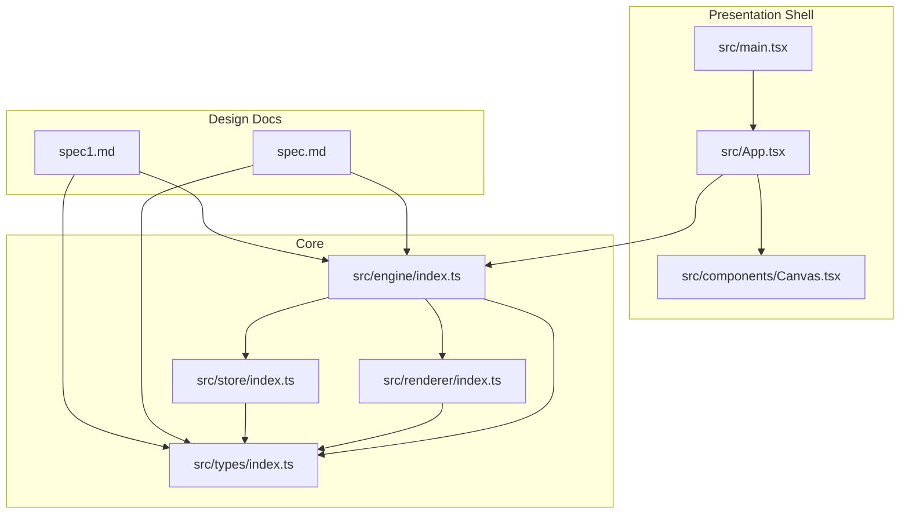

**Diagram sources**
- [src/main.tsx:1-10](file://src/main.tsx#L1-L10)
- [src/App.tsx:1-17](file://src/App.tsx#L1-L17)
- [src/components/Canvas.tsx:1-40](file://src/components/Canvas.tsx#L1-L40)
- [src/engine/index.ts:1-3](file://src/engine/index.ts#L1-L3)
- [src/renderer/index.ts:1-3](file://src/renderer/index.ts#L1-L3)
- [src/store/index.ts:1-2](file://src/store/index.ts#L1-L2)
- [src/types/index.ts:1-229](file://src/types/index.ts#L1-L229)
- [spec.md:231-279](file://spec.md#L231-L279)
- [spec1.md:184-198](file://spec1.md#L184-L198)

**Section sources**
- [README.md:1-3](file://README.md#L1-L3)
- [package.json:1-29](file://package.json#L1-L29)
- [src/main.tsx:1-10](file://src/main.tsx#L1-L10)
- [src/App.tsx:1-17](file://src/App.tsx#L1-L17)
- [src/components/Canvas.tsx:1-40](file://src/components/Canvas.tsx#L1-L40)
- [src/engine/index.ts:1-3](file://src/engine/index.ts#L1-L3)
- [src/renderer/index.ts:1-3](file://src/renderer/index.ts#L1-L3)
- [src/store/index.ts:1-2](file://src/store/index.ts#L1-L2)
- [src/types/index.ts:1-229](file://src/types/index.ts#L1-L229)
- [spec.md:231-279](file://spec.md#L231-L279)
- [spec1.md:184-198](file://spec1.md#L184-L198)

## Core Components
- Animation model and keyframes: Define animation segments with time-aligned keyframes and easing functions.
- Timeline: Central timekeeper with current time and duration, supporting play, pause, seek, and interpolation.
- Engine: Orchestrator that applies commands and updates the scene graph; playback is time-driven.
- Renderer: Pure function layer that renders elements based on computed state.
- Store: Editor state (viewport, selection, tool mode) separate from scene data.

Key capabilities derived from design docs:
- Play/pause/seek controls
- Multi-animation parallelism
- Keyframe interpolation
- Time-driven animation (not event-driven)
- requestAnimationFrame usage for playback loop

**Section sources**
- [src/types/index.ts:78-92](file://src/types/index.ts#L78-L92)
- [src/types/index.ts:198-219](file://src/types/index.ts#L198-L219)
- [spec.md:231-279](file://spec.md#L231-L279)
- [spec1.md:184-198](file://spec1.md#L184-L198)

## Architecture Overview
Animation playback is driven by a central Timeline that computes progress for each animation at each frame. The Engine coordinates command execution and state updates. The Renderer consumes the current scene state to produce UI updates.

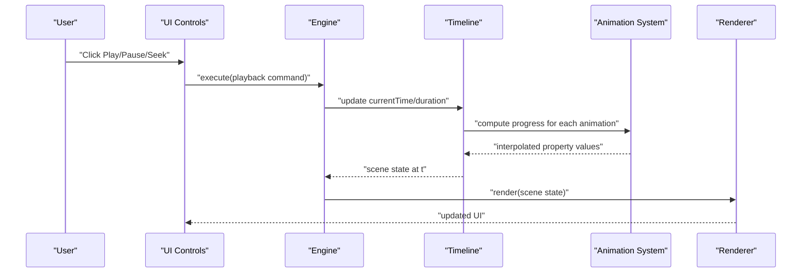

**Diagram sources**
- [spec.md:231-279](file://spec.md#L231-L279)
- [spec1.md:184-198](file://spec1.md#L184-L198)
- [src/engine/index.ts:1-3](file://src/engine/index.ts#L1-L3)
- [src/renderer/index.ts:1-3](file://src/renderer/index.ts#L1-L3)

## Detailed Component Analysis

### Animation Model and Keyframes
- Animation: Identified by an id, targets an element and a property, and is defined by a sequence of keyframes ordered by time.
- Keyframe: Contains time, target value, and easing function. Easing supports linear and common curves.
- Mock data demonstrates two animations: a positional animation and an opacity animation.

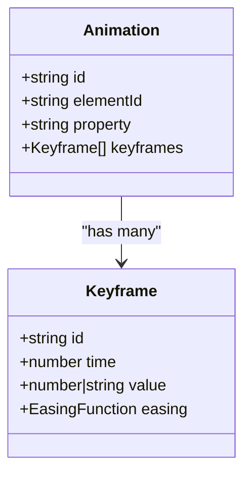

**Diagram sources**
- [src/types/index.ts:78-92](file://src/types/index.ts#L78-L92)
- [src/types/index.ts:80-85](file://src/types/index.ts#L80-L85)

**Section sources**
- [src/types/index.ts:78-92](file://src/types/index.ts#L78-L92)
- [src/types/index.ts:80-85](file://src/types/index.ts#L80-L85)
- [src/types/index.ts:198-219](file://src/types/index.ts#L198-L219)

### Timeline and Playback Loop
- Timeline holds current time and duration.
- Playback loop uses requestAnimationFrame to advance time and re-render.
- Interpolation computes property values per animation based on elapsed time and keyframes.

**Diagram sources**
- [spec.md:231-279](file://spec.md#L231-L279)
- [spec1.md:184-198](file://spec1.md#L184-L198)

**Section sources**
- [spec.md:231-279](file://spec.md#L231-L279)
- [spec1.md:184-198](file://spec1.md#L184-L198)

### Play/Pause/Stop Mechanisms
- Play: Start the requestAnimationFrame loop and increment currentTime until duration is reached.
- Pause: Stop advancing currentTime while retaining current position for resumption.
- Stop: Reset currentTime to the beginning and halt the loop.

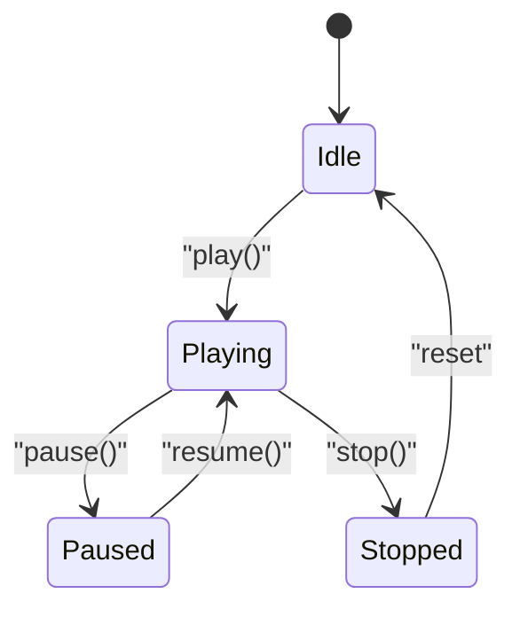

**Diagram sources**
- [spec.md:252-258](file://spec.md#L252-L258)

**Section sources**
- [spec.md:252-258](file://spec.md#L252-L258)

### Scrubbing Controls
- Seek: Jump currentTime to a specific time offset.
- Real-time scrubbing updates currentTime and triggers immediate re-render.
- UI scrubbing can be integrated with mouse/touch events to set currentTime proportionally.

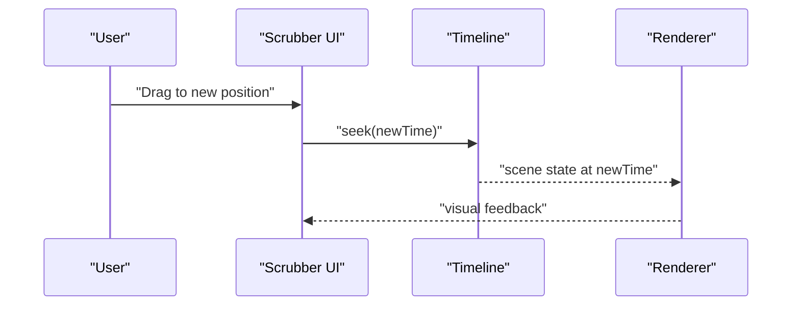

**Diagram sources**
- [spec.md:254-256](file://spec.md#L254-L256)

**Section sources**
- [spec.md:254-256](file://spec.md#L254-L256)

### Frame-by-Frame Playback
- Step forward/backward by fixed increments aligned to keyframe times or small time deltas.
- Useful for precise alignment with keyframes and fine-tuning.

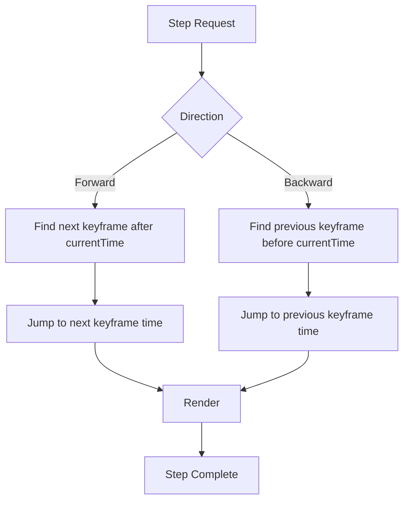

**Diagram sources**
- [spec.md:261-267](file://spec.md#L261-L267)

**Section sources**
- [spec.md:261-267](file://spec.md#L261-L267)

### Animation State Management and Progress Tracking
- Each animation computes progress as a normalized value based on its local start/duration window.
- Interpolation uses easing to compute smooth transitions between keyframes.
- Timeline aggregates interpolated values per element and property for rendering.

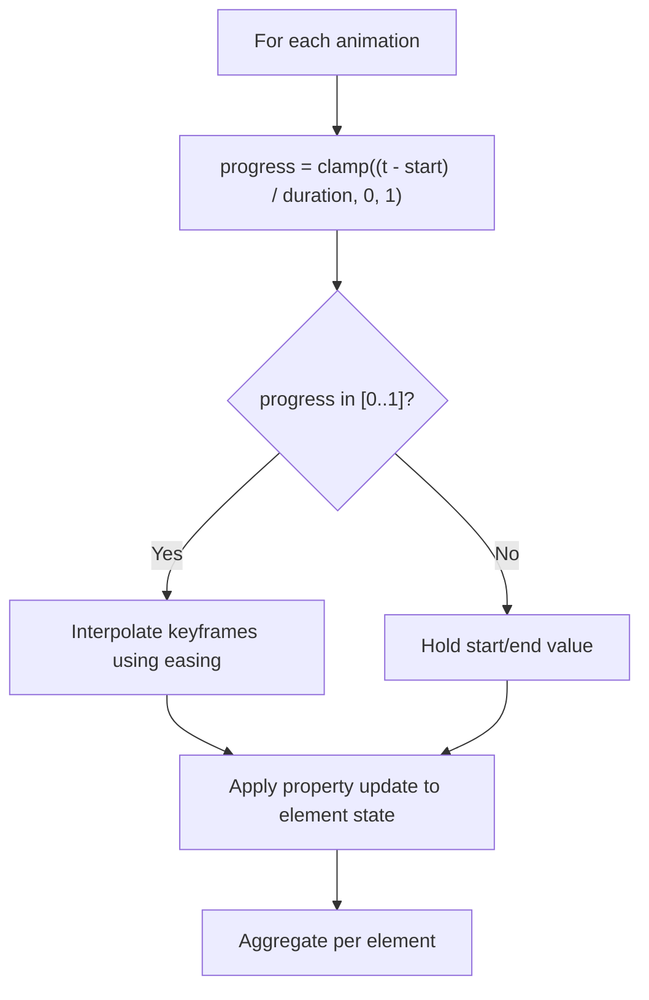

**Diagram sources**
- [spec.md:261-267](file://spec.md#L261-L267)
- [src/types/index.ts:78-92](file://src/types/index.ts#L78-L92)

**Section sources**
- [spec.md:261-267](file://spec.md#L261-L267)
- [src/types/index.ts:78-92](file://src/types/index.ts#L78-L92)

### Synchronization with User-Triggered Animations (Auto/Click)
- Auto animations: Triggered by timeline events or commands; playback advances automatically.
- Click-triggered animations: Start immediately upon user action; can be queued alongside auto animations.
- Engine ensures all animations are evaluated consistently against the shared timeline clock.

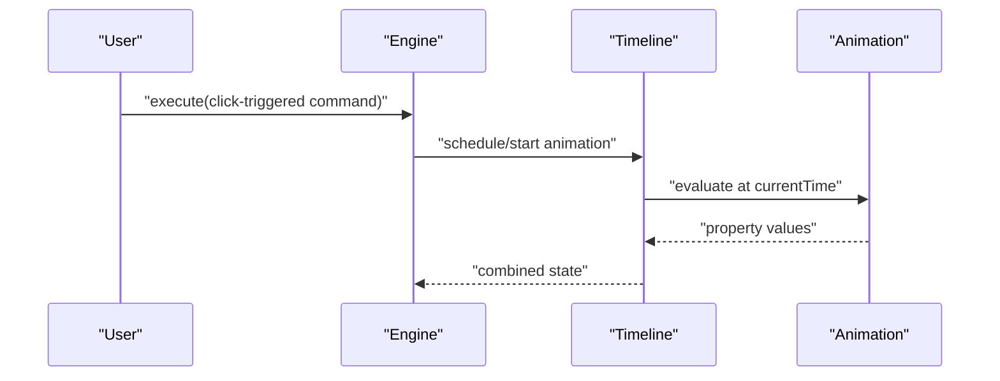

**Diagram sources**
- [src/engine/index.ts:1-3](file://src/engine/index.ts#L1-L3)
- [spec.md:231-279](file://spec.md#L231-L279)

**Section sources**
- [src/engine/index.ts:1-3](file://src/engine/index.ts#L1-L3)
- [spec.md:231-279](file://spec.md#L231-L279)

### Programmatic Animation Control
- Start playback programmatically by invoking play with desired duration and optional initial time.
- Pause/resume programmatically to synchronize with external events.
- Seek programmatically to jump to a specific time offset.
- Stop to reset playback and halt rendering updates.

Example snippet paths:
- [spec.md:252-258](file://spec.md#L252-L258)
- [spec.md:254-256](file://spec.md#L254-L256)

**Section sources**
- [spec.md:252-258](file://spec.md#L252-L258)
- [spec.md:254-256](file://spec.md#L254-L256)

### Event Handling for Playback Events
- Playback lifecycle events: start, tick, pause, resume, end.
- UI can subscribe to these events to update scrubber, timeline markers, and playback indicators.
- Events should be emitted after rendering to keep UI and scene state synchronized.

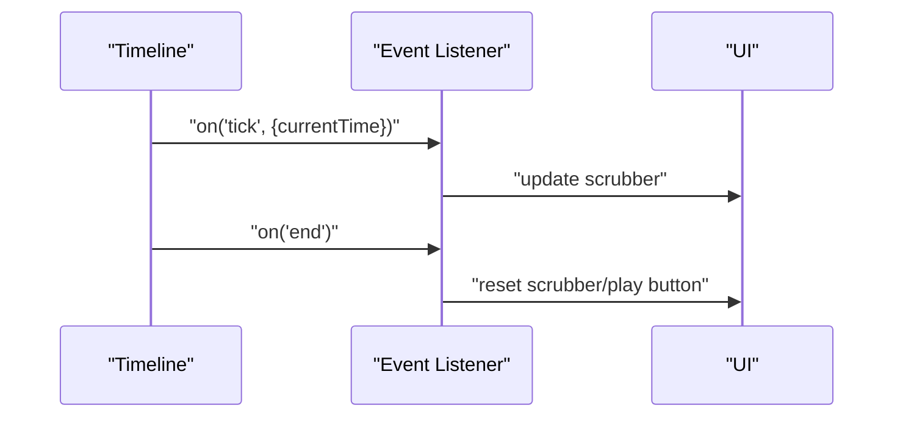

**Diagram sources**
- [spec.md:252-258](file://spec.md#L252-L258)

**Section sources**
- [spec.md:252-258](file://spec.md#L252-L258)

### Integration with the Timeline System
- Timeline is the single source of truth for time; all animations interpolate against it.
- Parallel animations are supported; each animation defines its own start/duration window.
- Rendering pipeline consumes the aggregated state computed by the timeline.

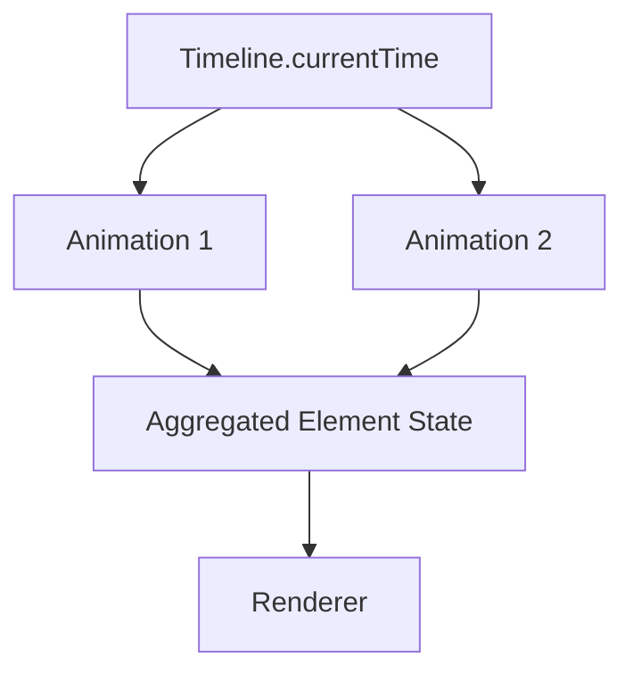

**Diagram sources**
- [spec.md:252-258](file://spec.md#L252-L258)
- [spec.md:261-267](file://spec.md#L261-L267)

**Section sources**
- [spec.md:252-258](file://spec.md#L252-L258)
- [spec.md:261-267](file://spec.md#L261-L267)

### Looping, Reverse Playback, Speed Control
- Looping: Reset currentTime to 0 upon reaching duration; optionally configurable per animation.
- Reverse playback: Run timeline backwards by setting negative delta time or reversing keyframe evaluation.
- Speed control: Scale delta time applied to currentTime to achieve slow/fast playback.

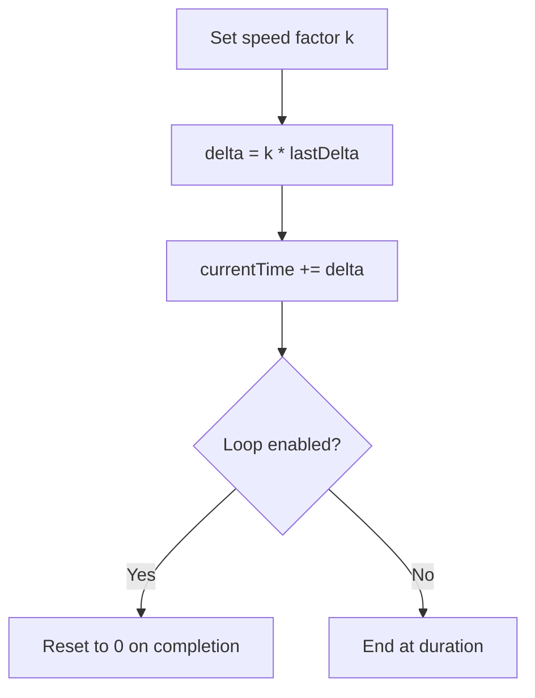

**Diagram sources**
- [spec.md:252-258](file://spec.md#L252-L258)

**Section sources**
- [spec.md:252-258](file://spec.md#L252-L258)

### Performance Considerations for Real-Time Playback
- Use requestAnimationFrame for smooth 60fps updates.
- Minimize layout thrashing by batching DOM writes and avoiding synchronous reads.
- Prefer pure functions in the renderer to enable efficient reconciliation.
- Defer expensive computations to idle callbacks or worker threads when possible.
- Throttle scrubbing updates to reduce render churn during user interaction.

[No sources needed since this section provides general guidance]

### Animation State Persistence and Recovery
- Persist timeline state: currentTime, duration, and any per-animation state (e.g., last evaluated keyframe).
- Persist animation definitions: keyframes, easing, and property targets.
- Recovery: Restore timeline and re-run interpolation from persisted currentTime to rebuild scene state.

[No sources needed since this section provides general guidance]

### Debugging Approaches for Playback Synchronization
- Log timeline ticks and currentTime changes to detect drift.
- Compare interpolated values per animation to expected keyframe values.
- Visualize keyframes and easing curves in a timeline overlay for verification.
- Temporarily disable non-essential rendering to isolate performance bottlenecks.

[No sources needed since this section provides general guidance]

## Dependency Analysis
The system exhibits clean separation of concerns:
- Engine depends on Timeline, Renderer, Store, and Types.
- Renderer depends on Types for element and state models.
- Store depends on Types for editor state.
- UI components depend on Engine and Renderer indirectly via application wiring.

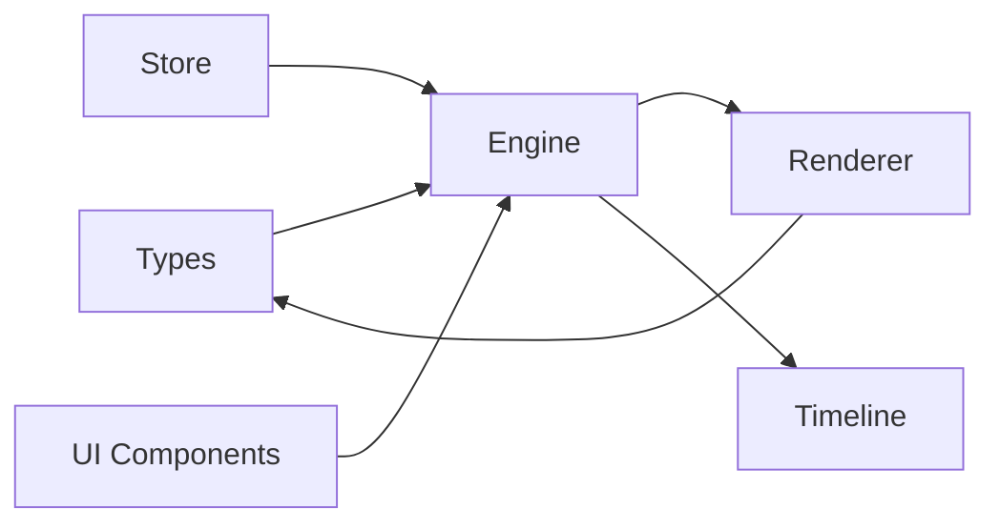

**Diagram sources**
- [src/engine/index.ts:1-3](file://src/engine/index.ts#L1-L3)
- [src/renderer/index.ts:1-3](file://src/renderer/index.ts#L1-L3)
- [src/store/index.ts:1-2](file://src/store/index.ts#L1-L2)
- [src/types/index.ts:1-229](file://src/types/index.ts#L1-L229)

**Section sources**
- [src/engine/index.ts:1-3](file://src/engine/index.ts#L1-L3)
- [src/renderer/index.ts:1-3](file://src/renderer/index.ts#L1-L3)
- [src/store/index.ts:1-2](file://src/store/index.ts#L1-L2)
- [src/types/index.ts:1-229](file://src/types/index.ts#L1-L229)

## Performance Considerations
- Use requestAnimationFrame for smooth playback.
- Keep interpolation math lightweight; precompute easing where possible.
- Avoid unnecessary re-renders by diffing state changes.
- Consider a Canvas renderer for heavy scenes in playback mode.

[No sources needed since this section provides general guidance]

## Troubleshooting Guide
- Playback drift: Verify delta time accumulation and clamp currentTime to [0, duration].
- Jittery scrubbing: Debounce UI events and batch render updates.
- Incorrect easing: Validate keyframe ordering and easing mapping.
- State desync: Ensure all animations interpolate against the shared timeline clock.

[No sources needed since this section provides general guidance]

## Conclusion
Animation Playback Control centers on a time-driven model with a central Timeline, deterministic keyframe interpolation, and a pure rendering pipeline. By separating concerns across Engine, Renderer, Store, and Types, and by adhering to design principles (data-first, time-driven, extensible), the system supports robust playback controls, user interaction, and scalable performance.

[No sources needed since this section summarizes without analyzing specific files]

## Appendices
- Example snippet paths for playback APIs:
  - [spec.md:252-258](file://spec.md#L252-L258)
  - [spec.md:254-256](file://spec.md#L254-L256)
  - [spec.md:261-267](file://spec.md#L261-L267)
- Example snippet paths for animation models:
  - [src/types/index.ts:78-92](file://src/types/index.ts#L78-L92)
  - [src/types/index.ts:198-219](file://src/types/index.ts#L198-L219)