# Animation Playback Control

<cite>
**Referenced Files in This Document**
- [README.md](file://README.md)
- [package.json](file://package.json)
- [src/main.tsx](file://src/main.tsx)
- [src/App.tsx](file://src/App.tsx)
- [src/components/Canvas.tsx](file://src/components/Canvas.tsx)
- [src/components/AnimationPanel.tsx](file://src/components/AnimationPanel.tsx)
- [src/components/PreviewModal.tsx](file://src/components/PreviewModal.tsx)
- [src/engine/index.ts](file://src/engine/index.ts)
- [src/renderer/index.ts](file://src/renderer/index.ts)
- [src/store/index.ts](file://src/store/index.ts)
- [src/types/index.ts](file://src/types/index.ts)
- [src/types/animation.ts](file://src/types/animation.ts)
- [src/animation/index.ts](file://src/animation/index.ts)
- [src/animation/engine.ts](file://src/animation/engine.ts)
- [src/animation/scheduler.ts](file://src/animation/scheduler.ts)
- [src/animation/buildKeyframes.ts](file://src/animation/buildKeyframes.ts)
- [spec.md](file://spec.md)
- [spec1.md](file://spec1.md)
</cite>

## Update Summary
**Changes Made**
- Enhanced step navigation system with bidirectional step controls
- Added real-time progress tracking with step progress indicators
- Implemented bidirectional step navigation support (previous/next step)
- Added step-based playback controls with visual progress indication
- Integrated step progress tracking in both main UI and preview modal
- Enhanced animation panel with step badges and relationship indicators

## Table of Contents
1. [Introduction](#introduction)
2. [Project Structure](#project-structure)
3. [Core Components](#core-components)
4. [Architecture Overview](#architecture-overview)
5. [Detailed Component Analysis](#detailed-component-analysis)
6. [Enhanced Step Navigation System](#enhanced-step-navigation-system)
7. [Real-time Progress Tracking](#real-time-progress-tracking)
8. [Bidirectional Step Navigation](#bidirectional-step-navigation)
9. [Dependency Analysis](#dependency-analysis)
10. [Performance Considerations](#performance-considerations)
11. [Troubleshooting Guide](#troubleshooting-guide)
12. [Conclusion](#conclusion)
13. [Appendices](#appendices)

## Introduction
This document describes the Animation Playback Control subsystem for a presentation editor. It focuses on managing animation execution states and user interaction, including play/pause/stop, scrubbing, and frame-by-frame playback. The system now features enhanced step navigation with bidirectional controls, real-time progress tracking, and improved user interaction patterns. It covers animation state management, progress tracking, synchronization with user-triggered animations (auto/click), programmatic control, event handling for playback events, integration with the timeline system, looping, reverse playback, speed control, performance considerations for real-time playback, state persistence/recovery, and debugging approaches for playback synchronization.

## Project Structure
The project follows a layered architecture with enhanced animation playback capabilities:
- Presentation shell: React app bootstrap and root component with step navigation controls
- Engine: Framework-agnostic core that orchestrates state changes via commands
- Renderer: Pure data-to-UI layer
- Store: Editor state separate from scene data
- Types: Shared data models for documents, slides, elements, animations, and keyframes
- Animation System: Enhanced with step-based playback, bidirectional navigation, and progress tracking
- Specs: Design docs that define the animation engine, timeline, and playback behaviors

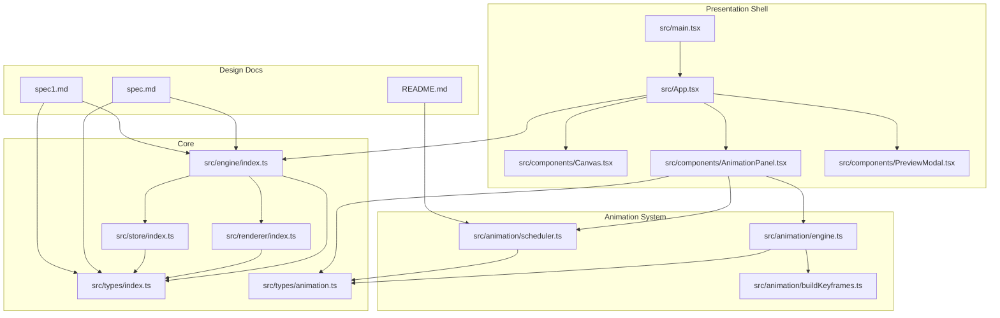
```mermaid
graph TB
subgraph "Presentation Shell"
MAIN["src/main.tsx"]
APP["src/App.tsx"]
CANVAS["src/components/Canvas.tsx"]
ANIM_PANEL["src/components/AnimationPanel.tsx"]
PREVIEW["src/components/PreviewModal.tsx"]
end
subgraph "Core"
ENGINE["src/engine/index.ts"]
RENDERER["src/renderer/index.ts"]
STORE["src/store/index.ts"]
TYPES["src/types/index.ts"]
ANIM_TYPES["src/types/animation.ts"]
end
subgraph "Animation System"
ANIM_ENGINE["src/animation/engine.ts"]
ANIM_SCHED["src/animation/scheduler.ts"]
BUILD_KEY["src/animation/buildKeyframes.ts"]
end
subgraph "Design Docs"
SPEC["spec.md"]
SPEC1["spec1.md"]
README["README.md"]
end
MAIN --> APP
APP --> CANVAS
APP --> ANIM_PANEL
APP --> PREVIEW
APP --> ENGINE
ENGINE --> RENDERER
ENGINE --> STORE
ENGINE --> TYPES
ANIM_PANEL --> ANIM_ENGINE
ANIM_PANEL --> ANIM_SCHED
ANIM_PANEL --> ANIM_TYPES
ANIM_ENGINE --> BUILD_KEY
ANIM_ENGINE --> ANIM_TYPES
ANIM_SCHED --> ANIM_TYPES
RENDERER --> TYPES
STORE --> TYPES
SPEC --> ENGINE
SPEC --> TYPES
SPEC1 --> ENGINE
SPEC1 --> TYPES
README --> ANIM_SCHED
```

**Diagram sources**
- [src/main.tsx:1-10](file://src/main.tsx#L1-L10)
- [src/App.tsx:1-330](file://src/App.tsx#L1-L330)
- [src/components/AnimationPanel.tsx:1-856](file://src/components/AnimationPanel.tsx#L1-L856)
- [src/components/PreviewModal.tsx:175-251](file://src/components/PreviewModal.tsx#L175-L251)
- [src/animation/engine.ts:1-120](file://src/animation/engine.ts#L1-L120)
- [src/animation/scheduler.ts:1-160](file://src/animation/scheduler.ts#L1-L160)
- [src/animation/buildKeyframes.ts:1-125](file://src/animation/buildKeyframes.ts#L1-L125)
- [src/types/animation.ts:1-113](file://src/types/animation.ts#L1-L113)

**Section sources**
- [README.md:1-15](file://README.md#L1-L15)
- [package.json:1-29](file://package.json#L1-L29)
- [src/main.tsx:1-10](file://src/main.tsx#L1-L10)
- [src/App.tsx:1-330](file://src/App.tsx#L1-L330)
- [src/components/AnimationPanel.tsx:1-856](file://src/components/AnimationPanel.tsx#L1-L856)
- [src/components/PreviewModal.tsx:175-251](file://src/components/PreviewModal.tsx#L175-L251)
- [src/animation/engine.ts:1-120](file://src/animation/engine.ts#L1-L120)
- [src/animation/scheduler.ts:1-160](file://src/animation/scheduler.ts#L1-L160)
- [src/animation/buildKeyframes.ts:1-125](file://src/animation/buildKeyframes.ts#L1-L125)
- [src/types/animation.ts:1-113](file://src/types/animation.ts#L1-L113)
- [spec.md:231-279](file://spec.md#L231-L279)
- [spec1.md:184-198](file://spec1.md#L184-L198)

## Core Components
- Animation model and keyframes: Define animation segments with time-aligned keyframes and easing functions.
- Timeline: Central timekeeper with current time and duration, supporting play, pause, seek, and interpolation.
- AnimationEngine: Orchestrator that applies commands and updates the scene graph; playback is time-driven.
- AnimationScheduler: Step-based playback controller with bidirectional navigation and progress tracking.
- Renderer: Pure function layer that renders elements based on computed state.
- Store: Editor state (viewport, selection, tool mode) separate from scene data.
- Step system: Enhanced with ClickStep and AnimationBatch structures for complex animation orchestration.

Key capabilities derived from design docs:
- Play/pause/seek controls
- Multi-animation parallelism
- Keyframe interpolation
- Time-driven animation (not event-driven)
- requestAnimationFrame usage for playback loop
- Step-based animation execution model
- Bidirectional step navigation
- Real-time progress tracking

**Section sources**
- [src/types/animation.ts:104-113](file://src/types/animation.ts#L104-L113)
- [src/animation/engine.ts:52-70](file://src/animation/engine.ts#L52-L70)
- [src/animation/scheduler.ts:56-160](file://src/animation/scheduler.ts#L56-L160)
- [src/types/index.ts:78-92](file://src/types/index.ts#L78-L92)
- [src/types/index.ts:198-219](file://src/types/index.ts#L198-L219)
- [spec.md:231-279](file://spec.md#L231-L279)
- [spec1.md:184-198](file://spec1.md#L184-L198)

## Architecture Overview
Animation playback is driven by a central Timeline that computes progress for each animation at each frame. The AnimationEngine coordinates command execution and state updates. The AnimationScheduler manages step-based playback with bidirectional navigation and progress tracking. The Renderer consumes the current scene state to produce UI updates.

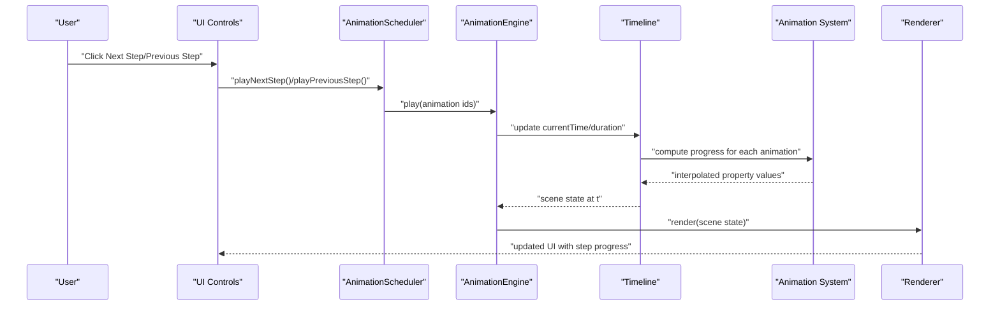
```mermaid
sequenceDiagram
participant User as "User"
participant UI as "UI Controls"
participant Scheduler as "AnimationScheduler"
participant Engine as "AnimationEngine"
participant Timeline as "Timeline"
participant Anim as "Animation System"
participant Render as "Renderer"
User->>UI : "Click Next Step/Previous Step"
UI->>Scheduler : "playNextStep()/playPreviousStep()"
Scheduler->>Engine : "play(animation ids)"
Engine->>Timeline : "update currentTime/duration"
Timeline->>Anim : "compute progress for each animation"
Anim-->>Timeline : "interpolated property values"
Timeline-->>Engine : "scene state at t"
Engine->>Render : "render(scene state)"
Render-->>UI : "updated UI with step progress"
```

**Diagram sources**
- [src/animation/scheduler.ts:72-137](file://src/animation/scheduler.ts#L72-L137)
- [src/animation/engine.ts:52-70](file://src/animation/engine.ts#L52-L70)
- [src/App.tsx:81-99](file://src/App.tsx#L81-L99)
- [src/components/PreviewModal.tsx:175-251](file://src/components/PreviewModal.tsx#L175-L251)

## Detailed Component Analysis

### Animation Model and Keyframes
- Animation: Identified by an id, targets an element and a property, and is defined by a sequence of keyframes ordered by time.
- Keyframe: Contains time, target value, and easing function. Easing supports linear and common curves.
- Mock data demonstrates two animations: a positional animation and an opacity animation.

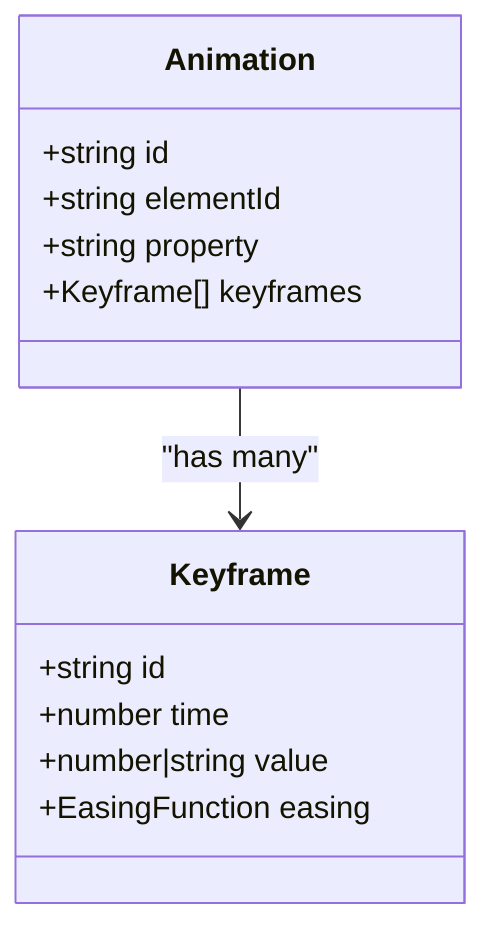
```mermaid
classDiagram
class Animation {
+string id
+string elementId
+string property
+Keyframe[] keyframes
}
class Keyframe {
+string id
+number time
+number|string value
+EasingFunction easing
}
Animation --> Keyframe : "has many"
```

**Diagram sources**
- [src/types/index.ts:78-92](file://src/types/index.ts#L78-L92)
- [src/types/index.ts:80-85](file://src/types/index.ts#L80-L85)

**Section sources**
- [src/types/index.ts:78-92](file://src/types/index.ts#L78-L92)
- [src/types/index.ts:80-85](file://src/types/index.ts#L80-L85)
- [src/types/index.ts:198-219](file://src/types/index.ts#L198-L219)

### Timeline and Playback Loop
- Timeline holds current time and duration.
- Playback loop uses requestAnimationFrame to advance time and re-render.
- Interpolation computes property values per animation based on elapsed time and keyframes.

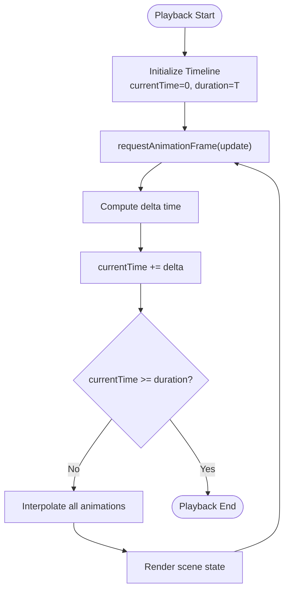
```mermaid
flowchart TD
Start(["Playback Start"]) --> Init["Initialize Timeline<br/>currentTime=0, duration=T"]
Init --> RAF["requestAnimationFrame(update)"]
RAF --> UpdateTime["Compute delta time"]
UpdateTime --> Advance["currentTime += delta"]
Advance --> Done{"currentTime >= duration?"}
Done --> |No| Interp["Interpolate all animations"]
Interp --> Render["Render scene state"]
Render --> RAF
Done --> |Yes| End(["Playback End"])
```

**Diagram sources**
- [spec.md:231-279](file://spec.md#L231-L279)
- [spec1.md:184-198](file://spec1.md#L184-L198)

**Section sources**
- [spec.md:231-279](file://spec.md#L231-L279)
- [spec1.md:184-198](file://spec1.md#L184-L198)

### Play/Pause/Stop Mechanisms
- Play: Start the requestAnimationFrame loop and increment currentTime until duration is reached.
- Pause: Stop advancing currentTime while retaining current position for resumption.
- Stop: Reset currentTime to the beginning and halt the loop.

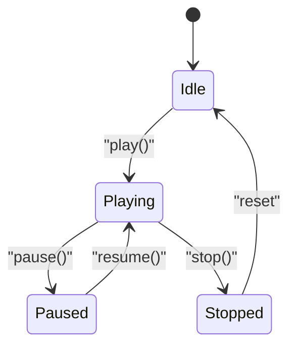
```mermaid
stateDiagram-v2
[*] --> Idle
Idle --> Playing : "play()"
Playing --> Paused : "pause()"
Paused --> Playing : "resume()"
Playing --> Stopped : "stop()"
Stopped --> Idle : "reset"
```

**Diagram sources**
- [spec.md:252-258](file://spec.md#L252-L258)

**Section sources**
- [spec.md:252-258](file://spec.md#L252-L258)

### Scrubbing Controls
- Seek: Jump currentTime to a specific time offset.
- Real-time scrubbing updates currentTime and triggers immediate re-render.
- UI scrubbing can be integrated with mouse/touch events to set currentTime proportionally.

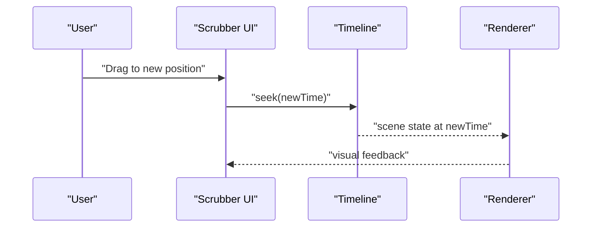
```mermaid
sequenceDiagram
participant User as "User"
participant Scrubber as "Scrubber UI"
participant Timeline as "Timeline"
participant Render as "Renderer"
User->>Scrubber : "Drag to new position"
Scrubber->>Timeline : "seek(newTime)"
Timeline-->>Render : "scene state at newTime"
Render-->>Scrubber : "visual feedback"
```

**Diagram sources**
- [spec.md:254-256](file://spec.md#L254-L256)

**Section sources**
- [spec.md:254-256](file://spec.md#L254-L256)

### Frame-by-Frame Playback
- Step forward/backward by fixed increments aligned to keyframe times or small time deltas.
- Useful for precise alignment with keyframes and fine-tuning.

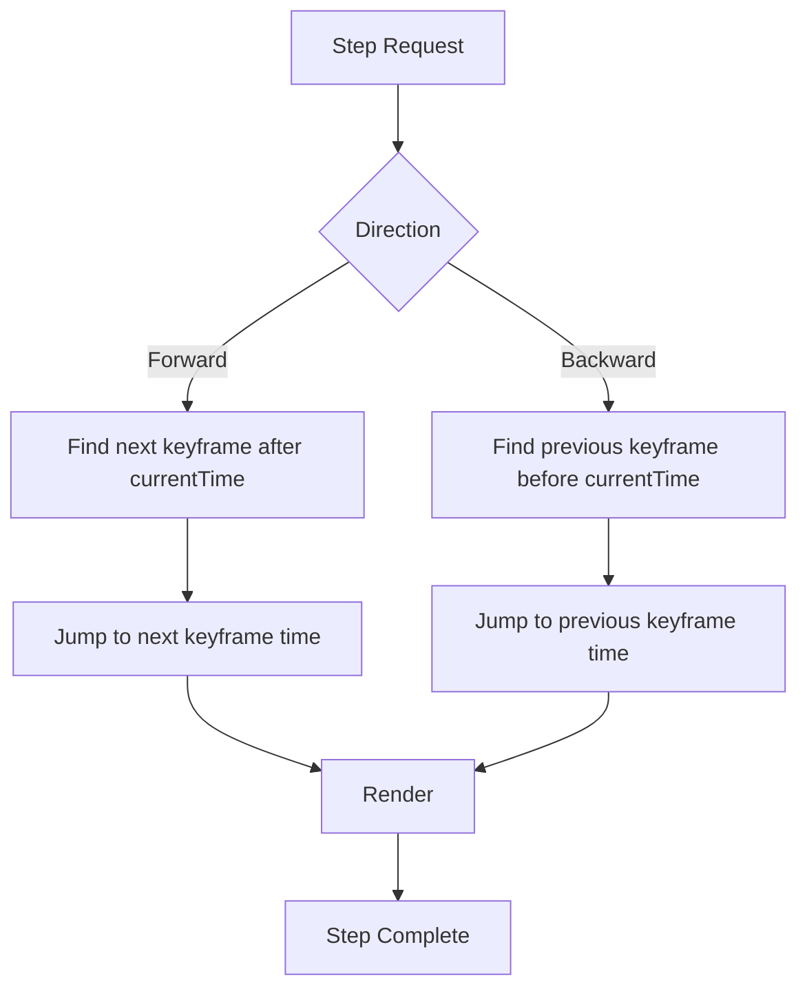
```mermaid
flowchart TD
StepStart["Step Request"] --> Direction{"Direction"}
Direction --> |Forward| NextKF["Find next keyframe after currentTime"]
Direction --> |Backward| PrevKF["Find previous keyframe before currentTime"]
NextKF --> JumpF["Jump to next keyframe time"]
PrevKF --> JumpB["Jump to previous keyframe time"]
JumpF --> Render["Render"]
JumpB --> Render
Render --> StepEnd["Step Complete"]
```

**Diagram sources**
- [spec.md:261-267](file://spec.md#L261-L267)

**Section sources**
- [spec.md:261-267](file://spec.md#L261-L267)

### Animation State Management and Progress Tracking
- Each animation computes progress as a normalized value based on its local start/duration window.
- Interpolation uses easing to compute smooth transitions between keyframes.
- Timeline aggregates interpolated values per element and property for rendering.

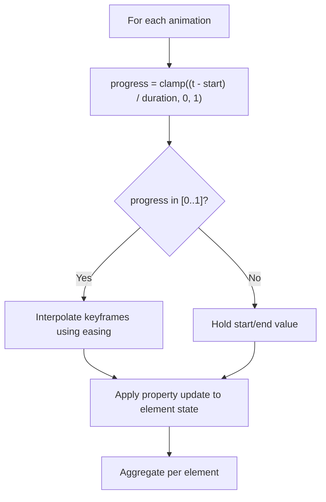
```mermaid
flowchart TD
A["For each animation"] --> B["progress = clamp((t - start) / duration, 0, 1)"]
B --> C{"progress in [0..1]?"}
C --> |Yes| D["Interpolate keyframes using easing"]
C --> |No| E["Hold start/end value"]
D --> F["Apply property update to element state"]
E --> F
F --> G["Aggregate per element"]
```

**Diagram sources**
- [spec.md:261-267](file://spec.md#L261-L267)
- [src/types/index.ts:78-92](file://src/types/index.ts#L78-L92)

**Section sources**
- [spec.md:261-267](file://spec.md#L261-L267)
- [src/types/index.ts:78-92](file://src/types/index.ts#L78-L92)

### Synchronization with User-Triggered Animations (Auto/Click)
- Auto animations: Triggered by timeline events or commands; playback advances automatically.
- Click-triggered animations: Start immediately upon user action; can be queued alongside auto animations.
- Engine ensures all animations are evaluated consistently against the shared timeline clock.

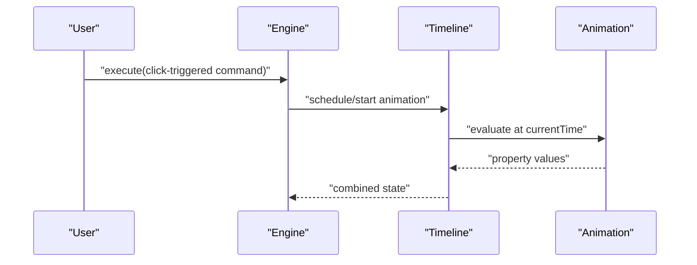
```mermaid
sequenceDiagram
participant User as "User"
participant Engine as "Engine"
participant Timeline as "Timeline"
participant Anim as "Animation"
User->>Engine : "execute(click-triggered command)"
Engine->>Timeline : "schedule/start animation"
Timeline->>Anim : "evaluate at currentTime"
Anim-->>Timeline : "property values"
Timeline-->>Engine : "combined state"
```

**Diagram sources**
- [src/engine/index.ts:1-3](file://src/engine/index.ts#L1-L3)
- [spec.md:231-279](file://spec.md#L231-L279)

**Section sources**
- [src/engine/index.ts:1-3](file://src/engine/index.ts#L1-L3)
- [spec.md:231-279](file://spec.md#L231-L279)

### Programmatic Animation Control
- Start playback programmatically by invoking play with desired duration and optional initial time.
- Pause/resume programmatically to synchronize with external events.
- Seek programmatically to jump to a specific time offset.
- Stop to reset playback and halt rendering updates.

Example snippet paths:
- [spec.md:252-258](file://spec.md#L252-L258)
- [spec.md:254-256](file://spec.md#L254-L256)

**Section sources**
- [spec.md:252-258](file://spec.md#L252-L258)
- [spec.md:254-256](file://spec.md#L254-L256)

### Event Handling for Playback Events
- Playback lifecycle events: start, tick, pause, resume, end.
- UI can subscribe to these events to update scrubber, timeline markers, and playback indicators.
- Events should be emitted after rendering to keep UI and scene state synchronized.

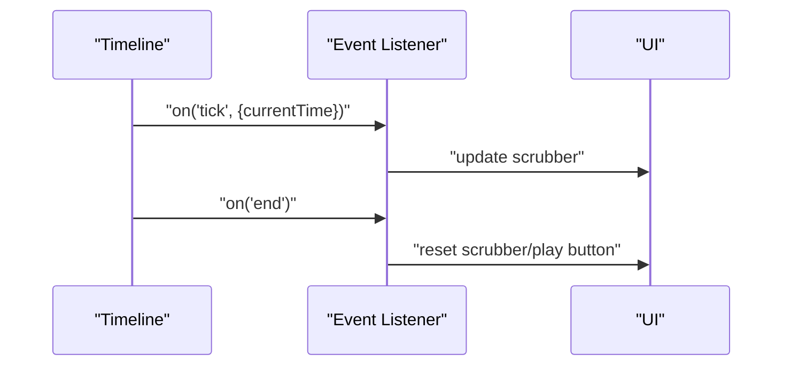
```mermaid
sequenceDiagram
participant Timeline as "Timeline"
participant Listener as "Event Listener"
participant UI as "UI"
Timeline->>Listener : "on('tick', {currentTime})"
Listener->>UI : "update scrubber"
Timeline->>Listener : "on('end')"
Listener->>UI : "reset scrubber/play button"
```

**Diagram sources**
- [spec.md:252-258](file://spec.md#L252-L258)

**Section sources**
- [spec.md:252-258](file://spec.md#L252-L258)

### Integration with the Timeline System
- Timeline is the single source of truth for time; all animations interpolate against it.
- Parallel animations are supported; each animation defines its own start/duration window.
- Rendering pipeline consumes the aggregated state computed by the timeline.

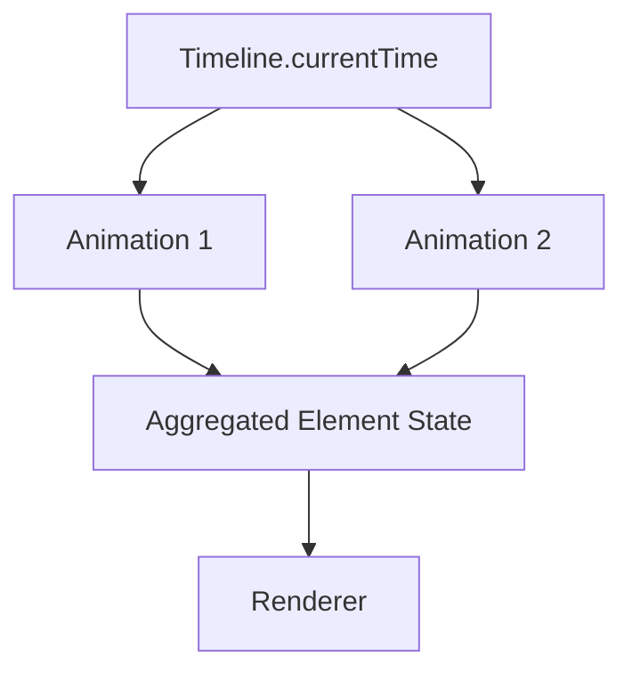
```mermaid
graph TB
TL["Timeline.currentTime"] --> A1["Animation 1"]
TL --> A2["Animation 2"]
A1 --> AGG["Aggregated Element State"]
A2 --> AGG
AGG --> RND["Renderer"]
```

**Diagram sources**
- [spec.md:252-258](file://spec.md#L252-L258)
- [spec.md:261-267](file://spec.md#L261-L267)

**Section sources**
- [spec.md:252-258](file://spec.md#L252-L258)
- [spec.md:261-267](file://spec.md#L261-L267)

### Looping, Reverse Playback, Speed Control
- Looping: Reset currentTime to 0 upon reaching duration; optionally configurable per animation.
- Reverse playback: Run timeline backwards by setting negative delta time or reversing keyframe evaluation.
- Speed control: Scale delta time applied to currentTime to achieve slow/fast playback.

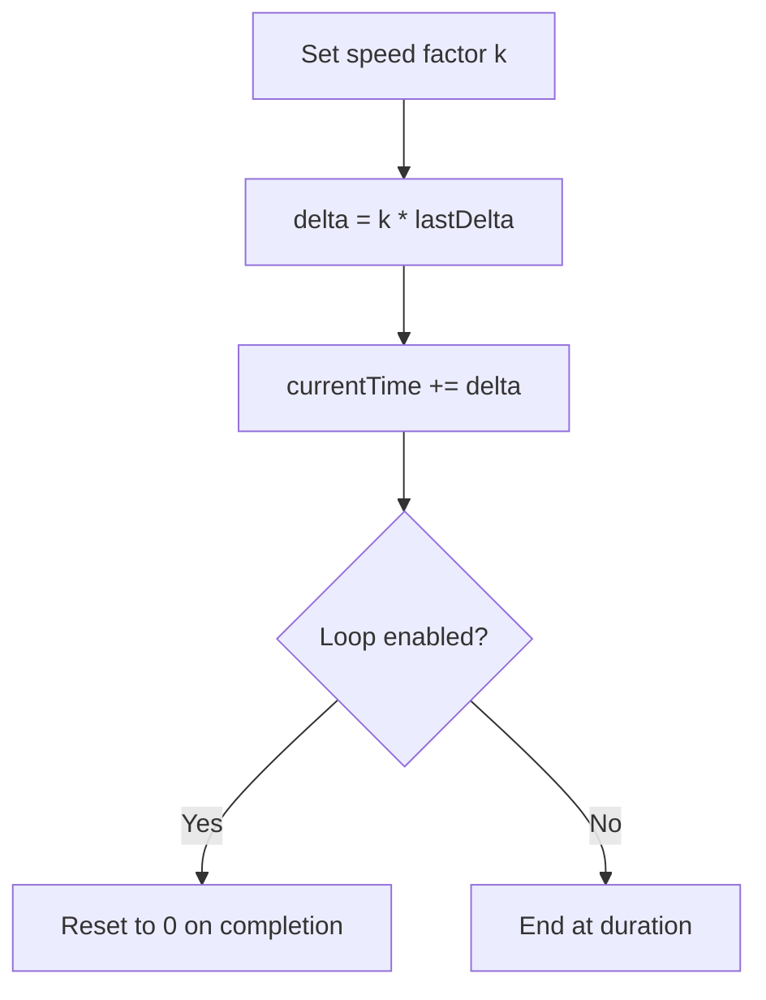
```mermaid
flowchart TD
S["Set speed factor k"] --> D["delta = k * lastDelta"]
D --> C["currentTime += delta"]
C --> L{"Loop enabled?"}
L --> |Yes| R["Reset to 0 on completion"]
L --> |No| E["End at duration"]
```

**Diagram sources**
- [spec.md:252-258](file://spec.md#L252-L258)

**Section sources**
- [spec.md:252-258](file://spec.md#L252-L258)

## Enhanced Step Navigation System

### Step-Based Animation Execution Model
The system now implements a sophisticated step-based animation execution model that organizes animations into logical sequences:

- **ClickStep**: Represents a user-triggered animation group that executes on a single click
- **AnimationBatch**: Sequential groups within a step that execute one after another
- **Parallel Animation Execution**: Multiple animations within the same batch execute simultaneously

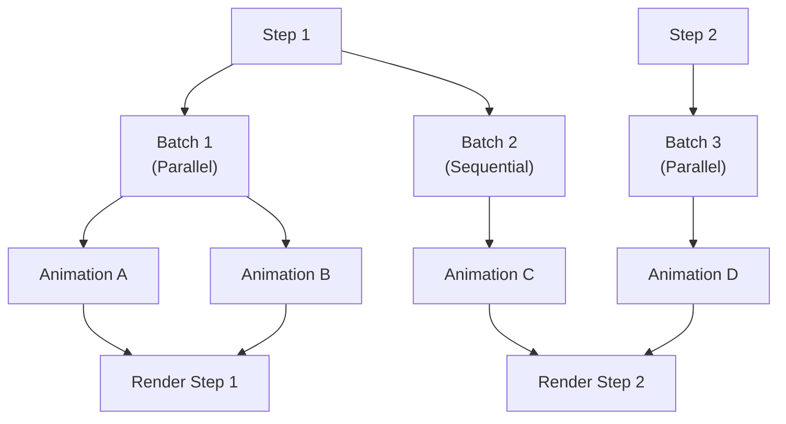
```mermaid
flowchart TD
Step1["Step 1"] --> Batch1["Batch 1<br/>(Parallel)"]
Step1 --> Batch2["Batch 2<br/>(Sequential)"]
Step2["Step 2"] --> Batch3["Batch 3<br/>(Parallel)"]
Batch1 --> AnimA["Animation A"]
Batch1 --> AnimB["Animation B"]
Batch2 --> AnimC["Animation C"]
Batch3 --> AnimD["Animation D"]
AnimA --> Render1["Render Step 1"]
AnimB --> Render1
AnimC --> Render2["Render Step 2"]
AnimD --> Render2
```

**Diagram sources**
- [src/animation/scheduler.ts:13-49](file://src/animation/scheduler.ts#L13-L49)
- [src/types/animation.ts:104-113](file://src/types/animation.ts#L104-L113)

**Section sources**
- [src/animation/scheduler.ts:13-49](file://src/animation/scheduler.ts#L13-L49)
- [src/types/animation.ts:104-113](file://src/types/animation.ts#L104-L113)

### Step Badge System
The animation panel now displays visual step indicators that help users understand the animation sequence:

- **Step Number Badges**: Circular badges showing the step number (1, 2, 3, ...)
- **Relationship Indicators**: Visual cues showing animation relationships:
  - Click: New step (▶)
  - With Previous: Same batch (↔)
  - After Previous: New batch (↓)

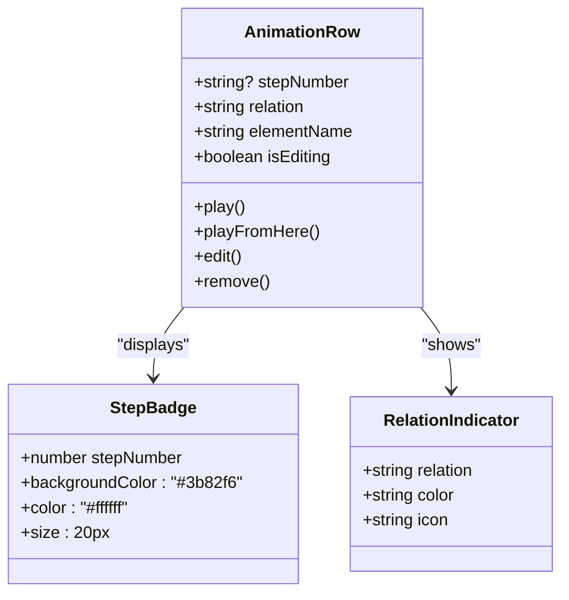
```mermaid
classDiagram
class AnimationRow {
+string? stepNumber
+string relation
+string elementName
+boolean isEditing
+play()
+playFromHere()
+edit()
+remove()
}
class StepBadge {
+number stepNumber
+backgroundColor : "#3b82f6"
+color : "#ffffff"
+size : 20px
}
class RelationIndicator {
+string relation
+string color
+string icon
}
AnimationRow --> StepBadge : "displays"
AnimationRow --> RelationIndicator : "shows"
```

**Diagram sources**
- [src/components/AnimationPanel.tsx:619-644](file://src/components/AnimationPanel.tsx#L619-L644)
- [src/components/AnimationPanel.tsx:641-644](file://src/components/AnimationPanel.tsx#L641-L644)

**Section sources**
- [src/components/AnimationPanel.tsx:619-644](file://src/components/AnimationPanel.tsx#L619-L644)
- [src/components/AnimationPanel.tsx:641-644](file://src/components/AnimationPanel.tsx#L641-L644)

## Real-time Progress Tracking

### Step Progress Indicators
The system provides real-time visual feedback on animation progress through multiple UI components:

- **Main Toolbar Progress**: Shows "Next Step (current/total)" in the main toolbar
- **Preview Modal Progress**: Displays step progress in the full-screen preview
- **Dynamic Button States**: Previous/Next buttons are enabled/disabled based on current position

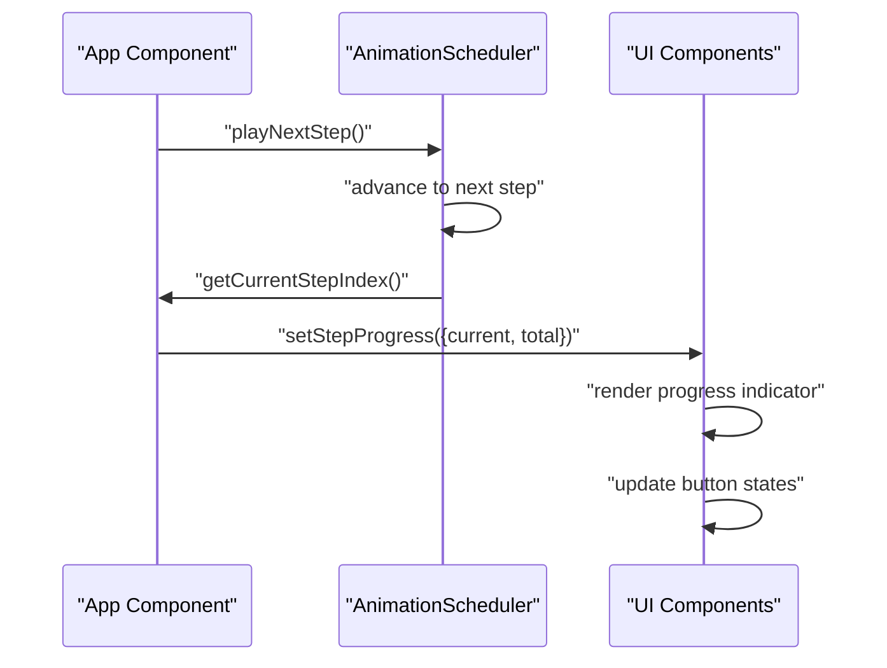
```mermaid
sequenceDiagram
participant App as "App Component"
participant Scheduler as "AnimationScheduler"
participant UI as "UI Components"
App->>Scheduler : "playNextStep()"
Scheduler->>Scheduler : "advance to next step"
Scheduler->>App : "getCurrentStepIndex()"
App->>UI : "setStepProgress({current, total})"
UI->>UI : "render progress indicator"
UI->>UI : "update button states"
```

**Diagram sources**
- [src/App.tsx:81-99](file://src/App.tsx#L81-L99)
- [src/App.tsx:244](file://src/App.tsx#L244)
- [src/animation/scheduler.ts:148-158](file://src/animation/scheduler.ts#L148-L158)

**Section sources**
- [src/App.tsx:81-99](file://src/App.tsx#L81-L99)
- [src/App.tsx:244](file://src/App.tsx#L244)
- [src/animation/scheduler.ts:148-158](file://src/animation/scheduler.ts#L148-L158)

### Progress State Management
The progress tracking system maintains state across different UI contexts:

- **stepProgress State**: Tracks current step and total steps
- **Scheduler Integration**: Directly queries the scheduler for current position
- **Automatic Updates**: Progress updates automatically when steps advance or go back

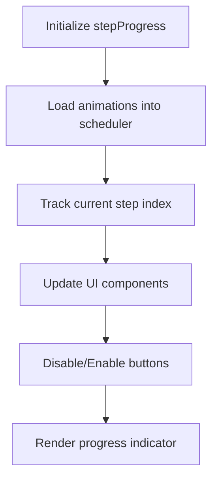
```mermaid
flowchart TD
Init["Initialize stepProgress"] --> Load["Load animations into scheduler"]
Load --> Track["Track current step index"]
Track --> Update["Update UI components"]
Update --> Disable["Disable/Enable buttons"]
Disable --> Render["Render progress indicator"]
```

**Diagram sources**
- [src/App.tsx:20-22](file://src/App.tsx#L20-L22)
- [src/App.tsx:47](file://src/App.tsx#L47)
- [src/App.tsx:84-87](file://src/App.tsx#L84-L87)

**Section sources**
- [src/App.tsx:20-22](file://src/App.tsx#L20-L22)
- [src/App.tsx:47](file://src/App.tsx#L47)
- [src/App.tsx:84-87](file://src/App.tsx#L84-L87)

## Bidirectional Step Navigation

### Previous Step Navigation
The system now supports backward navigation through animation steps:

- **playPreviousStep()**: Moves to the previous step and replays it
- **canGoBack()**: Checks if backward navigation is possible
- **Step Cancellation**: Automatically cancels running animations when going back
- **Replay Logic**: Re-executes the previous step when navigating backward

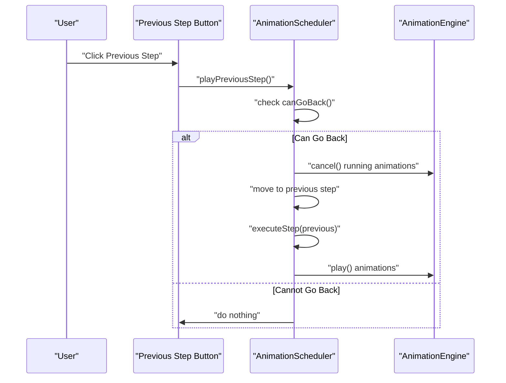
```mermaid
sequenceDiagram
participant User as "User"
participant UI as "Previous Step Button"
participant Scheduler as "AnimationScheduler"
participant Engine as "AnimationEngine"
User->>UI : "Click Previous Step"
UI->>Scheduler : "playPreviousStep()"
Scheduler->>Scheduler : "check canGoBack()"
alt Can Go Back
Scheduler->>Engine : "cancel() running animations"
Scheduler->>Scheduler : "move to previous step"
Scheduler->>Scheduler : "executeStep(previous)"
Scheduler->>Engine : "play() animations"
else Cannot Go Back
Scheduler->>UI : "do nothing"
end
```

**Diagram sources**
- [src/animation/scheduler.ts:115-133](file://src/animation/scheduler.ts#L115-L133)
- [src/App.tsx:91-99](file://src/App.tsx#L91-L99)
- [src/components/PreviewModal.tsx:202-218](file://src/components/PreviewModal.tsx#L202-L218)

**Section sources**
- [src/animation/scheduler.ts:115-133](file://src/animation/scheduler.ts#L115-L133)
- [src/App.tsx:91-99](file://src/App.tsx#L91-L99)
- [src/components/PreviewModal.tsx:202-218](file://src/components/PreviewModal.tsx#L202-L218)

### Step Navigation Controls
Multiple UI components provide step navigation:

- **Main Toolbar**: Previous/Next buttons with step progress display
- **Animation Panel**: Individual animation rows with "Play from here" functionality
- **Preview Modal**: Dedicated step navigation controls for full-screen preview
- **Keyboard Shortcuts**: Space/Enter for advance, Esc for exit

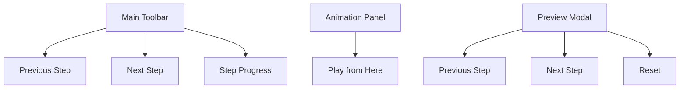
```mermaid
graph TB
Toolbar["Main Toolbar"] --> PrevBtn["Previous Step"]
Toolbar --> NextBtn["Next Step"]
Toolbar --> Progress["Step Progress"]
Panel["Animation Panel"] --> PlayFrom["Play from Here"]
Preview["Preview Modal"] --> PrevBtn2["Previous Step"]
Preview --> NextBtn2["Next Step"]
Preview --> Reset["Reset"]
```

**Diagram sources**
- [src/App.tsx:217-246](file://src/App.tsx#L217-L246)
- [src/components/AnimationPanel.tsx:278-302](file://src/components/AnimationPanel.tsx#L278-L302)
- [src/components/PreviewModal.tsx:175-251](file://src/components/PreviewModal.tsx#L175-L251)

**Section sources**
- [src/App.tsx:217-246](file://src/App.tsx#L217-L246)
- [src/components/AnimationPanel.tsx:278-302](file://src/components/AnimationPanel.tsx#L278-L302)
- [src/components/PreviewModal.tsx:175-251](file://src/components/PreviewModal.tsx#L175-L251)

### Step Execution Logic
The step navigation system handles complex execution scenarios:

- **Batch Execution**: Sequential execution within steps
- **Parallel Execution**: Simultaneous execution within batches
- **Animation Lifecycle**: Proper cleanup and cancellation of running animations
- **State Synchronization**: Maintains consistent state across navigation

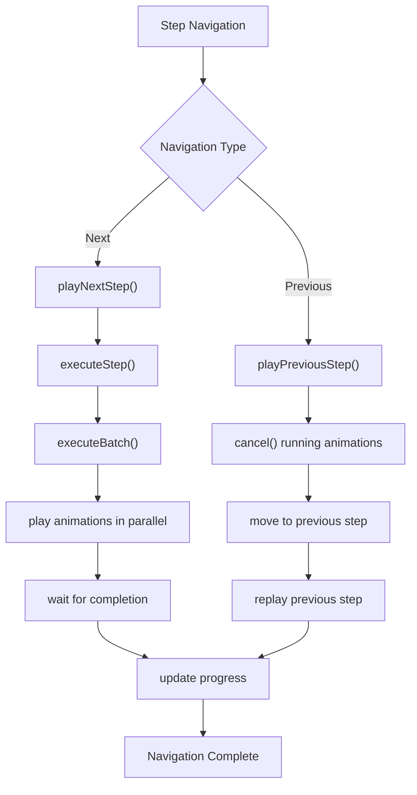
```mermaid
flowchart TD
Start["Step Navigation"] --> Check{"Navigation Type"}
Check --> |Next| NextStep["playNextStep()"]
Check --> |Previous| PrevStep["playPreviousStep()"]
NextStep --> Execute["executeStep()"]
PrevStep --> Cancel["cancel() running animations"]
Execute --> Batch["executeBatch()"]
Cancel --> Move["move to previous step"]
Batch --> Parallel["play animations in parallel"]
Parallel --> Finish["wait for completion"]
Move --> Replay["replay previous step"]
Finish --> Update["update progress"]
Replay --> Update
Update --> End["Navigation Complete"]
```

**Diagram sources**
- [src/animation/scheduler.ts:72-108](file://src/animation/scheduler.ts#L72-L108)
- [src/animation/scheduler.ts:115-133](file://src/animation/scheduler.ts#L115-L133)

**Section sources**
- [src/animation/scheduler.ts:72-108](file://src/animation/scheduler.ts#L72-L108)
- [src/animation/scheduler.ts:115-133](file://src/animation/scheduler.ts#L115-L133)

## Dependency Analysis
The system exhibits clean separation of concerns with enhanced step navigation capabilities:
- Engine depends on Timeline, Renderer, Store, and Types.
- AnimationEngine depends on AnimationAdapter and AnimationConfig.
- AnimationScheduler depends on AnimationEngine and manages step/batch execution.
- UI components depend on AnimationScheduler for step navigation.
- Renderer depends on Types for element and state models.
- Store depends on Types for editor state.

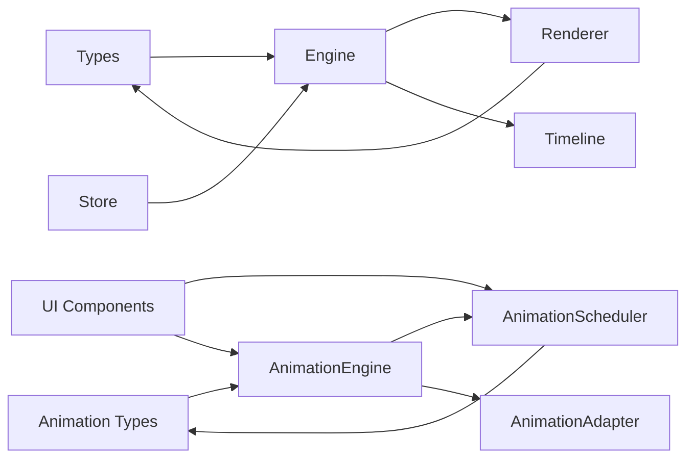
```mermaid
graph LR
Types["Types"] --> Engine["Engine"]
Store["Store"] --> Engine
Engine --> Renderer["Renderer"]
Engine --> Timeline["Timeline"]
AnimationTypes["Animation Types"] --> AnimationEngine["AnimationEngine"]
AnimationEngine --> AnimationScheduler["AnimationScheduler"]
AnimationEngine --> AnimationAdapter["AnimationAdapter"]
AnimationScheduler --> AnimationTypes
UI["UI Components"] --> AnimationScheduler
UI --> AnimationEngine
Renderer --> Types
```

**Diagram sources**
- [src/engine/index.ts:1-3](file://src/engine/index.ts#L1-L3)
- [src/renderer/index.ts:1-3](file://src/renderer/index.ts#L1-L3)
- [src/store/index.ts:1-2](file://src/store/index.ts#L1-L2)
- [src/types/index.ts:1-229](file://src/types/index.ts#L1-L229)
- [src/types/animation.ts:1-113](file://src/types/animation.ts#L1-L113)
- [src/animation/engine.ts:1-120](file://src/animation/engine.ts#L1-L120)
- [src/animation/scheduler.ts:1-160](file://src/animation/scheduler.ts#L1-L160)

**Section sources**
- [src/engine/index.ts:1-3](file://src/engine/index.ts#L1-L3)
- [src/renderer/index.ts:1-3](file://src/renderer/index.ts#L1-L3)
- [src/store/index.ts:1-2](file://src/store/index.ts#L1-L2)
- [src/types/index.ts:1-229](file://src/types/index.ts#L1-L229)
- [src/types/animation.ts:1-113](file://src/types/animation.ts#L1-L113)
- [src/animation/engine.ts:1-120](file://src/animation/engine.ts#L1-L120)
- [src/animation/scheduler.ts:1-160](file://src/animation/scheduler.ts#L1-L160)

## Performance Considerations
- Use requestAnimationFrame for smooth playback.
- Keep interpolation math lightweight; precompute easing where possible.
- Avoid unnecessary re-renders by diffing state changes.
- Consider a Canvas renderer for heavy scenes in playback mode.
- **Enhanced**: Step-based execution reduces animation overhead by grouping related animations.
- **Enhanced**: Bidirectional navigation cancels running animations efficiently to prevent resource leaks.

## Troubleshooting Guide
- Playback drift: Verify delta time accumulation and clamp currentTime to [0, duration].
- Jittery scrubbing: Debounce UI events and batch render updates.
- Incorrect easing: Validate keyframe ordering and easing mapping.
- State desync: Ensure all animations interpolate against the shared timeline clock.
- **Enhanced**: Step navigation issues: Check step boundaries and batch execution order.
- **Enhanced**: Progress tracking problems: Verify step count calculation and current index updates.
- **Enhanced**: Bidirectional navigation failures: Ensure proper animation cancellation and replay logic.

## Conclusion
Animation Playback Control centers on a time-driven model with a central Timeline, deterministic keyframe interpolation, and a pure rendering pipeline. The enhanced system now features sophisticated step-based playback with bidirectional navigation, real-time progress tracking, and improved user interaction patterns. By separating concerns across Engine, AnimationEngine, AnimationScheduler, Renderer, Store, and Types, and by adhering to design principles (data-first, time-driven, extensible), the system supports robust playback controls, user interaction, scalable performance, and seamless step-based animation orchestration.

## Appendices
- Example snippet paths for playback APIs:
  - [spec.md:252-258](file://spec.md#L252-L258)
  - [spec.md:254-256](file://spec.md#L254-L256)
  - [spec.md:261-267](file://spec.md#L261-L267)
- Example snippet paths for animation models:
  - [src/types/index.ts:78-92](file://src/types/index.ts#L78-L92)
  - [src/types/index.ts:198-219](file://src/types/index.ts#L198-L219)
- **Enhanced**: Step navigation APIs:
  - [src/animation/scheduler.ts:72-137](file://src/animation/scheduler.ts#L72-L137)
  - [src/animation/scheduler.ts:148-158](file://src/animation/scheduler.ts#L148-L158)
- **Enhanced**: Progress tracking implementation:
  - [src/App.tsx:20-22](file://src/App.tsx#L20-L22)
  - [src/App.tsx:84-87](file://src/App.tsx#L84-L87)
- **Enhanced**: Animation panel step badges:
  - [src/components/AnimationPanel.tsx:619-644](file://src/components/AnimationPanel.tsx#L619-L644)