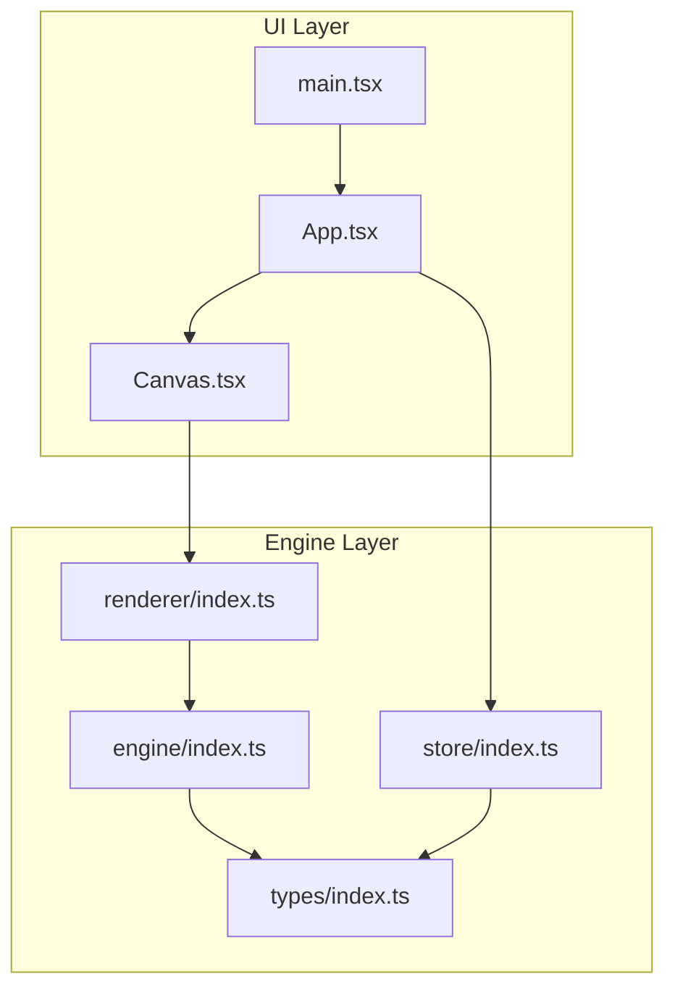
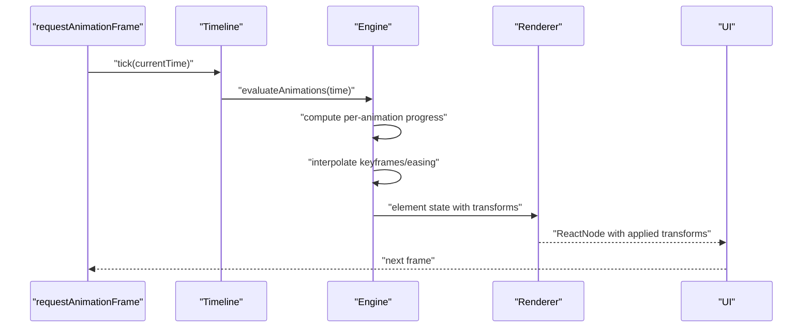
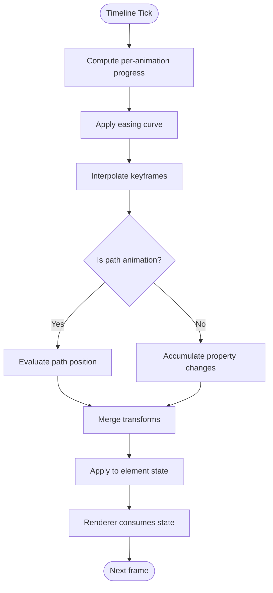
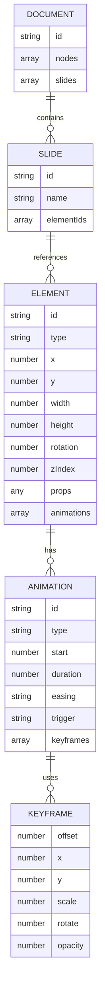
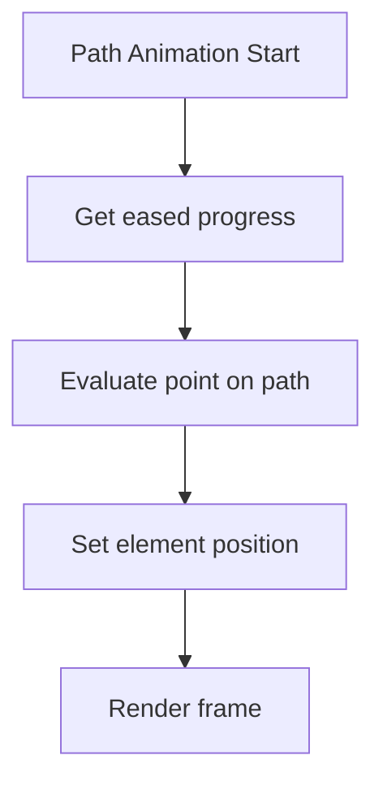
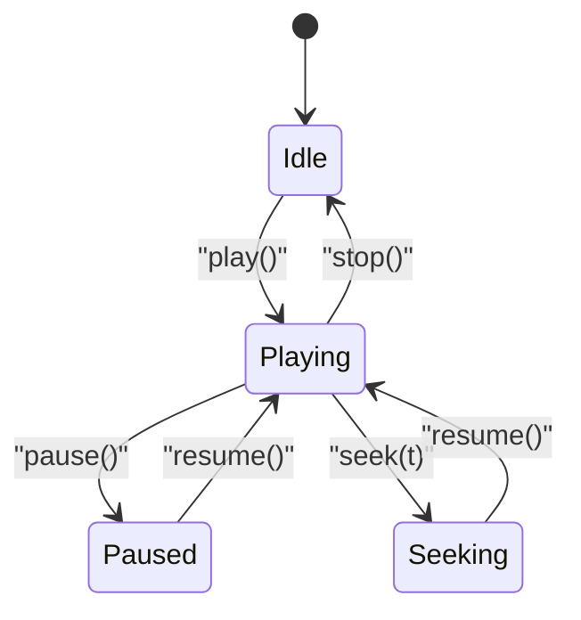
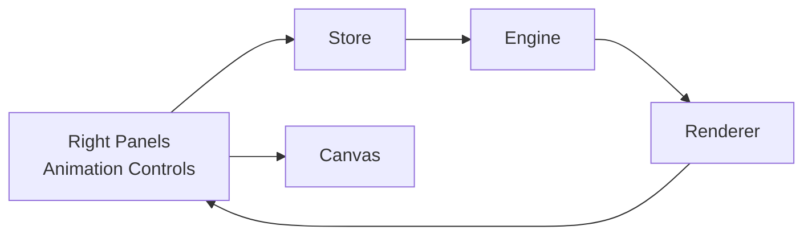
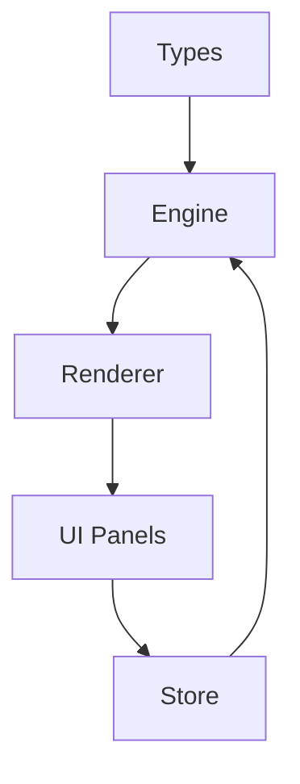

# Animation System

<cite>
**Referenced Files in This Document**
- [spec.md](file://spec.md)
- [spec1.md](file://spec1.md)
- [src/engine/index.ts](file://src/engine/index.ts)
- [src/renderer/index.ts](file://src/renderer/index.ts)
- [src/store/index.ts](file://src/store/index.ts)
- [src/types/index.ts](file://src/types/index.ts)
- [src/components/Canvas.tsx](file://src/components/Canvas.tsx)
- [src/App.tsx](file://src/App.tsx)
- [src/main.tsx](file://src/main.tsx)
- [package.json](file://package.json)
</cite>

## Table of Contents
1. [Introduction](#introduction)
2. [Project Structure](#project-structure)
3. [Core Components](#core-components)
4. [Architecture Overview](#architecture-overview)
5. [Detailed Component Analysis](#detailed-component-analysis)
6. [Dependency Analysis](#dependency-analysis)
7. [Performance Considerations](#performance-considerations)
8. [Troubleshooting Guide](#troubleshooting-guide)
9. [Conclusion](#conclusion)
10. [Appendices](#appendices)

## Introduction
This document describes the Animation System for a timeline-based animation engine integrated into a React-based editor. It covers the timeline engine architecture, keyframe interpolation, animation playback control, path animation with control points, coordination with the scene graph, transform application over time, and integration with user-triggered animations (auto/click). It also provides guidance on setting up keyframes, configuring timing and easing, previewing animations, performance considerations, memory management, serialization, synchronization, and debugging.

## Project Structure
The project follows a layered architecture:
- UI layer: React components and application shell
- Core engine layer: Engine, Scene Graph, Timeline, Renderer, and optional plugin system
- Types and shared definitions
- Build and runtime configuration

**Diagram sources**
- [src/App.tsx:1-17](file://src/App.tsx#L1-L17)
- [src/main.tsx:1-10](file://src/main.tsx#L1-L10)
- [src/components/Canvas.tsx:1-40](file://src/components/Canvas.tsx#L1-L40)
- [src/engine/index.ts:1-3](file://src/engine/index.ts#L1-L3)
- [src/renderer/index.ts:1-3](file://src/renderer/index.ts#L1-L3)
- [src/store/index.ts:1-2](file://src/store/index.ts#L1-L2)
- [src/types/index.ts:1-2](file://src/types/index.ts#L1-L2)

**Section sources**
- [src/App.tsx:1-17](file://src/App.tsx#L1-L17)
- [src/main.tsx:1-10](file://src/main.tsx#L1-L10)
- [src/components/Canvas.tsx:1-40](file://src/components/Canvas.tsx#L1-L40)
- [src/engine/index.ts:1-3](file://src/engine/index.ts#L1-L3)
- [src/renderer/index.ts:1-3](file://src/renderer/index.ts#L1-L3)
- [src/store/index.ts:1-2](file://src/store/index.ts#L1-L2)
- [src/types/index.ts:1-2](file://src/types/index.ts#L1-L2)

## Core Components
- Scene Graph and Data Model: Defines documents, slides, elements, animations, and keyframes. Elements carry transforms and optional animation arrays.
- Animation Types: Support entrance, emphasis, and path animations with start time, duration, easing, optional trigger (auto/click), and optional keyframes.
- Timeline Engine: Driven by time, supports play/pause/seek, and computes per-animation progress to interpolate properties.
- Renderer: Pure function mapping element state to UI; applies transforms (x, y, scale, rotate, opacity) during render.
- Engine Core: Central orchestrator that coordinates scene updates, history, and timeline-driven animation evaluation.
- Store: Editor state separate from scene data; integrates with UI panels and controls.

Key data model references:
- Element with optional animations array
- Animation with timing, easing, trigger, and optional keyframes
- Keyframe with numeric offset and partial transform/opacity props
- Timeline with current time and duration

**Section sources**
- [spec.md:47-134](file://spec.md#L47-L134)
- [spec.md:216-229](file://spec.md#L216-L229)
- [spec.md:231-279](file://spec.md#L231-L279)
- [spec.md:281-307](file://spec.md#L281-L307)
- [spec1.md:64-165](file://spec1.md#L64-L165)

## Architecture Overview
The animation pipeline is time-driven and data-centric:
- Timeline advances time via requestAnimationFrame
- For each element with animations, compute normalized progress per animation
- Interpolate properties using easing and keyframes
- Apply interpolated transforms to the element
- Renderer renders the transformed element

**Diagram sources**
- [spec.md:226-227](file://spec.md#L226-L227)
- [spec.md:261-267](file://spec.md#L261-L267)
- [spec1.md:184-197](file://spec1.md#L184-L197)

## Detailed Component Analysis

### Timeline Engine
Responsibilities:
- Track current time and total duration
- Playback control: play, pause, seek
- Compute per-animation progress: progress = clamp((time - start) / duration, 0..1)
- Coordinate with animation evaluation loop

Interpolation and easing:
- Normalize progress per animation
- Apply easing curve to progress
- Interpolate keyframes using the eased progress
- Combine multiple animations’ contributions to final property values

Path animation:
- Evaluate position along SVG path at eased progress
- Apply resulting position as element transform

User-triggered animations:
- Auto-triggered animations start automatically when their start time is reached
- Click-triggered animations start on user interaction events

Preview and synchronization:
- Timeline controls all animation playback
- Synchronize multiple animations by aligning their start/duration windows

**Diagram sources**
- [spec.md:252-258](file://spec.md#L252-L258)
- [spec.md:261-267](file://spec.md#L261-L267)
- [spec.md:281-307](file://spec.md#L281-L307)

**Section sources**
- [spec.md:231-279](file://spec.md#L231-L279)
- [spec.md:281-307](file://spec.md#L281-L307)
- [spec1.md:184-197](file://spec1.md#L184-L197)

### Scene Graph and Transform Application
Scene Graph:
- Document, Slide, Element, Animation, Keyframe types define the hierarchical structure
- Elements store geometry, transforms, z-index, and optional animation arrays
- Animations reference keyframes and timing/easing/trigger

Transform application:
- Renderer reads element state and applies transforms (x, y, scale, rotate, opacity)
- Transforms are computed by the engine based on timeline evaluation

**Diagram sources**
- [spec.md:47-134](file://spec.md#L47-L134)

**Section sources**
- [spec.md:47-134](file://spec.md#L47-L134)

### Path Animation Implementation
Path animation uses SVG path geometry:
- Path string defines trajectory
- At each frame, evaluate position along the path using eased progress
- Apply resulting position as element transform
- Supports interactive editing via SVG overlay and control point dragging

**Diagram sources**
- [spec.md:281-307](file://spec.md#L281-L307)

**Section sources**
- [spec.md:281-307](file://spec.md#L281-L307)

### Animation Playback Control
Playback control includes:
- Play/Pause: start/stop the timeline loop
- Seek: jump to a specific time
- Multiple animations: parallel evaluation with independent timing windows
- Trigger modes: auto (time-based) and click (event-based)

**Diagram sources**
- [spec.md:252-258](file://spec.md#L252-L258)
- [spec1.md:184-197](file://spec1.md#L184-L197)

**Section sources**
- [spec.md:252-258](file://spec.md#L252-L258)
- [spec1.md:184-197](file://spec1.md#L184-L197)

### Integration with UI Panels and Rendering
- Right-side panels expose animation controls (type, timing, keyframes)
- Store holds editor state separate from scene data
- Renderer is a pure function mapping element state to React nodes
- Canvas component hosts the editor surface

**Diagram sources**
- [src/components/Canvas.tsx:1-40](file://src/components/Canvas.tsx#L1-L40)
- [src/store/index.ts:1-2](file://src/store/index.ts#L1-L2)
- [src/renderer/index.ts:1-3](file://src/renderer/index.ts#L1-L3)
- [spec.md:190-214](file://spec.md#L190-L214)

**Section sources**
- [src/components/Canvas.tsx:1-40](file://src/components/Canvas.tsx#L1-L40)
- [src/store/index.ts:1-2](file://src/store/index.ts#L1-L2)
- [src/renderer/index.ts:1-3](file://src/renderer/index.ts#L1-L3)
- [spec.md:190-214](file://spec.md#L190-L214)

## Dependency Analysis
- Engine depends on types for scene graph and animation structures
- Renderer depends on engine-provided element state and applies transforms
- Store provides editor state consumed by UI and engine
- UI components depend on store and renderer for presentation

**Diagram sources**
- [src/types/index.ts:1-2](file://src/types/index.ts#L1-L2)
- [src/engine/index.ts:1-3](file://src/engine/index.ts#L1-L3)
- [src/renderer/index.ts:1-3](file://src/renderer/index.ts#L1-L3)
- [src/store/index.ts:1-2](file://src/store/index.ts#L1-L2)

**Section sources**
- [src/types/index.ts:1-2](file://src/types/index.ts#L1-L2)
- [src/engine/index.ts:1-3](file://src/engine/index.ts#L1-L3)
- [src/renderer/index.ts:1-3](file://src/renderer/index.ts#L1-L3)
- [src/store/index.ts:1-2](file://src/store/index.ts#L1-L2)

## Performance Considerations
- Use requestAnimationFrame for smooth playback aligned with the display refresh rate
- Minimize layout thrashing by batching transform updates and avoiding forced synchronous layouts
- Prefer pure functional rendering to reduce re-renders; rely on stable keys and shallow comparisons
- Limit the number of concurrent animations and avoid deep nested hierarchies when possible
- Cache intermediate interpolation results per animation tick to avoid recomputation
- Defer expensive operations off the main thread if needed (Web Workers for heavy computations)
- Use efficient easing curves and keep keyframe counts reasonable to reduce interpolation overhead

## Troubleshooting Guide
Common issues and remedies:
- Animations not playing: verify timeline is running and currentTime is advancing; check animation start/duration alignment
- Incorrect easing or interpolation: confirm easing curve selection and keyframe offsets are within [0, 1]; validate interpolation logic
- Path animation misalignment: ensure path string is valid SVG path data and control points are correctly placed
- Trigger not firing: for click-triggered animations, ensure event handlers are attached and engine.execute is invoked on interaction
- Rendering artifacts: confirm transforms are applied in the correct order (translate/scale/rotate) and renderer is pure

Debugging tips:
- Log timeline ticks and per-animation progress to identify timing issues
- Visualize keyframes and easing curves in the animation panel
- Inspect element state before and after transform application
- Use devtools to profile animation frames and identify bottlenecks

## Conclusion
The Animation System is designed around a time-driven, data-centric architecture. The Timeline Engine evaluates animations per frame, interpolates properties using keyframes and easing, and applies transforms to elements. The Renderer remains pure and focused on transforming element state into UI. With proper configuration of keyframes, timing, and easing, and by following performance and debugging practices, the system delivers smooth, predictable animation playback synchronized with the scene graph and user interactions.

## Appendices

### Setting Up Keyframes and Timing
- Define animations on elements with start time, duration, and easing
- Configure keyframes with offsets and target property values
- Choose trigger mode: auto (time-based) or click (event-based)
- Preview animations using timeline controls

References:
- [spec.md:107-134](file://spec.md#L107-L134)
- [spec.md:231-279](file://spec.md#L231-L279)

### Path Animation Setup
- Provide SVG path data for path animations
- Edit path and control points in the overlay
- Evaluate path positions at eased progress to drive motion

References:
- [spec.md:281-307](file://spec.md#L281-L307)

### Serialization and Synchronization
- Serialize scene graph, animations, and keyframes for persistence
- Synchronize playback across multiple animations by aligning timing windows
- Maintain consistent state via the engine’s command system and history

References:
- [spec1.md:64-165](file://spec1.md#L64-L165)
- [spec1.md:184-197](file://spec1.md#L184-L197)

### Build and Runtime
- React and Vite configuration for development and production builds
- requestAnimationFrame-based animation loop

References:
- [package.json:1-29](file://package.json#L1-L29)
- [spec.md:226-227](file://spec.md#L226-L227)