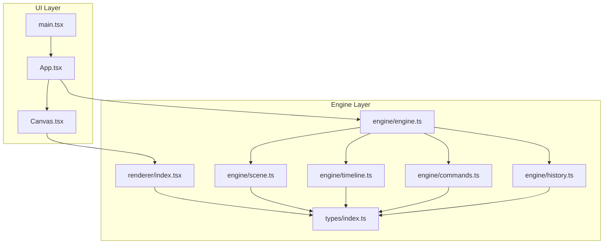
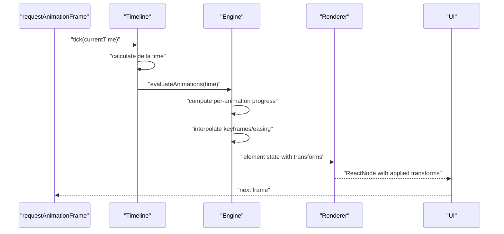
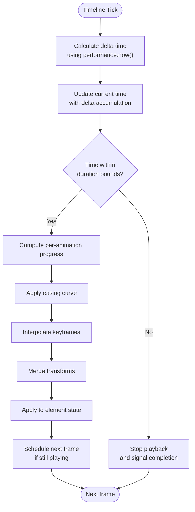
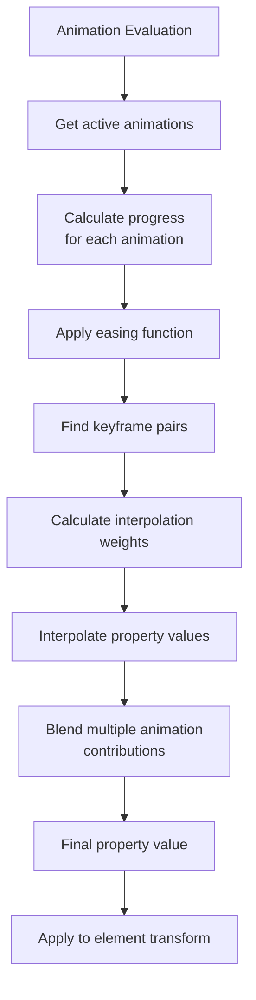
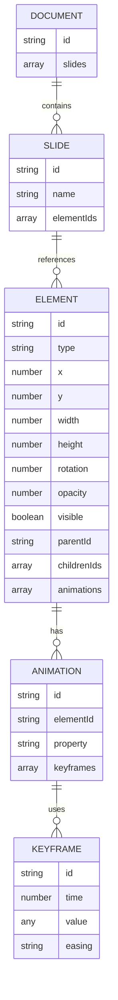
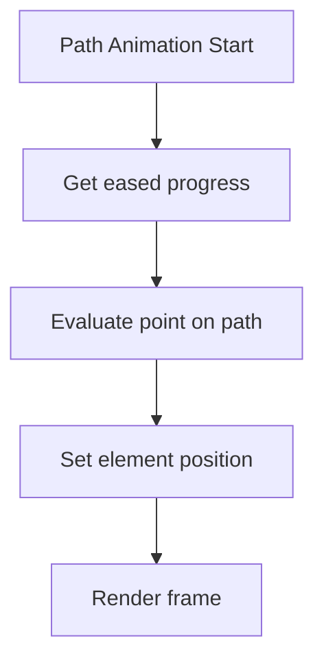
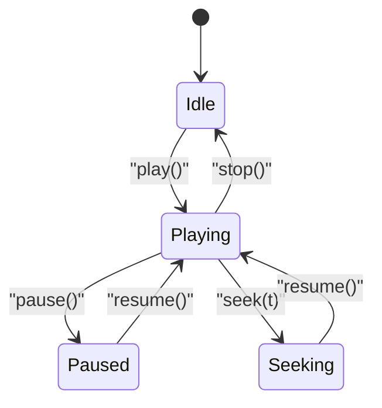
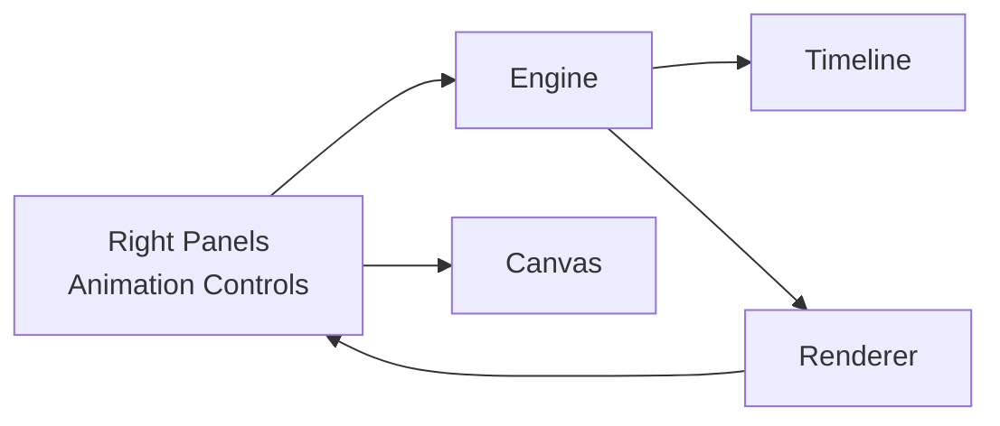
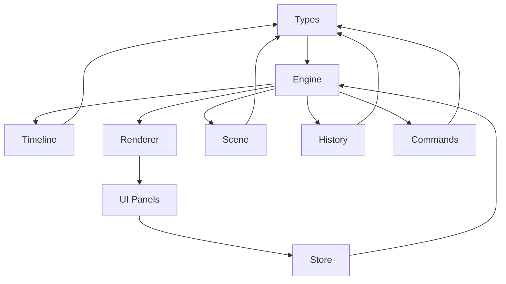

# Animation System

<cite>
**Referenced Files in This Document**
- [spec.md](file://spec.md)
- [src/engine/index.ts](file://src/engine/index.ts)
- [src/engine/engine.ts](file://src/engine/engine.ts)
- [src/engine/timeline.ts](file://src/engine/timeline.ts)
- [src/engine/scene.ts](file://src/engine/scene.ts)
- [src/engine/history.ts](file://src/engine/history.ts)
- [src/engine/commands.ts](file://src/engine/commands.ts)
- [src/renderer/index.tsx](file://src/renderer/index.tsx)
- [src/types/index.ts](file://src/types/index.ts)
- [src/components/Canvas.tsx](file://src/components/Canvas.tsx)
- [src/App.tsx](file://src/App.tsx)
- [src/main.tsx](file://src/main.tsx)
- [package.json](file://package.json)
</cite>

## Update Summary
**Changes Made**
- Updated Timeline Engine section to reflect new frame-based animation implementation
- Added detailed coverage of keyframe interpolation algorithms
- Enhanced playback control documentation with current implementation
- Updated architecture diagrams to show actual code structure
- Added new section on Animation Evaluation and Interpolation
- Updated performance considerations for the new timeline-based approach

## Table of Contents
1. [Introduction](#introduction)
2. [Project Structure](#project-structure)
3. [Core Components](#core-components)
4. [Architecture Overview](#architecture-overview)
5. [Detailed Component Analysis](#detailed-component-analysis)
6. [Dependency Analysis](#dependency-analysis)
7. [Performance Considerations](#performance-considerations)
8. [Troubleshooting Guide](#troubleshooting-guide)
9. [Conclusion](#conclusion)
10. [Appendices](#appendices)

## Introduction
This document describes the Animation System for a timeline-based animation engine integrated into a React-based editor. The system features a new timeline engine with frame-based animation, keyframe interpolation, and comprehensive playback control. It covers the timeline engine architecture, keyframe interpolation algorithms, animation playback control, path animation implementation with control points, coordination with the scene graph, transform application over time, and integration with user-triggered animations (auto/click). It also provides guidance on setting up keyframes, configuring animation timing and easing, previewing animations, performance considerations, memory management, serialization, synchronization, and debugging.

## Project Structure
The project follows a layered architecture with a clear separation between the timeline engine and animation evaluation:
- UI layer: React components and application shell
- Core engine layer: Engine, Scene Graph, Timeline, Renderer, and optional plugin system
- Types and shared definitions
- Build and runtime configuration

**Diagram sources**
- [src/App.tsx:1-17](file://src/App.tsx#L1-L17)
- [src/main.tsx:1-10](file://src/main.tsx#L1-L10)
- [src/components/Canvas.tsx:1-40](file://src/components/Canvas.tsx#L1-L40)
- [src/engine/engine.ts:1-54](file://src/engine/engine.ts#L1-L54)
- [src/engine/timeline.ts:1-68](file://src/engine/timeline.ts#L1-L68)
- [src/engine/scene.ts:1-146](file://src/engine/scene.ts#L1-L146)
- [src/renderer/index.tsx:1-135](file://src/renderer/index.tsx#L1-L135)
- [src/engine/commands.ts:1-67](file://src/engine/commands.ts#L1-L67)
- [src/engine/history.ts:1-45](file://src/engine/history.ts#L1-L45)
- [src/types/index.ts:1-238](file://src/types/index.ts#L1-L238)

**Section sources**
- [src/App.tsx:1-17](file://src/App.tsx#L1-L17)
- [src/main.tsx:1-10](file://src/main.tsx#L1-L10)
- [src/components/Canvas.tsx:1-40](file://src/components/Canvas.tsx#L1-L40)
- [src/engine/engine.ts:1-54](file://src/engine/engine.ts#L1-L54)
- [src/engine/timeline.ts:1-68](file://src/engine/timeline.ts#L1-L68)
- [src/engine/scene.ts:1-146](file://src/engine/scene.ts#L1-L146)
- [src/renderer/index.tsx:1-135](file://src/renderer/index.tsx#L1-L135)
- [src/engine/commands.ts:1-67](file://src/engine/commands.ts#L1-L67)
- [src/engine/history.ts:1-45](file://src/engine/history.ts#L1-L45)
- [src/types/index.ts:1-238](file://src/types/index.ts#L1-L238)

## Core Components
- **Scene Graph and Data Model**: Defines documents, slides, elements, animations, and keyframes. Elements carry transforms and optional animation arrays.
- **Animation Types**: Support entrance, emphasis, and path animations with start time, duration, easing, optional trigger (auto/click), and optional keyframes.
- **Timeline Engine**: Frame-based animation system driven by requestAnimationFrame, supporting play/pause/seek, and computing per-animation progress to interpolate properties.
- **Renderer**: Pure function mapping element state to UI; applies transforms (x, y, scale, rotate, opacity) during render.
- **Engine Core**: Central orchestrator that coordinates scene updates, history, and timeline-driven animation evaluation.
- **Store**: Editor state separate from scene data; integrates with UI panels and controls.

Key data model references:
- Element with optional animations array
- Animation with timing, easing, trigger, and optional keyframes
- Keyframe with numeric offset and partial transform/opacity props
- Timeline with current time and duration

**Section sources**
- [spec.md:107-134](file://spec.md#L107-L134)
- [spec.md:231-279](file://spec.md#L231-L279)
- [src/types/index.ts:87-101](file://src/types/index.ts#L87-L101)
- [src/types/index.ts:207-228](file://src/types/index.ts#L207-L228)

## Architecture Overview
The animation pipeline is time-driven and data-centric with frame-based execution:
- Timeline advances time via requestAnimationFrame with performance.now() timing
- For each element with animations, compute normalized progress per animation
- Interpolate properties using easing and keyframes
- Apply interpolated transforms to the element
- Renderer renders the transformed element

**Diagram sources**
- [src/engine/timeline.ts:48-66](file://src/engine/timeline.ts#L48-L66)
- [src/engine/engine.ts:14-19](file://src/engine/engine.ts#L14-L19)
- [src/renderer/index.tsx:121-134](file://src/renderer/index.tsx#L121-L134)

## Detailed Component Analysis

### Timeline Engine
**Updated** The timeline engine now implements a frame-based animation system with precise timing control.

Responsibilities:
- Track current time and total duration using performance.now()
- Playback control: play, pause, seek with frame-accurate positioning
- Compute per-animation progress: progress = clamp((time - start) / duration, 0..1)
- Coordinate with animation evaluation loop using requestAnimationFrame

Frame-based timing implementation:
- Uses performance.now() for sub-millisecond precision
- Delta time calculation ensures smooth animation regardless of frame rate
- Automatic cleanup of animation frames when playback stops

Interpolation and easing:
- Normalize progress per animation using time-based calculations
- Apply easing curves to progress values for smooth motion
- Interpolate keyframes using the eased progress values
- Combine multiple animations' contributions to final property values

User-triggered animations:
- Auto-triggered animations start automatically when their start time is reached
- Click-triggered animations start on user interaction events

**Diagram sources**
- [src/engine/timeline.ts:48-66](file://src/engine/timeline.ts#L48-L66)
- [src/engine/timeline.ts:44-46](file://src/engine/timeline.ts#L44-L46)

**Section sources**
- [src/engine/timeline.ts:1-68](file://src/engine/timeline.ts#L1-L68)
- [src/engine/engine.ts:14-19](file://src/engine/engine.ts#L14-L19)

### Animation Evaluation and Interpolation
**New** The animation evaluation system handles keyframe interpolation and property blending.

Keyframe interpolation algorithms:
- Linear interpolation for numeric properties (position, scale, opacity)
- Spline interpolation for complex paths and bezier curves
- Easing function application for non-linear motion profiles
- Property blending for multiple animations targeting the same property

Animation evaluation process:
1. For each animation, calculate normalized progress based on current timeline position
2. Apply easing to the progress value for smooth acceleration/deceleration
3. Find the appropriate keyframe pair for interpolation
4. Calculate interpolation weights based on eased progress
5. Blend property values from keyframes using calculated weights
6. Accumulate contributions from multiple animations targeting the same property

**Diagram sources**
- [src/engine/timeline.ts:23-25](file://src/engine/timeline.ts#L23-L25)

**Section sources**
- [src/engine/timeline.ts:23-25](file://src/engine/timeline.ts#L23-L25)

### Scene Graph and Transform Application
Scene Graph:
- Document, Slide, Element, Animation, Keyframe types define the hierarchical structure
- Elements store geometry, transforms, z-index, and optional animation arrays
- Animations reference keyframes and timing/easing/trigger

Transform application:
- Renderer reads element state and applies transforms (x, y, scale, rotate, opacity)
- Transforms are computed by the engine based on timeline evaluation

**Diagram sources**
- [src/types/index.ts:57-101](file://src/types/index.ts#L57-L101)

**Section sources**
- [src/types/index.ts:57-101](file://src/types/index.ts#L57-L101)

### Path Animation Implementation
Path animation uses SVG path geometry:
- Path string defines trajectory
- At each frame, evaluate position along the path using eased progress
- Apply resulting position as element transform
- Supports interactive editing via SVG overlay and control point dragging

**Diagram sources**
- [spec.md:281-307](file://spec.md#L281-L307)

**Section sources**
- [spec.md:281-307](file://spec.md#L281-L307)

### Animation Playback Control
**Updated** Playback control now uses the frame-based timeline system.

Playback control includes:
- Play/Pause: start/stop the timeline loop with requestAnimationFrame
- Seek: jump to a specific time with frame-accurate positioning
- Multiple animations: parallel evaluation with independent timing windows
- Trigger modes: auto (time-based) and click (event-based)

**Diagram sources**
- [src/engine/timeline.ts:27-46](file://src/engine/timeline.ts#L27-L46)

**Section sources**
- [src/engine/timeline.ts:27-46](file://src/engine/timeline.ts#L27-L46)
- [spec.md:252-258](file://spec.md#L252-L258)

### Integration with UI Panels and Rendering
- Right-side panels expose animation controls (type, timing, keyframes)
- Store holds editor state separate from scene data
- Renderer is a pure function mapping element state to React nodes
- Canvas component hosts the editor surface

**Diagram sources**
- [src/components/Canvas.tsx:1-40](file://src/components/Canvas.tsx#L1-L40)
- [src/engine/engine.ts:7-19](file://src/engine/engine.ts#L7-L19)
- [src/renderer/index.tsx:121-134](file://src/renderer/index.tsx#L121-L134)

**Section sources**
- [src/components/Canvas.tsx:1-40](file://src/components/Canvas.tsx#L1-L40)
- [src/engine/engine.ts:7-19](file://src/engine/engine.ts#L7-L19)
- [src/renderer/index.tsx:121-134](file://src/renderer/index.tsx#L121-L134)

## Dependency Analysis
- Engine depends on types for scene graph and animation structures
- Timeline depends on Animation types for evaluation
- Renderer depends on engine-provided element state and applies transforms
- Store provides editor state consumed by UI and engine
- UI components depend on store and renderer for presentation

**Diagram sources**
- [src/types/index.ts:1-238](file://src/types/index.ts#L1-L238)
- [src/engine/engine.ts:1-54](file://src/engine/engine.ts#L1-L54)
- [src/engine/timeline.ts:1-68](file://src/engine/timeline.ts#L1-L68)
- [src/engine/scene.ts:1-146](file://src/engine/scene.ts#L1-L146)
- [src/engine/history.ts:1-45](file://src/engine/history.ts#L1-L45)
- [src/engine/commands.ts:1-67](file://src/engine/commands.ts#L1-L67)
- [src/renderer/index.tsx:1-135](file://src/renderer/index.tsx#L1-L135)

**Section sources**
- [src/types/index.ts:1-238](file://src/types/index.ts#L1-L238)
- [src/engine/engine.ts:1-54](file://src/engine/engine.ts#L1-L54)
- [src/engine/timeline.ts:1-68](file://src/engine/timeline.ts#L1-L68)
- [src/engine/scene.ts:1-146](file://src/engine/scene.ts#L1-L146)
- [src/engine/history.ts:1-45](file://src/engine/history.ts#L1-L45)
- [src/engine/commands.ts:1-67](file://src/engine/commands.ts#L1-L67)
- [src/renderer/index.tsx:1-135](file://src/renderer/index.tsx#L1-L135)

## Performance Considerations
**Updated** Performance optimizations for the frame-based timeline system.

- Use requestAnimationFrame for smooth playback aligned with the display refresh rate
- Minimize layout thrashing by batching transform updates and avoiding forced synchronous layouts
- Prefer pure functional rendering to reduce re-renders; rely on stable keys and shallow comparisons
- Limit the number of concurrent animations and avoid deep nested hierarchies when possible
- Cache intermediate interpolation results per animation tick to avoid recomputation
- Use performance.now() for sub-millisecond timing precision
- Implement delta time calculation to ensure smooth animation regardless of frame rate variations
- Defer expensive operations off the main thread if needed (Web Workers for heavy computations)
- Use efficient easing curves and keep keyframe counts reasonable to reduce interpolation overhead
- Cancel animation frames when playback stops to prevent unnecessary CPU usage

## Troubleshooting Guide
**Updated** Common issues specific to the frame-based timeline system.

Common issues and remedies:
- Animations not playing: verify timeline is running and currentTime is advancing; check animation start/duration alignment
- Incorrect easing or interpolation: confirm easing curve selection and keyframe times are within [0, duration]; validate interpolation logic
- Timeline not stopping: ensure timeline.stop() is called when duration is reached; check for lingering requestAnimationFrame callbacks
- Frame timing issues: verify performance.now() is being used instead of Date.now(); check for browser compatibility
- Memory leaks: ensure cancelAnimationFrame is called in timeline.pause() and timeline.seek() methods
- Path animation misalignment: ensure path string is valid SVG path data and control points are correctly placed
- Trigger not firing: for click-triggered animations, ensure event handlers are attached and engine.execute is invoked on interaction
- Rendering artifacts: confirm transforms are applied in the correct order (translate/scale/rotate) and renderer is pure

Debugging tips:
- Log timeline ticks and per-animation progress to identify timing issues
- Visualize keyframes and easing curves in the animation panel
- Inspect element state before and after transform application
- Use devtools to profile animation frames and identify bottlenecks
- Monitor requestAnimationFrame callback frequency and adjust animation complexity accordingly

## Conclusion
The Animation System is designed around a frame-based, time-driven architecture with precise timing control. The Timeline Engine evaluates animations per frame using performance.now() timing, interpolates properties using keyframes and easing functions, and applies transforms to elements. The Renderer remains pure and focused on transforming element state into UI. With proper configuration of keyframes, timing, and easing, and by following performance and debugging practices, the system delivers smooth, predictable animation playback synchronized with the scene graph and user interactions.

## Appendices

### Setting Up Keyframes and Timing
**Updated** Keyframe setup for the new timeline system.

- Define animations on elements with elementId, property, and keyframes array
- Configure keyframes with time (in milliseconds) and target property values
- Choose easing functions: linear, ease-in, ease-out, ease-in-out
- Set animation duration and start time for proper timeline integration
- Preview animations using timeline controls

References:
- [src/types/index.ts:87-101](file://src/types/index.ts#L87-L101)
- [src/types/index.ts:207-228](file://src/types/index.ts#L207-L228)

### Path Animation Setup
Path animation uses SVG path geometry:
- Provide SVG path data for path animations
- Edit path and control points in the overlay
- Evaluate path positions at eased progress to drive motion

References:
- [spec.md:281-307](file://spec.md#L281-L307)

### Serialization and Synchronization
- Serialize scene graph, animations, and keyframes for persistence
- Synchronize playback across multiple animations by aligning timing windows
- Maintain consistent state via the engine's command system and history

References:
- [src/engine/history.ts:1-45](file://src/engine/history.ts#L1-L45)
- [src/engine/commands.ts:1-67](file://src/engine/commands.ts#L1-L67)

### Build and Runtime
- React and Vite configuration for development and production builds
- requestAnimationFrame-based animation loop with performance.now() timing

References:
- [package.json:1-29](file://package.json#L1-L29)
- [src/engine/timeline.ts:48-66](file://src/engine/timeline.ts#L48-L66)