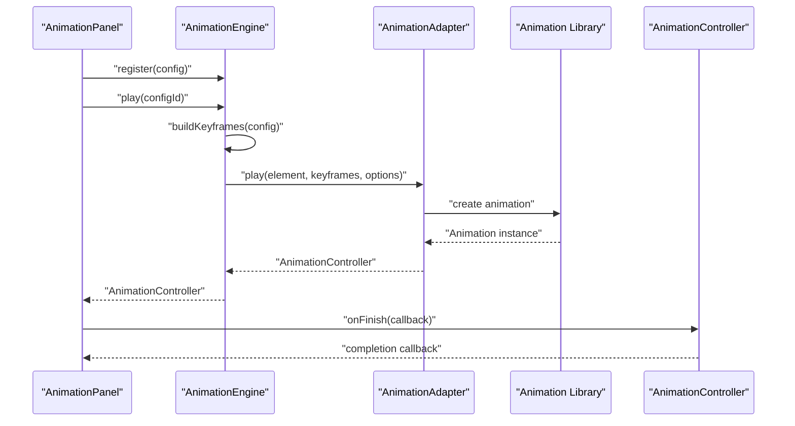
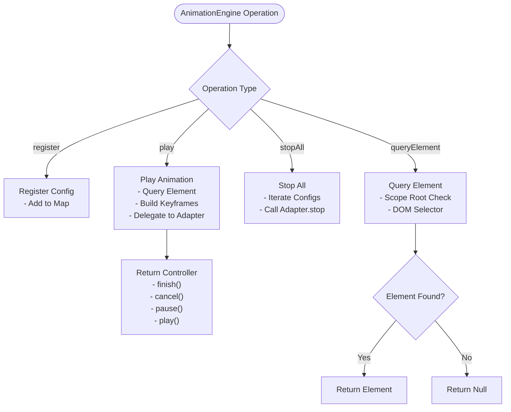
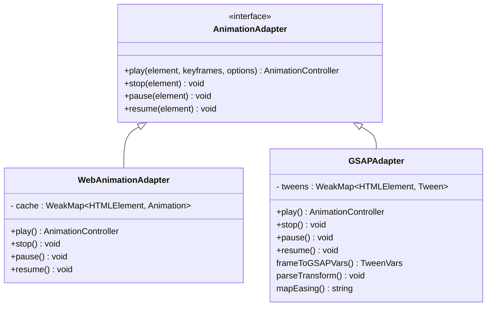
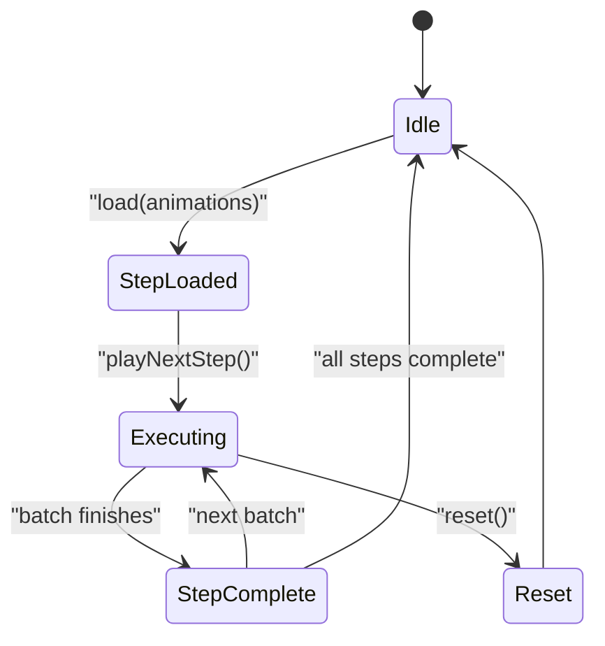
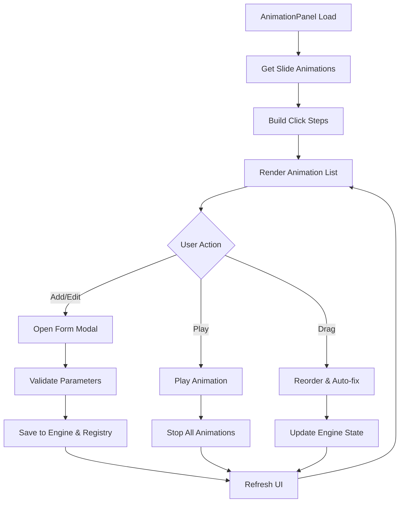

# Animation System

<cite>
**Referenced Files in This Document**
- [src/animation/index.ts](file://src/animation/index.ts)
- [src/animation/engine.ts](file://src/animation/engine.ts)
- [src/animation/adapter.ts](file://src/animation/adapter.ts)
- [src/animation/webAnimationAdapter.ts](file://src/animation/webAnimationAdapter.ts)
- [src/animation/gsapAdapter.ts](file://src/animation/gsapAdapter.ts)
- [src/animation/buildKeyframes.ts](file://src/animation/buildKeyframes.ts)
- [src/animation/scheduler.ts](file://src/animation/scheduler.ts)
- [src/types/animation.ts](file://src/types/animation.ts)
- [src/components/AnimationPanel.tsx](file://src/components/AnimationPanel.tsx)
- [src/engine/animationCommands.ts](file://src/engine/animationCommands.ts)
- [src/engine/timeline.ts](file://src/engine/timeline.ts)
- [src/App.tsx](file://src/App.tsx)
- [package.json](file://package.json)
</cite>

## Update Summary
**Changes Made**
- Complete rewrite to reflect the new AnimationEngine architecture with adapter pattern
- Added comprehensive coverage of Web Animations API and GSAP integration
- Documented the new scheduler system with batch execution model
- Updated AnimationPanel UI component documentation with new capabilities
- Added support for click-triggered animations with step/batch execution
- Enhanced animation configuration system with advanced parameter handling
- Updated performance considerations for adapter-based animation engines

## Table of Contents
1. [Introduction](#introduction)
2. [Project Structure](#project-structure)
3. [Core Components](#core-components)
4. [Architecture Overview](#architecture-overview)
5. [Detailed Component Analysis](#detailed-component-analysis)
6. [Dependency Analysis](#dependency-analysis)
7. [Performance Considerations](#performance-considerations)
8. [Troubleshooting Guide](#troubleshooting-guide)
9. [Conclusion](#conclusion)
10. [Appendices](#appendices)

## Introduction
This document describes the comprehensive Animation System featuring a modern adapter-based architecture with AnimationEngine, AnimationAdapter interface, scheduler system, and AnimationPanel UI. The system supports both Web Animations API and GSAP integration with advanced scheduling capabilities for click-triggered animations. It provides timeline-based animation orchestration, keyframe generation, animation playback control, and seamless integration with the React-based editor interface.

## Project Structure
The animation system follows a modular architecture with clear separation between core engine, adapters, and UI components:
- Animation core: AnimationEngine, AnimationAdapter interface, keyframe builders
- Adapter implementations: WebAnimationAdapter and GSAPAdapter
- Scheduler system: Step and batch execution model
- UI components: AnimationPanel with drag-and-drop functionality
- Type definitions: Comprehensive animation configuration and controller interfaces

```mermaid
graph TB
subgraph "Animation Core"
ENGINE["AnimationEngine"]
ADAPTER["AnimationAdapter Interface"]
BUILD["buildKeyframes"]
END
subgraph "Adapters"
WAAPI["WebAnimationAdapter"]
GSAP["GSAPAdapter"]
END
subgraph "Scheduler"
SCHEDULER["AnimationScheduler"]
CLICK["buildClickSteps"]
END
subgraph "UI Layer"
PANEL["AnimationPanel"]
COMMANDS["BatchAnimationCommand"]
END
subgraph "Types"
TYPES["Animation Types"]
END
ENGINE --> ADAPTER
ADAPTER --> WAAPI
ADAPTER --> GSAP
ENGINE --> BUILD
SCHEDULER --> ENGINE
SCHEDULER --> CLICK
PANEL --> ENGINE
PANEL --> SCHEDULER
COMMANDS --> ENGINE
TYPES --> ENGINE
TYPES --> PANEL
```

**Diagram sources**
- [src/animation/engine.ts:1-120](file://src/animation/engine.ts#L1-L120)
- [src/animation/adapter.ts:1-27](file://src/animation/adapter.ts#L1-L27)
- [src/animation/webAnimationAdapter.ts:1-67](file://src/animation/webAnimationAdapter.ts#L1-L67)
- [src/animation/gsapAdapter.ts:1-140](file://src/animation/gsapAdapter.ts#L1-L140)
- [src/animation/buildKeyframes.ts:1-125](file://src/animation/buildKeyframes.ts#L1-L125)
- [src/animation/scheduler.ts:1-136](file://src/animation/scheduler.ts#L1-L136)
- [src/components/AnimationPanel.tsx:1-847](file://src/components/AnimationPanel.tsx#L1-L847)
- [src/engine/animationCommands.ts:1-44](file://src/engine/animationCommands.ts#L1-L44)
- [src/types/animation.ts:1-113](file://src/types/animation.ts#L1-L113)

**Section sources**
- [src/animation/index.ts:1-8](file://src/animation/index.ts#L1-L8)
- [src/animation/engine.ts:1-120](file://src/animation/engine.ts#L1-L120)
- [src/animation/adapter.ts:1-27](file://src/animation/adapter.ts#L1-L27)
- [src/animation/webAnimationAdapter.ts:1-67](file://src/animation/webAnimationAdapter.ts#L1-L67)
- [src/animation/gsapAdapter.ts:1-140](file://src/animation/gsapAdapter.ts#L1-L140)
- [src/animation/buildKeyframes.ts:1-125](file://src/animation/buildKeyframes.ts#L1-L125)
- [src/animation/scheduler.ts:1-136](file://src/animation/scheduler.ts#L1-L136)
- [src/components/AnimationPanel.tsx:1-847](file://src/components/AnimationPanel.tsx#L1-L847)
- [src/engine/animationCommands.ts:1-44](file://src/engine/animationCommands.ts#L1-L44)
- [src/types/animation.ts:1-113](file://src/types/animation.ts#L1-L113)

## Core Components
- **AnimationEngine**: Central orchestrator that manages animation configurations, builds keyframes, and delegates playback to adapter implementations
- **AnimationAdapter Interface**: Abstraction layer for different animation libraries (Web Animations API, GSAP)
- **WebAnimationAdapter**: Native browser animation implementation using element.animate()
- **GSAPAdapter**: Advanced animation library integration with tweening capabilities
- **AnimationScheduler**: Implements batch execution model for click-triggered animations with step and batch coordination
- **AnimationPanel**: Interactive UI for creating, editing, and managing animations with drag-and-drop support
- **Keyframe Builder**: Generates WAAPI-compatible keyframes from animation configurations
- **Animation Types**: Comprehensive type definitions for animation configurations, effects, and controller interfaces

Key data model references:
- AnimationConfig with effect types, timing parameters, and start triggers
- WAAPIKeyframe format compatible with Web Animations API
- AnimationController interface for lifecycle management
- ClickStep and AnimationBatch structures for scheduler execution

**Section sources**
- [src/animation/engine.ts:9-119](file://src/animation/engine.ts#L9-L119)
- [src/animation/adapter.ts:7-26](file://src/animation/adapter.ts#L7-L26)
- [src/animation/webAnimationAdapter.ts:12-66](file://src/animation/webAnimationAdapter.ts#L12-L66)
- [src/animation/gsapAdapter.ts:13-139](file://src/animation/gsapAdapter.ts#L13-L139)
- [src/animation/scheduler.ts:56-135](file://src/animation/scheduler.ts#L56-L135)
- [src/components/AnimationPanel.tsx:87-539](file://src/components/AnimationPanel.tsx#L87-L539)
- [src/animation/buildKeyframes.ts:7-109](file://src/animation/buildKeyframes.ts#L7-L109)
- [src/types/animation.ts:26-113](file://src/types/animation.ts#L26-L113)

## Architecture Overview
The animation system implements a modern adapter-based architecture with clear separation of concerns:
- AnimationEngine manages configuration lifecycle and delegates to adapters
- AnimationAdapter interface provides abstraction for different animation libraries
- Scheduler implements sophisticated execution models for user-triggered animations
- UI components provide comprehensive animation authoring capabilities



**Diagram sources**
- [src/components/AnimationPanel.tsx:256-267](file://src/components/AnimationPanel.tsx#L256-L267)
- [src/animation/engine.ts:53-70](file://src/animation/engine.ts#L53-L70)
- [src/animation/webAnimationAdapter.ts:15-43](file://src/animation/webAnimationAdapter.ts#L15-L43)
- [src/animation/gsapAdapter.ts:16-60](file://src/animation/gsapAdapter.ts#L16-L60)

## Detailed Component Analysis

### AnimationEngine
The AnimationEngine serves as the central coordinator for all animation operations, managing configuration lifecycle and delegating playback to adapter implementations.

**Key Responsibilities:**
- Manages animation configurations in an internal registry
- Builds WAAPI-compatible keyframes from animation configurations
- Delegates animation playback to configured adapter implementations
- Provides element scoping for DOM queries
- Handles bulk animation operations (playAllForElement, stopAll)

**Configuration Management:**
- register(): Adds or updates animation configurations
- unregister(): Removes configurations from registry
- getAllConfigs(): Retrieves all registered animations
- getConfig(): Fetches specific configuration by ID

**Playback Operations:**
- play(): Executes individual animation with controller return
- playAllForElement(): Plays all animations for a specific element
- stop(), stopAll(): Cancels animation playback
- pause(), resume(): Controls animation state



**Diagram sources**
- [src/animation/engine.ts:33-119](file://src/animation/engine.ts#L33-L119)

**Section sources**
- [src/animation/engine.ts:9-119](file://src/animation/engine.ts#L9-L119)

### AnimationAdapter Interface and Implementations
The AnimationAdapter interface provides a unified abstraction for different animation libraries, enabling pluggable animation backends.

**Interface Contract:**
- play(): Creates and starts animations with keyframes and options
- stop(): Cancels ongoing animations
- pause(): Temporarily halts animations
- resume(): Resumes paused animations

**WebAnimationAdapter Implementation:**
- Uses native Web Animations API (element.animate)
- Provides native browser animation capabilities
- Supports standard WAAPI keyframe format
- Includes built-in caching mechanism

**GSAPAdapter Implementation:**
- Integrates advanced GSAP tweening library
- Converts WAAPI keyframes to GSAP fromTo syntax
- Parses CSS transform strings into GSAP properties
- Maps easing presets to GSAP ease strings
- Maintains weak map for tween lifecycle management



**Diagram sources**
- [src/animation/adapter.ts:7-26](file://src/animation/adapter.ts#L7-L26)
- [src/animation/webAnimationAdapter.ts:12-66](file://src/animation/webAnimationAdapter.ts#L12-L66)
- [src/animation/gsapAdapter.ts:13-139](file://src/animation/gsapAdapter.ts#L13-L139)

**Section sources**
- [src/animation/adapter.ts:1-27](file://src/animation/adapter.ts#L1-L27)
- [src/animation/webAnimationAdapter.ts:1-67](file://src/animation/webAnimationAdapter.ts#L1-L67)
- [src/animation/gsapAdapter.ts:1-140](file://src/animation/gsapAdapter.ts#L1-L140)

### AnimationScheduler and Batch Execution Model
The AnimationScheduler implements a sophisticated execution model for click-triggered animations using steps and batches.

**Execution Model:**
- Steps: User-triggered animation groups (click events)
- Batches: Sequential execution within steps
- Concurrent execution: All animations in a batch play simultaneously

**Step Types:**
- click: Starts a new step (user click)
- withPrev: Joins current batch (executes with previous animations)
- afterPrev: Starts new batch (executes after previous batch completes)

**Scheduler Operations:**
- load(): Processes animation configurations into step structure
- playNextStep(): Executes next step in sequence
- playFromStep(): Jumps to specific step index
- reset(): Cancels all running animations and clears state



**Diagram sources**
- [src/animation/scheduler.ts:56-135](file://src/animation/scheduler.ts#L56-L135)

**Section sources**
- [src/animation/scheduler.ts:13-135](file://src/animation/scheduler.ts#L13-L135)

### AnimationPanel UI Component
The AnimationPanel provides a comprehensive interface for animation authoring with drag-and-drop functionality and real-time preview capabilities.

**Core Features:**
- Animation creation and editing with form validation
- Drag-and-drop reordering with automatic start type adjustment
- Real-time animation preview and playback control
- Step visualization with batch indicators
- Parameter-specific form fields for different animation effects

**Form Management:**
- Dynamic parameter fields based on selected animation effect
- Automatic parameter validation and defaults
- Real-time effect type detection (enter/emphasis/exit)
- Start type auto-correction during drag operations

**Playback Controls:**
- Individual animation preview with stop-all protection
- Step-based playback from specific animation
- Visual step numbering and relationship indicators
- Integration with AnimationScheduler for complex sequences



**Diagram sources**
- [src/components/AnimationPanel.tsx:87-539](file://src/components/AnimationPanel.tsx#L87-L539)

**Section sources**
- [src/components/AnimationPanel.tsx:1-847](file://src/components/AnimationPanel.tsx#L1-L847)

### Keyframe Generation and Effects System
The keyframe generation system converts animation configurations into WAAPI-compatible keyframes with support for various animation effects.

**Effect Categories:**
- Enter Effects: fadeIn, zoomIn, slideIn, flyIn, rotateIn
- Emphasis Effects: pulse, shake, blink, scale, highlight
- Exit Effects: fadeOut, zoomOut, slideOut, flyOut, rotateOut

**Parameter Handling:**
- Directional effects support distance parameters
- Scale effects support fromScale/toScale ranges
- Rotation effects support angle ranges
- Brightness effects support intensity parameters

**Keyframe Generation Process:**
1. Effect type detection from AnimationConfig
2. Parameter extraction and validation
3. Offset calculation for timeline positioning
4. Transform string construction for CSS properties
5. WAAPI keyframe object creation

**Section sources**
- [src/animation/buildKeyframes.ts:7-125](file://src/animation/buildKeyframes.ts#L7-L125)
- [src/types/animation.ts:6-12](file://src/types/animation.ts#L6-L12)

### Animation Configuration and Types
The animation system uses comprehensive type definitions to ensure type safety and provide clear interfaces for all animation operations.

**AnimationConfig Structure:**
- id: Unique identifier for animation instances
- elementId: Target element for animation application
- name: Human-readable animation name
- enable: Toggle for animation activation
- type: Animation category (enter/emphasis/exit)
- effect: Specific animation effect
- startType: Trigger mechanism (click/withPrev/afterPrev)
- duration: Animation length in seconds
- delay: Delay before animation start in seconds
- easing: Easing preset selection
- repeatCount: Number of animation repetitions
- params: Effect-specific parameter objects

**Controller Interface:**
- finish(): Immediately completes animation
- cancel(): Terminates animation and resets state
- pause(): Temporarily halts animation progress
- play(): Resumes paused animation
- onFinish(): Registers completion callback

**Section sources**
- [src/types/animation.ts:26-98](file://src/types/animation.ts#L26-L98)

## Dependency Analysis
The animation system maintains clean dependency relationships with clear separation between core functionality and external libraries.

**Internal Dependencies:**
- AnimationEngine depends on AnimationAdapter interface and keyframe builder
- WebAnimationAdapter and GSAPAdapter implement AnimationAdapter interface
- AnimationPanel depends on AnimationEngine and scheduler utilities
- AnimationCommands provide undo/redo functionality for animation operations

**External Dependencies:**
- GSAP library for advanced tweening capabilities
- @dnd-kit for drag-and-drop functionality in UI
- React ecosystem for component architecture

```mermaid
graph TB
subgraph "Internal Dependencies"
ENGINE["AnimationEngine"] --> ADAPTER["AnimationAdapter"]
ENGINE --> BUILD["buildKeyframes"]
WAAPI["WebAnimationAdapter"] --> ADAPTER
GSAP["GSAPAdapter"] --> ADAPTER
PANEL["AnimationPanel"] --> ENGINE
PANEL --> SCHEDULER["buildClickSteps"]
COMMANDS["BatchAnimationCommand"] --> ENGINE
END
subgraph "External Dependencies"
GSAP_LIB["gsap"] --> GSAP
DND_KIT["@dnd-kit/*"] --> PANEL
END
```

**Diagram sources**
- [src/animation/engine.ts:1-120](file://src/animation/engine.ts#L1-L120)
- [src/animation/webAnimationAdapter.ts:1-67](file://src/animation/webAnimationAdapter.ts#L1-L67)
- [src/animation/gsapAdapter.ts:1-140](file://src/animation/gsapAdapter.ts#L1-L140)
- [src/components/AnimationPanel.tsx:1-847](file://src/components/AnimationPanel.tsx#L1-L847)
- [src/engine/animationCommands.ts:1-44](file://src/engine/animationCommands.ts#L1-L44)
- [package.json:12-20](file://package.json#L12-L20)

**Section sources**
- [src/animation/engine.ts:1-120](file://src/animation/engine.ts#L1-L120)
- [src/animation/adapter.ts:1-27](file://src/animation/adapter.ts#L1-L27)
- [src/animation/webAnimationAdapter.ts:1-67](file://src/animation/webAnimationAdapter.ts#L1-L67)
- [src/animation/gsapAdapter.ts:1-140](file://src/animation/gsapAdapter.ts#L1-L140)
- [src/components/AnimationPanel.tsx:1-847](file://src/components/AnimationPanel.tsx#L1-L847)
- [src/engine/animationCommands.ts:1-44](file://src/engine/animationCommands.ts#L1-L44)
- [package.json:12-20](file://package.json#L12-L20)

## Performance Considerations
The animation system implements several performance optimizations for smooth playback and efficient resource management.

**Adapter Performance:**
- WebAnimationAdapter uses native browser APIs for optimal performance
- GSAPAdapter leverages optimized tweening algorithms
- Both adapters implement caching mechanisms to avoid redundant operations

**Memory Management:**
- WeakMap-based caches prevent memory leaks
- Proper cleanup of animation controllers and DOM references
- Efficient configuration registry with Map data structure

**Execution Model Optimizations:**
- Batch execution reduces animation overhead
- Concurrency control prevents resource contention
- Smart element querying with optional root scoping

**UI Performance:**
- React component memoization and optimization
- Drag-and-drop with efficient state updates
- Debounced form validation and submission

**Animation Optimization Strategies:**
- Minimal DOM manipulation through transform properties
- Efficient keyframe generation avoiding unnecessary recalculations
- Proper easing curve selection for smooth motion profiles

## Troubleshooting Guide
Common issues and solutions for the adapter-based animation system.

**Adapter Issues:**
- WebAnimationAdapter not working: Verify browser support for Web Animations API
- GSAPAdapter errors: Ensure GSAP library is properly installed and imported
- Missing dependencies: Check package.json for required animation libraries

**Animation Playback Problems:**
- Animations not triggering: Verify element selectors match data-element-id attributes
- Incorrect timing: Check duration/delay conversions (seconds to milliseconds)
- Easing not applied: Confirm easing preset names match supported values

**Scheduler Issues:**
- Steps not executing: Verify animation startType assignments (click/withPrev/afterPrev)
- Batch execution problems: Check animation ordering and dependencies
- Step navigation issues: Ensure step indices are within valid range

**UI Component Problems:**
- AnimationPanel not displaying: Verify AnimationPanel is properly integrated into App
- Drag-and-drop not working: Check @dnd-kit installation and sensor configuration
- Form validation errors: Ensure parameter values are within acceptable ranges

**Debugging Techniques:**
- Enable browser developer tools to inspect animation controllers
- Use console logging in AnimationEngine for operation tracking
- Monitor WeakMap caches for proper cleanup
- Validate animation configurations before registration

**Section sources**
- [src/animation/webAnimationAdapter.ts:12-66](file://src/animation/webAnimationAdapter.ts#L12-L66)
- [src/animation/gsapAdapter.ts:13-139](file://src/animation/gsapAdapter.ts#L13-L139)
- [src/animation/scheduler.ts:56-135](file://src/animation/scheduler.ts#L56-L135)
- [src/components/AnimationPanel.tsx:87-539](file://src/components/AnimationPanel.tsx#L87-L539)

## Conclusion
The Animation System represents a comprehensive, modern approach to animation orchestration with its adapter-based architecture, sophisticated scheduler, and rich UI integration. The system successfully abstracts different animation libraries while providing powerful scheduling capabilities for user-triggered animations. With proper configuration, the system delivers smooth, performant animations that integrate seamlessly with the React-based editor interface.

## Appendices

### Setting Up Animation Configurations
**Animation Configuration Process:**
1. Create AnimationConfig with effect, parameters, and timing settings
2. Register configuration with AnimationEngine.register()
3. Use AnimationPanel for interactive editing and preview
4. Implement custom effects through keyframe generation

**Configuration Examples:**
- Basic fadeIn: Simple opacity transition with default parameters
- Complex slideIn: Directional movement with distance specification
- Scale animation: FromScale/ToScale parameters for size transitions
- Custom effects: Extend buildKeyframes for specialized animation types

**Section sources**
- [src/animation/engine.ts:33-50](file://src/animation/engine.ts#L33-L50)
- [src/animation/buildKeyframes.ts:7-109](file://src/animation/buildKeyframes.ts#L7-L109)
- [src/types/animation.ts:26-39](file://src/types/animation.ts#L26-L39)

### Animation Effects Reference
**Supported Animation Effects:**
- **Enter Effects**: fadeIn, zoomIn, slideIn, flyIn, rotateIn
- **Emphasis Effects**: pulse, shake, blink, scale, highlight
- **Exit Effects**: fadeOut, zoomOut, slideOut, flyOut, rotateOut

**Effect Parameters:**
- Directional effects: direction (left/right/up/down), distance (pixels)
- Scale effects: fromScale, toScale (numeric values)
- Rotation effects: fromAngle, toAngle (degrees)
- Brightness effects: brightness (intensity multiplier)

**Section sources**
- [src/types/animation.ts:6-12](file://src/types/animation.ts#L6-L12)
- [src/animation/buildKeyframes.ts:14-104](file://src/animation/buildKeyframes.ts#L14-L104)

### Scheduler Usage Patterns
**Step-Based Animation Sequencing:**
- click: Initiates new animation step (user interaction)
- withPrev: Executes animation concurrently with previous batch
- afterPrev: Executes animation sequentially after previous batch completes

**Implementation Patterns:**
- Complex presentation flows with multiple animation layers
- Interactive storytelling with user-controlled pacing
- Coordinated multi-element animations with precise timing

**Section sources**
- [src/animation/scheduler.ts:13-49](file://src/animation/scheduler.ts#L13-L49)
- [src/animation/scheduler.ts:56-135](file://src/animation/scheduler.ts#L56-L135)

### Integration with Editor Components
**AnimationPanel Integration:**
- Direct integration with Engine for scene operations
- AnimationEngine integration for playback control
- Real-time preview and validation capabilities
- Drag-and-drop reordering with automatic state updates

**App Component Integration:**
- Right-panel tab switching for animation interface
- Preview modal integration for animation testing
- State synchronization between editor and animation systems

**Section sources**
- [src/components/AnimationPanel.tsx:87-539](file://src/components/AnimationPanel.tsx#L87-L539)
- [src/App.tsx:291-317](file://src/App.tsx#L291-L317)

### Build and Runtime Configuration
**Package Dependencies:**
- gsap: Advanced animation and tweening library
- @dnd-kit: Drag-and-drop functionality for animation management
- React ecosystem: Core framework and UI components

**Development Setup:**
- TypeScript configuration for type safety
- Vite build system for development and production
- ESLint configuration for code quality

**Section sources**
- [package.json:12-20](file://package.json#L12-L20)
- [package.json:21-32](file://package.json#L21-L32)