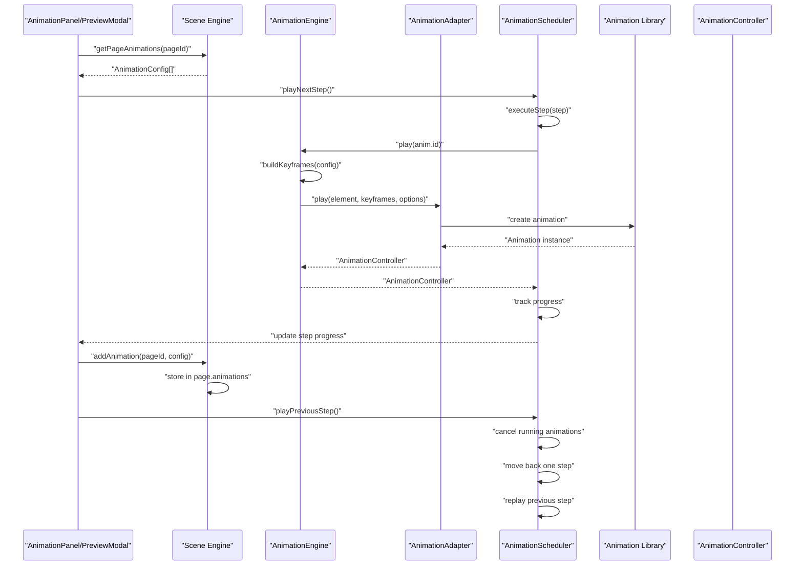
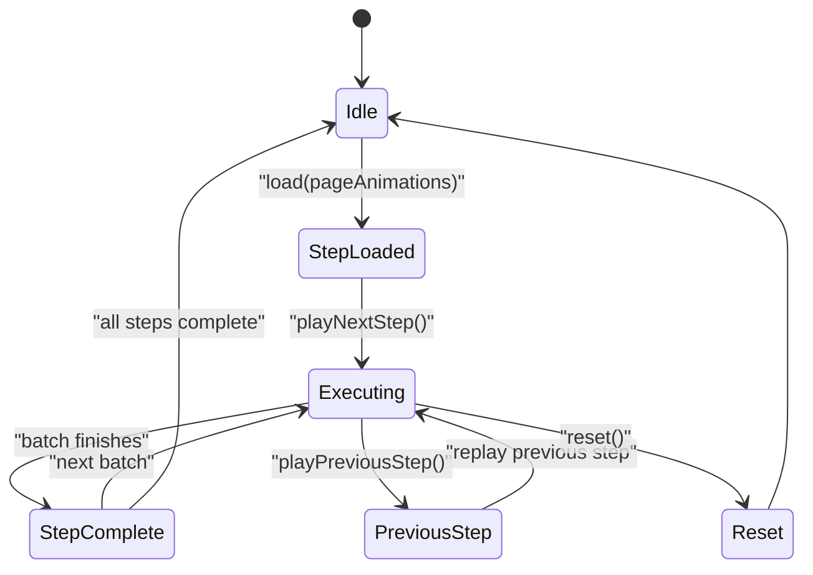
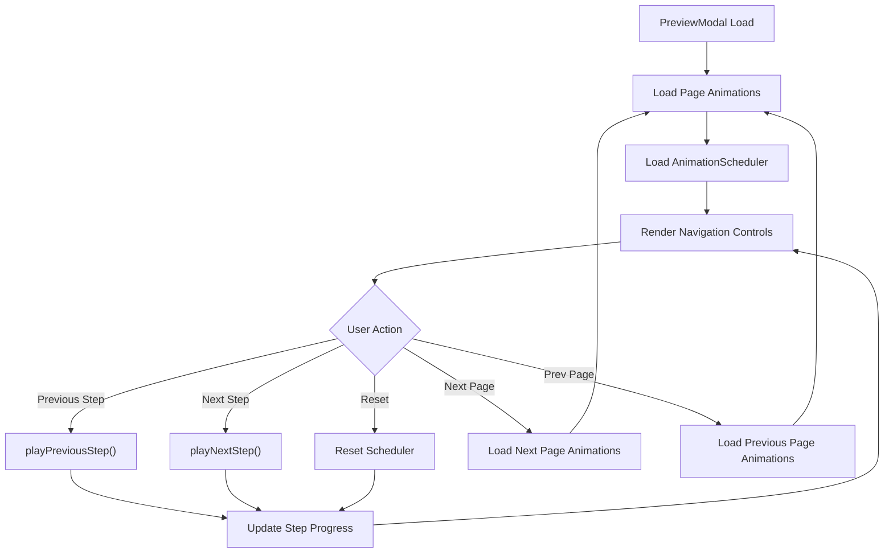
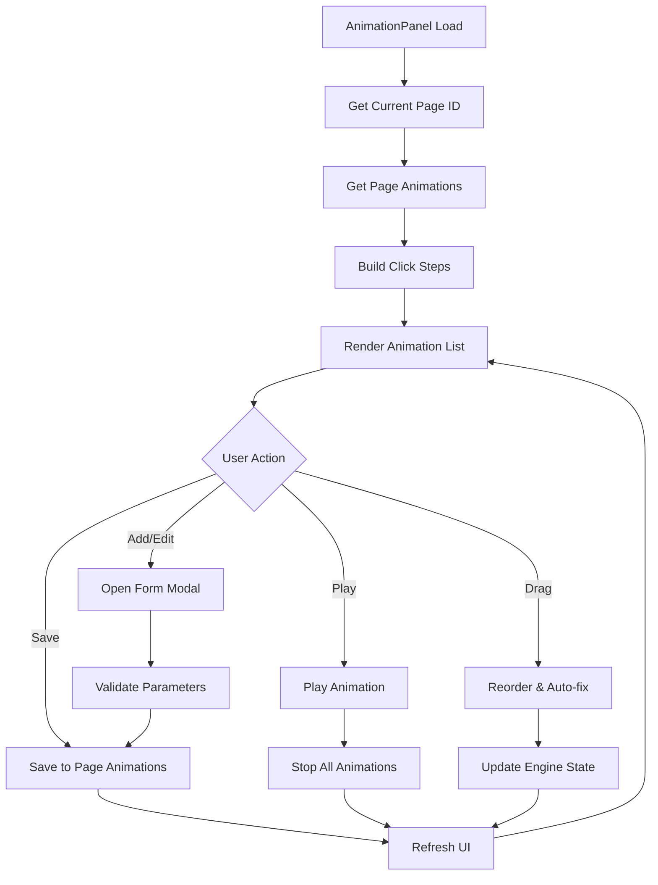

# Animation System

<cite>
**Referenced Files in This Document**
- [src/animation/index.ts](file://src/animation/index.ts)
- [src/animation/engine.ts](file://src/animation/engine.ts)
- [src/animation/adapter.ts](file://src/animation/adapter.ts)
- [src/animation/webAnimationAdapter.ts](file://src/animation/webAnimationAdapter.ts)
- [src/animation/gsapAdapter.ts](file://src/animation/gsapAdapter.ts)
- [src/animation/buildKeyframes.ts](file://src/animation/buildKeyframes.ts)
- [src/animation/scheduler.ts](file://src/animation/scheduler.ts)
- [src/types/animation.ts](file://src/types/animation.ts)
- [src/types/index.ts](file://src/types/index.ts)
- [src/components/AnimationPanel.tsx](file://src/components/AnimationPanel.tsx)
- [src/components/PreviewModal.tsx](file://src/components/PreviewModal.tsx)
- [src/engine/animationCommands.ts](file://src/engine/animationCommands.ts)
- [src/engine/timeline.ts](file://src/engine/timeline.ts)
- [src/engine/scene.ts](file://src/engine/scene.ts)
- [src/App.tsx](file://src/App.tsx)
- [package.json](file://package.json)
</cite>

## Update Summary
**Changes Made**
- Updated animation system to work with page-specific animation collections instead of slide-specific ones
- Enhanced AnimationPanel to use page-based animation management with currentPageId
- Updated PreviewModal to support page navigation with page-specific animation previews
- Modified animation commands to track page associations for page-scoped animations
- Updated Scene engine with page-specific animation CRUD operations
- Enhanced step-based execution model with page-aware navigation

## Table of Contents
1. [Introduction](#introduction)
2. [Project Structure](#project-structure)
3. [Core Components](#core-components)
4. [Architecture Overview](#architecture-overview)
5. [Detailed Component Analysis](#detailed-component-analysis)
6. [Dependency Analysis](#dependency-analysis)
7. [Performance Considerations](#performance-considerations)
8. [Troubleshooting Guide](#troubleshooting-guide)
9. [Conclusion](#conclusion)
10. [Appendices](#appendices)

## Introduction
This document describes the comprehensive Animation System featuring a modern adapter-based architecture with AnimationEngine, AnimationAdapter interface, scheduler system, and AnimationPanel UI. The system supports both Web Animations API and GSAP integration with advanced scheduling capabilities for click-triggered animations. It provides timeline-based animation orchestration, keyframe generation, animation playback control, and seamless integration with the React-based editor interface. The system now includes enhanced page-specific animation management, bidirectional navigation, step progress tracking, and improved user interface controls for better animation authoring and preview experiences across multiple pages.

## Project Structure
The animation system follows a modular architecture with clear separation between core engine, adapters, and UI components, now operating with page-specific animation collections:
- Animation core: AnimationEngine, AnimationAdapter interface, keyframe builders
- Adapter implementations: WebAnimationAdapter and GSAPAdapter
- Scheduler system: Enhanced step-based execution model with bidirectional navigation
- UI components: AnimationPanel with drag-and-drop functionality and PreviewModal with step progress tracking
- Scene engine: Page-specific animation CRUD operations and management
- Type definitions: Comprehensive animation configuration and controller interfaces

```mermaid
graph TB
subgraph "Animation Core"
ENGINE["AnimationEngine"]
ADAPTER["AnimationAdapter Interface"]
BUILD["buildKeyframes"]
END
subgraph "Enhanced Scheduler"
SCHEDULER["AnimationScheduler"]
PREV["playPreviousStep()"]
NEXT["playNextStep()"]
BACK["canGoBack()"]
ADVANCE["canAdvance()"]
PROGRESS["Step Progress Tracking"]
END
subgraph "Page-Specific Management"
SCENE["Scene Engine"]
PAGE_ANIMS["Page Animations Collection"]
ANIM_CRUD["Animation CRUD Operations"]
END
subgraph "Adapters"
WAAPI["WebAnimationAdapter"]
GSAP["GSAPAdapter"]
END
subgraph "UI Layer"
PANEL["AnimationPanel"]
PREVIEW["PreviewModal"]
COMMANDS["BatchAnimationCommand"]
END
subgraph "Types"
TYPES["Animation Types"]
DOC_TYPES["Document Types"]
END
ENGINE --> ADAPTER
ADAPTER --> WAAPI
ADAPTER --> GSAP
ENGINE --> BUILD
SCHEDULER --> ENGINE
SCHEDULER --> PREV
SCHEDULER --> NEXT
SCHEDULER --> BACK
SCHEDULER --> ADVANCE
PREVIEW --> PROGRESS
PANEL --> SCHEDULER
COMMANDS --> ENGINE
SCENE --> PAGE_ANIMS
SCENE --> ANIM_CRUD
PAGE_ANIMS --> TYPES
DOC_TYPES --> SCENE
```

**Diagram sources**
- [src/animation/engine.ts:1-120](file://src/animation/engine.ts#L1-L120)
- [src/animation/adapter.ts:1-27](file://src/animation/adapter.ts#L1-L27)
- [src/animation/webAnimationAdapter.ts:1-67](file://src/animation/webAnimationAdapter.ts#L1-L67)
- [src/animation/gsapAdapter.ts:1-140](file://src/animation/gsapAdapter.ts#L1-L140)
- [src/animation/buildKeyframes.ts:1-125](file://src/animation/buildKeyframes.ts#L1-L125)
- [src/animation/scheduler.ts:1-160](file://src/animation/scheduler.ts#L1-L160)
- [src/engine/scene.ts:175-233](file://src/engine/scene.ts#L175-L233)
- [src/components/AnimationPanel.tsx:1-856](file://src/components/AnimationPanel.tsx#L1-L856)
- [src/components/PreviewModal.tsx:1-252](file://src/components/PreviewModal.tsx#L1-L252)
- [src/engine/animationCommands.ts:1-44](file://src/engine/animationCommands.ts#L1-L44)
- [src/types/animation.ts:1-113](file://src/types/animation.ts#L1-L113)
- [src/types/index.ts:69-84](file://src/types/index.ts#L69-L84)

**Section sources**
- [src/animation/index.ts:1-8](file://src/animation/index.ts#L1-L8)
- [src/animation/engine.ts:1-120](file://src/animation/engine.ts#L1-L120)
- [src/animation/adapter.ts:1-27](file://src/animation/adapter.ts#L1-L27)
- [src/animation/webAnimationAdapter.ts:1-67](file://src/animation/webAnimationAdapter.ts#L1-L67)
- [src/animation/gsapAdapter.ts:1-140](file://src/animation/gsapAdapter.ts#L1-L140)
- [src/animation/buildKeyframes.ts:1-125](file://src/animation/buildKeyframes.ts#L1-L125)
- [src/animation/scheduler.ts:1-160](file://src/animation/scheduler.ts#L1-L160)
- [src/engine/scene.ts:175-233](file://src/engine/scene.ts#L175-L233)
- [src/components/AnimationPanel.tsx:1-856](file://src/components/AnimationPanel.tsx#L1-L856)
- [src/components/PreviewModal.tsx:1-252](file://src/components/PreviewModal.tsx#L1-L252)
- [src/engine/animationCommands.ts:1-44](file://src/engine/animationCommands.ts#L1-L44)
- [src/types/animation.ts:1-113](file://src/types/animation.ts#L1-L113)
- [src/types/index.ts:69-84](file://src/types/index.ts#L69-L84)

## Core Components
- **AnimationEngine**: Central orchestrator that manages animation configurations, builds keyframes, and delegates playback to adapter implementations
- **AnimationAdapter Interface**: Abstraction layer for different animation libraries (Web Animations API, GSAP)
- **WebAnimationAdapter**: Native browser animation implementation using element.animate()
- **GSAPAdapter**: Advanced animation library integration with tweening capabilities
- **AnimationScheduler**: Enhanced step-based execution model with bidirectional navigation, progress tracking, and page-aware operations
- **Scene Engine**: Page-specific animation management with CRUD operations for animation collections
- **AnimationPanel**: Interactive UI for creating, editing, and managing animations with drag-and-drop support and step progress visualization
- **PreviewModal**: Enhanced preview interface with step navigation controls, page navigation, and progress indicators
- **Keyframe Builder**: Generates WAAPI-compatible keyframes from animation configurations
- **Animation Types**: Comprehensive type definitions for animation configurations, effects, and controller interfaces

Key data model references:
- AnimationConfig with effect types, timing parameters, and start triggers
- Page structure with animations collection for page-specific management
- WAAPIKeyframe format compatible with Web Animations API
- AnimationController interface for lifecycle management
- ClickStep and AnimationBatch structures for scheduler execution
- StepProgress interface for tracking animation sequence progress

**Section sources**
- [src/animation/engine.ts:9-119](file://src/animation/engine.ts#L9-L119)
- [src/animation/adapter.ts:7-26](file://src/animation/adapter.ts#L7-L26)
- [src/animation/webAnimationAdapter.ts:12-66](file://src/animation/webAnimationAdapter.ts#L12-L66)
- [src/animation/gsapAdapter.ts:13-139](file://src/animation/gsapAdapter.ts#L13-L139)
- [src/animation/scheduler.ts:56-159](file://src/animation/scheduler.ts#L56-L159)
- [src/engine/scene.ts:175-233](file://src/engine/scene.ts#L175-L233)
- [src/components/AnimationPanel.tsx:87-539](file://src/components/AnimationPanel.tsx#L87-L539)
- [src/components/PreviewModal.tsx:21-57](file://src/components/PreviewModal.tsx#L21-L57)
- [src/animation/buildKeyframes.ts:7-109](file://src/animation/buildKeyframes.ts#L7-L109)
- [src/types/animation.ts:26-113](file://src/types/animation.ts#L26-L113)
- [src/types/index.ts:69-84](file://src/types/index.ts#L69-L84)

## Architecture Overview
The animation system implements a modern adapter-based architecture with clear separation of concerns and enhanced step-based execution model operating on page-specific animation collections:
- AnimationEngine manages configuration lifecycle and delegates to adapters
- AnimationAdapter interface provides abstraction for different animation libraries
- Enhanced AnimationScheduler implements sophisticated execution models with bidirectional navigation and progress tracking
- Scene engine manages page-specific animation collections with CRUD operations
- UI components provide comprehensive animation authoring capabilities with step visualization and page navigation
- StepProgress tracking enables real-time progress indication and navigation controls across pages



**Diagram sources**
- [src/components/AnimationPanel.tsx:256-276](file://src/components/AnimationPanel.tsx#L256-L276)
- [src/components/PreviewModal.tsx:38-57](file://src/components/PreviewModal.tsx#L38-L57)
- [src/engine/scene.ts:212-216](file://src/engine/scene.ts#L212-L216)
- [src/animation/engine.ts:53-70](file://src/animation/engine.ts#L53-L70)
- [src/animation/webAnimationAdapter.ts:15-43](file://src/animation/webAnimationAdapter.ts#L15-L43)
- [src/animation/gsapAdapter.ts:16-60](file://src/animation/gsapAdapter.ts#L16-L60)
- [src/animation/scheduler.ts:72-133](file://src/animation/scheduler.ts#L72-L133)

## Detailed Component Analysis

### Enhanced AnimationScheduler
The AnimationScheduler implements a sophisticated execution model for click-triggered animations using steps and batches with enhanced bidirectional navigation capabilities and page awareness.

**Enhanced Execution Model:**
- Steps: User-triggered animation groups (click events)
- Batches: Sequential execution within steps
- Concurrent execution: All animations in a batch play simultaneously
- Bidirectional navigation: Previous and next step traversal
- Progress tracking: Real-time step progress monitoring
- Page-aware operations: Works with page-specific animation collections

**Enhanced Step Types:**
- click: Starts a new step (user click)
- withPrev: Joins current batch (executes with previous animations)
- afterPrev: Starts new batch (executes after previous batch completes)

**Enhanced Scheduler Operations:**
- load(): Processes animation configurations into step structure from page-specific collections
- playNextStep(): Executes next step in sequence
- playPreviousStep(): Moves to previous step with animation cancellation
- canGoBack(): Validates backward navigation capability
- canAdvance(): Validates forward navigation capability
- reset(): Cancels all running animations and clears state
- getCurrentStepIndex(): Returns current step position
- getStepCount(): Returns total number of steps
- Step progress tracking: Real-time progress updates



**Diagram sources**
- [src/animation/scheduler.ts:56-159](file://src/animation/scheduler.ts#L56-L159)

**Section sources**
- [src/animation/scheduler.ts:13-159](file://src/animation/scheduler.ts#L13-L159)

### Enhanced PreviewModal UI Component
The PreviewModal provides an enhanced interface for animation preview with step navigation controls, progress tracking, and page navigation capabilities.

**Enhanced Features:**
- Step navigation controls with Previous Step and Next Step buttons
- Real-time step progress display with current/total step indicators
- Bidirectional navigation with canGoBack() and canAdvance() validation
- Enhanced keyboard controls (Space/Enter for advance, Escape for exit)
- Step progress synchronization with AnimationScheduler
- Reset functionality to restart animation sequence
- Page navigation controls for moving between pages
- Page-specific animation loading and preview

**Enhanced Playback Controls:**
- Previous Step button with disabled state when canGoBack() returns false
- Next Step button with disabled state when canAdvance() returns false
- Reset button to restart the entire animation sequence
- Progress indicator showing current step position
- Step count display (e.g., "Step 2 / 5")
- Page navigation buttons for moving between pages



**Diagram sources**
- [src/components/PreviewModal.tsx:19-57](file://src/components/PreviewModal.tsx#L19-L57)
- [src/components/PreviewModal.tsx:175-251](file://src/components/PreviewModal.tsx#L175-L251)

**Section sources**
- [src/components/PreviewModal.tsx:1-252](file://src/components/PreviewModal.tsx#L1-L252)

### Enhanced App Component Integration
The App component provides enhanced integration with the AnimationScheduler and step progress tracking system.

**Enhanced Features:**
- Step progress state management with stepProgress current/total tracking
- Bidirectional step navigation controls in the main interface
- Auto-step progress updates when navigating between steps
- Enhanced scheduler lifecycle management with proper cleanup
- Integration with both AnimationPanel and PreviewModal step controls
- Page-specific animation management through Scene engine

**Enhanced Controls:**
- Previous Step button with disabled state when canGoBack() returns false
- Next Step button with step progress display (e.g., "Next Step (2/5)")
- Reset functionality synchronized with step progress tracking
- Auto-refresh of step progress when animations change

**Section sources**
- [src/App.tsx:20-99](file://src/App.tsx#L20-L99)
- [src/App.tsx:200-260](file://src/App.tsx#L200-L260)

### AnimationPanel UI Component
The AnimationPanel provides a comprehensive interface for animation authoring with drag-and-drop functionality, real-time preview capabilities, and page-specific animation management.

**Core Features:**
- Animation creation and editing with form validation
- Drag-and-drop reordering with automatic start type adjustment
- Real-time animation preview and playback control
- Step visualization with batch indicators
- Parameter-specific form fields for different animation effects
- Enhanced default configuration values for better user experience
- Page-specific animation management using currentPageId

**Enhanced Form Defaults:**
- Duration: 0.8 seconds (improved responsiveness)
- Delay: 0 seconds (immediate execution)
- Easing: 'ease-in-out' (smooth motion curves)
- Repeat Count: 1 (single execution)
- Default start type based on element animation count

**Form Management:**
- Dynamic parameter fields based on selected animation effect
- Automatic parameter validation and defaults
- Real-time effect type detection (enter/emphasis/exit)
- Start type auto-correction during drag operations
- Page-specific animation loading and saving

**Playback Controls:**
- Individual animation preview with stop-all protection
- Step-based playback from specific animation
- Visual step numbering and relationship indicators
- Integration with AnimationScheduler for complex sequences
- Page-specific animation preview and testing



**Diagram sources**
- [src/components/AnimationPanel.tsx:87-539](file://src/components/AnimationPanel.tsx#L87-L539)

**Section sources**
- [src/components/AnimationPanel.tsx:1-856](file://src/components/AnimationPanel.tsx#L1-L856)

### Scene Engine with Page-Specific Animation Management
The Scene engine provides comprehensive page-specific animation management with CRUD operations for animation collections.

**Enhanced Page-Specific Operations:**
- addAnimation(pageId, config): Adds animation to specific page's animations collection
- removeAnimation(configId): Removes animation from any page's animations collection
- updateAnimation(configId, updates): Updates animation in any page's animations collection
- getAnimation(configId): Retrieves animation from any page's animations collection
- getPageAnimations(pageId): Returns all animations for a specific page
- reorderAnimations(pageId, orderedIds): Reorders animations within a specific page

**Page Structure Integration:**
- Page interface includes animations collection (Record<string, AnimationConfig>)
- Document structure supports multiple pages with individual animation collections
- currentPageId tracks the currently active page for animation operations

**Enhanced CRUD Operations:**
- Page-specific add/remove/update operations
- Cross-page search for animation retrieval
- Ordered animation management within pages
- Animation collection persistence across page operations

**Section sources**
- [src/engine/scene.ts:175-233](file://src/engine/scene.ts#L175-L233)
- [src/types/index.ts:69-84](file://src/types/index.ts#L69-L84)

### Keyframe Generation and Effects System
The keyframe generation system converts animation configurations into WAAPI-compatible keyframes with support for various animation effects.

**Effect Categories:**
- Enter Effects: fadeIn, zoomIn, slideIn, flyIn, rotateIn
- Emphasis Effects: pulse, shake, blink, scale, highlight
- Exit Effects: fadeOut, zoomOut, slideOut, flyOut, rotateOut

**Parameter Handling:**
- Directional effects support distance parameters
- Scale effects support fromScale/toScale ranges
- Rotation effects support angle ranges
- Brightness effects support intensity parameters

**Keyframe Generation Process:**
1. Effect type detection from AnimationConfig
2. Parameter extraction and validation
3. Offset calculation for timeline positioning
4. Transform string construction for CSS properties
5. WAAPI keyframe object creation

**Section sources**
- [src/animation/buildKeyframes.ts:7-125](file://src/animation/buildKeyframes.ts#L7-L125)
- [src/types/animation.ts:6-12](file://src/types/animation.ts#L6-L12)

### Animation Configuration and Types
The animation system uses comprehensive type definitions to ensure type safety and provide clear interfaces for all animation operations.

**Enhanced AnimationConfig Structure:**
- id: Unique identifier for animation instances
- elementId: Target element for animation application
- name: Human-readable animation name
- enable: Toggle for animation activation
- type: Animation category (enter/emphasis/exit)
- effect: Specific animation effect
- startType: Trigger mechanism (click/withPrev/afterPrev)
- duration: Animation length in seconds (default: 0.8)
- delay: Delay before animation start in seconds (default: 0)
- easing: Easing preset selection (default: 'ease-in-out')
- repeatCount: Number of animation repetitions (default: 1)
- params: Effect-specific parameter objects

**Enhanced Controller Interface:**
- finish(): Immediately completes animation
- cancel(): Terminates animation and resets state
- pause(): Temporarily halts animation progress
- play(): Resumes paused animation
- onFinish(): Registers completion callback

**Section sources**
- [src/types/animation.ts:26-98](file://src/types/animation.ts#L26-L98)

## Dependency Analysis
The animation system maintains clean dependency relationships with clear separation between core functionality and external libraries, enhanced with bidirectional navigation capabilities and page-specific operations.

**Internal Dependencies:**
- AnimationEngine depends on AnimationAdapter interface and keyframe builder
- WebAnimationAdapter and GSAPAdapter implement AnimationAdapter interface
- Enhanced AnimationScheduler depends on AnimationEngine and provides step navigation
- Scene engine manages page-specific animation collections with CRUD operations
- AnimationPanel depends on AnimationEngine and scheduler utilities
- PreviewModal depends on AnimationScheduler and step progress tracking
- AnimationCommands provide undo/redo functionality for animation operations

**External Dependencies:**
- GSAP library for advanced tweening capabilities
- @dnd-kit for drag-and-drop functionality in UI
- React ecosystem for component architecture

```mermaid
graph TB
subgraph "Internal Dependencies"
ENGINE["AnimationEngine"] --> ADAPTER["AnimationAdapter"]
ENGINE --> BUILD["buildKeyframes"]
WAAPI["WebAnimationAdapter"] --> ADAPTER
GSAP["GSAPAdapter"] --> ADAPTER
PANEL["AnimationPanel"] --> ENGINE
PANEL --> SCHEDULER["buildClickSteps"]
PREVIEW["PreviewModal"] --> SCHEDULER
PREVIEW --> STEP_PROGRESS["Step Progress Tracking"]
COMMANDS["BatchAnimationCommand"] --> ENGINE
SCENE["Scene Engine"] --> PAGE_ANIMS["Page Animations"]
SCENE --> ANIM_CRUD["Animation CRUD"]
PAGE_ANIMS --> TYPES["Animation Types"]
END
subgraph "External Dependencies"
GSAP_LIB["gsap"] --> GSAP
DND_KIT["@dnd-kit/*"] --> PANEL
END
```

**Diagram sources**
- [src/animation/engine.ts:1-120](file://src/animation/engine.ts#L1-L120)
- [src/animation/webAnimationAdapter.ts:1-67](file://src/animation/webAnimationAdapter.ts#L1-L67)
- [src/animation/gsapAdapter.ts:1-140](file://src/animation/gsapAdapter.ts#L1-L140)
- [src/components/AnimationPanel.tsx:1-856](file://src/components/AnimationPanel.tsx#L1-L856)
- [src/components/PreviewModal.tsx:1-252](file://src/components/PreviewModal.tsx#L1-L252)
- [src/engine/animationCommands.ts:1-44](file://src/engine/animationCommands.ts#L1-L44)
- [src/engine/scene.ts:175-233](file://src/engine/scene.ts#L175-L233)
- [package.json:12-20](file://package.json#L12-L20)

**Section sources**
- [src/animation/engine.ts:1-120](file://src/animation/engine.ts#L1-L120)
- [src/animation/adapter.ts:1-27](file://src/animation/adapter.ts#L1-L27)
- [src/animation/webAnimationAdapter.ts:1-67](file://src/animation/webAnimationAdapter.ts#L1-L67)
- [src/animation/gsapAdapter.ts:1-140](file://src/animation/gsapAdapter.ts#L1-L140)
- [src/components/AnimationPanel.tsx:1-856](file://src/components/AnimationPanel.tsx#L1-L856)
- [src/components/PreviewModal.tsx:1-252](file://src/components/PreviewModal.tsx#L1-L252)
- [src/engine/animationCommands.ts:1-44](file://src/engine/animationCommands.ts#L1-L44)
- [src/engine/scene.ts:175-233](file://src/engine/scene.ts#L175-L233)
- [package.json:12-20](file://package.json#L12-L20)

## Performance Considerations
The animation system implements several performance optimizations for smooth playback and efficient resource management, enhanced with bidirectional navigation capabilities and page-specific operations.

**Adapter Performance:**
- WebAnimationAdapter uses native browser APIs for optimal performance
- GSAPAdapter leverages optimized tweening algorithms
- Both adapters implement caching mechanisms to avoid redundant operations

**Memory Management:**
- WeakMap-based caches prevent memory leaks
- Proper cleanup of animation controllers and DOM references
- Efficient configuration registry with Map data structure
- Enhanced cleanup of running controllers during step navigation
- Page-specific animation collections prevent cross-page memory leaks

**Execution Model Optimizations:**
- Batch execution reduces animation overhead
- Concurrency control prevents resource contention
- Smart element querying with optional root scoping
- Bidirectional navigation cancels animations appropriately
- Page-aware operations minimize unnecessary animation processing

**UI Performance:**
- React component memoization and optimization
- Drag-and-drop with efficient state updates
- Debounced form validation and submission
- Step progress tracking with minimal re-renders
- Page navigation with lazy loading of animation collections

**Animation Optimization Strategies:**
- Minimal DOM manipulation through transform properties
- Efficient keyframe generation avoiding unnecessary recalculations
- Proper easing curve selection for smooth motion profiles
- Enhanced step navigation with animation cancellation
- Page-specific animation loading for improved performance

## Troubleshooting Guide
Common issues and solutions for the enhanced adapter-based animation system with bidirectional navigation and page-specific operations.

**Adapter Issues:**
- WebAnimationAdapter not working: Verify browser support for Web Animations API
- GSAPAdapter errors: Ensure GSAP library is properly installed and imported
- Missing dependencies: Check package.json for required animation libraries

**Animation Playback Problems:**
- Animations not triggering: Verify element selectors match data-element-id attributes
- Incorrect timing: Check duration/delay conversions (seconds to milliseconds)
- Easing not applied: Confirm easing preset names match supported values
- Page-specific animations not loading: Verify pageId parameter in getPageAnimations()

**Enhanced Scheduler Issues:**
- Steps not executing: Verify animation startType assignments (click/withPrev/afterPrev)
- Batch execution problems: Check animation ordering and dependencies
- Step navigation issues: Ensure step indices are within valid range
- Previous step navigation failing: Verify canGoBack() returns true before calling playPreviousStep()
- Step progress not updating: Check stepProgress state synchronization with scheduler
- Page navigation issues: Verify currentPageId is properly managed

**UI Component Problems:**
- AnimationPanel not displaying: Verify AnimationPanel is properly integrated into App
- PreviewModal controls disabled: Check canGoBack() and canAdvance() states
- Drag-and-drop not working: Check @dnd-kit installation and sensor configuration
- Form validation errors: Ensure parameter values are within acceptable ranges
- Page navigation buttons disabled: Check pageIds array and currentPageIndex bounds

**Scene Engine Issues:**
- Animation not found: Verify animation exists in correct page's animations collection
- Page animations not updating: Check pageId parameter in CRUD operations
- Animation ordering problems: Verify orderedIds array matches page animations keys
- Memory leaks with animations: Ensure proper cleanup in page removal

**Debugging Techniques:**
- Enable browser developer tools to inspect animation controllers
- Use console logging in AnimationEngine for operation tracking
- Monitor WeakMap caches for proper cleanup
- Validate animation configurations before registration
- Check step progress state updates in PreviewModal and App components
- Verify page-specific animation collections are properly maintained
- Debug page navigation with console logs for currentPageId changes

**Section sources**
- [src/animation/webAnimationAdapter.ts:12-66](file://src/animation/webAnimationAdapter.ts#L12-L66)
- [src/animation/gsapAdapter.ts:13-139](file://src/animation/gsapAdapter.ts#L13-L139)
- [src/animation/scheduler.ts:115-159](file://src/animation/scheduler.ts#L115-L159)
- [src/components/AnimationPanel.tsx:87-539](file://src/components/AnimationPanel.tsx#L87-L539)
- [src/components/PreviewModal.tsx:175-251](file://src/components/PreviewModal.tsx#L175-L251)
- [src/engine/scene.ts:175-233](file://src/engine/scene.ts#L175-L233)

## Conclusion
The Animation System represents a comprehensive, modern approach to animation orchestration with its enhanced adapter-based architecture, sophisticated scheduler with bidirectional navigation, and rich UI integration. The system successfully abstracts different animation libraries while providing powerful scheduling capabilities for user-triggered animations with step progress tracking. With enhanced page-specific animation management, bidirectional navigation, real-time progress monitoring, and improved user interface controls, the system delivers smooth, performant animations that integrate seamlessly with the React-based editor interface. The addition of page-specific animation collections, playPreviousStep(), canGoBack(), and step progress tracking significantly improves the animation authoring and preview experience across multiple pages.

## Appendices

### Setting Up Animation Configurations
**Enhanced Animation Configuration Process:**
1. Create AnimationConfig with effect, parameters, and timing settings (using enhanced defaults)
2. Register configuration with AnimationEngine.register() for global management
3. Use AnimationPanel for interactive editing and preview with page-specific animation management
4. Implement custom effects through keyframe generation
5. Configure step-based animation sequences with bidirectional navigation
6. Manage animations within specific pages using pageId parameters

**Enhanced Configuration Examples:**
- Basic fadeIn: Simple opacity transition with default parameters (0.8s duration, 'ease-in-out' easing)
- Complex slideIn: Directional movement with distance specification
- Scale animation: FromScale/ToScale parameters for size transitions
- Custom effects: Extend buildKeyframes for specialized animation types
- Step-based sequences: Configure click/withPrev/afterPrev relationships for complex presentations
- Page-specific animations: Use pageId to manage animations within specific pages

**Section sources**
- [src/animation/engine.ts:33-50](file://src/animation/engine.ts#L33-L50)
- [src/animation/buildKeyframes.ts:7-109](file://src/animation/buildKeyframes.ts#L7-L109)
- [src/types/animation.ts:26-39](file://src/types/animation.ts#L26-L39)
- [src/components/AnimationPanel.tsx:103-106](file://src/components/AnimationPanel.tsx#L103-L106)

### Animation Effects Reference
**Supported Animation Effects:**
- **Enter Effects**: fadeIn, zoomIn, slideIn, flyIn, rotateIn
- **Emphasis Effects**: pulse, shake, blink, scale, highlight
- **Exit Effects**: fadeOut, zoomOut, slideOut, flyOut, rotateOut

**Enhanced Effect Parameters:**
- Directional effects: direction (left/right/up/down), distance (pixels)
- Scale effects: fromScale, toScale (numeric values)
- Rotation effects: fromAngle, toAngle (degrees)
- Brightness effects: brightness (intensity multiplier)

**Section sources**
- [src/types/animation.ts:6-12](file://src/types/animation.ts#L6-L12)
- [src/animation/buildKeyframes.ts:14-104](file://src/animation/buildKeyframes.ts#L14-L104)

### Enhanced Scheduler Usage Patterns
**Enhanced Step-Based Animation Sequencing:**
- click: Initiates new animation step (user interaction)
- withPrev: Executes animation concurrently with previous batch
- afterPrev: Executes animation sequentially after previous batch completes

**Enhanced Implementation Patterns:**
- Complex presentation flows with multiple animation layers and bidirectional navigation
- Interactive storytelling with user-controlled pacing and step progress tracking
- Coordinated multi-element animations with precise timing and step validation
- Real-time step progress monitoring for animation sequences
- Page-specific animation sequences with cross-page navigation

**Enhanced Navigation Methods:**
- playNextStep(): Advances to next step with automatic batch execution
- playPreviousStep(): Returns to previous step with animation cancellation
- canGoBack(): Validates backward navigation capability
- canAdvance(): Validates forward navigation capability
- getCurrentStepIndex(): Returns current step position for UI updates

**Section sources**
- [src/animation/scheduler.ts:13-49](file://src/animation/scheduler.ts#L13-L49)
- [src/animation/scheduler.ts:72-159](file://src/animation/scheduler.ts#L72-L159)

### Integration with Editor Components
**Enhanced AnimationPanel Integration:**
- Direct integration with Engine for scene operations
- AnimationEngine integration for playback control
- Real-time preview and validation capabilities
- Drag-and-drop reordering with automatic state updates
- Step progress visualization and navigation controls
- Page-specific animation management through currentPageId

**Enhanced App Component Integration:**
- Right-panel tab switching for animation interface
- Preview modal integration for animation testing with step progress
- State synchronization between editor and animation systems
- Bidirectional step navigation controls with progress tracking
- Page-specific animation management through Scene engine

**Enhanced PreviewModal Integration:**
- Step navigation controls with Previous/Next buttons
- Real-time step progress display and synchronization
- Enhanced keyboard controls for animation preview
- Reset functionality for restarting animation sequences
- Page navigation controls for moving between pages
- Page-specific animation loading and preview

**Section sources**
- [src/components/AnimationPanel.tsx:87-539](file://src/components/AnimationPanel.tsx#L87-L539)
- [src/App.tsx:291-317](file://src/App.tsx#L291-L317)
- [src/components/PreviewModal.tsx:175-251](file://src/components/PreviewModal.tsx#L175-L251)

### Build and Runtime Configuration
**Package Dependencies:**
- gsap: Advanced animation and tweening library
- @dnd-kit: Drag-and-drop functionality for animation management
- React ecosystem: Core framework and UI components

**Development Setup:**
- TypeScript configuration for type safety
- Vite build system for development and production
- ESLint configuration for code quality

**Section sources**
- [package.json:12-20](file://package.json#L12-L20)
- [package.json:21-32](file://package.json#L21-L32)