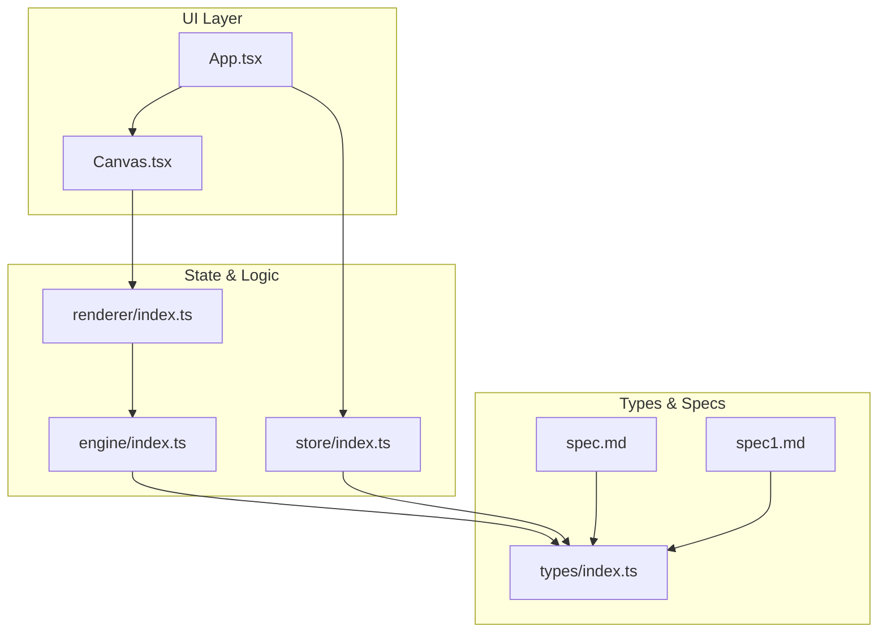
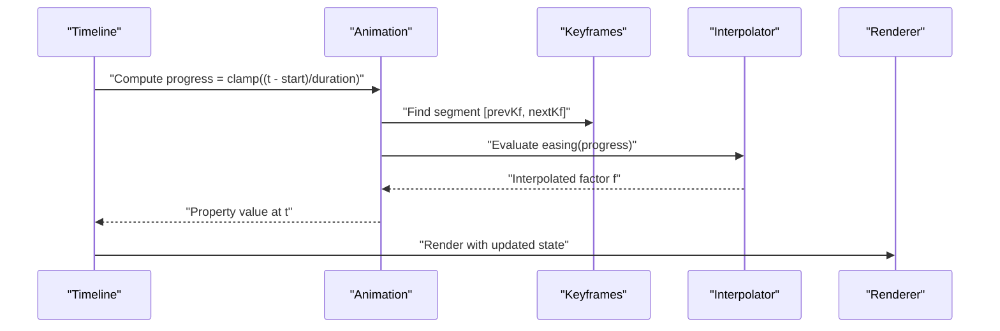
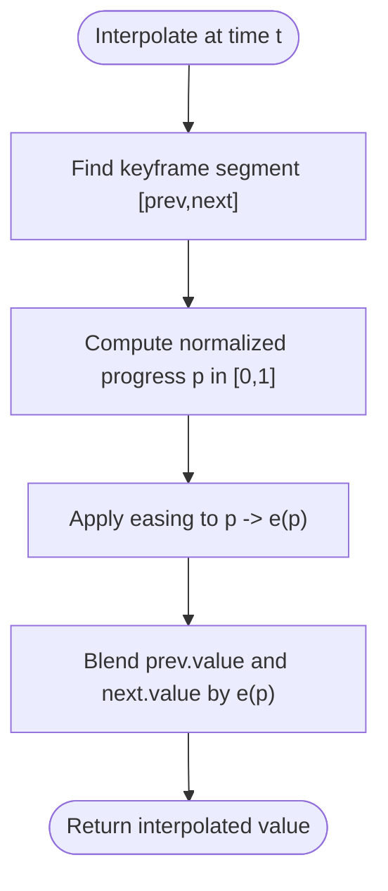
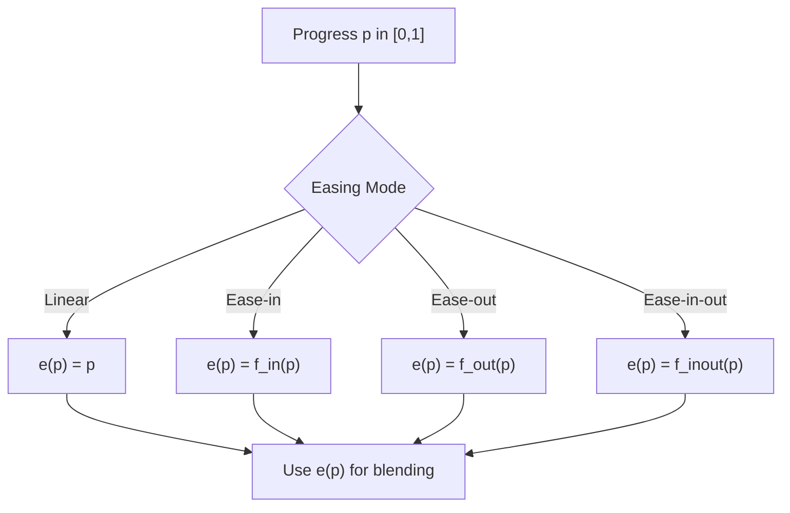
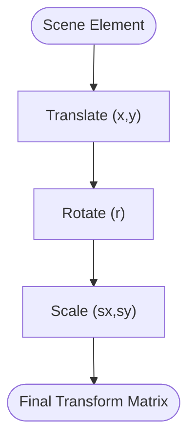
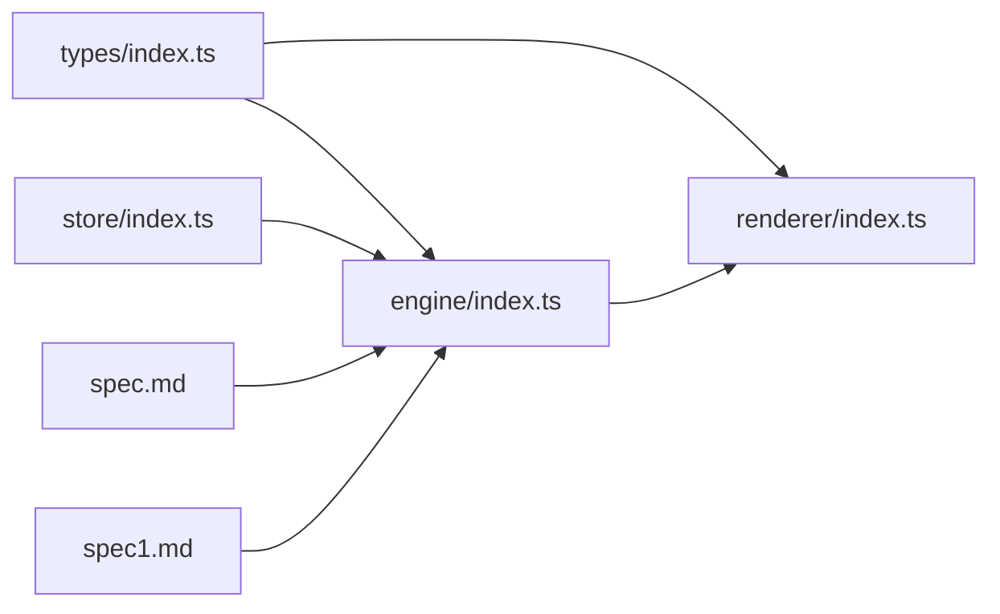

# Keyframe Interpolation

<cite>
**Referenced Files in This Document**
- [README.md](file://README.md)
- [spec.md](file://spec.md)
- [spec1.md](file://spec1.md)
- [src/types/index.ts](file://src/types/index.ts)
- [src/engine/index.ts](file://src/engine/index.ts)
- [src/renderer/index.ts](file://src/renderer/index.ts)
- [src/store/index.ts](file://src/store/index.ts)
- [src/App.tsx](file://src/App.tsx)
- [src/main.tsx](file://src/main.tsx)
- [src/components/Canvas.tsx](file://src/components/Canvas.tsx)
</cite>

## Table of Contents
1. [Introduction](#introduction)
2. [Project Structure](#project-structure)
3. [Core Components](#core-components)
4. [Architecture Overview](#architecture-overview)
5. [Detailed Component Analysis](#detailed-component-analysis)
6. [Dependency Analysis](#dependency-analysis)
7. [Performance Considerations](#performance-considerations)
8. [Troubleshooting Guide](#troubleshooting-guide)
9. [Conclusion](#conclusion)
10. [Appendices](#appendices)

## Introduction
This document describes the Keyframe Interpolation system designed to compute intermediate animation states over time. It covers the data model for keyframes and animations, the interpolation pipeline, and how easing functions influence motion curves. It also outlines how to set up keyframes for position, rotation, scale, and opacity, and discusses spline interpolation, blending, precision, numerical stability, and debugging aids for timing issues.

## Project Structure
The repository is a React-based editor with a clear separation of concerns:
- Types define shared data models for elements, slides, animations, and keyframes.
- Engine encapsulates the core logic and state transitions.
- Renderer handles pure data-to-UI transformations.
- Store manages editor state.
- App and Canvas provide the UI shell.

**Diagram sources**
- [src/App.tsx:1-17](file://src/App.tsx#L1-L17)
- [src/components/Canvas.tsx:1-40](file://src/components/Canvas.tsx#L1-L40)
- [src/engine/index.ts:1-3](file://src/engine/index.ts#L1-L3)
- [src/renderer/index.ts:1-3](file://src/renderer/index.ts#L1-L3)
- [src/store/index.ts:1-2](file://src/store/index.ts#L1-L2)
- [src/types/index.ts:1-229](file://src/types/index.ts#L1-L229)
- [spec.md:231-280](file://spec.md#L231-L280)
- [spec1.md:184-198](file://spec1.md#L184-L198)

**Section sources**
- [README.md:1-3](file://README.md#L1-L3)
- [src/App.tsx:1-17](file://src/App.tsx#L1-L17)
- [src/components/Canvas.tsx:1-40](file://src/components/Canvas.tsx#L1-L40)
- [src/engine/index.ts:1-3](file://src/engine/index.ts#L1-L3)
- [src/renderer/index.ts:1-3](file://src/renderer/index.ts#L1-L3)
- [src/store/index.ts:1-2](file://src/store/index.ts#L1-L2)
- [src/types/index.ts:1-229](file://src/types/index.ts#L1-L229)
- [spec.md:231-280](file://spec.md#L231-L280)
- [spec1.md:184-198](file://spec1.md#L184-L198)

## Core Components
- Keyframe: A time/value pair with an easing designation used to drive interpolation.
- Animation: A sequence of keyframes applied to a specific element property.
- Timeline: A time-driven controller that computes progress and triggers interpolation.
- Easing Functions: Supported easing modes include linear, ease-in, ease-out, and ease-in-out.

Keyframe and animation types are defined in the shared types module. The spec documents the time-driven rendering loop and keyframe interpolation capability.

**Section sources**
- [src/types/index.ts:78-92](file://src/types/index.ts#L78-L92)
- [src/types/index.ts:198-219](file://src/types/index.ts#L198-L219)
- [spec.md:261-267](file://spec.md#L261-L267)
- [spec1.md:184-198](file://spec1.md#L184-L198)

## Architecture Overview
The animation pipeline is time-centric:
- Timeline tracks current time and duration.
- For each animation, progress is computed as normalized time.
- Interpolation selects the relevant keyframe segment and applies easing to derive the animated value.
- Renderer consumes the computed state to produce UI updates.

**Diagram sources**
- [spec.md:261-267](file://spec.md#L261-L267)
- [spec1.md:184-198](file://spec1.md#L184-L198)
- [src/types/index.ts:78-92](file://src/types/index.ts#L78-L92)

## Detailed Component Analysis

### Data Model: Keyframes and Animations
- Keyframe: Contains a unique identifier, absolute time, target value, and easing mode.
- Animation: Associates an element property with a list of keyframes.
- EasingFunction: Enumerates supported easing modes.

These types enable precise specification of motion curves and property targets.

**Section sources**
- [src/types/index.ts:78-92](file://src/types/index.ts#L78-L92)
- [src/types/index.ts:78](file://src/types/index.ts#L78)

### Interpolation Pipeline
- Segment Selection: For a given time, locate the preceding and succeeding keyframes that bound the time.
- Normalized Progress: Compute progress within the segment as a 0..1 value.
- Easing Application: Map progress through the easing curve to obtain a modified factor.
- Value Interpolation: Blend between the two keyframe values using the eased factor.

**Diagram sources**
- [spec.md:261-267](file://spec.md#L261-L267)
- [src/types/index.ts:78-92](file://src/types/index.ts#L78-L92)

**Section sources**
- [spec.md:261-267](file://spec.md#L261-L267)
- [src/types/index.ts:78-92](file://src/types/index.ts#L78-L92)

### Easing Functions
Supported easing modes:
- Linear: Direct proportionality between progress and eased factor.
- Ease-in: Starts slow, accelerates toward the end.
- Ease-out: Starts fast, decelerates toward the end.
- Ease-in-out: Combines ease-in and ease-out for smoother starts and ends.

Custom easing functions can be introduced by extending the easing type and implementing the corresponding mapping from progress to eased factor.

**Diagram sources**
- [src/types/index.ts:78](file://src/types/index.ts#L78)

**Section sources**
- [src/types/index.ts:78](file://src/types/index.ts#L78)

### Transform Matrix Computation
While the current types define positional and rotational properties, the spec indicates applying transforms during rendering. A typical 2D transform matrix derived from position (x, y), rotation (radians), scale (sx, sy), and optional skew/rotation center can be constructed and applied by the renderer.

**Diagram sources**
- [spec1.md:149-163](file://spec1.md#L149-L163)

**Section sources**
- [spec1.md:149-163](file://spec1.md#L149-L163)

### Setting Up Keyframes
Examples of constructing animations using the provided mock data pattern:
- Position X: Define keyframes at different times with numeric values and select an easing mode.
- Opacity: Define keyframes transitioning from 0 to 1 with an easing mode suitable for fade effects.

These examples demonstrate how to structure keyframes for common properties.

**Section sources**
- [src/types/index.ts:198-219](file://src/types/index.ts#L198-L219)

### Spline Interpolation for Smooth Curves
For smooth curves beyond piecewise segments, cubic splines or Bézier curves can be used. The spec’s path animation section hints at curve-based motion. To implement spline interpolation:
- Represent each segment as a parametric curve with control points.
- Evaluate the curve at the eased progress to obtain smooth intermediate positions.
- Optionally precompute tangents or use Catmull-Rom splines for natural interpolation through waypoints.

[No sources needed since this section provides general guidance]

### Keyframe Blending Techniques
- Multi-property blending: Apply separate interpolations per property (x, y, rotation, scale, opacity) and combine results.
- Weighted blending: When multiple animations target the same property, blend their results using weights or precedence rules.
- Overlap handling: Resolve overlapping keyframes by prioritizing later keyframes or by compositing based on animation-specific rules.

[No sources needed since this section provides general guidance]

### Performance Optimization
- Precomputed easing tables: Cache easing evaluations for common progress steps to reduce repeated computations.
- Early exit checks: Skip interpolation when time is outside keyframe bounds or when values are constant.
- Batch evaluation: Interpolate multiple properties in a single pass per element to minimize overhead.
- Efficient timeline scheduling: Use requestAnimationFrame and delta-time accumulation to avoid redundant renders.

[No sources needed since this section provides general guidance]

## Dependency Analysis
The system exhibits clean separation:
- Types define contracts for animations and keyframes.
- Engine orchestrates state transitions and command execution.
- Renderer depends on pure data transformations.
- Store holds editor state independent of scene data.
- Spec documents the time-driven pipeline and interpolation expectations.

**Diagram sources**
- [src/types/index.ts:1-229](file://src/types/index.ts#L1-L229)
- [src/engine/index.ts:1-3](file://src/engine/index.ts#L1-L3)
- [src/renderer/index.ts:1-3](file://src/renderer/index.ts#L1-L3)
- [src/store/index.ts:1-2](file://src/store/index.ts#L1-L2)
- [spec.md:231-280](file://spec.md#L231-L280)
- [spec1.md:184-198](file://spec1.md#L184-L198)

**Section sources**
- [src/types/index.ts:1-229](file://src/types/index.ts#L1-L229)
- [src/engine/index.ts:1-3](file://src/engine/index.ts#L1-L3)
- [src/renderer/index.ts:1-3](file://src/renderer/index.ts#L1-L3)
- [src/store/index.ts:1-2](file://src/store/index.ts#L1-L2)
- [spec.md:231-280](file://spec.md#L231-L280)
- [spec1.md:184-198](file://spec1.md#L184-L198)

## Performance Considerations
- Minimize allocations during interpolation loops.
- Use incremental updates and memoization for repeated queries.
- Prefer vectorized operations for multi-property interpolation.
- Avoid expensive operations inside requestAnimationFrame callbacks.

[No sources needed since this section provides general guidance]

## Troubleshooting Guide
Common issues and remedies:
- Timing drift: Ensure timeline time increments are monotonic and clamped to the animation duration.
- Easing mismatches: Verify easing mode selection aligns with intended motion feel.
- Numerical instability: Clamp progress to [0, 1] and guard against division by zero when computing normalized progress.
- Rendering artifacts: Confirm transform matrix construction and rendering order match the intended visual outcome.

[No sources needed since this section provides general guidance]

## Conclusion
The Keyframe Interpolation system centers on a time-driven pipeline with explicit easing and segment-based interpolation. The shared types and specs establish a robust foundation for animating properties like position, rotation, scale, and opacity. Extending the system to spline interpolation, advanced blending, and optimized evaluation will further enhance smoothness and performance.

[No sources needed since this section summarizes without analyzing specific files]

## Appendices

### Appendix A: Example Keyframe Setups
- Position X: Two keyframes at times 0 and 1000 with numeric values and an easing mode.
- Opacity: Two keyframes transitioning from 0 to 1 with an easing mode.

These examples illustrate the structure and intent for property animations.

**Section sources**
- [src/types/index.ts:198-219](file://src/types/index.ts#L198-L219)