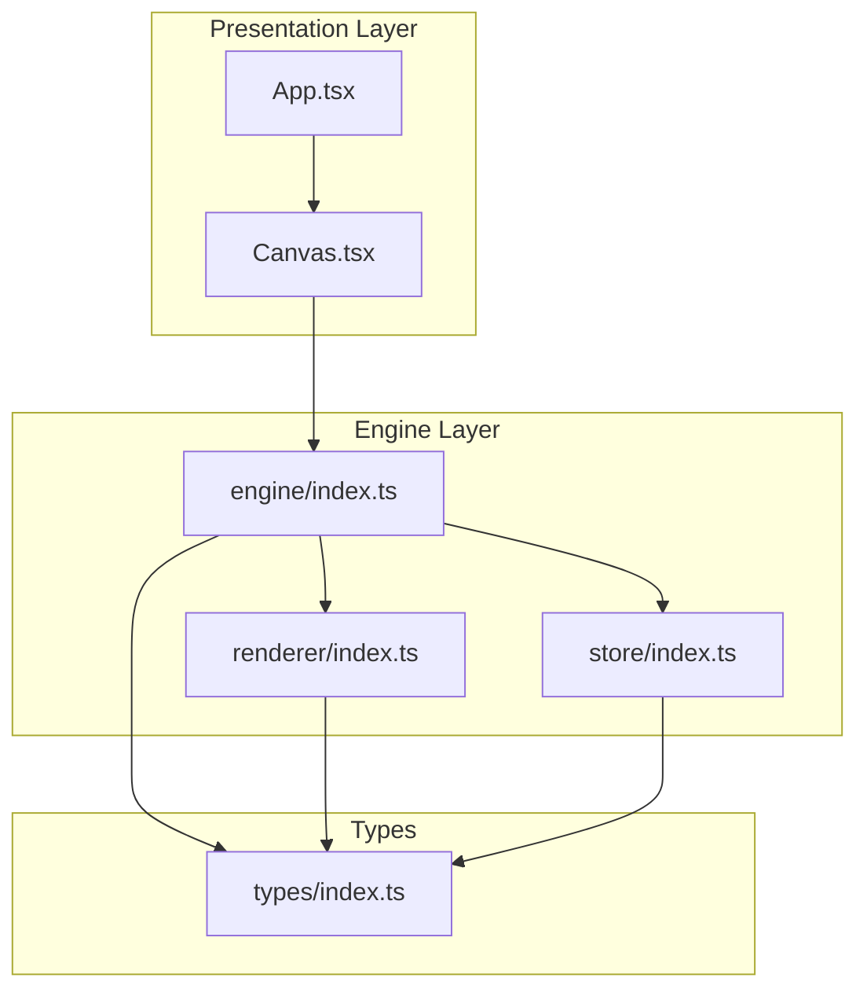
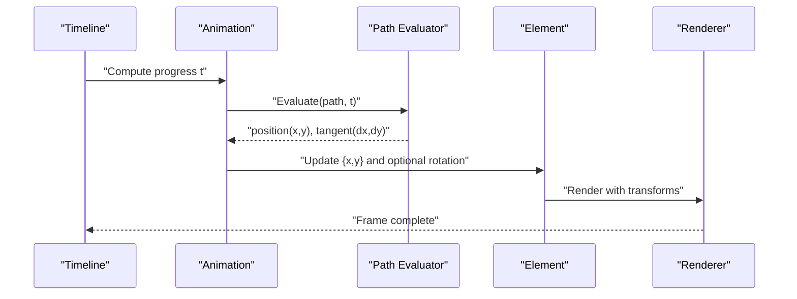
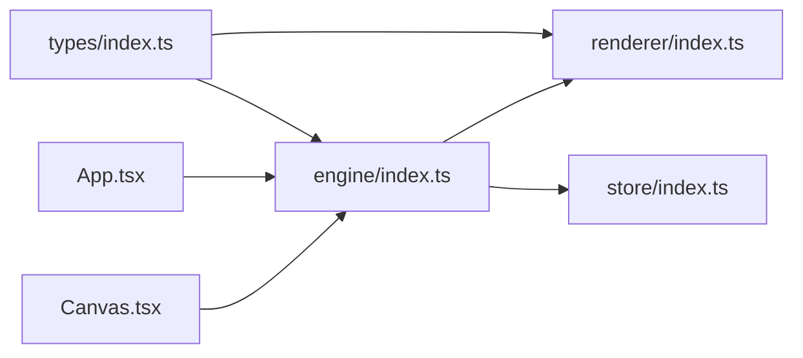
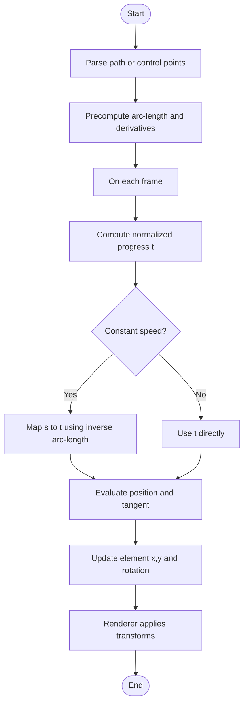

# Path Animation

<cite>
**Referenced Files in This Document**
- [README.md](file://README.md)
- [spec.md](file://spec.md)
- [spec1.md](file://spec1.md)
- [src/types/index.ts](file://src/types/index.ts)
- [src/engine/index.ts](file://src/engine/index.ts)
- [src/renderer/index.ts](file://src/renderer/index.ts)
- [src/store/index.ts](file://src/store/index.ts)
- [src/components/Canvas.tsx](file://src/components/Canvas.tsx)
- [src/App.tsx](file://src/App.tsx)
- [src/main.tsx](file://src/main.tsx)
</cite>

## Table of Contents
1. [Introduction](#introduction)
2. [Project Structure](#project-structure)
3. [Core Components](#core-components)
4. [Architecture Overview](#architecture-overview)
5. [Detailed Component Analysis](#detailed-component-analysis)
6. [Dependency Analysis](#dependency-analysis)
7. [Performance Considerations](#performance-considerations)
8. [Troubleshooting Guide](#troubleshooting-guide)
9. [Conclusion](#conclusion)
10. [Appendices](#appendices)

## Introduction
This document describes the Path Animation system for complex motion along curves and custom paths. It covers path definition, control point manipulation, tangent calculation, parameterization, arc-length computation, and velocity control. It also includes examples for circular, elliptical, and cubic Bezier paths, discusses optimization, collision detection, integration with element transforms, performance considerations, memory usage, and debugging tools.

## Project Structure
The repository is a React + TypeScript Vite project structured around a framework-agnostic engine, a pure renderer, and a minimal store. Path animation is designed to be part of the animation pipeline driven by a timeline and integrated with element transforms.

**Diagram sources**
- [src/App.tsx:1-17](file://src/App.tsx#L1-L17)
- [src/components/Canvas.tsx:1-40](file://src/components/Canvas.tsx#L1-L40)
- [src/engine/index.ts:1-3](file://src/engine/index.ts#L1-L3)
- [src/renderer/index.ts:1-3](file://src/renderer/index.ts#L1-L3)
- [src/store/index.ts:1-2](file://src/store/index.ts#L1-L2)
- [src/types/index.ts:1-229](file://src/types/index.ts#L1-L229)

**Section sources**
- [README.md:1-3](file://README.md#L1-L3)
- [src/App.tsx:1-17](file://src/App.tsx#L1-L17)
- [src/components/Canvas.tsx:1-40](file://src/components/Canvas.tsx#L1-L40)
- [src/engine/index.ts:1-3](file://src/engine/index.ts#L1-L3)
- [src/renderer/index.ts:1-3](file://src/renderer/index.ts#L1-L3)
- [src/store/index.ts:1-2](file://src/store/index.ts#L1-L2)
- [src/types/index.ts:1-229](file://src/types/index.ts#L1-L229)

## Core Components
- Element model and transforms: Elements carry positional, rotational, and opacity attributes suitable for path-driven motion.
- Animation model: Animations define keyframes with time offsets and easing functions; path animations will extend this model to include path geometry and parameterization.
- Timeline: Drives playback and interpolation; integrates with path evaluation to compute positions at each frame.
- Renderer: Applies transforms to elements during render; path animation updates should feed transform properties.
- Engine: Central orchestration layer; path animation commands will be issued here and executed atomically.

Key modeling references:
- Element types and transforms: [src/types/index.ts:9-51](file://src/types/index.ts#L9-L51)
- Animation and keyframe types: [src/types/index.ts:87-92](file://src/types/index.ts#L87-L92)
- Mock animations: [src/types/index.ts:198-219](file://src/types/index.ts#L198-L219)

**Section sources**
- [src/types/index.ts:9-51](file://src/types/index.ts#L9-L51)
- [src/types/index.ts:87-92](file://src/types/index.ts#L87-L92)
- [src/types/index.ts:198-219](file://src/types/index.ts#L198-L219)

## Architecture Overview
Path animation is implemented as an extension of the existing animation system:
- Path definition is stored alongside animations (SVG path string or control points).
- Timeline computes normalized progress per animation.
- Path evaluator converts progress to a 2D position and tangent vector.
- Renderer applies the computed position and optional rotation derived from the tangent.

**Diagram sources**
- [spec.md:281-307](file://spec.md#L281-L307)
- [src/types/index.ts:87-92](file://src/types/index.ts#L87-L92)

## Detailed Component Analysis

### Path Definition Systems
- SVG path string: A compact representation of curves and segments. Editing overlays can manipulate control points and segments.
- Control point arrays: Explicit arrays of control points enable programmatic generation and editing.
- Segment types: Line, quadratic Bezier, cubic Bezier, and elliptical arcs.

Implementation guidance:
- Store path as either an SVG path string or a parsed array of segments with control points.
- Provide conversion utilities between SVG path and internal segment arrays.

References:
- Path data concept: [spec.md:294-298](file://spec.md#L294-L298)

**Section sources**
- [spec.md:294-298](file://spec.md#L294-L298)

### Control Point Manipulation
- Edit-time overlay: An SVG overlay allows interactive manipulation of control points and curve handles.
- Validation: Enforce geometric constraints (e.g., handle symmetry for smooth curves).
- Serialization: Persist control points or regenerate SVG path string after edits.

References:
- Edit-time overlay: [spec.md:285-291](file://spec.md#L285-L291)

**Section sources**
- [spec.md:285-291](file://spec.md#L285-L291)

### Tangent Calculation and Smooth Movement
- Tangent vector: Derivative of the curve at parameter t yields direction for orientation.
- Normalization: Use unit tangent for consistent velocity scaling.
- Rotation: Compute angle from tangent for element rotation aligned with motion.

References:
- Path playback concept: [spec.md:302-306](file://spec.md#L302-L306)

**Section sources**
- [spec.md:302-306](file://spec.md#L302-L306)

### Path Parameterization and Arc-Length
- Parameter t: Ranges from 0 to 1 across the path.
- Arc-length s: Uniformly sampled for constant-velocity motion; requires numerical integration or precomputed lookup tables.
- Re-parameterization: Map uniform s to t using inverse arc-length function or spline interpolation.

References:
- Playback and parameterization: [spec.md:302-306](file://spec.md#L302-L306)

**Section sources**
- [spec.md:302-306](file://spec.md#L302-L306)

### Velocity Control Along Curved Trajectories
- Constant speed: Use arc-length parameterization; adjust time scaling to maintain desired speed.
- Variable speed: Combine arc-length with easing functions to modulate velocity profile.
- Acceleration/deceleration: Apply easing to the arc-length-normalized progress.

References:
- Playback and parameterization: [spec.md:302-306](file://spec.md#L302-L306)

**Section sources**
- [spec.md:302-306](file://spec.md#L302-L306)

### Examples: Circular, Elliptical, and Cubic Bezier Paths
- Circular path: Centered circle with radius r; parameterized by angle θ(t).
- Elliptical path: Ellipse with semi-axes a and b; parameterized by angle θ(t).
- Cubic Bezier: Four control points P0, P1, P2, P3; evaluate using Bernstein polynomials.

References:
- Path data concept: [spec.md:294-298](file://spec.md#L294-L298)

**Section sources**
- [spec.md:294-298](file://spec.md#L294-L298)

### Path Optimization
- Precomputation: Cache arc-length cumulative sums and inverse mapping for fast sampling.
- Segment caching: Store bounding boxes and subdivision bounds to accelerate hit tests.
- Simplification: Reduce control points while preserving shape within tolerance.
- GPU-friendly formats: Convert to WebGL-compatible buffers for large-scale scenes.

[No sources needed since this section provides general guidance]

### Collision Detection
- Axis-Aligned Bounding Box (AABB): Quick overlap test using element extents.
- Oriented Bounding Box (OBB): Tighter fit using element rotation.
- Continuous collision: Swept AABB or conservative advancement for high-speed motion.
- Path constraints: Enforce path boundaries or obstacles via projection onto constrained manifolds.

[No sources needed since this section provides general guidance]

### Integration with Element Transforms
- Position: Set element x/y to evaluated position.
- Rotation: Align element rotation with tangent angle.
- Scale and skew: Optional; keep uniform for smooth motion.
- Parent transforms: Account for group hierarchy when computing world-space positions.

References:
- Transform application: [spec.md:158-162](file://spec.md#L158-L162)
- Element transforms: [src/types/index.ts:9-51](file://src/types/index.ts#L9-L51)

**Section sources**
- [spec.md:158-162](file://spec.md#L158-L162)
- [src/types/index.ts:9-51](file://src/types/index.ts#L9-L51)

### Path Animation Performance Considerations
- Minimize recomputation: Cache path derivatives and arc-length mapping.
- Batch updates: Update all animated elements per frame to reduce layout thrashing.
- Level-of-detail: Use lower-resolution paths for distant elements or simplified proxies.
- Memory: Prefer compact segment arrays and reuse buffers; avoid per-frame allocations.
- Rendering: Use requestAnimationFrame; defer expensive computations to off-screen workers if needed.

[No sources needed since this section provides general guidance]

### Debugging Tools for Path Construction and Animation Issues
- Path visualization: Render control point handles and tangents during edit mode.
- Live metrics: Show current t, s, speed, and acceleration.
- Playback scrubbing: Allow precise seeking to diagnose timing issues.
- Overlays: Draw velocity vectors, normals, and collision boundaries.

References:
- Edit-time overlay: [spec.md:285-291](file://spec.md#L285-L291)

**Section sources**
- [spec.md:285-291](file://spec.md#L285-L291)

## Dependency Analysis
The path animation system integrates with the engine, renderer, and types modules. The engine coordinates command execution and timeline updates; the renderer applies transforms; types define the shared data contracts.

**Diagram sources**
- [src/types/index.ts:1-229](file://src/types/index.ts#L1-L229)
- [src/engine/index.ts:1-3](file://src/engine/index.ts#L1-L3)
- [src/renderer/index.ts:1-3](file://src/renderer/index.ts#L1-L3)
- [src/store/index.ts:1-2](file://src/store/index.ts#L1-L2)
- [src/App.tsx:1-17](file://src/App.tsx#L1-L17)
- [src/components/Canvas.tsx:1-40](file://src/components/Canvas.tsx#L1-L40)

**Section sources**
- [src/types/index.ts:1-229](file://src/types/index.ts#L1-L229)
- [src/engine/index.ts:1-3](file://src/engine/index.ts#L1-L3)
- [src/renderer/index.ts:1-3](file://src/renderer/index.ts#L1-L3)
- [src/store/index.ts:1-2](file://src/store/index.ts#L1-L2)
- [src/App.tsx:1-17](file://src/App.tsx#L1-L17)
- [src/components/Canvas.tsx:1-40](file://src/components/Canvas.tsx#L1-L40)

## Performance Considerations
- Precompute arc-length maps and inverse functions for frequently used paths.
- Use spatial partitioning (quadtrees or BVH) for collision detection among many animated elements.
- Limit redraw regions and leverage CSS will-change or transform3d for smoother compositing.
- Avoid per-frame string parsing; cache parsed path data and derivatives.

[No sources needed since this section provides general guidance]

## Troubleshooting Guide
- Symmetry issues: Ensure control point handles mirror across inflection points for smooth tangents.
- Jitter at corners: Use higher-order blending or limit curvature near sharp angles.
- Stuttering playback: Verify arc-length sampling and ensure constant frame time via requestAnimationFrame.
- Incorrect orientation: Confirm tangent normalization and angle convention match element rotation semantics.

[No sources needed since this section provides general guidance]

## Conclusion
Path animation extends the existing animation and timeline systems by introducing curve-based motion with smooth tangential orientation and optional constant-velocity traversal. By leveraging control point manipulation, arc-length parameterization, and efficient rendering, the system supports complex, performant animations integrated with element transforms.

[No sources needed since this section summarizes without analyzing specific files]

## Appendices

### Appendix A: Path Evaluation Flow

[No sources needed since this diagram shows conceptual workflow, not actual code structure]