# Timeline Engine

<cite>
**Referenced Files in This Document**
- [engine/timeline.ts](file://src/engine/timeline.ts)
- [animation/engine.ts](file://src/animation/engine.ts)
- [animation/scheduler.ts](file://src/animation/scheduler.ts)
- [animation/buildKeyframes.ts](file://src/animation/buildKeyframes.ts)
- [animation/adapter.ts](file://src/animation/adapter.ts)
- [animation/webAnimationAdapter.ts](file://src/animation/webAnimationAdapter.ts)
- [animation/gsapAdapter.ts](file://src/animation/gsapAdapter.ts)
- [types/animation.ts](file://src/types/animation.ts)
- [types/index.ts](file://src/types/index.ts)
- [engine/engine.ts](file://src/engine/engine.ts)
- [components/AnimationPanel.tsx](file://src/components/AnimationPanel.tsx)
- [App.tsx](file://src/App.tsx)
</cite>

## Update Summary
**Changes Made**
- Enhanced AnimationScheduler with bidirectional step navigation capabilities
- Added step progress tracking and UI integration for step-based animation sequencing
- Updated documentation to cover new step-based animation execution model
- Documented bidirectional navigation methods: playNextStep(), playPreviousStep(), canGoBack()
- Added progress tracking APIs: getCurrentStepIndex(), getStepCount(), canAdvance()
- Integrated step scheduler with UI components for interactive animation playback

## Table of Contents
1. [Introduction](#introduction)
2. [Project Structure](#project-structure)
3. [Core Components](#core-components)
4. [Architecture Overview](#architecture-overview)
5. [Detailed Component Analysis](#detailed-component-analysis)
6. [Animation Engine System](#animation-engine-system)
7. [Animation Scheduler and Sequencing](#animation-scheduler-and-sequencing)
8. [Step-Based Animation Execution Model](#step-based-animation-execution-model)
9. [Bidirectional Navigation and Progress Tracking](#bidirectional-navigation-and-progress-tracking)
10. [Keyframe Interpolation and Evaluation](#keyframe-interpolation-and-evaluation)
11. [Adapter Architecture](#adapter-architecture)
12. [Integration with Timeline Engine](#integration-with-timeline-engine)
13. [Performance Considerations](#performance-considerations)
14. [Troubleshooting Guide](#troubleshooting-guide)
15. [Conclusion](#conclusion)

## Introduction
This document describes the Timeline Engine that powers time-based animation playback in the Slides Editor. The engine has been significantly enhanced with a new step-based animation execution model that provides bidirectional navigation, progress tracking, and sophisticated batch processing capabilities. The Timeline Engine now coordinates multiple animation systems including the traditional keyframe-based timeline and the new Animation Engine with its adapter pattern, while supporting interactive step-based animation sequencing.

The Timeline Engine integrates with both the legacy timeline system and the new Animation Engine:
- Legacy timeline: deterministic time-driven model with keyframe interpolation
- Animation Engine: modern adapter-based system supporting Web Animations API and GSAP
- Enhanced Animation Scheduler: bidirectional step navigation with progress tracking
- Advanced Batch Execution Model: concurrent animation execution within steps
- Interactive UI Integration: real-time step progress visualization

## Project Structure
The repository follows a layered architecture with enhanced animation capabilities and step-based execution:
- UI layer: React components (App, Canvas, AnimationPanel)
- Core engine layer: Engine, Scene Graph, Renderer, Timeline
- Animation subsystem: Animation Engine, Enhanced Scheduler, Adapters
- Types: Shared TypeScript types for both timeline and animation systems

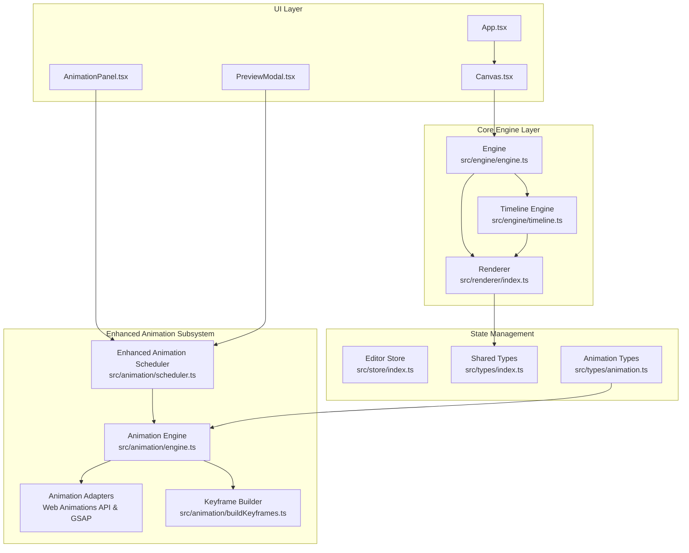
```mermaid
graph TB
subgraph "UI Layer"
APP["App.tsx"]
CANVAS["Canvas.tsx"]
ANIMATION_PANEL["AnimationPanel.tsx"]
PREVIEW_MODAL["PreviewModal.tsx"]
end
subgraph "Core Engine Layer"
ENGINE["Engine<br/>src/engine/engine.ts"]
RENDERER["Renderer<br/>src/renderer/index.ts"]
TIMELINE["Timeline Engine<br/>src/engine/timeline.ts"]
end
subgraph "Enhanced Animation Subsystem"
ANIM_ENGINE["Animation Engine<br/>src/animation/engine.ts"]
SCHEDULER["Enhanced Animation Scheduler<br/>src/animation/scheduler.ts"]
ADAPTERS["Animation Adapters<br/>Web Animations API & GSAP"]
KEYFRAMES["Keyframe Builder<br/>src/animation/buildKeyframes.ts"]
end
subgraph "State Management"
STORE["Editor Store<br/>src/store/index.ts"]
TYPES["Shared Types<br/>src/types/index.ts"]
ANIM_TYPES["Animation Types<br/>src/types/animation.ts"]
end
APP --> CANVAS
CANVAS --> ENGINE
ENGINE --> RENDERER
ENGINE --> TIMELINE
ANIMATION_PANEL --> SCHEDULER
PREVIEW_MODAL --> SCHEDULER
ANIM_ENGINE --> ADAPTERS
ANIM_ENGINE --> KEYFRAMES
SCHEDULER --> ANIM_ENGINE
TIMELINE --> RENDERER
RENDERER --> TYPES
ANIM_TYPES --> ANIM_ENGINE
```

**Diagram sources**
- [engine/engine.ts:1-54](file://src/engine/engine.ts#L1-L54)
- [engine/timeline.ts:1-66](file://src/engine/timeline.ts#L1-L66)
- [animation/engine.ts:1-120](file://src/animation/engine.ts#L1-L120)
- [animation/scheduler.ts:1-160](file://src/animation/scheduler.ts#L1-L160)
- [animation/buildKeyframes.ts:1-125](file://src/animation/buildKeyframes.ts#L1-L125)
- [animation/webAnimationAdapter.ts:1-67](file://src/animation/webAnimationAdapter.ts#L1-L67)
- [animation/gsapAdapter.ts:1-140](file://src/animation/gsapAdapter.ts#L1-L140)
- [types/index.ts:1-262](file://src/types/index.ts#L1-L262)
- [types/animation.ts:1-113](file://src/types/animation.ts#L1-L113)
- [components/AnimationPanel.tsx:1-856](file://src/components/AnimationPanel.tsx#L1-L856)
- [App.tsx:1-120](file://src/App.tsx#L1-L120)

**Section sources**
- [engine/engine.ts:1-54](file://src/engine/engine.ts#L1-L54)
- [engine/timeline.ts:1-66](file://src/engine/timeline.ts#L1-L66)
- [animation/engine.ts:1-120](file://src/animation/engine.ts#L1-L120)
- [animation/scheduler.ts:1-160](file://src/animation/scheduler.ts#L1-L160)
- [animation/buildKeyframes.ts:1-125](file://src/animation/buildKeyframes.ts#L1-L125)
- [animation/webAnimationAdapter.ts:1-67](file://src/animation/webAnimationAdapter.ts#L1-L67)
- [animation/gsapAdapter.ts:1-140](file://src/animation/gsapAdapter.ts#L1-L140)
- [types/index.ts:1-262](file://src/types/index.ts#L1-L262)
- [types/animation.ts:1-113](file://src/types/animation.ts#L1-L113)
- [components/AnimationPanel.tsx:1-856](file://src/components/AnimationPanel.tsx#L1-L856)
- [App.tsx:1-120](file://src/App.tsx#L1-L120)

## Core Components
The enhanced Timeline Engine is defined by the following core components:

### Legacy Timeline System
- Timeline structure: currentTime, duration, playing state
- Core capabilities: play, pause, seek with requestAnimationFrame integration
- Time progression: delta-based time updates using performance.now()

### Enhanced Animation Engine System
- AnimationEngine: manages animation configurations and delegates playback
- Enhanced AnimationScheduler: implements sophisticated step and batch execution with bidirectional navigation
- AnimationAdapter: abstracts underlying animation libraries (Web Animations API, GSAP)
- KeyframeBuilder: generates WAAPI-compatible keyframes from animation configs

### Animation Types and Scheduling
- AnimationConfig: comprehensive animation definition with timing, effects, and triggers
- ClickStep: user-triggered animation sequences with batch execution
- AnimationBatch: concurrent animation execution groups
- StartType: 'click', 'withPrev', 'afterPrev' trigger mechanisms
- Enhanced progress tracking: getCurrentStepIndex(), getStepCount(), canAdvance()

**Section sources**
- [engine/timeline.ts:1-66](file://src/engine/timeline.ts#L1-L66)
- [animation/engine.ts:1-120](file://src/animation/engine.ts#L1-L120)
- [animation/scheduler.ts:56-160](file://src/animation/scheduler.ts#L56-L160)
- [animation/adapter.ts:1-27](file://src/animation/adapter.ts#L1-L27)
- [types/animation.ts:26-113](file://src/types/animation.ts#L26-L113)

## Architecture Overview
The Timeline Engine now operates within an enhanced architecture that supports both legacy timeline playback and modern animation systems with interactive step-based sequencing. The engine coordinates multiple animation pathways while maintaining backward compatibility and adding sophisticated navigation capabilities.

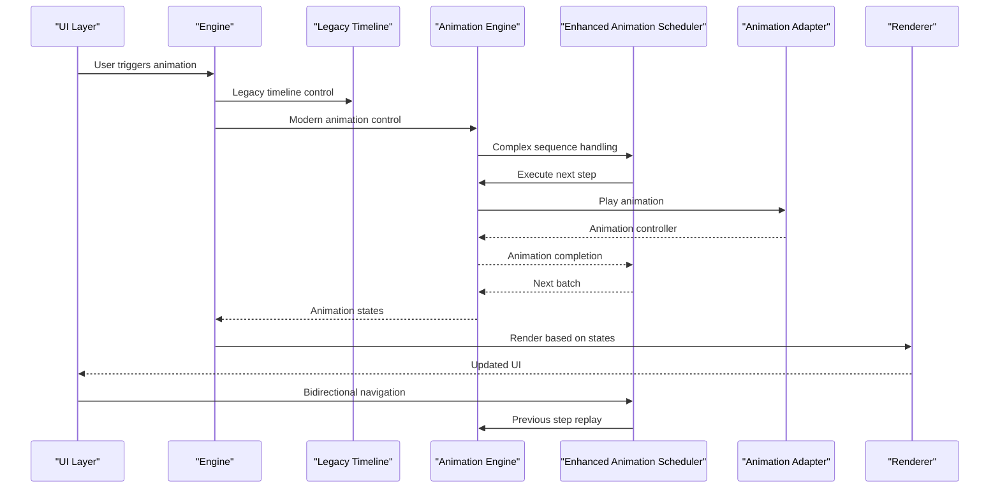
```mermaid
sequenceDiagram
participant UI as "UI Layer"
participant Engine as "Engine"
participant Timeline as "Legacy Timeline"
participant AnimEngine as "Animation Engine"
participant Scheduler as "Enhanced Animation Scheduler"
participant Adapter as "Animation Adapter"
participant Renderer as "Renderer"
UI->>Engine : User triggers animation
Engine->>Timeline : Legacy timeline control
Engine->>AnimEngine : Modern animation control
AnimEngine->>Scheduler : Complex sequence handling
Scheduler->>AnimEngine : Execute next step
AnimEngine->>Adapter : Play animation
Adapter-->>AnimEngine : Animation controller
AnimEngine-->>Scheduler : Animation completion
Scheduler-->>AnimEngine : Next batch
AnimEngine-->>Engine : Animation states
Engine->>Renderer : Render based on states
Renderer-->>UI : Updated UI
UI->>Scheduler : Bidirectional navigation
Scheduler->>AnimEngine : Previous step replay
```

**Diagram sources**
- [engine/engine.ts:1-54](file://src/engine/engine.ts#L1-L54)
- [engine/timeline.ts:1-66](file://src/engine/timeline.ts#L1-L66)
- [animation/engine.ts:1-120](file://src/animation/engine.ts#L1-L120)
- [animation/scheduler.ts:56-160](file://src/animation/scheduler.ts#L56-L160)
- [animation/adapter.ts:1-27](file://src/animation/adapter.ts#L1-L27)

**Section sources**
- [engine/engine.ts:1-54](file://src/engine/engine.ts#L1-L54)
- [engine/timeline.ts:1-66](file://src/engine/timeline.ts#L1-L66)
- [animation/engine.ts:1-120](file://src/animation/engine.ts#L1-L120)
- [animation/scheduler.ts:56-160](file://src/animation/scheduler.ts#L56-L160)
- [animation/adapter.ts:1-27](file://src/animation/adapter.ts#L1-L27)

## Detailed Component Analysis

### Legacy Timeline Data Model
The Timeline Engine maintains its core time-driven model with enhanced integration:

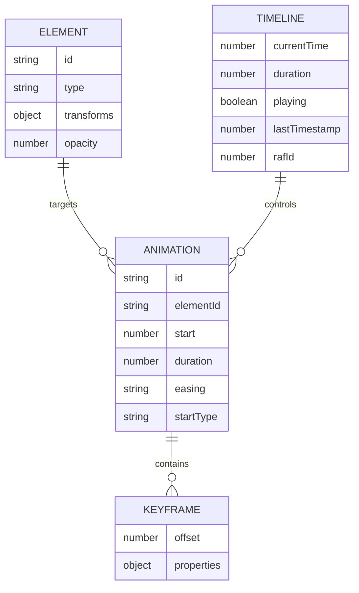
```mermaid
erDiagram
TIMELINE {
number currentTime
number duration
boolean playing
number lastTimestamp
number rafId
}
ANIMATION {
string id
string elementId
number start
number duration
string easing
string startType
}
KEYFRAME {
number offset
object properties
}
ELEMENT {
string id
string type
object transforms
number opacity
}
ANIMATION ||--o{ KEYFRAME : "contains"
ELEMENT ||--o{ ANIMATION : "targets"
TIMELINE ||--o{ ANIMATION : "controls"
```

**Diagram sources**
- [engine/timeline.ts:1-66](file://src/engine/timeline.ts#L1-L66)
- [types/index.ts:118-123](file://src/types/index.ts#L118-L123)

**Section sources**
- [engine/timeline.ts:1-66](file://src/engine/timeline.ts#L1-L66)
- [types/index.ts:118-123](file://src/types/index.ts#L118-L123)

### Timeline Playback Control Flow
Enhanced with requestAnimationFrame integration and delta-based time progression:

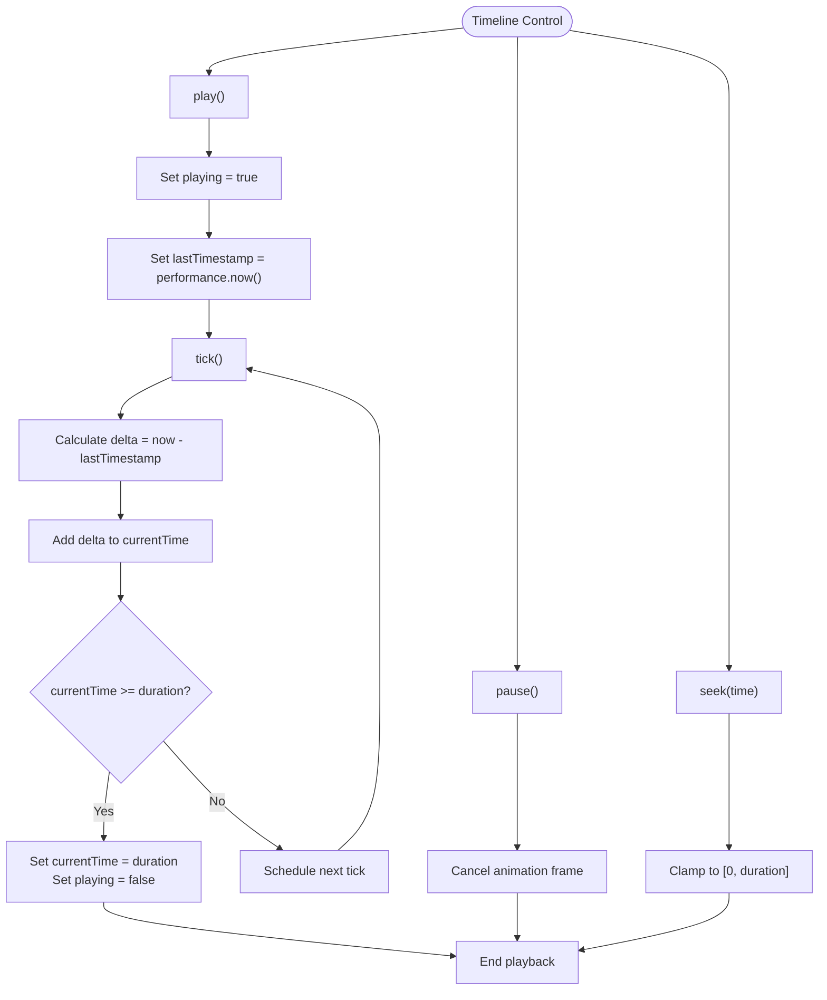
```mermaid
flowchart TD
Start(["Timeline Control"]) --> Play["play()"]
Start --> Pause["pause()"]
Start --> Seek["seek(time)"]
Play --> SetPlaying["Set playing = true"]
SetPlaying --> SetTimestamp["Set lastTimestamp = performance.now()"]
SetTimestamp --> Tick["tick()"]
Pause --> CancelRAF["Cancel animation frame"]
Seek --> ClampTime["Clamp to [0, duration]"]
Tick --> CalcDelta["Calculate delta = now - lastTimestamp"]
CalcDelta --> UpdateTime["Add delta to currentTime"]
UpdateTime --> CheckDuration{"currentTime >= duration?"}
CheckDuration --> |Yes| SetEnd["Set currentTime = duration<br/>Set playing = false"]
CheckDuration --> |No| ScheduleNext["Schedule next tick"]
SetEnd --> End["End playback"]
ScheduleNext --> Tick
CancelRAF --> End
ClampTime --> End
```

**Diagram sources**
- [engine/timeline.ts:25-64](file://src/engine/timeline.ts#L25-L64)

**Section sources**
- [engine/timeline.ts:25-64](file://src/engine/timeline.ts#L25-L64)

### Integration with Engine and Renderer
The Engine coordinates both legacy timeline and modern animation systems:

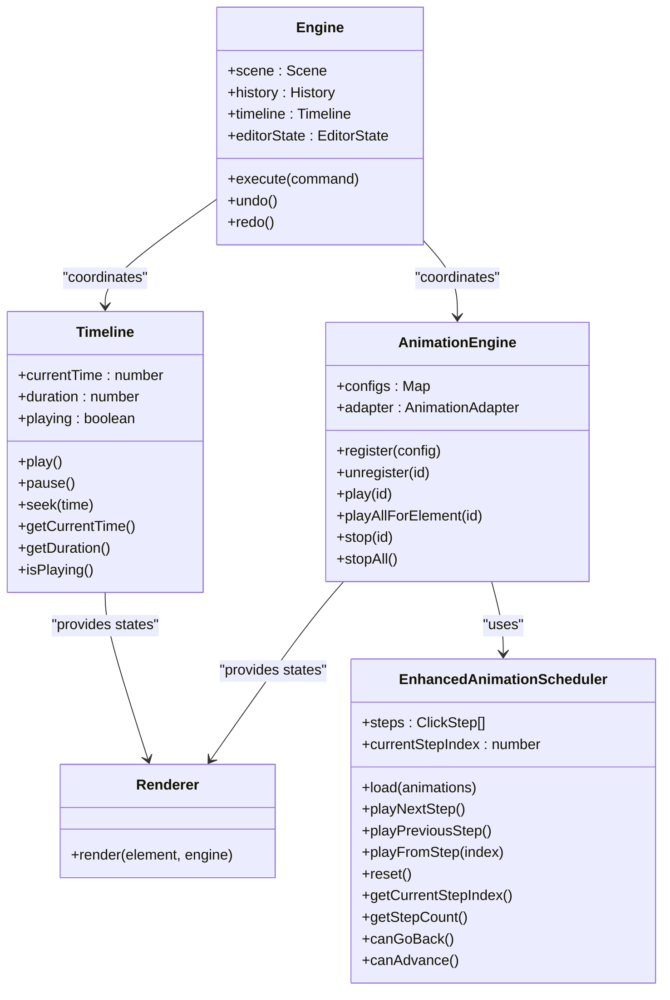
```mermaid
classDiagram
class Engine {
+scene : Scene
+history : History
+timeline : Timeline
+editorState : EditorState
+execute(command)
+undo()
+redo()
}
class Timeline {
+currentTime : number
+duration : number
+playing : boolean
+play()
+pause()
+seek(time)
+getCurrentTime()
+getDuration()
+isPlaying()
}
class AnimationEngine {
+configs : Map
+adapter : AnimationAdapter
+register(config)
+unregister(id)
+play(id)
+playAllForElement(id)
+stop(id)
+stopAll()
}
class EnhancedAnimationScheduler {
+steps : ClickStep[]
+currentStepIndex : number
+load(animations)
+playNextStep()
+playPreviousStep()
+playFromStep(index)
+reset()
+getCurrentStepIndex()
+getStepCount()
+canGoBack()
+canAdvance()
}
class Renderer {
+render(element, engine)
}
Engine --> Timeline : "coordinates"
Engine --> AnimationEngine : "coordinates"
AnimationEngine --> EnhancedAnimationScheduler : "uses"
Timeline --> Renderer : "provides states"
AnimationEngine --> Renderer : "provides states"
```

**Diagram sources**
- [engine/engine.ts:7-19](file://src/engine/engine.ts#L7-L19)
- [engine/timeline.ts:1-66](file://src/engine/timeline.ts#L1-L66)
- [animation/engine.ts:9-120](file://src/animation/engine.ts#L9-L120)
- [animation/scheduler.ts:56-160](file://src/animation/scheduler.ts#L56-L160)

**Section sources**
- [engine/engine.ts:7-19](file://src/engine/engine.ts#L7-L19)
- [engine/timeline.ts:1-66](file://src/engine/timeline.ts#L1-L66)
- [animation/engine.ts:9-120](file://src/animation/engine.ts#L9-L120)
- [animation/scheduler.ts:56-160](file://src/animation/scheduler.ts#L56-L160)

## Animation Engine System
The new Animation Engine provides a modern, adapter-based approach to animation management with enhanced capabilities for complex animation sequences.

### AnimationEngine Architecture
The AnimationEngine serves as the central coordinator for all animation operations:

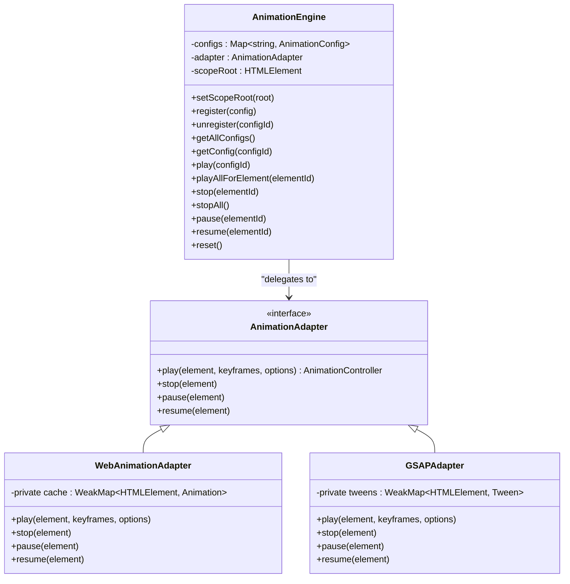
```mermaid
classDiagram
class AnimationEngine {
-configs : Map~string, AnimationConfig~
-adapter : AnimationAdapter
-scopeRoot : HTMLElement
+setScopeRoot(root)
+register(config)
+unregister(configId)
+getAllConfigs()
+getConfig(configId)
+play(configId)
+playAllForElement(elementId)
+stop(elementId)
+stopAll()
+pause(elementId)
+resume(elementId)
+reset()
}
class AnimationAdapter {
<<interface>>
+play(element, keyframes, options) AnimationController
+stop(element)
+pause(element)
+resume(element)
}
class WebAnimationAdapter {
-private cache : WeakMap~HTMLElement, Animation~
+play(element, keyframes, options)
+stop(element)
+pause(element)
+resume(element)
}
class GSAPAdapter {
-private tweens : WeakMap~HTMLElement, Tween~
+play(element, keyframes, options)
+stop(element)
+pause(element)
+resume(element)
}
AnimationEngine --> AnimationAdapter : "delegates to"
AnimationAdapter <|-- WebAnimationAdapter
AnimationAdapter <|-- GSAPAdapter
```

**Diagram sources**
- [animation/engine.ts:9-120](file://src/animation/engine.ts#L9-L120)
- [animation/adapter.ts:7-26](file://src/animation/adapter.ts#L7-L26)
- [animation/webAnimationAdapter.ts:12-67](file://src/animation/webAnimationAdapter.ts#L12-L67)
- [animation/gsapAdapter.ts:13-140](file://src/animation/gsapAdapter.ts#L13-L140)

**Section sources**
- [animation/engine.ts:9-120](file://src/animation/engine.ts#L9-L120)
- [animation/adapter.ts:7-26](file://src/animation/adapter.ts#L7-L26)
- [animation/webAnimationAdapter.ts:12-67](file://src/animation/webAnimationAdapter.ts#L12-L67)
- [animation/gsapAdapter.ts:13-140](file://src/animation/gsapAdapter.ts#L13-L140)

### Animation Configuration and Lifecycle
The AnimationEngine manages animation lifecycles through a comprehensive configuration system:

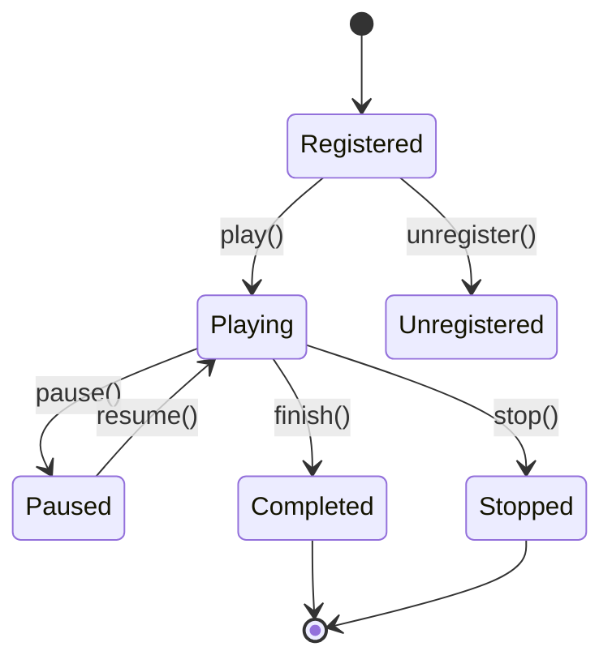
```mermaid
stateDiagram-v2
[*] --> Registered
Registered --> Playing : play()
Playing --> Paused : pause()
Paused --> Playing : resume()
Playing --> Completed : finish()
Completed --> [*]
Playing --> Stopped : stop()
Stopped --> [*]
Registered --> Unregistered : unregister()
```

**Section sources**
- [animation/engine.ts:33-118](file://src/animation/engine.ts#L33-L118)
- [types/animation.ts:26-39](file://src/types/animation.ts#L26-L39)

## Animation Scheduler and Sequencing
The Animation Scheduler implements a sophisticated Batch Execution Model that supports complex animation sequences with user-triggered animations and bidirectional navigation.

### ClickStep and AnimationBatch Architecture
The scheduler organizes animations into logical execution units with enhanced capabilities:

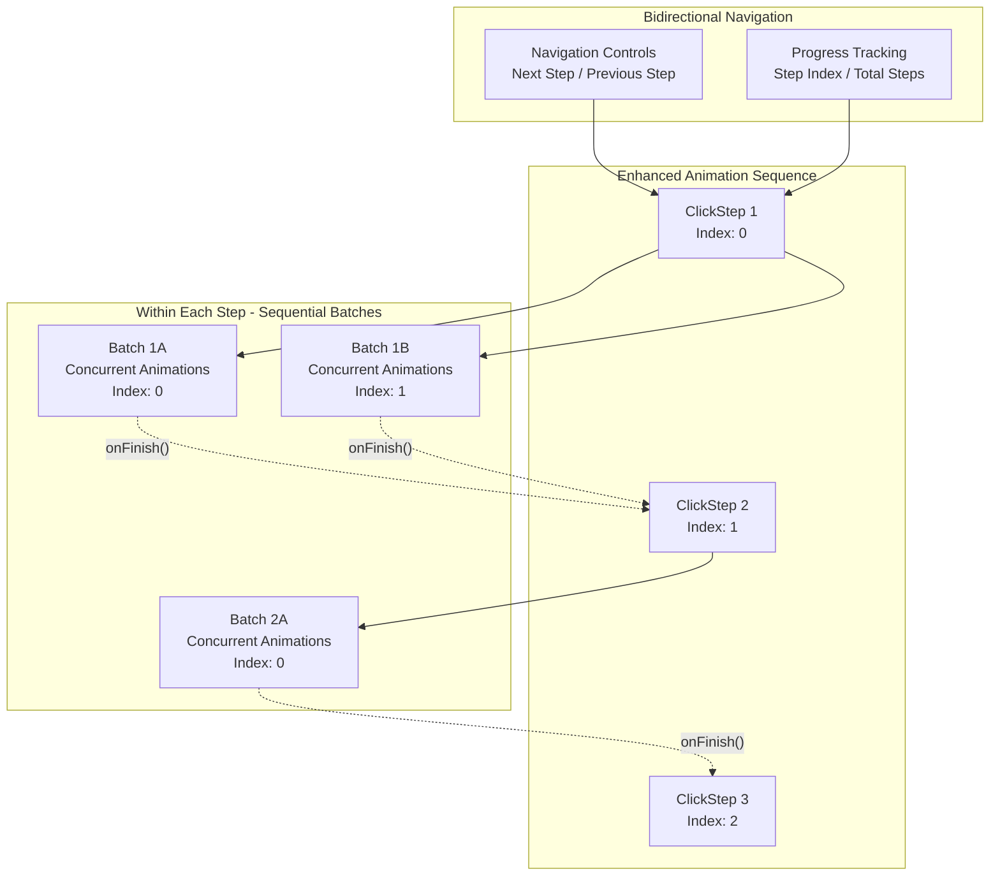
```mermaid
graph TB
subgraph "Enhanced Animation Sequence"
STEP1["ClickStep 1<br/>Index: 0"]
STEP2["ClickStep 2<br/>Index: 1"]
STEP3["ClickStep 3<br/>Index: 2"]
end
subgraph "Within Each Step - Sequential Batches"
BATCH1A["Batch 1A<br/>Concurrent Animations<br/>Index: 0"]
BATCH1B["Batch 1B<br/>Concurrent Animations<br/>Index: 1"]
BATCH2A["Batch 2A<br/>Concurrent Animations<br/>Index: 0"]
end
subgraph "Bidirectional Navigation"
NAVIGATION["Navigation Controls<br/>Next Step / Previous Step"]
PROGRESS["Progress Tracking<br/>Step Index / Total Steps"]
end
STEP1 --> BATCH1A
STEP1 --> BATCH1B
STEP2 --> BATCH2A
BATCH1A -.->|"onFinish()"| STEP2
BATCH1B -.->|"onFinish()"| STEP2
BATCH2A -.->|"onFinish()"| STEP3
NAVIGATION --> STEP1
PROGRESS --> STEP1
```

**Diagram sources**
- [animation/scheduler.ts:56-160](file://src/animation/scheduler.ts#L56-L160)
- [types/animation.ts:104-113](file://src/types/animation.ts#L104-L113)

### BuildClickSteps Algorithm
The buildClickSteps function processes animation arrays into executable sequences with enhanced logic:

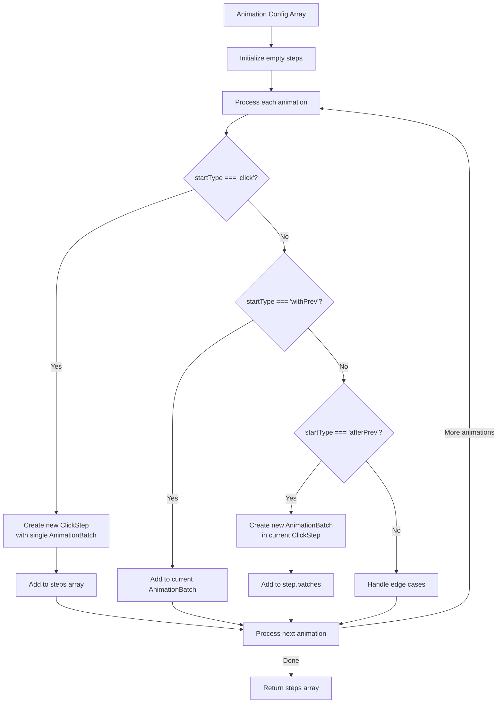
```mermaid
flowchart TD
Input["Animation Config Array"] --> Init["Initialize empty steps"]
Init --> Process["Process each animation"]
Process --> CheckClick{"startType === 'click'?"}
CheckClick --> |Yes| NewStep["Create new ClickStep<br/>with single AnimationBatch"]
NewStep --> AddStep["Add to steps array"]
AddStep --> NextAnim["Process next animation"]
CheckClick --> |No| CheckWithPrev{"startType === 'withPrev'?"}
CheckWithPrev --> |Yes| AddToCurrent["Add to current AnimationBatch"]
AddToCurrent --> NextAnim
CheckWithPrev --> |No| CheckAfterPrev{"startType === 'afterPrev'?"}
CheckAfterPrev --> |Yes| NewBatch["Create new AnimationBatch<br/>in current ClickStep"]
NewBatch --> AddBatch["Add to step.batches"]
AddBatch --> NextAnim
CheckAfterPrev --> |No| Default["Handle edge cases"]
Default --> NextAnim
NextAnim --> |More animations| Process
NextAnim --> |Done| Return["Return steps array"]
```

**Diagram sources**
- [animation/scheduler.ts:13-49](file://src/animation/scheduler.ts#L13-L49)

**Section sources**
- [animation/scheduler.ts:13-160](file://src/animation/scheduler.ts#L13-L160)
- [types/animation.ts:104-113](file://src/types/animation.ts#L104-L113)

### Enhanced Execution Model Details
The scheduler implements a sophisticated execution model with proper state management and bidirectional navigation:

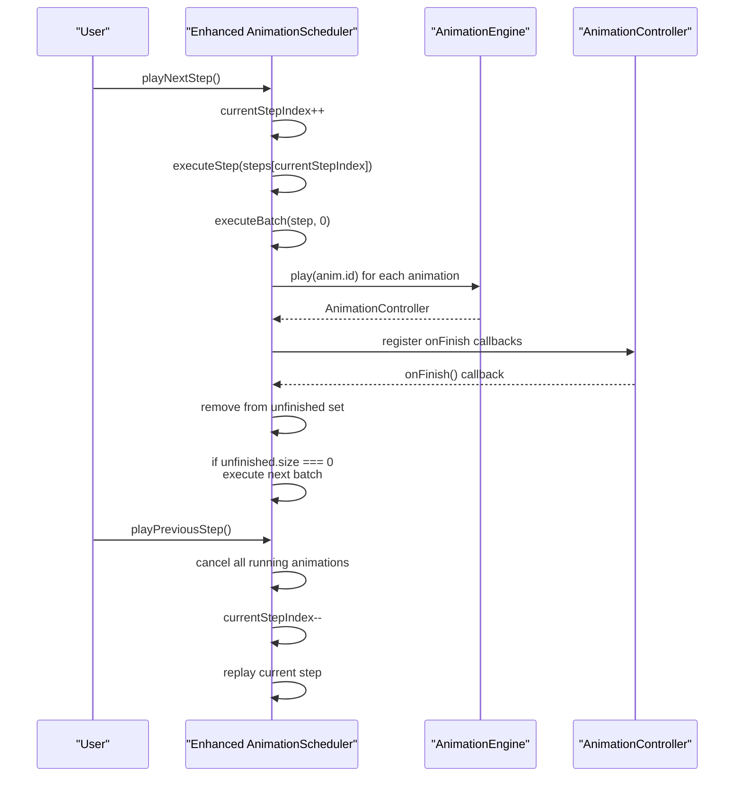
```mermaid
sequenceDiagram
participant User as "User"
participant Scheduler as "Enhanced AnimationScheduler"
participant Engine as "AnimationEngine"
participant Controller as "AnimationController"
User->>Scheduler : playNextStep()
Scheduler->>Scheduler : currentStepIndex++
Scheduler->>Scheduler : executeStep(steps[currentStepIndex])
Scheduler->>Scheduler : executeBatch(step, 0)
Scheduler->>Engine : play(anim.id) for each animation
Engine-->>Scheduler : AnimationController
Scheduler->>Controller : register onFinish callbacks
Controller-->>Scheduler : onFinish() callback
Scheduler->>Scheduler : remove from unfinished set
Scheduler->>Scheduler : if unfinished.size === 0<br/>execute next batch
User->>Scheduler : playPreviousStep()
Scheduler->>Scheduler : cancel all running animations
Scheduler->>Scheduler : currentStepIndex--
Scheduler->>Scheduler : replay current step
```

**Diagram sources**
- [animation/scheduler.ts:72-133](file://src/animation/scheduler.ts#L72-L133)

**Section sources**
- [animation/scheduler.ts:72-133](file://src/animation/scheduler.ts#L72-L133)

## Step-Based Animation Execution Model
The enhanced Animation Scheduler introduces a sophisticated step-based execution model that provides structured animation sequencing with bidirectional navigation capabilities.

### Step Execution Flow
The step-based model organizes animations into logical execution units with precise control:

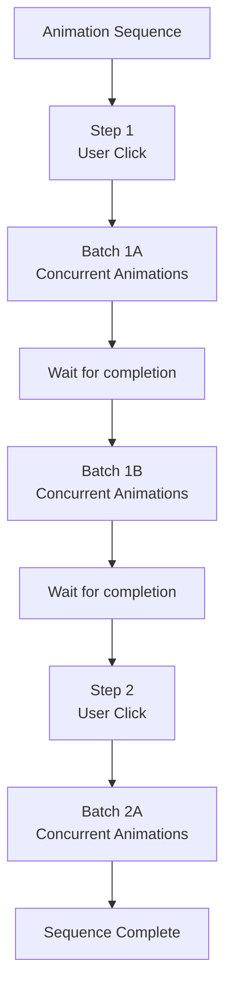
```mermaid
flowchart TD
Start["Animation Sequence"] --> Step1["Step 1<br/>User Click"]
Step1 --> Batch1A["Batch 1A<br/>Concurrent Animations"]
Batch1A --> Wait1["Wait for completion"]
Wait1 --> Batch1B["Batch 1B<br/>Concurrent Animations"]
Batch1B --> Wait2["Wait for completion"]
Wait2 --> Step2["Step 2<br/>User Click"]
Step2 --> Batch2A["Batch 2A<br/>Concurrent Animations"]
Batch2A --> Complete["Sequence Complete"]
```

**Diagram sources**
- [animation/scheduler.ts:79-108](file://src/animation/scheduler.ts#L79-L108)

### Batch Execution Strategy
Within each step, animations are executed with intelligent concurrency management:

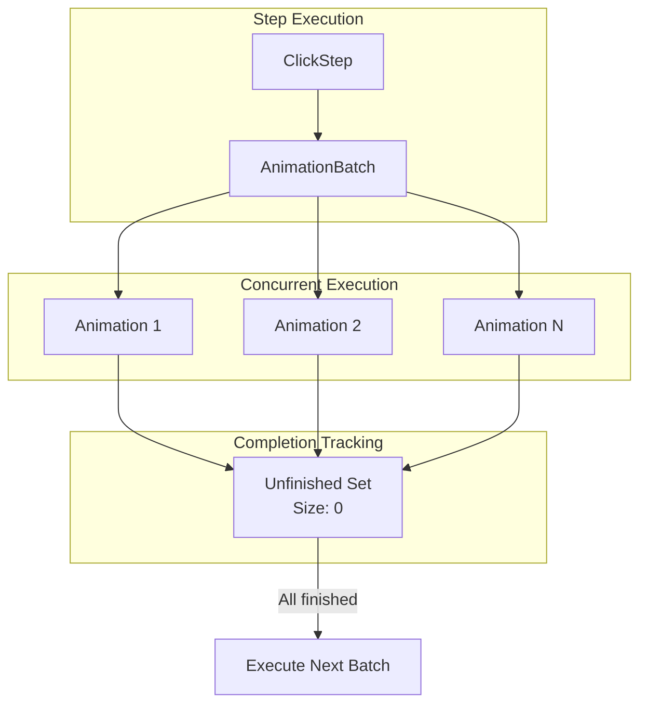
```mermaid
graph TB
subgraph "Step Execution"
Step["ClickStep"]
Batch["AnimationBatch"]
end
subgraph "Concurrent Execution"
Anim1["Animation 1"]
Anim2["Animation 2"]
AnimN["Animation N"]
end
subgraph "Completion Tracking"
Tracker["Unfinished Set<br/>Size: 0"]
end
Step --> Batch
Batch --> Anim1
Batch --> Anim2
Batch --> AnimN
Anim1 --> Tracker
Anim2 --> Tracker
AnimN --> Tracker
Tracker --> |All finished| NextBatch["Execute Next Batch"]
```

**Diagram sources**
- [animation/scheduler.ts:83-108](file://src/animation/scheduler.ts#L83-L108)

**Section sources**
- [animation/scheduler.ts:79-108](file://src/animation/scheduler.ts#L79-L108)

## Bidirectional Navigation and Progress Tracking
The enhanced Animation Scheduler provides comprehensive navigation controls and progress tracking for interactive animation playback.

### Navigation Methods
The scheduler supports sophisticated bidirectional navigation with proper state management:

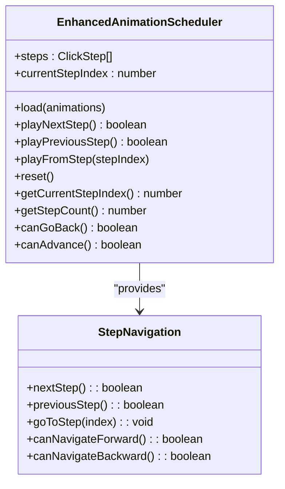
```mermaid
classDiagram
class EnhancedAnimationScheduler {
+steps : ClickStep[]
+currentStepIndex : number
+load(animations)
+playNextStep() boolean
+playPreviousStep() boolean
+playFromStep(stepIndex)
+reset()
+getCurrentStepIndex() number
+getStepCount() number
+canGoBack() boolean
+canAdvance() boolean
}
class StepNavigation {
+nextStep() : boolean
+previousStep() : boolean
+goToStep(index) : void
+canNavigateForward() : boolean
+canNavigateBackward() : boolean
}
EnhancedAnimationScheduler --> StepNavigation : "provides"
```

**Diagram sources**
- [animation/scheduler.ts:110-159](file://src/animation/scheduler.ts#L110-L159)

### Progress Tracking System
Real-time progress tracking enables UI integration and user feedback:

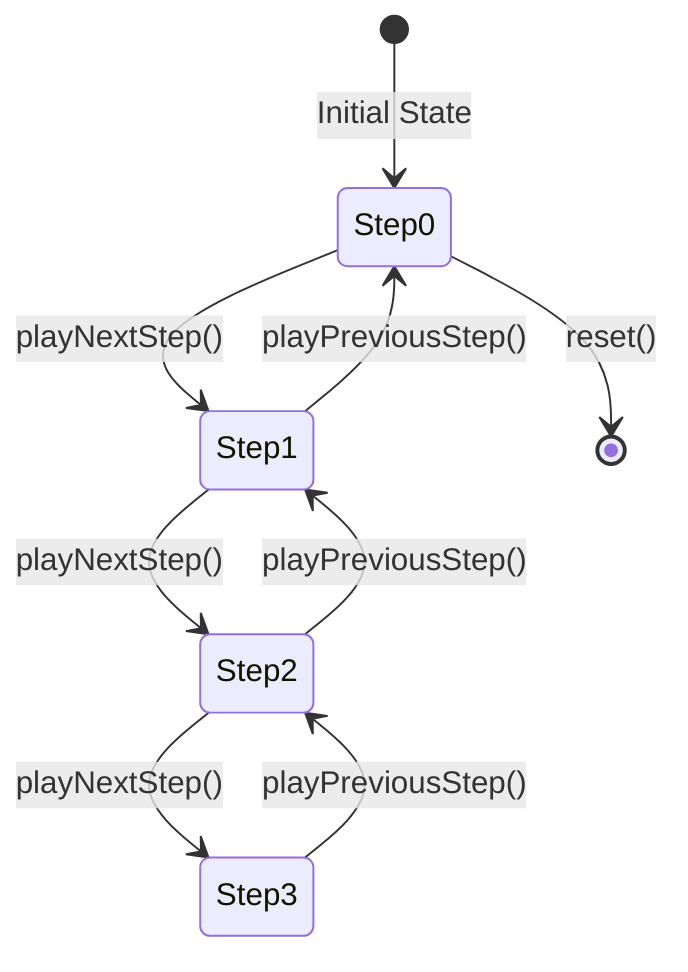
```mermaid
stateDiagram-v2
[*] --> Step0 : Initial State
Step0 --> Step1 : playNextStep()
Step1 --> Step2 : playNextStep()
Step2 --> Step3 : playNextStep()
Step3 --> Step2 : playPreviousStep()
Step2 --> Step1 : playPreviousStep()
Step1 --> Step0 : playPreviousStep()
Step0 --> [*] : reset()
```

**Section sources**
- [animation/scheduler.ts:110-159](file://src/animation/scheduler.ts#L110-L159)

### UI Integration Examples
The step scheduler integrates seamlessly with React components for interactive animation playback:

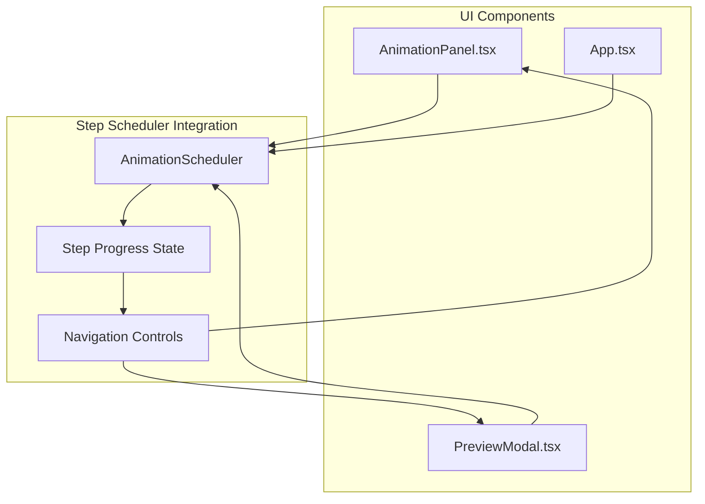
```mermaid
graph TB
subgraph "UI Components"
ANIMATION_PANEL["AnimationPanel.tsx"]
PREVIEW_MODAL["PreviewModal.tsx"]
APP["App.tsx"]
end
subgraph "Step Scheduler Integration"
SCHEDULER["AnimationScheduler"]
STATE["Step Progress State"]
CONTROLS["Navigation Controls"]
end
ANIMATION_PANEL --> SCHEDULER
PREVIEW_MODAL --> SCHEDULER
APP --> SCHEDULER
SCHEDULER --> STATE
STATE --> CONTROLS
CONTROLS --> ANIMATION_PANEL
CONTROLS --> PREVIEW_MODAL
```

**Diagram sources**
- [components/AnimationPanel.tsx:59-89](file://src/components/AnimationPanel.tsx#L59-L89)
- [App.tsx:39-89](file://src/App.tsx#L39-L89)

**Section sources**
- [components/AnimationPanel.tsx:59-89](file://src/components/AnimationPanel.tsx#L59-L89)
- [App.tsx:39-89](file://src/App.tsx#L39-L89)

## Keyframe Interpolation and Evaluation
The keyframe interpolation system has been enhanced with improved evaluation algorithms and better integration with the animation engine.

### Keyframe Building System
The buildKeyframes function generates WAAPI-compatible keyframes from animation configurations:

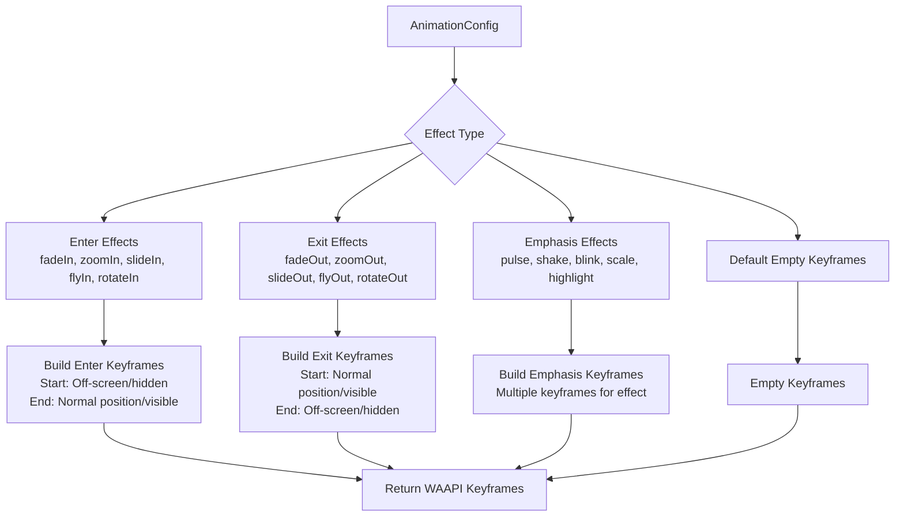
```mermaid
flowchart TD
Config["AnimationConfig"] --> EffectSwitch{"Effect Type"}
EffectSwitch --> EnterEffects["Enter Effects<br/>fadeIn, zoomIn, slideIn, flyIn, rotateIn"]
EffectSwitch --> ExitEffects["Exit Effects<br/>fadeOut, zoomOut, slideOut, flyOut, rotateOut"]
EffectSwitch --> EmphasisEffects["Emphasis Effects<br/>pulse, shake, blink, scale, highlight"]
EffectSwitch --> Default["Default Empty Keyframes"]
EnterEffects --> EnterKF["Build Enter Keyframes<br/>Start: Off-screen/hidden<br/>End: Normal position/visible"]
ExitEffects --> ExitKF["Build Exit Keyframes<br/>Start: Normal position/visible<br/>End: Off-screen/hidden"]
EmphasisEffects --> EmphasisKF["Build Emphasis Keyframes<br/>Multiple keyframes for effect"]
Default --> EmptyKF["Empty Keyframes"]
EnterKF --> ReturnKF["Return WAAPI Keyframes"]
ExitKF --> ReturnKF
EmphasisKF --> ReturnKF
EmptyKF --> ReturnKF
```

**Diagram sources**
- [animation/buildKeyframes.ts:7-109](file://src/animation/buildKeyframes.ts#L7-L109)

### Effect-Specific Keyframe Generation
Each animation effect has specialized keyframe generation logic:

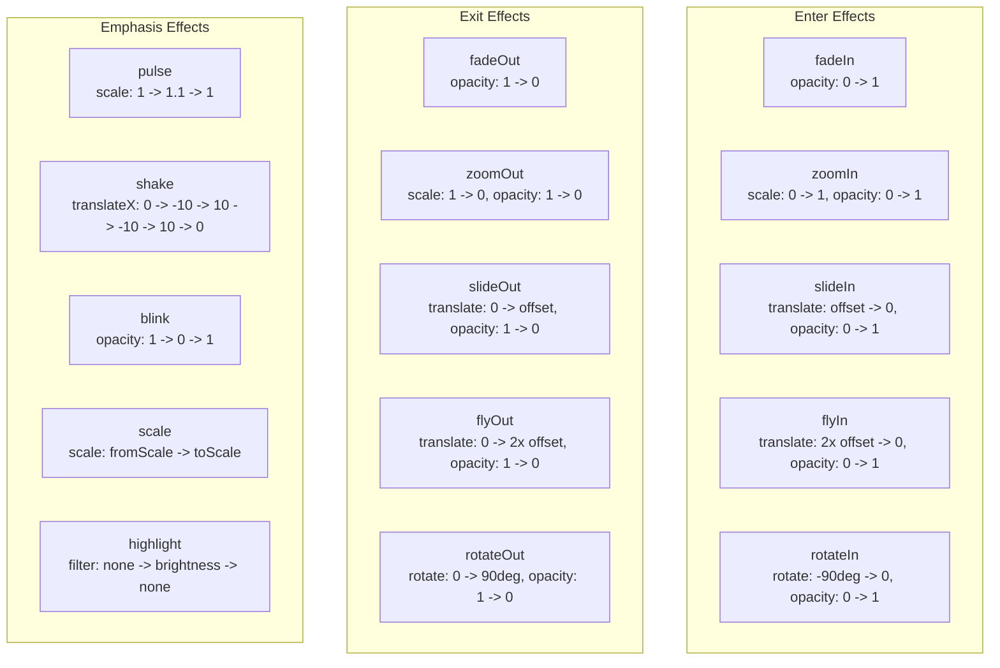
```mermaid
graph TB
subgraph "Enter Effects"
FadeIn["fadeIn<br/>opacity: 0 -> 1"]
ZoomIn["zoomIn<br/>scale: 0 -> 1, opacity: 0 -> 1"]
SlideIn["slideIn<br/>translate: offset -> 0, opacity: 0 -> 1"]
FlyIn["flyIn<br/>translate: 2x offset -> 0, opacity: 0 -> 1"]
RotateIn["rotateIn<br/>rotate: -90deg -> 0, opacity: 0 -> 1"]
end
subgraph "Exit Effects"
FadeOut["fadeOut<br/>opacity: 1 -> 0"]
ZoomOut["zoomOut<br/>scale: 1 -> 0, opacity: 1 -> 0"]
SlideOut["slideOut<br/>translate: 0 -> offset, opacity: 1 -> 0"]
FlyOut["flyOut<br/>translate: 0 -> 2x offset, opacity: 1 -> 0"]
RotateOut["rotateOut<br/>rotate: 0 -> 90deg, opacity: 1 -> 0"]
end
subgraph "Emphasis Effects"
Pulse["pulse<br/>scale: 1 -> 1.1 -> 1"]
Shake["shake<br/>translateX: 0 -> -10 -> 10 -> -10 -> 10 -> 0"]
Blink["blink<br/>opacity: 1 -> 0 -> 1"]
Scale["scale<br/>scale: fromScale -> toScale"]
Highlight["highlight<br/>filter: none -> brightness -> none"]
end
```

**Diagram sources**
- [animation/buildKeyframes.ts:11-109](file://src/animation/buildKeyframes.ts#L11-L109)

**Section sources**
- [animation/buildKeyframes.ts:7-125](file://src/animation/buildKeyframes.ts#L7-L125)
- [animation/buildKeyframes.ts:11-109](file://src/animation/buildKeyframes.ts#L11-L109)

### Slide Offset Calculation
The getSlideOffset function calculates translation offsets based on direction and distance:

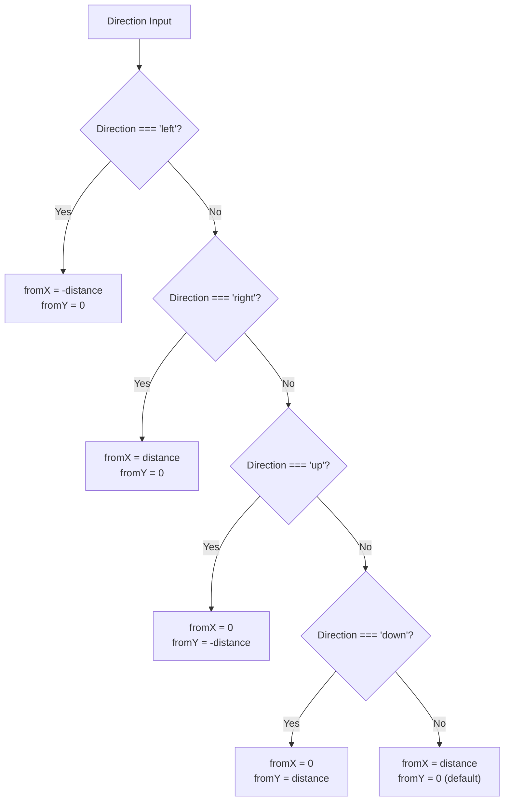
```mermaid
flowchart TD
Direction["Direction Input"] --> CheckLeft{"Direction === 'left'?"}
CheckLeft --> |Yes| LeftOffset["fromX = -distance<br/>fromY = 0"]
CheckLeft --> |No| CheckRight{"Direction === 'right'?"}
CheckRight --> |Yes| RightOffset["fromX = distance<br/>fromY = 0"]
CheckRight --> |No| CheckUp{"Direction === 'up'?"}
CheckUp --> |Yes| UpOffset["fromX = 0<br/>fromY = -distance"]
CheckUp --> |No| CheckDown{"Direction === 'down'?"}
CheckDown --> |Yes| DownOffset["fromX = 0<br/>fromY = distance"]
CheckDown --> |No| DefaultOffset["fromX = distance<br/>fromY = 0 (default)"]
```

**Diagram sources**
- [animation/buildKeyframes.ts:111-124](file://src/animation/buildKeyframes.ts#L111-L124)

**Section sources**
- [animation/buildKeyframes.ts:111-124](file://src/animation/buildKeyframes.ts#L111-L124)

## Adapter Architecture
The adapter pattern provides abstraction over different animation libraries, enabling seamless switching between Web Animations API and GSAP.

### AnimationAdapter Interface
The core adapter interface defines the contract for animation implementations:

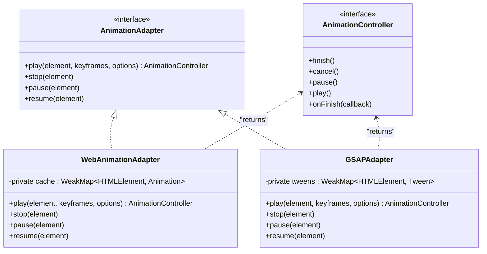
```mermaid
classDiagram
class AnimationAdapter {
<<interface>>
+play(element, keyframes, options) AnimationController
+stop(element)
+pause(element)
+resume(element)
}
class AnimationController {
<<interface>>
+finish()
+cancel()
+pause()
+play()
+onFinish(callback)
}
class WebAnimationAdapter {
-private cache : WeakMap~HTMLElement, Animation~
+play(element, keyframes, options) AnimationController
+stop(element)
+pause(element)
+resume(element)
}
class GSAPAdapter {
-private tweens : WeakMap~HTMLElement, Tween~
+play(element, keyframes, options) AnimationController
+stop(element)
+pause(element)
+resume(element)
}
AnimationAdapter <|.. WebAnimationAdapter
AnimationAdapter <|.. GSAPAdapter
AnimationController <.. WebAnimationAdapter : "returns"
AnimationController <.. GSAPAdapter : "returns"
```

**Diagram sources**
- [animation/adapter.ts:7-26](file://src/animation/adapter.ts#L7-L26)
- [animation/webAnimationAdapter.ts:12-67](file://src/animation/webAnimationAdapter.ts#L12-L67)
- [animation/gsapAdapter.ts:13-140](file://src/animation/gsapAdapter.ts#L13-L140)

### Web Animations API Implementation
The WebAnimationAdapter provides native browser animation support:

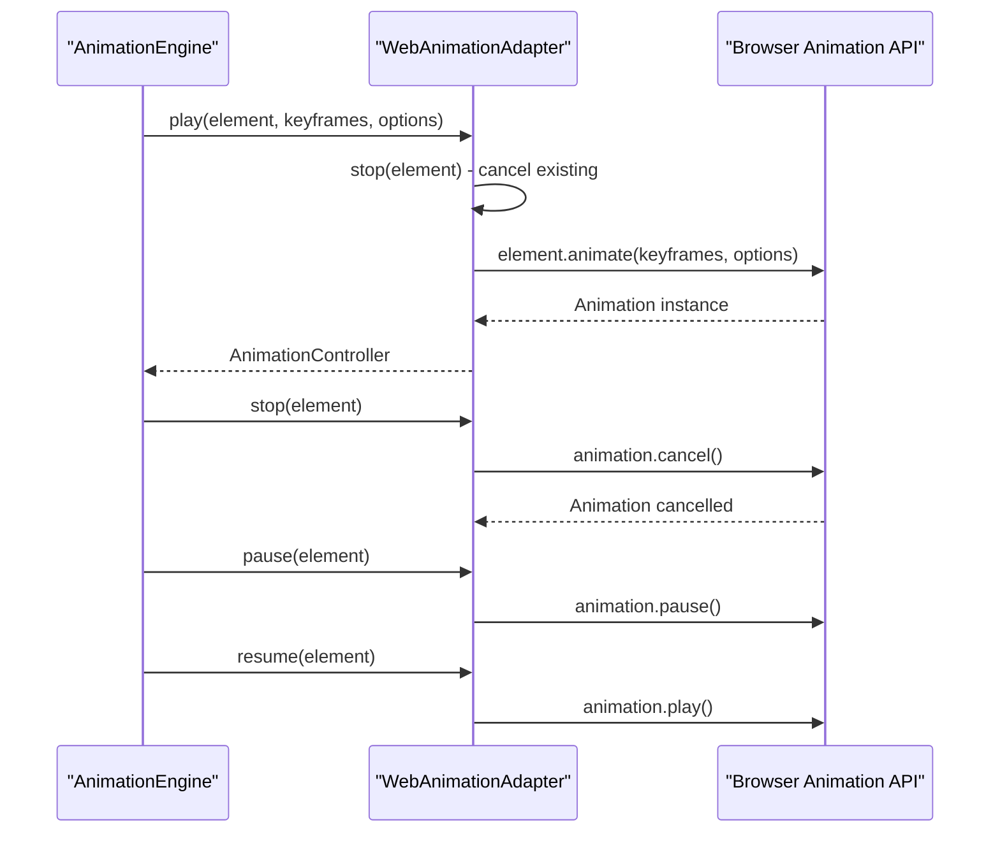
```mermaid
sequenceDiagram
participant Client as "AnimationEngine"
participant Adapter as "WebAnimationAdapter"
participant Browser as "Browser Animation API"
Client->>Adapter : play(element, keyframes, options)
Adapter->>Adapter : stop(element) - cancel existing
Adapter->>Browser : element.animate(keyframes, options)
Browser-->>Adapter : Animation instance
Adapter-->>Client : AnimationController
Client->>Adapter : stop(element)
Adapter->>Browser : animation.cancel()
Browser-->>Adapter : Animation cancelled
Client->>Adapter : pause(element)
Adapter->>Browser : animation.pause()
Client->>Adapter : resume(element)
Adapter->>Browser : animation.play()
```

**Diagram sources**
- [animation/webAnimationAdapter.ts:15-43](file://src/animation/webAnimationAdapter.ts#L15-L43)

### GSAP Implementation Features
The GSAPAdapter provides advanced animation capabilities with enhanced easing and transform parsing:

```mermaid
flowchart TD
GSAPPlay["GSAPAdapter.play()"] --> CheckFrames{"keyframes.length < 2?"}
CheckFrames --> |Yes| ReturnDummy["Return dummy controller"]
CheckFrames --> |No| ExtractFrames["Extract fromFrame & toFrame"]
ExtractFrames --> ParseTransform["Parse transform components"]
ParseTransform --> SetupVars["Setup GSAP vars<br/>duration, delay, ease"]
SetupVars --> CreateTween["gsap.fromTo(element, fromVars, toVars)"]
CreateTween --> CacheTween["Cache tween reference"]
CacheTween --> ReturnController["Return AnimationController"]
```

**Diagram sources**
- [animation/gsapAdapter.ts:16-60](file://src/animation/gsapAdapter.ts#L16-L60)

**Section sources**
- [animation/adapter.ts:7-26](file://src/animation/adapter.ts#L7-L26)
- [animation/webAnimationAdapter.ts:12-67](file://src/animation/webAnimationAdapter.ts#L12-L67)
- [animation/gsapAdapter.ts:13-140](file://src/animation/gsapAdapter.ts#L13-L140)

## Integration with Timeline Engine
The Timeline Engine now integrates with both the legacy timeline system and the new Animation Engine, providing a unified animation playback experience with enhanced step-based sequencing capabilities.

### Timeline Engine Integration Points
The integration maintains backward compatibility while leveraging new animation capabilities:

```mermaid
graph TB
subgraph "Timeline Integration"
LegacyTimeline["Legacy Timeline<br/>src/engine/timeline.ts"]
EnhancedEngine["Enhanced Animation Engine<br/>src/animation/engine.ts"]
EnhancedScheduler["Enhanced Animation Scheduler<br/>src/animation/scheduler.ts"]
UIIntegration["UI Integration<br/>AnimationPanel.tsx, App.tsx"]
end
subgraph "Animation Systems"
WebAPI["Web Animations API"]
GSAP["GSAP Library"]
KeyframeEval["Keyframe Evaluation"]
end
subgraph "Control Flow"
UserInput["User Input"]
CommandExecution["Command Execution"]
RenderLoop["Render Loop"]
Navigation["Step Navigation"]
Progress["Progress Tracking"]
end
UserInput --> CommandExecution
CommandExecution --> LegacyTimeline
CommandExecution --> EnhancedEngine
EnhancedEngine --> EnhancedScheduler
EnhancedScheduler --> WebAPI
EnhancedScheduler --> GSAP
EnhancedScheduler --> UIIntegration
UIIntegration --> Navigation
UIIntegration --> Progress
LegacyTimeline --> RenderLoop
EnhancedEngine --> RenderLoop
WebAPI --> RenderLoop
GSAP --> RenderLoop
KeyframeEval --> RenderLoop
```

**Diagram sources**
- [engine/timeline.ts:1-66](file://src/engine/timeline.ts#L1-L66)
- [animation/engine.ts:1-120](file://src/animation/engine.ts#L1-L120)
- [animation/scheduler.ts:1-160](file://src/animation/scheduler.ts#L1-L160)
- [components/AnimationPanel.tsx:1-856](file://src/components/AnimationPanel.tsx#L1-L856)
- [App.tsx:1-120](file://src/App.tsx#L1-L120)

### Animation Configuration Integration
The timeline engine coordinates with animation configurations stored in the document:

```mermaid
erDiagram
DOCUMENT {
object animations
string currentSlideId
array slideOrder
}
SLIDE {
string id
array animationIds
}
ANIMATION_CONFIG {
string id
string elementId
string effect
number duration
number delay
string easing
string startType
}
ENHANCED_ANIMATION_ENGINE {
map configs
AnimationAdapter adapter
EnhancedAnimationScheduler scheduler
}
TIMELINE {
number currentTime
number duration
boolean playing
}
DOCUMENT ||--o{ SLIDE : "contains"
SLIDE ||--o{ ANIMATION_CONFIG : "references"
ANIMATION_CONFIG ||--|| ENHANCED_ANIMATION_ENGINE : "configured by"
ENHANCED_ANIMATION_ENGINE ||--|| TIMELINE : "executes on"
```

**Diagram sources**
- [types/index.ts:69-77](file://src/types/index.ts#L69-L77)
- [types/index.ts:74](file://src/types/index.ts#L74)
- [animation/engine.ts:10-17](file://src/animation/engine.ts#L10-L17)
- [animation/scheduler.ts:56-64](file://src/animation/scheduler.ts#L56-L64)
- [engine/timeline.ts:1-66](file://src/engine/timeline.ts#L1-L66)

**Section sources**
- [engine/timeline.ts:1-66](file://src/engine/timeline.ts#L1-L66)
- [animation/engine.ts:1-120](file://src/animation/engine.ts#L1-L120)
- [animation/scheduler.ts:1-160](file://src/animation/scheduler.ts#L1-L160)
- [types/index.ts:69-77](file://src/types/index.ts#L69-L77)

## Performance Considerations
The enhanced timeline engine incorporates several performance optimizations with enhanced step-based execution:

### RequestAnimationFrame Optimization
The legacy timeline uses delta-based time progression for smooth animation:
- Uses `performance.now()` for precise timestamping
- Calculates frame deltas for consistent timing
- Integrates with browser's refresh rate via `requestAnimationFrame`

### Enhanced Animation Engine Performance
The new animation system includes several optimization strategies:
- WeakMap caching for animation instances (Web Animations API)
- Tween reuse and cleanup (GSAP)
- Efficient keyframe building with memoization
- Batch execution to minimize DOM operations
- Bidirectional navigation with proper state cleanup
- Real-time progress tracking with minimal overhead

### Memory Management
- Proper cleanup of animation controllers and adapters
- Weak references to prevent memory leaks
- Controlled animation lifecycle management
- Scope-based element querying to limit DOM traversal
- Step scheduler cleanup on component unmount

### Rendering Optimization
- Minimal DOM writes per frame
- Efficient transform application
- Optimized keyframe interpolation
- Reduced layout thrashing through transform batching
- Step-based execution reduces unnecessary animation restarts

## Troubleshooting Guide
Common issues and debugging approaches for the enhanced timeline engine with step-based execution:

### Timeline Playback Issues
- **Stuttering playback**: Verify `requestAnimationFrame` usage and check for long-running synchronous operations
- **Incorrect timing**: Confirm `performance.now()` timestamps and ensure proper delta calculation
- **Memory leaks**: Monitor animation controller lifecycle and ensure proper cleanup

### Enhanced Animation Engine Problems
- **Animation not playing**: Check element selection with `data-element-id` attribute
- **Keyframe issues**: Verify WAAPI keyframe format and easing function compatibility
- **Adapter conflicts**: Ensure proper adapter initialization and element scoping

### Scheduler Sequence Errors
- **Sequence not advancing**: Check `onFinish` callback registration and completion detection
- **Batch execution failures**: Verify animation controller availability and error handling
- **Step state corruption**: Monitor `currentStepIndex` and ensure proper reset procedures
- **Bidirectional navigation issues**: Verify `canGoBack()` and `canAdvance()` state management

### Step-Based Execution Problems
- **Step progress not updating**: Check `getCurrentStepIndex()` and `getStepCount()` integration
- **Previous step navigation fails**: Verify animation cancellation and step replay logic
- **UI integration issues**: Ensure proper state synchronization between scheduler and UI components

### Integration Issues
- **Legacy vs Enhanced conflicts**: Ensure proper coordination between timeline and animation engine
- **Configuration mismatches**: Verify animation IDs match between document and engine
- **Timing synchronization**: Check that timeline updates don't interfere with animation playback
- **Step scheduler lifecycle**: Monitor proper initialization and cleanup of step schedulers

## Conclusion
The enhanced Timeline Engine provides a comprehensive, time-driven foundation for animation playback in the Slides Editor with sophisticated step-based execution capabilities. The integration of the new Animation Engine system with its enhanced adapter architecture enables support for complex animation sequences, user-triggered animations, bidirectional navigation, and real-time progress tracking while maintaining backward compatibility with the legacy timeline system.

Key enhancements include:
- **Dual Animation System**: Support for both legacy timeline and modern animation engine
- **Advanced Scheduling**: Sophisticated batch execution model with bidirectional navigation
- **Interactive Step Sequencing**: Real-time step-based animation playback with progress tracking
- **Enhanced Navigation**: Comprehensive bidirectional navigation with proper state management
- **Adapter Pattern**: Pluggable animation libraries (Web Animations API, GSAP)
- **Improved Interpolation**: Enhanced keyframe evaluation and timing control
- **Performance Optimizations**: Efficient memory management and rendering optimization
- **UI Integration**: Seamless integration with React components for interactive animation playback

The design supports future enhancements such as advanced easing functions, timeline UI integration, optimized rendering paths, and sophisticated animation composition while maintaining clean separation of concerns between the Engine, Renderer, and Animation subsystems. The step-based execution model provides a robust foundation for complex animation scenarios while maintaining intuitive user interaction patterns.