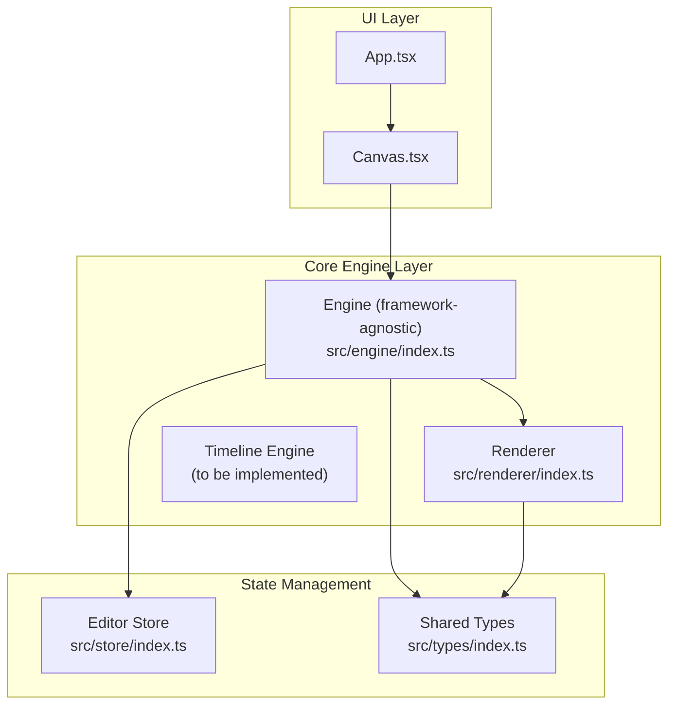
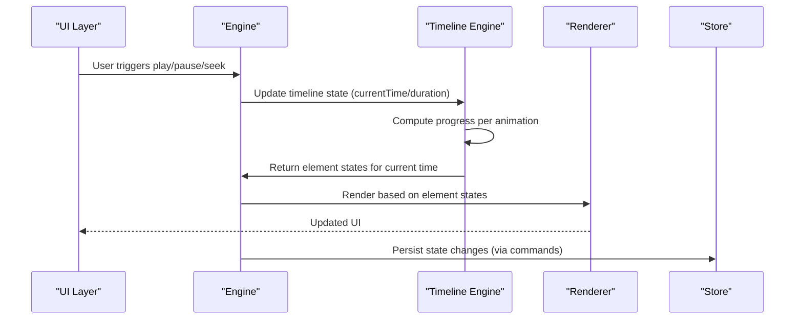
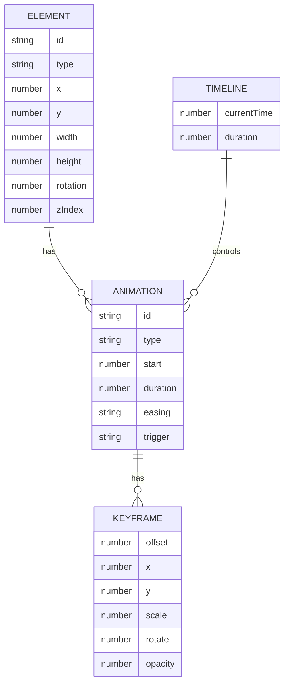
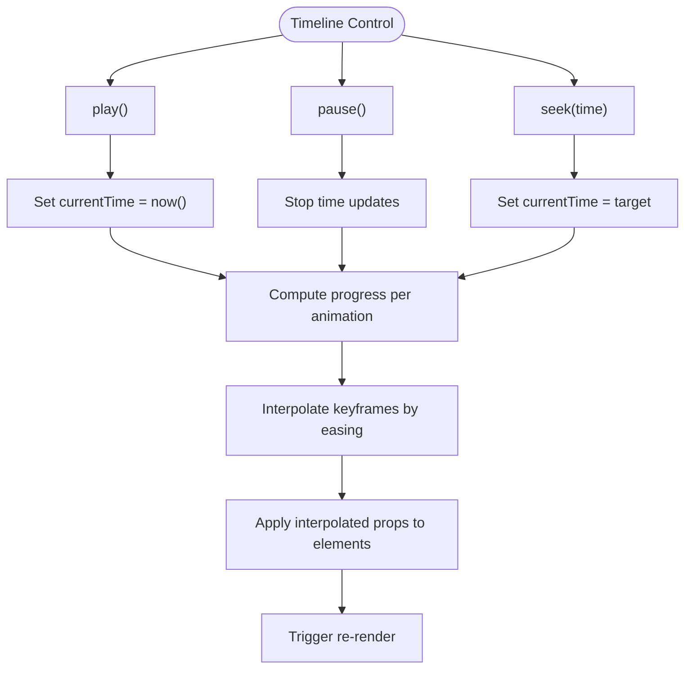
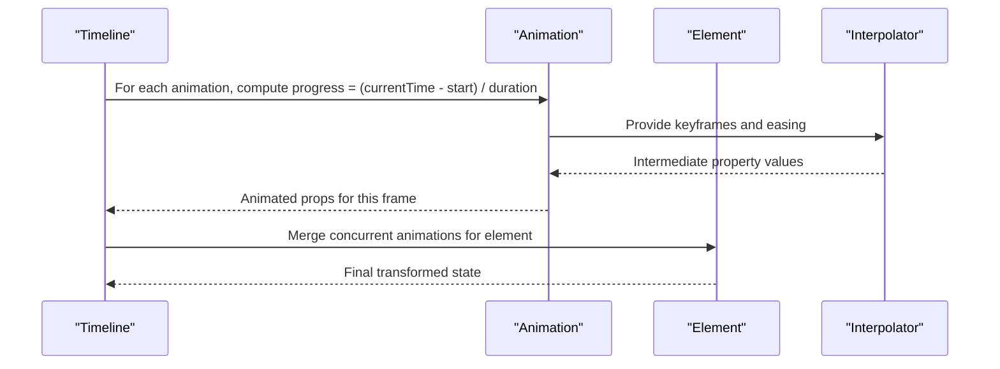
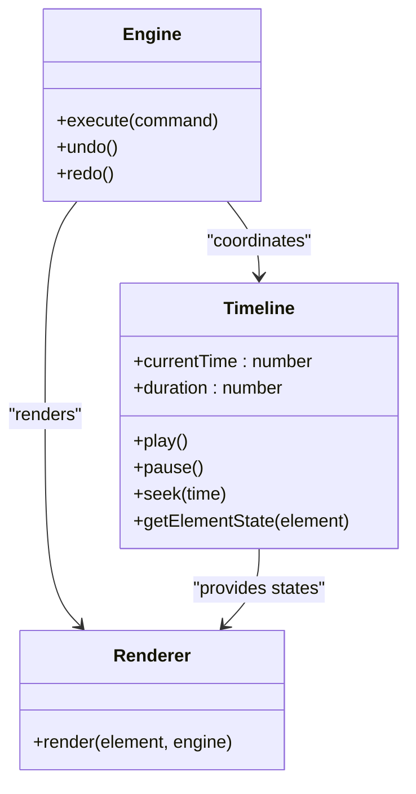
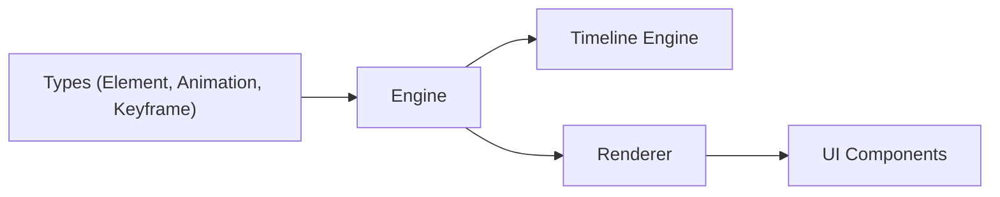

# Timeline Engine

<cite>
**Referenced Files in This Document**
- [spec.md](file://spec.md)
- [spec1.md](file://spec1.md)
- [engine/index.ts](file://src/engine/index.ts)
- [renderer/index.ts](file://src/renderer/index.ts)
- [store/index.ts](file://src/store/index.ts)
- [types/index.ts](file://src/types/index.ts)
- [App.tsx](file://src/App.tsx)
- [Canvas.tsx](file://src/components/Canvas.tsx)
- [main.tsx](file://src/main.tsx)
- [package.json](file://package.json)
</cite>

## Table of Contents
1. [Introduction](#introduction)
2. [Project Structure](#project-structure)
3. [Core Components](#core-components)
4. [Architecture Overview](#architecture-overview)
5. [Detailed Component Analysis](#detailed-component-analysis)
6. [Dependency Analysis](#dependency-analysis)
7. [Performance Considerations](#performance-considerations)
8. [Troubleshooting Guide](#troubleshooting-guide)
9. [Conclusion](#conclusion)

## Introduction
This document describes the Timeline Engine that powers time-based animation playback in the Slides Editor. The engine is designed around a time-driven model where all animation states are computed deterministically from a global timeline, ensuring smooth synchronization across multiple animations and enabling precise control over playback, seeking, and interpolation.

The Timeline Engine integrates with the broader architecture:
- Data-driven scene graph defines elements and their animations
- Engine orchestrates state changes via commands
- Renderer consumes the scene graph to produce UI
- Timeline Engine computes per-frame animation states based on time

## Project Structure
The repository follows a layered architecture:
- UI layer: React components (App, Canvas)
- Core engine layer: Engine, Scene Graph, Renderer, Timeline
- Store: Editor state separate from scene data
- Types: Shared TypeScript types

**Diagram sources**
- [App.tsx:1-17](file://src/App.tsx#L1-L17)
- [Canvas.tsx:1-40](file://src/components/Canvas.tsx#L1-L40)
- [engine/index.ts:1-3](file://src/engine/index.ts#L1-L3)
- [renderer/index.ts:1-2](file://src/renderer/index.ts#L1-L2)
- [store/index.ts:1-2](file://src/store/index.ts#L1-L2)
- [types/index.ts:1-2](file://src/types/index.ts#L1-L2)

**Section sources**
- [App.tsx:1-17](file://src/App.tsx#L1-L17)
- [Canvas.tsx:1-40](file://src/components/Canvas.tsx#L1-L40)
- [engine/index.ts:1-3](file://src/engine/index.ts#L1-L3)
- [renderer/index.ts:1-2](file://src/renderer/index.ts#L1-L2)
- [store/index.ts:1-2](file://src/store/index.ts#L1-L2)
- [types/index.ts:1-2](file://src/types/index.ts#L1-L2)

## Core Components
The Timeline Engine is defined by the following core types and capabilities:

- Timeline structure
  - currentTime: number
  - duration: number

- Core capabilities
  - play
  - pause
  - seek
  - Multi-animation parallelism
  - Keyframe interpolation

- Rendering logic
  - For each animation: progress = (currentTime - start) / duration
  - Interpolate properties based on keyframes and easing

These definitions are documented in the specification documents and align with the overall architecture that treats animations as time-driven computations.

**Section sources**
- [spec.md:241-248](file://spec.md#L241-L248)
- [spec.md:252-258](file://spec.md#L252-L258)
- [spec.md:261-267](file://spec.md#L261-L267)
- [spec1.md:184-198](file://spec1.md#L184-L198)

## Architecture Overview
The Timeline Engine sits within the Engine layer and collaborates with the Renderer and Store. The Engine is framework-agnostic and ensures all state changes go through commands. The Renderer is pure data-to-UI and uses the scene graph for rendering. The Timeline Engine computes animation states based on the global timeline and the element's animation definitions.

**Diagram sources**
- [engine/index.ts:1-3](file://src/engine/index.ts#L1-L3)
- [renderer/index.ts:1-2](file://src/renderer/index.ts#L1-L2)
- [spec.md:231-279](file://spec.md#L231-L279)

**Section sources**
- [engine/index.ts:1-3](file://src/engine/index.ts#L1-L3)
- [renderer/index.ts:1-2](file://src/renderer/index.ts#L1-L2)
- [spec.md:231-279](file://spec.md#L231-L279)

## Detailed Component Analysis

### Timeline Data Model
The Timeline Engine operates on a simple yet powerful model:
- Timeline: currentTime, duration
- Animation: start, duration, easing, optional trigger, keyframes
- Keyframe: offset, props (x, y, scale, rotate, opacity)

Interpolation logic computes progress per animation and applies easing to derive intermediate property values.

**Diagram sources**
- [spec.md:107-134](file://spec.md#L107-L134)

**Section sources**
- [spec.md:107-134](file://spec.md#L107-L134)

### Timeline Playback Control Flow
The Timeline Engine exposes play, pause, and seek operations. These operations update the global currentTime, which drives all animation computations.

**Diagram sources**
- [spec.md:252-258](file://spec.md#L252-L258)
- [spec.md:261-267](file://spec.md#L261-L267)

**Section sources**
- [spec.md:252-258](file://spec.md#L252-L258)
- [spec.md:261-267](file://spec.md#L261-L267)

### Animation Scheduling and Synchronization
Animations are scheduled by their start time and duration. The Timeline Engine computes a normalized progress for each animation and interpolates properties accordingly. Multiple animations can run concurrently, and the engine ensures synchronized updates across all elements.

**Diagram sources**
- [spec.md:261-267](file://spec.md#L261-L267)

**Section sources**
- [spec.md:261-267](file://spec.md#L261-L267)

### Integration with Engine and Renderer
The Engine is framework-agnostic and ensures all state changes go through commands. The Renderer consumes the scene graph to produce UI. The Timeline Engine feeds element states derived from the current timeline to the Renderer.

**Diagram sources**
- [engine/index.ts:1-3](file://src/engine/index.ts#L1-L3)
- [renderer/index.ts:1-2](file://src/renderer/index.ts#L1-L2)
- [spec1.md:98-111](file://spec1.md#L98-L111)

**Section sources**
- [engine/index.ts:1-3](file://src/engine/index.ts#L1-L3)
- [renderer/index.ts:1-2](file://src/renderer/index.ts#L1-L2)
- [spec1.md:98-111](file://spec1.md#L98-L111)

## Dependency Analysis
The Timeline Engine depends on:
- Scene Graph types for element and animation definitions
- Engine for command-driven state updates
- Renderer for applying computed states to UI

**Diagram sources**
- [types/index.ts:1-2](file://src/types/index.ts#L1-L2)
- [engine/index.ts:1-3](file://src/engine/index.ts#L1-L3)
- [renderer/index.ts:1-2](file://src/renderer/index.ts#L1-L2)

**Section sources**
- [types/index.ts:1-2](file://src/types/index.ts#L1-L2)
- [engine/index.ts:1-3](file://src/engine/index.ts#L1-L3)
- [renderer/index.ts:1-2](file://src/renderer/index.ts#L1-L2)

## Performance Considerations
- Use requestAnimationFrame for smooth playback and efficient frame pacing
- Minimize allocations during frame updates by reusing interpolation buffers
- Batch animation state computations per element to reduce redundant work
- Prefer linear interpolation for simple properties and cache expensive easing calculations
- Limit the number of concurrent animations per element to maintain responsiveness
- Defer heavy computations off the main thread when possible

## Troubleshooting Guide
Common issues and debugging approaches:
- Stuttering playback: Verify requestAnimationFrame usage and avoid blocking the main thread
- Incorrect animation timing: Confirm currentTime updates and ensure start/duration alignment
- Property drift: Validate keyframe offsets and easing curves; ensure interpolation boundaries
- Synchronization problems: Check that multiple animations targeting the same element are merged correctly
- Memory leaks: Monitor animation state lifecycle and clear references when animations complete

## Conclusion
The Timeline Engine provides a robust, time-driven foundation for animation playback in the Slides Editor. By centralizing time progression and interpolation, it enables smooth, synchronized animations across multiple elements while maintaining separation of concerns between the Engine, Renderer, and Store layers. The design supports future enhancements such as advanced easing, timeline UI, and optimized rendering paths.