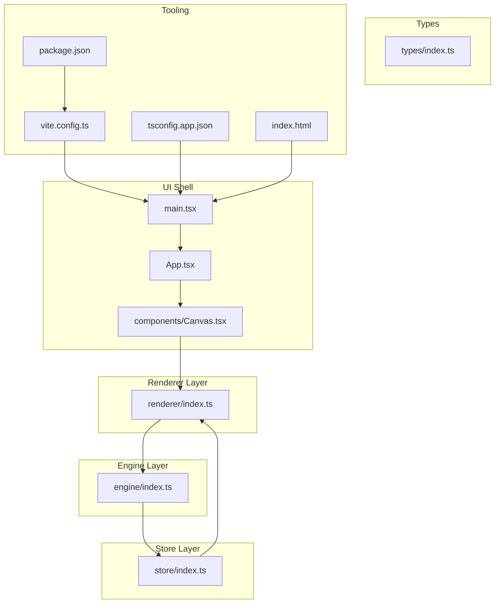
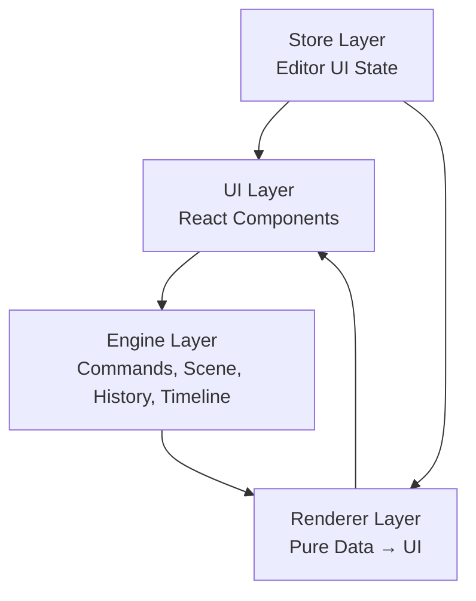
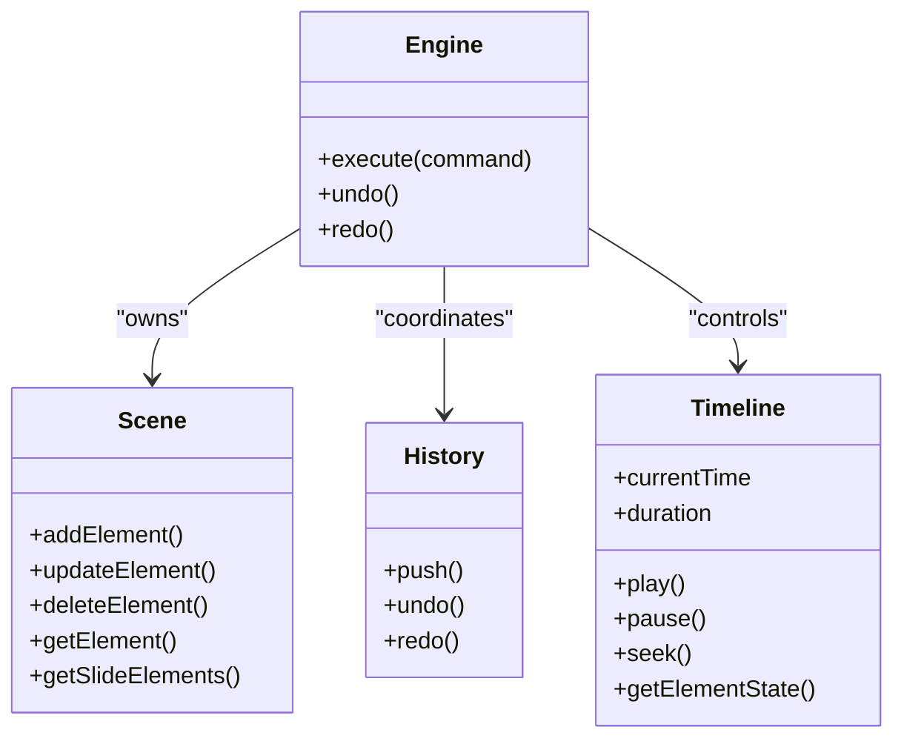
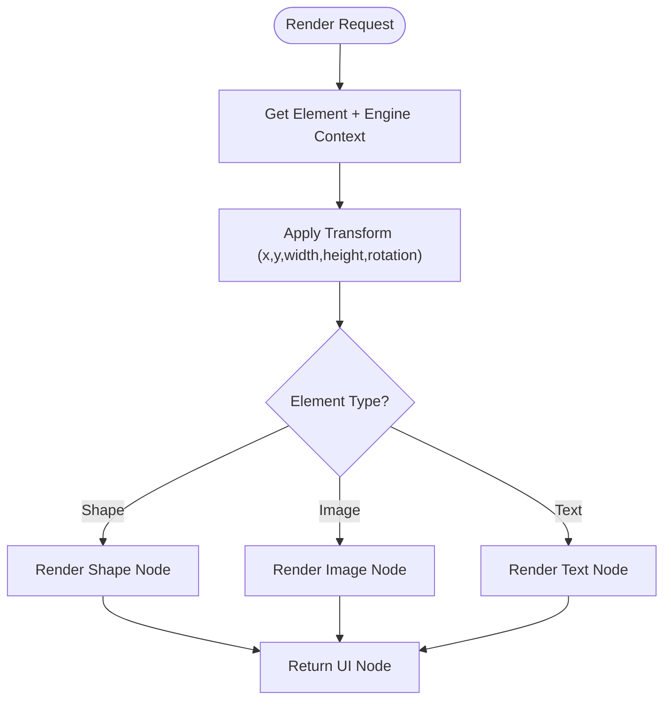
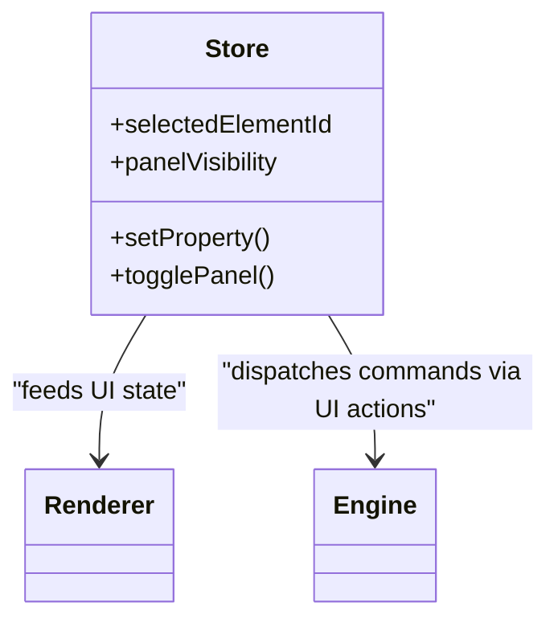
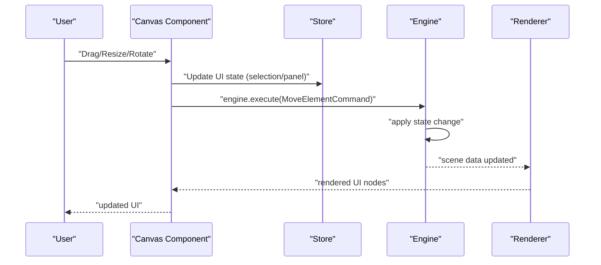
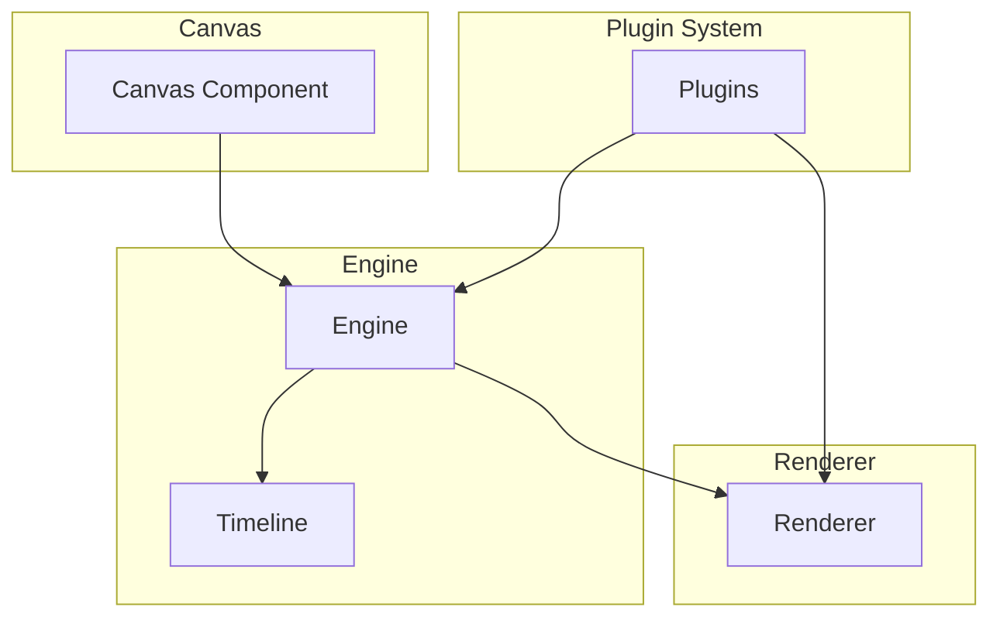
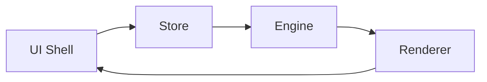

# Architecture Overview

<cite>
**Referenced Files in This Document**
- [engine/index.ts](file://src/engine/index.ts)
- [renderer/index.ts](file://src/renderer/index.ts)
- [store/index.ts](file://src/store/index.ts)
- [components/Canvas.tsx](file://src/components/Canvas.tsx)
- [App.tsx](file://src/App.tsx)
- [main.tsx](file://src/main.tsx)
- [types/index.ts](file://src/types/index.ts)
- [package.json](file://package.json)
- [vite.config.ts](file://vite.config.ts)
- [tsconfig.app.json](file://tsconfig.app.json)
- [index.html](file://index.html)
- [spec.md](file://spec.md)
- [spec1.md](file://spec1.md)
</cite>

## Table of Contents
1. [Introduction](#introduction)
2. [Project Structure](#project-structure)
3. [Core Components](#core-components)
4. [Architecture Overview](#architecture-overview)
5. [Detailed Component Analysis](#detailed-component-analysis)
6. [Dependency Analysis](#dependency-analysis)
7. [Performance Considerations](#performance-considerations)
8. [Troubleshooting Guide](#troubleshooting-guide)
9. [Conclusion](#conclusion)
10. [Appendices](#appendices)

## Introduction
This document describes the AI Editor Engine’s layered architecture with a focus on three core layers:
- Engine: framework-agnostic core logic that owns the single source of truth for editor state and enforces deterministic state transitions via a command pattern.
- Renderer: pure data-to-UI transformation layer that renders elements based on engine-provided scene data.
- Store: editor UI state separate from scene data, coordinating UI interactions and presentation.

It also documents the system context with Canvas components, the timeline engine, and a plugin system, along with cross-cutting concerns such as state management, animation coordination, and undo/redo. The technology stack integrates React, TypeScript, and Vite.

## Project Structure
The project is organized into distinct layers and modules:
- Layered modules: src/engine, src/renderer, src/store
- UI shell: src/App.tsx, src/main.tsx, src/components/Canvas.tsx
- Types: src/types/index.ts
- Build and tooling: vite.config.ts, package.json, tsconfig*.json, index.html

**Diagram sources**
- [App.tsx:1-17](file://src/App.tsx#L1-L17)
- [main.tsx:1-10](file://src/main.tsx#L1-L10)
- [components/Canvas.tsx:1-40](file://src/components/Canvas.tsx#L1-L40)
- [engine/index.ts:1-3](file://src/engine/index.ts#L1-L3)
- [renderer/index.ts:1-3](file://src/renderer/index.ts#L1-L3)
- [store/index.ts:1-2](file://src/store/index.ts#L1-L2)
- [types/index.ts:1-2](file://src/types/index.ts#L1-L2)
- [vite.config.ts:1-7](file://vite.config.ts#L1-L7)
- [package.json:1-29](file://package.json#L1-L29)
- [tsconfig.app.json:1-22](file://tsconfig.app.json#L1-L22)
- [index.html:1-14](file://index.html#L1-L14)

**Section sources**
- [App.tsx:1-17](file://src/App.tsx#L1-L17)
- [main.tsx:1-10](file://src/main.tsx#L1-L10)
- [components/Canvas.tsx:1-40](file://src/components/Canvas.tsx#L1-L40)
- [engine/index.ts:1-3](file://src/engine/index.ts#L1-L3)
- [renderer/index.ts:1-3](file://src/renderer/index.ts#L1-L3)
- [store/index.ts:1-2](file://src/store/index.ts#L1-L2)
- [types/index.ts:1-2](file://src/types/index.ts#L1-L2)
- [vite.config.ts:1-7](file://vite.config.ts#L1-L7)
- [package.json:1-29](file://package.json#L1-L29)
- [tsconfig.app.json:1-22](file://tsconfig.app.json#L1-L22)
- [index.html:1-14](file://index.html#L1-L14)

## Core Components
- Engine (framework-agnostic): central orchestrator enforcing single-source-of-truth updates via commands. It coordinates scene data, editor state, history, and timeline.
- Renderer (pure): transforms scene data into UI nodes without mutating state.
- Store (UI state): manages editor UI state separate from scene data, enabling UI interactions and presentation.

Key architectural principles:
- All state changes must go through engine.execute(command).
- Rendering must be pure (data → UI).
- Animations must be time-driven by the timeline.
- Data structures prioritize a scene graph with explicit references.
- The engine must remain framework-agnostic.

**Section sources**
- [engine/index.ts:1-3](file://src/engine/index.ts#L1-L3)
- [renderer/index.ts:1-3](file://src/renderer/index.ts#L1-L3)
- [store/index.ts:1-2](file://src/store/index.ts#L1-L2)
- [spec.md:21-404](file://spec.md#L21-L404)
- [spec1.md:23-41](file://spec1.md#L23-L41)

## Architecture Overview
The system follows a layered architecture:
- UI layer: React components (App, Canvas) present the editor interface.
- Engine layer: core logic managing scene graph, commands, history, and timeline.
- Renderer layer: pure functions mapping scene data to UI nodes.
- Store layer: UI state management decoupled from scene data.

**Diagram sources**
- [spec.md:21-404](file://spec.md#L21-L404)
- [engine/index.ts:1-3](file://src/engine/index.ts#L1-L3)
- [renderer/index.ts:1-3](file://src/renderer/index.ts#L1-L3)
- [store/index.ts:1-2](file://src/store/index.ts#L1-L2)

## Detailed Component Analysis

### Engine Layer
The engine is the single source of truth for editor state and enforces deterministic updates via a command pattern. It coordinates:
- Scene graph operations (add/update/delete/get element, slide queries)
- Editor state management
- History stack for undo/redo
- Timeline orchestration for animations

**Diagram sources**
- [spec1.md:98-111](file://spec1.md#L98-L111)
- [spec1.md:133-146](file://spec1.md#L133-L146)
- [spec1.md:184-198](file://spec1.md#L184-L198)

**Section sources**
- [engine/index.ts:1-3](file://src/engine/index.ts#L1-L3)
- [spec1.md:98-111](file://spec1.md#L98-L111)
- [spec1.md:133-146](file://spec1.md#L133-L146)
- [spec1.md:184-198](file://spec1.md#L184-L198)

### Renderer Layer
The renderer is a pure layer that converts scene data into UI nodes. It supports shapes, images, and text, applies transforms, and remains framework-agnostic.

**Diagram sources**
- [renderer/index.ts:1-3](file://src/renderer/index.ts#L1-L3)
- [spec1.md:149-163](file://spec1.md#L149-L163)

**Section sources**
- [renderer/index.ts:1-3](file://src/renderer/index.ts#L1-L3)
- [spec1.md:149-163](file://spec1.md#L149-L163)

### Store Layer
The store manages editor UI state separately from scene data, enabling UI interactions such as selection, property editing, and panel visibility.

**Diagram sources**
- [store/index.ts:1-2](file://src/store/index.ts#L1-L2)
- [spec.md:190-214](file://spec.md#L190-L214)

**Section sources**
- [store/index.ts:1-2](file://src/store/index.ts#L1-L2)
- [spec.md:190-214](file://spec.md#L190-L214)

### UI Shell and Canvas
The UI shell composes the app and renders the canvas area. The Canvas component currently renders a placeholder layout; integration with the engine and renderer will connect user interactions to engine commands and render updates.

**Diagram sources**
- [components/Canvas.tsx:1-40](file://src/components/Canvas.tsx#L1-L40)
- [store/index.ts:1-2](file://src/store/index.ts#L1-L2)
- [engine/index.ts:1-3](file://src/engine/index.ts#L1-L3)
- [renderer/index.ts:1-3](file://src/renderer/index.ts#L1-L3)
- [spec1.md:166-182](file://spec1.md#L166-L182)

**Section sources**
- [components/Canvas.tsx:1-40](file://src/components/Canvas.tsx#L1-L40)
- [App.tsx:1-17](file://src/App.tsx#L1-L17)
- [main.tsx:1-10](file://src/main.tsx#L1-L10)

### System Context: Canvas, Timeline, Plugins
The system integrates:
- Canvas components for editing and preview
- Timeline engine for time-driven animation playback
- Plugin system for extending commands, panels, and shortcuts

**Diagram sources**
- [spec.md:231-279](file://spec.md#L231-L279)
- [spec1.md:218-237](file://spec1.md#L218-L237)

**Section sources**
- [spec.md:231-279](file://spec.md#L231-L279)
- [spec1.md:218-237](file://spec1.md#L218-L237)

## Dependency Analysis
The architecture enforces clear separation of concerns:
- UI depends on renderer and store
- Renderer depends on engine-provided scene data
- Store coordinates UI state and dispatches commands to engine
- Engine is framework-agnostic and orchestrates scene, history, and timeline

**Diagram sources**
- [spec.md:21-404](file://spec.md#L21-L404)
- [engine/index.ts:1-3](file://src/engine/index.ts#L1-L3)
- [renderer/index.ts:1-3](file://src/renderer/index.ts#L1-L3)
- [store/index.ts:1-2](file://src/store/index.ts#L1-L2)

**Section sources**
- [spec.md:21-404](file://spec.md#L21-L404)
- [engine/index.ts:1-3](file://src/engine/index.ts#L1-L3)
- [renderer/index.ts:1-3](file://src/renderer/index.ts#L1-L3)
- [store/index.ts:1-2](file://src/store/index.ts#L1-L2)

## Performance Considerations
- Pure renderer functions minimize re-renders by focusing on data transformations.
- Timeline-driven animations reduce event overhead by using requestAnimationFrame and deterministic progress calculations.
- Separation of scene data and UI state reduces unnecessary UI updates.
- Framework-agnostic engine enables potential renderer optimizations (e.g., canvas-based playback) without affecting UI.

[No sources needed since this section provides general guidance]

## Troubleshooting Guide
Common issues and remedies:
- Violating single-source-of-truth: ensure all state changes pass through engine.execute(command).
- Direct DOM mutations: avoid modifying DOM directly; rely on renderer outputs.
- Incorrect animation timing: verify timeline.currentTime and keyframe interpolation logic.
- Undo/redo inconsistencies: confirm command payloads include prev/next snapshots and history stack behavior.

**Section sources**
- [spec1.md:114-129](file://spec1.md#L114-L129)
- [spec1.md:133-146](file://spec1.md#L133-L146)
- [spec.md:393-401](file://spec.md#L393-L401)

## Conclusion
The AI Editor Engine employs a clean, layered architecture with a strong emphasis on determinism, separation of concerns, and framework-agnostic design. The command pattern ensures predictable state transitions, while the timeline engine and pure renderer enable efficient, time-driven animations. The store layer cleanly separates UI state from scene data, supporting robust interactions and scalability.

[No sources needed since this section summarizes without analyzing specific files]

## Appendices

### Technology Stack
- Framework: React
- State Management: Zustand
- Drag/Transform: react-moveable
- Animation Driver: requestAnimationFrame
- Path Editing: SVG
- Build Tool: Vite
- Language: TypeScript

**Section sources**
- [spec.md:334-341](file://spec.md#L334-L341)
- [package.json:12-26](file://package.json#L12-L26)
- [vite.config.ts:1-7](file://vite.config.ts#L1-7)
- [tsconfig.app.json:1-22](file://tsconfig.app.json#L1-L22)
- [index.html:1-14](file://index.html#L1-L14)