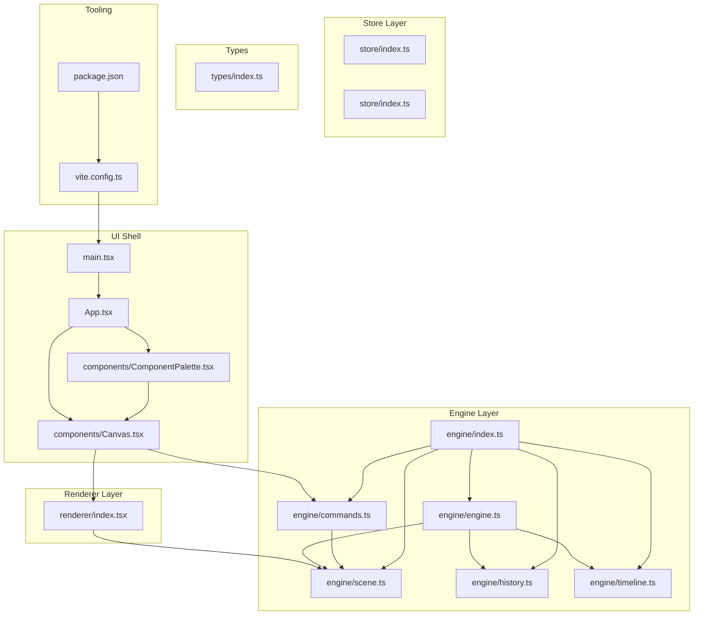
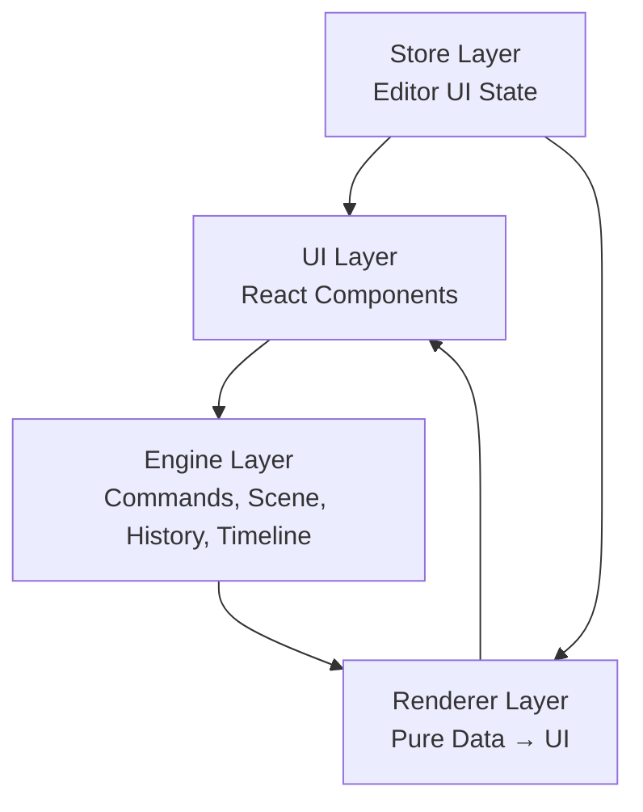
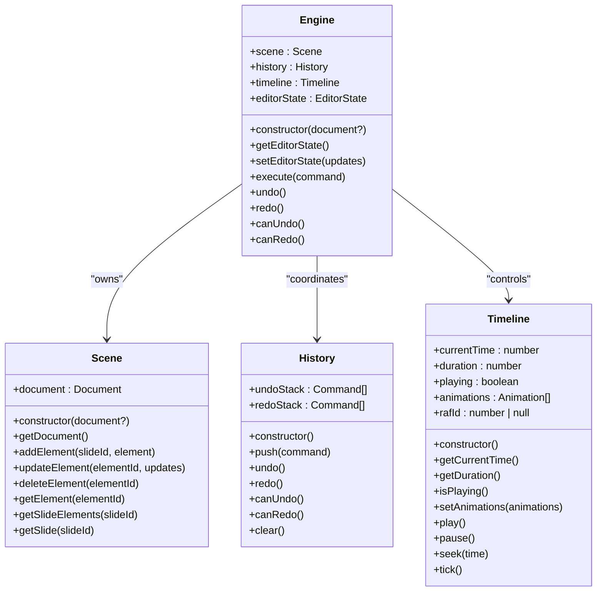
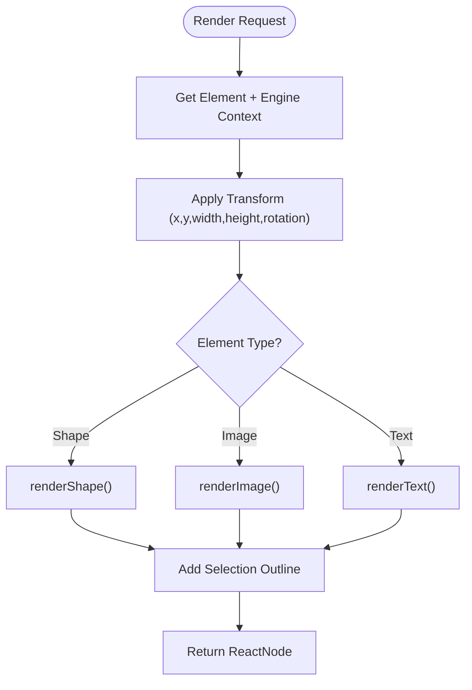
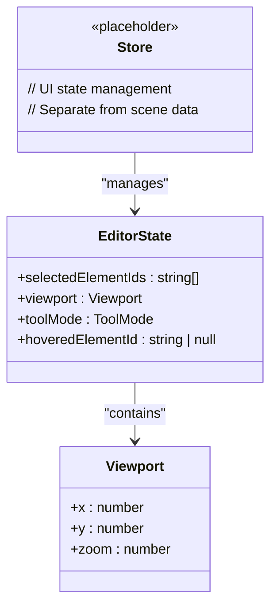
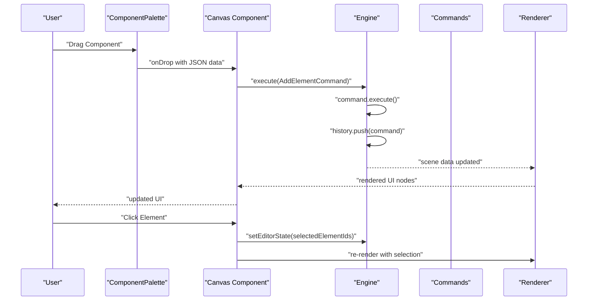
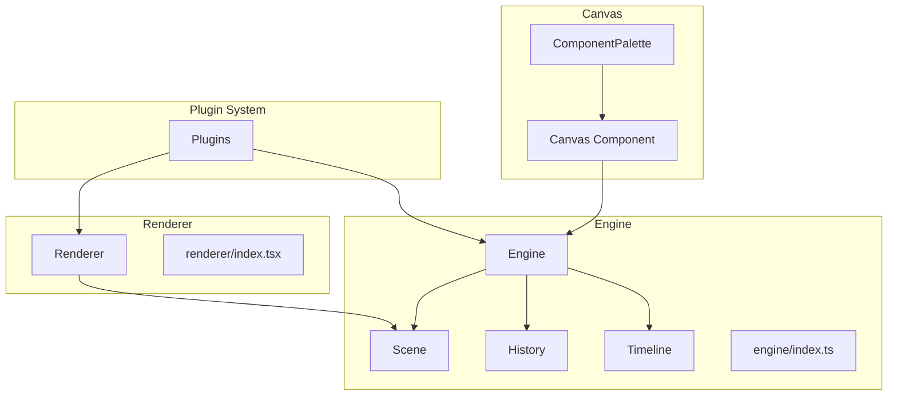
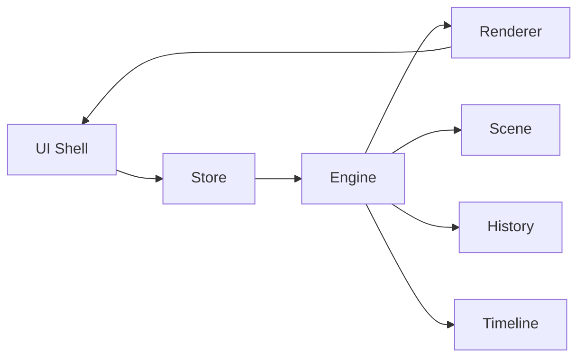

# Architecture Overview

<cite>
**Referenced Files in This Document**
- [engine/index.ts](file://src/engine/index.ts)
- [engine/engine.ts](file://src/engine/engine.ts)
- [engine/scene.ts](file://src/engine/scene.ts)
- [engine/history.ts](file://src/engine/history.ts)
- [engine/timeline.ts](file://src/engine/timeline.ts)
- [engine/commands.ts](file://src/engine/commands.ts)
- [renderer/index.tsx](file://src/renderer/index.tsx)
- [store/index.ts](file://src/store/index.ts)
- [components/Canvas.tsx](file://src/components/Canvas.tsx)
- [components/ComponentPalette.tsx](file://src/components/ComponentPalette.tsx)
- [App.tsx](file://src/App.tsx)
- [main.tsx](file://src/main.tsx)
- [types/index.ts](file://src/types/index.ts)
- [package.json](file://package.json)
- [vite.config.ts](file://vite.config.ts)
</cite>

## Update Summary
**Changes Made**
- Updated engine layer documentation to reflect the complete implementation with Scene, History, Timeline, and Command classes
- Enhanced renderer layer documentation with detailed React component rendering pipeline
- Expanded store layer documentation to clarify UI state management separation
- Added comprehensive command pattern system documentation with concrete implementations
- Updated system context diagrams to show actual component interactions
- Revised dependency analysis to reflect the new layered architecture

## Table of Contents
1. [Introduction](#introduction)
2. [Project Structure](#project-structure)
3. [Core Components](#core-components)
4. [Architecture Overview](#architecture-overview)
5. [Detailed Component Analysis](#detailed-component-analysis)
6. [Dependency Analysis](#dependency-analysis)
7. [Performance Considerations](#performance-considerations)
8. [Troubleshooting Guide](#troubleshooting-guide)
9. [Conclusion](#conclusion)
10. [Appendices](#appendices)

## Introduction
This document describes the AI Editor Engine's layered architecture with a focus on three core layers:
- Engine: framework-agnostic core logic that owns the single source of truth for editor state and enforces deterministic state transitions via a command pattern.
- Renderer: pure data-to-UI transformation layer that renders elements based on engine-provided scene data.
- Store: editor UI state separate from scene data, coordinating UI interactions and presentation.

The system integrates Canvas components, timeline engine, and plugin system with cross-cutting concerns such as state management, animation coordination, and undo/redo functionality. The technology stack integrates React, TypeScript, and Vite.

## Project Structure
The project is organized into distinct layers and modules:
- Layered modules: src/engine (complete implementation), src/renderer, src/store
- UI shell: src/App.tsx, src/main.tsx, src/components/Canvas.tsx, src/components/ComponentPalette.tsx
- Types: src/types/index.ts
- Build and tooling: vite.config.ts, package.json, tsconfig*.json, index.html

**Diagram sources**
- [App.tsx:1-41](file://src/App.tsx#L1-L41)
- [main.tsx:1-10](file://src/main.tsx#L1-L10)
- [components/Canvas.tsx:1-169](file://src/components/Canvas.tsx#L1-L169)
- [components/ComponentPalette.tsx:1-68](file://src/components/ComponentPalette.tsx#L1-L68)
- [engine/engine.ts:1-54](file://src/engine/engine.ts#L1-L54)
- [engine/scene.ts:1-146](file://src/engine/scene.ts#L1-L146)
- [engine/history.ts:1-45](file://src/engine/history.ts#L1-L45)
- [engine/timeline.ts:1-68](file://src/engine/timeline.ts#L1-L68)
- [engine/commands.ts:1-67](file://src/engine/commands.ts#L1-L67)
- [engine/index.ts:1-9](file://src/engine/index.ts#L1-L9)
- [renderer/index.tsx:1-135](file://src/renderer/index.tsx#L1-L135)
- [store/index.ts:1-2](file://src/store/index.ts#L1-L2)
- [types/index.ts:1-238](file://src/types/index.ts#L1-L238)
- [vite.config.ts:1-7](file://vite.config.ts#L1-L7)
- [package.json:1-29](file://package.json#L1-L29)

**Section sources**
- [App.tsx:1-41](file://src/App.tsx#L1-L41)
- [main.tsx:1-10](file://src/main.tsx#L1-L10)
- [components/Canvas.tsx:1-169](file://src/components/Canvas.tsx#L1-L169)
- [components/ComponentPalette.tsx:1-68](file://src/components/ComponentPalette.tsx#L1-L68)
- [engine/index.ts:1-9](file://src/engine/index.ts#L1-L9)
- [renderer/index.tsx:1-135](file://src/renderer/index.tsx#L1-L135)
- [store/index.ts:1-2](file://src/store/index.ts#L1-L2)
- [types/index.ts:1-238](file://src/types/index.ts#L1-L238)
- [vite.config.ts:1-7](file://vite.config.ts#L1-L7)
- [package.json:1-29](file://package.json#L1-L29)

## Core Components
- Engine (framework-agnostic): central orchestrator enforcing single-source-of-truth updates via commands. It coordinates scene data, editor state, history, and timeline.
- Renderer (pure): transforms scene data into UI nodes without mutating state.
- Store (UI state): manages editor UI state separate from scene data, enabling UI interactions and presentation.

Key architectural principles:
- All state changes must go through engine.execute(command).
- Rendering must be pure (data → UI).
- Animations must be time-driven by the timeline.
- Data structures prioritize a scene graph with explicit references.
- The engine must remain framework-agnostic.

**Section sources**
- [engine/index.ts:1-9](file://src/engine/index.ts#L1-L9)
- [renderer/index.tsx:1-135](file://src/renderer/index.tsx#L1-L135)
- [store/index.ts:1-2](file://src/store/index.ts#L1-L2)
- [types/index.ts:104-121](file://src/types/index.ts#L104-L121)

## Architecture Overview
The system follows a layered architecture:
- UI layer: React components (App, Canvas, ComponentPalette) present the editor interface.
- Engine layer: core logic managing scene graph, commands, history, and timeline.
- Renderer layer: pure functions mapping scene data to UI nodes.
- Store layer: UI state management decoupled from scene data.

**Diagram sources**
- [App.tsx:1-41](file://src/App.tsx#L1-L41)
- [components/Canvas.tsx:1-169](file://src/components/Canvas.tsx#L1-L169)
- [components/ComponentPalette.tsx:1-68](file://src/components/ComponentPalette.tsx#L1-L68)
- [engine/engine.ts:1-54](file://src/engine/engine.ts#L1-L54)
- [engine/scene.ts:1-146](file://src/engine/scene.ts#L1-L146)
- [engine/history.ts:1-45](file://src/engine/history.ts#L1-L45)
- [engine/timeline.ts:1-68](file://src/engine/timeline.ts#L1-L68)
- [renderer/index.tsx:1-135](file://src/renderer/index.tsx#L1-L135)

## Detailed Component Analysis

### Engine Layer
The engine is the single source of truth for editor state and enforces deterministic updates via a command pattern. It coordinates:
- Scene graph operations (add/update/delete/get element, slide queries)
- Editor state management
- History stack for undo/redo
- Timeline orchestration for animations

**Diagram sources**
- [engine/engine.ts:7-49](file://src/engine/engine.ts#L7-L49)
- [engine/scene.ts:3-121](file://src/engine/scene.ts#L3-L121)
- [engine/history.ts:3-44](file://src/engine/history.ts#L3-L44)
- [engine/timeline.ts:3-67](file://src/engine/timeline.ts#L3-L67)

**Section sources**
- [engine/engine.ts:1-54](file://src/engine/engine.ts#L1-L54)
- [engine/scene.ts:1-146](file://src/engine/scene.ts#L1-L146)
- [engine/history.ts:1-45](file://src/engine/history.ts#L1-L45)
- [engine/timeline.ts:1-68](file://src/engine/timeline.ts#L1-L68)
- [engine/commands.ts:1-67](file://src/engine/commands.ts#L1-L67)

### Renderer Layer
The renderer is a pure layer that converts scene data into UI nodes. It supports shapes, images, and text, applies transforms, and remains framework-agnostic.

**Diagram sources**
- [renderer/index.tsx:121-135](file://src/renderer/index.tsx#L121-L135)
- [renderer/index.tsx:24-48](file://src/renderer/index.tsx#L24-L48)
- [renderer/index.tsx:82-103](file://src/renderer/index.tsx#L82-L103)
- [renderer/index.tsx:50-80](file://src/renderer/index.tsx#L50-L80)

**Section sources**
- [renderer/index.tsx:1-135](file://src/renderer/index.tsx#L1-L135)

### Store Layer
The store manages editor UI state separately from scene data, enabling UI interactions such as selection, property editing, and panel visibility.

**Diagram sources**
- [store/index.ts:1-2](file://src/store/index.ts#L1-L2)
- [types/index.ts:107-120](file://src/types/index.ts#L107-L120)

**Section sources**
- [store/index.ts:1-2](file://src/store/index.ts#L1-L2)
- [types/index.ts:104-121](file://src/types/index.ts#L104-L121)

### UI Shell and Canvas
The UI shell composes the app and renders the canvas area. The Canvas component currently renders a placeholder layout; integration with the engine and renderer will connect user interactions to engine commands and render updates.

**Diagram sources**
- [components/ComponentPalette.tsx:18-26](file://src/components/ComponentPalette.tsx#L18-L26)
- [components/Canvas.tsx:31-56](file://src/components/Canvas.tsx#L31-L56)
- [components/Canvas.tsx:58-69](file://src/components/Canvas.tsx#L58-L69)
- [engine/engine.ts:29-32](file://src/engine/engine.ts#L29-L32)
- [engine/commands.ts:4-18](file://src/engine/commands.ts#L4-L18)
- [renderer/index.tsx:121-135](file://src/renderer/index.tsx#L121-L135)

**Section sources**
- [components/Canvas.tsx:1-169](file://src/components/Canvas.tsx#L1-L169)
- [components/ComponentPalette.tsx:1-68](file://src/components/ComponentPalette.tsx#L1-L68)
- [App.tsx:1-41](file://src/App.tsx#L1-L41)
- [main.tsx:1-10](file://src/main.tsx#L1-L10)

### System Context: Canvas, Timeline, Plugins
The system integrates:
- Canvas components for editing and preview
- Timeline engine for time-driven animation playback
- Plugin system for extending commands, panels, and shortcuts

**Diagram sources**
- [components/Canvas.tsx:1-169](file://src/components/Canvas.tsx#L1-L169)
- [components/ComponentPalette.tsx:1-68](file://src/components/ComponentPalette.tsx#L1-L68)
- [engine/engine.ts:1-54](file://src/engine/engine.ts#L1-L54)
- [engine/scene.ts:1-146](file://src/engine/scene.ts#L1-L146)
- [engine/history.ts:1-45](file://src/engine/history.ts#L1-L45)
- [engine/timeline.ts:1-68](file://src/engine/timeline.ts#L1-L68)
- [engine/index.ts:1-9](file://src/engine/index.ts#L1-L9)
- [renderer/index.tsx:1-135](file://src/renderer/index.tsx#L1-L135)

**Section sources**
- [components/Canvas.tsx:1-169](file://src/components/Canvas.tsx#L1-L169)
- [components/ComponentPalette.tsx:1-68](file://src/components/ComponentPalette.tsx#L1-L68)
- [engine/index.ts:1-9](file://src/engine/index.ts#L1-L9)
- [renderer/index.tsx:1-135](file://src/renderer/index.tsx#L1-L135)

## Dependency Analysis
The architecture enforces clear separation of concerns:
- UI depends on renderer and store
- Renderer depends on engine-provided scene data
- Store coordinates UI state and dispatches commands to engine
- Engine is framework-agnostic and orchestrates scene, history, and timeline

**Diagram sources**
- [App.tsx:1-41](file://src/App.tsx#L1-L41)
- [components/Canvas.tsx:1-169](file://src/components/Canvas.tsx#L1-L169)
- [engine/engine.ts:1-54](file://src/engine/engine.ts#L1-L54)
- [engine/scene.ts:1-146](file://src/engine/scene.ts#L1-L146)
- [engine/history.ts:1-45](file://src/engine/history.ts#L1-L45)
- [engine/timeline.ts:1-68](file://src/engine/timeline.ts#L1-L68)
- [renderer/index.tsx:1-135](file://src/renderer/index.tsx#L1-L135)

**Section sources**
- [App.tsx:1-41](file://src/App.tsx#L1-L41)
- [components/Canvas.tsx:1-169](file://src/components/Canvas.tsx#L1-L169)
- [engine/engine.ts:1-54](file://src/engine/engine.ts#L1-L54)
- [engine/scene.ts:1-146](file://src/engine/scene.ts#L1-L146)
- [engine/history.ts:1-45](file://src/engine/history.ts#L1-L45)
- [engine/timeline.ts:1-68](file://src/engine/timeline.ts#L1-L68)
- [renderer/index.tsx:1-135](file://src/renderer/index.tsx#L1-L135)

## Performance Considerations
- Pure renderer functions minimize re-renders by focusing on data transformations.
- Timeline-driven animations reduce event overhead by using requestAnimationFrame and deterministic progress calculations.
- Separation of scene data and UI state reduces unnecessary UI updates.
- Framework-agnostic engine enables potential renderer optimizations (e.g., canvas-based playback) without affecting UI.

## Troubleshooting Guide
Common issues and remedies:
- Violating single-source-of-truth: ensure all state changes pass through engine.execute(command).
- Direct DOM mutations: avoid modifying DOM directly; rely on renderer outputs.
- Incorrect animation timing: verify timeline.currentTime and keyframe interpolation logic.
- Undo/redo inconsistencies: confirm command payloads include prev/next snapshots and history stack behavior.

**Section sources**
- [engine/history.ts:12-30](file://src/engine/history.ts#L12-L30)
- [engine/commands.ts:4-18](file://src/engine/commands.ts#L4-L18)
- [engine/timeline.ts:48-66](file://src/engine/timeline.ts#L48-L66)

## Conclusion
The AI Editor Engine employs a clean, layered architecture with a strong emphasis on determinism, separation of concerns, and framework-agnostic design. The command pattern ensures predictable state transitions, while the timeline engine and pure renderer enable efficient, time-driven animations. The store layer cleanly separates UI state from scene data, supporting robust interactions and scalability.

## Appendices

### Technology Stack
- Framework: React
- State Management: Custom engine-based state management
- Drag/Transform: Native HTML5 drag-and-drop API
- Animation Driver: requestAnimationFrame
- Path Editing: SVG
- Build Tool: Vite
- Language: TypeScript

**Section sources**
- [package.json:12-27](file://package.json#L12-L27)
- [vite.config.ts:1-7](file://vite.config.ts#L1-L7)
- [engine/timeline.ts:3,48](file://src/engine/timeline.ts#L3,L48)
- [renderer/index.tsx:105-119](file://src/renderer/index.tsx#L105-L119)