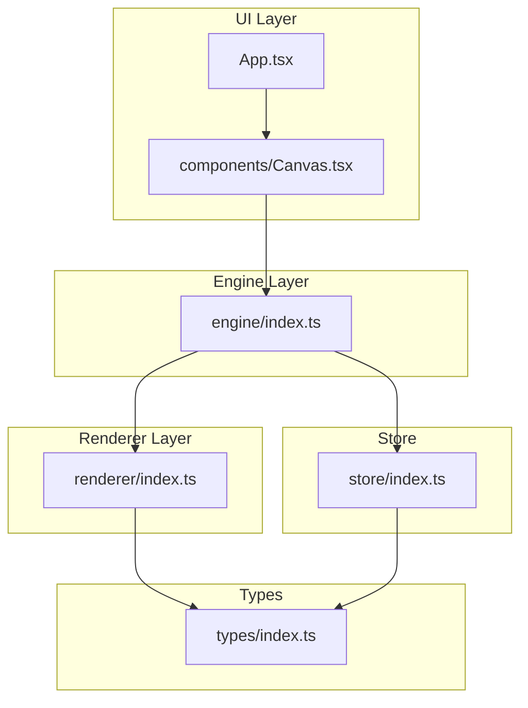
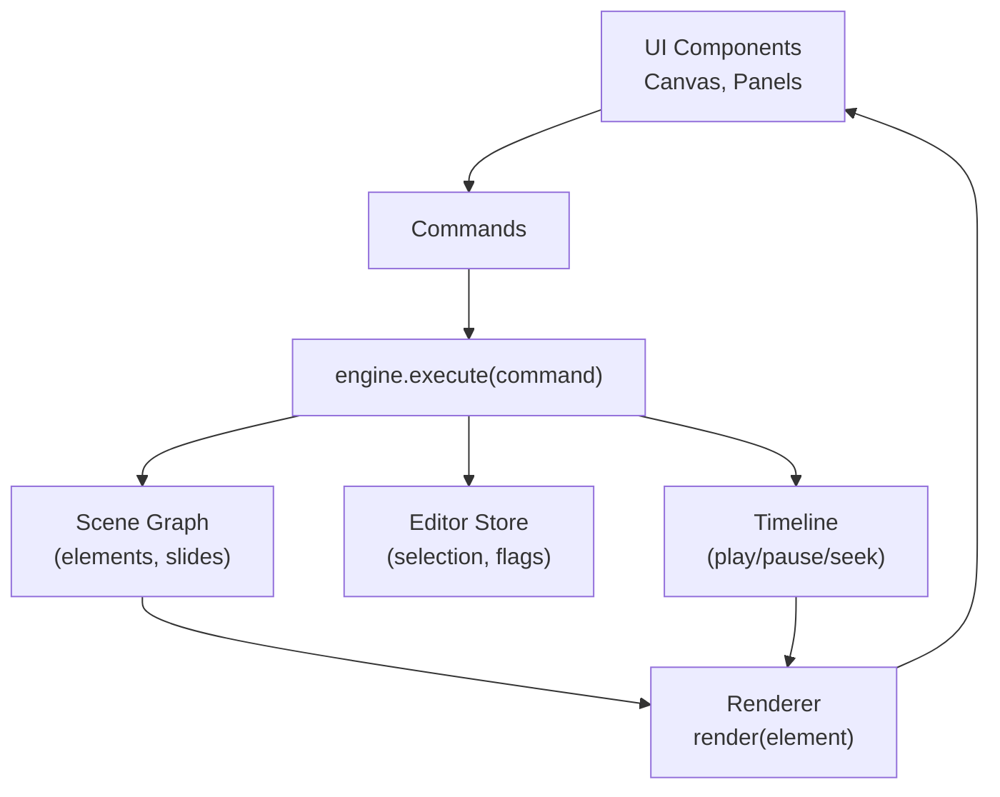
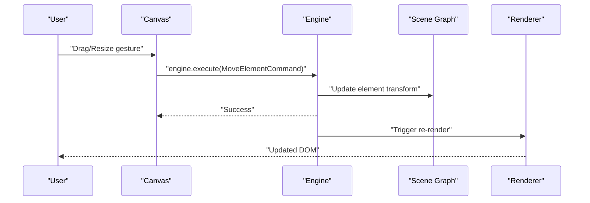
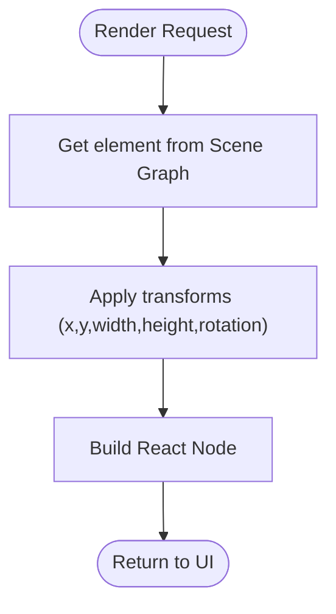
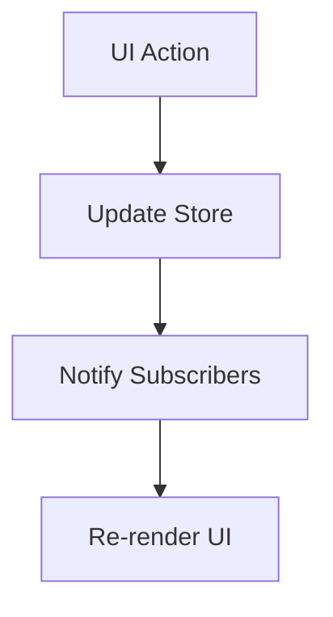
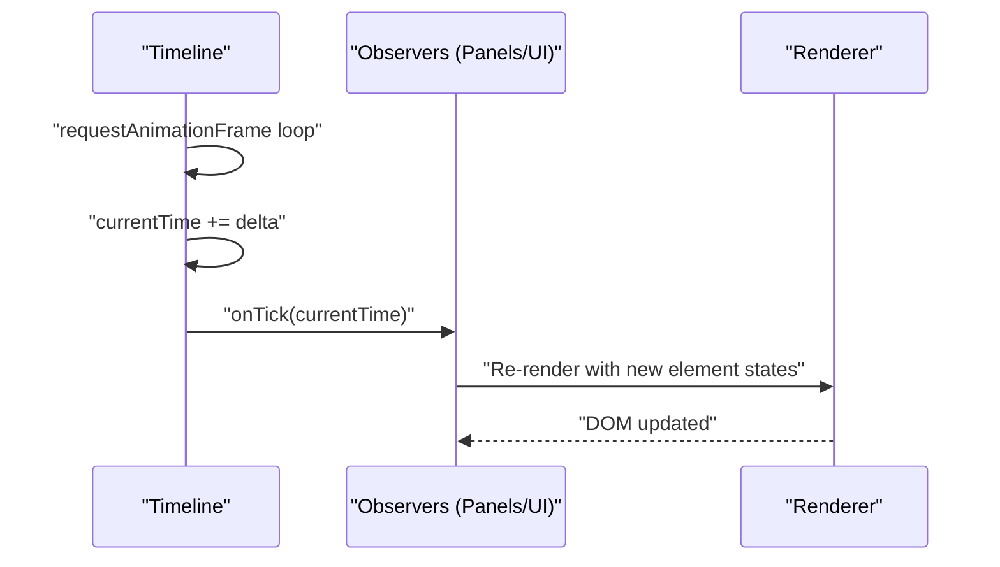
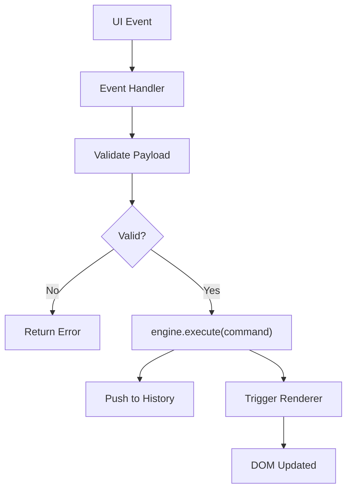
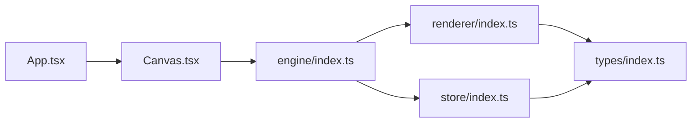

# Component Interactions

<cite>
**Referenced Files in This Document**
- [engine/index.ts](file://src/engine/index.ts)
- [renderer/index.ts](file://src/renderer/index.ts)
- [store/index.ts](file://src/store/index.ts)
- [components/Canvas.tsx](file://src/components/Canvas.tsx)
- [App.tsx](file://src/App.tsx)
- [main.tsx](file://src/main.tsx)
- [types/index.ts](file://src/types/index.ts)
- [spec.md](file://spec.md)
- [spec1.md](file://spec1.md)
</cite>

## Table of Contents
1. [Introduction](#introduction)
2. [Project Structure](#project-structure)
3. [Core Components](#core-components)
4. [Architecture Overview](#architecture-overview)
5. [Detailed Component Analysis](#detailed-component-analysis)
6. [Dependency Analysis](#dependency-analysis)
7. [Performance Considerations](#performance-considerations)
8. [Troubleshooting Guide](#troubleshooting-guide)
9. [Conclusion](#conclusion)

## Introduction
This document explains how components interact within the AI Editor Engine architecture. It focuses on:
- How Canvas integrates with the engine through command execution
- How the renderer transforms scene data into UI components
- How the store manages editor state separately from scene data
- The observer pattern for timeline-driven animations and component subscriptions
- Event propagation, callback mechanisms, and error handling across component boundaries
- Sequence diagrams for typical user interaction flows from drag operations to final DOM updates

The project follows a layered architecture: UI layer (React components), Engine layer (framework-agnostic core), Renderer layer (pure data-to-UI), and Timeline/Store subsystems. The design enforces that all state changes go through the engine’s command system, ensuring deterministic state transitions and separation of concerns.

## Project Structure
The repository is organized into clear layers:
- UI Layer: App and Canvas components
- Engine Layer: Core engine module
- Renderer Layer: Pure rendering utilities
- Store: Editor state management
- Types: Shared type definitions
- Specs: Architectural and functional specifications

**Diagram sources**
- [App.tsx:1-17](file://src/App.tsx#L1-L17)
- [components/Canvas.tsx:1-40](file://src/components/Canvas.tsx#L1-L40)
- [engine/index.ts:1-3](file://src/engine/index.ts#L1-L3)
- [renderer/index.ts:1-3](file://src/renderer/index.ts#L1-L3)
- [store/index.ts:1-2](file://src/store/index.ts#L1-L2)
- [types/index.ts:1-2](file://src/types/index.ts#L1-L2)

**Section sources**
- [main.tsx:1-10](file://src/main.tsx#L1-L10)
- [App.tsx:1-17](file://src/App.tsx#L1-L17)
- [components/Canvas.tsx:1-40](file://src/components/Canvas.tsx#L1-L40)
- [engine/index.ts:1-3](file://src/engine/index.ts#L1-L3)
- [renderer/index.ts:1-3](file://src/renderer/index.ts#L1-L3)
- [store/index.ts:1-2](file://src/store/index.ts#L1-L2)
- [types/index.ts:1-2](file://src/types/index.ts#L1-L2)

## Core Components
- Engine: Central orchestrator enforcing single-source-of-truth state changes via commands. All interactions must pass through engine.execute(command).
- Renderer: Pure function layer transforming scene data into UI nodes without mutating state.
- Store: Manages editor state (selection, panels, UI flags) separate from scene data.
- Canvas: UI container hosting the editing surface; integrates with engine via commands and renders via renderer.
- App: Top-level container wiring header, main area, and Canvas.

Key architectural principles:
- All state mutations must go through engine.execute(command)
- Rendering is pure (data → UI)
- Animations are time-driven by Timeline
- Scene Graph is the single source of truth

**Section sources**
- [engine/index.ts:1-3](file://src/engine/index.ts#L1-L3)
- [renderer/index.ts:1-3](file://src/renderer/index.ts#L1-L3)
- [store/index.ts:1-2](file://src/store/index.ts#L1-L2)
- [components/Canvas.tsx:1-40](file://src/components/Canvas.tsx#L1-L40)
- [App.tsx:1-17](file://src/App.tsx#L1-L17)
- [spec.md:21-404](file://spec.md#L21-L404)
- [spec1.md:23-42](file://spec1.md#L23-L42)

## Architecture Overview
The system is layered and decoupled:
- UI components render the current scene state
- Engine holds the Scene Graph and applies commands to mutate it
- Renderer converts scene elements into React nodes
- Store tracks editor UI state (selection, open panels)
- Timeline drives animation playback and state updates

**Diagram sources**
- [spec.md:21-404](file://spec.md#L21-L404)
- [spec1.md:98-111](file://spec1.md#L98-L111)
- [renderer/index.ts:1-3](file://src/renderer/index.ts#L1-L3)
- [engine/index.ts:1-3](file://src/engine/index.ts#L1-L3)
- [store/index.ts:1-2](file://src/store/index.ts#L1-L2)

## Detailed Component Analysis

### Canvas Integration with Engine via Commands
Canvas acts as the primary editing surface. Drag, resize, rotate, and selection actions must call engine.execute(command) to mutate the Scene Graph. This ensures:
- Single-source-of-truth state management
- Undo/redo capability via command history
- Predictable re-rendering through pure renderer

Typical flow:
- User drags/resizes an element
- Canvas computes new geometry
- Canvas invokes engine.execute(MoveElementCommand or ResizeElementCommand)
- Engine updates Scene Graph and pushes command to history
- Renderer reacts to changed scene data and re-renders affected elements

**Diagram sources**
- [spec1.md:166-181](file://spec1.md#L166-L181)
- [engine/index.ts:1-3](file://src/engine/index.ts#L1-L3)
- [renderer/index.ts:1-3](file://src/renderer/index.ts#L1-L3)

**Section sources**
- [components/Canvas.tsx:1-40](file://src/components/Canvas.tsx#L1-L40)
- [spec1.md:166-181](file://spec1.md#L166-L181)
- [engine/index.ts:1-3](file://src/engine/index.ts#L1-L3)

### Renderer: Transforming Scene Data into UI Components
The renderer is a pure function layer that:
- Accepts scene elements and engine context
- Produces React nodes reflecting current transforms and properties
- Applies transformations (position, size, rotation) without mutating state

Renderer responsibilities:
- Shape/text/image rendering
- Transform application
- Pure function contract (no side effects)

**Diagram sources**
- [renderer/index.ts:1-3](file://src/renderer/index.ts#L1-L3)
- [spec1.md:149-163](file://spec1.md#L149-L163)

**Section sources**
- [renderer/index.ts:1-3](file://src/renderer/index.ts#L1-L3)
- [spec1.md:149-163](file://spec1.md#L149-L163)

### Store: Managing Editor State Separate from Scene Data
The store maintains editor UI state (selection, open panels, flags) independently from the Scene Graph. This separation ensures:
- Clean separation of concerns
- Predictable UI state transitions
- Easy serialization/deserialization of editor UI preferences

Typical store responsibilities:
- Track selected element(s)
- Manage open panels (properties, layers, animations)
- Hold temporary UI flags (dragging, snapping, etc.)

**Diagram sources**
- [store/index.ts:1-2](file://src/store/index.ts#L1-L2)

**Section sources**
- [store/index.ts:1-2](file://src/store/index.ts#L1-L2)
- [spec.md:393-401](file://spec.md#L393-L401)

### Timeline-Driven Animations and Observer Pattern
Animations are time-driven:
- Timeline maintains currentTime and supports play/pause/seek
- Timeline computes element states via keyframe interpolation
- Renderer consumes element states to animate DOM

Observer pattern:
- Components subscribe to timeline updates
- Timeline notifies observers on time ticks
- Observers re-render based on new element states

**Diagram sources**
- [spec.md:231-279](file://spec.md#L231-L279)
- [spec1.md:184-199](file://spec1.md#L184-L199)

**Section sources**
- [spec.md:231-279](file://spec.md#L231-L279)
- [spec1.md:184-199](file://spec1.md#L184-L199)

### Event Propagation, Callbacks, and Error Handling
Event propagation:
- UI events originate in Canvas and propagate upward to handlers
- Handlers translate gestures into commands and delegate to engine.execute(command)
- Errors are centralized in engine/history/timeline layers

Callback mechanisms:
- Drag/resize callbacks call engine.execute(command) with appropriate payloads
- Timeline tick callbacks trigger re-render cycles
- Store subscribers receive state diffs and re-render selectively

Error handling:
- Validation occurs in command payloads (prev/next) to prevent invalid state transitions
- Timeline bounds checks guard against out-of-range seeks
- History stack guards ensure undo/redo safety

**Diagram sources**
- [spec1.md:114-130](file://spec1.md#L114-L130)
- [engine/index.ts:1-3](file://src/engine/index.ts#L1-L3)

**Section sources**
- [spec1.md:114-130](file://spec1.md#L114-L130)
- [engine/index.ts:1-3](file://src/engine/index.ts#L1-L3)

## Dependency Analysis
Current module-level dependencies:
- App depends on Canvas
- Canvas depends on Engine (via commands)
- Engine depends on Renderer and Store
- Renderer depends on Types
- Store depends on Types

**Diagram sources**
- [App.tsx:1-17](file://src/App.tsx#L1-L17)
- [components/Canvas.tsx:1-40](file://src/components/Canvas.tsx#L1-L40)
- [engine/index.ts:1-3](file://src/engine/index.ts#L1-L3)
- [renderer/index.ts:1-3](file://src/renderer/index.ts#L1-L3)
- [store/index.ts:1-2](file://src/store/index.ts#L1-L2)
- [types/index.ts:1-2](file://src/types/index.ts#L1-L2)

**Section sources**
- [App.tsx:1-17](file://src/App.tsx#L1-L17)
- [components/Canvas.tsx:1-40](file://src/components/Canvas.tsx#L1-L40)
- [engine/index.ts:1-3](file://src/engine/index.ts#L1-L3)
- [renderer/index.ts:1-3](file://src/renderer/index.ts#L1-L3)
- [store/index.ts:1-2](file://src/store/index.ts#L1-L2)
- [types/index.ts:1-2](file://src/types/index.ts#L1-L2)

## Performance Considerations
- Pure renderer: Favor immutable scene updates and selective re-renders to minimize DOM churn.
- Timeline-driven animations: Use requestAnimationFrame and avoid layout thrashing; batch updates per frame.
- Command payloads: Include minimal prev/next snapshots to reduce memory overhead.
- Store subscriptions: Subscribe to granular slices to limit re-renders.
- Drag/resize: Debounce or throttle callbacks to reduce command frequency during continuous gestures.

## Troubleshooting Guide
Common issues and resolutions:
- Direct DOM manipulation: Ensure all edits call engine.execute(command). Violations break undo/redo and single-source-of-truth guarantees.
- Incorrect transforms: Verify renderer applies transforms consistently and elements are retrieved from Scene Graph before rendering.
- Timeline anomalies: Confirm timeline.currentTime bounds and keyframe interpolation logic; ensure observers re-render on tick.
- Store inconsistencies: Keep editor flags separate from scene data; validate store updates are idempotent.

**Section sources**
- [spec.md:393-401](file://spec.md#L393-L401)
- [spec1.md:114-130](file://spec1.md#L114-L130)

## Conclusion
The AI Editor Engine enforces a clean separation of concerns: Engine as the single source of truth, Renderer as pure data-to-UI, Store for editor UI state, and Canvas as the interactive surface. Timeline-driven animations and observer patterns enable smooth, deterministic UI updates. Following the documented flows and constraints ensures robust, maintainable component interactions across the system.