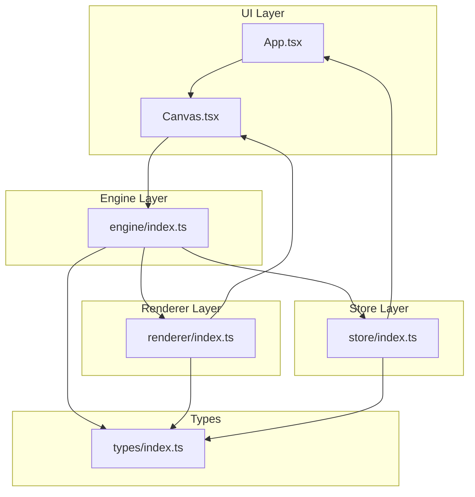
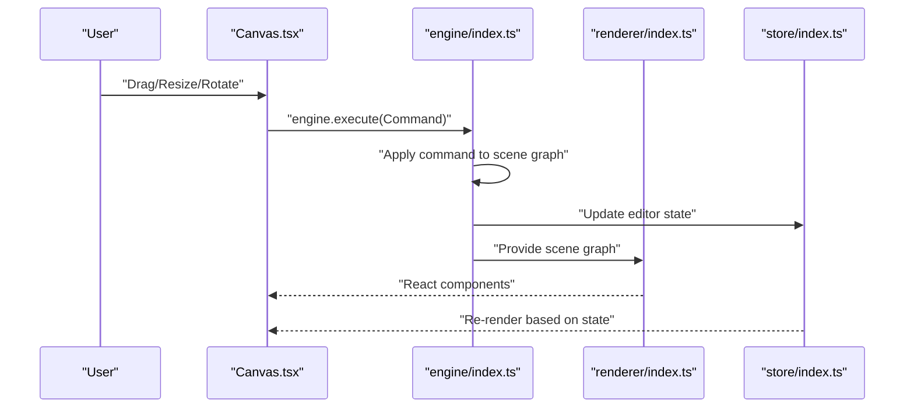
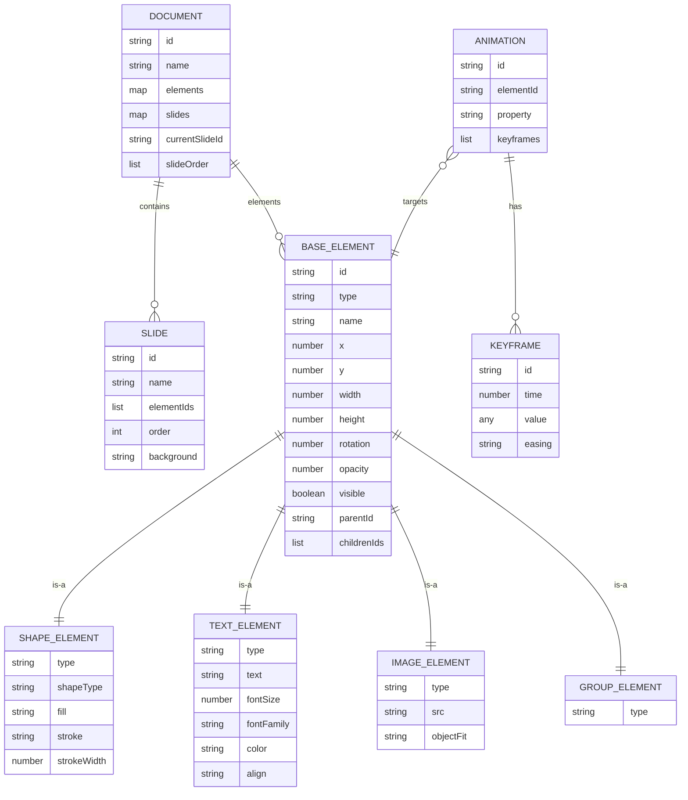
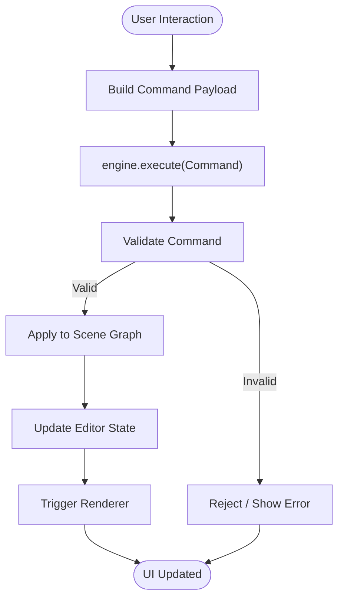
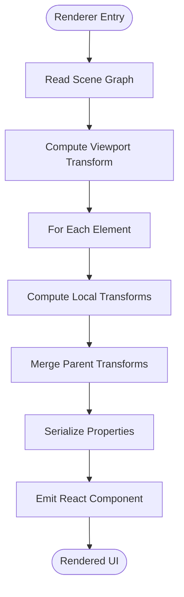
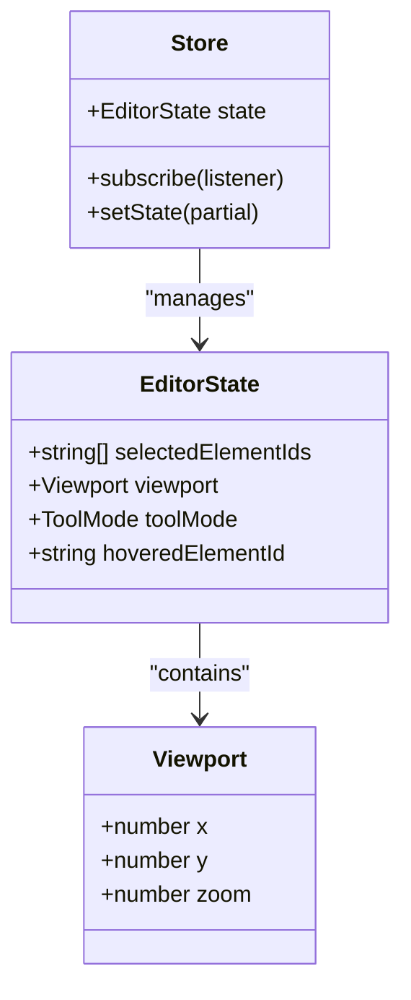
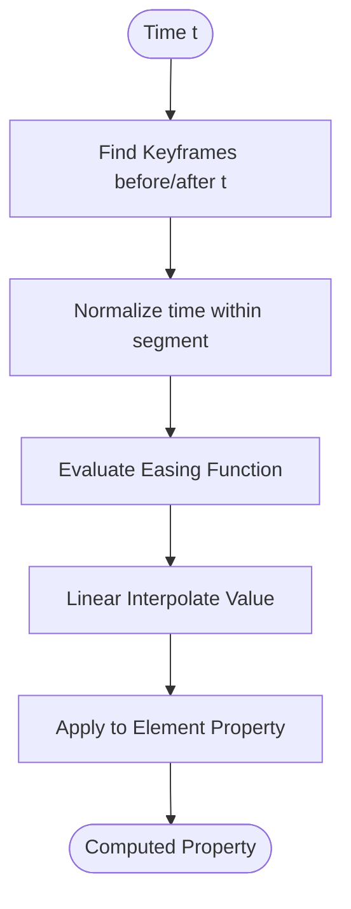
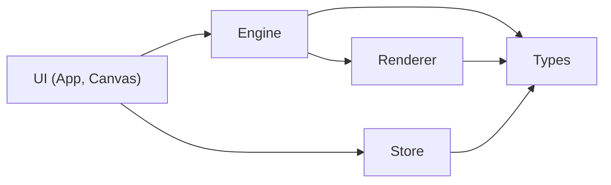

# Data Flow Patterns

<cite>
**Referenced Files in This Document**
- [engine/index.ts](file://src/engine/index.ts)
- [renderer/index.ts](file://src/renderer/index.ts)
- [store/index.ts](file://src/store/index.ts)
- [types/index.ts](file://src/types/index.ts)
- [App.tsx](file://src/App.tsx)
- [Canvas.tsx](file://src/components/Canvas.tsx)
- [main.tsx](file://src/main.tsx)
- [spec.md](file://spec.md)
- [spec1.md](file://spec1.md)
- [package.json](file://package.json)
</cite>

## Table of Contents
1. [Introduction](#introduction)
2. [Project Structure](#project-structure)
3. [Core Components](#core-components)
4. [Architecture Overview](#architecture-overview)
5. [Detailed Component Analysis](#detailed-component-analysis)
6. [Dependency Analysis](#dependency-analysis)
7. [Performance Considerations](#performance-considerations)
8. [Troubleshooting Guide](#troubleshooting-guide)
9. [Conclusion](#conclusion)

## Introduction
This document explains the data flow patterns in the AI Editor Engine system. It focuses on the unidirectional flow from user interactions to engine.execute(), through the scene graph to the renderer, and finally to UI updates driven by the store. It also covers typical transformations such as coordinate transforms, animation keyframe interpolation, and property serialization, along with performance considerations for large datasets.

## Project Structure
The project follows a layered architecture:
- UI layer: React components (App, Canvas)
- Engine layer: Core logic and state transitions via engine.execute()
- Renderer layer: Pure data-to-UI transformations
- Store layer: Editor state (viewport, selection, tool mode)
- Types: Shared data models for documents, slides, elements, animations, and editor state

**Diagram sources**
- [App.tsx:1-17](file://src/App.tsx#L1-L17)
- [Canvas.tsx:1-40](file://src/components/Canvas.tsx#L1-L40)
- [engine/index.ts:1-3](file://src/engine/index.ts#L1-L3)
- [renderer/index.ts:1-3](file://src/renderer/index.ts#L1-L3)
- [store/index.ts:1-2](file://src/store/index.ts#L1-L2)
- [types/index.ts:1-229](file://src/types/index.ts#L1-L229)

**Section sources**
- [App.tsx:1-17](file://src/App.tsx#L1-L17)
- [Canvas.tsx:1-40](file://src/components/Canvas.tsx#L1-L40)
- [engine/index.ts:1-3](file://src/engine/index.ts#L1-L3)
- [renderer/index.ts:1-3](file://src/renderer/index.ts#L1-L3)
- [store/index.ts:1-2](file://src/store/index.ts#L1-L2)
- [types/index.ts:1-229](file://src/types/index.ts#L1-L229)

## Core Components
- Scene Graph and Data Models: Documents, Slides, Elements, Animations, and Keyframes define the immutable scene graph. These types are used by the engine and renderer to compute UI state deterministically.
- Editor State: Separate from scene data, editor state includes viewport, tool mode, selection, and hover state. It is managed by the store and influences UI behavior.
- Engine.execute: Central command processor that applies validated commands to update the scene graph and editor state.
- Renderer: Pure function layer that converts scene graph data into UI components.
- Store: Manages editor state and triggers re-renders in response to state changes.

Typical transformations:
- Coordinate transforms: Apply viewport zoom/pan and element transforms (position, rotation, scale) to derive screen coordinates.
- Animation keyframe interpolation: Compute property values at a given time using easing curves and keyframe sequences.
- Property serialization: Convert typed properties into DOM attributes or inline styles for rendering.

**Section sources**
- [types/index.ts:1-229](file://src/types/index.ts#L1-L229)
- [engine/index.ts:1-3](file://src/engine/index.ts#L1-L3)
- [renderer/index.ts:1-3](file://src/renderer/index.ts#L1-L3)
- [store/index.ts:1-2](file://src/store/index.ts#L1-L2)

## Architecture Overview
The system enforces a strict unidirectional data flow:
- User interactions occur in the UI layer (Canvas).
- Interactions are translated into commands and passed to engine.execute().
- engine.execute() updates the scene graph and editor state immutably.
- Renderer consumes the scene graph and produces UI components.
- Store holds editor state and drives UI behavior (selection, viewport, tool mode).
- UI re-renders in response to store updates.

**Diagram sources**
- [Canvas.tsx:1-40](file://src/components/Canvas.tsx#L1-L40)
- [engine/index.ts:1-3](file://src/engine/index.ts#L1-L3)
- [renderer/index.ts:1-3](file://src/renderer/index.ts#L1-L3)
- [store/index.ts:1-2](file://src/store/index.ts#L1-L2)

## Detailed Component Analysis

### Scene Graph Data Flow
The scene graph is the single source of truth for content and layout:
- Document defines elements and slides.
- Elements carry geometry, appearance, and hierarchy metadata.
- Animations define time-based property changes keyed by time and easing.

**Diagram sources**
- [types/index.ts:57-111](file://src/types/index.ts#L57-L111)
- [types/index.ts:117-219](file://src/types/index.ts#L117-L219)

**Section sources**
- [types/index.ts:57-111](file://src/types/index.ts#L57-L111)
- [types/index.ts:117-219](file://src/types/index.ts#L117-L219)

### Engine.execute() Flow
engine.execute() is the sole entry point for state mutations:
- Accepts a command with a payload describing the change.
- Applies the command to update the scene graph and editor state.
- Ensures immutability and consistency across updates.

**Diagram sources**
- [engine/index.ts:1-3](file://src/engine/index.ts#L1-L3)
- [spec1.md:114-129](file://spec1.md#L114-L129)

**Section sources**
- [engine/index.ts:1-3](file://src/engine/index.ts#L1-L3)
- [spec1.md:114-129](file://spec1.md#L114-L129)

### Renderer Flow
The renderer converts scene graph data into UI components:
- Receives the scene graph and current editor state.
- Computes transforms (position, rotation, scale) and applies viewport adjustments.
- Produces React components representing shapes, text, images, and groups.

**Diagram sources**
- [renderer/index.ts:1-3](file://src/renderer/index.ts#L1-L3)
- [types/index.ts:9-51](file://src/types/index.ts#L9-L51)
- [spec1.md:149-162](file://spec1.md#L149-L162)

**Section sources**
- [renderer/index.ts:1-3](file://src/renderer/index.ts#L1-L3)
- [types/index.ts:9-51](file://src/types/index.ts#L9-L51)
- [spec1.md:149-162](file://spec1.md#L149-L162)

### Store and Editor State
Editor state is separated from scene data and governs UI behavior:
- Includes selected elements, viewport, tool mode, and hover state.
- Drives UI behavior such as selection highlights, pan/zoom overlays, and active tool visuals.

**Diagram sources**
- [types/index.ts:98-111](file://src/types/index.ts#L98-L111)
- [store/index.ts:1-2](file://src/store/index.ts#L1-L2)

**Section sources**
- [types/index.ts:98-111](file://src/types/index.ts#L98-L111)
- [store/index.ts:1-2](file://src/store/index.ts#L1-L2)

### Animation Keyframe Interpolation
Animations are time-driven and computed per element:
- Each animation targets a property and contains ordered keyframes.
- At a given time, interpolate between keyframes using easing functions to compute the property value.

**Diagram sources**
- [types/index.ts:80-92](file://src/types/index.ts#L80-L92)
- [types/index.ts:198-219](file://src/types/index.ts#L198-L219)
- [spec.md:261-267](file://spec.md#L261-L267)

**Section sources**
- [types/index.ts:80-92](file://src/types/index.ts#L80-L92)
- [types/index.ts:198-219](file://src/types/index.ts#L198-L219)
- [spec.md:261-267](file://spec.md#L261-L267)

### Typical Data Transformations
- Coordinate transforms: Combine parent transforms with local transforms to compute absolute positions and bounding boxes.
- Property serialization: Convert typed properties (colors, fonts, sizes) into DOM attributes or inline styles.
- Animation evaluation: Evaluate keyframes and easing curves to compute continuous property values over time.

**Section sources**
- [types/index.ts:9-51](file://src/types/index.ts#L9-L51)
- [types/index.ts:80-92](file://src/types/index.ts#L80-L92)

## Dependency Analysis
The system maintains clear separation of concerns:
- UI depends on Canvas and App; Canvas renders placeholder content while engine and store orchestrate state.
- Engine depends on types for scene graph and editor state definitions.
- Renderer depends on types for element and animation models.
- Store depends on types for editor state and exposes subscription mechanisms.

**Diagram sources**
- [App.tsx:1-17](file://src/App.tsx#L1-L17)
- [Canvas.tsx:1-40](file://src/components/Canvas.tsx#L1-L40)
- [engine/index.ts:1-3](file://src/engine/index.ts#L1-L3)
- [renderer/index.ts:1-3](file://src/renderer/index.ts#L1-L3)
- [store/index.ts:1-2](file://src/store/index.ts#L1-L2)
- [types/index.ts:1-229](file://src/types/index.ts#L1-L229)

**Section sources**
- [App.tsx:1-17](file://src/App.tsx#L1-L17)
- [Canvas.tsx:1-40](file://src/components/Canvas.tsx#L1-L40)
- [engine/index.ts:1-3](file://src/engine/index.ts#L1-L3)
- [renderer/index.ts:1-3](file://src/renderer/index.ts#L1-L3)
- [store/index.ts:1-2](file://src/store/index.ts#L1-L2)
- [types/index.ts:1-229](file://src/types/index.ts#L1-L229)

## Performance Considerations
- Minimize re-renders: Keep UI components pure and memoized; pass only necessary props derived from the store.
- Efficient scene graph traversal: Use id-based references and avoid deep cloning; compute transforms incrementally.
- Animation performance: Use requestAnimationFrame and batch property updates; precompute easing curves when possible.
- Large datasets: Virtualize lists and canvases; cull off-screen elements; lazy-load assets (images).
- Store updates: Batch editor state changes to reduce UI churn; debounce viewport updates during pan/zoom.

[No sources needed since this section provides general guidance]

## Troubleshooting Guide
Common issues and remedies:
- Stale UI after interaction: Ensure engine.execute() is called and the store is updated; verify renderer receives the latest scene graph.
- Incorrect transforms: Validate parent-child hierarchy and transform accumulation order.
- Animation glitches: Confirm keyframe ordering and easing continuity; clamp time to animation bounds.
- Performance regressions: Profile render cycles and optimize heavy computations outside the render loop.

**Section sources**
- [engine/index.ts:1-3](file://src/engine/index.ts#L1-L3)
- [renderer/index.ts:1-3](file://src/renderer/index.ts#L1-L3)
- [store/index.ts:1-2](file://src/store/index.ts#L1-L2)

## Conclusion
The AI Editor Engine enforces a clean, unidirectional data flow: user interactions enter through the UI, are processed by engine.execute(), and propagate through the scene graph to the renderer, which emits UI components. The store manages editor state separately, enabling predictable UI behavior. By adhering to pure rendering, time-driven animations, and efficient transformations, the system remains scalable and responsive even with large datasets.