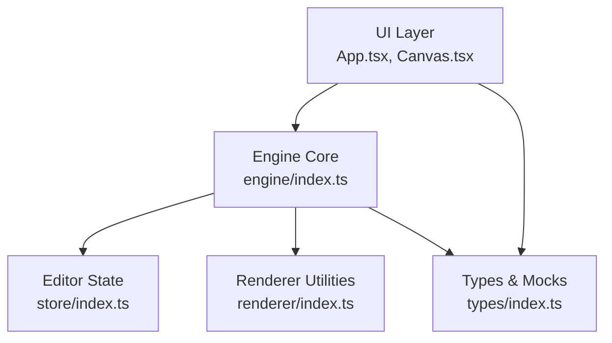
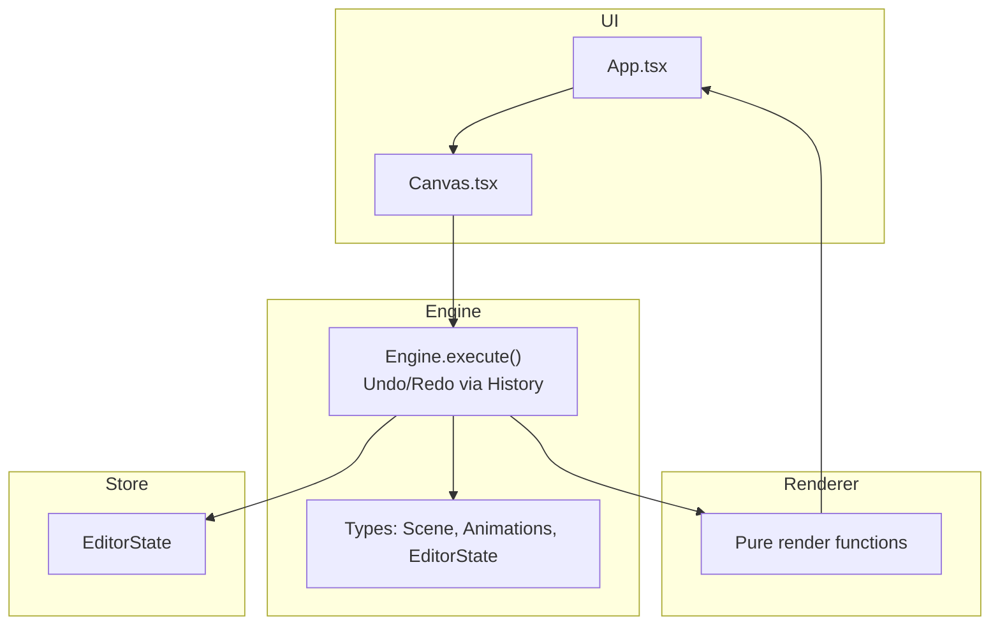
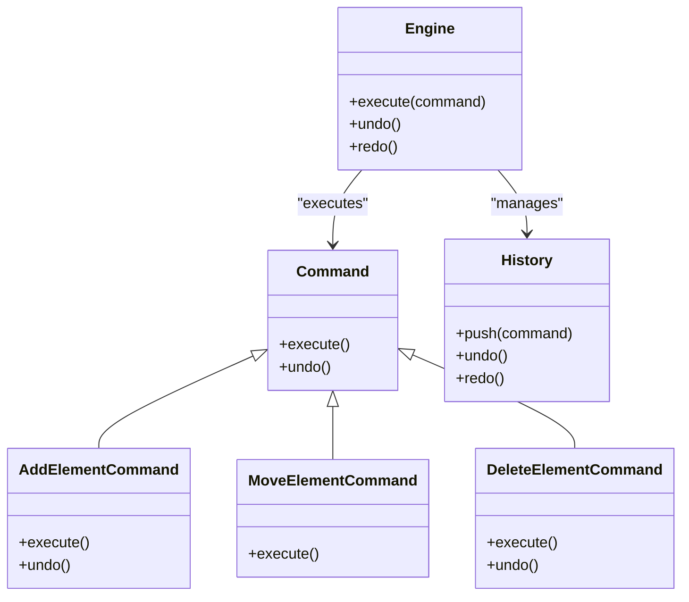
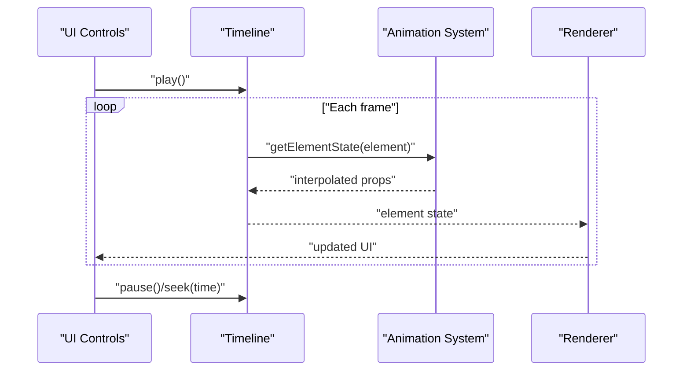
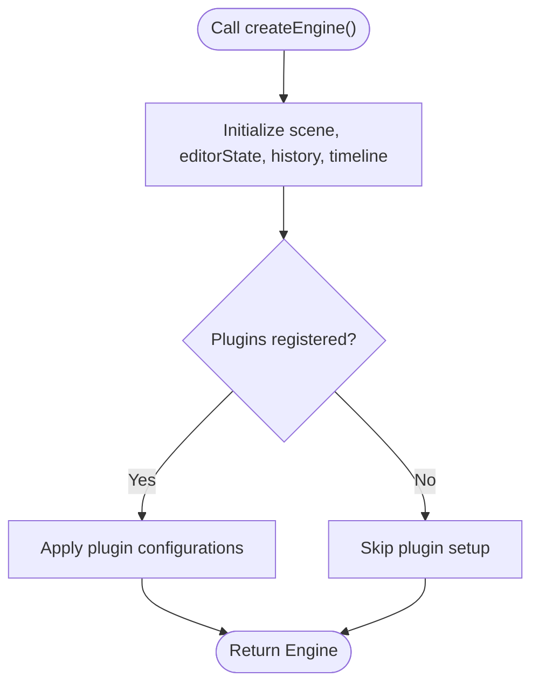
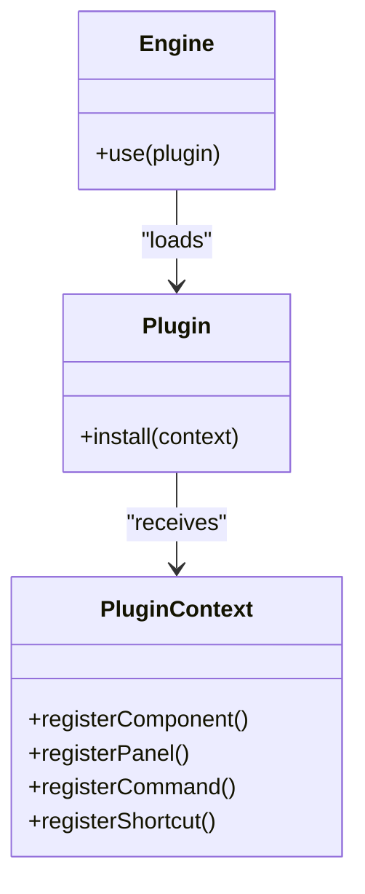
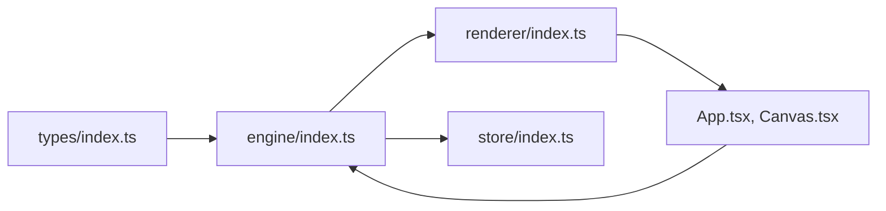

# Design Patterns and Principles

<cite>
**Referenced Files in This Document**
- [engine/index.ts](file://src/engine/index.ts)
- [renderer/index.ts](file://src/renderer/index.ts)
- [store/index.ts](file://src/store/index.ts)
- [types/index.ts](file://src/types/index.ts)
- [App.tsx](file://src/App.tsx)
- [Canvas.tsx](file://src/components/Canvas.tsx)
- [spec.md](file://spec.md)
- [spec1.md](file://spec1.md)
</cite>

## Table of Contents
1. [Introduction](#introduction)
2. [Project Structure](#project-structure)
3. [Core Components](#core-components)
4. [Architecture Overview](#architecture-overview)
5. [Detailed Component Analysis](#detailed-component-analysis)
6. [Dependency Analysis](#dependency-analysis)
7. [Performance Considerations](#performance-considerations)
8. [Troubleshooting Guide](#troubleshooting-guide)
9. [Conclusion](#conclusion)

## Introduction
This document explains the design patterns and architectural principles underpinning the AI Editor Engine. It focuses on:
- Command pattern for state management and undo/redo
- Observer pattern for timeline-driven animations
- Factory pattern for engine instantiation
- Plugin architecture for extensibility

These patterns collectively enable a framework-agnostic engine, a clean separation of concerns, and a maintainable, extensible codebase. Concrete examples are drawn from the specification documents and type definitions to illustrate how features like undo/redo, animation playback, and plugin integration are achieved.

## Project Structure
The project is organized into clear layers:
- Engine: Core state machine and orchestration (framework-agnostic)
- Renderer: Pure data-to-UI transformations
- Store: Editor state separate from scene data
- Types: Shared type definitions and mock data
- UI: Minimal React shell around the engine

**Diagram sources**
- [engine/index.ts:1-3](file://src/engine/index.ts#L1-L3)
- [renderer/index.ts:1-3](file://src/renderer/index.ts#L1-L3)
- [store/index.ts:1-2](file://src/store/index.ts#L1-L2)
- [types/index.ts:1-229](file://src/types/index.ts#L1-L229)
- [App.tsx:1-17](file://src/App.tsx#L1-L17)
- [Canvas.tsx:1-40](file://src/components/Canvas.tsx#L1-L40)

**Section sources**
- [engine/index.ts:1-3](file://src/engine/index.ts#L1-L3)
- [renderer/index.ts:1-3](file://src/renderer/index.ts#L1-L3)
- [store/index.ts:1-2](file://src/store/index.ts#L1-L2)
- [types/index.ts:1-229](file://src/types/index.ts#L1-L229)
- [App.tsx:1-17](file://src/App.tsx#L1-L17)
- [Canvas.tsx:1-40](file://src/components/Canvas.tsx#L1-L40)

## Core Components
- Engine: Central orchestrator enforcing single-source-of-truth updates via commands and exposing undo/redo via a history subsystem. See [engine/index.ts:1-3](file://src/engine/index.ts#L1-L3) and [spec1.md:98-111](file://spec1.md#L98-L111).
- Renderer: Pure functions mapping scene data to UI elements. See [renderer/index.ts:1-3](file://src/renderer/index.ts#L1-L3) and [spec1.md:149-163](file://spec1.md#L149-L163).
- Store: Editor state (viewport, selection, tool mode) decoupled from scene graph. See [store/index.ts:1-2](file://src/store/index.ts#L1-L2) and [types/index.ts:95-112](file://src/types/index.ts#L95-L112).
- Types: Strongly-typed scene graph, animations, and editor state. See [types/index.ts:1-229](file://src/types/index.ts#L1-L229).

Benefits:
- Framework-agnostic engine ensures portability across UI frameworks.
- Separation of scene data and editor state simplifies testing and state synchronization.
- Clear boundaries enable incremental feature development and plugin extensibility.

Trade-offs:
- Requires disciplined adherence to command execution for all state changes.
- Pure rendering increases testability but demands explicit prop passing.

**Section sources**
- [engine/index.ts:1-3](file://src/engine/index.ts#L1-L3)
- [renderer/index.ts:1-3](file://src/renderer/index.ts#L1-L3)
- [store/index.ts:1-2](file://src/store/index.ts#L1-L2)
- [types/index.ts:1-229](file://src/types/index.ts#L1-L229)
- [spec1.md:98-111](file://spec1.md#L98-L111)
- [spec1.md:149-163](file://spec1.md#L149-L163)

## Architecture Overview
The engine acts as the central authority for all state mutations. UI interactions call into the engine to schedule commands. The renderer consumes immutable scene data to produce UI. Timeline drives animation playback independently of UI lifecycle hooks.

**Diagram sources**
- [engine/index.ts:1-3](file://src/engine/index.ts#L1-L3)
- [renderer/index.ts:1-3](file://src/renderer/index.ts#L1-L3)
- [store/index.ts:1-2](file://src/store/index.ts#L1-L2)
- [types/index.ts:1-229](file://src/types/index.ts#L1-L229)
- [App.tsx:1-17](file://src/App.tsx#L1-L17)
- [Canvas.tsx:1-40](file://src/components/Canvas.tsx#L1-L40)

## Detailed Component Analysis

### Command Pattern for State Management and Undo/Redo
The command pattern encapsulates state changes as executable units with reversible actions. The engine’s execute method applies commands and pushes them onto a history stack for undo/redo.

Key elements:
- Command contract: execute and undo methods. See [spec1.md:114-130](file://spec1.md#L114-L130).
- Commands implemented: add, move, delete elements. See [spec1.md:114-130](file://spec1.md#L114-L130).
- Payloads include prev/next snapshots to enable precise reversions. See [spec1.md:128](file://spec1.md#L128).
- History stack manages past/future states. See [spec1.md:133-146](file://spec1.md#L133-L146).
- Engine enforces single-source-of-truth updates via execute. See [engine/index.ts:1-3](file://src/engine/index.ts#L1-L3) and [spec1.md:32](file://spec1.md#L32).

How it enables undo/redo:
- Each user action is a command. On success, the command is pushed to history.
- Undo pops the last command and invokes its undo method; redo replays the next command.
- Payloads capture before/after states to restore accurately.

Benefits:
- Predictable state transitions and deterministic UI updates.
- Easy to audit and replay sequences.

Trade-offs:
- Slightly higher boilerplate to define commands.
- Requires snapshotting relevant state for reversible operations.

**Diagram sources**
- [spec1.md:114-146](file://spec1.md#L114-L146)
- [engine/index.ts:1-3](file://src/engine/index.ts#L1-L3)

**Section sources**
- [spec1.md:114-146](file://spec1.md#L114-L146)
- [engine/index.ts:1-3](file://src/engine/index.ts#L1-L3)

### Observer Pattern for Timeline Animations
The timeline system observes time progression and computes element states by interpolating keyframes. This is a time-driven observer model: the timeline emits state updates at each frame.

Key elements:
- Timeline maintains currentTime and exposes play/pause/seek. See [spec1.md:184-198](file://spec1.md#L184-L198).
- getElementState(element) computes interpolated properties at current time. See [spec1.md:194](file://spec1.md#L194).
- Keyframe interpolation produces smooth transitions. See [spec1.md:195](file://spec1.md#L195).
- Uses requestAnimationFrame for efficient frame scheduling. See [spec1.md:196](file://spec1.md#L196).

Benefits:
- Decouples animation from component lifecycles.
- Enables precise scrubbing and synchronized playback.

Trade-offs:
- Requires careful management of animation lifetimes and cleanup.
- Interpolation cost scales with number of animated properties.

**Diagram sources**
- [spec1.md:184-198](file://spec1.md#L184-L198)

**Section sources**
- [spec1.md:184-198](file://spec1.md#L184-L198)

### Factory Pattern for Engine Instantiation
A factory creates configured engine instances, ensuring consistent initialization and optional plugin registration.

Key elements:
- createEngine() factory function. See [spec1.md:109](file://spec1.md#L109).
- Engine includes scene, editorState, history, timeline. See [spec1.md:106-108](file://spec1.md#L106-L108).

Benefits:
- Encapsulates engine setup and default wiring.
- Simplifies testing with reproducible engine instances.

Trade-offs:
- Adds indirection; requires careful plugin contract design.

**Diagram sources**
- [spec1.md:109](file://spec1.md#L109)
- [spec1.md:106-108](file://spec1.md#L106-L108)

**Section sources**
- [spec1.md:106-109](file://spec1.md#L106-L109)

### Plugin Architecture for Extensibility
The plugin system allows registering new components, panels, commands, and shortcuts into a centralized registry. The engine exposes engine.use(plugin) to integrate platform capabilities.

Key elements:
- engine.use(plugin) integrates plugins. See [spec1.md:227](file://spec1.md#L227).
- Registry supports components, panels, commands, shortcuts. See [spec1.md:228-229](file://spec1.md#L228-L229).
- PluginContext provides access to engine APIs. See [spec1.md:230](file://spec1.md#L230).
- Example plugin registers a Video component, a panel, and a delete shortcut. See [spec1.md:231-235](file://spec1.md#L231-L235).

Benefits:
- Keeps core engine minimal while enabling rich platform features.
- Promotes modularity and team collaboration on extensions.

Trade-offs:
- Requires robust plugin contracts and versioning strategies.
- Risk of conflicting registrations; needs careful conflict resolution.

**Diagram sources**
- [spec1.md:227-235](file://spec1.md#L227-L235)

**Section sources**
- [spec1.md:227-235](file://spec1.md#L227-L235)

### How Patterns Work Together
- Command pattern centralizes state changes, ensuring the engine remains the single source of truth. This guarantees predictable outcomes for undo/redo and simplifies synchronization with external systems.
- Observer pattern (timeline) drives animation updates independently of UI, enabling smooth playback and scrubbing without relying on component lifecycle hooks.
- Factory pattern standardizes engine creation, making it easy to bootstrap environments and inject plugins consistently.
- Plugin architecture extends functionality without touching core engine code, preserving cohesion and reducing coupling.

Concrete examples:
- Undo/redo: All edits are commands; history stacks them for reversal. See [spec1.md:114-146](file://spec1.md#L114-L146).
- Animation playback: Timeline computes element states per frame; renderer renders the pure output. See [spec1.md:184-198](file://spec1.md#L184-L198).
- Plugin integration: engine.use(plugin) registers new commands and UI panels. See [spec1.md:227-235](file://spec1.md#L227-L235).

**Section sources**
- [spec1.md:114-146](file://spec1.md#L114-L146)
- [spec1.md:184-198](file://spec1.md#L184-L198)
- [spec1.md:227-235](file://spec1.md#L227-L235)

## Dependency Analysis
The engine depends on types for scene graph and animations, and on the renderer for UI output. The store holds editor state separate from scene data. UI components depend on the engine for state changes and on the renderer for presentation.

**Diagram sources**
- [types/index.ts:1-229](file://src/types/index.ts#L1-L229)
- [engine/index.ts:1-3](file://src/engine/index.ts#L1-L3)
- [renderer/index.ts:1-3](file://src/renderer/index.ts#L1-L3)
- [store/index.ts:1-2](file://src/store/index.ts#L1-L2)
- [App.tsx:1-17](file://src/App.tsx#L1-L17)
- [Canvas.tsx:1-40](file://src/components/Canvas.tsx#L1-L40)

**Section sources**
- [types/index.ts:1-229](file://src/types/index.ts#L1-L229)
- [engine/index.ts:1-3](file://src/engine/index.ts#L1-L3)
- [renderer/index.ts:1-3](file://src/renderer/index.ts#L1-L3)
- [store/index.ts:1-2](file://src/store/index.ts#L1-L2)
- [App.tsx:1-17](file://src/App.tsx#L1-L17)
- [Canvas.tsx:1-40](file://src/components/Canvas.tsx#L1-L40)

## Performance Considerations
- Command pattern: Snapshotting large scenes can be expensive. Consider selective snapshots (delta payloads) and lazy evaluation of undo/redo stacks.
- Timeline: Interpolate only visible or animated elements; batch updates to minimize re-renders.
- Renderer: Keep render functions pure and memoized; avoid layout thrashing by batching DOM writes.
- Plugin system: Load-time checks and lazy registration reduce startup overhead.

## Troubleshooting Guide
Common issues and remedies:
- Violating single-source-of-truth: Ensure all state changes pass through engine.execute(command). See [engine/index.ts:1-3](file://src/engine/index.ts#L1-L3) and [spec1.md:32](file://spec1.md#L32).
- Incorrect undo/redo behavior: Verify command payloads include prev/next snapshots. See [spec1.md:128](file://spec1.md#L128).
- Animation desync: Confirm timeline uses requestAnimationFrame and interpolates keyframes correctly. See [spec1.md:196](file://spec1.md#L196).
- Plugin conflicts: Use unique registry keys and validate plugin contracts during installation. See [spec1.md:227-235](file://spec1.md#L227-L235).

**Section sources**
- [engine/index.ts:1-3](file://src/engine/index.ts#L1-L3)
- [spec1.md:32](file://spec1.md#L32)
- [spec1.md:128](file://spec1.md#L128)
- [spec1.md:196](file://spec1.md#L196)
- [spec1.md:227-235](file://spec1.md#L227-L235)

## Conclusion
By combining the command pattern, observer pattern, factory pattern, and plugin architecture, the AI Editor Engine achieves a framework-agnostic, maintainable, and extensible design. These patterns ensure predictable state transitions, smooth animation playback, and a robust extension mechanism—enabling features like undo/redo, timeline-driven animations, and plugin integration while keeping the core engine focused and testable.