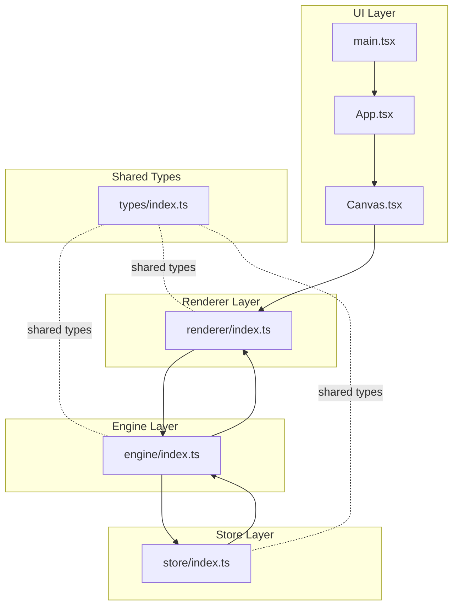
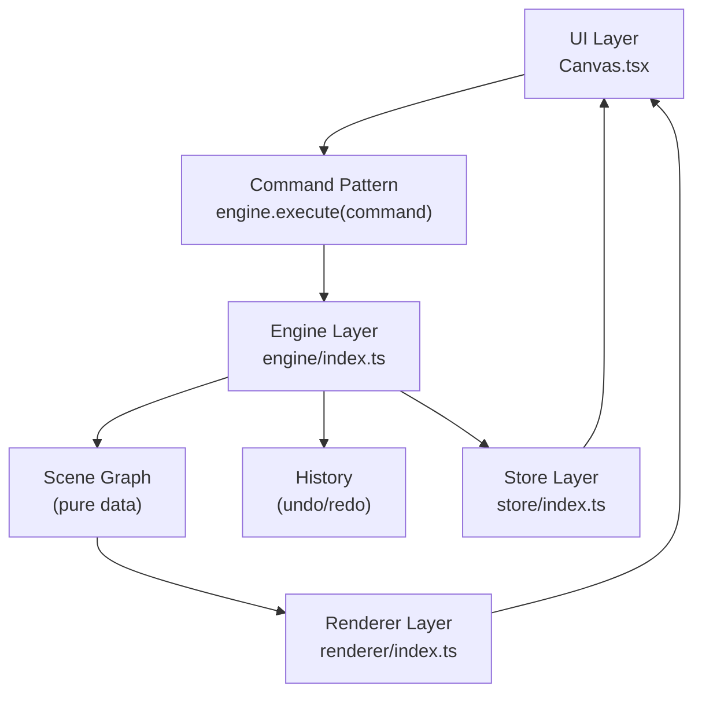
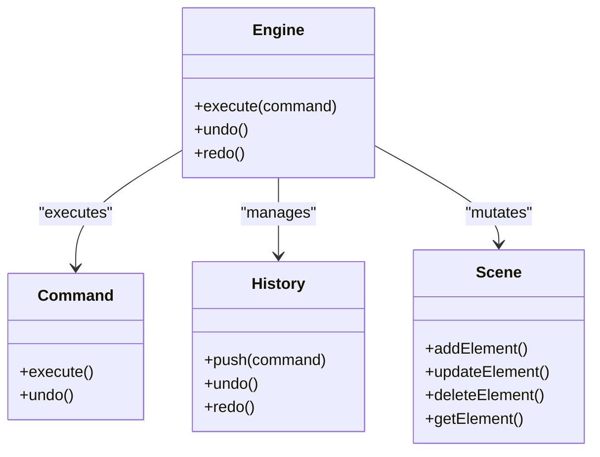
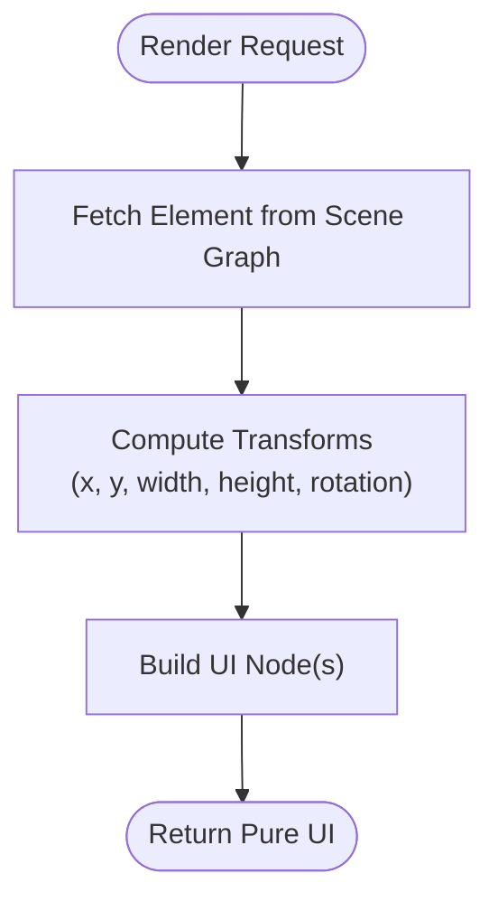
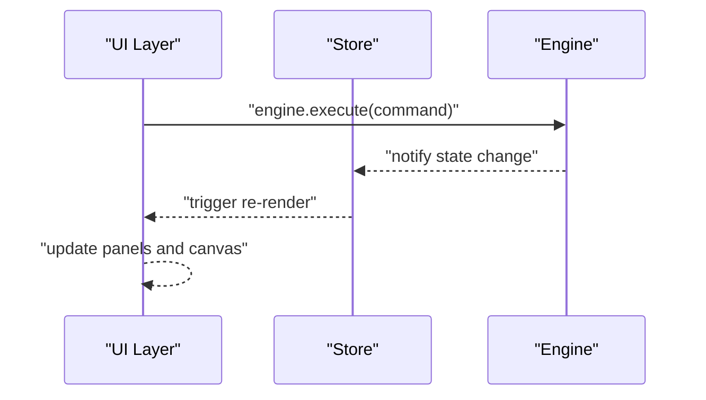
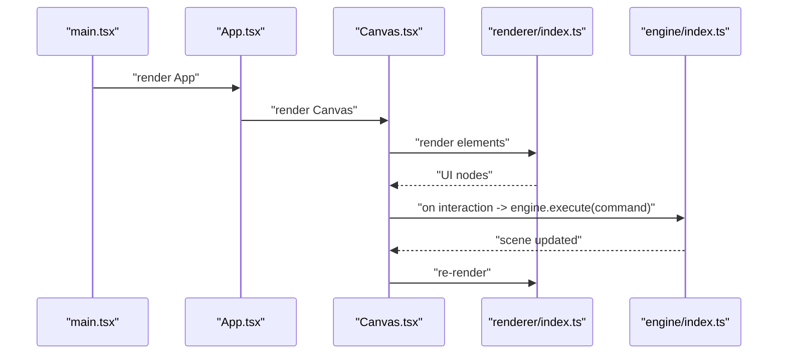
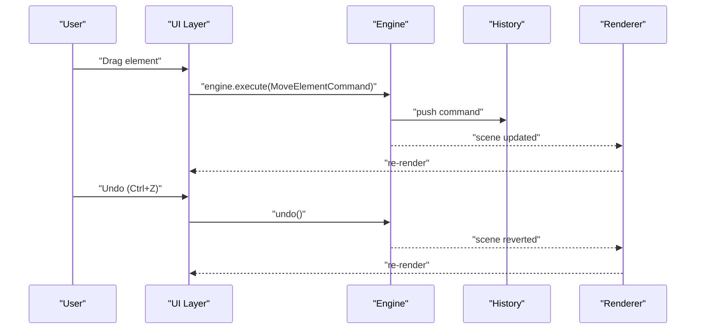
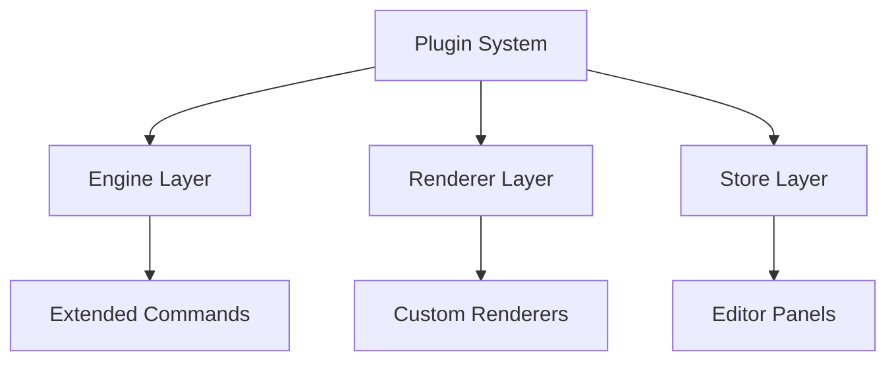
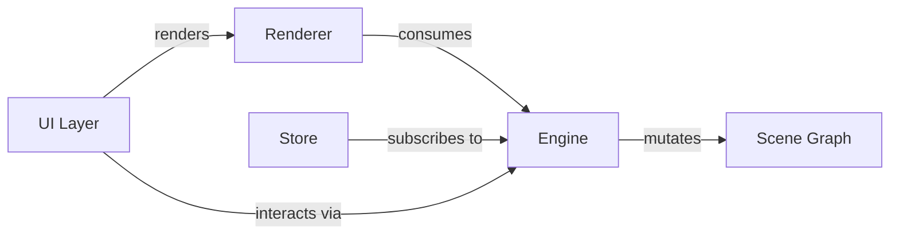
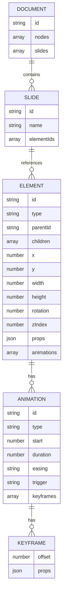

# Layered Architecture Design

<cite>
**Referenced Files in This Document**
- [engine/index.ts](file://src/engine/index.ts)
- [renderer/index.ts](file://src/renderer/index.ts)
- [store/index.ts](file://src/store/index.ts)
- [App.tsx](file://src/App.tsx)
- [main.tsx](file://src/main.tsx)
- [Canvas.tsx](file://src/components/Canvas.tsx)
- [types/index.ts](file://src/types/index.ts)
- [spec.md](file://spec.md)
- [spec1.md](file://spec1.md)
- [package.json](file://package.json)
</cite>

## Table of Contents
1. [Introduction](#introduction)
2. [Project Structure](#project-structure)
3. [Core Components](#core-components)
4. [Architecture Overview](#architecture-overview)
5. [Detailed Component Analysis](#detailed-component-analysis)
6. [Dependency Analysis](#dependency-analysis)
7. [Performance Considerations](#performance-considerations)
8. [Troubleshooting Guide](#troubleshooting-guide)
9. [Conclusion](#conclusion)
10. [Appendices](#appendices)

## Introduction
This document explains the layered architecture design of the AI Editor Engine with a focus on three distinct layers:
- Engine: framework-agnostic core logic that manages state transitions and enforces a single source of truth via the command pattern.
- Renderer: pure data-to-UI transformation utilities that convert scene graph data into UI elements without mutating state.
- Store: editor state management separate from scene data, enabling framework-specific state containers while keeping the engine independent.

The document also documents how each layer maintains clear responsibilities, communicates with adjacent layers, and how the command pattern enforces single source of truth. It further explains how plugins integrate across layers and outlines the benefits of this separation, including testability, maintainability, and framework independence.

## Project Structure
The project follows a clear folder-based separation aligned with the layered architecture:
- src/engine: core logic and state transitions
- src/renderer: pure rendering utilities
- src/store: editor state container
- src/components: UI components (React)
- src/types: shared TypeScript types
- Root entry points: App.tsx and main.tsx bootstrap the UI layer

**Diagram sources**
- [main.tsx:1-10](file://src/main.tsx#L1-L10)
- [App.tsx:1-17](file://src/App.tsx#L1-L17)
- [Canvas.tsx:1-40](file://src/components/Canvas.tsx#L1-L40)
- [engine/index.ts:1-3](file://src/engine/index.ts#L1-L3)
- [renderer/index.ts:1-3](file://src/renderer/index.ts#L1-L3)
- [store/index.ts:1-2](file://src/store/index.ts#L1-L2)
- [types/index.ts:1-2](file://src/types/index.ts#L1-L2)

**Section sources**
- [main.tsx:1-10](file://src/main.tsx#L1-L10)
- [App.tsx:1-17](file://src/App.tsx#L1-L17)
- [Canvas.tsx:1-40](file://src/components/Canvas.tsx#L1-L40)
- [engine/index.ts:1-3](file://src/engine/index.ts#L1-L3)
- [renderer/index.ts:1-3](file://src/renderer/index.ts#L1-L3)
- [store/index.ts:1-2](file://src/store/index.ts#L1-L2)
- [types/index.ts:1-2](file://src/types/index.ts#L1-L2)

## Core Components
- Engine layer
  - Purpose: Central state machine enforcing single source of truth via commands.
  - Responsibilities: State mutations occur exclusively through engine.execute(command); supports undo/redo via history.
  - Framework independence: No React or UI concerns; pure data operations.
- Renderer layer
  - Purpose: Pure transformations from scene graph data to UI elements.
  - Responsibilities: renderElement(element, engine) produces UI nodes; applies transforms; no state mutation.
  - Framework independence: Can target DOM, Canvas, or other renderers.
- Store layer
  - Purpose: Editor state management (distinct from scene data).
  - Responsibilities: Holds UI-focused state (selection, panels, timelines) and integrates with the engine.
  - Framework independence: Can be implemented with any state library; here React-based UI uses Zustand per spec.

Benefits of this separation:
- Testability: Engine and renderer are pure and composable; store can be mocked or swapped.
- Maintainability: Clear boundaries reduce cross-cutting concerns.
- Framework independence: Engine remains framework-agnostic; renderer can target different UI frameworks.

**Section sources**
- [engine/index.ts:1-3](file://src/engine/index.ts#L1-L3)
- [renderer/index.ts:1-3](file://src/renderer/index.ts#L1-L3)
- [store/index.ts:1-2](file://src/store/index.ts#L1-L2)
- [spec.md:393-401](file://spec.md#L393-L401)
- [spec.md:334-341](file://spec.md#L334-L341)

## Architecture Overview
The layered architecture ensures a unidirectional flow of control:
- UI layer triggers interactions.
- Interactions call into the engine via commands.
- Engine updates the scene graph and history.
- Renderer consumes the scene graph to produce UI updates.
- Store reflects editor state changes and orchestrates UI updates.

**Diagram sources**
- [Canvas.tsx:1-40](file://src/components/Canvas.tsx#L1-L40)
- [engine/index.ts:1-3](file://src/engine/index.ts#L1-L3)
- [renderer/index.ts:1-3](file://src/renderer/index.ts#L1-L3)
- [store/index.ts:1-2](file://src/store/index.ts#L1-L2)
- [spec1.md:32-41](file://spec1.md#L32-L41)

## Detailed Component Analysis

### Engine Layer
- Responsibilities
  - Single source of truth enforcement via engine.execute(command).
  - State mutations through commands; history management for undo/redo.
  - Framework-agnostic design; no React dependencies.
- Data structures and relationships
  - Scene graph forms the single source of truth; engine orchestrates operations on it.
  - Commands encapsulate state transitions with prev/next payloads.
- Error handling and edge cases
  - Invalid commands or out-of-order operations should be rejected by the engine.
  - History stacks must maintain consistent state for undo/redo.
- Performance implications
  - Pure operations enable easy memoization and immutable updates.
  - Minimizing re-renders by updating only changed nodes.

**Diagram sources**
- [engine/index.ts:1-3](file://src/engine/index.ts#L1-L3)
- [spec1.md:114-130](file://spec1.md#L114-L130)
- [spec1.md:133-146](file://spec1.md#L133-L146)
- [spec.md:41-134](file://spec.md#L41-L134)

**Section sources**
- [engine/index.ts:1-3](file://src/engine/index.ts#L1-L3)
- [spec1.md:32-41](file://spec1.md#L32-L41)
- [spec1.md:114-130](file://spec1.md#L114-L130)
- [spec1.md:133-146](file://spec1.md#L133-L146)
- [spec.md:41-134](file://spec.md#L41-L134)

### Renderer Layer
- Responsibilities
  - Pure data-to-UI transformations.
  - Supports shapes, images, text; applies transforms (position, size, rotation).
  - Future extensibility to Canvas renderer for playback optimization.
- Data flow
  - Receives element and engine context; computes UI representation without mutating state.
- Integration points
  - Consumes scene graph data produced by the engine.
  - UI layer renders the returned nodes.

**Diagram sources**
- [renderer/index.ts:1-3](file://src/renderer/index.ts#L1-L3)
- [spec.md:319-332](file://spec.md#L319-L332)

**Section sources**
- [renderer/index.ts:1-3](file://src/renderer/index.ts#L1-L3)
- [spec.md:319-332](file://spec.md#L319-L332)

### Store Layer
- Responsibilities
  - Maintains editor state separate from scene data (selection, panels, timelines).
  - Integrates with the engine to reflect state changes in the UI.
- Integration points
  - Subscribes to engine updates and triggers UI re-render.
  - Provides UI hooks for selection, property panels, and timeline controls.

**Diagram sources**
- [store/index.ts:1-2](file://src/store/index.ts#L1-L2)
- [engine/index.ts:1-3](file://src/engine/index.ts#L1-L3)

**Section sources**
- [store/index.ts:1-2](file://src/store/index.ts#L1-L2)
- [spec.md:334-341](file://spec.md#L334-L341)

### UI Layer and Canvas Integration
- The UI layer initializes the app and renders the canvas area.
- Canvas acts as the primary interaction surface; interactions call into the engine via commands.
- The renderer translates scene graph data into UI nodes for display.

**Diagram sources**
- [main.tsx:1-10](file://src/main.tsx#L1-L10)
- [App.tsx:1-17](file://src/App.tsx#L1-L17)
- [Canvas.tsx:1-40](file://src/components/Canvas.tsx#L1-L40)
- [renderer/index.ts:1-3](file://src/renderer/index.ts#L1-L3)
- [engine/index.ts:1-3](file://src/engine/index.ts#L1-L3)

**Section sources**
- [main.tsx:1-10](file://src/main.tsx#L1-L10)
- [App.tsx:1-17](file://src/App.tsx#L1-L17)
- [Canvas.tsx:1-40](file://src/components/Canvas.tsx#L1-L40)
- [renderer/index.ts:1-3](file://src/renderer/index.ts#L1-L3)
- [engine/index.ts:1-3](file://src/engine/index.ts#L1-L3)

### Command Pattern and Single Source of Truth
- Enforced by requiring all state changes to pass through engine.execute(command).
- Commands encapsulate state transitions with prev/next payloads for deterministic undo/redo.
- Benefits
  - Predictable state evolution.
  - Easy testing of individual commands.
  - Replayable actions for analytics or debugging.

**Diagram sources**
- [spec1.md:166-182](file://spec1.md#L166-L182)
- [spec1.md:114-130](file://spec1.md#L114-L130)
- [spec1.md:133-146](file://spec1.md#L133-L146)
- [spec.md:393-401](file://spec.md#L393-L401)

**Section sources**
- [spec1.md:32-41](file://spec1.md#L32-L41)
- [spec1.md:114-130](file://spec1.md#L114-L130)
- [spec1.md:133-146](file://spec1.md#L133-L146)
- [spec.md:393-401](file://spec.md#L393-L401)

### Plugins Integration Across Layers
- Plugin system allows registering components, panels, commands, and shortcuts.
- Integration points
  - Engine: engine.use(plugin) to extend capabilities.
  - Renderer: plugin-provided renderers or overlays.
  - Store: plugin-managed state or UI panels.
- Benefits
  - Extensibility without modifying core layers.
  - Encourages modular, reusable features.

**Diagram sources**
- [spec1.md:218-237](file://spec1.md#L218-L237)

**Section sources**
- [spec1.md:218-237](file://spec1.md#L218-L237)

## Dependency Analysis
- Coupling and cohesion
  - Engine is highly cohesive around state transitions and decoupled from UI concerns.
  - Renderer depends only on scene graph data; low coupling to UI framework.
  - Store depends on engine events; loose coupling via notifications.
- External dependencies
  - UI layer uses React and Zustand per spec.
  - Engine and renderer remain framework-agnostic.

**Diagram sources**
- [spec.md:334-341](file://spec.md#L334-L341)
- [engine/index.ts:1-3](file://src/engine/index.ts#L1-L3)
- [renderer/index.ts:1-3](file://src/renderer/index.ts#L1-L3)
- [store/index.ts:1-2](file://src/store/index.ts#L1-L2)

**Section sources**
- [spec.md:334-341](file://spec.md#L334-L341)
- [engine/index.ts:1-3](file://src/engine/index.ts#L1-L3)
- [renderer/index.ts:1-3](file://src/renderer/index.ts#L1-L3)
- [store/index.ts:1-2](file://src/store/index.ts#L1-L2)

## Performance Considerations
- Favor immutable updates in the engine to enable efficient change detection.
- Keep renderer pure to leverage memoization and avoid unnecessary re-renders.
- Use requestAnimationFrame-driven animations (as per spec) to minimize layout thrashing.
- Separate editor state from scene data to reduce re-render scope.

[No sources needed since this section provides general guidance]

## Troubleshooting Guide
Common issues and remedies:
- Direct DOM manipulation in UI components
  - Symptom: inconsistent state after manual DOM changes.
  - Fix: route all edits through engine.execute(command).
- Mixed editor state and scene data
  - Symptom: hard-to-track UI glitches.
  - Fix: keep editor state in store and scene data in engine.
- Non-pure renderer
  - Symptom: unpredictable UI updates.
  - Fix: ensure renderer is a pure function mapping data to UI nodes.

**Section sources**
- [spec1.md:15-19](file://spec1.md#L15-L19)
- [spec1.md:32-41](file://spec1.md#L32-L41)
- [spec.md:393-401](file://spec.md#L393-L401)

## Conclusion
The layered architecture cleanly separates concerns across engine, renderer, and store, enforcing a single source of truth via the command pattern. This design yields improved testability, maintainability, and framework independence. Plugins integrate seamlessly across layers, and the separation of editor state from scene data simplifies state management. Together, these patterns form a robust foundation for a scalable, extensible editor engine.

[No sources needed since this section summarizes without analyzing specific files]

## Appendices

### A. Data Model Overview
The scene graph underpins the engine and renderer:
- Document, Slide, Element, Animation, Keyframe
- Elements stored as a flat map keyed by id; children use id references
- Pure data operations in engine; renderer applies transforms

**Diagram sources**
- [spec.md:47-134](file://spec.md#L47-L134)

**Section sources**
- [spec.md:47-134](file://spec.md#L47-L134)

### B. Technology Stack Alignment
- UI: React
- State management: Zustand
- Drag/transform: react-moveable
- Animation: requestAnimationFrame
- Path rendering: SVG

**Section sources**
- [spec.md:334-341](file://spec.md#L334-L341)
- [package.json:12-26](file://package.json#L12-L26)