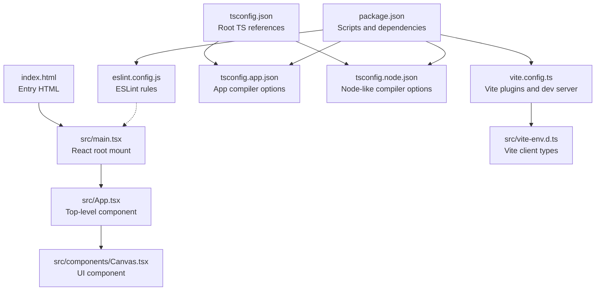
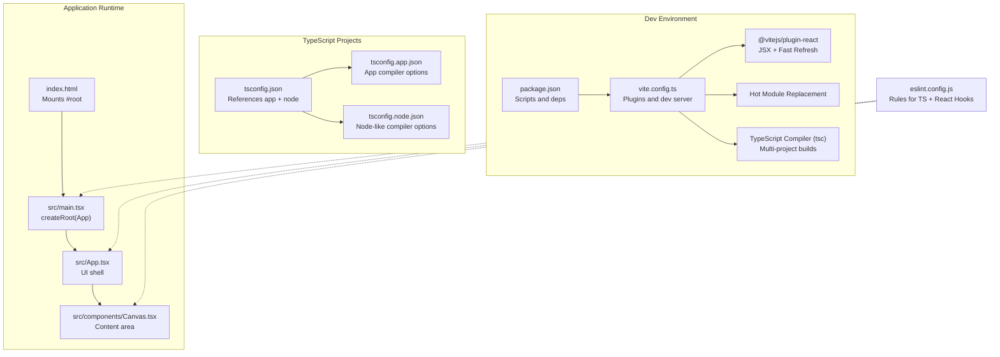
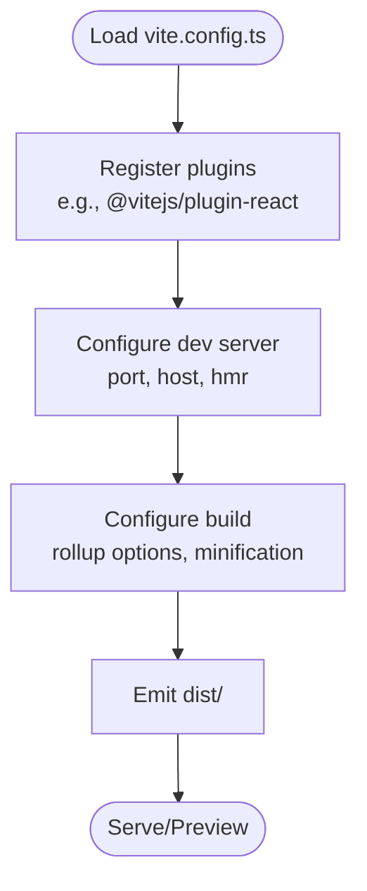
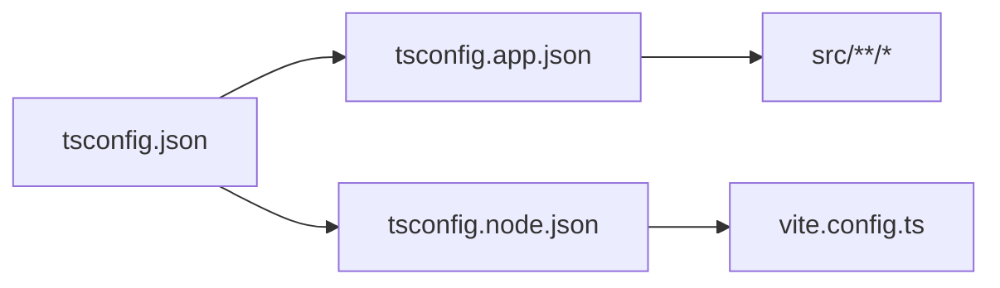
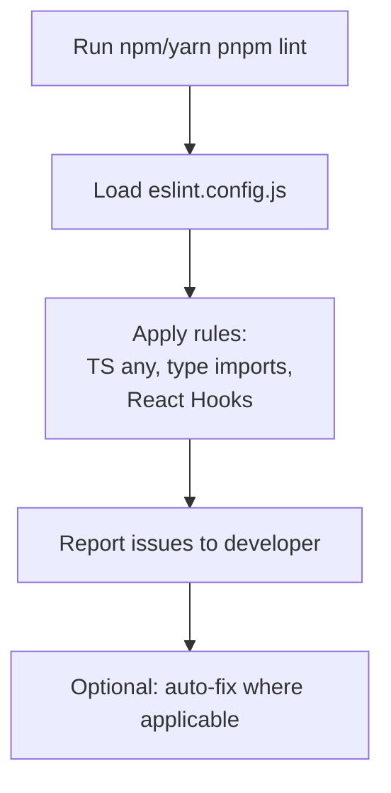
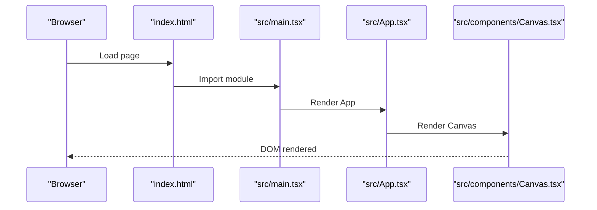
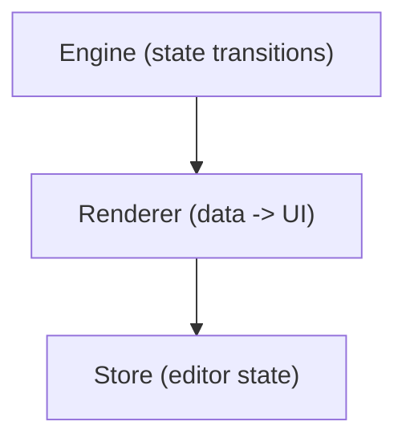
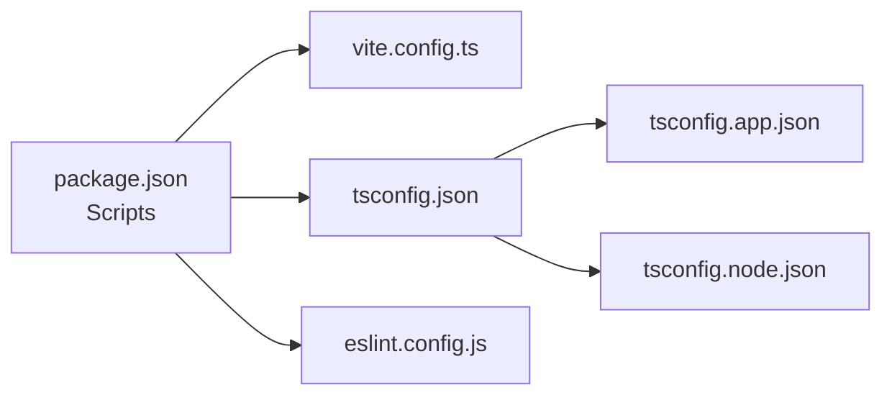

# Build and Development

<cite>
**Referenced Files in This Document**
- [vite.config.ts](file://vite.config.ts)
- [package.json](file://package.json)
- [eslint.config.js](file://eslint.config.js)
- [tsconfig.json](file://tsconfig.json)
- [tsconfig.app.json](file://tsconfig.app.json)
- [tsconfig.node.json](file://tsconfig.node.json)
- [src/main.tsx](file://src/main.tsx)
- [src/App.tsx](file://src/App.tsx)
- [index.html](file://index.html)
- [src/vite-env.d.ts](file://src/vite-env.d.ts)
- [src/components/Canvas.tsx](file://src/components/Canvas.tsx)
- [src/engine/index.ts](file://src/engine/index.ts)
- [src/renderer/index.ts](file://src/renderer/index.ts)
- [src/store/index.ts](file://src/store/index.ts)
</cite>

## Table of Contents
1. [Introduction](#introduction)
2. [Project Structure](#project-structure)
3. [Core Components](#core-components)
4. [Architecture Overview](#architecture-overview)
5. [Detailed Component Analysis](#detailed-component-analysis)
6. [Dependency Analysis](#dependency-analysis)
7. [Performance Considerations](#performance-considerations)
8. [Troubleshooting Guide](#troubleshooting-guide)
9. [Conclusion](#conclusion)
10. [Appendices](#appendices)

## Introduction
This document explains the build and development processes for the project, focusing on Vite configuration, TypeScript setup, and ESLint configuration. It covers the development workflow, build optimization strategies, and production deployment considerations. It also documents the multi-project TypeScript setup with separate app and node configurations, ESLint rules for React Hooks and TypeScript, and how to configure the development environment for optimal performance. Guidance is included for customizing Vite plugins, optimizing bundle sizes, enabling hot module replacement, debugging techniques, performance profiling, and troubleshooting common build issues. Finally, it clarifies how configuration files relate to the overall project architecture to help developers modify and extend the build system effectively.

## Project Structure
The project follows a frontend-first structure with a Vite-powered React application, TypeScript configured in a multi-project manner, and ESLint enforcing code quality and React Hooks safety. Key files and roles:
- Vite configuration defines the plugin pipeline and dev server behavior.
- TypeScript configurations split concerns between the application and Vite config (node-like) contexts.
- ESLint configuration enforces TypeScript and React Hooks rules.
- HTML entry point mounts the React root and loads the TypeScript module.
- Application entry initializes React and renders the root component.

**Diagram sources**
- [index.html](file://index.html)
- [src/main.tsx](file://src/main.tsx)
- [src/App.tsx](file://src/App.tsx)
- [src/components/Canvas.tsx](file://src/components/Canvas.tsx)
- [vite.config.ts](file://vite.config.ts)
- [src/vite-env.d.ts](file://src/vite-env.d.ts)
- [tsconfig.json](file://tsconfig.json)
- [tsconfig.app.json](file://tsconfig.app.json)
- [tsconfig.node.json](file://tsconfig.node.json)
- [eslint.config.js](file://eslint.config.js)
- [package.json](file://package.json)

**Section sources**
- [index.html](file://index.html)
- [src/main.tsx](file://src/main.tsx)
- [src/App.tsx](file://src/App.tsx)
- [vite.config.ts](file://vite.config.ts)
- [tsconfig.json](file://tsconfig.json)
- [tsconfig.app.json](file://tsconfig.app.json)
- [tsconfig.node.json](file://tsconfig.node.json)
- [eslint.config.js](file://eslint.config.js)
- [package.json](file://package.json)

## Core Components
- Vite configuration
  - Defines the React plugin for JSX transforms and fast refresh during development.
  - Serves the application in development mode and builds optimized bundles in production.
  - Provides the base for customizing plugins and build behavior.
  - Reference: [vite.config.ts](file://vite.config.ts)

- TypeScript configuration
  - Root configuration references two projects: app and node.
  - App configuration targets modern JavaScript environments, strictness, and JSX transform for React.
  - Node configuration targets Vite’s own configuration file and aligns with bundler module resolution.
  - References:
    - [tsconfig.json](file://tsconfig.json)
    - [tsconfig.app.json](file://tsconfig.app.json)
    - [tsconfig.node.json](file://tsconfig.node.json)

- ESLint configuration
  - Enforces TypeScript-specific rules and React Hooks rules.
  - Integrates with the project’s scripts for automated linting.
  - Reference: [eslint.config.js](file://eslint.config.js)

- Application entry and HTML
  - HTML provides the DOM container and loads the TypeScript module.
  - React root mounts the application and enables strict mode.
  - References:
    - [index.html](file://index.html)
    - [src/main.tsx](file://src/main.tsx)
    - [src/App.tsx](file://src/App.tsx)

- Vite client types
  - Declares Vite’s client-side type definitions for environment-aware APIs.
  - Reference: [src/vite-env.d.ts](file://src/vite-env.d.ts)

**Section sources**
- [vite.config.ts](file://vite.config.ts)
- [tsconfig.json](file://tsconfig.json)
- [tsconfig.app.json](file://tsconfig.app.json)
- [tsconfig.node.json](file://tsconfig.node.json)
- [eslint.config.js](file://eslint.config.js)
- [index.html](file://index.html)
- [src/main.tsx](file://src/main.tsx)
- [src/App.tsx](file://src/App.tsx)
- [src/vite-env.d.ts](file://src/vite-env.d.ts)

## Architecture Overview
The build and development architecture centers on Vite orchestrating TypeScript compilation and asset handling, with ESLint integrated into the developer workflow. The multi-project TypeScript setup isolates app and node contexts, while the React plugin powers development-time features like hot module replacement.

**Diagram sources**
- [package.json](file://package.json)
- [vite.config.ts](file://vite.config.ts)
- [tsconfig.json](file://tsconfig.json)
- [tsconfig.app.json](file://tsconfig.app.json)
- [tsconfig.node.json](file://tsconfig.node.json)
- [index.html](file://index.html)
- [src/main.tsx](file://src/main.tsx)
- [src/App.tsx](file://src/App.tsx)
- [src/components/Canvas.tsx](file://src/components/Canvas.tsx)
- [eslint.config.js](file://eslint.config.js)

## Detailed Component Analysis

### Vite Configuration
- Purpose
  - Provides the plugin pipeline and development server configuration.
  - Enables React JSX transform and fast refresh for rapid iteration.
- Key behaviors
  - Plugin registration for React.
  - Dev server defaults and build output configuration.
- Extensibility
  - Add additional plugins for CSS, assets, polyfills, or custom transforms.
  - Configure base paths, aliases, and build optimization flags.
- References
  - [vite.config.ts](file://vite.config.ts)

**Diagram sources**
- [vite.config.ts](file://vite.config.ts)

**Section sources**
- [vite.config.ts](file://vite.config.ts)

### TypeScript Multi-Project Setup
- Root configuration
  - Uses project references to separate app and node contexts.
  - References:
    - [tsconfig.json](file://tsconfig.json)
- App configuration
  - Targets modern JS environments, strictness, JSX transform, and bundler module resolution.
  - Includes the src tree for incremental builds.
  - References:
    - [tsconfig.app.json](file://tsconfig.app.json)
- Node configuration
  - Targets Vite’s config file and aligns with bundler module detection.
  - References:
    - [tsconfig.node.json](file://tsconfig.node.json)

**Diagram sources**
- [tsconfig.json](file://tsconfig.json)
- [tsconfig.app.json](file://tsconfig.app.json)
- [tsconfig.node.json](file://tsconfig.node.json)

**Section sources**
- [tsconfig.json](file://tsconfig.json)
- [tsconfig.app.json](file://tsconfig.app.json)
- [tsconfig.node.json](file://tsconfig.node.json)

### ESLint Configuration
- Purpose
  - Enforce TypeScript best practices and React Hooks rules.
  - Integrate with the project’s lint script.
- Rules
  - TypeScript-specific warnings and type import consistency.
  - React Hooks rules enforced as errors.
- References
  - [eslint.config.js](file://eslint.config.js)
  - [package.json](file://package.json)

**Diagram sources**
- [eslint.config.js](file://eslint.config.js)
- [package.json](file://package.json)

**Section sources**
- [eslint.config.js](file://eslint.config.js)
- [package.json](file://package.json)

### Application Entry Points and Rendering
- HTML entry
  - Provides the DOM container and loads the TypeScript module.
  - References:
    - [index.html](file://index.html)
- React root
  - Initializes the React root and renders the App component.
  - References:
    - [src/main.tsx](file://src/main.tsx)
    - [src/App.tsx](file://src/App.tsx)
- UI components
  - Example component demonstrates layout and styling.
  - References:
    - [src/components/Canvas.tsx](file://src/components/Canvas.tsx)

**Diagram sources**
- [index.html](file://index.html)
- [src/main.tsx](file://src/main.tsx)
- [src/App.tsx](file://src/App.tsx)
- [src/components/Canvas.tsx](file://src/components/Canvas.tsx)

**Section sources**
- [index.html](file://index.html)
- [src/main.tsx](file://src/main.tsx)
- [src/App.tsx](file://src/App.tsx)
- [src/components/Canvas.tsx](file://src/components/Canvas.tsx)

### Engine, Renderer, and Store Layers
- Engine
  - Framework-agnostic core for state transitions.
  - Reference: [src/engine/index.ts](file://src/engine/index.ts)
- Renderer
  - Pure data-to-UI utilities, framework-agnostic.
  - Reference: [src/renderer/index.ts](file://src/renderer/index.ts)
- Store
  - Editor state separation from scene data.
  - Reference: [src/store/index.ts](file://src/store/index.ts)

**Diagram sources**
- [src/engine/index.ts](file://src/engine/index.ts)
- [src/renderer/index.ts](file://src/renderer/index.ts)
- [src/store/index.ts](file://src/store/index.ts)

**Section sources**
- [src/engine/index.ts](file://src/engine/index.ts)
- [src/renderer/index.ts](file://src/renderer/index.ts)
- [src/store/index.ts](file://src/store/index.ts)

## Dependency Analysis
- Scripts and toolchain
  - Development, build, lint, and preview commands orchestrated via package.json.
  - References:
    - [package.json](file://package.json)
- TypeScript project references
  - Root references app and node configurations for isolated builds.
  - References:
    - [tsconfig.json](file://tsconfig.json)
    - [tsconfig.app.json](file://tsconfig.app.json)
    - [tsconfig.node.json](file://tsconfig.node.json)
- ESLint integration
  - Rules applied during lint runs; integrates with editors and CI.
  - Reference: [eslint.config.js](file://eslint.config.js)

**Diagram sources**
- [package.json](file://package.json)
- [vite.config.ts](file://vite.config.ts)
- [tsconfig.json](file://tsconfig.json)
- [tsconfig.app.json](file://tsconfig.app.json)
- [tsconfig.node.json](file://tsconfig.node.json)
- [eslint.config.js](file://eslint.config.js)

**Section sources**
- [package.json](file://package.json)
- [tsconfig.json](file://tsconfig.json)
- [tsconfig.app.json](file://tsconfig.app.json)
- [tsconfig.node.json](file://tsconfig.node.json)
- [eslint.config.js](file://eslint.config.js)

## Performance Considerations
- Optimize TypeScript builds
  - Keep strictness enabled for correctness; leverage project references to isolate builds and speed up incremental compilation.
  - References:
    - [tsconfig.json](file://tsconfig.json)
    - [tsconfig.app.json](file://tsconfig.app.json)
    - [tsconfig.node.json](file://tsconfig.node.json)
- Vite build optimization
  - Enable minification and chunk splitting in production.
  - Use dynamic imports for code splitting and lazy-loading heavy features.
  - Leverage environment variables and define constants to remove dead code in production.
  - Reference: [vite.config.ts](file://vite.config.ts)
- React plugin benefits
  - Fast refresh reduces reload cycles during development.
  - Reference: [vite.config.ts](file://vite.config.ts)
- Bundle size tips
  - Prefer tree-shaking-friendly libraries and avoid unnecessary polyfills.
  - Monitor bundle composition using Vite’s built-in preview and profiling tools.
  - Reference: [package.json](file://package.json)
- Development performance
  - Keep module resolution set to bundler for faster cold starts.
  - Disable expensive checks in development; enable them in CI/lint.
  - Reference: [tsconfig.app.json](file://tsconfig.app.json)

[No sources needed since this section provides general guidance]

## Troubleshooting Guide
- React Hooks errors
  - Ensure all hook calls follow the Rules of Hooks enforced by ESLint.
  - Reference: [eslint.config.js](file://eslint.config.js)
- TypeScript diagnostics
  - Verify project references resolve correctly; rebuild with tsc -b if incremental state becomes inconsistent.
  - References:
    - [tsconfig.json](file://tsconfig.json)
    - [tsconfig.app.json](file://tsconfig.app.json)
    - [tsconfig.node.json](file://tsconfig.node.json)
- Vite plugin conflicts
  - If encountering unexpected behavior, temporarily disable plugins to isolate issues.
  - Reference: [vite.config.ts](file://vite.config.ts)
- Fast refresh issues
  - Confirm React plugin is present and that components are exported as default.
  - Reference: [vite.config.ts](file://vite.config.ts)
- Lint failures
  - Run the lint script and address reported issues; auto-fix where supported.
  - Reference: [package.json](file://package.json), [eslint.config.js](file://eslint.config.js)
- Preview vs dev mismatch
  - Use the preview command to test production builds locally.
  - Reference: [package.json](file://package.json)

**Section sources**
- [eslint.config.js](file://eslint.config.js)
- [tsconfig.json](file://tsconfig.json)
- [tsconfig.app.json](file://tsconfig.app.json)
- [tsconfig.node.json](file://tsconfig.node.json)
- [vite.config.ts](file://vite.config.ts)
- [package.json](file://package.json)

## Conclusion
The project’s build and development system leverages Vite, TypeScript project references, and ESLint to deliver a fast, reliable, and maintainable workflow. The multi-project TypeScript setup cleanly separates app and node contexts, while the React plugin accelerates development with hot module replacement. By following the optimization and troubleshooting guidance here, developers can confidently customize the build system, improve performance, and ensure a smooth development experience.

[No sources needed since this section summarizes without analyzing specific files]

## Appendices
- Development workflow summary
  - Start dev server using the dev script.
  - Iterate with fast refresh and type checking.
  - Run lint to enforce code quality.
  - Build for production using the build script.
  - Preview the production bundle locally using the preview script.
  - References:
    - [package.json](file://package.json)
    - [vite.config.ts](file://vite.config.ts)
    - [eslint.config.js](file://eslint.config.js)
    - [tsconfig.json](file://tsconfig.json)
    - [tsconfig.app.json](file://tsconfig.app.json)
    - [tsconfig.node.json](file://tsconfig.node.json)

**Section sources**
- [package.json](file://package.json)
- [vite.config.ts](file://vite.config.ts)
- [eslint.config.js](file://eslint.config.js)
- [tsconfig.json](file://tsconfig.json)
- [tsconfig.app.json](file://tsconfig.app.json)
- [tsconfig.node.json](file://tsconfig.node.json)