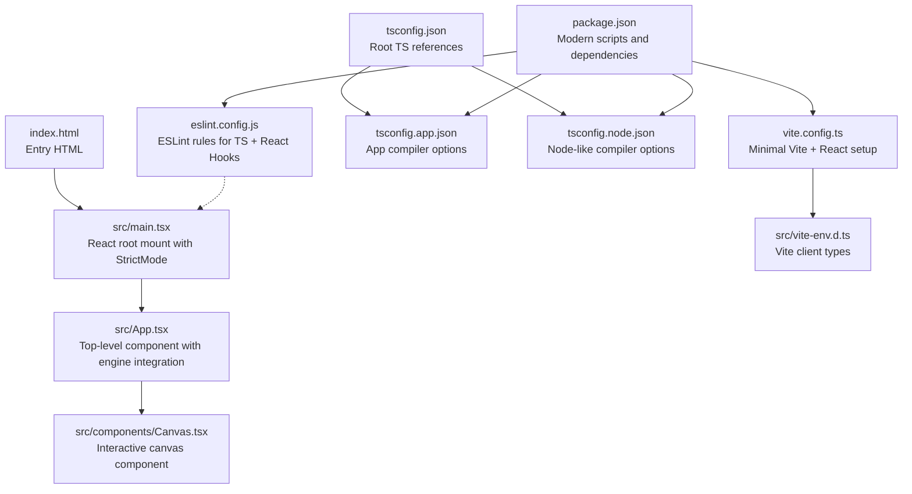
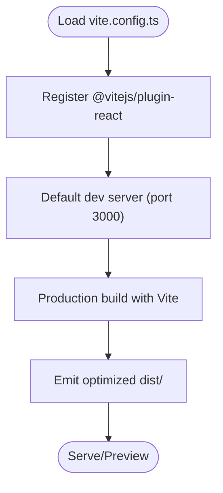
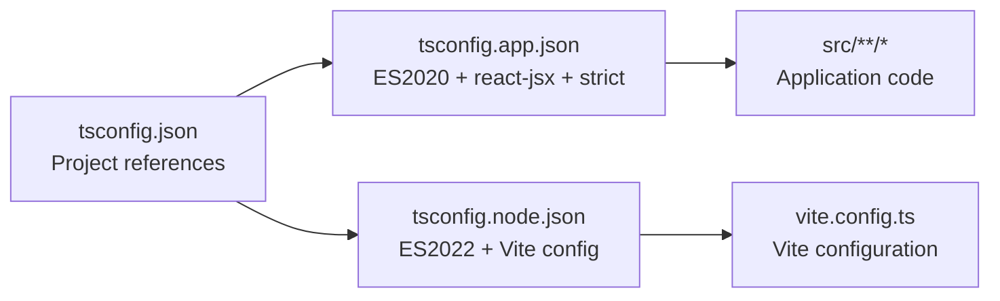
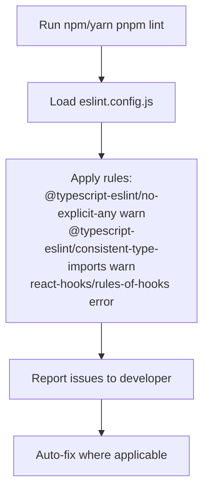
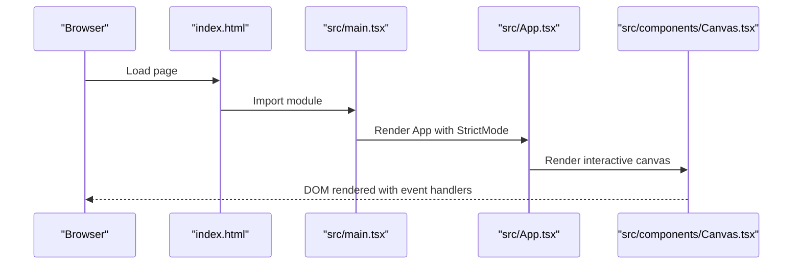
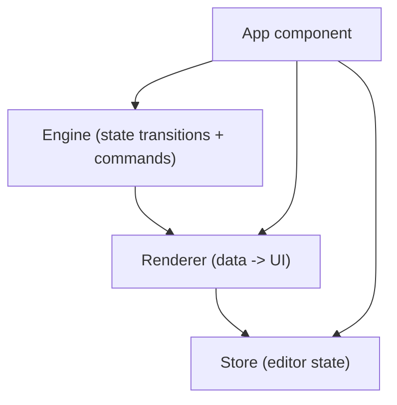
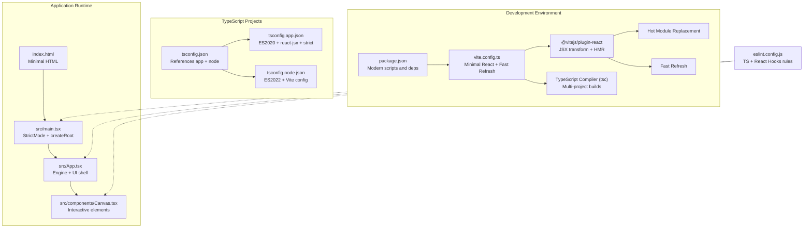
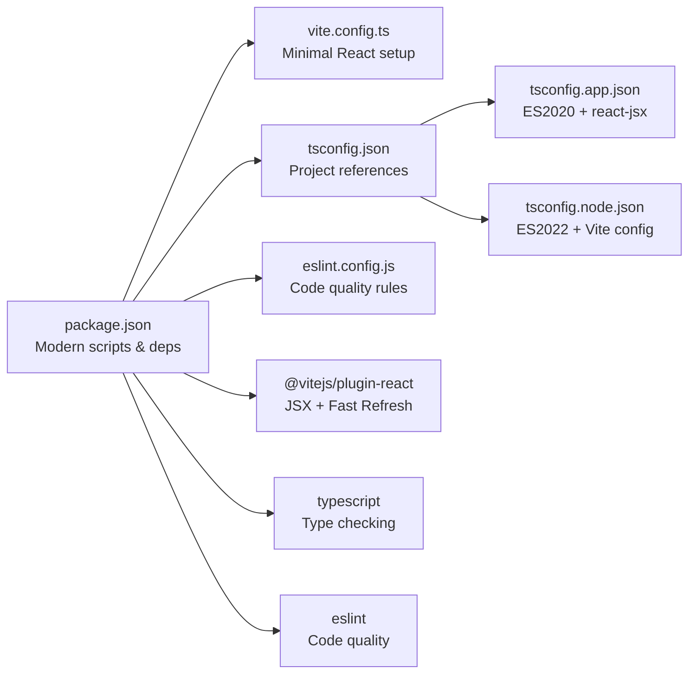

# Build and Development

<cite>
**Referenced Files in This Document**
- [vite.config.ts](file://vite.config.ts)
- [package.json](file://package.json)
- [eslint.config.js](file://eslint.config.js)
- [tsconfig.json](file://tsconfig.json)
- [tsconfig.app.json](file://tsconfig.app.json)
- [tsconfig.node.json](file://tsconfig.node.json)
- [src/main.tsx](file://src/main.tsx)
- [src/App.tsx](file://src/App.tsx)
- [index.html](file://index.html)
- [src/vite-env.d.ts](file://src/vite-env.d.ts)
- [src/components/Canvas.tsx](file://src/components/Canvas.tsx)
- [src/engine/index.ts](file://src/engine/index.ts)
- [src/renderer/index.tsx](file://src/renderer/index.tsx)
- [src/store/index.ts](file://src/store/index.ts)
</cite>

## Update Summary
**Changes Made**
- Updated Vite configuration section to reflect the minimal modern setup with React plugin
- Enhanced TypeScript multi-project setup documentation with detailed compiler options
- Expanded ESLint configuration coverage including React Hooks and TypeScript rules
- Added comprehensive React development environment documentation
- Updated dependency analysis to show modern toolchain integration
- Enhanced troubleshooting guide with specific error scenarios

## Table of Contents
1. [Introduction](#introduction)
2. [Project Structure](#project-structure)
3. [Core Components](#core-components)
4. [Architecture Overview](#architecture-overview)
5. [Detailed Component Analysis](#detailed-component-analysis)
6. [Dependency Analysis](#dependency-analysis)
7. [Performance Considerations](#performance-considerations)
8. [Troubleshooting Guide](#troubleshooting-guide)
9. [Conclusion](#conclusion)
10. [Appendices](#appendices)

## Introduction
This document explains the build and development processes for the modern React-based AI editor, focusing on Vite configuration, TypeScript setup, and ESLint configuration. The project implements a streamlined build system with React Fast Refresh, TypeScript project references, and comprehensive linting rules. It covers the development workflow, build optimization strategies, and production deployment considerations. The documentation addresses the multi-project TypeScript setup with separate app and node configurations, ESLint rules for React Hooks and TypeScript, and how to configure the development environment for optimal performance. Guidance is included for customizing Vite plugins, optimizing bundle sizes, enabling hot module replacement, debugging techniques, performance profiling, and troubleshooting common build issues.

## Project Structure
The project follows a modern frontend-first structure with Vite-powered React application, TypeScript configured in a multi-project manner, and ESLint enforcing code quality and React Hooks safety. Key files and roles:
- Vite configuration defines the plugin pipeline and dev server behavior with React Fast Refresh
- TypeScript configurations split concerns between the application and Vite config (node-like) contexts
- ESLint configuration enforces TypeScript-specific rules and React Hooks safety
- HTML entry point mounts the React root and loads the TypeScript module
- Application entry initializes React with StrictMode and renders the root component

**Diagram sources**
- [index.html](file://index.html)
- [src/main.tsx](file://src/main.tsx)
- [src/App.tsx](file://src/App.tsx)
- [src/components/Canvas.tsx](file://src/components/Canvas.tsx)
- [vite.config.ts](file://vite.config.ts)
- [src/vite-env.d.ts](file://src/vite-env.d.ts)
- [tsconfig.json](file://tsconfig.json)
- [tsconfig.app.json](file://tsconfig.app.json)
- [tsconfig.node.json](file://tsconfig.node.json)
- [eslint.config.js](file://eslint.config.js)
- [package.json](file://package.json)

**Section sources**
- [index.html](file://index.html)
- [src/main.tsx](file://src/main.tsx)
- [src/App.tsx](file://src/App.tsx)
- [vite.config.ts](file://vite.config.ts)
- [tsconfig.json](file://tsconfig.json)
- [tsconfig.app.json](file://tsconfig.app.json)
- [tsconfig.node.json](file://tsconfig.node.json)
- [eslint.config.js](file://eslint.config.js)
- [package.json](file://package.json)

## Core Components

### Vite Configuration
- Purpose
  - Provides minimal configuration for React development with Fast Refresh
  - Enables JSX transform and automatic HMR for rapid iteration
- Key behaviors
  - Single React plugin registration for JSX processing
  - Default dev server configuration with port 3000
  - Production build optimization through Vite's bundling
- Extensibility
  - Add CSS preprocessing, asset handling, or custom transforms
  - Configure base paths, aliases, and build optimization flags
- References
  - [vite.config.ts](file://vite.config.ts)

**Diagram sources**
- [vite.config.ts](file://vite.config.ts)

**Section sources**
- [vite.config.ts](file://vite.config.ts)

### TypeScript Multi-Project Setup
- Root configuration
  - Uses project references to separate app and node contexts
  - References:
    - [tsconfig.json](file://tsconfig.json)
- App configuration
  - Targets modern JavaScript environments (ES2020)
  - Strict mode enabled with comprehensive type checking
  - JSX transform configured for React (react-jsx)
  - Bundler module resolution for optimal Vite integration
  - Includes the src tree for incremental builds
  - References:
    - [tsconfig.app.json](file://tsconfig.app.json)
- Node configuration
  - Targets Vite's configuration file (ES2022)
  - Aligns with bundler module detection for Vite
  - References:
    - [tsconfig.node.json](file://tsconfig.node.json)

**Diagram sources**
- [tsconfig.json](file://tsconfig.json)
- [tsconfig.app.json](file://tsconfig.app.json)
- [tsconfig.node.json](file://tsconfig.node.json)

**Section sources**
- [tsconfig.json](file://tsconfig.json)
- [tsconfig.app.json](file://tsconfig.app.json)
- [tsconfig.node.json](file://tsconfig.node.json)

### ESLint Configuration
- Purpose
  - Enforce TypeScript best practices and React Hooks safety
  - Provide consistent code quality across the development team
- Rules
  - TypeScript-specific warnings for explicit any usage
  - Type import consistency enforcement
  - React Hooks rules enforced as errors
- Integration
  - Runs across the entire project structure
  - Integrated with development scripts
- References
  - [eslint.config.js](file://eslint.config.js)
  - [package.json](file://package.json)

**Diagram sources**
- [eslint.config.js](file://eslint.config.js)
- [package.json](file://package.json)

**Section sources**
- [eslint.config.js](file://eslint.config.js)
- [package.json](file://package.json)

### Application Entry Points and Rendering
- HTML entry
  - Minimal HTML structure with root div and module script
  - Loads the TypeScript module for React initialization
  - References:
    - [index.html](file://index.html)
- React root
  - Initializes React with StrictMode for better error detection
  - Creates root and renders the App component
  - References:
    - [src/main.tsx](file://src/main.tsx)
    - [src/App.tsx](file://src/App.tsx)
- UI components
  - Canvas component handles drag-and-drop interactions
  - Component palette for element selection
  - References:
    - [src/components/Canvas.tsx](file://src/components/Canvas.tsx)

**Diagram sources**
- [index.html](file://index.html)
- [src/main.tsx](file://src/main.tsx)
- [src/App.tsx](file://src/App.tsx)
- [src/components/Canvas.tsx](file://src/components/Canvas.tsx)

**Section sources**
- [index.html](file://index.html)
- [src/main.tsx](file://src/main.tsx)
- [src/App.tsx](file://src/App.tsx)
- [src/components/Canvas.tsx](file://src/components/Canvas.tsx)

### Engine, Renderer, and Store Layers
- Engine
  - Framework-agnostic core for state transitions and command execution
  - Exported as a cohesive API for the application layer
  - Reference: [src/engine/index.ts](file://src/engine/index.ts)
- Renderer
  - Pure data-to-UI utilities for element rendering
  - Framework-agnostic rendering functions
  - Reference: [src/renderer/index.tsx](file://src/renderer/index.tsx)
- Store
  - Editor state management separated from scene data
  - State isolation for better maintainability
  - Reference: [src/store/index.ts](file://src/store/index.ts)

**Diagram sources**
- [src/engine/index.ts](file://src/engine/index.ts)
- [src/renderer/index.tsx](file://src/renderer/index.tsx)
- [src/store/index.ts](file://src/store/index.ts)

**Section sources**
- [src/engine/index.ts](file://src/engine/index.ts)
- [src/renderer/index.tsx](file://src/renderer/index.tsx)
- [src/store/index.ts](file://src/store/index.ts)

## Architecture Overview
The build and development architecture centers on Vite orchestrating TypeScript compilation and asset handling, with ESLint integrated into the developer workflow. The multi-project TypeScript setup isolates app and node contexts, while the React plugin powers development-time features like hot module replacement and Fast Refresh.

**Diagram sources**
- [package.json](file://package.json)
- [vite.config.ts](file://vite.config.ts)
- [tsconfig.json](file://tsconfig.json)
- [tsconfig.app.json](file://tsconfig.app.json)
- [tsconfig.node.json](file://tsconfig.node.json)
- [index.html](file://index.html)
- [src/main.tsx](file://src/main.tsx)
- [src/App.tsx](file://src/App.tsx)
- [src/components/Canvas.tsx](file://src/components/Canvas.tsx)
- [eslint.config.js](file://eslint.config.js)

## Detailed Component Analysis

### Vite Configuration
The Vite configuration implements a minimal but effective setup for modern React development. The configuration focuses on providing essential functionality without unnecessary complexity.

- **Plugin Registration**: Single React plugin handles JSX transformation and Fast Refresh
- **Development Server**: Default configuration suitable for most React applications
- **Build Optimization**: Leverages Vite's native bundling capabilities for production
- **Extensibility**: Designed to accommodate additional plugins for CSS, assets, or custom transforms

**Section sources**
- [vite.config.ts](file://vite.config.ts)

### TypeScript Multi-Project Setup
The TypeScript configuration implements a sophisticated multi-project setup that optimizes build performance and developer experience.

- **Root Configuration**: Uses project references to coordinate multiple TypeScript projects
- **App Configuration**: Targets modern JavaScript environments with strict type checking
- **Node Configuration**: Optimized for Vite's configuration file and bundler integration
- **Compiler Options**: Carefully tuned for performance and compatibility

**Section sources**
- [tsconfig.json](file://tsconfig.json)
- [tsconfig.app.json](file://tsconfig.app.json)
- [tsconfig.node.json](file://tsconfig.node.json)

### ESLint Configuration
The ESLint setup provides comprehensive code quality enforcement with React-specific rules.

- **TypeScript Integration**: Warns on explicit any usage and enforces type import consistency
- **React Hooks Safety**: Critical rules enforced as errors to prevent common mistakes
- **Developer Experience**: Balances strictness with practical development workflow

**Section sources**
- [eslint.config.js](file://eslint.config.js)
- [package.json](file://package.json)

### Application Entry Points and Rendering
The application structure demonstrates modern React development practices with proper error boundaries and performance optimizations.

- **Strict Mode**: Enabled for better error detection and future compatibility
- **Root Creation**: Efficient root creation with proper error boundary setup
- **Component Architecture**: Clear separation between UI components and business logic
- **Event Handling**: Proper TypeScript typing for React events and callbacks

**Section sources**
- [index.html](file://index.html)
- [src/main.tsx](file://src/main.tsx)
- [src/App.tsx](file://src/App.tsx)
- [src/components/Canvas.tsx](file://src/components/Canvas.tsx)

### Engine, Renderer, and Store Layers
The layered architecture promotes separation of concerns and maintainability.

- **Engine Layer**: Framework-agnostic core with command pattern for state management
- **Renderer Layer**: Pure functions for UI rendering without side effects
- **Store Layer**: Isolated state management for editor-specific data
- **Integration**: Clean interfaces between layers for easy testing and modification

**Section sources**
- [src/engine/index.ts](file://src/engine/index.ts)
- [src/renderer/index.tsx](file://src/renderer/index.tsx)
- [src/store/index.ts](file://src/store/index.ts)

## Dependency Analysis
The project uses a modern, streamlined dependency setup optimized for development velocity and build performance.

- **Package Scripts**: Four essential scripts covering development, build, lint, and preview
- **Runtime Dependencies**: Minimal React ecosystem with core libraries
- **Development Dependencies**: Modern toolchain with comprehensive type support
- **Toolchain Integration**: Seamless integration between Vite, TypeScript, and ESLint

**Diagram sources**
- [package.json](file://package.json)
- [vite.config.ts](file://vite.config.ts)
- [tsconfig.json](file://tsconfig.json)
- [tsconfig.app.json](file://tsconfig.app.json)
- [tsconfig.node.json](file://tsconfig.node.json)
- [eslint.config.js](file://eslint.config.js)

**Section sources**
- [package.json](file://package.json)
- [tsconfig.json](file://tsconfig.json)
- [tsconfig.app.json](file://tsconfig.app.json)
- [tsconfig.node.json](file://tsconfig.node.json)
- [eslint.config.js](file://eslint.config.js)

## Performance Considerations
The modern build setup includes several optimizations for optimal development and production performance.

- **TypeScript Builds**: Strict mode with project references for fast incremental compilation
- **Vite Optimization**: Native ES module support and efficient bundling for production
- **React Fast Refresh**: Eliminates full page reloads during development
- **Bundle Size**: Minimal dependencies reduce initial load time
- **Development Performance**: Optimized module resolution and caching strategies

**Section sources**
- [tsconfig.app.json](file://tsconfig.app.json)
- [vite.config.ts](file://vite.config.ts)
- [package.json](file://package.json)

## Troubleshooting Guide
Common issues and solutions for the modern build setup.

### React Hooks Errors
- **Issue**: Hooks not called in the correct order
- **Solution**: ESLint rule prevents violations; ensure hooks follow Rules of Hooks
- **Reference**: [eslint.config.js](file://eslint.config.js)

### TypeScript Compilation Issues
- **Issue**: Project reference resolution problems
- **Solution**: Use `tsc -b` to rebuild with proper dependency tracking
- **References**:
  - [tsconfig.json](file://tsconfig.json)
  - [tsconfig.app.json](file://tsconfig.app.json)
  - [tsconfig.node.json](file://tsconfig.node.json)

### Vite Plugin Conflicts
- **Issue**: Unexpected behavior with React plugin
- **Solution**: Verify plugin registration and React version compatibility
- **Reference**: [vite.config.ts](file://vite.config.ts)

### Fast Refresh Problems
- **Issue**: Components not updating without full reload
- **Solution**: Ensure proper export patterns and component structure
- **Reference**: [vite.config.ts](file://vite.config.ts)

### Lint Failures
- **Issue**: ESLint rule violations blocking development
- **Solution**: Address warnings or adjust rules in eslint.config.js
- **Reference**: [eslint.config.js](file://eslint.config.js)

### Preview vs Development Mismatch
- **Issue**: Differences between dev server and production build
- **Solution**: Use `vite preview` to test production bundle locally
- **Reference**: [package.json](file://package.json)

**Section sources**
- [eslint.config.js](file://eslint.config.js)
- [tsconfig.json](file://tsconfig.json)
- [tsconfig.app.json](file://tsconfig.app.json)
- [tsconfig.node.json](file://tsconfig.node.json)
- [vite.config.ts](file://vite.config.ts)
- [package.json](file://package.json)

## Conclusion
The project's build and development system leverages modern tooling to deliver an efficient, maintainable workflow. The streamlined Vite configuration with React Fast Refresh, sophisticated TypeScript multi-project setup, and comprehensive ESLint rules create a robust foundation for React development. The layered architecture promotes clean separation of concerns while maintaining performance. By following the optimization and troubleshooting guidance, developers can effectively customize the build system, maintain code quality, and ensure a smooth development experience.

## Appendices

### Development Workflow Summary
- **Start Development**: `npm run dev` launches Vite with Fast Refresh
- **Iterate**: Code changes trigger hot module replacement automatically
- **Quality Assurance**: `npm run lint` enforces code quality standards
- **Build for Production**: `npm run build` compiles TypeScript and Vite assets
- **Test Production**: `npm run preview` serves the production bundle locally
- **Dependencies**: Modern toolchain with minimal overhead

**Section sources**
- [package.json](file://package.json)
- [vite.config.ts](file://vite.config.ts)
- [eslint.config.js](file://eslint.config.js)
- [tsconfig.json](file://tsconfig.json)
- [tsconfig.app.json](file://tsconfig.app.json)
- [tsconfig.node.json](file://tsconfig.node.json)

### Configuration Reference
- **Vite**: Minimal React plugin configuration with Fast Refresh
- **TypeScript**: Multi-project setup with strict type checking
- **ESLint**: Comprehensive rules for React Hooks and TypeScript safety
- **Dependencies**: Modern React ecosystem with optimized toolchain

**Section sources**
- [vite.config.ts](file://vite.config.ts)
- [tsconfig.json](file://tsconfig.json)
- [eslint.config.js](file://eslint.config.js)
- [package.json](file://package.json)