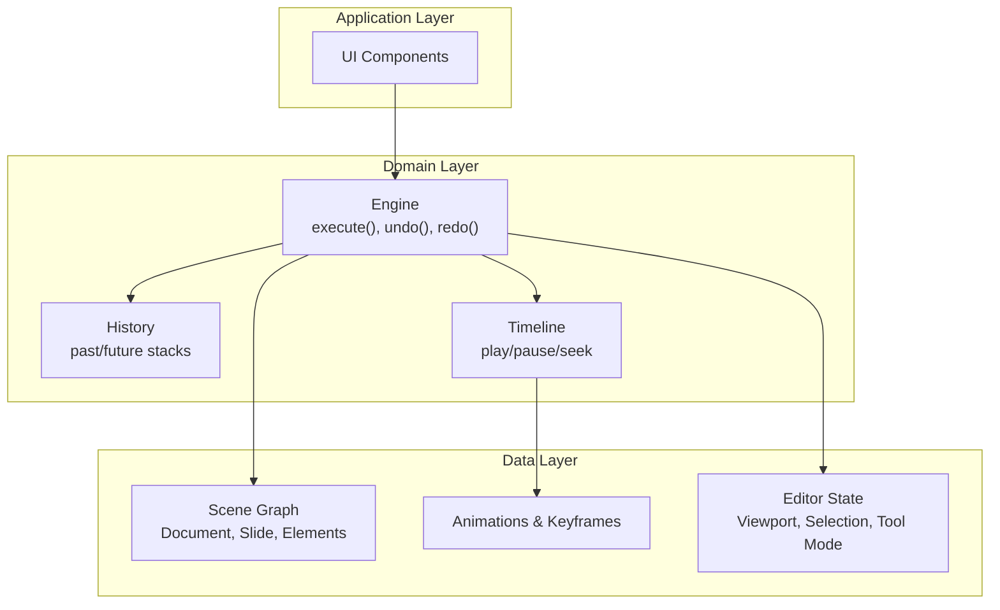
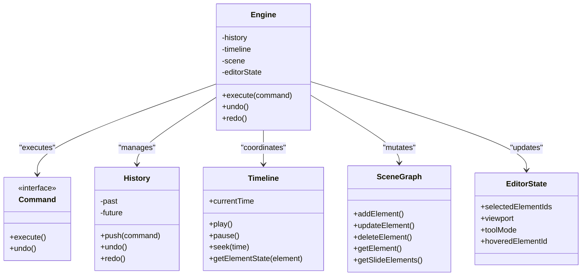
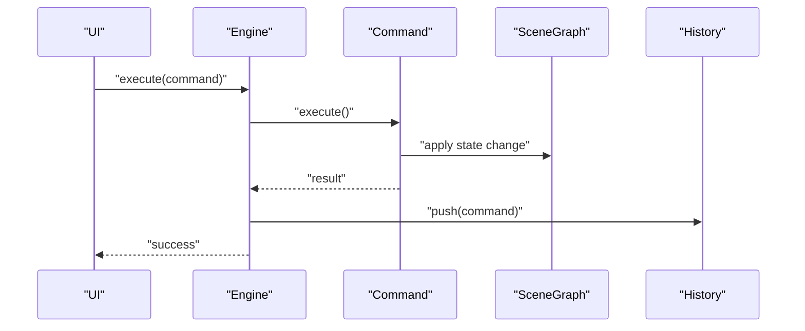
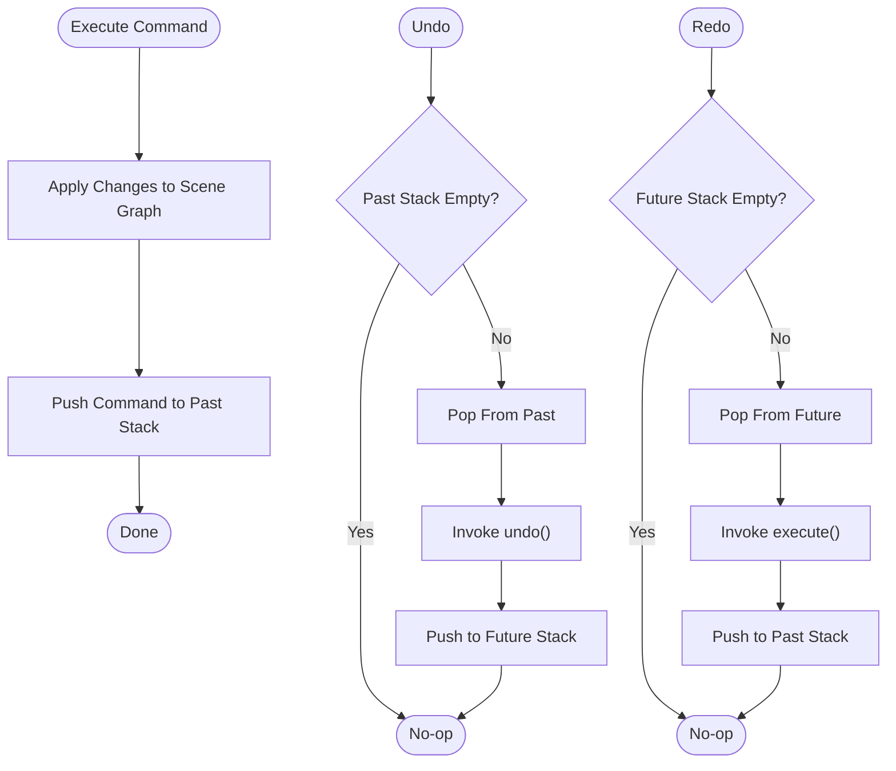
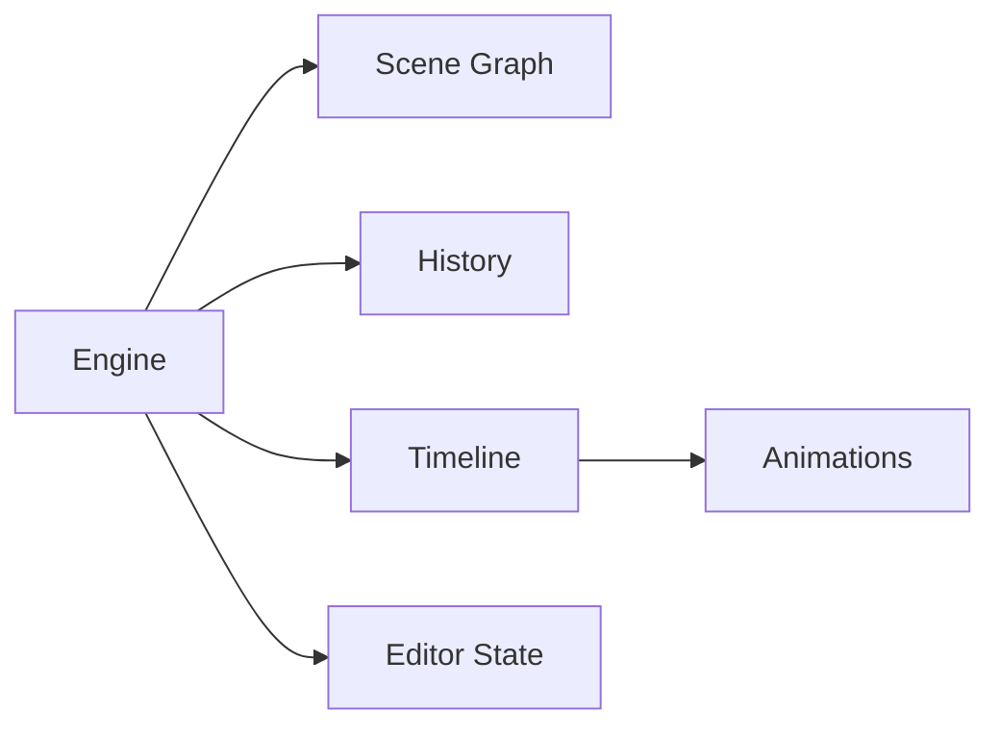

# Command Pattern System

<cite>
**Referenced Files in This Document**
- [engine/index.ts](file://src/engine/index.ts)
- [store/index.ts](file://src/store/index.ts)
- [types/index.ts](file://src/types/index.ts)
- [spec1.md](file://spec1.md)
</cite>

## Table of Contents
1. [Introduction](#introduction)
2. [Project Structure](#project-structure)
3. [Core Components](#core-components)
4. [Architecture Overview](#architecture-overview)
5. [Detailed Component Analysis](#detailed-component-analysis)
6. [Dependency Analysis](#dependency-analysis)
7. [Performance Considerations](#performance-considerations)
8. [Troubleshooting Guide](#troubleshooting-guide)
9. [Conclusion](#conclusion)

## Introduction
This document describes the command pattern system designed to enable undo/redo functionality and centralized state management for a presentation editor. The system enforces that all state changes must flow through a central engine, ensuring consistency across the scene graph and enabling robust history management. The specification defines the core abstractions and responsibilities for commands, history, and integration with the timeline for animation playback.

## Project Structure
The repository follows a layered architecture:
- Engine: Central orchestrator enforcing single-source-of-truth state changes and coordinating history and timeline.
- Store: Editor state (viewport, selection, tool mode) separate from scene data.
- Types: Shared data models for documents, slides, elements, animations, and editor state.
- Specification: Defines the command system, history, and timeline requirements.

**Section sources**
- [engine/index.ts:1-3](file://src/engine/index.ts#L1-L3)
- [store/index.ts:1-2](file://src/store/index.ts#L1-L2)
- [types/index.ts:57-111](file://src/types/index.ts#L57-L111)
- [spec1.md:98-111](file://spec1.md#L98-L111)

## Core Components
This section outlines the primary building blocks of the command pattern system as defined by the specification.

- Command Interface
  - Purpose: Encapsulate state changes with reversible operations.
  - Responsibilities: Define execute() and undo() methods; carry payloads capturing previous and next states.
  - Payload Requirement: Include prev/next snapshots to support reliable undo/redo.

- Engine
  - Purpose: Single source of truth for state mutations.
  - Responsibilities: Accept commands via execute(), manage history, coordinate timeline updates, and maintain editor state.
  - Constraints: All state changes must pass through engine.execute(command).

- History
  - Purpose: Track command execution history for undo/redo.
  - Responsibilities: Maintain past and future stacks; provide push, undo, and redo operations with correct stack behavior.

- Timeline
  - Purpose: Drive animation playback using keyframes and interpolate element states.
  - Responsibilities: Manage currentTime, play, pause, seek; compute interpolated values for properties at given times.

- Scene Graph
  - Purpose: Persistent representation of document structure and element relationships.
  - Responsibilities: Store elements as id-to-object maps; maintain slide membership and parent-child relationships via ids.

- Editor State
  - Purpose: UI/editor-mode state separate from scene data.
  - Responsibilities: Track selection, viewport, tool mode, and hover state.

**Section sources**
- [spec1.md:114-146](file://spec1.md#L114-L146)
- [spec1.md:184-198](file://spec1.md#L184-L198)
- [engine/index.ts:1-3](file://src/engine/index.ts#L1-L3)
- [types/index.ts:57-111](file://src/types/index.ts#L57-L111)

## Architecture Overview
The command pattern system centers around the Engine, which coordinates command execution, maintains history, and integrates with the timeline for animation playback. Commands encapsulate state transitions and are applied to the scene graph while preserving reversibility.

**Diagram sources**
- [engine/index.ts:1-3](file://src/engine/index.ts#L1-L3)
- [spec1.md:114-146](file://spec1.md#L114-L146)
- [spec1.md:184-198](file://spec1.md#L184-L198)
- [types/index.ts:57-111](file://src/types/index.ts#L57-L111)

## Detailed Component Analysis

### Command Interface Design
- Execution Contract
  - execute(): Applies the state change to the scene graph and editor state.
  - undo(): Reverses the effect of execute() using captured prev/next payloads.
- Payload Semantics
  - prev: Snapshot/state before the operation.
  - next: Snapshot/state after the operation.
- Encapsulation
  - Commands encapsulate both the operation and its reversible counterpart, ensuring consistency and atomicity.

**Diagram sources**
- [engine/index.ts:1-3](file://src/engine/index.ts#L1-L3)
- [spec1.md:114-129](file://spec1.md#L114-L129)

**Section sources**
- [spec1.md:114-129](file://spec1.md#L114-L129)

### Execution Flow and History Management
- Push to History
  - After successful execution, the command is pushed onto the history stack.
- Undo Operation
  - Pop the most recent command from the past stack, invoke undo(), and place it on the future stack.
- Redo Operation
  - Pop the most recent command from the future stack, invoke execute(), and place it back on the past stack.
- Stack Behavior
  - Correct LIFO semantics ensure precise reversal and replay of operations.

**Diagram sources**
- [spec1.md:133-146](file://spec1.md#L133-L146)

**Section sources**
- [spec1.md:133-146](file://spec1.md#L133-L146)

### Serialization Mechanisms
- Command Serialization
  - Commands should serialize to JSON-compatible structures containing:
    - Command type identifier
    - Payload with prev/next snapshots
    - Optional metadata (timestamp, user, context)
- History Persistence
  - Serialize history stacks to restore undo/redo sessions across app restarts.
- Timeline Interop
  - Serialize animations and keyframes alongside commands to preserve playback state.

[No sources needed since this section provides general guidance]

### Parameter Validation and Error Rollback
- Pre-Execution Validation
  - Validate command payloads and preconditions before applying changes.
- Atomicity Guarantees
  - Use transaction-like patterns to ensure either the entire operation succeeds or the state remains unchanged.
- Error Handling
  - On failure, revert partial changes and surface errors without corrupting state.
- Rollback Strategy
  - Utilize captured prev snapshots to restore state during undo or error scenarios.

[No sources needed since this section provides general guidance]

### Practical Examples
- Creating a MoveElementCommand
  - Capture prev/next positions and transforms.
  - Apply via engine.execute() to update the scene graph.
- Executing an AddElementCommand
  - Provide initial element definition; on undo, remove the element from the scene graph.
- History Management
  - After each command, push to history; support undo/redo hotkeys to traverse stacks.
- Timeline Integration
  - For animation commands, update timeline keyframes and synchronize playback.

[No sources needed since this section provides general guidance]

### Command Registry System
- Registration
  - Register command constructors under symbolic names for dynamic dispatch.
- Resolution
  - Deserialize command payloads and resolve constructor by type.
- Extensibility
  - Allow plugins to register new commands and extend the registry.

[No sources needed since this section provides general guidance]

### Integration with Timeline System
- Playback Synchronization
  - Timeline seeks to specific times; interpolate element properties using keyframes.
- Command-Aware Timeline
  - Treat animation commands as reversible operations; include them in history for accurate playback control.
- Animation Editing
  - Add, modify, and delete keyframes through commands; ensure timeline reflects changes immediately.

**Section sources**
- [spec1.md:184-198](file://spec1.md#L184-L198)

## Dependency Analysis
The Engine depends on the Scene Graph, History, Timeline, and Editor State. The specification defines these dependencies and responsibilities.

**Diagram sources**
- [spec1.md:98-111](file://spec1.md#L98-L111)
- [spec1.md:184-198](file://spec1.md#L184-L198)

**Section sources**
- [spec1.md:98-111](file://spec1.md#L98-L111)
- [engine/index.ts:1-3](file://src/engine/index.ts#L1-L3)

## Performance Considerations
- Memory Management for History Stacks
  - Limit history depth to balance memory usage and usability.
  - Periodically prune old commands or compress snapshots to reduce footprint.
- Command Storage
  - Prefer compact payload representations; avoid storing redundant data.
  - Use delta-encoded snapshots where applicable to minimize storage.
- Timeline Efficiency
  - Cache interpolated values within time windows to avoid recomputation.
  - Batch keyframe updates to reduce layout thrashing.
- Serialization Overhead
  - Defer heavy serialization until idle or during save operations.
  - Use streaming or incremental serialization for large histories.

[No sources needed since this section provides general guidance]

## Troubleshooting Guide
- Symptom: Undo/Redo does nothing
  - Cause: History stacks empty or corrupted.
  - Action: Reset history, verify push/undo/redo logic, and ensure commands are properly registered.
- Symptom: State inconsistency after undo
  - Cause: Missing prev/next payloads or partial application.
  - Action: Validate command payloads and ensure atomic execution; confirm undo() restores prev snapshot.
- Symptom: Timeline playback incorrect
  - Cause: Keyframes out of order or missing interpolation.
  - Action: Sort keyframes by time, verify easing functions, and recompute interpolated states.

[No sources needed since this section provides general guidance]

## Conclusion
The command pattern system establishes a robust foundation for state management, undo/redo, and timeline-driven animation in the editor. By enforcing centralized execution through the Engine, encapsulating reversible operations in commands, and maintaining precise history stacks, the system ensures consistency and extensibility. Integrating with the timeline and supporting serialization and error rollback completes a cohesive architecture for interactive presentation editing.