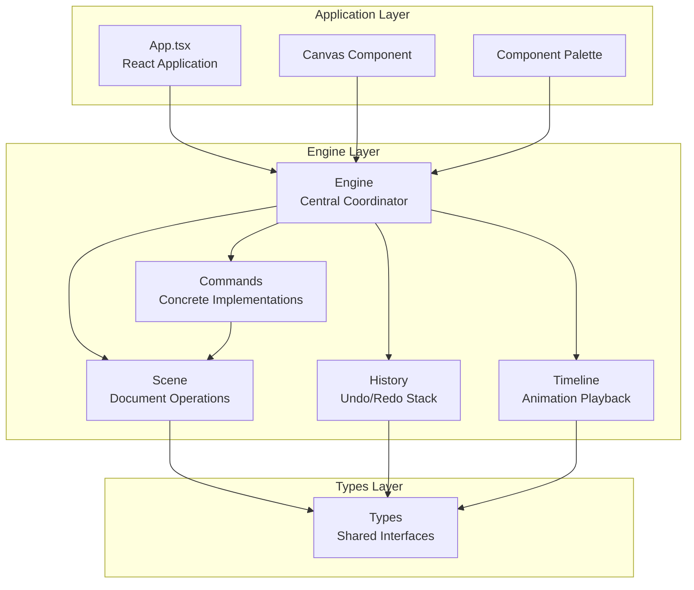
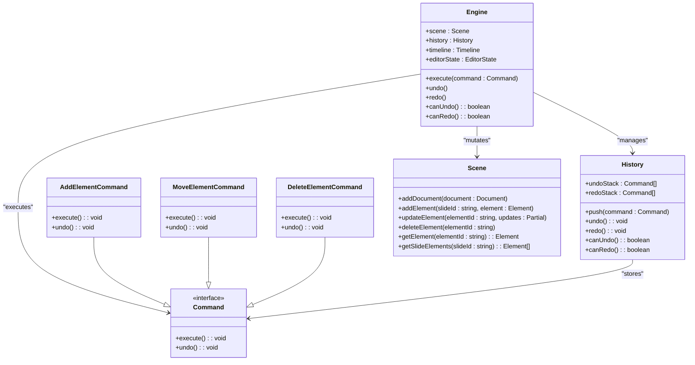
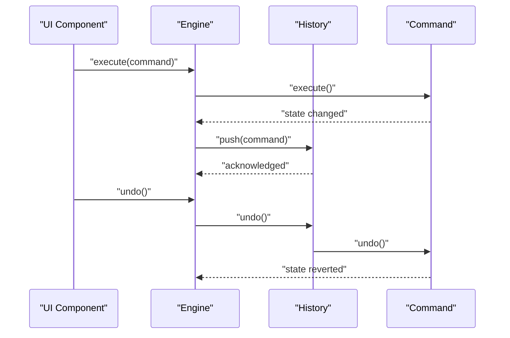

# Command Pattern System

<cite>
**Referenced Files in This Document**
- [engine/index.ts](file://src/engine/index.ts)
- [engine/engine.ts](file://src/engine/engine.ts)
- [engine/commands.ts](file://src/engine/commands.ts)
- [engine/history.ts](file://src/engine/history.ts)
- [engine/scene.ts](file://src/engine/scene.ts)
- [engine/timeline.ts](file://src/engine/timeline.ts)
- [types/index.ts](file://src/types/index.ts)
- [App.tsx](file://src/App.tsx)
</cite>

## Update Summary
**Changes Made**
- Complete implementation of command pattern with concrete command classes
- Added History management system with undo/redo functionality
- Implemented Scene graph mutation methods for element operations
- Created Timeline system for animation playback
- Added comprehensive type definitions for commands and animations
- Integrated Engine as central coordinator for all operations

## Table of Contents
1. [Introduction](#introduction)
2. [Project Structure](#project-structure)
3. [Core Components](#core-components)
4. [Architecture Overview](#architecture-overview)
5. [Detailed Component Analysis](#detailed-component-analysis)
6. [Command Implementation Details](#command-implementation-details)
7. [History Management System](#history-management-system)
8. [Scene Graph Operations](#scene-graph-operations)
9. [Timeline Integration](#timeline-integration)
10. [Type System and Interfaces](#type-system-and-interfaces)
11. [Performance Considerations](#performance-considerations)
12. [Integration Examples](#integration-examples)
13. [Conclusion](#conclusion)

## Introduction
This document describes the fully implemented command pattern system that enables undo/redo functionality and centralized state management for a presentation editor. The system provides a robust framework where all state changes flow through a central engine, ensuring consistency across the scene graph and enabling comprehensive history management. The implementation includes concrete command classes, a sophisticated history management system, and seamless integration with the timeline for animation playback.

## Project Structure
The repository follows a clean layered architecture with the engine module serving as the central coordination point:



**Diagram sources**
- [engine/index.ts:1-9](file://src/engine/index.ts#L1-L9)
- [App.tsx:1-41](file://src/App.tsx#L1-L41)

## Core Components

### Command Interface
The command pattern is implemented through a well-defined interface that ensures all operations are reversible:

- **Command Interface**: Defines the contract with `execute()` and `undo()` methods
- **Reversible Operations**: Each command captures state before and after execution
- **Atomic Operations**: Commands encapsulate complete state changes

### Engine
The Engine serves as the central coordinator managing all state changes:

- **Single Source of Truth**: All mutations must pass through `engine.execute(command)`
- **History Coordination**: Manages command execution and history stack operations
- **State Management**: Coordinates between scene, history, timeline, and editor state

### History System
A sophisticated stack-based system for managing command execution history:

- **Undo Stack**: Stores executed commands for potential reversal
- **Redo Stack**: Maintains undone commands for potential re-execution
- **State Tracking**: Provides `canUndo()` and `canRedo()` status checks

### Scene Graph
Persistent document representation with comprehensive element management:

- **Element Operations**: Add, update, delete elements with parent-child relationships
- **Group Hierarchy**: Maintains consistent group and parent-child relationships
- **Slide Management**: Handles element membership within slides

### Timeline System
Animation playback and keyframe management:

- **Playback Control**: Play, pause, seek functionality
- **Animation Management**: Stores and manages animation definitions
- **Real-time Updates**: Uses requestAnimationFrame for smooth playback

**Section sources**
- [engine/engine.ts:7-49](file://src/engine/engine.ts#L7-L49)
- [engine/history.ts:3-44](file://src/engine/history.ts#L3-L44)
- [engine/scene.ts:3-121](file://src/engine/scene.ts#L3-L121)
- [engine/timeline.ts:3-67](file://src/engine/timeline.ts#L3-L67)

## Architecture Overview
The command pattern system creates a clear separation of concerns with the Engine as the central orchestrator:



**Diagram sources**
- [engine/engine.ts:7-49](file://src/engine/engine.ts#L7-L49)
- [engine/commands.ts:4-66](file://src/engine/commands.ts#L4-L66)
- [engine/history.ts:3-44](file://src/engine/history.ts#L3-L44)
- [engine/scene.ts:3-121](file://src/engine/scene.ts#L3-L121)

## Detailed Component Analysis

### Engine Implementation
The Engine class serves as the central coordinator for all operations:

- **Constructor**: Initializes Scene, History, Timeline, and EditorState
- **Command Execution**: Executes commands and automatically pushes them to history
- **State Management**: Provides getters and setters for editor state
- **History Integration**: Delegates undo/redo operations to the History instance

**Section sources**
- [engine/engine.ts:14-49](file://src/engine/engine.ts#L14-L49)

### Command Interface Design
The Command interface defines the contract for all reversible operations:

- **execute()**: Applies the state change to the scene graph
- **undo()**: Reverses the effect of execute() using captured state
- **Type Safety**: Strongly typed with TypeScript interfaces

**Section sources**
- [types/index.ts:78-81](file://src/types/index.ts#L78-L81)

## Command Implementation Details

### AddElementCommand
Adds new elements to the scene graph:

- **Construction**: Captures scene reference, slideId, and element data
- **Execute**: Calls `scene.addElement()` to create the element
- **Undo**: Removes the element using `scene.deleteElement()`
- **State Management**: Automatically handles parent-child relationships

**Section sources**
- [engine/commands.ts:4-18](file://src/engine/commands.ts#L4-L18)

### MoveElementCommand
Moves elements by updating their properties:

- **State Capture**: Captures current element state before updates
- **Partial Updates**: Supports updating only specified properties
- **Undo Restoration**: Restores captured state during undo operations
- **Property Validation**: Only allows non-id, non-type properties

**Section sources**
- [engine/commands.ts:20-44](file://src/engine/commands.ts#L20-L44)

### DeleteElementCommand
Removes elements from the scene graph:

- **Deletion Tracking**: Captures deleted element for potential restoration
- **Cascade Removal**: Handles parent-child relationship cleanup
- **Slide Cleanup**: Removes element from all slide memberships
- **Child Detachment**: Ensures child elements are properly detached

**Section sources**
- [engine/commands.ts:46-66](file://src/engine/commands.ts#L46-L66)

## History Management System

### Stack Architecture
The History class implements a sophisticated stack-based system:

- **Undo Stack**: Commands executed in chronological order
- **Redo Stack**: Commands that can be re-executed
- **Clear Operations**: Maintains stack integrity during operations

### Operation Flow
- **Push**: Adds executed commands to undo stack, clears redo stack
- **Undo**: Pops from undo stack, executes undo(), pushes to redo stack
- **Redo**: Pops from redo stack, executes execute(), pushes to undo stack



**Diagram sources**
- [engine/engine.ts:29-32](file://src/engine/engine.ts#L29-L32)
- [engine/history.ts:12-30](file://src/engine/history.ts#L12-L30)

**Section sources**
- [engine/history.ts:3-44](file://src/engine/history.ts#L3-L44)

## Scene Graph Operations

### Element Management
The Scene class provides comprehensive element manipulation:

- **Add Element**: Creates new elements and maintains slide membership
- **Update Element**: Applies property changes with automatic validation
- **Delete Element**: Removes elements with cascade cleanup
- **Query Operations**: Retrieves elements and slide contents

### Parent-Child Relationships
Maintains consistency in hierarchical structures:

- **Group Hierarchy**: Ensures group elements properly track children
- **Parent Tracking**: Maintains parentId references for all elements
- **Relationship Cleanup**: Automatic cleanup when parents or children change

**Section sources**
- [engine/scene.ts:14-100](file://src/engine/scene.ts#L14-L100)

## Timeline Integration

### Animation Playback
The Timeline system provides real-time animation control:

- **Playback Control**: Start, pause, and seek functionality
- **Animation Storage**: Manages animation definitions with keyframes
- **Timing System**: Uses requestAnimationFrame for smooth updates
- **State Synchronization**: Integrates with scene graph for property updates

### Keyframe Management
Supports complex animation sequences:

- **Keyframe Definitions**: Time-based property values with easing
- **Animation Properties**: Supports various element properties
- **Easing Functions**: Built-in timing functions for smooth motion

**Section sources**
- [engine/timeline.ts:23-67](file://src/engine/timeline.ts#L23-L67)
- [types/index.ts:89-101](file://src/types/index.ts#L89-L101)

## Type System and Interfaces

### Element Types
Comprehensive type definitions for different element types:

- **BaseElement**: Common properties for all elements
- **ShapeElement**: Geometric shapes with fill and stroke
- **TextElement**: Text content with styling properties
- **ImageElement**: Image assets with positioning
- **GroupElement**: Container elements for grouping

### Command Types
Strongly typed command implementations:

- **Command Interface**: Defines execute/undo contracts
- **Generic Commands**: Support partial property updates
- **Type Safety**: Compile-time validation of operations

**Section sources**
- [types/index.ts:7-51](file://src/types/index.ts#L7-L51)
- [types/index.ts:78-81](file://src/types/index.ts#L78-L81)

## Performance Considerations

### Memory Management
- **Command Lifecycle**: Commands are garbage collected after undo/redo operations
- **History Limits**: Consider implementing history depth limits for large documents
- **Scene Optimization**: Efficient element lookup using id-based indexing

### Execution Efficiency
- **Batch Operations**: Consider batching multiple commands for better performance
- **Delta Updates**: Only store necessary state changes in commands
- **Lazy Evaluation**: Defer expensive operations until needed

### Timeline Performance
- **Request Animation Frame**: Uses browser optimization for smooth playback
- **Animation Caching**: Potential for caching computed animation values
- **Frame Rate Control**: Adjustable timing for different performance requirements

## Integration Examples

### Basic Command Usage
```typescript
// Create and execute commands
const addCommand = new AddElementCommand(scene, slideId, element);
engine.execute(addCommand);

// Undo the last operation
engine.undo();

// Redo the undone operation
engine.redo();
```

### Complex Operations
```typescript
// Chain multiple operations
const moveCommand = new MoveElementCommand(scene, elementId, { x: 100, y: 100 });
const scaleCommand = new MoveElementCommand(scene, elementId, { width: 200, height: 150 });

engine.execute(moveCommand);
engine.execute(scaleCommand);

// Both operations can be undone independently
engine.undo(); // Undoes scaling
engine.undo(); // Undoes moving
```

### Timeline Integration
```typescript
// Set up animations
const animations = createMockAnimations();
engine.timeline.setAnimations(animations);

// Start playback
engine.timeline.play();

// Seek to specific time
engine.timeline.seek(1000); // 1 second
```

**Section sources**
- [App.tsx:8-34](file://src/App.tsx#L8-L34)
- [types/index.ts:207-228](file://src/types/index.ts#L207-L228)

## Conclusion
The implemented command pattern system provides a robust foundation for state management, undo/redo functionality, and timeline-driven animation in the presentation editor. The system's architecture ensures consistency through centralized command execution, maintains precise history stacks for reliable operations, and integrates seamlessly with the timeline for complex animation scenarios. The concrete implementations demonstrate practical applications of the pattern while maintaining type safety and performance considerations. This foundation enables extensible development of additional commands and advanced features while preserving the system's reliability and user experience.