# Core Engine System

<cite>
**Referenced Files in This Document**
- [engine/index.ts](file://src/engine/index.ts)
- [engine/engine.ts](file://src/engine/engine.ts)
- [engine/scene.ts](file://src/engine/scene.ts)
- [engine/history.ts](file://src/engine/history.ts)
- [engine/timeline.ts](file://src/engine/timeline.ts)
- [engine/commands.ts](file://src/engine/commands.ts)
- [engine/animationCommands.ts](file://src/engine/animationCommands.ts)
- [engine/snapEngine.ts](file://src/engine/snapEngine.ts)
- [animation/index.ts](file://src/animation/index.ts)
- [animation/engine.ts](file://src/animation/engine.ts)
- [animation/scheduler.ts](file://src/animation/scheduler.ts)
- [animation/buildKeyframes.ts](file://src/animation/buildKeyframes.ts)
- [animation/gsapAdapter.ts](file://src/animation/gsapAdapter.ts)
- [animation/webAnimationAdapter.ts](file://src/animation/webAnimationAdapter.ts)
- [components/AnimationPanel.tsx](file://src/components/AnimationPanel.tsx)
- [renderer/index.tsx](file://src/renderer/index.tsx)
- [store/index.ts](file://src/store/index.ts)
- [types/index.ts](file://src/types/index.ts)
- [types/animation.ts](file://src/types/animation.ts)
- [spec.md](file://spec.md)
- [App.tsx](file://src/App.tsx)
- [main.tsx](file://src/main.tsx)
- [components/Canvas.tsx](file://src/components/Canvas.tsx)
</cite>

## Update Summary
**Changes Made**
- Enhanced Engine class documentation to include new animation command system and snap engine integration
- Updated Scene Graph architecture to include animation data management alongside elements
- Added comprehensive Animation Engine system documentation with adapter pattern
- Integrated Snap Engine for alignment and distribution functionality
- Expanded command pattern system with animation-specific commands
- Updated architecture diagrams to reflect the enhanced component structure
- Enhanced performance considerations for animation and snapping operations

## Table of Contents
1. [Introduction](#introduction)
2. [Project Structure](#project-structure)
3. [Core Components](#core-components)
4. [Architecture Overview](#architecture-overview)
5. [Detailed Component Analysis](#detailed-component-analysis)
6. [Dependency Analysis](#dependency-analysis)
7. [Performance Considerations](#performance-considerations)
8. [Troubleshooting Guide](#troubleshooting-guide)
9. [Conclusion](#conclusion)
10. [Appendices](#appendices)

## Introduction
This document describes the Core Engine System that acts as the central command execution hub for a framework-agnostic design tool engine. The system has been significantly enhanced with three major subsystems: Scene for hierarchical slide and element management, History for undo/redo functionality, Timeline for animation playback, Animation Engine for advanced animation capabilities, and Snap Engine for precise alignment and distribution. It focuses on:
- The Engine class and its role as the single source of truth for state mutations
- The Scene Graph architecture for hierarchical slide, element, and animation management
- The Command pattern enabling undo/redo functionality with animation support
- History management mechanisms
- Timeline animation system
- Animation Engine with adapter pattern for multiple animation backends
- Snap Engine for alignment and distribution functionality
- Framework-agnostic design principles and singleton enforcement
- How engine operations relate to scene graph updates
- Serialization/deserialization of commands, scene data, and animation configurations
- Plugin integration points
- Practical examples of command execution, scene traversal, and state mutation patterns
- Performance considerations, memory management, and error handling strategies

## Project Structure
The project is organized into clear layers with the enhanced engine system including animation and snapping capabilities:
- Engine: Central command execution and state orchestration with Scene, History, Timeline, Animation Engine, and Snap Engine components
- Animation: Advanced animation system with adapter pattern and scheduler
- Renderer: Pure data-to-UI rendering utilities
- Store: Editor state separate from scene data
- Types: Shared TypeScript types including animation configurations
- UI: React app shell and canvas placeholder

```mermaid
graph TB
subgraph "UI Layer"
APP["App.tsx"]
CANVAS["components/Canvas.tsx"]
ANIMATION_PANEL["components/AnimationPanel.tsx"]
MAIN["main.tsx"]
END
subgraph "Engine Layer"
ENGINE["engine/engine.ts"]
SCENE["engine/scene.ts"]
HISTORY["engine/history.ts"]
TIMELINE["engine/timeline.ts"]
COMMANDS["engine/commands.ts"]
ANIMATION_COMMANDS["engine/animationCommands.ts"]
SNAP_ENGINE["engine/snapEngine.ts"]
END
subgraph "Animation Layer"
ANIMATION_INDEX["animation/index.ts"]
ANIMATION_ENGINE["animation/engine.ts"]
SCHEDULER["animation/scheduler.ts"]
BUILD_KEYFRAMES["animation/buildKeyframes.ts"]
GSAP_ADAPTER["animation/gsapAdapter.ts"]
WEB_ANIMATION_ADAPTER["animation/webAnimationAdapter.ts"]
END
subgraph "Renderer Layer"
RENDERER["renderer/index.tsx"]
END
subgraph "State"
STORE["store/index.ts"]
TYPES["types/index.ts"]
ANIMATION_TYPES["types/animation.ts"]
END
APP --> CANVAS
CANVAS --> ANIMATION_PANEL
MAIN --> APP
CANVAS --> RENDERER
RENDERER --> ENGINE
ENGINE --> SCENE
ENGINE --> HISTORY
ENGINE --> TIMELINE
ENGINE --> COMMANDS
ENGINE --> ANIMATION_COMMANDS
ENGINE --> SNAP_ENGINE
ANIMATION_INDEX --> ANIMATION_ENGINE
ANIMATION_ENGINE --> SCHEDULER
ANIMATION_ENGINE --> BUILD_KEYFRAMES
ANIMATION_ENGINE --> GSAP_ADAPTER
ANIMATION_ENGINE --> WEB_ANIMATION_ADAPTER
ENGINE --> STORE
ENGINE --> TYPES
TYPES --> ANIMATION_TYPES
```

**Diagram sources**
- [main.tsx:1-10](file://src/main.tsx#L1-L10)
- [App.tsx:1-41](file://src/App.tsx#L1-L41)
- [components/Canvas.tsx:1-169](file://src/components/Canvas.tsx#L1-L169)
- [components/AnimationPanel.tsx:1-847](file://src/components/AnimationPanel.tsx#L1-L847)
- [engine/engine.ts:1-54](file://src/engine/engine.ts#L1-L54)
- [engine/scene.ts:1-198](file://src/engine/scene.ts#L1-L198)
- [engine/history.ts:1-45](file://src/engine/history.ts#L1-L45)
- [engine/timeline.ts:1-68](file://src/engine/timeline.ts#L1-L68)
- [engine/commands.ts:1-173](file://src/engine/commands.ts#L1-L173)
- [engine/animationCommands.ts:1-44](file://src/engine/animationCommands.ts#L1-L44)
- [engine/snapEngine.ts:1-259](file://src/engine/snapEngine.ts#L1-L259)
- [animation/index.ts:1-8](file://src/animation/index.ts#L1-L8)
- [animation/engine.ts:1-120](file://src/animation/engine.ts#L1-L120)
- [animation/scheduler.ts:1-136](file://src/animation/scheduler.ts#L1-L136)
- [renderer/index.tsx:1-135](file://src/renderer/index.tsx#L1-L135)
- [store/index.ts:1-2](file://src/store/index.ts#L1-L2)
- [types/index.ts:1-262](file://src/types/index.ts#L1-L262)
- [types/animation.ts:1-113](file://src/types/animation.ts#L1-L113)

**Section sources**
- [main.tsx:1-10](file://src/main.tsx#L1-L10)
- [App.tsx:1-41](file://src/App.tsx#L1-L41)
- [components/Canvas.tsx:1-169](file://src/components/Canvas.tsx#L1-L169)
- [components/AnimationPanel.tsx:1-847](file://src/components/AnimationPanel.tsx#L1-L847)
- [engine/engine.ts:1-54](file://src/engine/engine.ts#L1-L54)
- [engine/scene.ts:1-198](file://src/engine/scene.ts#L1-L198)
- [engine/history.ts:1-45](file://src/engine/history.ts#L1-L45)
- [engine/timeline.ts:1-68](file://src/engine/timeline.ts#L1-L68)
- [engine/commands.ts:1-173](file://src/engine/commands.ts#L1-L173)
- [engine/animationCommands.ts:1-44](file://src/engine/animationCommands.ts#L1-L44)
- [engine/snapEngine.ts:1-259](file://src/engine/snapEngine.ts#L1-L259)
- [animation/index.ts:1-8](file://src/animation/index.ts#L1-L8)
- [animation/engine.ts:1-120](file://src/animation/engine.ts#L1-L120)
- [animation/scheduler.ts:1-136](file://src/animation/scheduler.ts#L1-L136)
- [renderer/index.tsx:1-135](file://src/renderer/index.tsx#L1-L135)
- [store/index.ts:1-2](file://src/store/index.ts#L1-L2)
- [types/index.ts:1-262](file://src/types/index.ts#L1-L262)
- [types/animation.ts:1-113](file://src/types/animation.ts#L1-L113)

## Core Components
- **Engine**: The central orchestrator that coordinates Scene, History, Timeline, Animation Commands, and Snap Engine components. It enforces that all state changes must go through engine.execute(command).
- **Scene**: Manages the hierarchical structure of documents, slides, elements, and animations with CRUD operations and group hierarchy maintenance.
- **History**: Maintains undo/redo stacks for command execution with proper stack behavior.
- **Timeline**: Handles animation playback with time-based progression and requestAnimationFrame integration.
- **Animation Engine**: Advanced animation system with adapter pattern supporting multiple animation backends (Web Animations API, GSAP).
- **Snap Engine**: Provides precise alignment and distribution functionality for element positioning.
- **Commands**: Implement the Command pattern with execute and undo semantics for all scene and animation operations.
- **Renderer**: Pure function layer that renders elements given engine state.
- **Store**: Editor state (UI state, selection, panels) separated from scene data.
- **Types**: Shared type definitions for the entire system including elements, documents, animations, editor state, and snap functionality.

**Section sources**
- [engine/engine.ts:1-54](file://src/engine/engine.ts#L1-L54)
- [engine/scene.ts:1-198](file://src/engine/scene.ts#L1-L198)
- [engine/history.ts:1-45](file://src/engine/history.ts#L1-L45)
- [engine/timeline.ts:1-68](file://src/engine/timeline.ts#L1-L68)
- [engine/commands.ts:1-173](file://src/engine/commands.ts#L1-L173)
- [engine/animationCommands.ts:1-44](file://src/engine/animationCommands.ts#L1-L44)
- [engine/snapEngine.ts:1-259](file://src/engine/snapEngine.ts#L1-L259)
- [animation/engine.ts:1-120](file://src/animation/engine.ts#L1-L120)
- [renderer/index.tsx:1-135](file://src/renderer/index.tsx#L1-L135)
- [store/index.ts:1-2](file://src/store/index.ts#L1-L2)
- [types/index.ts:1-262](file://src/types/index.ts#L1-L262)

## Architecture Overview
The engine layer is framework-agnostic and acts as the single source of truth. UI components trigger interactions that produce commands. The engine executes commands against the scene graph, updates history, and notifies the renderer to re-render. Editor state (selection, panels) is kept separate in the store. The Timeline component handles animation playback independently, while the Animation Engine manages complex animation lifecycles with adapter pattern support.

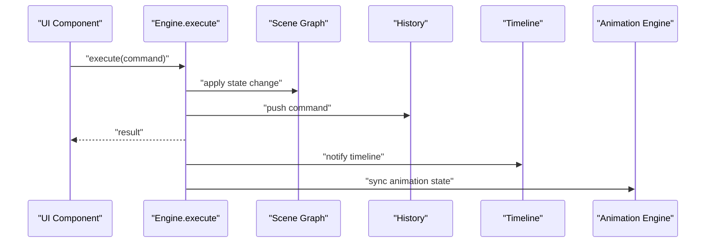

**Diagram sources**
- [engine/engine.ts:29-40](file://src/engine/engine.ts#L29-L40)
- [engine/scene.ts:14-35](file://src/engine/scene.ts#L14-L35)
- [engine/history.ts:7-10](file://src/engine/history.ts#L7-L10)
- [engine/timeline.ts:27-42](file://src/engine/timeline.ts#L27-L42)

## Detailed Component Analysis

### Engine Class
The Engine class serves as the central orchestrator, coordinating all core components: Scene, History, Timeline, Animation Commands, and Snap Engine. It maintains editor state separately and provides the single entry point for all state mutations.

- **Responsibilities**:
  - Accept commands and execute them atomically
  - Maintain scene graph, editor state, history, timeline, and animation commands
  - Provide undo/redo operations
  - Factory method createEngine() for instantiation
- **Design Principles**:
  - Singleton enforcement to ensure a single source of truth
  - All state mutations must go through engine.execute(command)
  - Framework-agnostic: no React dependencies in engine

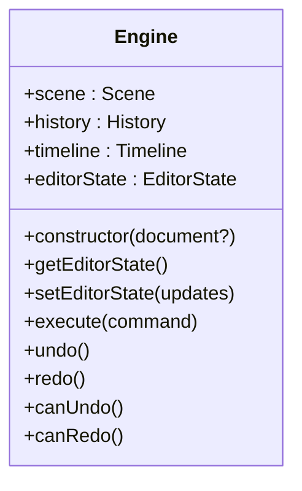

**Diagram sources**
- [engine/engine.ts:7-49](file://src/engine/engine.ts#L7-L49)

**Section sources**
- [engine/engine.ts:1-54](file://src/engine/engine.ts#L1-L54)

### Scene Graph Architecture
The Scene component manages the hierarchical structure of documents, slides, elements, and animations. It provides CRUD operations and maintains group hierarchy consistency.

- **Core Entities**:
  - **Document**: Contains elements, slides, and animations with current slide tracking
  - **Slide**: Container of element ids and animation ids with ordering and background
  - **Element**: Shape, image, text, or group with position, size, rotation, opacity, visibility, and hierarchy
  - **AnimationConfig**: Animation definitions with type, effect, timing, and parameters
  - **Group Hierarchy**: Parent-child relationships maintained through parentId and childrenIds
- **Operations**:
  - Add/update/delete/get element operations
  - Add/update/delete/get animation operations
  - Get slide elements and animations by slideId
  - Automatic group hierarchy maintenance
  - Pure data operations without React dependency

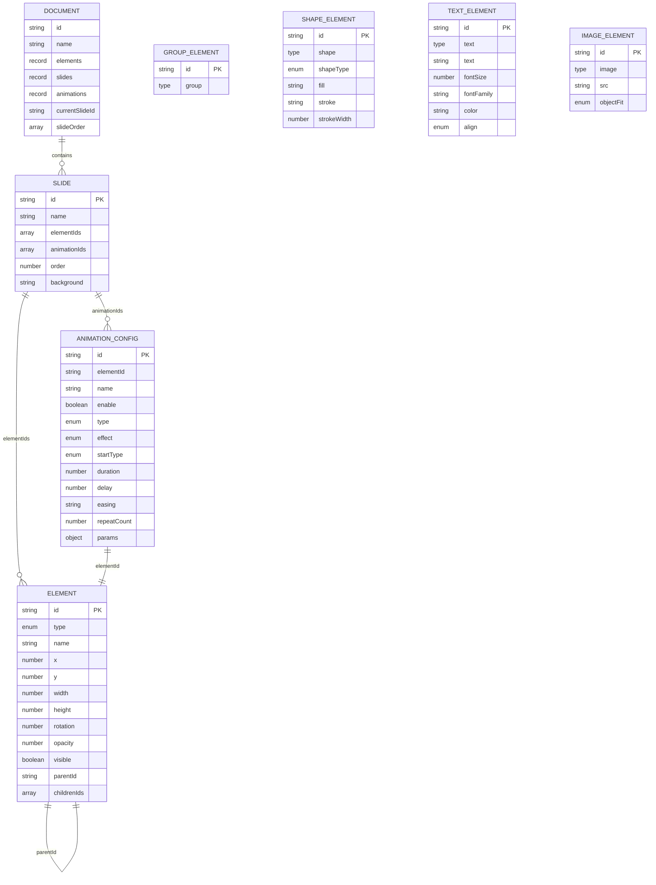

**Diagram sources**
- [types/index.ts:69-77](file://src/types/index.ts#L69-L77)
- [types/index.ts:60-67](file://src/types/index.ts#L60-L67)
- [types/index.ts:9-54](file://src/types/index.ts#L9-L54)
- [engine/scene.ts:18-62](file://src/engine/scene.ts#L18-L62)

**Section sources**
- [engine/scene.ts:1-198](file://src/engine/scene.ts#L1-L198)
- [types/index.ts:1-262](file://src/types/index.ts#L1-L262)

### Animation Command System
The animation command system implements the Command pattern specifically for animation management, providing atomic operations for animation lifecycle management.

- **Command Contract**:
  - execute(): applies the animation operation to the scene graph
  - undo(): reverses the animation operation using stored state
- **Implemented Animation Commands**:
  - **AddAnimationCommand**: Creates new animation configurations with automatic slide association
  - **RemoveAnimationCommand**: Removes animations and restores original slide positions
  - **UpdateAnimationCommand**: Updates animation properties with before/after state snapshots
  - **ReorderAnimationsCommand**: Manages animation ordering within slides
  - **BatchAnimationCommand**: Captures before/after snapshots of all animation configs for complex operations
- **State Management**:
  - Commands capture before state for undo operations
  - Automatic cleanup of animation references and relationships
  - Support for complex animation state synchronization

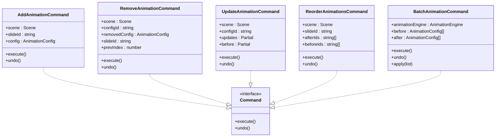

**Diagram sources**
- [engine/commands.ts:72-172](file://src/engine/commands.ts#L72-L172)
- [engine/animationCommands.ts:14-43](file://src/engine/animationCommands.ts#L14-L43)

**Section sources**
- [engine/commands.ts:1-173](file://src/engine/commands.ts#L1-L173)
- [engine/animationCommands.ts:1-44](file://src/engine/animationCommands.ts#L1-L44)

### History Management
The History component manages the undo/redo stacks with proper stack behavior and command lifecycle management.

- **Responsibilities**:
  - Maintain undo and redo stacks
  - Push executed commands to undo stack
  - Clear redo stack on new command execution
  - Execute undo/redo operations with proper command invocation
- **Integration**:
  - Engine delegates execute operations to History.push
  - Undo/redo operations delegate to History methods

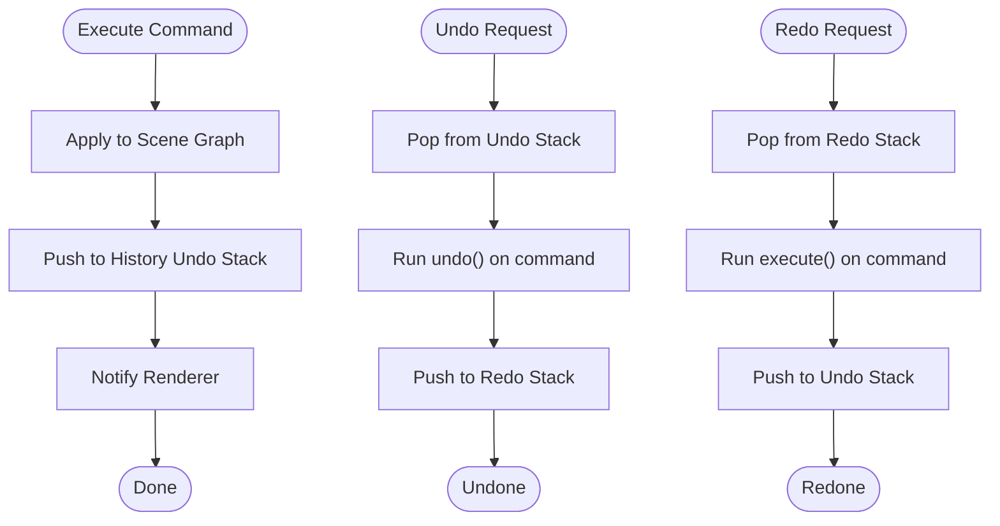

**Diagram sources**
- [engine/history.ts:7-30](file://src/engine/history.ts#L7-L30)

**Section sources**
- [engine/history.ts:1-45](file://src/engine/history.ts#L1-L45)

### Timeline Animation System
The Timeline component handles animation playback with time-based progression and requestAnimationFrame integration. It manages animation state and provides playback controls.

- **Core Features**:
  - Time-based animation progression
  - Play/pause/seek functionality
  - RequestAnimationFrame integration for smooth playback
  - Animation duration and current time tracking
- **Playback Control**:
  - Automatic time increment during play
  - Frame-based animation updates
  - Proper cleanup on pause
- **Integration**:
  - Timeline state managed independently
  - Animation data stored separately from scene data

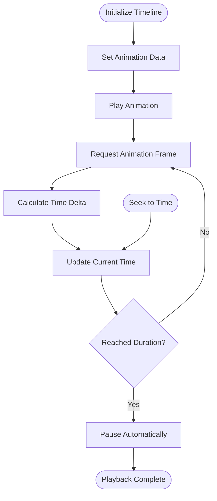

**Diagram sources**
- [engine/timeline.ts:27-66](file://src/engine/timeline.ts#L27-L66)

**Section sources**
- [engine/timeline.ts:1-68](file://src/engine/timeline.ts#L1-L68)

### Animation Engine System
The Animation Engine provides advanced animation capabilities with adapter pattern support for multiple animation backends.

- **Core Components**:
  - **AnimationEngine**: Main controller managing animation lifecycle and configuration
  - **AnimationScheduler**: Implements batch execution model for complex animation sequences
  - **AnimationAdapters**: Pluggable adapters for different animation backends (Web Animations API, GSAP)
  - **Keyframe Builder**: Converts animation configurations to WAAPI-compatible keyframes
- **Features**:
  - Multiple animation backends via adapter pattern
  - Complex animation scheduling with steps and batches
  - Lifecycle management (play, pause, stop, resume)
  - Scope-based DOM querying for preview containers
- **Integration**:
  - Works independently of scene graph
  - Synchronized with animation commands
  - Supports both individual and batch animation playback

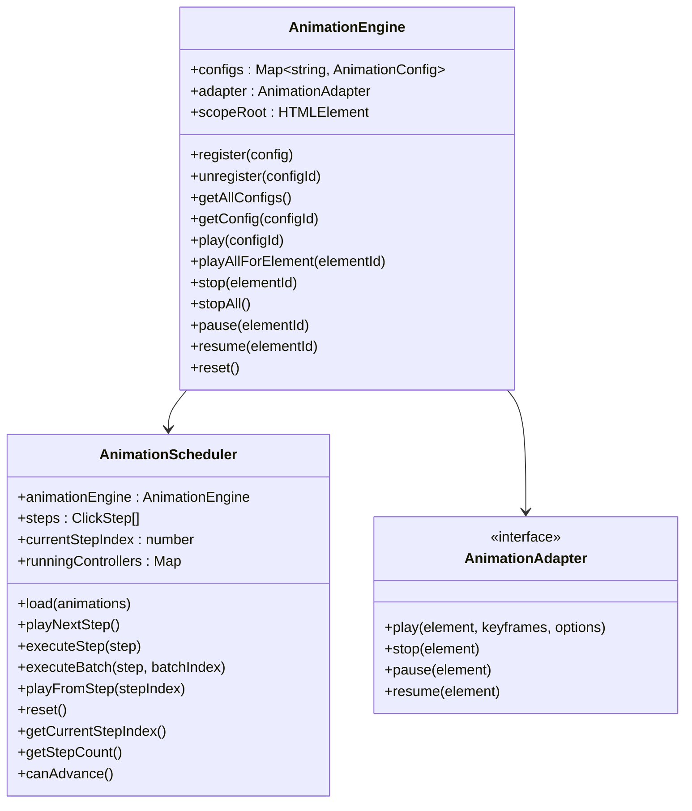

**Diagram sources**
- [animation/engine.ts:9-119](file://src/animation/engine.ts#L9-L119)
- [animation/scheduler.ts:56-135](file://src/animation/scheduler.ts#L56-L135)

**Section sources**
- [animation/engine.ts:1-120](file://src/animation/engine.ts#L1-L120)
- [animation/scheduler.ts:1-136](file://src/animation/scheduler.ts#L1-L136)
- [animation/index.ts:1-8](file://src/animation/index.ts#L1-L8)

### Snap Engine System
The Snap Engine provides precise alignment and distribution functionality for element positioning.

- **Core Features**:
  - Edge and center alignment detection
  - Equal spacing distribution calculation
  - Canvas boundary snapping
  - Threshold-based snapping precision
  - Multi-axis support (X and Y)
- **Algorithms**:
  - Priority-based snapping: center alignment > edge alignment > equal spacing
  - Distance-based threshold filtering
  - Deduplicated snap line processing
  - Distribution calculation for gaps between elements
- **Integration**:
  - Returns offset adjustments and guide lines
  - Used by move operations for precise positioning
  - Supports both individual and batch element operations

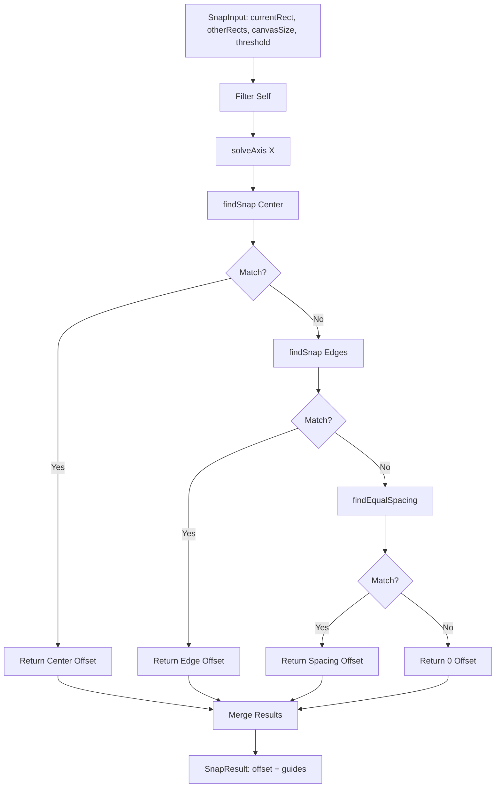

**Diagram sources**
- [engine/snapEngine.ts:242-258](file://src/engine/snapEngine.ts#L242-L258)

**Section sources**
- [engine/snapEngine.ts:1-259](file://src/engine/snapEngine.ts#L1-L259)

### Renderer Layer
The Renderer layer provides pure function rendering for different element types with React integration.

- **Capabilities**:
  - Render shapes with fill, stroke, and geometric properties
  - Render text with styling and alignment
  - Render images with object-fit properties
  - Selection outline rendering
- **Design Principle**:
  - Pure functions with no state mutation
  - React component integration
  - CSS properties computed from element data

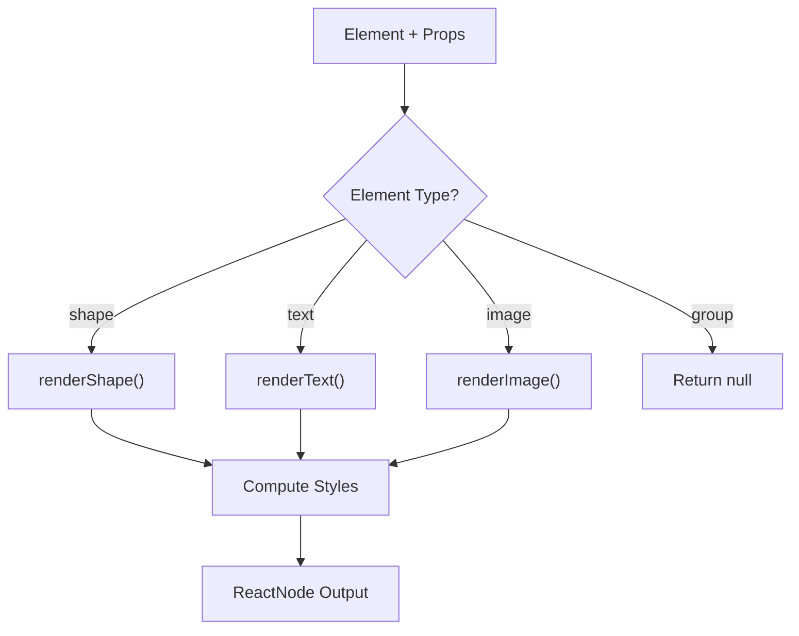

**Diagram sources**
- [renderer/index.tsx:121-134](file://src/renderer/index.tsx#L121-L134)

**Section sources**
- [renderer/index.tsx:1-135](file://src/renderer/index.tsx#L1-L135)

### Store and Editor State Separation
The Store maintains editor UI state separate from scene data, following architectural principles.

- **Purpose**:
  - Keep editor UI state (selection, panels, tool modes) separate from scene data
- **Benefits**:
  - Clear separation of concerns
  - Easier testing and serialization
- **Integration**:
  - Engine reads/writes scene graph
  - Store manages UI state

**Section sources**
- [store/index.ts:1-2](file://src/store/index.ts#L1-L2)

### Plugin Integration Points
The system provides extensibility through the Engine.createEngine factory and command system.

- **Mechanism**:
  - engine.use(plugin) to register plugins (planned)
- **Registry**:
  - Components, panels, commands, shortcuts (planned)
- **Context**:
  - PluginContext provided to plugins (planned)

**Section sources**
- [engine/engine.ts:51-53](file://src/engine/engine.ts#L51-L53)

### Practical Examples

#### Executing a Command
- **Trigger**: UI interaction (e.g., drag end)
- **Action**: Call engine.execute(AddElementCommand)
- **Outcome**: Scene graph updated, history pushed, timeline notified

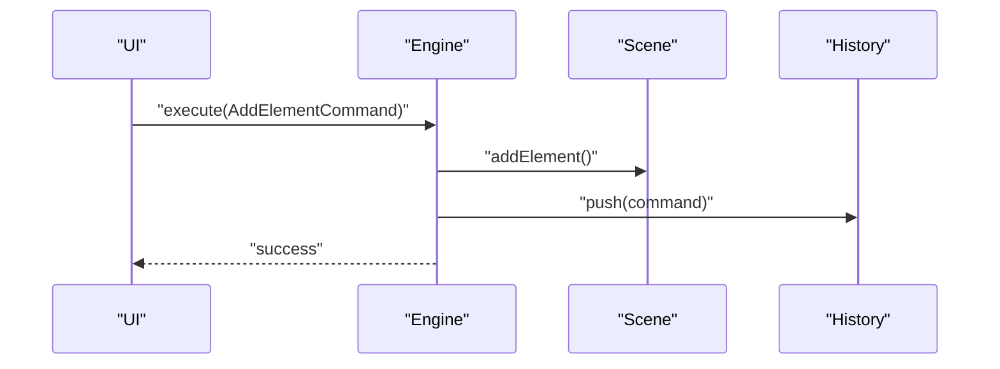

**Diagram sources**
- [engine/engine.ts:29-32](file://src/engine/engine.ts#L29-L32)
- [engine/commands.ts:11-17](file://src/engine/commands.ts#L11-L17)

#### Executing Animation Commands
- **Trigger**: Animation panel interaction
- **Action**: Call engine.execute(AddAnimationCommand)
- **Outcome**: Animation config added, animation engine synchronized, history pushed

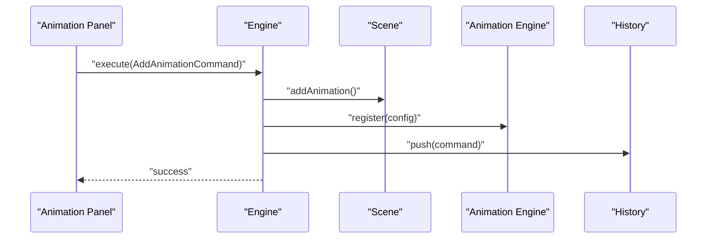

**Diagram sources**
- [components/AnimationPanel.tsx:203-213](file://src/components/AnimationPanel.tsx#L203-L213)
- [engine/commands.ts:79-85](file://src/engine/commands.ts#L79-L85)

#### Scene Graph Traversal
- **Retrieve slide elements**: getSlideElements(slideId)
- **Access element tree**: traverse via id references (parentId/childrenIds)
- **Group hierarchy**: maintain parent-child relationships automatically

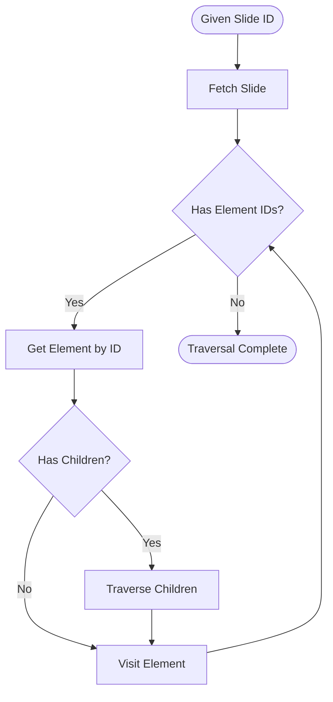

**Diagram sources**
- [engine/scene.ts:156-165](file://src/engine/scene.ts#L156-L165)

#### State Mutation Patterns
- **All mutations**: Must go through engine.execute(command)
- **Commands**: Carry state snapshots to enable undo/redo
- **Renderer**: Reacts to immutable scene updates
- **Animation Commands**: Provide atomic animation lifecycle management

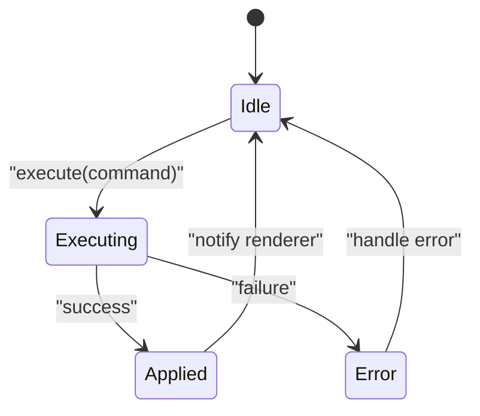

**Diagram sources**
- [engine/engine.ts:29-40](file://src/engine/engine.ts#L29-L40)
- [engine/commands.ts:11-43](file://src/engine/commands.ts#L11-L43)

## Dependency Analysis
The engine components have clear, well-defined dependencies with the renderer, animation system, and types layer.

- **Engine depends on**:
  - Scene Graph (pure data operations)
  - History (stack management)
  - Timeline (animation playback)
  - Commands (operation definitions)
  - Animation Commands (animation lifecycle)
  - Snap Engine (alignment functionality)
  - Store (editor state)
- **Animation System depends on**:
  - Animation Engine (core controller)
  - Scheduler (execution model)
  - Keyframe Builder (WAAPI conversion)
  - Adapters (backend implementations)
- **Renderer depends on**:
  - Engine for element state
  - Types for element definitions
- **UI depends on**:
  - Renderer for presentation
  - Store for editor state
  - Engine for command execution

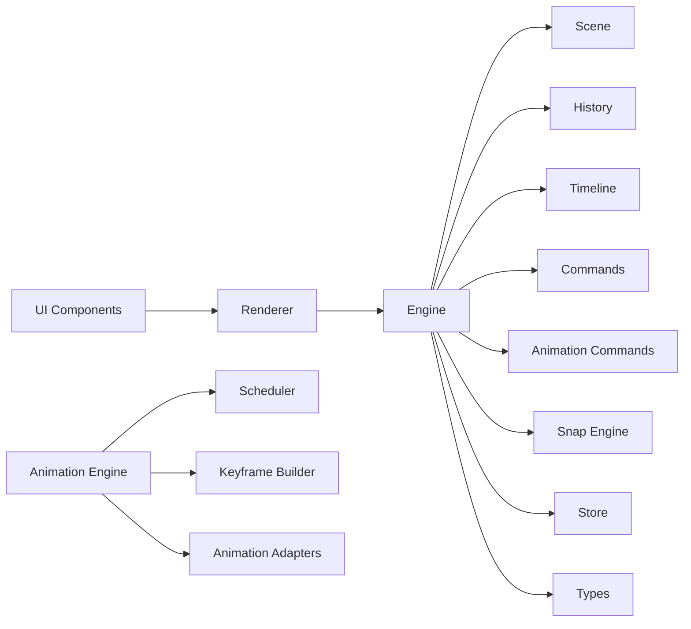

**Diagram sources**
- [renderer/index.tsx:1-135](file://src/renderer/index.tsx#L1-L135)
- [engine/engine.ts:1-54](file://src/engine/engine.ts#L1-L54)
- [engine/scene.ts:1-198](file://src/engine/scene.ts#L1-L198)
- [engine/history.ts:1-45](file://src/engine/history.ts#L1-L45)
- [engine/timeline.ts:1-68](file://src/engine/timeline.ts#L1-L68)
- [engine/commands.ts:1-173](file://src/engine/commands.ts#L1-L173)
- [engine/animationCommands.ts:1-44](file://src/engine/animationCommands.ts#L1-L44)
- [engine/snapEngine.ts:1-259](file://src/engine/snapEngine.ts#L1-L259)
- [animation/engine.ts:1-120](file://src/animation/engine.ts#L1-L120)
- [animation/scheduler.ts:1-136](file://src/animation/scheduler.ts#L1-L136)
- [store/index.ts:1-2](file://src/store/index.ts#L1-L2)
- [types/index.ts:1-262](file://src/types/index.ts#L1-L262)

**Section sources**
- [renderer/index.tsx:1-135](file://src/renderer/index.tsx#L1-L135)
- [engine/engine.ts:1-54](file://src/engine/engine.ts#L1-L54)
- [engine/scene.ts:1-198](file://src/engine/scene.ts#L1-L198)
- [engine/history.ts:1-45](file://src/engine/history.ts#L1-L45)
- [engine/timeline.ts:1-68](file://src/engine/timeline.ts#L1-L68)
- [engine/commands.ts:1-173](file://src/engine/commands.ts#L1-L173)
- [engine/animationCommands.ts:1-44](file://src/engine/animationCommands.ts#L1-L44)
- [engine/snapEngine.ts:1-259](file://src/engine/snapEngine.ts#L1-L259)
- [animation/engine.ts:1-120](file://src/animation/engine.ts#L1-L120)
- [animation/scheduler.ts:1-136](file://src/animation/scheduler.ts#L1-L136)
- [store/index.ts:1-2](file://src/store/index.ts#L1-L2)
- [types/index.ts:1-262](file://src/types/index.ts#L1-L262)

## Performance Considerations
- **Immutable scene updates**:
  - Prefer shallow copies and replace changed subtrees to minimize re-renders
- **Efficient traversal**:
  - Use id-based references to avoid deep scans; cache computed hierarchies when beneficial
- **Renderer purity**:
  - Pure functions enable easy memoization and predictable re-renders
- **Memory management**:
  - Avoid retaining references to deleted elements; clear snapshots in history judiciously
- **Command batching**:
  - Group related commands when possible to reduce history churn and re-renders
- **Timeline optimization**:
  - requestAnimationFrame provides optimal frame timing for animations
  - Proper cleanup prevents memory leaks during animation playback
- **Animation performance**:
  - Use adapter pattern to leverage native browser animations when available
  - Batch animation operations to minimize DOM queries
  - Cache keyframe calculations for repeated animations
- **Snap engine optimization**:
  - Use threshold-based filtering to avoid unnecessary calculations
  - Cache snap results for frequently moved elements
  - Limit snap calculations to visible elements only

## Troubleshooting Guide
- **Symptom**: Direct state mutation in UI components
  - **Cause**: Violates single-source-of-truth principle
  - **Fix**: Route all changes through engine.execute(command)
- **Symptom**: Undo/redo not working
  - **Cause**: Missing command implementations or incorrect stack behavior
  - **Fix**: Ensure commands implement execute and undo methods correctly
- **Symptom**: Renderer not updating
  - **Cause**: State changes bypassed engine
  - **Fix**: Ensure all mutations go through engine.execute(command)
- **Symptom**: Memory leaks
  - **Cause**: Retaining deleted element references
  - **Fix**: Clean up references and snapshots; avoid closures capturing stale state
- **Symptom**: Animation playback issues
  - **Cause**: Timeline not properly initialized or animation data missing
  - **Fix**: Ensure timeline.setAnimations() is called with proper animation data
- **Symptom**: Animation commands failing
  - **Cause**: Animation engine not properly configured or missing adapters
  - **Fix**: Initialize AnimationEngine with appropriate adapter and ensure proper registration
- **Symptom**: Snap functionality not working
  - **Cause**: Invalid snap input or threshold settings
  - **Fix**: Verify snap input parameters and adjust threshold values as needed

**Section sources**
- [engine/engine.ts:29-40](file://src/engine/engine.ts#L29-L40)
- [engine/history.ts:12-30](file://src/engine/history.ts#L12-L30)
- [engine/timeline.ts:27-46](file://src/engine/timeline.ts#L27-L46)
- [animation/engine.ts:15-17](file://src/animation/engine.ts#L15-L17)
- [engine/snapEngine.ts:242-243](file://src/engine/snapEngine.ts#L242-L243)

## Conclusion
The Core Engine System establishes a robust, framework-agnostic foundation for a design tool with significantly enhanced capabilities. The new system with Scene, History, Timeline, Animation Engine, and Snap Engine components provides a solid foundation for scalable features like rendering, animation, snapping, plugins, and collaboration. The separation of concerns between scene data and editor state, combined with the reliable Command/History system, timeline animation capabilities, advanced animation engine with adapter pattern, and precise snap functionality, ensures predictable behavior, strong undo/redo support, maintainable architecture, and professional-grade animation and alignment features.

## Appendices

### Command Execution Workflow
- **UI triggers interaction**
- **Build command with proper state snapshots**
- **engine.execute(command)**
- **Scene graph updated**
- **History pushed**
- **Timeline notified**
- **Animation engine synchronized (for animation commands)**

**Section sources**
- [engine/commands.ts:11-43](file://src/engine/commands.ts#L11-L43)
- [engine/engine.ts:29-32](file://src/engine/engine.ts#L29-L32)

### Animation Command Execution Workflow
- **UI triggers animation interaction**
- **Build animation command with proper state snapshots**
- **engine.execute(AddAnimationCommand/UpdateAnimationCommand/etc.)**
- **Scene graph updated with animation config**
- **Animation engine registers/unregisters animation**
- **History pushed**
- **Animation panel refreshed**

**Section sources**
- [components/AnimationPanel.tsx:203-236](file://src/components/AnimationPanel.tsx#L203-L236)
- [engine/commands.ts:79-171](file://src/engine/commands.ts#L79-L171)

### Serialization and Deserialization
- **Commands**:
  - Serialize command type and payload
  - Deserialize to recreate command instances
- **Scene Graph**:
  - Serialize elements as Record<string, Element>
  - Serialize animations as Record<string, AnimationConfig>
  - Deserialize to rebuild id references and hierarchy
- **Animation Configurations**:
  - Serialize animation effects, parameters, and timing
  - Support for multiple animation backends
- **Editor State**:
  - Separate store serialization/deserialization from scene data
- **Snap Engine Data**:
  - Serialize snap input parameters and results
  - Support for custom thresholds and canvas sizes

**Section sources**
- [types/index.ts:126-205](file://src/types/index.ts#L126-L205)
- [types/animation.ts:26-88](file://src/types/animation.ts#L26-L88)
- [engine/commands.ts:11-172](file://src/engine/commands.ts#L11-L172)
- [engine/snapEngine.ts:11-16](file://src/engine/snapEngine.ts#L11-L16)