# Core Engine System

<cite>
**Referenced Files in This Document**
- [engine/index.ts](file://src/engine/index.ts)
- [renderer/index.ts](file://src/renderer/index.ts)
- [store/index.ts](file://src/store/index.ts)
- [types/index.ts](file://src/types/index.ts)
- [spec.md](file://spec.md)
- [spec1.md](file://spec1.md)
- [App.tsx](file://src/App.tsx)
- [main.tsx](file://src/main.tsx)
- [components/Canvas.tsx](file://src/components/Canvas.tsx)
</cite>

## Table of Contents
1. [Introduction](#introduction)
2. [Project Structure](#project-structure)
3. [Core Components](#core-components)
4. [Architecture Overview](#architecture-overview)
5. [Detailed Component Analysis](#detailed-component-analysis)
6. [Dependency Analysis](#dependency-analysis)
7. [Performance Considerations](#performance-considerations)
8. [Troubleshooting Guide](#troubleshooting-guide)
9. [Conclusion](#conclusion)
10. [Appendices](#appendices)

## Introduction
This document describes the Core Engine System that acts as the central command execution hub for a framework-agnostic design tool engine. It focuses on:
- The Engine class and its role as the single source of truth for state mutations
- The Scene Graph architecture for hierarchical slide and element management
- The Command pattern enabling undo/redo functionality
- History management mechanisms
- Framework-agnostic design principles and singleton enforcement
- How engine operations relate to scene graph updates
- Serialization/deserialization of commands and scene data
- Plugin integration points
- Practical examples of command execution, scene traversal, and state mutation patterns
- Performance considerations, memory management, and error handling strategies

## Project Structure
The project is organized into clear layers:
- Engine: Central command execution and state orchestration
- Renderer: Pure data-to-UI rendering utilities
- Store: Editor state separate from scene data
- Types: Shared TypeScript types
- UI: React app shell and canvas placeholder

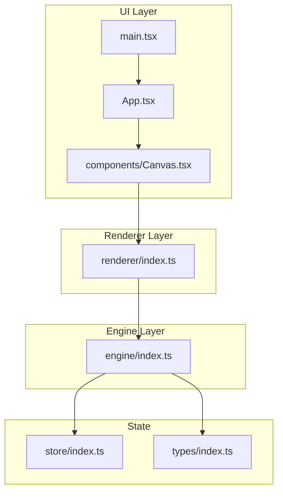

**Diagram sources**
- [main.tsx:1-10](file://src/main.tsx#L1-L10)
- [App.tsx:1-17](file://src/App.tsx#L1-L17)
- [components/Canvas.tsx:1-40](file://src/components/Canvas.tsx#L1-L40)
- [engine/index.ts:1-3](file://src/engine/index.ts#L1-L3)
- [renderer/index.ts:1-2](file://src/renderer/index.ts#L1-L2)
- [store/index.ts:1-2](file://src/store/index.ts#L1-L2)
- [types/index.ts:1-2](file://src/types/index.ts#L1-L2)

**Section sources**
- [main.tsx:1-10](file://src/main.tsx#L1-L10)
- [App.tsx:1-17](file://src/App.tsx#L1-L17)
- [components/Canvas.tsx:1-40](file://src/components/Canvas.tsx#L1-L40)
- [engine/index.ts:1-3](file://src/engine/index.ts#L1-L3)
- [renderer/index.ts:1-2](file://src/renderer/index.ts#L1-L2)
- [store/index.ts:1-2](file://src/store/index.ts#L1-L2)
- [types/index.ts:1-2](file://src/types/index.ts#L1-L2)

## Core Components
- Engine: Enforces that all state changes must go through engine.execute(command). It coordinates scene graph operations, history, and timeline interactions.
- Scene Graph: Defines Documents, Slides, Elements, Animations, and Keyframes with id-based references and hierarchical children.
- Command System: Commands encapsulate state transitions with execute and undo semantics and carry prev/next snapshots.
- History: Manages past/future stacks for undo/redo with correct stack behavior.
- Renderer: Pure function layer that renders elements given engine state.
- Store: Editor state (UI state, selection, panels) separated from scene data.
- Types: Shared type definitions for the entire system.

**Section sources**
- [engine/index.ts:1-3](file://src/engine/index.ts#L1-L3)
- [renderer/index.ts:1-2](file://src/renderer/index.ts#L1-L2)
- [store/index.ts:1-2](file://src/store/index.ts#L1-L2)
- [types/index.ts:1-2](file://src/types/index.ts#L1-L2)
- [spec.md:41-134](file://spec.md#L41-L134)
- [spec1.md:98-146](file://spec1.md#L98-L146)

## Architecture Overview
The engine layer is framework-agnostic and acts as the single source of truth. UI components trigger interactions that produce commands. The engine executes commands against the scene graph, updates history, and notifies the renderer to re-render. Editor state (selection, panels) is kept separate in the store.

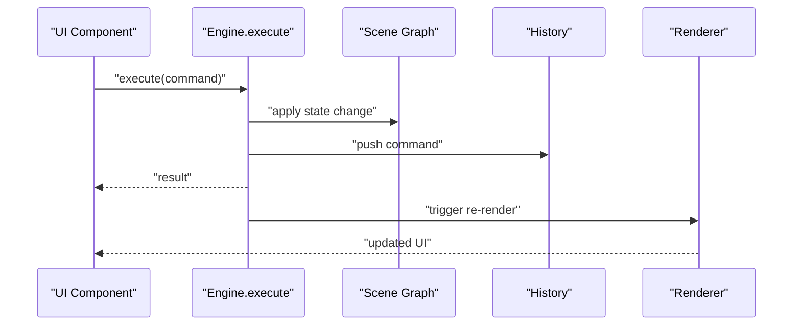

**Diagram sources**
- [engine/index.ts:1-3](file://src/engine/index.ts#L1-L3)
- [renderer/index.ts:1-2](file://src/renderer/index.ts#L1-L2)
- [spec1.md:98-146](file://spec1.md#L98-L146)

## Detailed Component Analysis

### Engine Class
- Responsibilities:
  - Accept commands and execute them atomically
  - Maintain scene graph, editor state, history, and timeline
  - Provide undo/redo operations
  - Factory method createEngine() for instantiation
- Design Principles:
  - Singleton enforcement to ensure a single source of truth
  - All state mutations must go through engine.execute(command)
  - Framework-agnostic: no React dependencies in engine

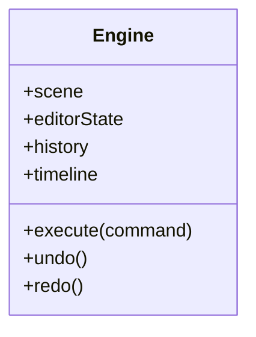

**Diagram sources**
- [engine/index.ts:1-3](file://src/engine/index.ts#L1-L3)
- [spec1.md:98-111](file://spec1.md#L98-L111)

**Section sources**
- [engine/index.ts:1-3](file://src/engine/index.ts#L1-L3)
- [spec1.md:98-111](file://spec1.md#L98-L111)

### Scene Graph Architecture
- Core Entities:
  - Document: Contains nodes and slides
  - Slide: Container of element ids
  - Element: Shape, image, text, or group with position, size, rotation, z-index, props, optional animations
  - Animation: Enter/emphasis/path with start, duration, easing, optional trigger and keyframes
  - Keyframe: Offset with partial property set (x, y, scale, rotate, opacity)
- Relationships:
  - Elements reference parent by id
  - Children are referenced by id (no nested objects)
  - Elements stored as Record<string, Element>
- Operations:
  - Add/update/delete/get element
  - Get slide elements
  - Pure data operations without React dependency

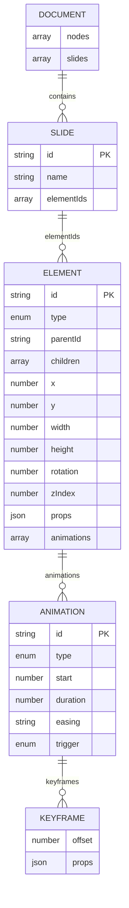

**Diagram sources**
- [spec.md:47-134](file://spec.md#L47-L134)

**Section sources**
- [spec.md:47-134](file://spec.md#L47-L134)
- [spec1.md:81-95](file://spec1.md#L81-L95)

### Command Pattern System
- Command contract:
  - execute(): applies the operation to the scene graph
  - undo(): reverses the operation using snapshot payloads
- Payload requirement:
  - prev/next snapshots included in command payload
- Implemented commands:
  - AddElementCommand
  - MoveElementCommand
  - DeleteElementCommand

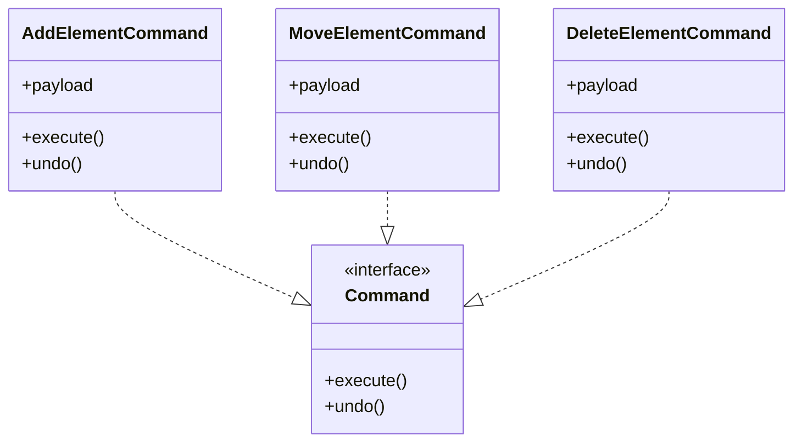

**Diagram sources**
- [spec1.md:114-130](file://spec1.md#L114-L130)

**Section sources**
- [spec1.md:114-130](file://spec1.md#L114-L130)

### History Management
- Responsibilities:
  - Maintain past and future stacks
  - Push executed commands
  - Undo/redo with correct stack behavior
- Integration:
  - Engine invokes history.push after successful execution
  - Engine.undo/redo delegate to history

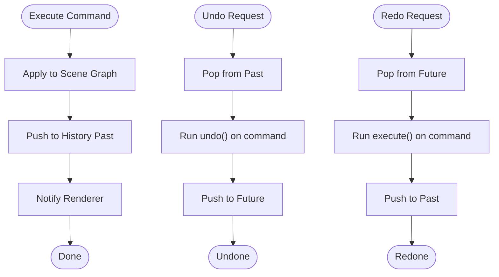

**Diagram sources**
- [spec1.md:133-146](file://spec1.md#L133-L146)

**Section sources**
- [spec1.md:133-146](file://spec1.md#L133-L146)

### Renderer Layer
- Responsibilities:
  - renderElement(element, engine): pure function rendering
  - Support shapes, text, images
  - Apply transforms (x, y, width, height, rotation)
- Design Principle:
  - Pure functions with no state mutation

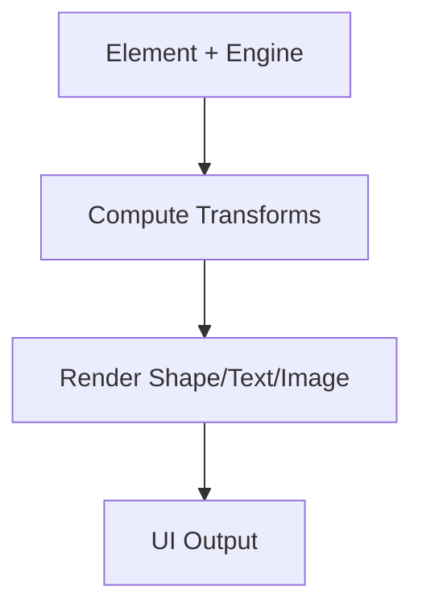

**Diagram sources**
- [renderer/index.ts:1-2](file://src/renderer/index.ts#L1-L2)
- [spec1.md:149-163](file://spec1.md#L149-L163)

**Section sources**
- [renderer/index.ts:1-2](file://src/renderer/index.ts#L1-L2)
- [spec1.md:149-163](file://spec1.md#L149-L163)

### Store and Editor State Separation
- Purpose:
  - Keep editor UI state (selection, panels, tool modes) separate from scene data
- Benefits:
  - Clear separation of concerns
  - Easier testing and serialization
- Integration:
  - Engine reads/writes scene graph
  - Store manages UI state

**Section sources**
- [store/index.ts:1-2](file://src/store/index.ts#L1-L2)
- [spec1.md:23-41](file://spec1.md#L23-L41)

### Plugin Integration Points
- Mechanism:
  - engine.use(plugin) to register plugins
- Registry:
  - Components, panels, commands, shortcuts
- Context:
  - PluginContext provided to plugins
- Example:
  - Register video component, panel, delete shortcut

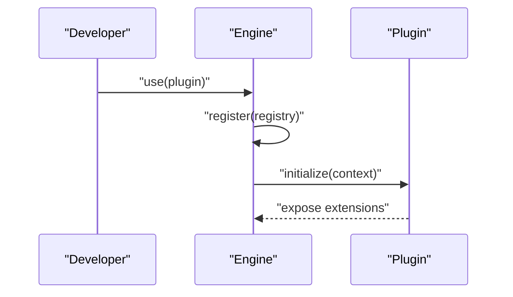

**Diagram sources**
- [spec1.md:218-236](file://spec1.md#L218-L236)

**Section sources**
- [spec1.md:218-236](file://spec1.md#L218-L236)

### Practical Examples

#### Executing a Command
- Trigger: UI interaction (e.g., drag end)
- Action: Call engine.execute(MoveElementCommand)
- Outcome: Scene graph updated, history pushed, renderer notified

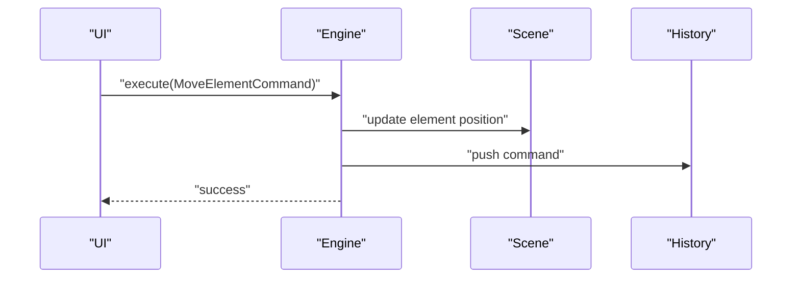

**Diagram sources**
- [spec1.md:166-181](file://spec1.md#L166-L181)
- [engine/index.ts:1-3](file://src/engine/index.ts#L1-L3)

#### Scene Graph Traversal
- Retrieve slide elements: getSlideElements(slideId)
- Access element tree via id references (parent/children)
- Traverse hierarchy to compute derived state (e.g., global transforms)

**Diagram sources**
- [spec1.md:81-95](file://spec1.md#L81-L95)
- [spec.md:70-103](file://spec.md#L70-L103)

#### State Mutation Patterns
- All mutations must go through engine.execute(command)
- Commands carry prev/next snapshots to enable undo/redo
- Renderer reacts to immutable scene updates

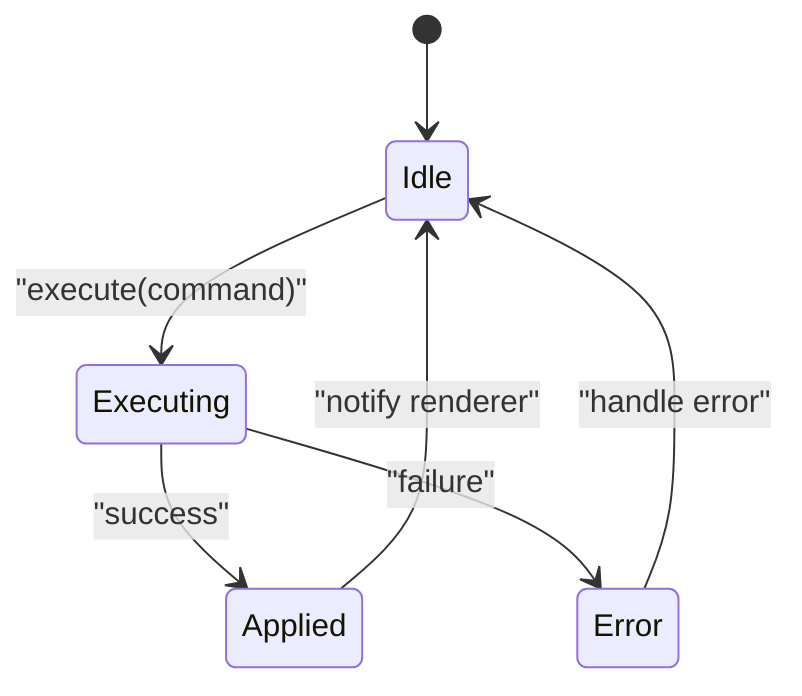

**Diagram sources**
- [engine/index.ts:1-3](file://src/engine/index.ts#L1-L3)
- [spec1.md:114-130](file://spec1.md#L114-L130)

## Dependency Analysis
- Engine depends on:
  - Scene Graph (pure data operations)
  - History (stack management)
  - Renderer (pure rendering)
  - Store (editor state)
- Renderer depends on:
  - Engine for element state
  - Types for element definitions
- UI depends on:
  - Renderer for presentation
  - Store for editor state
  - Engine for command execution

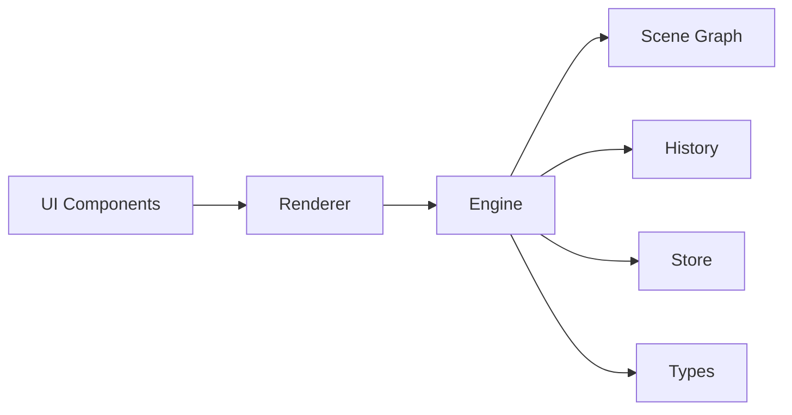

**Diagram sources**
- [renderer/index.ts:1-2](file://src/renderer/index.ts#L1-L2)
- [engine/index.ts:1-3](file://src/engine/index.ts#L1-L3)
- [store/index.ts:1-2](file://src/store/index.ts#L1-L2)
- [types/index.ts:1-2](file://src/types/index.ts#L1-L2)

**Section sources**
- [renderer/index.ts:1-2](file://src/renderer/index.ts#L1-L2)
- [engine/index.ts:1-3](file://src/engine/index.ts#L1-L3)
- [store/index.ts:1-2](file://src/store/index.ts#L1-L2)
- [types/index.ts:1-2](file://src/types/index.ts#L1-L2)

## Performance Considerations
- Immutable scene updates:
  - Prefer shallow copies and replace changed subtrees to minimize re-renders
- Efficient traversal:
  - Use id-based references to avoid deep scans; cache computed hierarchies when beneficial
- Renderer purity:
  - Pure functions enable easy memoization and predictable re-renders
- Memory management:
  - Avoid retaining references to deleted elements; clear snapshots in history judiciously
- Command batching:
  - Group related commands when possible to reduce history churn and re-renders

## Troubleshooting Guide
- Symptom: Direct state mutation in UI components
  - Cause: Violates single-source-of-truth principle
  - Fix: Route all changes through engine.execute(command)
- Symptom: Undo/redo not working
  - Cause: Missing prev/next snapshots or incorrect stack behavior
  - Fix: Ensure commands include snapshots and history.push/undo/redo are called correctly
- Symptom: Renderer not updating
  - Cause: State changes bypassed engine
  - Fix: Ensure all mutations go through engine.execute(command)
- Symptom: Memory leaks
  - Cause: Retaining deleted element references
  - Fix: Clean up references and snapshots; avoid closures capturing stale state

**Section sources**
- [engine/index.ts:1-3](file://src/engine/index.ts#L1-L3)
- [spec1.md:133-146](file://spec1.md#L133-L146)
- [spec1.md:23-41](file://spec1.md#L23-L41)

## Conclusion
The Core Engine System establishes a robust, framework-agnostic foundation for a design tool. By enforcing a single command execution path, maintaining a clear separation between scene data and editor state, and implementing a reliable Command/History system, it enables scalable features like rendering, animation, snapping, plugins, and collaboration. Following the documented patterns ensures predictable behavior, strong undo/redo support, and maintainable architecture.

## Appendices

### Command Execution Workflow
- UI triggers interaction
- Build command with prev/next snapshots
- engine.execute(command)
- Scene graph updated
- History pushed
- Renderer re-renders

**Section sources**
- [spec1.md:114-130](file://spec1.md#L114-L130)
- [spec1.md:166-181](file://spec1.md#L166-L181)

### Serialization and Deserialization
- Commands:
  - Serialize command type and payload
  - Deserialize to recreate command instances
- Scene Graph:
  - Serialize elements as Record<string, Element>
  - Deserialize to rebuild id references and hierarchy
- Editor State:
  - Separate store serialization/deserialization from scene data

**Section sources**
- [spec.md:82-103](file://spec.md#L82-L103)
- [spec1.md:114-130](file://spec1.md#L114-L130)