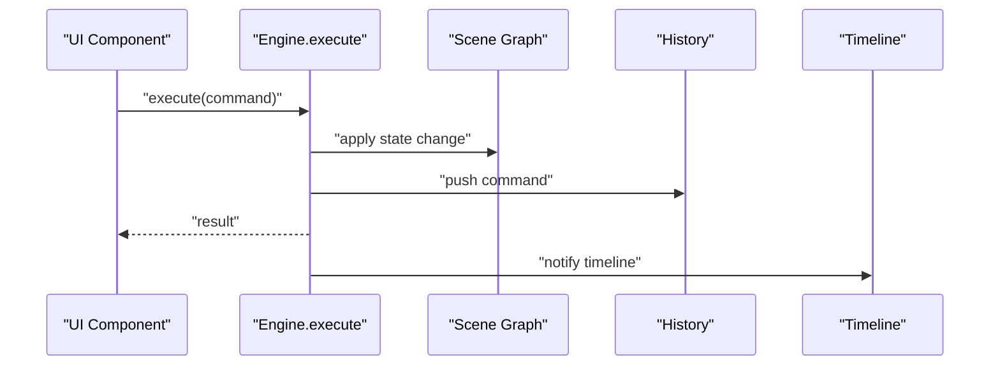
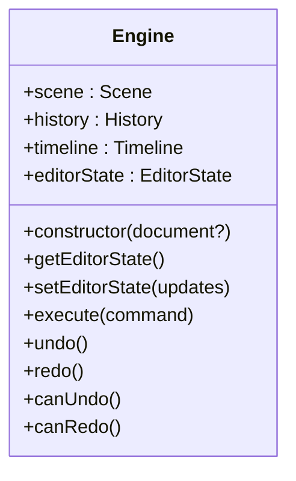
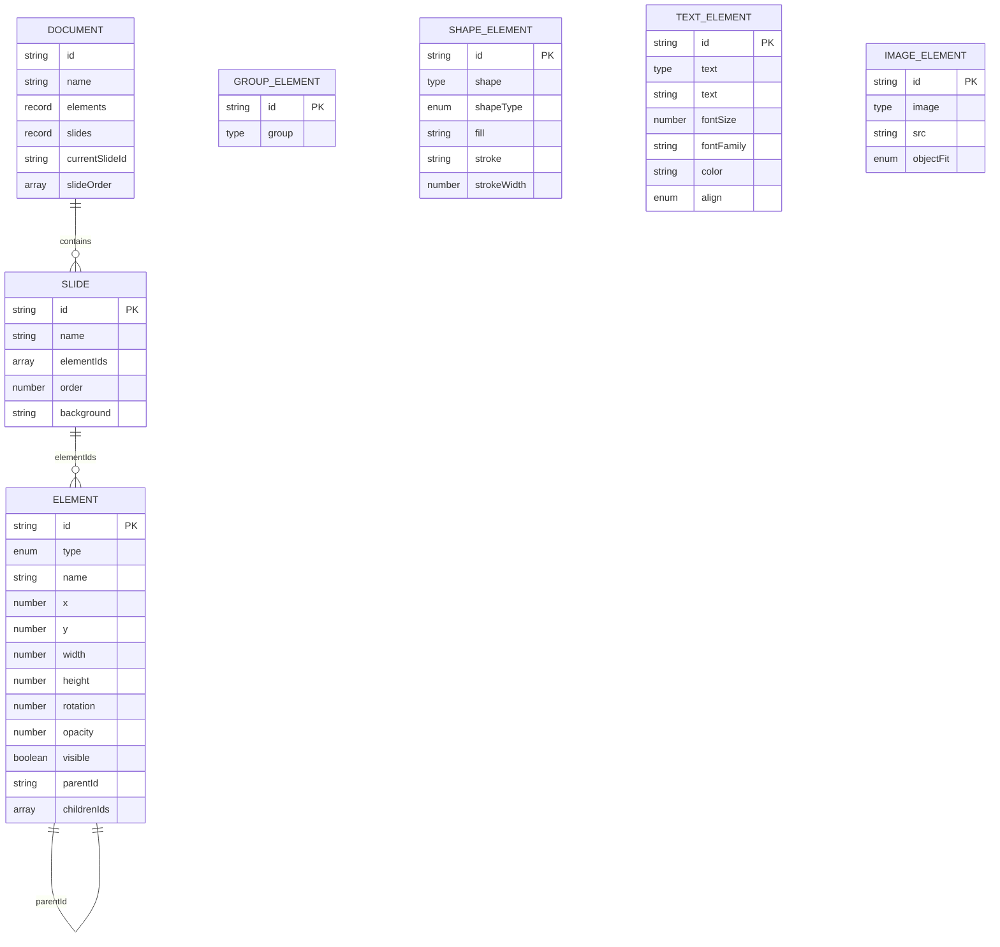
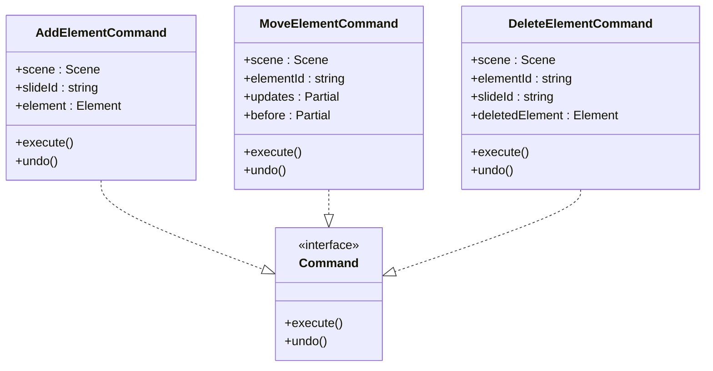
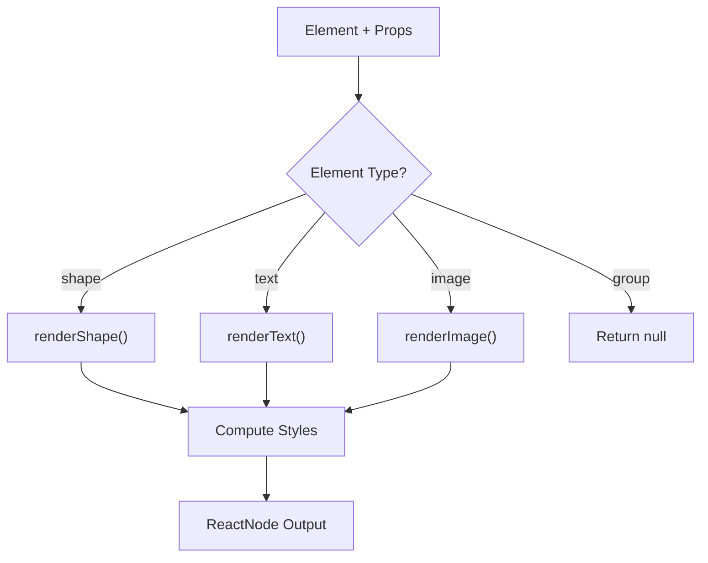
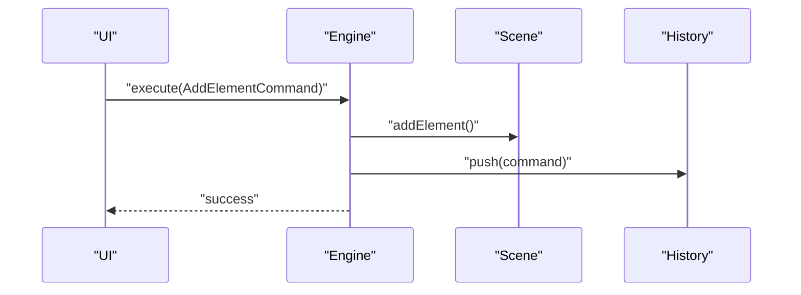
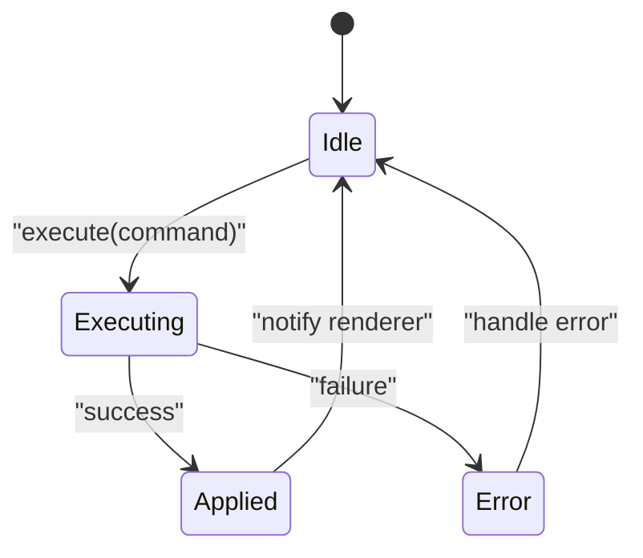
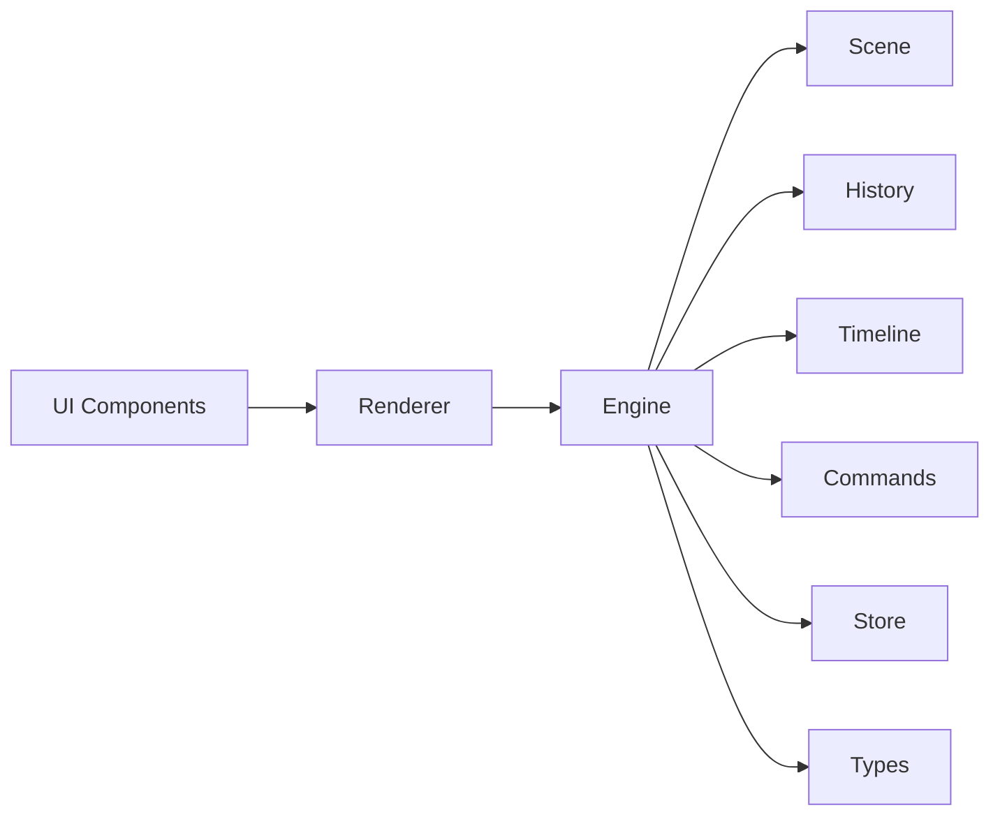

# Core Engine System

<cite>
**Referenced Files in This Document**
- [engine/index.ts](file://src/engine/index.ts)
- [engine/engine.ts](file://src/engine/engine.ts)
- [engine/scene.ts](file://src/engine/scene.ts)
- [engine/history.ts](file://src/engine/history.ts)
- [engine/timeline.ts](file://src/engine/timeline.ts)
- [engine/commands.ts](file://src/engine/commands.ts)
- [renderer/index.tsx](file://src/renderer/index.tsx)
- [store/index.ts](file://src/store/index.ts)
- [types/index.ts](file://src/types/index.ts)
- [spec.md](file://spec.md)
- [App.tsx](file://src/App.tsx)
- [main.tsx](file://src/main.tsx)
- [components/Canvas.tsx](file://src/components/Canvas.tsx)
</cite>

## Update Summary
**Changes Made**
- Completely rewritten Engine class documentation to reflect the new implementation with Scene, History, and Timeline components
- Updated Scene Graph architecture to match the actual TypeScript implementation
- Added comprehensive Timeline component documentation
- Revised command pattern system with actual command implementations
- Updated architecture diagrams to reflect the new component structure
- Enhanced performance considerations and troubleshooting guidance

## Table of Contents
1. [Introduction](#introduction)
2. [Project Structure](#project-structure)
3. [Core Components](#core-components)
4. [Architecture Overview](#architecture-overview)
5. [Detailed Component Analysis](#detailed-component-analysis)
6. [Dependency Analysis](#dependency-analysis)
7. [Performance Considerations](#performance-considerations)
8. [Troubleshooting Guide](#troubleshooting-guide)
9. [Conclusion](#conclusion)
10. [Appendices](#appendices)

## Introduction
This document describes the Core Engine System that acts as the central command execution hub for a framework-agnostic design tool engine. The system has been completely redesigned with three core components: Scene for hierarchical slide and element management, History for undo/redo functionality, and Timeline for animation playback. It focuses on:
- The Engine class and its role as the single source of truth for state mutations
- The Scene Graph architecture for hierarchical slide and element management
- The Command pattern enabling undo/redo functionality
- History management mechanisms
- Timeline animation system
- Framework-agnostic design principles and singleton enforcement
- How engine operations relate to scene graph updates
- Serialization/deserialization of commands and scene data
- Plugin integration points
- Practical examples of command execution, scene traversal, and state mutation patterns
- Performance considerations, memory management, and error handling strategies

## Project Structure
The project is organized into clear layers with the new engine system:
- Engine: Central command execution and state orchestration with Scene, History, and Timeline components
- Renderer: Pure data-to-UI rendering utilities
- Store: Editor state separate from scene data
- Types: Shared TypeScript types
- UI: React app shell and canvas placeholder

```mermaid
graph TB
subgraph "UI Layer"
APP["App.tsx"]
CANVAS["components/Canvas.tsx"]
MAIN["main.tsx"]
END
subgraph "Engine Layer"
ENGINE["engine/engine.ts"]
SCENE["engine/scene.ts"]
HISTORY["engine/history.ts"]
TIMELINE["engine/timeline.ts"]
COMMANDS["engine/commands.ts"]
END
subgraph "Renderer Layer"
RENDERER["renderer/index.tsx"]
END
subgraph "State"
STORE["store/index.ts"]
TYPES["types/index.ts"]
END
APP --> CANVAS
MAIN --> APP
CANVAS --> RENDERER
RENDERER --> ENGINE
ENGINE --> SCENE
ENGINE --> HISTORY
ENGINE --> TIMELINE
ENGINE --> COMMANDS
ENGINE --> STORE
ENGINE --> TYPES
```

**Diagram sources**
- [main.tsx:1-10](file://src/main.tsx#L1-L10)
- [App.tsx:1-41](file://src/App.tsx#L1-L41)
- [components/Canvas.tsx:1-169](file://src/components/Canvas.tsx#L1-L169)
- [engine/engine.ts:1-54](file://src/engine/engine.ts#L1-L54)
- [engine/scene.ts:1-146](file://src/engine/scene.ts#L1-L146)
- [engine/history.ts:1-45](file://src/engine/history.ts#L1-L45)
- [engine/timeline.ts:1-68](file://src/engine/timeline.ts#L1-L68)
- [engine/commands.ts:1-67](file://src/engine/commands.ts#L1-L67)
- [renderer/index.tsx:1-135](file://src/renderer/index.tsx#L1-L135)
- [store/index.ts:1-2](file://src/store/index.ts#L1-L2)
- [types/index.ts:1-238](file://src/types/index.ts#L1-L238)

**Section sources**
- [main.tsx:1-10](file://src/main.tsx#L1-L10)
- [App.tsx:1-41](file://src/App.tsx#L1-L41)
- [components/Canvas.tsx:1-169](file://src/components/Canvas.tsx#L1-L169)
- [engine/engine.ts:1-54](file://src/engine/engine.ts#L1-L54)
- [engine/scene.ts:1-146](file://src/engine/scene.ts#L1-L146)
- [engine/history.ts:1-45](file://src/engine/history.ts#L1-L45)
- [engine/timeline.ts:1-68](file://src/engine/timeline.ts#L1-L68)
- [engine/commands.ts:1-67](file://src/engine/commands.ts#L1-L67)
- [renderer/index.tsx:1-135](file://src/renderer/index.tsx#L1-L135)
- [store/index.ts:1-2](file://src/store/index.ts#L1-L2)
- [types/index.ts:1-238](file://src/types/index.ts#L1-L238)

## Core Components
- **Engine**: The central orchestrator that coordinates Scene, History, and Timeline components. It enforces that all state changes must go through engine.execute(command).
- **Scene**: Manages the hierarchical slide and element structure with CRUD operations and group hierarchy maintenance.
- **History**: Maintains undo/redo stacks for command execution with proper stack behavior.
- **Timeline**: Handles animation playback with time-based progression and requestAnimationFrame integration.
- **Commands**: Implement the Command pattern with execute and undo semantics for all scene operations.
- **Renderer**: Pure function layer that renders elements given engine state.
- **Store**: Editor state (UI state, selection, panels) separated from scene data.
- **Types**: Shared type definitions for the entire system including elements, documents, animations, and editor state.

**Section sources**
- [engine/engine.ts:1-54](file://src/engine/engine.ts#L1-L54)
- [engine/scene.ts:1-146](file://src/engine/scene.ts#L1-L146)
- [engine/history.ts:1-45](file://src/engine/history.ts#L1-L45)
- [engine/timeline.ts:1-68](file://src/engine/timeline.ts#L1-L68)
- [engine/commands.ts:1-67](file://src/engine/commands.ts#L1-L67)
- [renderer/index.tsx:1-135](file://src/renderer/index.tsx#L1-L135)
- [store/index.ts:1-2](file://src/store/index.ts#L1-L2)
- [types/index.ts:1-238](file://src/types/index.ts#L1-L238)

## Architecture Overview
The engine layer is framework-agnostic and acts as the single source of truth. UI components trigger interactions that produce commands. The engine executes commands against the scene graph, updates history, and notifies the renderer to re-render. Editor state (selection, panels) is kept separate in the store. The Timeline component handles animation playback independently.



**Diagram sources**
- [engine/engine.ts:29-40](file://src/engine/engine.ts#L29-L40)
- [engine/scene.ts:14-35](file://src/engine/scene.ts#L14-L35)
- [engine/history.ts:7-10](file://src/engine/history.ts#L7-L10)
- [engine/timeline.ts:27-42](file://src/engine/timeline.ts#L27-L42)

## Detailed Component Analysis

### Engine Class
The Engine class serves as the central orchestrator, coordinating all three core components: Scene, History, and Timeline. It maintains editor state separately and provides the single entry point for all state mutations.

- **Responsibilities**:
  - Accept commands and execute them atomically
  - Maintain scene graph, editor state, history, and timeline
  - Provide undo/redo operations
  - Factory method createEngine() for instantiation
- **Design Principles**:
  - Singleton enforcement to ensure a single source of truth
  - All state mutations must go through engine.execute(command)
  - Framework-agnostic: no React dependencies in engine



**Diagram sources**
- [engine/engine.ts:7-49](file://src/engine/engine.ts#L7-L49)

**Section sources**
- [engine/engine.ts:1-54](file://src/engine/engine.ts#L1-L54)

### Scene Graph Architecture
The Scene component manages the hierarchical structure of documents, slides, and elements. It provides CRUD operations and maintains group hierarchy consistency.

- **Core Entities**:
  - **Document**: Contains elements and slides with current slide tracking
  - **Slide**: Container of element ids with ordering and background
  - **Element**: Shape, image, text, or group with position, size, rotation, opacity, visibility, and hierarchy
  - **Group Hierarchy**: Parent-child relationships maintained through parentId and childrenIds
- **Operations**:
  - Add/update/delete/get element operations
  - Get slide elements by slideId
  - Automatic group hierarchy maintenance
  - Pure data operations without React dependency



**Diagram sources**
- [types/index.ts:65-72](file://src/types/index.ts#L65-L72)
- [types/index.ts:57-63](file://src/types/index.ts#L57-L63)
- [types/index.ts:9-51](file://src/types/index.ts#L9-L51)
- [engine/scene.ts:14-100](file://src/engine/scene.ts#L14-L100)

**Section sources**
- [engine/scene.ts:1-146](file://src/engine/scene.ts#L1-L146)
- [types/index.ts:1-238](file://src/types/index.ts#L1-L238)

### Command Pattern System
The command system implements the Command pattern with concrete implementations for all scene operations. Each command encapsulates state transitions with execute and undo semantics.

- **Command Contract**:
  - execute(): applies the operation to the scene graph
  - undo(): reverses the operation using stored state
- **Implemented Commands**:
  - **AddElementCommand**: Creates new elements with automatic slide and group hierarchy updates
  - **MoveElementCommand**: Updates element properties with before/after state snapshots
  - **DeleteElementCommand**: Removes elements and cleans up parent-child relationships
- **State Management**:
  - Commands capture before state for undo operations
  - Automatic cleanup of references and relationships



**Diagram sources**
- [engine/commands.ts:4-66](file://src/engine/commands.ts#L4-L66)
- [types/index.ts:78-81](file://src/types/index.ts#L78-L81)

**Section sources**
- [engine/commands.ts:1-67](file://src/engine/commands.ts#L1-L67)
- [types/index.ts:78-81](file://src/types/index.ts#L78-L81)

### History Management
The History component manages the undo/redo stacks with proper stack behavior and command lifecycle management.

- **Responsibilities**:
  - Maintain undo and redo stacks
  - Push executed commands to undo stack
  - Clear redo stack on new command execution
  - Execute undo/redo operations with proper command invocation
- **Integration**:
  - Engine delegates execute operations to History.push
  - Undo/redo operations delegate to History methods


**Diagram sources**
- [engine/history.ts:7-30](file://src/engine/history.ts#L7-L30)

**Section sources**
- [engine/history.ts:1-45](file://src/engine/history.ts#L1-L45)

### Timeline Animation System
The Timeline component handles animation playback with time-based progression and requestAnimationFrame integration. It manages animation state and provides playback controls.

- **Core Features**:
  - Time-based animation progression
  - Play/pause/seek functionality
  - RequestAnimationFrame integration for smooth playback
  - Animation duration and current time tracking
- **Playback Control**:
  - Automatic time increment during play
  - Frame-based animation updates
  - Proper cleanup on pause
- **Integration**:
  - Timeline state managed independently
  - Animation data stored separately from scene data


**Diagram sources**
- [engine/timeline.ts:27-66](file://src/engine/timeline.ts#L27-L66)

**Section sources**
- [engine/timeline.ts:1-68](file://src/engine/timeline.ts#L1-L68)

### Renderer Layer
The Renderer layer provides pure function rendering for different element types with React integration.

- **Capabilities**:
  - Render shapes with fill, stroke, and geometric properties
  - Render text with styling and alignment
  - Render images with object-fit properties
  - Selection outline rendering
- **Design Principle**:
  - Pure functions with no state mutation
  - React component integration
  - CSS properties computed from element data



**Diagram sources**
- [renderer/index.tsx:121-134](file://src/renderer/index.tsx#L121-L134)

**Section sources**
- [renderer/index.tsx:1-135](file://src/renderer/index.tsx#L1-L135)

### Store and Editor State Separation
The Store maintains editor UI state separate from scene data, following architectural principles.

- **Purpose**:
  - Keep editor UI state (selection, panels, tool modes) separate from scene data
- **Benefits**:
  - Clear separation of concerns
  - Easier testing and serialization
- **Integration**:
  - Engine reads/writes scene graph
  - Store manages UI state

**Section sources**
- [store/index.ts:1-2](file://src/store/index.ts#L1-L2)

### Plugin Integration Points
The system provides extensibility through the Engine.createEngine factory and command system.

- **Mechanism**:
  - engine.use(plugin) to register plugins (planned)
- **Registry**:
  - Components, panels, commands, shortcuts (planned)
- **Context**:
  - PluginContext provided to plugins (planned)

**Section sources**
- [engine/engine.ts:51-53](file://src/engine/engine.ts#L51-L53)

### Practical Examples

#### Executing a Command
- **Trigger**: UI interaction (e.g., drag end)
- **Action**: Call engine.execute(AddElementCommand)
- **Outcome**: Scene graph updated, history pushed, timeline notified



**Diagram sources**
- [engine/engine.ts:29-32](file://src/engine/engine.ts#L29-L32)
- [engine/commands.ts:11-17](file://src/engine/commands.ts#L11-L17)

#### Scene Graph Traversal
- **Retrieve slide elements**: getSlideElements(slideId)
- **Access element tree**: traverse via id references (parentId/childrenIds)
- **Group hierarchy**: maintain parent-child relationships automatically


**Diagram sources**
- [engine/scene.ts:106-115](file://src/engine/scene.ts#L106-L115)

#### State Mutation Patterns
- **All mutations**: Must go through engine.execute(command)
- **Commands**: Carry state snapshots to enable undo/redo
- **Renderer**: Reacts to immutable scene updates



**Diagram sources**
- [engine/engine.ts:29-40](file://src/engine/engine.ts#L29-L40)
- [engine/commands.ts:11-43](file://src/engine/commands.ts#L11-L43)

## Dependency Analysis
The engine components have clear, well-defined dependencies with the renderer and types layer.

- **Engine depends on**:
  - Scene Graph (pure data operations)
  - History (stack management)
  - Timeline (animation playback)
  - Commands (operation definitions)
  - Store (editor state)
- **Renderer depends on**:
  - Engine for element state
  - Types for element definitions
- **UI depends on**:
  - Renderer for presentation
  - Store for editor state
  - Engine for command execution



**Diagram sources**
- [renderer/index.tsx:1-135](file://src/renderer/index.tsx#L1-L135)
- [engine/engine.ts:1-54](file://src/engine/engine.ts#L1-L54)
- [engine/scene.ts:1-146](file://src/engine/scene.ts#L1-L146)
- [engine/history.ts:1-45](file://src/engine/history.ts#L1-L45)
- [engine/timeline.ts:1-68](file://src/engine/timeline.ts#L1-L68)
- [engine/commands.ts:1-67](file://src/engine/commands.ts#L1-L67)
- [store/index.ts:1-2](file://src/store/index.ts#L1-L2)
- [types/index.ts:1-238](file://src/types/index.ts#L1-L238)

**Section sources**
- [renderer/index.tsx:1-135](file://src/renderer/index.tsx#L1-L135)
- [engine/engine.ts:1-54](file://src/engine/engine.ts#L1-L54)
- [engine/scene.ts:1-146](file://src/engine/scene.ts#L1-L146)
- [engine/history.ts:1-45](file://src/engine/history.ts#L1-L45)
- [engine/timeline.ts:1-68](file://src/engine/timeline.ts#L1-L68)
- [engine/commands.ts:1-67](file://src/engine/commands.ts#L1-L67)
- [store/index.ts:1-2](file://src/store/index.ts#L1-L2)
- [types/index.ts:1-238](file://src/types/index.ts#L1-L238)

## Performance Considerations
- **Immutable scene updates**:
  - Prefer shallow copies and replace changed subtrees to minimize re-renders
- **Efficient traversal**:
  - Use id-based references to avoid deep scans; cache computed hierarchies when beneficial
- **Renderer purity**:
  - Pure functions enable easy memoization and predictable re-renders
- **Memory management**:
  - Avoid retaining references to deleted elements; clear snapshots in history judiciously
- **Command batching**:
  - Group related commands when possible to reduce history churn and re-renders
- **Timeline optimization**:
  - requestAnimationFrame provides optimal frame timing for animations
  - Proper cleanup prevents memory leaks during animation playback

## Troubleshooting Guide
- **Symptom**: Direct state mutation in UI components
  - **Cause**: Violates single-source-of-truth principle
  - **Fix**: Route all changes through engine.execute(command)
- **Symptom**: Undo/redo not working
  - **Cause**: Missing command implementations or incorrect stack behavior
  - **Fix**: Ensure commands implement execute and undo methods correctly
- **Symptom**: Renderer not updating
  - **Cause**: State changes bypassed engine
  - **Fix**: Ensure all mutations go through engine.execute(command)
- **Symptom**: Memory leaks
  - **Cause**: Retaining deleted element references
  - **Fix**: Clean up references and snapshots; avoid closures capturing stale state
- **Symptom**: Animation playback issues
  - **Cause**: Timeline not properly initialized or animation data missing
  - **Fix**: Ensure timeline.setAnimations() is called with proper animation data

**Section sources**
- [engine/engine.ts:29-40](file://src/engine/engine.ts#L29-L40)
- [engine/history.ts:12-30](file://src/engine/history.ts#L12-L30)
- [engine/timeline.ts:27-46](file://src/engine/timeline.ts#L27-L46)

## Conclusion
The Core Engine System establishes a robust, framework-agnostic foundation for a design tool with a completely redesigned architecture. The new system with Scene, History, and Timeline components provides a solid foundation for scalable features like rendering, animation, snapping, plugins, and collaboration. The separation of concerns between scene data and editor state, combined with the reliable Command/History system and timeline animation capabilities, ensures predictable behavior, strong undo/redo support, and maintainable architecture.

## Appendices

### Command Execution Workflow
- **UI triggers interaction**
- **Build command with proper state snapshots**
- **engine.execute(command)**
- **Scene graph updated**
- **History pushed**
- **Timeline notified**

**Section sources**
- [engine/commands.ts:11-43](file://src/engine/commands.ts#L11-L43)
- [engine/engine.ts:29-32](file://src/engine/engine.ts#L29-L32)

### Serialization and Deserialization
- **Commands**:
  - Serialize command type and payload
  - Deserialize to recreate command instances
- **Scene Graph**:
  - Serialize elements as Record<string, Element>
  - Deserialize to rebuild id references and hierarchy
- **Editor State**:
  - Separate store serialization/deserialization from scene data

**Section sources**
- [types/index.ts:126-205](file://src/types/index.ts#L126-L205)
- [engine/commands.ts:11-65](file://src/engine/commands.ts#L11-L65)