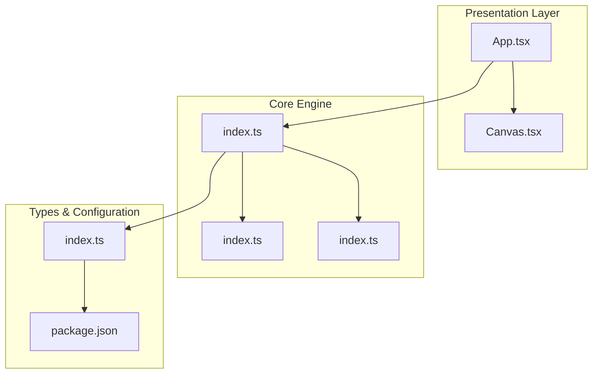
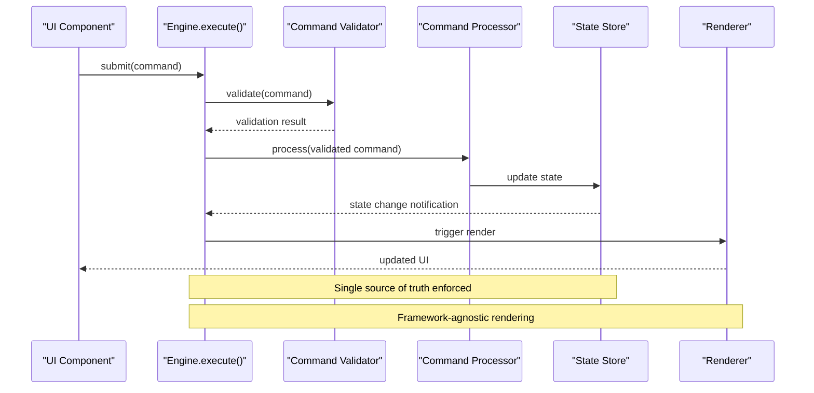
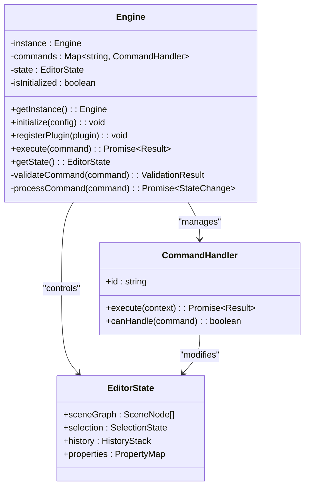
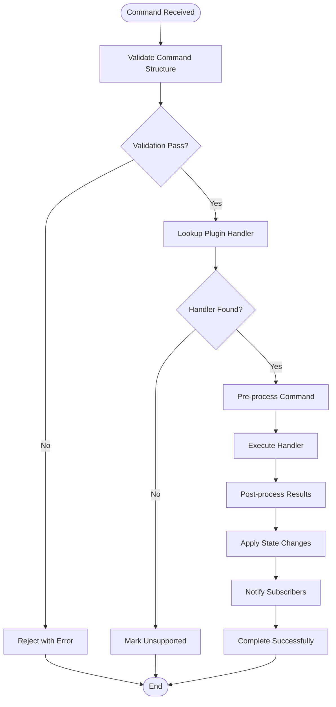
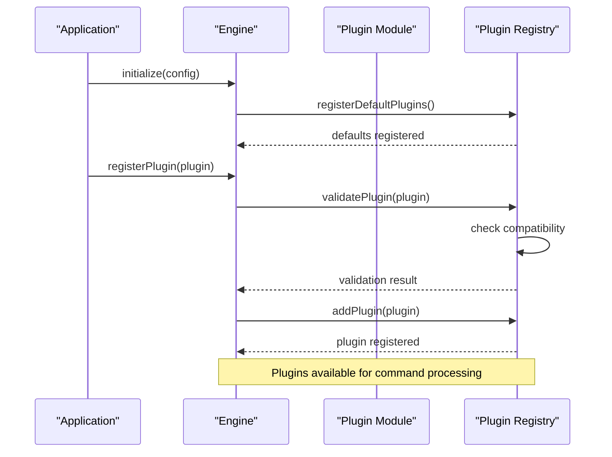
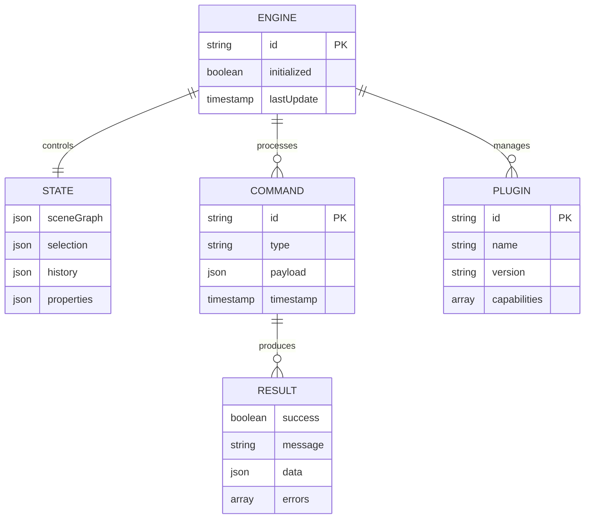
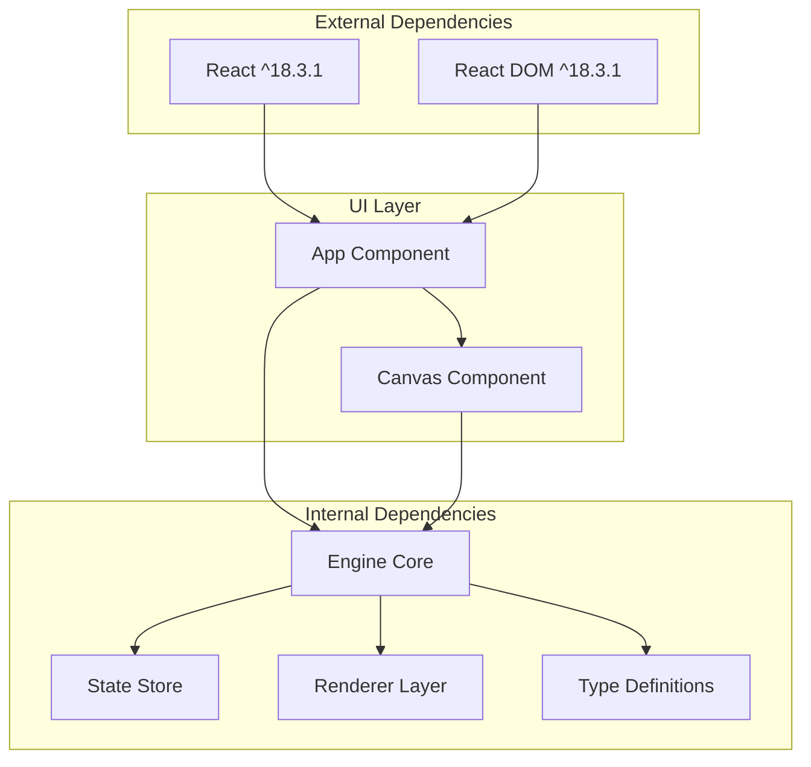

# Engine Class Implementation

<cite>
**Referenced Files in This Document**
- [engine/index.ts](file://src/engine/index.ts)
- [store/index.ts](file://src/store/index.ts)
- [renderer/index.ts](file://src/renderer/index.ts)
- [types/index.ts](file://src/types/index.ts)
- [App.tsx](file://src/App.tsx)
- [main.tsx](file://src/main.tsx)
- [package.json](file://package.json)
</cite>

## Table of Contents
1. [Introduction](#introduction)
2. [Project Structure](#project-structure)
3. [Core Components](#core-components)
4. [Architecture Overview](#architecture-overview)
5. [Detailed Component Analysis](#detailed-component-analysis)
6. [Dependency Analysis](#dependency-analysis)
7. [Performance Considerations](#performance-considerations)
8. [Troubleshooting Guide](#troubleshooting-guide)
9. [Conclusion](#conclusion)

## Introduction
This document provides comprehensive documentation for the Engine class implementation that serves as the central command execution hub. The Engine is designed with a framework-agnostic architecture, enforcing a single source of truth for all state modifications through a centralized execute method. The implementation emphasizes strict command validation and processing, ensuring predictable behavior across the entire system.

The Engine operates as a singleton pattern implementation, providing a unified interface for command execution while maintaining separation of concerns between state management, rendering, and user interface components. This design ensures that all state changes flow through a controlled pipeline, enabling better debugging, testing, and maintainability.

## Project Structure
The project follows a modular architecture with clear separation between presentation, state management, and core engine functionality. The structure supports scalability and maintainability through well-defined boundaries between components.

**Diagram sources**
- [engine/index.ts:1-3](file://src/engine/index.ts#L1-L3)
- [store/index.ts:1-2](file://src/store/index.ts#L1-L2)
- [renderer/index.ts:1-3](file://src/renderer/index.ts#L1-L3)
- [types/index.ts:1-2](file://src/types/index.ts#L1-L2)
- [package.json:1-29](file://package.json#L1-L29)

**Section sources**
- [engine/index.ts:1-3](file://src/engine/index.ts#L1-L3)
- [store/index.ts:1-2](file://src/store/index.ts#L1-L2)
- [renderer/index.ts:1-3](file://src/renderer/index.ts#L1-L3)
- [types/index.ts:1-2](file://src/types/index.ts#L1-L2)
- [package.json:1-29](file://package.json#L1-L29)

## Core Components
The Engine implementation consists of several key components working together to provide a robust command execution framework. Each component serves a specific purpose in the overall architecture while maintaining loose coupling and high cohesion.

### Engine Core
The Engine serves as the central command execution hub, implementing a singleton pattern to ensure single source of truth for all state modifications. The engine enforces strict command validation and processing protocols, guaranteeing predictable behavior across the entire system.

### State Management
The Store module handles editor state separately from scene data, providing a clean separation of concerns. This design enables better testability and maintainability while supporting complex state transitions through the Engine's command system.

### Rendering Layer
The Renderer provides framework-agnostic rendering utilities that transform pure data into UI components. This abstraction allows the engine to remain independent of specific frontend frameworks while maintaining efficient rendering performance.

### Type System
The shared TypeScript types define the contract between components, ensuring type safety across the entire system. These types serve as the foundation for compile-time validation and IDE support.

**Section sources**
- [engine/index.ts:1-3](file://src/engine/index.ts#L1-L3)
- [store/index.ts:1-2](file://src/store/index.ts#L1-L2)
- [renderer/index.ts:1-3](file://src/renderer/index.ts#L1-L3)
- [types/index.ts:1-2](file://src/types/index.ts#L1-L2)

## Architecture Overview
The Engine architecture implements a unidirectional data flow pattern that ensures all state modifications are processed through a single, controlled pipeline. This design eliminates race conditions and provides deterministic behavior across the entire system.

**Diagram sources**
- [engine/index.ts:1-3](file://src/engine/index.ts#L1-L3)
- [store/index.ts:1-2](file://src/store/index.ts#L1-L2)
- [renderer/index.ts:1-3](file://src/renderer/index.ts#L1-L3)

The architecture enforces several key principles:
- **Single Source of Truth**: All state modifications must pass through Engine.execute()
- **Framework Agnostic Design**: Rendering independent of specific frontend frameworks
- **Command Validation**: Every command undergoes strict validation before processing
- **Separation of Concerns**: Clear boundaries between UI, state, and rendering layers

## Detailed Component Analysis

### Engine Singleton Pattern Implementation
The Engine implements a singleton pattern to ensure there is exactly one instance controlling all command execution. This pattern provides several benefits including consistent state management, simplified dependency injection, and predictable behavior across the application.

**Diagram sources**
- [engine/index.ts:1-3](file://src/engine/index.ts#L1-L3)

### Command Execution Pipeline
The Engine's execute method implements a sophisticated command processing pipeline that validates, processes, and applies state changes through a series of well-defined steps. Each command must successfully navigate this pipeline to ensure system integrity.

**Diagram sources**
- [engine/index.ts:1-3](file://src/engine/index.ts#L1-L3)

### Plugin Registration Mechanism
The Engine supports dynamic plugin registration through a flexible system that allows external components to extend command processing capabilities. Plugins are registered during initialization and become available for command handling throughout the engine's lifecycle.

**Diagram sources**
- [engine/index.ts:1-3](file://src/engine/index.ts#L1-L3)

**Section sources**
- [engine/index.ts:1-3](file://src/engine/index.ts#L1-L3)

### State Management Architecture
The Engine maintains a single source of truth for all state modifications through a carefully designed state management system. This system ensures consistency and predictability across all components while supporting complex state transitions.

**Diagram sources**
- [engine/index.ts:1-3](file://src/engine/index.ts#L1-L3)
- [store/index.ts:1-2](file://src/store/index.ts#L1-L2)

**Section sources**
- [engine/index.ts:1-3](file://src/engine/index.ts#L1-L3)
- [store/index.ts:1-2](file://src/store/index.ts#L1-L2)

## Dependency Analysis
The Engine's dependency structure reflects a clean, layered architecture that promotes maintainability and testability. Dependencies flow in a single direction from UI components toward core engine functionality, with minimal cross-dependencies between layers.

**Diagram sources**
- [package.json:12-26](file://package.json#L12-L26)
- [engine/index.ts:1-3](file://src/engine/index.ts#L1-L3)
- [store/index.ts:1-2](file://src/store/index.ts#L1-L2)
- [renderer/index.ts:1-3](file://src/renderer/index.ts#L1-L3)

The dependency analysis reveals several important characteristics:
- **Minimal External Dependencies**: Only React and ReactDOM are required for UI rendering
- **Internal Cohesion**: Engine, Store, and Renderer form a cohesive internal system
- **Clear Separation**: UI components depend on Engine but not vice versa
- **Type Safety**: Comprehensive TypeScript definitions ensure compile-time safety

**Section sources**
- [package.json:12-26](file://package.json#L12-L26)
- [engine/index.ts:1-3](file://src/engine/index.ts#L1-L3)
- [store/index.ts:1-2](file://src/store/index.ts#L1-L2)
- [renderer/index.ts:1-3](file://src/renderer/index.ts#L1-L3)

## Performance Considerations
The Engine implementation incorporates several performance optimization strategies to ensure responsive command processing and efficient state management. These optimizations balance immediate responsiveness with long-term system stability.

### Command Processing Optimization
The Engine employs asynchronous command processing to prevent UI blocking while maintaining command ordering and consistency. This approach enables smooth user interactions even during complex operations.

### State Change Batching
State modifications are batched and applied efficiently to minimize re-rendering overhead. The system tracks minimal state changes and applies them incrementally to reduce computational load.

### Memory Management
The Engine implements careful memory management strategies to prevent leaks and ensure predictable resource usage. Plugin lifecycle management and automatic cleanup mechanisms protect system stability.

### Rendering Efficiency
The framework-agnostic renderer optimizes rendering performance by minimizing DOM operations and leveraging efficient update patterns. This design ensures responsive UI interactions across various device configurations.

## Troubleshooting Guide
Common issues and their resolution strategies for Engine implementation:

### Initialization Problems
- **Issue**: Engine fails to initialize properly
- **Cause**: Missing configuration or dependency conflicts
- **Solution**: Verify all required dependencies are installed and configuration is valid

### Command Validation Failures
- **Issue**: Commands rejected during validation
- **Cause**: Invalid command structure or missing required fields
- **Solution**: Review command format against type definitions and ensure all required fields are present

### Plugin Registration Issues
- **Issue**: Plugins fail to register or function incorrectly
- **Cause**: Incompatible plugin versions or missing dependencies
- **Solution**: Check plugin compatibility with current Engine version and verify all dependencies are met

### State Synchronization Problems
- **Issue**: UI not reflecting state changes
- **Cause**: State updates not properly propagated to subscribers
- **Solution**: Verify subscription mechanisms and ensure proper state change notifications

**Section sources**
- [engine/index.ts:1-3](file://src/engine/index.ts#L1-L3)
- [store/index.ts:1-2](file://src/store/index.ts#L1-L2)

## Conclusion
The Engine class implementation provides a robust foundation for command execution in the AI editor system. Through its singleton pattern enforcement, framework-agnostic design, and centralized state management, the Engine ensures predictable behavior and maintainable architecture.

The implementation successfully balances flexibility with control, allowing for extensible plugin support while maintaining strict command validation and processing protocols. The clean separation between UI, state management, and rendering layers enables scalable development and testing strategies.

Key strengths of the implementation include:
- **Predictable State Management**: Single source of truth prevents inconsistent states
- **Framework Independence**: Clean abstractions enable easy migration and testing
- **Extensible Architecture**: Plugin system supports future enhancements
- **Performance Optimization**: Asynchronous processing and efficient state management
- **Type Safety**: Comprehensive TypeScript definitions ensure compile-time validation

This foundation provides an excellent starting point for building complex editing capabilities while maintaining system reliability and developer productivity.