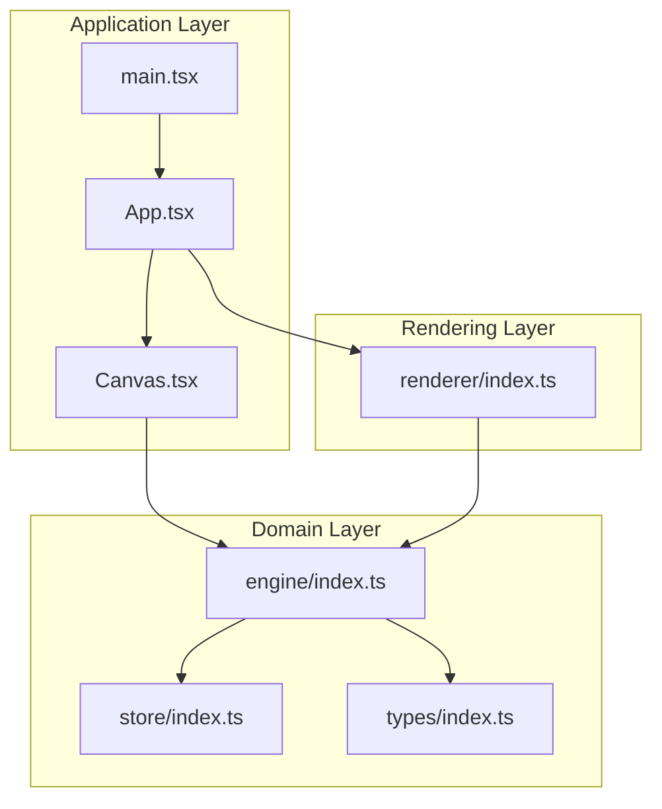
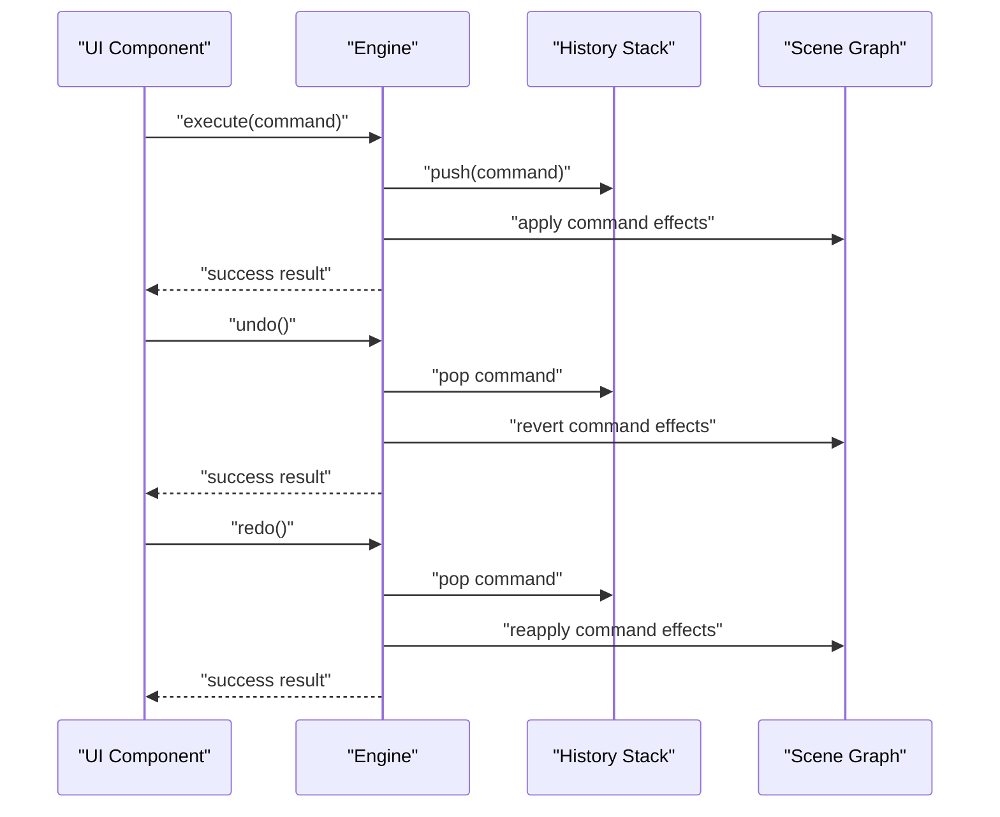
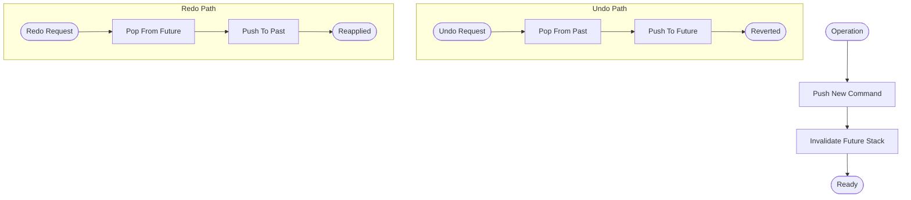
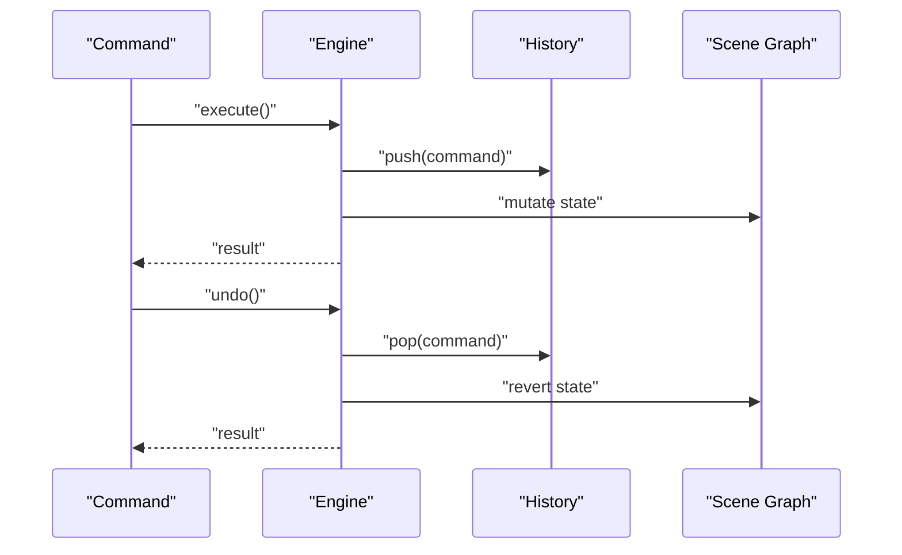
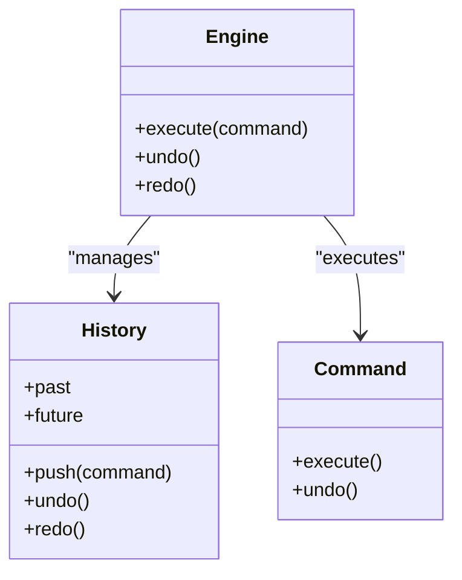
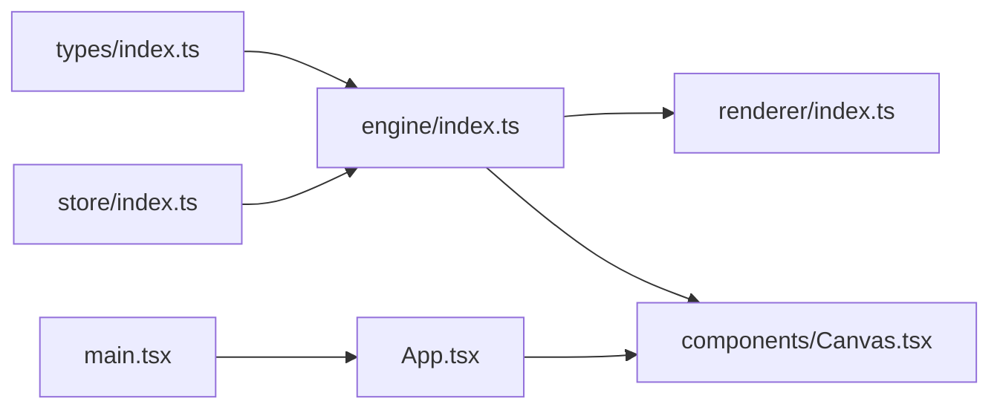

# History Management

<cite>
**Referenced Files in This Document**
- [spec1.md](file://spec1.md)
- [src/engine/index.ts](file://src/engine/index.ts)
- [src/store/index.ts](file://src/store/index.ts)
- [src/types/index.ts](file://src/types/index.ts)
- [src/components/Canvas.tsx](file://src/components/Canvas.tsx)
- [src/renderer/index.ts](file://src/renderer/index.ts)
- [src/main.tsx](file://src/main.tsx)
- [src/App.tsx](file://src/App.tsx)
</cite>

## Table of Contents
1. [Introduction](#introduction)
2. [Project Structure](#project-structure)
3. [Core Components](#core-components)
4. [Architecture Overview](#architecture-overview)
5. [Detailed Component Analysis](#detailed-component-analysis)
6. [Dependency Analysis](#dependency-analysis)
7. [Performance Considerations](#performance-considerations)
8. [Troubleshooting Guide](#troubleshooting-guide)
9. [Conclusion](#conclusion)
10. [Appendices](#appendices)

## Introduction
This document describes the history management system designed to track command execution and enable undo/redo functionality. It explains the history stack implementation, command serialization for persistence, and state snapshot mechanisms. It also covers the relationship between command execution and history updates, memory management for large histories, performance optimization strategies, and integration with the command pattern system. Practical examples illustrate undo/redo operations, history navigation, and command filtering. Conflict resolution for concurrent modifications and restoration of previous states are addressed alongside limitations, memory considerations, and best practices for collaborative environments.

## Project Structure
The project follows a layered architecture:
- Engine: Core domain logic and state transitions via commands.
- Store: Editor state (distinct from scene data).
- Types: Shared data models and mocks.
- Renderer: Pure rendering utilities.
- Components: UI shell and canvas container.
- App and main: Application bootstrap.

**Diagram sources**
- [src/App.tsx:1-17](file://src/App.tsx#L1-L17)
- [src/main.tsx:1-10](file://src/main.tsx#L1-L10)
- [src/components/Canvas.tsx:1-40](file://src/components/Canvas.tsx#L1-L40)
- [src/engine/index.ts:1-3](file://src/engine/index.ts#L1-L3)
- [src/store/index.ts:1-2](file://src/store/index.ts#L1-L2)
- [src/types/index.ts:1-229](file://src/types/index.ts#L1-L229)
- [src/renderer/index.ts:1-3](file://src/renderer/index.ts#L1-L3)

**Section sources**
- [src/App.tsx:1-17](file://src/App.tsx#L1-L17)
- [src/main.tsx:1-10](file://src/main.tsx#L1-L10)
- [src/components/Canvas.tsx:1-40](file://src/components/Canvas.tsx#L1-L40)
- [src/engine/index.ts:1-3](file://src/engine/index.ts#L1-L3)
- [src/store/index.ts:1-2](file://src/store/index.ts#L1-L2)
- [src/types/index.ts:1-229](file://src/types/index.ts#L1-L229)
- [src/renderer/index.ts:1-3](file://src/renderer/index.ts#L1-L3)

## Core Components
- Engine: Enforces that all state changes occur through engine.execute(command). The engine maintains history and coordinates undo/redo.
- Store: Holds editor state separate from scene data.
- Types: Defines document, slide, element, animation, and editor state models, plus mock factories for testing and prototyping.
- Renderer: Pure rendering utilities.
- Components: UI scaffolding and canvas container.

Key architectural constraints:
- All state changes must go through engine.execute(command).
- Scene Graph is the single source of truth.
- Editor state must be separated from scene data.
- Engine must be framework-agnostic.
- Rendering must be pure.
- Animations must be driven by Timeline.
- All operations must support undo/redo via Command pattern.

**Section sources**
- [spec1.md:23-41](file://spec1.md#L23-L41)
- [spec1.md:133-146](file://spec1.md#L133-L146)
- [src/engine/index.ts:1-3](file://src/engine/index.ts#L1-L3)
- [src/store/index.ts:1-2](file://src/store/index.ts#L1-L2)
- [src/types/index.ts:56-111](file://src/types/index.ts#L56-L111)

## Architecture Overview
The history management system integrates tightly with the command pattern and engine. The engine orchestrates command execution, updates the scene graph, and manages the history stack. Undo/redo operations pop/push commands from/to the history stacks and replay state transitions.

**Diagram sources**
- [spec1.md:133-146](file://spec1.md#L133-L146)
- [spec1.md:114-129](file://spec1.md#L114-L129)
- [src/engine/index.ts:1-3](file://src/engine/index.ts#L1-L3)

## Detailed Component Analysis

### History Stack Implementation
The history stack is a bounded stack with two primary directions:
- Past: Commands that can be undone.
- Future: Commands that can be redone after an undo.

Behavioral expectations:
- Pushing a new command onto the stack invalidates the future stack.
- Undo pops from past and pushes onto future.
- Redo pops from future and pushes onto past.
- Correct stack behavior ensures deterministic undo/redo sequences.

**Diagram sources**
- [spec1.md:133-146](file://spec1.md#L133-L146)

**Section sources**
- [spec1.md:133-146](file://spec1.md#L133-L146)

### Command Serialization for Persistence
Commands must be serializable to support persistence and collaboration:
- Payloads should include prev/next snapshots or deltas.
- Commands should be JSON-serializable with minimal external dependencies.
- Versioning or schema migrations may be necessary for evolving command formats.

Serialization guidelines:
- Include command type and constructor arguments.
- Encapsulate state diffs or full snapshots in payload.
- Preserve immutability of serialized commands.

**Section sources**
- [spec1.md:124-129](file://spec1.md#L124-L129)

### State Snapshot Mechanisms
Two complementary approaches are recommended:
- Full snapshots: Serialize the entire scene graph at key moments (e.g., before major operations).
- Deltas: Track only changed fields per operation.

Snapshot strategies:
- Periodic snapshots reduce replay cost during long histories.
- Delta-based snapshots minimize storage but increase complexity of replay.

**Section sources**
- [spec1.md:124-129](file://spec1.md#L124-L129)

### Relationship Between Command Execution and History Updates
- Every successful engine.execute(command) pushes the command onto the history stack.
- Undo/redo operations manipulate the history stacks and replay state transitions.
- The engine must maintain consistency between the scene graph and history.

**Diagram sources**
- [spec1.md:114-129](file://spec1.md#L114-L129)
- [spec1.md:133-146](file://spec1.md#L133-L146)

**Section sources**
- [spec1.md:114-129](file://spec1.md#L114-L129)
- [spec1.md:133-146](file://spec1.md#L133-L146)

### Memory Management for Large Histories
Strategies to manage memory:
- Limit history depth with a configurable cap.
- Periodically prune old commands while retaining snapshots.
- Use delta compression for command payloads.
- Persist snapshots to disk or IndexedDB for long sessions.

Practical controls:
- Configurable max history length.
- Optional periodic full snapshots to bound redo depth.

**Section sources**
- [spec1.md:133-146](file://spec1.md#L133-L146)

### Performance Optimization Strategies
- Batch operations: Group multiple small commands into a single command to reduce history growth.
- Lazy evaluation: Defer expensive snapshots until necessary.
- Efficient serialization: Prefer compact JSON or binary formats.
- Replay caching: Cache computed state segments for frequent undo/redo paths.

**Section sources**
- [spec1.md:133-146](file://spec1.md#L133-L146)

### Practical Examples

#### Undo/Redo Operations
- Trigger undo/redo via keyboard shortcuts or menu actions.
- The engine’s undo/redo methods manipulate the history stacks and replay state transitions.

Example flow:
- User triggers undo: engine pops from past, reverts scene state, and updates UI.
- User triggers redo: engine pops from future, reapplies scene state, and updates UI.

**Section sources**
- [spec1.md:201-214](file://spec1.md#L201-L214)

#### History Navigation
- Navigate through history using forward/backward buttons or keyboard shortcuts.
- The UI should reflect current position in history and available actions.

**Section sources**
- [spec1.md:201-214](file://spec1.md#L201-L214)

#### Command Filtering
- Filter commands by type to simplify navigation or limit redo depth for specific operations.
- Aggregate commands (e.g., multiple moves) into composite commands to reduce noise.

**Section sources**
- [spec1.md:114-129](file://spec1.md#L114-L129)

### Integration with the Command Pattern System
- Commands encapsulate execute/undo with explicit payloads (prev/next).
- The engine validates and executes commands, ensuring single-source-of-truth consistency.
- Renderer remains pure and reacts to scene graph changes.

**Diagram sources**
- [spec1.md:114-129](file://spec1.md#L114-L129)
- [spec1.md:133-146](file://spec1.md#L133-L146)

**Section sources**
- [spec1.md:114-129](file://spec1.md#L114-L129)
- [spec1.md:133-146](file://spec1.md#L133-L146)

### Conflict Resolution for Concurrent Modifications
- Collaborative environments require operational transformation or conflict-free replicated data types (CRDTs).
- Integrate with a shared document model (e.g., Yjs) so commands are applied consistently across clients.
- Serialize commands and apply them in a globally ordered sequence.

Best practices:
- Treat commands as immutable events.
- Use Lamport timestamps or vector clocks to order operations.
- Apply remote commands deterministically to maintain convergence.

**Section sources**
- [spec1.md:239-256](file://spec1.md#L239-L256)

### Restoration of Previous States
- Use snapshots or replayable command logs to restore previous states.
- For collaborative scenarios, reconcile local history with remote operations before restoring.

**Section sources**
- [spec1.md:133-146](file://spec1.md#L133-L146)

## Dependency Analysis
The engine depends on types for scene graph and editor state, and on store for editor state separation. The renderer is framework-agnostic and consumes scene data. Components provide the UI shell.

**Diagram sources**
- [src/types/index.ts:1-229](file://src/types/index.ts#L1-L229)
- [src/engine/index.ts:1-3](file://src/engine/index.ts#L1-L3)
- [src/store/index.ts:1-2](file://src/store/index.ts#L1-L2)
- [src/renderer/index.ts:1-3](file://src/renderer/index.ts#L1-L3)
- [src/components/Canvas.tsx:1-40](file://src/components/Canvas.tsx#L1-L40)
- [src/App.tsx:1-17](file://src/App.tsx#L1-L17)
- [src/main.tsx:1-10](file://src/main.tsx#L1-L10)

**Section sources**
- [src/types/index.ts:1-229](file://src/types/index.ts#L1-L229)
- [src/engine/index.ts:1-3](file://src/engine/index.ts#L1-L3)
- [src/store/index.ts:1-2](file://src/store/index.ts#L1-L2)
- [src/renderer/index.ts:1-3](file://src/renderer/index.ts#L1-L3)
- [src/components/Canvas.tsx:1-40](file://src/components/Canvas.tsx#L1-L40)
- [src/App.tsx:1-17](file://src/App.tsx#L1-L17)
- [src/main.tsx:1-10](file://src/main.tsx#L1-L10)

## Performance Considerations
- Prefer delta-based snapshots for memory efficiency.
- Cap history depth and periodically compact.
- Use efficient serialization formats and avoid deep cloning.
- Batch UI updates after applying multiple commands.

[No sources needed since this section provides general guidance]

## Troubleshooting Guide
Common issues and remedies:
- Undo/redo not working: Verify that engine.execute(command) is used exclusively and that commands implement execute/undo correctly.
- Memory growth: Implement history caps and periodic pruning.
- Inconsistent state after collaboration: Ensure commands are applied in a globally ordered sequence and that snapshots are used to recover from divergence.

**Section sources**
- [spec1.md:133-146](file://spec1.md#L133-L146)
- [spec1.md:239-256](file://spec1.md#L239-L256)

## Conclusion
The history management system centers on a robust command pattern integrated with a bounded history stack. By enforcing single-source-of-truth semantics, using serializable commands with prev/next payloads, and employing snapshots or deltas, the system supports reliable undo/redo and collaborative editing. Careful memory management and performance optimizations ensure scalability in complex editing workflows.

[No sources needed since this section summarizes without analyzing specific files]

## Appendices

### A. Command Type and Examples
- Command type requires execute and undo methods.
- Example commands include AddElementCommand, MoveElementCommand, DeleteElementCommand.
- Payloads must include prev/next to enable deterministic replay.

**Section sources**
- [spec1.md:114-129](file://spec1.md#L114-L129)

### B. Mock Data and Models
- Document, Slide, Element, Animation, and EditorState models are defined for prototyping and testing.
- Mock factories produce realistic initial states for development.

**Section sources**
- [src/types/index.ts:56-111](file://src/types/index.ts#L56-L111)
- [src/types/index.ts:117-229](file://src/types/index.ts#L117-L229)