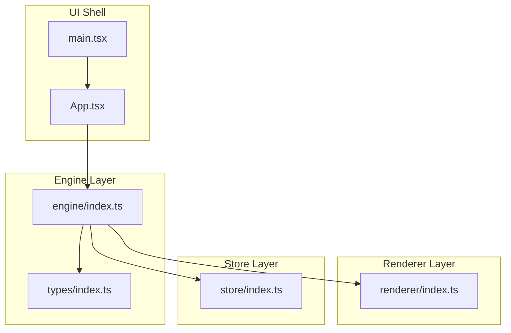
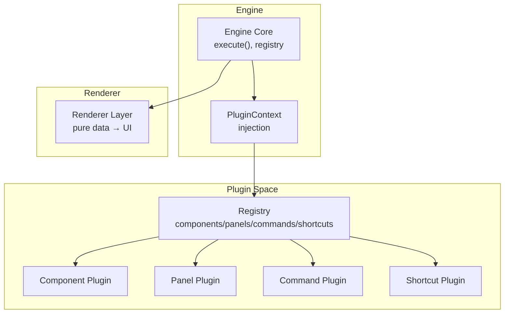
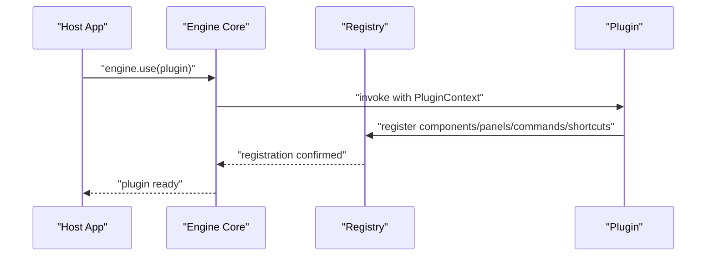
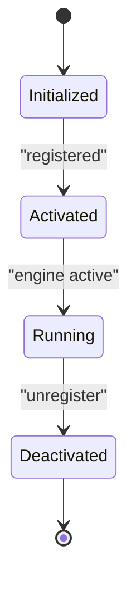
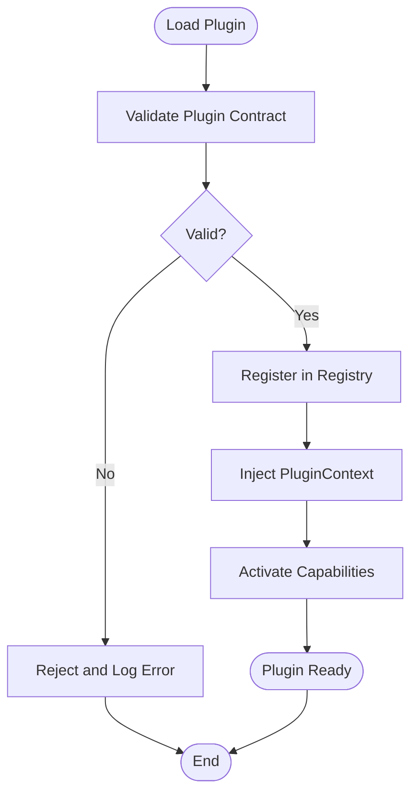
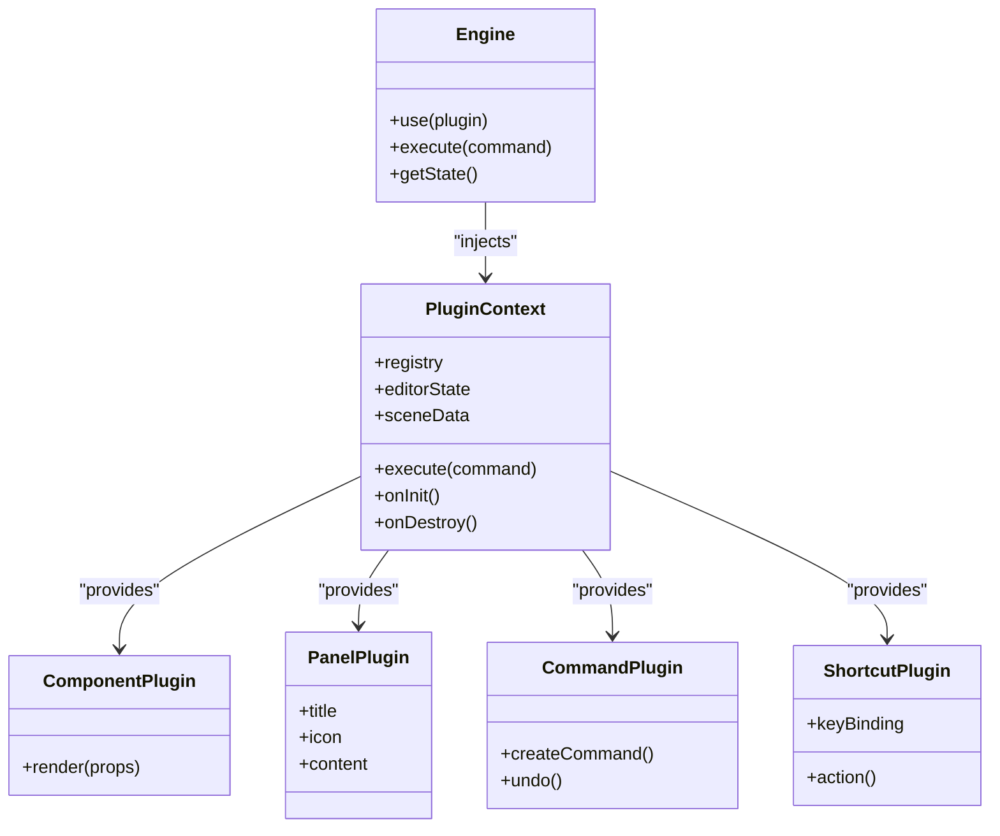
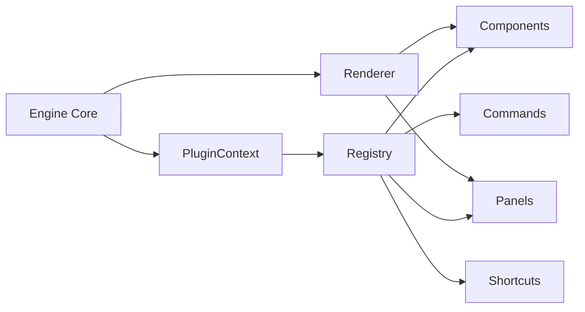

# Plugin Architecture

<cite>
**Referenced Files in This Document**
- [engine/index.ts](file://src/engine/index.ts)
- [renderer/index.ts](file://src/renderer/index.ts)
- [store/index.ts](file://src/store/index.ts)
- [types/index.ts](file://src/types/index.ts)
- [App.tsx](file://src/App.tsx)
- [main.tsx](file://src/main.tsx)
- [spec1.md](file://spec1.md)
- [spec.md](file://spec.md)
- [package.json](file://package.json)
</cite>

## Table of Contents
1. [Introduction](#introduction)
2. [Project Structure](#project-structure)
3. [Core Components](#core-components)
4. [Architecture Overview](#architecture-overview)
5. [Detailed Component Analysis](#detailed-component-analysis)
6. [Dependency Analysis](#dependency-analysis)
7. [Performance Considerations](#performance-considerations)
8. [Troubleshooting Guide](#troubleshooting-guide)
9. [Conclusion](#conclusion)
10. [Appendices](#appendices)

## Introduction
This document describes the plugin architecture for extending the engine functionality through standardized integration points. It covers the plugin registration mechanism, lifecycle management, and API contracts for component plugins, panel plugins, command plugins, and shortcut plugins. It also explains the plugin loading system, dependency injection patterns, and how plugins interact with the core engine while maintaining framework-agnostic principles. Practical examples, isolation mechanisms, error handling strategies, performance considerations, versioning, compatibility management, and best practices are included.

## Project Structure
The project follows a layered architecture with clear separation of concerns:
- Engine core: framework-agnostic state machine and command execution
- Renderer: pure data-to-UI rendering utilities
- Store: editor state separate from scene data
- Types: shared data models and contracts
- UI shell: React app bootstrap and top-level layout

**Diagram sources**
- [main.tsx:1-10](file://src/main.tsx#L1-L10)
- [App.tsx:1-17](file://src/App.tsx#L1-L17)
- [engine/index.ts:1-3](file://src/engine/index.ts#L1-L3)
- [renderer/index.ts:1-3](file://src/renderer/index.ts#L1-L3)
- [store/index.ts:1-2](file://src/store/index.ts#L1-L2)
- [types/index.ts:1-229](file://src/types/index.ts#L1-L229)

**Section sources**
- [main.tsx:1-10](file://src/main.tsx#L1-L10)
- [App.tsx:1-17](file://src/App.tsx#L1-L17)
- [engine/index.ts:1-3](file://src/engine/index.ts#L1-L3)
- [renderer/index.ts:1-3](file://src/renderer/index.ts#L1-L3)
- [store/index.ts:1-2](file://src/store/index.ts#L1-L2)
- [types/index.ts:1-229](file://src/types/index.ts#L1-L229)

## Core Components
- Engine core: central state machine enforcing single-source-of-truth via command execution
- Renderer: pure function layer converting scene data to UI
- Store: editor state (viewport, selection, tool mode) decoupled from scene graph
- Types: shared contracts for elements, documents, animations, and editor state
- UI shell: minimal React bootstrap wiring the app into the DOM

Key constraints enforced by the architecture:
- All state changes must go through engine.execute(command)
- Engine must remain framework-agnostic
- Rendering must be pure (data → UI)
- Editor state must be separated from scene data

**Section sources**
- [engine/index.ts:1-3](file://src/engine/index.ts#L1-L3)
- [renderer/index.ts:1-3](file://src/renderer/index.ts#L1-L3)
- [store/index.ts:1-2](file://src/store/index.ts#L1-L2)
- [types/index.ts:1-229](file://src/types/index.ts#L1-L229)
- [spec1.md:23-41](file://spec1.md#L23-L41)

## Architecture Overview
The plugin system integrates at the engine boundary. Plugins register capabilities through a unified API and are invoked by the engine during rendering, command execution, and UI composition. The engine remains framework-agnostic while the renderer adapts to UI needs.

**Diagram sources**
- [engine/index.ts:1-3](file://src/engine/index.ts#L1-L3)
- [renderer/index.ts:1-3](file://src/renderer/index.ts#L1-L3)
- [spec1.md:218-236](file://spec1.md#L218-L236)

## Detailed Component Analysis

### Plugin Registration Mechanism
Plugins register through a central engine.use(plugin) method. The engine maintains a registry for:
- components: UI components injected into the renderer
- panels: side panels for properties, layers, animations
- commands: new commands integrated into the command system
- shortcuts: keyboard shortcuts bound to actions

Registration flow:
- Plugin receives a PluginContext with access to engine APIs
- Plugin registers handlers and UI hooks into the appropriate registry slots
- Engine validates plugin metadata and contracts before activation

**Diagram sources**
- [spec1.md:227-235](file://spec1.md#L227-L235)
- [engine/index.ts:1-3](file://src/engine/index.ts#L1-L3)

**Section sources**
- [spec1.md:218-236](file://spec1.md#L218-L236)

### Lifecycle Management
Plugin lifecycle stages:
- Initialization: PluginContext injection and capability registration
- Activation: Integration into engine subsystems (renderer, command, shortcuts)
- Runtime: Invocation during rendering, command execution, and UI interactions
- Deactivation: Optional cleanup and unregistration

[No sources needed since this diagram shows conceptual workflow, not actual code structure]

### API Contracts
PluginContext exposes:
- engine.execute(command): dispatch commands safely
- registry: access to registry for registration
- editor state: read-only access to viewport, selection, tool mode
- scene data: read-only access to elements, slides, animations

Component plugin contract:
- Provide a React component factory
- Accept props from engine context
- Render within engine’s coordinate system

Panel plugin contract:
- Provide a panel definition with title, icon, and content
- Integrate with editor state for contextual UI

Command plugin contract:
- Define a new command with execute/undo semantics
- Provide payload with prev/next snapshots

Shortcut plugin contract:
- Define key bindings and action handlers
- Respect platform-specific modifier keys

**Section sources**
- [spec1.md:227-235](file://spec1.md#L227-L235)
- [types/index.ts:98-111](file://src/types/index.ts#L98-L111)

### Plugin Loading System
The plugin loading system supports:
- Dynamic registration via engine.use(plugin)
- Centralized registry for all plugin categories
- Validation of plugin contracts before activation
- Isolation of plugin state from engine internals

**Diagram sources**
- [spec1.md:227-235](file://spec1.md#L227-L235)

### Dependency Injection Patterns
The PluginContext acts as a dependency container:
- Provides engine.execute(command) for state mutations
- Exposes read-only editor state and scene data
- Supplies renderer hooks for UI integration
- Offers lifecycle callbacks for initialization/cleanup

**Diagram sources**
- [spec1.md:227-235](file://spec1.md#L227-L235)
- [engine/index.ts:1-3](file://src/engine/index.ts#L1-L3)

### Interaction with Core Engine
Plugins interact with the engine through:
- Command dispatch: all state changes via engine.execute(command)
- Read-only data access: elements, slides, animations, editor state
- Renderer integration: component and panel registration
- Shortcuts: binding actions to keyboard events

Framework-agnostic principles:
- Engine core does not depend on React
- Rendering is pure data-to-UI conversion
- Editor state is separate from scene data
- Commands encapsulate all state transitions

**Section sources**
- [engine/index.ts:1-3](file://src/engine/index.ts#L1-L3)
- [renderer/index.ts:1-3](file://src/renderer/index.ts#L1-L3)
- [store/index.ts:1-2](file://src/store/index.ts#L1-L2)
- [spec1.md:23-41](file://spec1.md#L23-L41)

### Practical Examples
Example plugin development patterns:
- Component plugin: register a video player component that renders within the canvas
- Panel plugin: register a properties panel that displays element attributes
- Command plugin: register a new transform command with undo support
- Shortcut plugin: register a delete shortcut that triggers deletion command

Integration with existing systems:
- Use engine.execute(command) for all state changes
- Access editor state via PluginContext for contextual UI
- Register panels alongside existing property and layer panels
- Bind shortcuts to existing command actions

**Section sources**
- [spec1.md:231-235](file://spec1.md#L231-L235)

### Plugin Isolation Mechanisms
Isolation strategies:
- Encapsulated state: plugins maintain internal state without touching engine internals
- Controlled data access: read-only access to scene data and editor state
- Command-only mutations: all state changes must go through engine.execute(command)
- Strict registry boundaries: plugins cannot bypass registry to access engine internals

**Section sources**
- [spec1.md:31-41](file://spec1.md#L31-L41)

### Error Handling Strategies
Error handling approaches:
- Validation at registration: reject invalid plugin contracts
- Try/catch around plugin execution: prevent cascading failures
- Graceful degradation: disable faulty plugins while keeping others functional
- Logging: capture errors with context for diagnostics

**Section sources**
- [spec1.md:227-235](file://spec1.md#L227-L235)

### Performance Considerations
Performance guidelines:
- Keep plugin components pure and memoized
- Minimize re-renders by providing stable props
- Batch command updates to reduce engine churn
- Avoid heavy synchronous operations in plugin initialization
- Use lazy loading for large plugin assets

**Section sources**
- [renderer/index.ts:1-3](file://src/renderer/index.ts#L1-L3)
- [types/index.ts:1-229](file://src/types/index.ts#L1-L229)

### Versioning and Compatibility
Versioning and compatibility management:
- Semantic versioning for plugins and engine
- Contract versioning: define minimum engine version per plugin
- Migration paths: provide upgrade strategies for breaking changes
- Feature detection: check engine capabilities before registering advanced features

**Section sources**
- [package.json:1-29](file://package.json#L1-L29)

## Dependency Analysis
The plugin system introduces controlled dependencies:
- Engine depends on PluginContext and registry
- Renderer consumes registered components and panels
- Store remains isolated from plugin logic
- Types define contracts for all plugin interactions

**Diagram sources**
- [engine/index.ts:1-3](file://src/engine/index.ts#L1-L3)
- [renderer/index.ts:1-3](file://src/renderer/index.ts#L1-L3)
- [spec1.md:227-235](file://spec1.md#L227-L235)

**Section sources**
- [engine/index.ts:1-3](file://src/engine/index.ts#L1-L3)
- [renderer/index.ts:1-3](file://src/renderer/index.ts#L1-L3)
- [spec1.md:227-235](file://spec1.md#L227-L235)

## Performance Considerations
- Prefer lightweight plugin components and avoid heavy computations in render paths
- Use memoization and stable references to minimize re-renders
- Batch plugin registrations to reduce engine overhead
- Avoid blocking operations in plugin initialization
- Monitor plugin memory usage and provide cleanup hooks

[No sources needed since this section provides general guidance]

## Troubleshooting Guide
Common issues and resolutions:
- Plugin fails to register: verify contract compliance and engine version compatibility
- UI not updating: ensure commands are dispatched via engine.execute(command)
- Conflicts with existing panels: use unique identifiers and proper z-indexing
- Performance regressions: profile plugin components and optimize rendering

**Section sources**
- [spec1.md:227-235](file://spec1.md#L227-L235)

## Conclusion
The plugin architecture enables extensibility while preserving the core principles of a framework-agnostic engine, pure rendering, and single-source-of-truth state management. By adhering to standardized contracts, lifecycle management, and isolation mechanisms, plugins can seamlessly integrate with existing systems and scale the platform’s capabilities.

[No sources needed since this section summarizes without analyzing specific files]

## Appendices
- Best practices:
  - Keep plugins small and focused
  - Provide clear error messages and logging
  - Test plugins against engine constraints
  - Document plugin contracts and usage patterns

[No sources needed since this section provides general guidance]