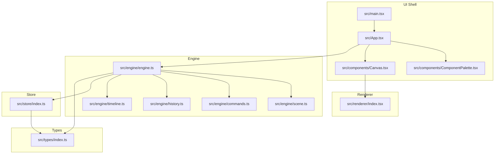
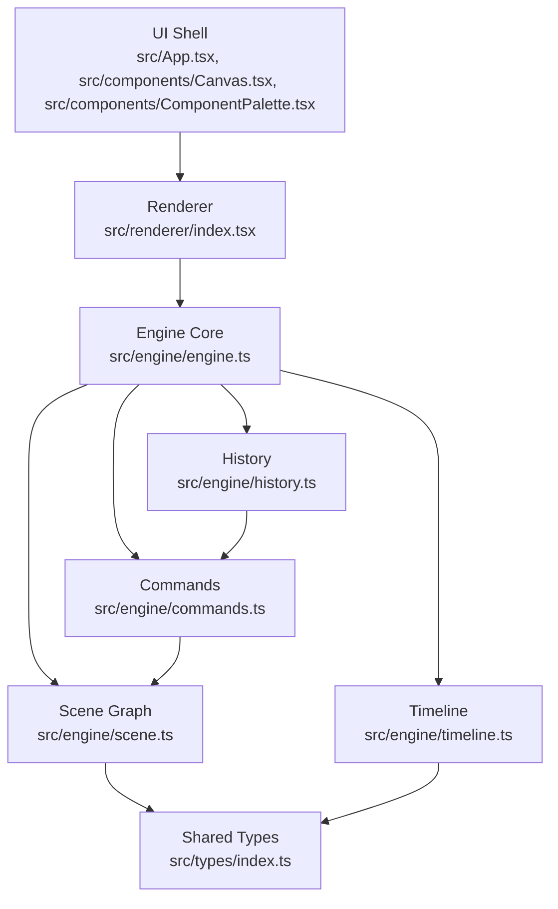
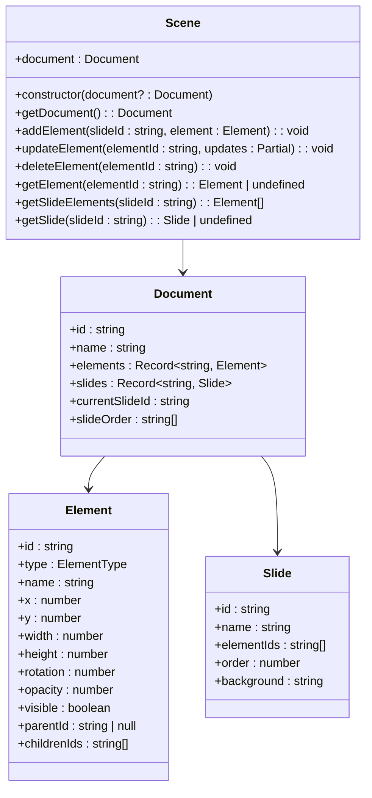
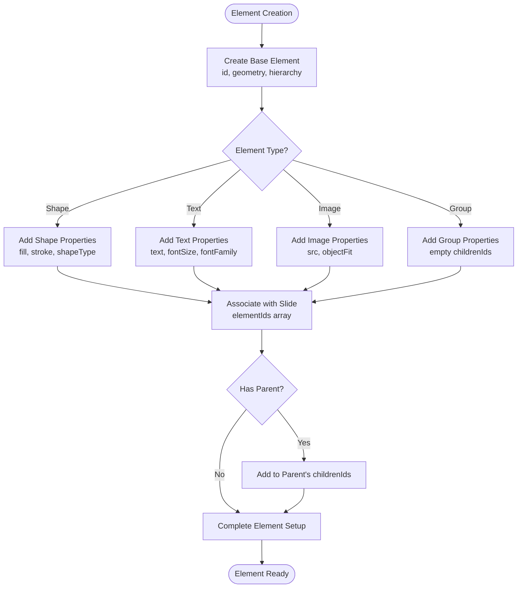
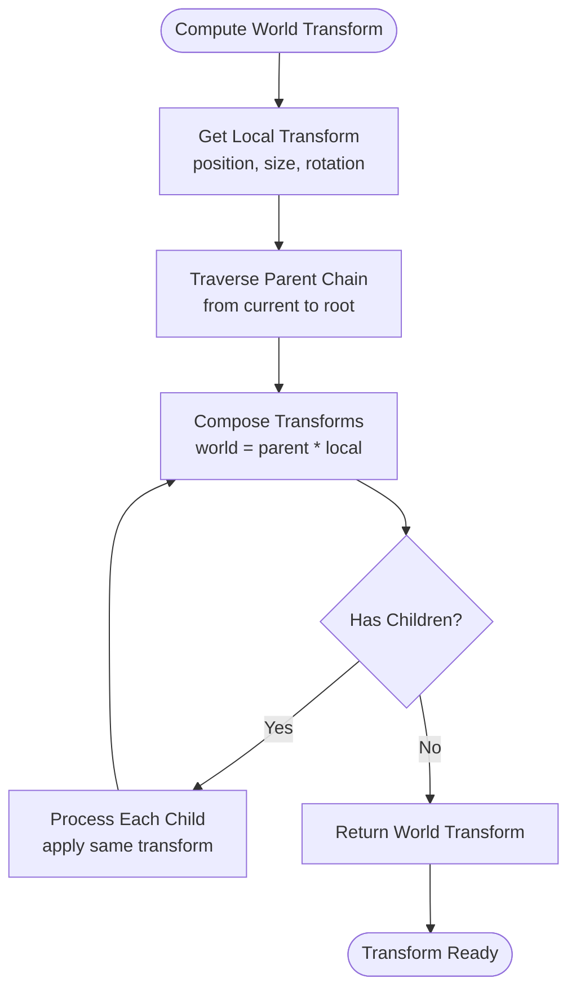
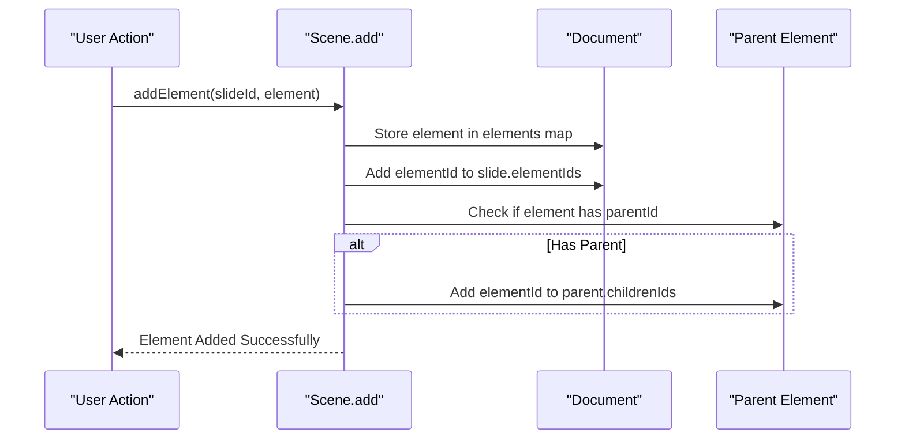
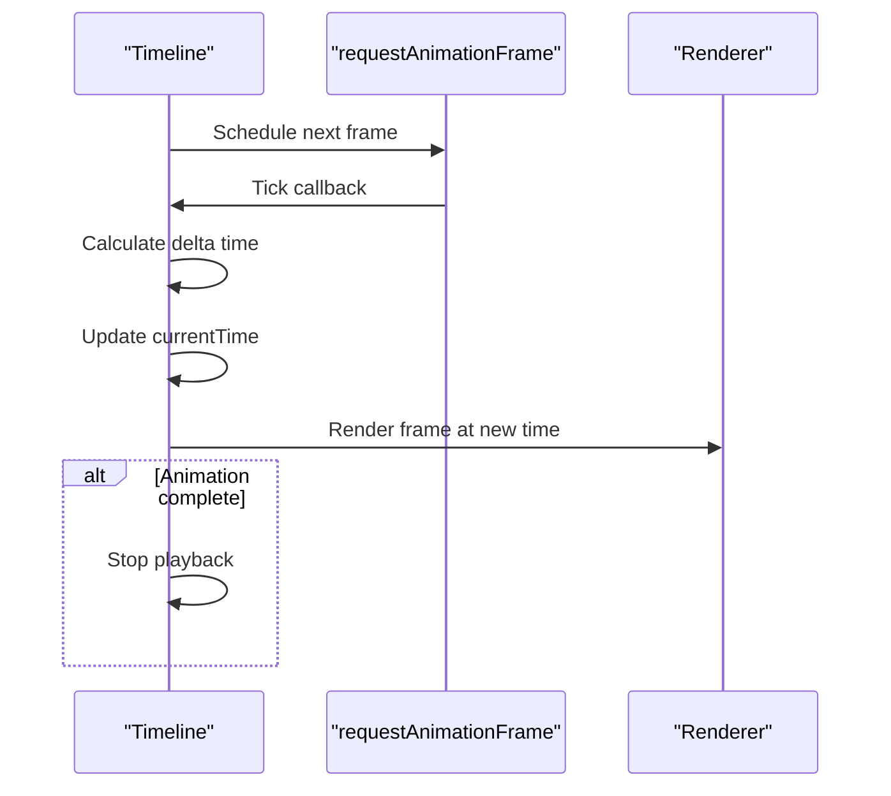
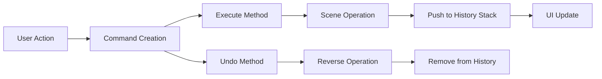
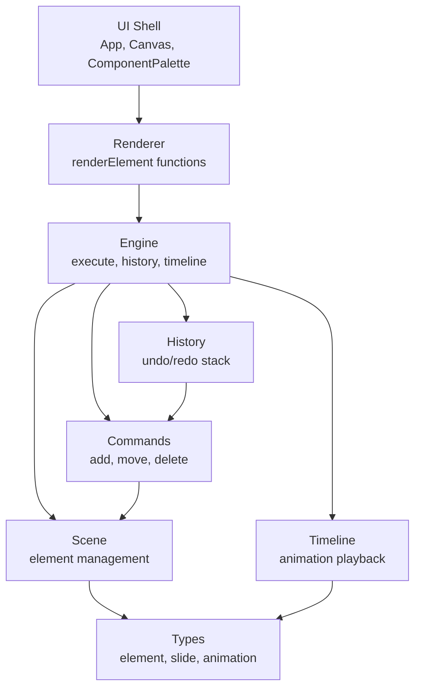

# Scene Graph Architecture

<cite>
**Referenced Files in This Document**
- [README.md](file://README.md)
- [package.json](file://package.json)
- [src/main.tsx](file://src/main.tsx)
- [src/App.tsx](file://src/App.tsx)
- [src/components/Canvas.tsx](file://src/components/Canvas.tsx)
- [src/components/ComponentPalette.tsx](file://src/components/ComponentPalette.tsx)
- [src/engine/index.ts](file://src/engine/index.ts)
- [src/engine/engine.ts](file://src/engine/engine.ts)
- [src/engine/scene.ts](file://src/engine/scene.ts)
- [src/engine/commands.ts](file://src/engine/commands.ts)
- [src/engine/history.ts](file://src/engine/history.ts)
- [src/engine/timeline.ts](file://src/engine/timeline.ts)
- [src/renderer/index.tsx](file://src/renderer/index.tsx)
- [src/store/index.ts](file://src/store/index.ts)
- [src/types/index.ts](file://src/types/index.ts)
</cite>

## Update Summary
**Changes Made**
- Added comprehensive documentation for the new Scene class implementation
- Updated data model section to reflect actual element hierarchy with parentId and childrenIds
- Enhanced parent-child relationship documentation with concrete implementation details
- Added detailed coverage of element management operations (add, update, delete)
- Expanded animation system documentation with timeline implementation
- Updated architecture diagrams to show the actual scene graph implementation
- Added practical examples of scene graph operations and element manipulation

## Table of Contents
1. [Introduction](#introduction)
2. [Project Structure](#project-structure)
3. [Core Components](#core-components)
4. [Architecture Overview](#architecture-overview)
5. [Detailed Component Analysis](#detailed-component-analysis)
6. [Dependency Analysis](#dependency-analysis)
7. [Performance Considerations](#performance-considerations)
8. [Troubleshooting Guide](#troubleshooting-guide)
9. [Conclusion](#conclusion)

## Introduction
This document describes the comprehensive scene graph architecture for a slides-based editor. The implementation features a robust hierarchical scene graph with element management, parent-child relationships, and slide organization. The system models hierarchical relationships among slides, elements, and animations, with transforms and coordinates propagating through the graph. It supports advanced operations like drag-and-drop, grouping, layer management, and animation playback.

The scene graph implementation consists of a dedicated Scene class that manages document structure, element hierarchies, and provides methods for element manipulation while maintaining consistency across the entire hierarchy.

**Section sources**
- [README.md:1-3](file://README.md#L1-L3)

## Project Structure
The project is organized into clear, well-defined layers with the scene graph as the central component:

- UI shell: React application bootstrap and layout
- Renderer: Rendering pipeline with element-specific renderers
- Engine: Core logic with Scene management, command execution, history, and timeline
- Store: Editor state management (currently minimal)
- Types: Shared type definitions for elements, slides, animations, and editor state



**Diagram sources**
- [src/main.tsx:1-10](file://src/main.tsx#L1-L10)
- [src/App.tsx:1-41](file://src/App.tsx#L1-L41)
- [src/components/ComponentPalette.tsx:1-68](file://src/components/ComponentPalette.tsx#L1-L68)
- [src/components/Canvas.tsx:1-169](file://src/components/Canvas.tsx#L1-L169)
- [src/renderer/index.tsx:1-135](file://src/renderer/index.tsx#L1-L135)
- [src/engine/engine.ts:1-54](file://src/engine/engine.ts#L1-L54)
- [src/engine/scene.ts:1-146](file://src/engine/scene.ts#L1-L146)
- [src/engine/commands.ts:1-67](file://src/engine/commands.ts#L1-L67)
- [src/engine/history.ts:1-45](file://src/engine/history.ts#L1-L45)
- [src/engine/timeline.ts:1-68](file://src/engine/timeline.ts#L1-L68)
- [src/store/index.ts:1-2](file://src/store/index.ts#L1-L2)
- [src/types/index.ts:1-238](file://src/types/index.ts#L1-L238)

**Section sources**
- [src/main.tsx:1-10](file://src/main.tsx#L1-L10)
- [src/App.tsx:1-41](file://src/App.tsx#L1-L41)
- [src/components/ComponentPalette.tsx:1-68](file://src/components/ComponentPalette.tsx#L1-L68)
- [src/components/Canvas.tsx:1-169](file://src/components/Canvas.tsx#L1-L169)
- [src/renderer/index.tsx:1-135](file://src/renderer/index.tsx#L1-L135)
- [src/engine/engine.ts:1-54](file://src/engine/engine.ts#L1-L54)
- [src/engine/scene.ts:1-146](file://src/engine/scene.ts#L1-L146)
- [src/engine/commands.ts:1-67](file://src/engine/commands.ts#L1-L67)
- [src/engine/history.ts:1-45](file://src/engine/history.ts#L1-L45)
- [src/engine/timeline.ts:1-68](file://src/engine/timeline.ts#L1-L68)
- [src/store/index.ts:1-2](file://src/store/index.ts#L1-L2)
- [src/types/index.ts:1-238](file://src/types/index.ts#L1-L238)

## Core Components
The scene graph implementation consists of several key components working together:

- **Scene**: Central manager for document structure and element hierarchies
- **Engine**: Orchestrates state changes through command execution with undo/redo support
- **Commands**: Implement the command pattern for element operations (add, move, delete)
- **History**: Manages undo/redo stacks for all operations
- **Timeline**: Handles animation playback and time-based rendering
- **Renderer**: Converts scene graph elements to visual output with proper styling
- **Types**: Defines shared element, slide, animation, and editor state structures

Key responsibilities:
- **Scene**: Validates element hierarchies, maintains parent-child relationships, and provides element queries
- **Engine**: Executes commands, manages editor state, and coordinates with history and timeline
- **Commands**: Encapsulate element operations with built-in undo/redo functionality
- **History**: Tracks command execution for undo/redo operations
- **Timeline**: Manages animation timing and playback state
- **Renderer**: Applies transforms, handles selection states, and renders element layers

**Section sources**
- [src/engine/scene.ts:1-146](file://src/engine/scene.ts#L1-L146)
- [src/engine/engine.ts:1-54](file://src/engine/engine.ts#L1-L54)
- [src/engine/commands.ts:1-67](file://src/engine/commands.ts#L1-L67)
- [src/engine/history.ts:1-45](file://src/engine/history.ts#L1-L45)
- [src/engine/timeline.ts:1-68](file://src/engine/timeline.ts#L1-L68)
- [src/renderer/index.tsx:1-135](file://src/renderer/index.tsx#L1-L135)
- [src/types/index.ts:1-238](file://src/types/index.ts#L1-L238)

## Architecture Overview
The scene graph is implemented as a cohesive system where the Scene class serves as the central hub for managing document structure and element hierarchies. The Engine coordinates all operations through the command pattern, ensuring consistent state changes and supporting undo/redo functionality.



**Diagram sources**
- [src/App.tsx:1-41](file://src/App.tsx#L1-L41)
- [src/components/Canvas.tsx:1-169](file://src/components/Canvas.tsx#L1-L169)
- [src/components/ComponentPalette.tsx:1-68](file://src/components/ComponentPalette.tsx#L1-L68)
- [src/renderer/index.tsx:1-135](file://src/renderer/index.tsx#L1-L135)
- [src/engine/engine.ts:1-54](file://src/engine/engine.ts#L1-L54)
- [src/engine/scene.ts:1-146](file://src/engine/scene.ts#L1-L146)
- [src/engine/commands.ts:1-67](file://src/engine/commands.ts#L1-L67)
- [src/engine/history.ts:1-45](file://src/engine/history.ts#L1-L45)
- [src/engine/timeline.ts:1-68](file://src/engine/timeline.ts#L1-L68)
- [src/types/index.ts:1-238](file://src/types/index.ts#L1-L238)

## Detailed Component Analysis

### Scene Graph Implementation
The Scene class provides comprehensive management of the document structure and element hierarchies:



**Diagram sources**
- [src/engine/scene.ts:3-121](file://src/engine/scene.ts#L3-L121)
- [src/types/index.ts:65-72](file://src/types/index.ts#L65-L72)
- [src/types/index.ts:9-51](file://src/types/index.ts#L9-L51)
- [src/types/index.ts:57-63](file://src/types/index.ts#L57-L63)

**Section sources**
- [src/engine/scene.ts:1-146](file://src/engine/scene.ts#L1-L146)
- [src/types/index.ts:1-238](file://src/types/index.ts#L1-L238)

### Data Model: Slides, Elements, and Animations
The scene graph implements a comprehensive hierarchical data structure:

#### Document Structure
- **Document**: Root container with unique id, name, and collections for elements and slides
- **Slides**: Top-level containers with elementIds array for immediate children
- **Elements**: Base structure with geometry (x, y, width, height), appearance (rotation, opacity, visible), and hierarchy (parentId, childrenIds)

#### Element Types
- **Shape Elements**: Rectangle, circle, triangle with fill and stroke properties
- **Text Elements**: Text content with font properties and alignment
- **Image Elements**: Image resources with object-fit handling
- **Group Elements**: Container elements that can hold other elements

#### Animation System
- **Keyframes**: Time-based property values with easing functions
- **Timeline**: Animation playback with play/pause/seek controls
- **Animation Properties**: Support for x, y, opacity, rotation, and other numeric properties



**Diagram sources**
- [src/engine/scene.ts:14-35](file://src/engine/scene.ts#L14-L35)
- [src/types/index.ts:24-49](file://src/types/index.ts#L24-L49)

**Section sources**
- [src/types/index.ts:1-238](file://src/types/index.ts#L1-L238)
- [src/engine/scene.ts:1-146](file://src/engine/scene.ts#L1-L146)

### Coordinate System and Transform Propagation
The scene graph implements a hierarchical coordinate system where transforms propagate from parent to child:



**Section sources**
- [src/renderer/index.tsx:9-22](file://src/renderer/index.tsx#L9-L22)

### Parent-Child Relationships and Hierarchy Management
The scene graph maintains strict parent-child relationships with automatic consistency:

#### Hierarchy Operations
- **Add Element**: Automatically associates with slide and parent group
- **Update Element**: Handles parentId changes and updates both slide and group hierarchies
- **Delete Element**: Removes from all parent/child relationships and slide associations
- **Group Management**: Ensures group elements maintain proper childrenIds arrays

#### Consistency Guarantees
- Every element with parentId appears in parent's childrenIds
- Every element in slide's elementIds has parentId pointing to slide or group
- Deleting parent removes all descendants from hierarchy
- Moving elements updates both old and new parent's childrenIds



**Diagram sources**
- [src/engine/scene.ts:14-35](file://src/engine/scene.ts#L14-L35)

**Section sources**
- [src/engine/scene.ts:1-146](file://src/engine/scene.ts#L1-L146)

### Animation System and Timeline Management
The timeline system provides comprehensive animation support:

#### Animation Components
- **Keyframes**: Individual time-value pairs with easing functions
- **Animations**: Property animations targeting specific elements
- **Timeline**: Playback controller with time management

#### Timeline Operations
- **Play/Pause**: Start and control animation playback
- **Seek**: Jump to specific time positions
- **Duration Control**: Set and manage animation length
- **Frame Updates**: RequestAnimationFrame-based timing



**Diagram sources**
- [src/engine/timeline.ts:48-66](file://src/engine/timeline.ts#L48-L66)

**Section sources**
- [src/engine/timeline.ts:1-68](file://src/engine/timeline.ts#L1-L68)
- [src/types/index.ts:87-101](file://src/types/index.ts#L87-L101)

### Command Pattern Implementation
The scene graph uses the command pattern for all state-changing operations:

#### Command Types
- **AddElementCommand**: Creates new elements with undo support
- **MoveElementCommand**: Updates element properties with state rollback
- **DeleteElementCommand**: Removes elements and restores previous state

#### Command Execution Flow
- Commands encapsulate all necessary state for undo operations
- Execute method performs the operation
- Undo method reverses the operation
- History stack maintains command sequence



**Diagram sources**
- [src/engine/commands.ts:4-66](file://src/engine/commands.ts#L4-L66)
- [src/engine/engine.ts:29-48](file://src/engine/engine.ts#L29-L48)

**Section sources**
- [src/engine/commands.ts:1-67](file://src/engine/commands.ts#L1-L67)
- [src/engine/engine.ts:1-54](file://src/engine/engine.ts#L1-L54)

### Practical Examples

#### Scene Graph Traversal
```typescript
// Get all elements on current slide
const elements = engine.scene.getSlideElements(engine.scene.getDocument().currentSlideId);

// Traverse hierarchy from root to leaves
function traverseHierarchy(elementId: string): void {
  const element = engine.scene.getElement(elementId);
  if (!element) return;
  
  // Process current element
  console.log(`Processing ${element.name}`);
  
  // Recursively process children
  element.childrenIds.forEach(childId => traverseHierarchy(childId));
}
```

#### Element Manipulation
```typescript
// Add new element to slide
const newElement: Element = {
  id: 'el-new',
  type: 'shape',
  name: 'New Shape',
  x: 100,
  y: 100,
  width: 100,
  height: 100,
  rotation: 0,
  opacity: 1,
  visible: true,
  parentId: null,
  childrenIds: []
};
engine.execute(new AddElementCommand(engine.scene, slideId, newElement));

// Move element to different slide
engine.execute(new MoveElementCommand(engine.scene, elementId, { 
  parentId: newParentId 
}));
```

#### Hierarchical Updates
```typescript
// When element moves, update both old and new parent
engine.execute(new MoveElementCommand(engine.scene, elementId, { 
  parentId: newParentId 
}));

// Delete element and all descendants
engine.execute(new DeleteElementCommand(engine.scene, elementId, slideId));
```

**Section sources**
- [src/engine/scene.ts:106-121](file://src/engine/scene.ts#L106-L121)
- [src/engine/commands.ts:1-67](file://src/engine/commands.ts#L1-L67)

### Performance Optimization Techniques
The scene graph implementation includes several performance optimizations:

#### Data Structure Optimizations
- **Map-based Elements**: O(1) lookup by element id using Record<string, Element>
- **Array-based Slides**: Efficient slide ordering with slideOrder array
- **Direct References**: parentId and childrenIds avoid complex tree traversal

#### Memory Management
- **Automatic Cleanup**: Delete operations remove all references
- **Weak References**: No circular references between elements and slides
- **Minimal State**: Only essential properties stored in memory

#### Rendering Optimizations
- **Selective Updates**: Only render changed elements
- **Batch Operations**: Multiple updates processed in single render cycle
- **Efficient Styling**: CSS transforms for smooth animations

**Section sources**
- [src/engine/scene.ts:1-146](file://src/engine/scene.ts#L1-L146)
- [src/renderer/index.tsx:1-135](file://src/renderer/index.tsx#L1-L135)

## Dependency Analysis
The scene graph implementation maintains clean dependency relationships:



**Diagram sources**
- [src/App.tsx:1-41](file://src/App.tsx#L1-L41)
- [src/components/Canvas.tsx:1-169](file://src/components/Canvas.tsx#L1-L169)
- [src/components/ComponentPalette.tsx:1-68](file://src/components/ComponentPalette.tsx#L1-L68)
- [src/renderer/index.tsx:1-135](file://src/renderer/index.tsx#L1-L135)
- [src/engine/engine.ts:1-54](file://src/engine/engine.ts#L1-L54)
- [src/engine/scene.ts:1-146](file://src/engine/scene.ts#L1-L146)
- [src/engine/commands.ts:1-67](file://src/engine/commands.ts#L1-L67)
- [src/engine/history.ts:1-45](file://src/engine/history.ts#L1-L45)
- [src/engine/timeline.ts:1-68](file://src/engine/timeline.ts#L1-L68)
- [src/types/index.ts:1-238](file://src/types/index.ts#L1-L238)

**Section sources**
- [src/App.tsx:1-41](file://src/App.tsx#L1-L41)
- [src/components/Canvas.tsx:1-169](file://src/components/Canvas.tsx#L1-L169)
- [src/components/ComponentPalette.tsx:1-68](file://src/components/ComponentPalette.tsx#L1-L68)
- [src/renderer/index.tsx:1-135](file://src/renderer/index.tsx#L1-L135)
- [src/engine/engine.ts:1-54](file://src/engine/engine.ts#L1-L54)
- [src/engine/scene.ts:1-146](file://src/engine/scene.ts#L1-L146)
- [src/engine/commands.ts:1-67](file://src/engine/commands.ts#L1-L67)
- [src/engine/history.ts:1-45](file://src/engine/history.ts#L1-L45)
- [src/engine/timeline.ts:1-68](file://src/engine/timeline.ts#L1-L68)
- [src/types/index.ts:1-238](file://src/types/index.ts#L1-L238)

## Performance Considerations
The scene graph implementation includes several performance optimizations:

- **O(1) Element Lookup**: Direct access via element id maps
- **Hierarchical Updates**: Only affected subtrees need recalculation
- **Efficient Rendering**: CSS transforms for smooth animations
- **Memory Efficiency**: Minimal state storage with automatic cleanup
- **Command Batching**: Multiple operations can be grouped for single render

## Troubleshooting Guide
Common issues and solutions:

#### Element Hierarchy Issues
- **Problem**: Element appears in wrong slide or parent
- **Solution**: Verify parentId and childrenIds consistency after operations
- **Prevention**: Use provided Scene methods instead of direct property modification

#### Animation Playback Problems
- **Problem**: Animations don't play or stop unexpectedly
- **Solution**: Check timeline duration and currentTime values
- **Debug**: Verify animation keyframes and easing functions

#### Performance Issues
- **Problem**: Slow rendering with many elements
- **Solution**: Implement selective rendering and batching updates
- **Optimization**: Use transform caching and incremental updates

#### Memory Leaks
- **Problem**: Elements persist after deletion
- **Solution**: Ensure deleteElement removes all references
- **Verification**: Check that element is removed from slides and groups

**Section sources**
- [src/engine/scene.ts:71-100](file://src/engine/scene.ts#L71-L100)
- [src/engine/timeline.ts:27-46](file://src/engine/timeline.ts#L27-L46)

## Conclusion
The scene graph architecture provides a robust foundation for a slides-based editor with comprehensive hierarchical management, animation support, and efficient rendering. The implementation successfully separates concerns between UI, rendering, engine logic, and data structures while maintaining clean interfaces and consistent state management.

Key strengths of the implementation:
- **Complete Hierarchy Management**: Automatic parent-child relationship maintenance
- **Command Pattern**: Full undo/redo support with consistent state changes
- **Animation System**: Timeline-based animation playback with keyframe support
- **Performance Optimized**: Efficient data structures and rendering approaches
- **Extensible Design**: Clean separation of concerns allows for easy feature additions

The scene graph enables advanced authoring workflows including drag-and-drop operations, grouping, layer management, and sophisticated animation capabilities while maintaining excellent performance characteristics for large presentations.