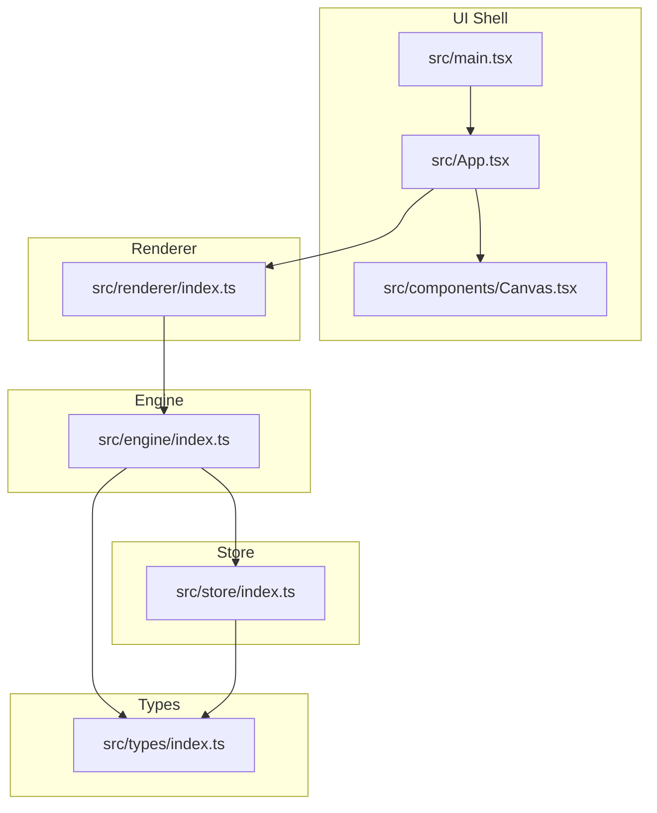
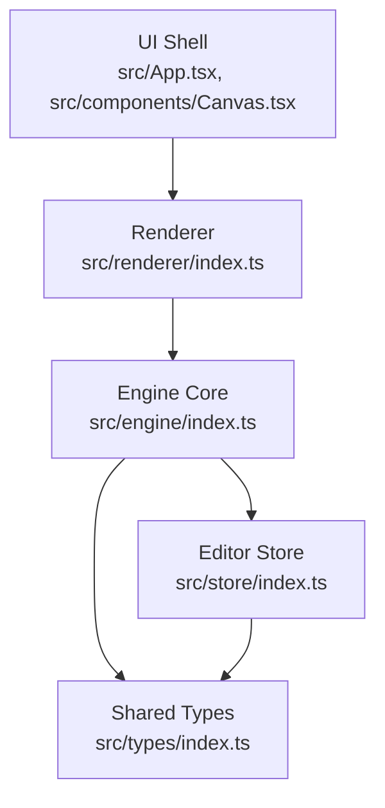
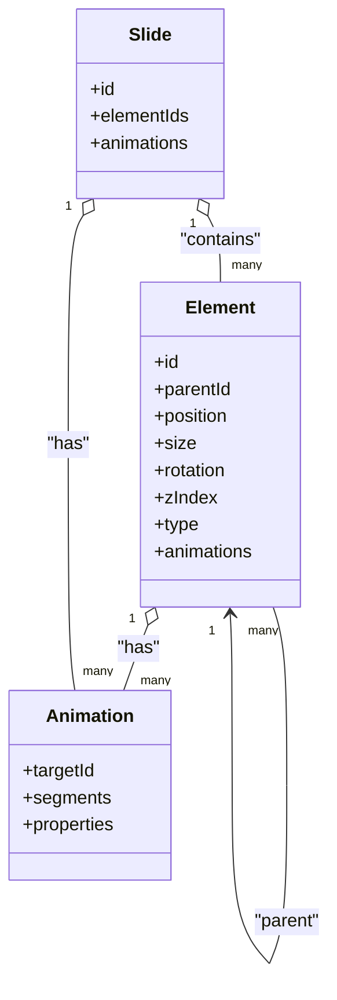
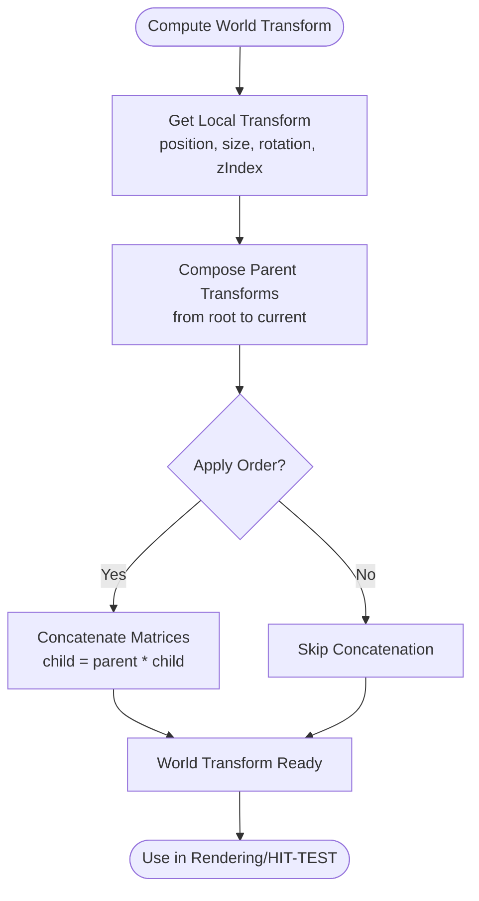
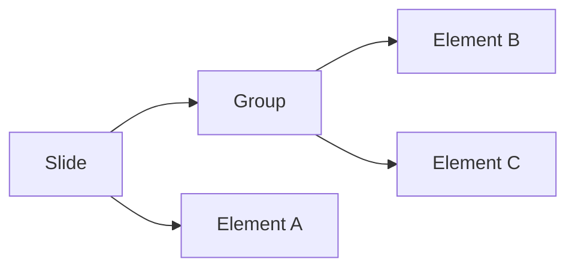
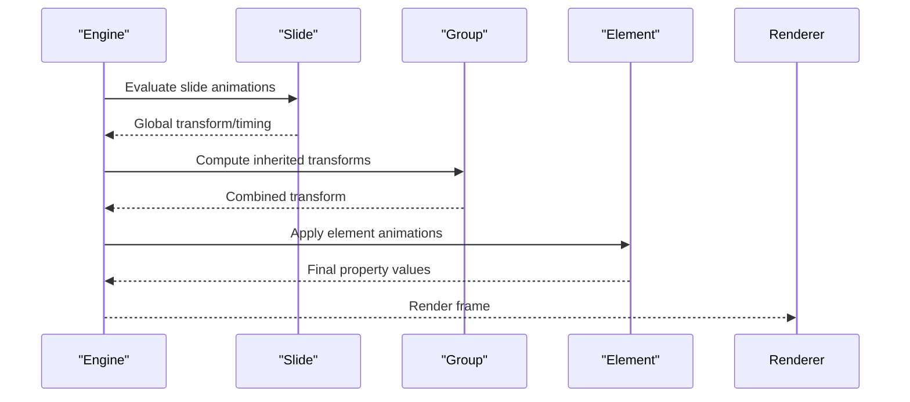
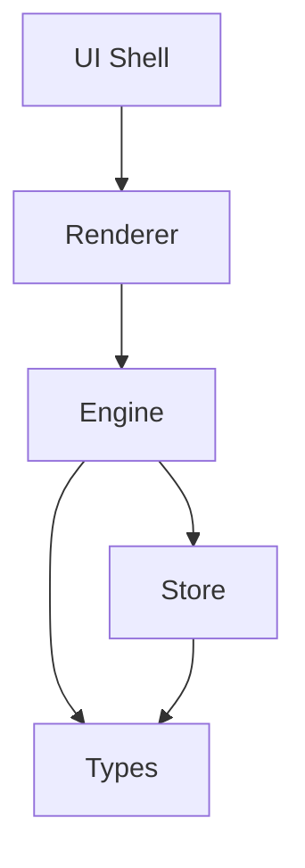

# Scene Graph Architecture

<cite>
**Referenced Files in This Document**
- [README.md](file://README.md)
- [package.json](file://package.json)
- [src/main.tsx](file://src/main.tsx)
- [src/App.tsx](file://src/App.tsx)
- [src/components/Canvas.tsx](file://src/components/Canvas.tsx)
- [src/engine/index.ts](file://src/engine/index.ts)
- [src/store/index.ts](file://src/store/index.ts)
- [src/types/index.ts](file://src/types/index.ts)
- [src/renderer/index.ts](file://src/renderer/index.ts)
</cite>

## Table of Contents
1. [Introduction](#introduction)
2. [Project Structure](#project-structure)
3. [Core Components](#core-components)
4. [Architecture Overview](#architecture-overview)
5. [Detailed Component Analysis](#detailed-component-analysis)
6. [Dependency Analysis](#dependency-analysis)
7. [Performance Considerations](#performance-considerations)
8. [Troubleshooting Guide](#troubleshooting-guide)
9. [Conclusion](#conclusion)

## Introduction
This document describes the scene graph architecture for a slides-based editor. It focuses on how hierarchical relationships among slides, elements, and animations are modeled, how transforms and coordinates propagate through the graph, and how operations like drag-and-drop, grouping, and layer management can be supported. It also outlines data structures for different element types, animation inheritance patterns, and performance strategies for large scene graphs.

The repository currently exposes the foundational layers: a React UI shell, a renderer entry, an engine core, a store for editor state, and a shared types module. While the scene graph implementation is not present here, this document provides a blueprint for integrating a robust scene graph into the existing structure.

**Section sources**
- [README.md:1-3](file://README.md#L1-L3)

## Project Structure
The project is organized into clear layers:
- UI shell: React application bootstrap and layout
- Renderer: Rendering pipeline entry point
- Engine: Core logic and command execution
- Store: Editor state management
- Types: Shared type definitions

**Diagram sources**
- [src/main.tsx:1-10](file://src/main.tsx#L1-L10)
- [src/App.tsx:1-17](file://src/App.tsx#L1-L17)
- [src/components/Canvas.tsx:1-40](file://src/components/Canvas.tsx#L1-L40)
- [src/renderer/index.ts](file://src/renderer/index.ts)
- [src/engine/index.ts:1-3](file://src/engine/index.ts#L1-L3)
- [src/store/index.ts:1-2](file://src/store/index.ts#L1-L2)
- [src/types/index.ts:1-2](file://src/types/index.ts#L1-L2)

**Section sources**
- [src/main.tsx:1-10](file://src/main.tsx#L1-L10)
- [src/App.tsx:1-17](file://src/App.tsx#L1-L17)
- [src/components/Canvas.tsx:1-40](file://src/components/Canvas.tsx#L1-L40)
- [src/renderer/index.ts](file://src/renderer/index.ts)
- [src/engine/index.ts:1-3](file://src/engine/index.ts#L1-L3)
- [src/store/index.ts:1-2](file://src/store/index.ts#L1-L2)
- [src/types/index.ts:1-2](file://src/types/index.ts#L1-L2)

## Core Components
- Engine: Central orchestrator for state changes. All mutations must flow through a command-execution interface to maintain consistency and enable undo/redo and deterministic updates.
- Renderer: Converts the scene graph into visual output for the UI canvas.
- Store: Holds editor state (selection, history, UI mode) separate from raw scene data.
- Types: Defines shared element, slide, and animation structures used across the engine and renderer.
- UI Shell: Provides the container and layout for the canvas and integrates with the renderer.

Key responsibilities:
- Engine: Validates commands, computes derived state, and triggers re-renders.
- Renderer: Applies transforms, handles hit-testing for drag-and-drop, and renders element layers.
- Store: Manages selection, clipboard, and editor modes.
- Types: Establishes contracts for element geometry, hierarchy, and animation metadata.

**Section sources**
- [src/engine/index.ts:1-3](file://src/engine/index.ts#L1-L3)
- [src/store/index.ts:1-2](file://src/store/index.ts#L1-L2)
- [src/types/index.ts:1-2](file://src/types/index.ts#L1-L2)
- [src/renderer/index.ts](file://src/renderer/index.ts)
- [src/App.tsx:1-17](file://src/App.tsx#L1-L17)
- [src/components/Canvas.tsx:1-40](file://src/components/Canvas.tsx#L1-L40)

## Architecture Overview
The scene graph is embedded within the engine and consumed by the renderer. The store holds editor state (selection, clipboard, etc.). The UI shell hosts the canvas and delegates rendering to the renderer.

**Diagram sources**
- [src/App.tsx:1-17](file://src/App.tsx#L1-L17)
- [src/components/Canvas.tsx:1-40](file://src/components/Canvas.tsx#L1-L40)
- [src/renderer/index.ts](file://src/renderer/index.ts)
- [src/engine/index.ts:1-3](file://src/engine/index.ts#L1-L3)
- [src/store/index.ts:1-2](file://src/store/index.ts#L1-L2)
- [src/types/index.ts:1-2](file://src/types/index.ts#L1-L2)

## Detailed Component Analysis

### Data Model: Slides, Elements, and Animations
The scene graph centers on a hierarchical tree of nodes. Each node represents either a slide or an element. Elements carry geometry and appearance properties; slides define the top-level containers.

- Slide
  - Identifier
  - Element ID list representing immediate children
  - Optional animation metadata for timed transitions
- Element
  - Identifier
  - Parent identifier
  - Geometry: position, size, rotation, z-index
  - Type-specific properties (shape, image, text, group)
  - Optional animation metadata for per-element effects
- Animation
  - Target element or slide
  - Timeline segments (start delay, duration, easing)
  - Property targets (opacity, translate, rotate, scale)
  - Inheritance: child animations inherit timing and may blend with parent

[No sources needed since this diagram shows conceptual data model, not actual code structure]

### Coordinate System and Transform Propagation
Transforms are applied in a parent-to-child order. Each element’s local transform combines with its ancestors’ transforms to compute world-space coordinates. This enables consistent drag-and-drop hit-testing and layered rendering.

[No sources needed since this diagram shows conceptual workflow, not actual code structure]

### Parent-Child Relationships and Hierarchy
- Each element maintains a parentId.
- Slides own top-level elements via elementIds arrays.
- Group elements can contain other elements, enabling nested hierarchies.
- Drag-and-drop operations update parentId and elementIds while preserving relative positions.

[No sources needed since this diagram shows conceptual hierarchy, not actual code structure]

### Animation Inheritance Patterns
- Elements can animate independently; slides can animate global transitions.
- Child animations inherit timing windows and may inherit property targets from parents.
- Timeline merging ensures smooth transitions when multiple animations target the same property.

[No sources needed since this diagram shows conceptual animation flow, not actual code structure]

### Practical Examples

- Scene Graph Traversal
  - Depth-first traversal to compute world transforms
  - Breadth-first traversal to render layers in z-order
- Element Manipulation
  - Move element: update parentId and adjust elementIds ordering
  - Scale/rotate: update geometry; recompute transforms
- Hierarchical Updates
  - On change, invalidate affected subtrees and recompute transforms bottom-up

[No sources needed since this section provides conceptual examples]

### Performance Optimization Techniques
- Transform caching: cache world transforms until dependencies change
- Incremental invalidation: track dirty nodes and traverse only affected subtrees
- Layer culling: skip off-screen or low-priority elements during rendering
- Batch updates: coalesce frequent property changes into single re-render cycles
- Spatial partitioning: use bounding boxes to accelerate hit-testing and collision checks

[No sources needed since this section provides general guidance]

## Dependency Analysis
The current repository exposes a clean separation of concerns:
- UI depends on renderer
- Renderer depends on engine
- Engine depends on store and types
- Store depends on types

**Diagram sources**
- [src/App.tsx:1-17](file://src/App.tsx#L1-L17)
- [src/components/Canvas.tsx:1-40](file://src/components/Canvas.tsx#L1-L40)
- [src/renderer/index.ts](file://src/renderer/index.ts)
- [src/engine/index.ts:1-3](file://src/engine/index.ts#L1-L3)
- [src/store/index.ts:1-2](file://src/store/index.ts#L1-L2)
- [src/types/index.ts:1-2](file://src/types/index.ts#L1-L2)

**Section sources**
- [src/App.tsx:1-17](file://src/App.tsx#L1-L17)
- [src/components/Canvas.tsx:1-40](file://src/components/Canvas.tsx#L1-L40)
- [src/renderer/index.ts](file://src/renderer/index.ts)
- [src/engine/index.ts:1-3](file://src/engine/index.ts#L1-L3)
- [src/store/index.ts:1-2](file://src/store/index.ts#L1-L2)
- [src/types/index.ts:1-2](file://src/types/index.ts#L1-L2)

## Performance Considerations
- Minimize recomputation: cache computed transforms and invalidate only when geometry or hierarchy changes.
- Prefer incremental updates: batch commands and defer expensive operations to idle frames.
- Optimize rendering: use z-sorting and culling to reduce draw calls.
- Use efficient data structures: maintain arrays for ordered layers and maps for O(1) lookups by id.

[No sources needed since this section provides general guidance]

## Troubleshooting Guide
Common issues and remedies:
- Incorrect transforms after move: verify parentId updates and recompute subtree transforms.
- Stale visuals after resize: ensure transform caches are invalidated and re-render is triggered.
- Animation desync: confirm timeline merging and property interpolation align with intended inheritance.

[No sources needed since this section provides general guidance]

## Conclusion
The repository establishes a strong foundation for a scene graph–driven editor. By integrating a hierarchical scene graph with transform propagation, animation inheritance, and optimized rendering, the system can support advanced authoring workflows such as drag-and-drop, grouping, and layer management. The current separation between UI, renderer, engine, store, and types allows for clean extension and future implementation of the scene graph core.

[No sources needed since this section summarizes without analyzing specific files]