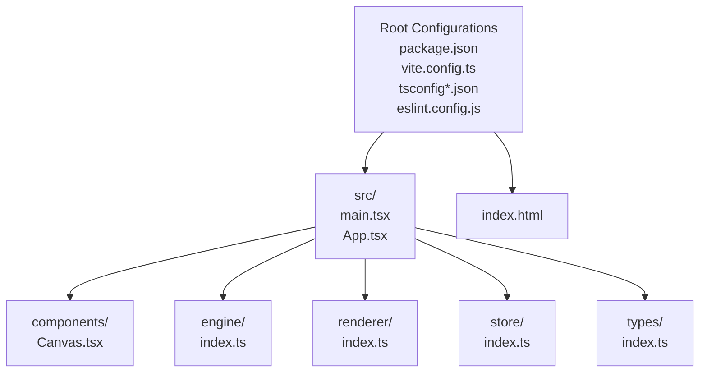
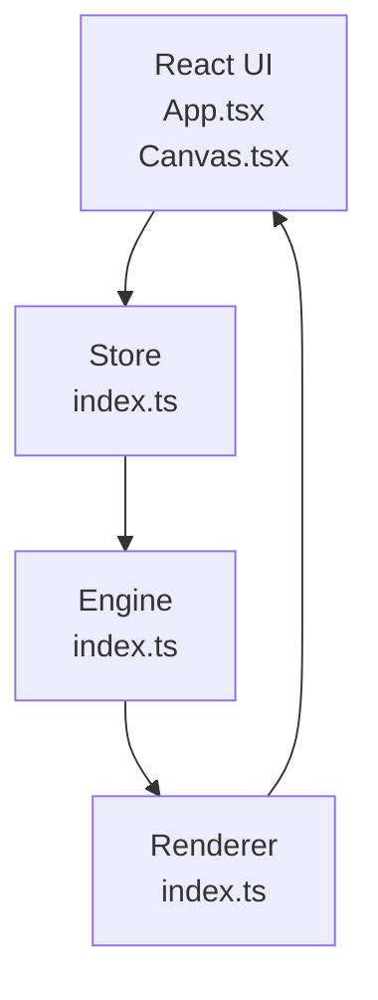

# Getting Started

<cite>
**Referenced Files in This Document**
- [package.json](file://package.json)
- [README.md](file://README.md)
- [vite.config.ts](file://vite.config.ts)
- [index.html](file://index.html)
- [src/main.tsx](file://src/main.tsx)
- [src/App.tsx](file://src/App.tsx)
- [src/components/Canvas.tsx](file://src/components/Canvas.tsx)
- [src/engine/index.ts](file://src/engine/index.ts)
- [src/renderer/index.ts](file://src/renderer/index.ts)
- [src/store/index.ts](file://src/store/index.ts)
- [src/types/index.ts](file://src/types/index.ts)
- [tsconfig.json](file://tsconfig.json)
- [tsconfig.app.json](file://tsconfig.app.json)
- [tsconfig.node.json](file://tsconfig.node.json)
- [eslint.config.js](file://eslint.config.js)
</cite>

## Table of Contents
1. [Introduction](#introduction)
2. [Prerequisites](#prerequisites)
3. [Installation](#installation)
4. [Development Workflow](#development-workflow)
5. [Project Structure Walkthrough](#project-structure-walkthrough)
6. [Environment Setup](#environment-setup)
7. [Build and Preview](#build-and-preview)
8. [Basic Usage Patterns](#basic-usage-patterns)
9. [Architecture Overview](#architecture-overview)
10. [Troubleshooting Guide](#troubleshooting-guide)
11. [Conclusion](#conclusion)

## Introduction
This guide helps you quickly set up and start using the AI Editor Engine. It covers prerequisites, installation via npm or yarn, running the development server with Vite, understanding the project structure, environment configuration, building and previewing the app, and basic usage patterns. By the end, you will be able to launch the editor interface, explore the layout, and understand how the core layers (engine, renderer, store) fit together.

## Prerequisites
- Node.js: Install a current LTS version compatible with the project’s toolchain. The project uses modern tooling (Vite, TypeScript, React) and requires a recent Node.js runtime.
- Package manager: Either npm or yarn is supported. The scripts in the project are configured for npm by default but work with yarn as well.
- Text editor or IDE: Recommended to have TypeScript and ESLint extensions enabled for a smooth development experience.

**Section sources**
- [package.json:6-11](file://package.json#L6-L11)
- [tsconfig.app.json:1-22](file://tsconfig.app.json#L1-L22)
- [tsconfig.node.json:1-20](file://tsconfig.node.json#L1-L20)

## Installation
Follow these steps to install dependencies and prepare your environment:

1. Open a terminal in the project root.
2. Install dependencies using your preferred package manager:
   - npm: Run the install command to fetch all dependencies declared in the project manifest.
   - yarn: Alternatively, run the yarn equivalent to install dependencies.
3. After installation completes, you are ready to start the development server.

What you get after installation:
- Dependencies for React, TypeScript, Vite, ESLint, and related plugins.
- Local development server and build scripts configured in the project manifest.

**Section sources**
- [package.json:12-27](file://package.json#L12-L27)
- [package.json:6-11](file://package.json#L6-L11)

## Development Workflow
The typical development workflow is:
- Start the dev server to preview the editor locally.
- Edit source files under src to modify UI, engine logic, renderer utilities, or store state.
- Use the preview script to test production builds locally.
- Run lint checks to keep code quality consistent.

Key commands:
- Start development server: runs the Vite dev server.
- Build the project: compiles TypeScript and bundles assets with Vite.
- Preview production build: serves the built assets locally.
- Lint the project: runs ESLint across the codebase.

**Section sources**
- [package.json:6-11](file://package.json#L6-L11)

## Project Structure Walkthrough
At a high level, the project is organized into:
- Root configuration files for Vite, TypeScript, ESLint, and package management.
- A src directory containing the React application shell and core layers:
  - Application shell and entrypoint
  - Editor canvas component
  - Engine, renderer, and store modules (framework-agnostic layers)
  - Shared types

**Diagram sources**
- [package.json:1-29](file://package.json#L1-L29)
- [vite.config.ts:1-7](file://vite.config.ts#L1-L7)
- [tsconfig.json:1-8](file://tsconfig.json#L1-L8)
- [eslint.config.js:1-9](file://eslint.config.js#L1-L9)
- [index.html:1-14](file://index.html#L1-L14)
- [src/main.tsx:1-10](file://src/main.tsx#L1-L10)
- [src/App.tsx:1-17](file://src/App.tsx#L1-L17)
- [src/components/Canvas.tsx:1-40](file://src/components/Canvas.tsx#L1-L40)
- [src/engine/index.ts:1-3](file://src/engine/index.ts#L1-L3)
- [src/renderer/index.ts:1-3](file://src/renderer/index.ts#L1-L3)
- [src/store/index.ts:1-2](file://src/store/index.ts#L1-L2)
- [src/types/index.ts:1-2](file://src/types/index.ts#L1-L2)

**Section sources**
- [README.md:1-3](file://README.md#L1-L3)
- [index.html:1-14](file://index.html#L1-L14)
- [src/main.tsx:1-10](file://src/main.tsx#L1-L10)
- [src/App.tsx:1-17](file://src/App.tsx#L1-L17)
- [src/components/Canvas.tsx:1-40](file://src/components/Canvas.tsx#L1-L40)
- [src/engine/index.ts:1-3](file://src/engine/index.ts#L1-L3)
- [src/renderer/index.ts:1-3](file://src/renderer/index.ts#L1-L3)
- [src/store/index.ts:1-2](file://src/store/index.ts#L1-L2)
- [src/types/index.ts:1-2](file://src/types/index.ts#L1-L2)

## Environment Setup
- Vite configuration: The project uses a minimal Vite setup with the React plugin. This enables fast development reloads and JSX transformations.
- HTML entry: The HTML file defines the DOM root element and loads the application entrypoint module.
- TypeScript configuration: Two TS configs split concerns between application code and tooling:
  - tsconfig.app.json: Targets browser environments and JSX transforms for React.
  - tsconfig.node.json: Targets Node-like tooling (Vite config) with ESNext modules.
- ESLint configuration: Enforces React hooks rules and helpful TypeScript linting preferences.

How to verify your environment:
- Confirm Node.js is installed and reachable from your terminal.
- Ensure the package manager cache is clean if you encounter dependency resolution issues.
- Verify that the Vite dev server starts without errors.

**Section sources**
- [vite.config.ts:1-7](file://vite.config.ts#L1-L7)
- [index.html:1-14](file://index.html#L1-L14)
- [tsconfig.json:1-8](file://tsconfig.json#L1-L8)
- [tsconfig.app.json:1-22](file://tsconfig.app.json#L1-L22)
- [tsconfig.node.json:1-20](file://tsconfig.node.json#L1-L20)
- [eslint.config.js:1-9](file://eslint.config.js#L1-L9)

## Build and Preview
Build process:
- The build script compiles TypeScript projects first, then bundles assets with Vite for production.
- Output artifacts are placed under the dist directory by default.

Preview process:
- The preview script serves the production build locally so you can validate the bundled output.

Steps:
1. Run the build script to compile and bundle the project.
2. Run the preview script to serve the production build locally.
3. Open the printed URL in your browser to inspect the production-ready editor.

**Section sources**
- [package.json:6-11](file://package.json#L6-L11)

## Basic Usage Patterns
Getting started quickly:
- Launch the development server to open the editor in your browser.
- Explore the main layout: header with title and a main area hosting the editor canvas.
- The canvas component renders a centered content area representing the editor surface.

Typical tasks:
- Modify the App layout or Canvas component to adjust the UI.
- Add or refine engine, renderer, and store logic as you implement features.
- Keep code quality high by running the linter regularly.

Where to start:
- Entry point: The React root mounts the App component.
- UI surface: The Canvas component defines the primary editing area.

**Section sources**
- [src/main.tsx:1-10](file://src/main.tsx#L1-L10)
- [src/App.tsx:1-17](file://src/App.tsx#L1-L17)
- [src/components/Canvas.tsx:1-40](file://src/components/Canvas.tsx#L1-L40)

## Architecture Overview
The editor is structured around three core layers:
- Engine: Core logic and state transitions. All state changes must flow through the engine’s command execution mechanism.
- Renderer: Pure data-to-UI utilities that render the engine’s state into the UI.
- Store: Editor state separate from scene data, coordinating UI state and interactions.

**Diagram sources**
- [src/App.tsx:1-17](file://src/App.tsx#L1-L17)
- [src/components/Canvas.tsx:1-40](file://src/components/Canvas.tsx#L1-L40)
- [src/store/index.ts:1-2](file://src/store/index.ts#L1-L2)
- [src/engine/index.ts:1-3](file://src/engine/index.ts#L1-L3)
- [src/renderer/index.ts:1-3](file://src/renderer/index.ts#L1-L3)

## Troubleshooting Guide
Common setup issues and fixes:
- Node.js version mismatch:
  - Symptom: Build or dev server fails with engine or loader errors.
  - Fix: Use a current LTS Node.js version compatible with the project’s toolchain.
- Missing dependencies:
  - Symptom: Dev server fails immediately or throws module resolution errors.
  - Fix: Reinstall dependencies using your package manager.
- Port already in use:
  - Symptom: Vite reports the port is busy.
  - Fix: Stop the conflicting process or configure a different port in Vite settings.
- TypeScript or ESLint errors:
  - Symptom: Lint or build fails with type or rule violations.
  - Fix: Address reported issues or temporarily run the linter to identify problems.
- Incorrect HTML root:
  - Symptom: Blank page or missing mount point.
  - Fix: Ensure the HTML file defines the root element and loads the entry module.

**Section sources**
- [package.json:6-11](file://package.json#L6-L11)
- [vite.config.ts:1-7](file://vite.config.ts#L1-L7)
- [index.html:1-14](file://index.html#L1-L14)
- [eslint.config.js:1-9](file://eslint.config.js#L1-L9)

## Conclusion
You now have the essentials to get productive with the AI Editor Engine:
- Installed dependencies and verified your environment.
- Started the development server and accessed the editor interface.
- Understood the project structure and the roles of the engine, renderer, and store layers.
- Know how to build, preview, and troubleshoot common issues.

Continue by exploring the App and Canvas components, then integrate engine and renderer logic as you implement features.