# Plugin System

<cite>
**Referenced Files in This Document**
- [engine/index.ts](file://src/engine/index.ts)
- [spec1.md](file://spec1.md)
- [spec.md](file://spec.md)
- [package.json](file://package.json)
- [App.tsx](file://src/App.tsx)
- [Canvas.tsx](file://src/components/Canvas.tsx)
- [main.tsx](file://src/main.tsx)
</cite>

## Table of Contents
1. [Introduction](#introduction)
2. [Project Structure](#project-structure)
3. [Core Components](#core-components)
4. [Architecture Overview](#architecture-overview)
5. [Detailed Component Analysis](#detailed-component-analysis)
6. [Dependency Analysis](#dependency-analysis)
7. [Performance Considerations](#performance-considerations)
8. [Troubleshooting Guide](#troubleshooting-guide)
9. [Conclusion](#conclusion)
10. [Appendices](#appendices)

## Introduction
This document describes the Plugin System designed to enable extensibility and customization of the editor engine. The system is built around a standardized plugin interface and a registration mechanism that integrates with the core engine. It defines extension points for components, panels, commands, and shortcuts, and ensures plugins participate in the undo/redo functionality through the command pattern. The plugin architecture is intended to be framework-agnostic while enabling seamless integration with the rendering and UI layers.

## Project Structure
The repository follows a layered structure with clear separation of concerns:
- Engine: Core logic and state transitions via commands
- Renderer: Pure rendering functions
- Store: State management utilities
- Types: Shared type definitions
- Components: UI components (e.g., Canvas)
- App and main entry: Application bootstrap

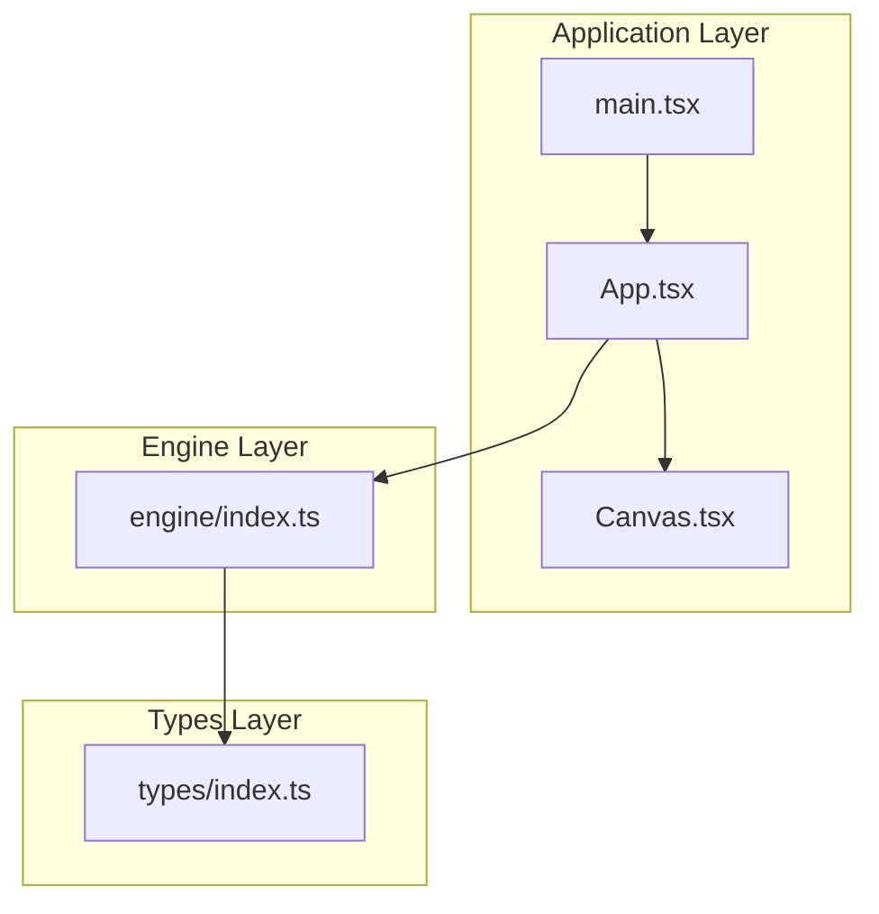

**Diagram sources**
- [engine/index.ts:1-3](file://src/engine/index.ts#L1-L3)
- [App.tsx:1-17](file://src/App.tsx#L1-L17)
- [Canvas.tsx:1-40](file://src/components/Canvas.tsx#L1-L40)
- [main.tsx:1-10](file://src/main.tsx#L1-L10)

**Section sources**
- [engine/index.ts:1-3](file://src/engine/index.ts#L1-L3)
- [package.json:1-29](file://package.json#L1-L29)
- [App.tsx:1-17](file://src/App.tsx#L1-L17)
- [Canvas.tsx:1-40](file://src/components/Canvas.tsx#L1-L40)
- [main.tsx:1-10](file://src/main.tsx#L1-L10)

## Core Components
The Plugin System centers on the following core components:
- Plugin Registry: Maintains lists of registered extensions (components, panels, commands, shortcuts)
- PluginContext: Provides APIs for plugins to register extensions and access engine services
- Standardized Plugin Interface: Defines the contract for plugin initialization and lifecycle
- engine.use(): Registration entry point that installs plugins into the engine

Key architectural constraints:
- All state changes must go through engine.execute(command)
- Scene Graph is the single source of truth
- Engine must be framework-agnostic
- Rendering must be pure (data → UI)
- Undo/redo must be supported via the command pattern

These constraints ensure that plugins remain decoupled from UI frameworks and integrate cleanly with the engine's command-driven architecture.

**Section sources**
- [engine/index.ts:1-3](file://src/engine/index.ts#L1-L3)
- [spec1.md:23-41](file://spec1.md#L23-L41)
- [spec.md:393-401](file://spec.md#L393-L401)

## Architecture Overview
The Plugin System integrates with the engine and UI layers as follows:
- Plugins register extensions during installation via engine.use(plugin)
- Registered components are rendered by the UI layer
- Panels and shortcuts extend the editor UI and interaction model
- Commands registered by plugins are executed through engine.execute(command), ensuring undo/redo support

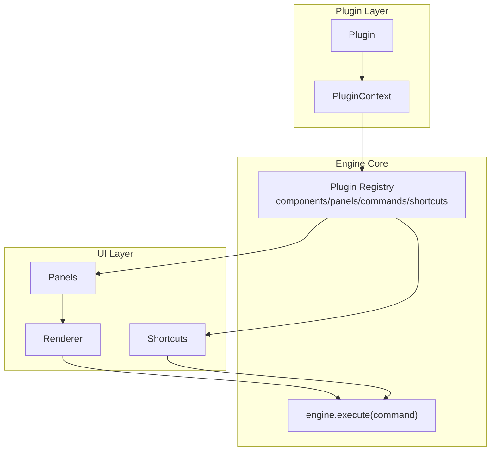

**Diagram sources**
- [spec1.md:218-236](file://spec1.md#L218-L236)
- [engine/index.ts:1-3](file://src/engine/index.ts#L1-L3)

## Detailed Component Analysis

### Plugin Registry and Extension Points
The registry organizes extensions into categories:
- components: New element types and renderers
- panels: Additional UI panels (e.g., property panel extensions)
- commands: New commands that modify the Scene Graph
- shortcuts: Keyboard shortcuts bound to commands

Plugins use PluginContext to register extensions. The registry ensures that each extension is properly categorized and integrated with the engine and renderer.

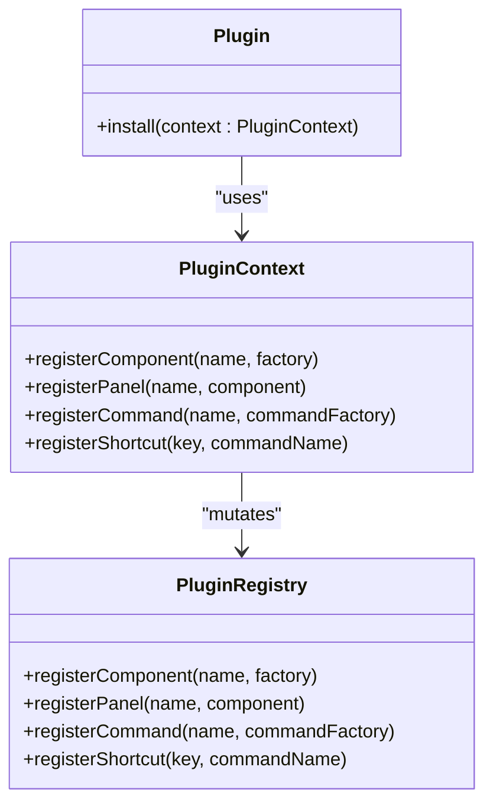

**Diagram sources**
- [spec1.md:227-235](file://spec1.md#L227-L235)

**Section sources**
- [spec1.md:227-235](file://spec1.md#L227-L235)

### Plugin Registration Mechanism (engine.use)
The engine.use(plugin) method installs plugins and initializes their extensions. During installation:
- The plugin's install method is invoked with PluginContext
- Extensions are registered into the appropriate registry buckets
- The plugin becomes part of the engine's extension ecosystem

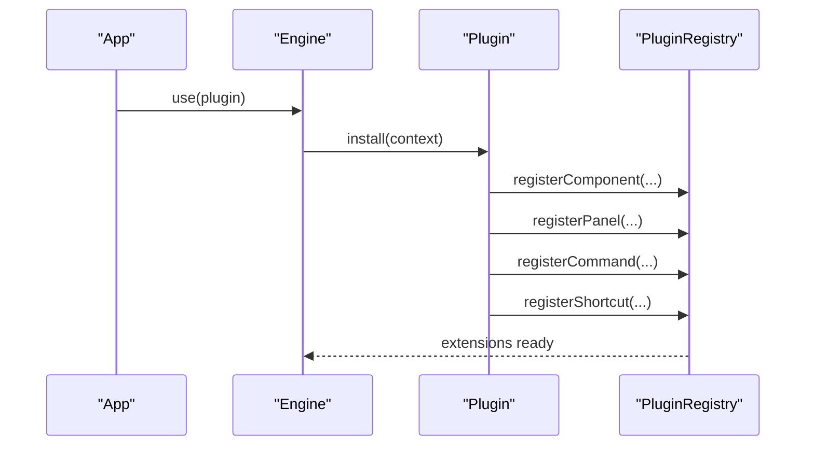

**Diagram sources**
- [spec1.md:227-235](file://spec1.md#L227-L235)

**Section sources**
- [spec1.md:227-235](file://spec1.md#L227-L235)

### Standardized Plugin Interface and Lifecycle
A plugin must implement an install method that receives PluginContext. The lifecycle includes:
- Initialization: install(context)
- Runtime: registering extensions and participating in commands
- Cleanup: optional teardown (if needed)

The interface ensures consistent behavior across plugins and simplifies integration with the engine.

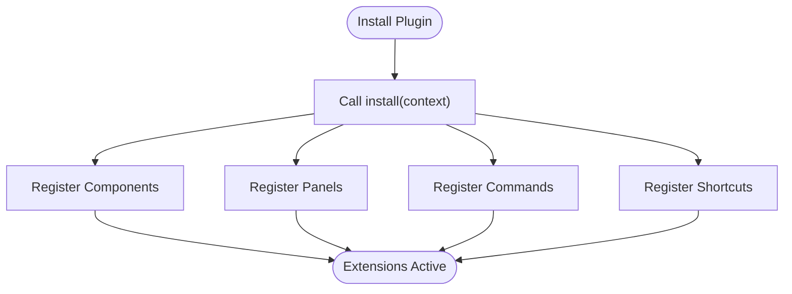

**Diagram sources**
- [spec1.md:227-235](file://spec1.md#L227-L235)

**Section sources**
- [spec1.md:227-235](file://spec1.md#L227-L235)

### Integration Patterns with the Core Engine
Plugins must integrate with the engine through the command pattern:
- All state mutations occur via commands
- Commands are pushed to the engine's history for undo/redo
- Renderers consume the Scene Graph to produce UI updates

This ensures consistency and enables robust collaboration and time-travel debugging.

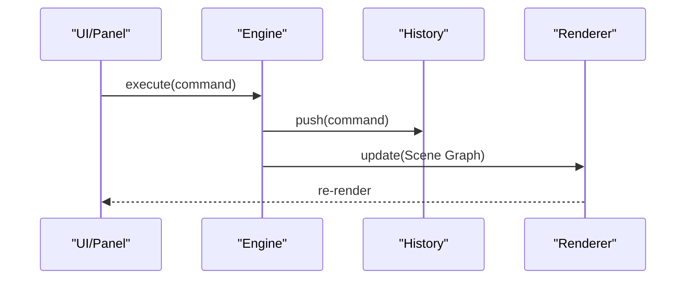

**Diagram sources**
- [engine/index.ts:1-3](file://src/engine/index.ts#L1-L3)
- [spec1.md:32-38](file://spec1.md#L32-L38)

**Section sources**
- [engine/index.ts:1-3](file://src/engine/index.ts#L1-L3)
- [spec1.md:32-38](file://spec1.md#L32-L38)

### Examples of Creating Custom Plugins

#### Example 1: New Element Type (Video Component)
- Register a new component under components
- Provide a renderer compatible with the Scene Graph
- Optionally add a panel for video-specific properties
- Ensure the component participates in selection and transformation

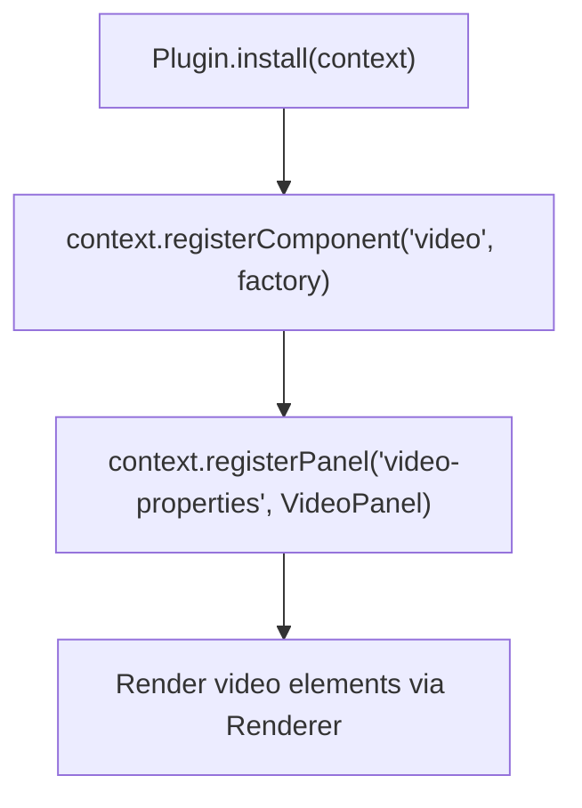

**Diagram sources**
- [spec1.md:231-234](file://spec1.md#L231-L234)

**Section sources**
- [spec1.md:231-234](file://spec1.md#L231-L234)

#### Example 2: Additional Toolbar Panel
- Register a new panel under panels
- Provide UI for quick actions or property editing
- Bind panel actions to commands for undo/redo support

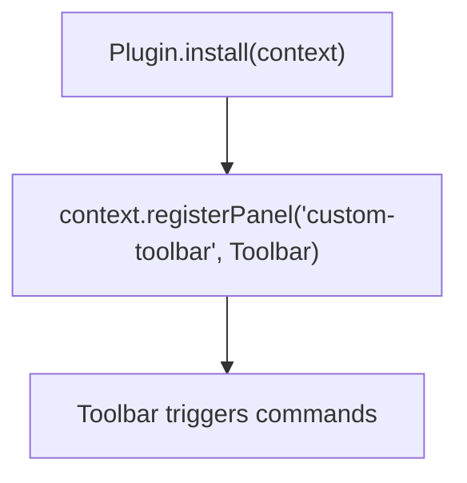

**Diagram sources**
- [spec1.md:229-235](file://spec1.md#L229-L235)

**Section sources**
- [spec1.md:229-235](file://spec1.md#L229-L235)

#### Example 3: Specialized Command (Delete Element)
- Register a command under commands
- Implement execute and undo logic
- Ensure the command operates on the Scene Graph

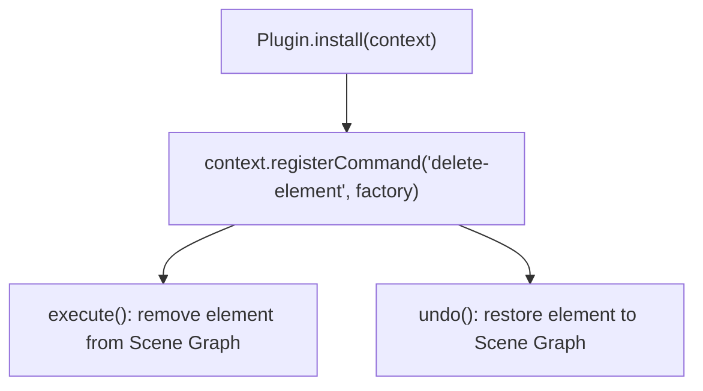

**Diagram sources**
- [spec1.md:229-235](file://spec1.md#L229-L235)

**Section sources**
- [spec1.md:229-235](file://spec1.md#L229-L235)

### Relationship Between Plugins and the Command Pattern System
Plugins participate in undo/redo by adhering to the command pattern:
- Commands encapsulate state changes
- Commands are pushed to the engine's history
- Undo/redo operations replay or reverse command sequences

This guarantees consistency with the overall editor architecture and supports reliable collaboration and debugging.

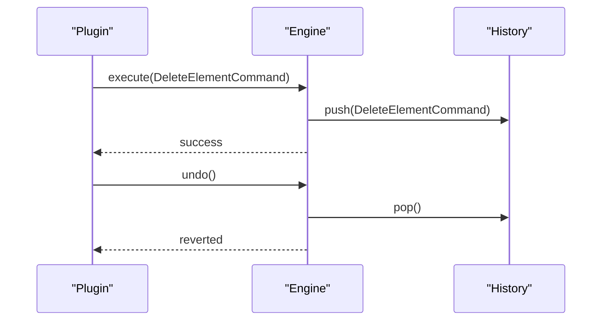

**Diagram sources**
- [spec1.md:114-146](file://spec1.md#L114-L146)
- [engine/index.ts:1-3](file://src/engine/index.ts#L1-L3)

**Section sources**
- [spec1.md:114-146](file://spec1.md#L114-L146)
- [engine/index.ts:1-3](file://src/engine/index.ts#L1-L3)

## Dependency Analysis
The plugin system relies on the engine's command-driven architecture and shared types. Dependencies are intentionally minimal to maintain framework-agnosticism and modularity.

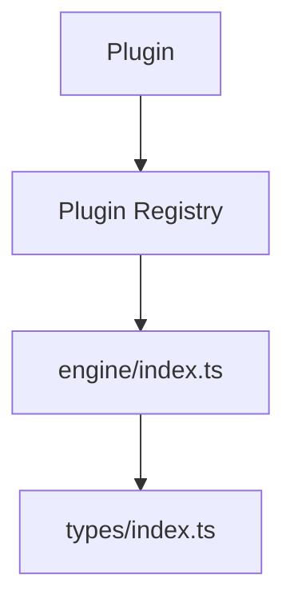

**Diagram sources**
- [engine/index.ts:1-3](file://src/engine/index.ts#L1-L3)
- [spec1.md:227-235](file://spec1.md#L227-L235)

**Section sources**
- [engine/index.ts:1-3](file://src/engine/index.ts#L1-L3)
- [spec1.md:227-235](file://spec1.md#L227-L235)

## Performance Considerations
- Keep plugin registrations lightweight and deferred where possible
- Avoid heavy computations in install; defer to runtime
- Ensure renderers are pure and idempotent
- Minimize cross-layer coupling to reduce re-rendering overhead

## Troubleshooting Guide
Common issues and resolutions:
- Violating the single-source-of-truth rule: Always use engine.execute(command) for state changes
- Direct DOM manipulation in plugins: Use renderers and Scene Graph updates
- Missing undo/redo: Ensure commands implement both execute and undo
- Plugin not appearing: Verify registration in the correct category (components/panels/commands/shortcuts)

**Section sources**
- [spec1.md:14-19](file://spec1.md#L14-L19)
- [spec1.md:227-235](file://spec1.md#L227-L235)
- [engine/index.ts:1-3](file://src/engine/index.ts#L1-L3)

## Conclusion
The Plugin System provides a robust, extensible foundation for customizing the editor engine. By standardizing the plugin interface, enforcing command-driven state changes, and organizing extension points, it enables developers to add new element types, panels, commands, and shortcuts while maintaining consistency with the core architecture. Following the guidelines and best practices outlined here ensures reliable integration and long-term maintainability.

## Appendices
- Example plugin categories: components, panels, commands, shortcuts
- Integration touchpoints: PluginContext, PluginRegistry, engine.execute(command)
- Architectural constraints: Single source of truth, framework-agnostic engine, pure rendering, command pattern for undo/redo