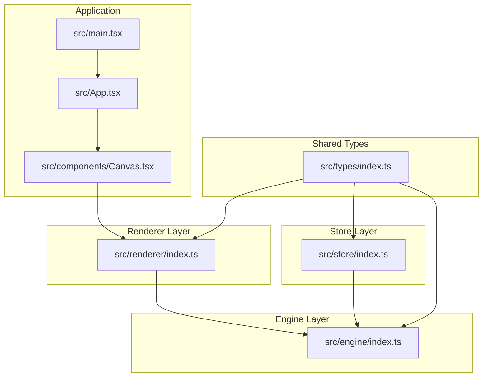
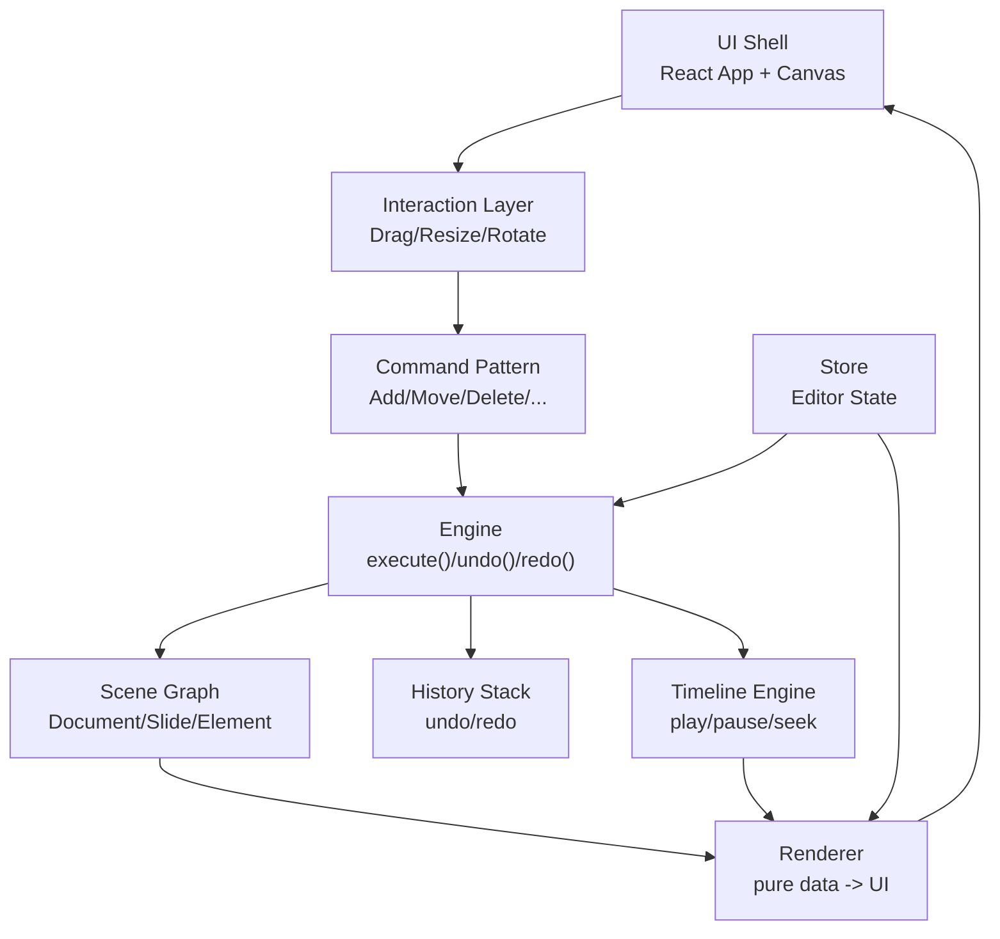
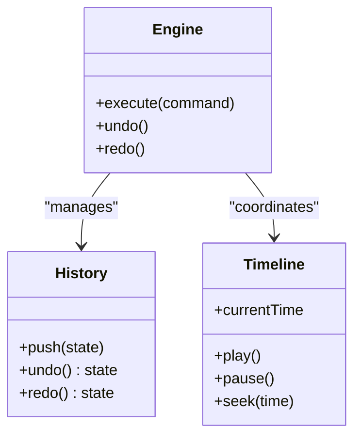
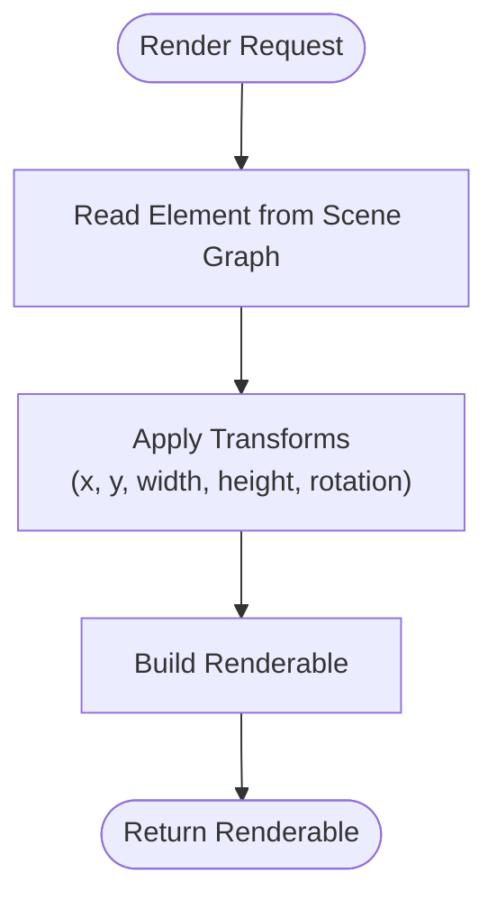
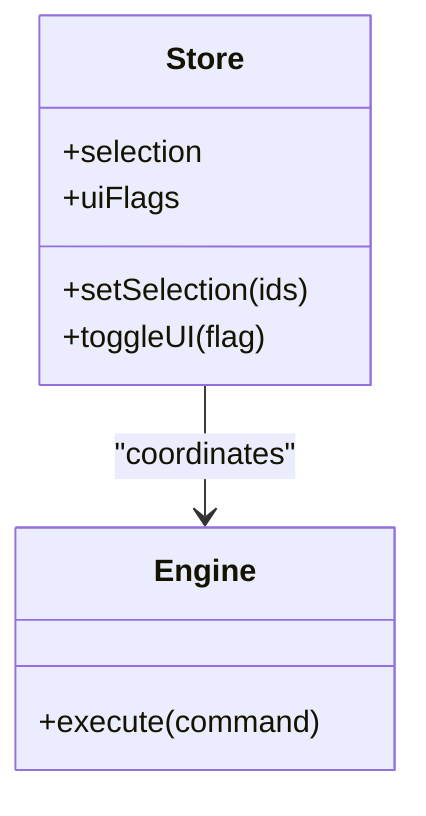
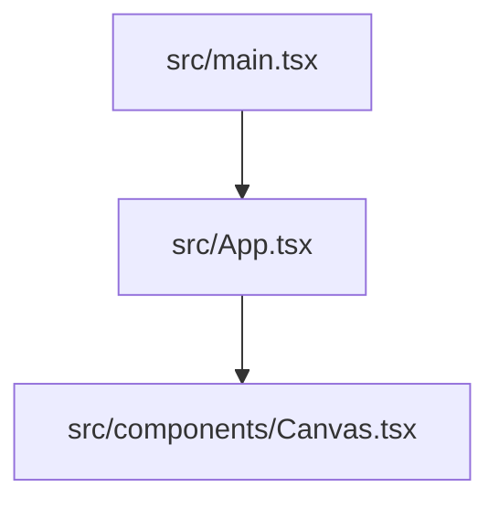
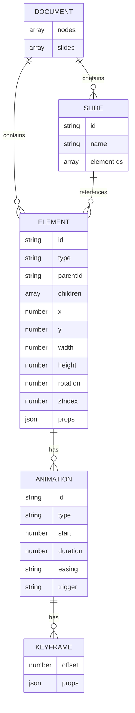
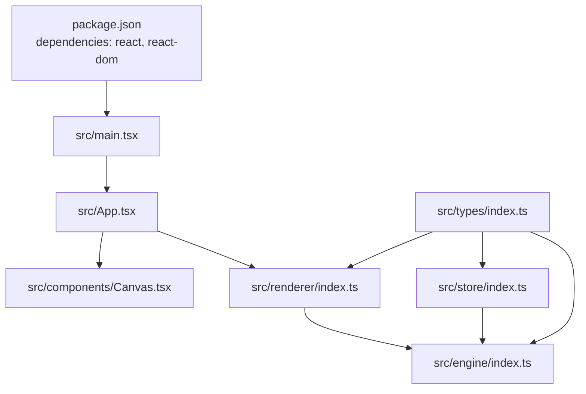

# Project Overview

<cite>
**Referenced Files in This Document**
- [README.md](file://README.md)
- [package.json](file://package.json)
- [spec.md](file://spec.md)
- [spec1.md](file://spec1.md)
- [src/main.tsx](file://src/main.tsx)
- [src/App.tsx](file://src/App.tsx)
- [src/components/Canvas.tsx](file://src/components/Canvas.tsx)
- [src/engine/index.ts](file://src/engine/index.ts)
- [src/renderer/index.ts](file://src/renderer/index.ts)
- [src/store/index.ts](file://src/store/index.ts)
- [src/types/index.ts](file://src/types/index.ts)
</cite>

## Table of Contents
1. [Introduction](#introduction)
2. [Project Structure](#project-structure)
3. [Core Components](#core-components)
4. [Architecture Overview](#architecture-overview)
5. [Detailed Component Analysis](#detailed-component-analysis)
6. [Dependency Analysis](#dependency-analysis)
7. [Performance Considerations](#performance-considerations)
8. [Troubleshooting Guide](#troubleshooting-guide)
9. [Conclusion](#conclusion)
10. [Appendices](#appendices)

## Introduction
AI Editor Engine is a framework-agnostic design tool engine focused on creating educational slide content. Its primary goal is to separate concerns across three distinct layers:
- Engine: Pure data model and command-driven state changes
- Renderer: Framework-agnostic rendering utilities
- Store: Editor state management

The project emphasizes a Scene Graph as the single source of truth, a command pattern for all state mutations, and a timeline engine for time-driven animations. It targets developers building design tools who need a reusable, extensible foundation that remains independent of any UI framework while supporting modern design tool patterns such as drag/resize/rotate, grouping, layer management, and timeline-based animation.

## Project Structure
The project follows a clean, layered structure with dedicated directories for engine, renderer, store, types, and UI components. The application bootstraps via a minimal React entry point and renders a Canvas component that hosts the editing surface.

**Diagram sources**
- [src/main.tsx:1-10](file://src/main.tsx#L1-L10)
- [src/App.tsx:1-17](file://src/App.tsx#L1-L17)
- [src/components/Canvas.tsx:1-40](file://src/components/Canvas.tsx#L1-L40)
- [src/engine/index.ts:1-3](file://src/engine/index.ts#L1-L3)
- [src/renderer/index.ts:1-3](file://src/renderer/index.ts#L1-L3)
- [src/store/index.ts:1-2](file://src/store/index.ts#L1-L2)
- [src/types/index.ts:1-2](file://src/types/index.ts#L1-L2)

**Section sources**
- [src/main.tsx:1-10](file://src/main.tsx#L1-L10)
- [src/App.tsx:1-17](file://src/App.tsx#L1-L17)
- [src/components/Canvas.tsx:1-40](file://src/components/Canvas.tsx#L1-L40)
- [src/engine/index.ts:1-3](file://src/engine/index.ts#L1-L3)
- [src/renderer/index.ts:1-3](file://src/renderer/index.ts#L1-L3)
- [src/store/index.ts:1-2](file://src/store/index.ts#L1-L2)
- [src/types/index.ts:1-2](file://src/types/index.ts#L1-L2)

## Core Components
- Engine: Centralized state machine enforcing that all changes occur via commands. It maintains the scene graph, editor state, history, and timeline. The engine is designed to be framework-agnostic and must not depend on React.
- Renderer: Pure data-to-UI utilities that convert scene graph elements into framework-agnostic renderables. It supports shapes, images, text, and transforms.
- Store: Editor state (selection, UI flags, etc.) separated from scene data. It coordinates with the engine and renderer to drive the UI.
- Types: Shared TypeScript types for the entire project, ensuring type safety across layers.
- UI Shell: Minimal React shell (App and Canvas) that integrates the renderer and exposes the editing surface.

Practical examples demonstrating separation:
- Engine executes commands to mutate the scene graph; the renderer reads the scene graph to produce UI; the store manages selection and UI flags.
- Drag/resize/rotate updates are captured in the UI layer and translated into commands executed by the engine, ensuring the scene graph remains the single source of truth.

**Section sources**
- [src/engine/index.ts:1-3](file://src/engine/index.ts#L1-L3)
- [src/renderer/index.ts:1-3](file://src/renderer/index.ts#L1-L3)
- [src/store/index.ts:1-2](file://src/store/index.ts#L1-L2)
- [src/types/index.ts:1-2](file://src/types/index.ts#L1-L2)
- [spec.md:393-401](file://spec.md#L393-L401)

## Architecture Overview
The system adheres to a strict separation of concerns:
- Data Modeling: Scene Graph defines Documents, Slides, Elements, Animations, and Keyframes. It is the single source of truth.
- Interactive Control: Commands encapsulate all user actions. The engine validates and applies them, maintaining a history stack for undo/redo.
- Rendering: Pure functions translate scene graph data into UI renderables, decoupled from any framework.
- Timeline Engine: Time-based animation orchestration drives element states via keyframe interpolation.

**Diagram sources**
- [spec.md:21-37](file://spec.md#L21-L37)
- [spec.md:41-134](file://spec.md#L41-L134)
- [spec.md:231-278](file://spec.md#L231-L278)
- [spec1.md:23-41](file://spec1.md#L23-L41)

**Section sources**
- [spec.md:21-37](file://spec.md#L21-L37)
- [spec.md:41-134](file://spec.md#L41-L134)
- [spec.md:231-278](file://spec.md#L231-L278)
- [spec1.md:23-41](file://spec1.md#L23-L41)

## Detailed Component Analysis

### Engine Layer
Purpose:
- Enforce that all state changes go through engine.execute(command)
- Manage scene graph, editor state, history, and timeline
- Remain framework-agnostic

Key responsibilities:
- Accept commands and apply them to the scene graph
- Maintain undo/redo stacks
- Coordinate with timeline for time-based animations

Design principles:
- No React dependency
- Single source of truth via Scene Graph
- All operations support undo/redo

**Diagram sources**
- [spec1.md:104-110](file://spec1.md#L104-L110)
- [spec1.md:139-146](file://spec1.md#L139-L146)
- [spec1.md:190-197](file://spec1.md#L190-L197)

**Section sources**
- [src/engine/index.ts:1-3](file://src/engine/index.ts#L1-L3)
- [spec1.md:104-110](file://spec1.md#L104-L110)
- [spec1.md:139-146](file://spec1.md#L139-L146)
- [spec1.md:190-197](file://spec1.md#L190-L197)

### Renderer Layer
Purpose:
- Pure data-to-UI conversion
- Framework-agnostic rendering utilities
- Support shapes, images, text, and transforms

Rendering pipeline:
- Renderer reads scene graph elements
- Applies transforms (position, size, rotation)
- Produces renderables suitable for the chosen framework

**Diagram sources**
- [src/renderer/index.ts:1-3](file://src/renderer/index.ts#L1-L3)
- [spec1.md:154-162](file://spec1.md#L154-L162)

**Section sources**
- [src/renderer/index.ts:1-3](file://src/renderer/index.ts#L1-L3)
- [spec1.md:154-162](file://spec1.md#L154-L162)

### Store Layer
Purpose:
- Separate editor state from scene data
- Manage UI flags, selection, and transient state
- Coordinate with engine and renderer

Responsibilities:
- Track selection and UI state
- Trigger re-renders based on engine and store changes
- Provide hooks for interaction handlers

**Diagram sources**
- [src/store/index.ts:1-2](file://src/store/index.ts#L1-L2)
- [spec1.md:139-146](file://spec1.md#L139-L146)

**Section sources**
- [src/store/index.ts:1-2](file://src/store/index.ts#L1-L2)
- [spec1.md:139-146](file://spec1.md#L139-L146)

### UI Shell and Canvas
Purpose:
- Minimal React shell to bootstrap the app
- Canvas component hosts the editing area

Structure:
- App wraps the Canvas
- Canvas centers the editing surface and displays placeholder content

**Diagram sources**
- [src/main.tsx:1-10](file://src/main.tsx#L1-L10)
- [src/App.tsx:1-17](file://src/App.tsx#L1-L17)
- [src/components/Canvas.tsx:1-40](file://src/components/Canvas.tsx#L1-L40)

**Section sources**
- [src/main.tsx:1-10](file://src/main.tsx#L1-L10)
- [src/App.tsx:1-17](file://src/App.tsx#L1-L17)
- [src/components/Canvas.tsx:1-40](file://src/components/Canvas.tsx#L1-L40)

### Scene Graph and Timeline Engine
Scene Graph:
- Document, Slide, Element, Animation, Keyframe define the core data model
- Elements reference parents and children by ID; no nested objects
- Animations include timing, easing, and optional keyframes

Timeline Engine:
- Drives animations via time progression
- Supports play, pause, seek, and keyframe interpolation
- Integrates with renderer to compute element states per frame

**Diagram sources**
- [spec.md:49-134](file://spec.md#L49-L134)
- [spec.md:244-278](file://spec.md#L244-L278)

**Section sources**
- [spec.md:49-134](file://spec.md#L49-L134)
- [spec.md:244-278](file://spec.md#L244-L278)

## Dependency Analysis
The project’s current implementation keeps dependencies minimal and focused on React for the UI shell. The engine, renderer, and store are intentionally isolated from framework-specific code to maintain framework-agnosticism.

**Diagram sources**
- [package.json:12-27](file://package.json#L12-L27)
- [src/main.tsx:1-10](file://src/main.tsx#L1-L10)
- [src/App.tsx:1-17](file://src/App.tsx#L1-L17)
- [src/components/Canvas.tsx:1-40](file://src/components/Canvas.tsx#L1-L40)
- [src/engine/index.ts:1-3](file://src/engine/index.ts#L1-L3)
- [src/renderer/index.ts:1-3](file://src/renderer/index.ts#L1-L3)
- [src/store/index.ts:1-2](file://src/store/index.ts#L1-L2)
- [src/types/index.ts:1-2](file://src/types/index.ts#L1-L2)

**Section sources**
- [package.json:12-27](file://package.json#L12-L27)
- [src/main.tsx:1-10](file://src/main.tsx#L1-L10)
- [src/App.tsx:1-17](file://src/App.tsx#L1-L17)
- [src/components/Canvas.tsx:1-40](file://src/components/Canvas.tsx#L1-L40)
- [src/engine/index.ts:1-3](file://src/engine/index.ts#L1-L3)
- [src/renderer/index.ts:1-3](file://src/renderer/index.ts#L1-L3)
- [src/store/index.ts:1-2](file://src/store/index.ts#L1-L2)
- [src/types/index.ts:1-2](file://src/types/index.ts#L1-L2)

## Performance Considerations
- Keep renderer pure and deterministic to enable efficient re-rendering strategies.
- Use timeline-driven updates to minimize layout thrashing; batch animation computations per frame.
- Maintain a flat, ID-referenced scene graph to reduce traversal overhead.
- Avoid direct DOM manipulation; always route changes through the engine to leverage immutable updates and selective rendering.

## Troubleshooting Guide
Common pitfalls and remedies:
- Violating the single-source-of-truth rule: Ensure all state changes pass through engine.execute(command). The engine must remain framework-agnostic and free of React dependencies.
- Mixing UI logic with engine logic: Interaction handlers should translate user actions into commands; keep engine free of UI concerns.
- Direct DOM mutations: Do not mutate DOM directly; rely on renderer to reflect engine state.
- Type safety: Reduce reliance on any and improve type coverage using shared types.

**Section sources**
- [spec1.md:23-41](file://spec1.md#L23-L41)
- [spec1.md:299-321](file://spec1.md#L299-L321)
- [src/engine/index.ts:1-3](file://src/engine/index.ts#L1-L3)

## Conclusion
AI Editor Engine provides a robust, framework-agnostic foundation for building design tools with a strong emphasis on separation of concerns. By centralizing state changes in the engine, keeping rendering pure, and managing editor state separately, the system enables scalable, maintainable implementations. The Scene Graph, command pattern, and timeline engine form the backbone of a modern design tool architecture, suitable for both educational exploration and production-grade applications.

## Appendices
- Project name and purpose: See [README.md:1-3](file://README.md#L1-L3)
- Core design principles: See [spec.md:393-401](file://spec.md#L393-L401)
- Implementation roadmap and milestones: See [spec.md:344-391](file://spec.md#L344-L391)
- Architectural constraints and prompts: See [spec1.md:23-41](file://spec1.md#L23-L41)