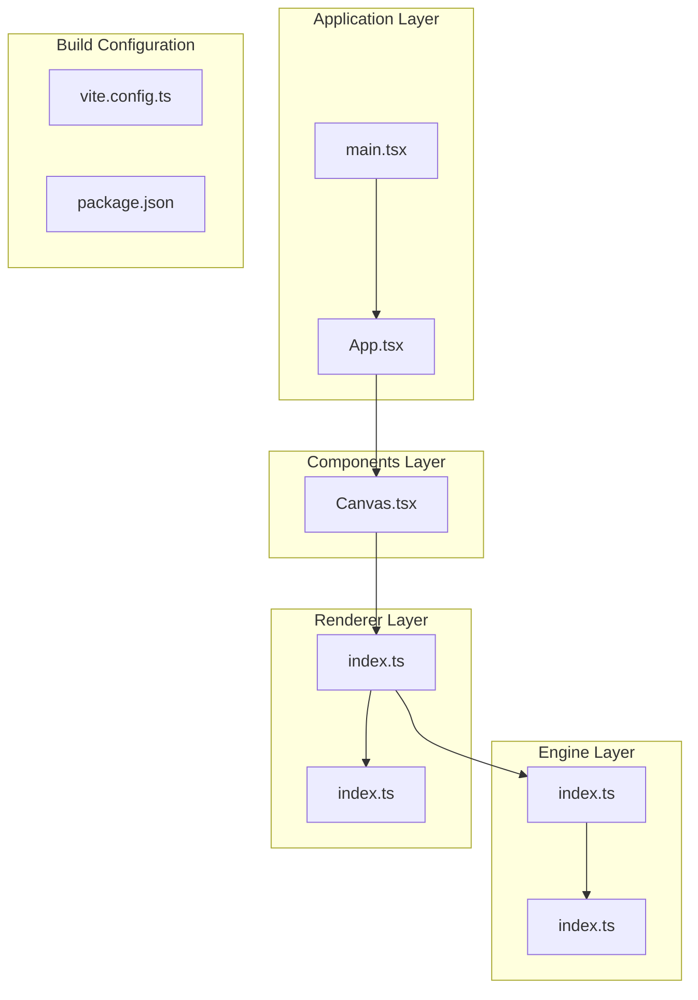
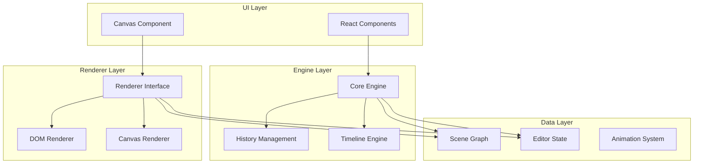
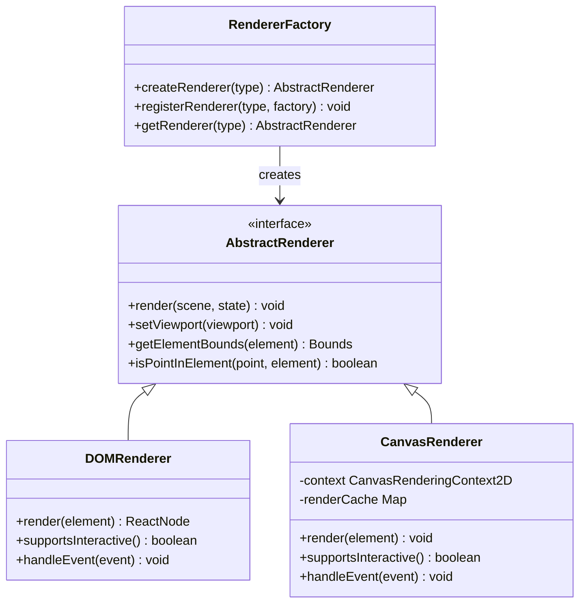
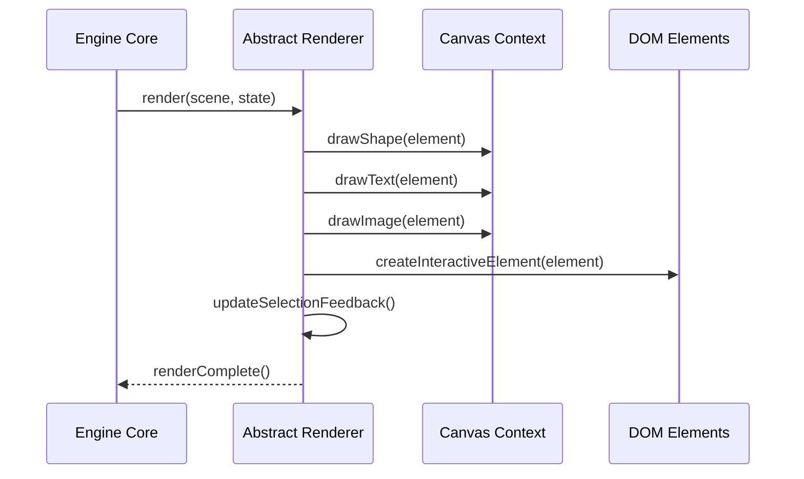
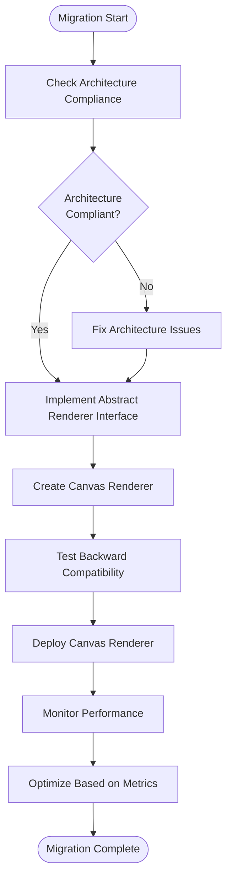
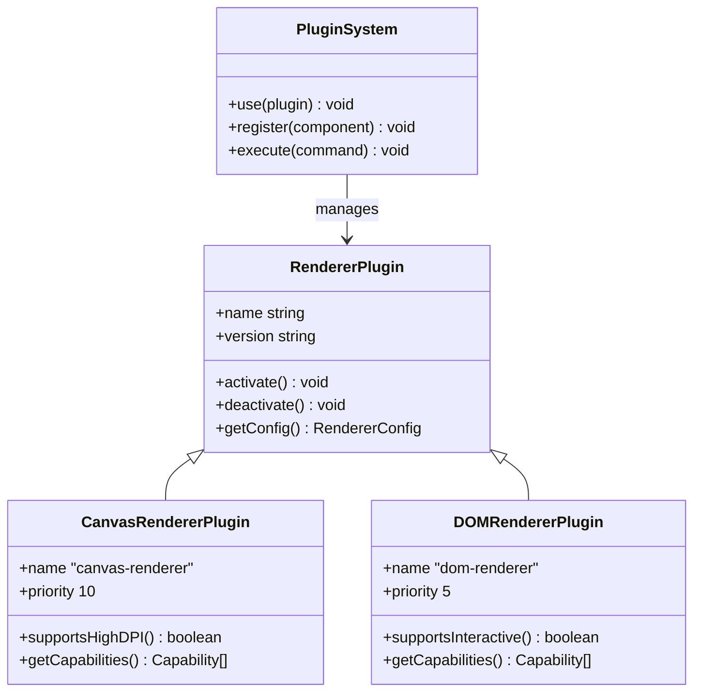

# Canvas Renderer Integration Plans

<cite>
**Referenced Files in This Document**
- [spec.md](file://spec.md)
- [spec1.md](file://spec1.md)
- [src/App.tsx](file://src/App.tsx)
- [src/main.tsx](file://src/main.tsx)
- [src/components/Canvas.tsx](file://src/components/Canvas.tsx)
- [src/engine/index.ts](file://src/engine/index.ts)
- [src/renderer/index.ts](file://src/renderer/index.ts)
- [src/store/index.ts](file://src/store/index.ts)
- [src/types/index.ts](file://src/types/index.ts)
- [package.json](file://package.json)
- [vite.config.ts](file://vite.config.ts)
</cite>

## Table of Contents
1. [Introduction](#introduction)
2. [Project Structure](#project-structure)
3. [Core Components](#core-components)
4. [Architecture Overview](#architecture-overview)
5. [Canvas Renderer Implementation Plan](#canvas-renderer-implementation-plan)
6. [Abstract Renderer Interface Design](#abstract-renderer-interface-design)
7. [Migration Strategy from DOM to Canvas](#migration-strategy-from-dom-to-canvas)
8. [Performance Benefits and Scalability](#performance-benefits-and-scalability)
9. [Plugin System for Renderer Selection](#plugin-system-for-renderer-selection)
10. [Compatibility Considerations](#compatibility-considerations)
11. [Implementation Roadmap](#implementation-roadmap)
12. [Conclusion](#conclusion)

## Introduction

This document outlines comprehensive plans for implementing a canvas-based renderer in the Slides Editor project, transitioning from the current DOM-based rendering approach. The project follows a framework-agnostic architecture with clear separation between the engine layer (data manipulation), renderer layer (UI presentation), and UI layer (framework bindings). The canvas renderer integration represents a strategic evolution that maintains backward compatibility while enabling significant performance improvements and advanced graphics capabilities.

The Slides Editor is designed as a "design tool engine" that separates concerns across multiple layers, ensuring that the core engine remains independent of any specific rendering technology. This architectural foundation makes the transition to canvas-based rendering both feasible and beneficial for the project's long-term scalability and performance goals.

## Project Structure

The current project structure demonstrates a clean separation of concerns with dedicated directories for each major component:

**Diagram sources**
- [src/App.tsx:1-17](file://src/App.tsx#L1-L17)
- [src/main.tsx:1-10](file://src/main.tsx#L1-L10)
- [src/components/Canvas.tsx:1-40](file://src/components/Canvas.tsx#L1-L40)
- [src/engine/index.ts:1-3](file://src/engine/index.ts#L1-L3)
- [src/renderer/index.ts:1-3](file://src/renderer/index.ts#L1-L3)
- [src/store/index.ts:1-2](file://src/store/index.ts#L1-L2)
- [src/types/index.ts:1-229](file://src/types/index.ts#L1-L229)
- [vite.config.ts:1-7](file://vite.config.ts#L1-L7)
- [package.json:1-29](file://package.json#L1-L29)

**Section sources**
- [src/App.tsx:1-17](file://src/App.tsx#L1-L17)
- [src/main.tsx:1-10](file://src/main.tsx#L1-L10)
- [src/components/Canvas.tsx:1-40](file://src/components/Canvas.tsx#L1-L40)
- [src/engine/index.ts:1-3](file://src/engine/index.ts#L1-L3)
- [src/renderer/index.ts:1-3](file://src/renderer/index.ts#L1-L3)
- [src/store/index.ts:1-2](file://src/store/index.ts#L1-L2)
- [src/types/index.ts:1-229](file://src/types/index.ts#L1-L229)
- [vite.config.ts:1-7](file://vite.config.ts#L1-L7)
- [package.json:1-29](file://package.json#L1-L29)

## Core Components

The project's core components are designed with clear separation of responsibilities:

### Engine Layer
The engine serves as the framework-agnostic core that manages all state changes through command execution. It maintains the single source of truth for the document state and ensures all modifications follow the established architectural rules.

### Renderer Layer  
The renderer provides pure data-to-UI transformation utilities, currently supporting DOM-based rendering through React components. The layer is designed to be framework-agnostic, enabling future canvas-based implementations.

### Types System
The comprehensive type system defines the complete data model including elements, documents, slides, animations, and editor state. This type safety foundation is essential for maintaining compatibility during renderer transitions.

### Component Architecture
The current Canvas component provides a placeholder structure that will be replaced by the canvas-based implementation. The component currently renders a simple layout with centered content.

**Section sources**
- [src/engine/index.ts:1-3](file://src/engine/index.ts#L1-L3)
- [src/renderer/index.ts:1-3](file://src/renderer/index.ts#L1-L3)
- [src/types/index.ts:1-229](file://src/types/index.ts#L1-L229)
- [src/components/Canvas.tsx:1-40](file://src/components/Canvas.tsx#L1-L40)

## Architecture Overview

The Slides Editor follows a layered architecture that supports the planned canvas renderer integration:

**Diagram sources**
- [spec.md:21-416](file://spec.md#L21-L416)
- [src/App.tsx:1-17](file://src/App.tsx#L1-L17)
- [src/engine/index.ts:1-3](file://src/engine/index.ts#L1-L3)
- [src/renderer/index.ts:1-3](file://src/renderer/index.ts#L1-L3)

The architecture enforces several critical design principles:
- All state changes must go through `engine.execute(command)`
- Scene Graph is the single source of truth
- Editor state must be separated from scene data
- Engine must remain framework-agnostic
- Rendering must be pure (data → UI)
- Animations must be driven by Timeline

## Canvas Renderer Implementation Plan

### Current State Analysis

The project currently implements DOM-based rendering through React components. The Canvas component serves as a placeholder that needs to be replaced with canvas-based rendering while maintaining the same interface contract.

### Canvas Renderer Architecture

The canvas renderer will implement the abstract renderer interface while providing optimized rendering capabilities:

**Diagram sources**
- [src/renderer/index.ts:1-3](file://src/renderer/index.ts#L1-L3)
- [src/types/index.ts:1-229](file://src/types/index.ts#L1-L229)

### Implementation Phases

#### Phase 1: Renderer Interface Definition
Establish the abstract renderer interface that both DOM and canvas implementations will follow, ensuring consistent behavior and API surface.

#### Phase 2: Canvas Context Management
Implement canvas context initialization, viewport management, and coordinate transformation systems that handle scaling and positioning accurately.

#### Phase 3: Element Rendering Pipeline
Develop the rendering pipeline for shapes, text, images, and groups, implementing efficient drawing operations and caching mechanisms.

#### Phase 4: Interactive Features
Add interactive capabilities including hit testing, event handling, and selection feedback that works consistently across both renderers.

#### Phase 5: Performance Optimization
Implement advanced optimization techniques including dirty region tracking, batch rendering, and memory management for large scenes.

**Section sources**
- [spec.md:309-332](file://spec.md#L309-L332)
- [spec1.md:149-164](file://spec1.md#L149-L164)

## Abstract Renderer Interface Design

### Interface Specification

The abstract renderer interface must define the contract that all renderer implementations will follow:

**Diagram sources**
- [src/engine/index.ts:1-3](file://src/engine/index.ts#L1-L3)
- [src/renderer/index.ts:1-3](file://src/renderer/index.ts#L1-L3)

### Key Interface Methods

The abstract renderer interface should include methods for:
- Scene rendering with proper viewport management
- Element-specific rendering operations
- Interactive element creation and management
- Event handling delegation
- Performance optimization hooks

### Framework Agnostic Design

The interface must remain completely independent of any specific framework, ensuring that:
- No React dependencies leak into the renderer layer
- Canvas APIs are encapsulated within the renderer implementation
- State management remains in the engine layer
- All rendering operations are pure functions

**Section sources**
- [spec.md:393-401](file://spec.md#L393-L401)
- [spec1.md:23-42](file://spec1.md#L23-L42)

## Migration Strategy from DOM to Canvas

### Compatibility Preservation

The migration strategy focuses on maintaining backward compatibility while introducing canvas-based rendering:

### Gradual Transition Approach

The migration will follow a phased approach:

#### Phase 1: Interface Implementation
- Implement the abstract renderer interface
- Maintain DOM renderer as default
- Add canvas renderer alongside existing implementation

#### Phase 2: Feature Parity
- Ensure canvas renderer supports all DOM features
- Implement missing interactive capabilities
- Test performance characteristics

#### Phase 3: Performance Validation
- Compare rendering performance metrics
- Validate memory usage patterns
- Test with large document sizes

#### Phase 4: Deployment Strategy
- Enable canvas renderer for specific use cases
- Provide fallback to DOM renderer
- Monitor user experience metrics

### Risk Mitigation

Key risk mitigation strategies include:
- Maintaining identical API surfaces between renderers
- Implementing comprehensive test suites
- Providing rollback mechanisms
- Monitoring performance regressions

**Section sources**
- [spec.md:344-391](file://spec.md#L344-L391)
- [spec1.md:149-164](file://spec1.md#L149-L164)

## Performance Benefits and Scalability

### Canvas Rendering Advantages

Canvas-based rendering offers significant performance improvements:

#### Rendering Performance
- **Hardware Acceleration**: Canvas leverages GPU acceleration for 2D rendering operations
- **Reduced DOM Manipulation**: Eliminates expensive DOM tree updates and reflows
- **Batch Operations**: Supports efficient batch rendering of multiple elements
- **Memory Efficiency**: More efficient memory usage for large scenes

#### Advanced Graphics Capabilities
- **High-DPI Support**: Native support for high-resolution displays
- **Custom Shaders**: Potential for advanced visual effects and animations
- **Image Processing**: Built-in support for complex image manipulations
- **Real-time Effects**: Smooth animations and real-time visual transformations

#### Scalability Improvements
- **Large Scene Support**: Efficient handling of hundreds or thousands of elements
- **Lazy Loading**: Potential for implementing virtual scrolling and partial rendering
- **Caching Strategies**: Advanced caching mechanisms for improved performance
- **Multi-threading**: Potential for worker-based rendering operations

### Performance Comparison

| Aspect | DOM Renderer | Canvas Renderer |
|--------|--------------|-----------------|
| Initial Render | Fast for small scenes | Slightly slower initial setup |
| Large Scenes | Performance degrades significantly | Maintains consistent performance |
| Memory Usage | High DOM overhead | Lower memory footprint |
| Animation Smoothness | Limited by DOM updates | Excellent frame rates |
| Interactive Features | Native browser support | Custom implementation required |

**Section sources**
- [spec.md:327-331](file://spec.md#L327-L331)

## Plugin System for Renderer Selection

### Renderer Plugin Architecture

The project will implement a plugin system that allows dynamic renderer selection:

**Diagram sources**
- [spec1.md:218-236](file://spec1.md#L218-L236)

### Configuration and Selection

The renderer plugin system will support:
- Dynamic renderer selection based on environment and requirements
- Priority-based activation for multiple renderer instances
- Capability detection and feature negotiation
- Runtime configuration and tuning options

### Extensibility Framework

Future renderer implementations can be easily integrated:
- New renderer types can be added without modifying core engine
- Configuration options can be renderer-specific
- Performance tuning parameters can be customized per renderer
- Feature flags can enable/disable specific renderer capabilities

**Section sources**
- [spec1.md:218-236](file://spec1.md#L218-L236)

## Compatibility Considerations

### Backward Compatibility Strategy

Maintaining backward compatibility during the transition requires careful planning:

#### API Consistency
- Preserve identical method signatures across renderer implementations
- Maintain consistent return types and behavior patterns
- Ensure event handling interfaces remain unchanged
- Keep configuration options compatible

#### Feature Parity
- Implement equivalent interactive features for canvas renderer
- Provide fallback mechanisms for unsupported features
- Maintain accessibility compliance across both renderers
- Ensure keyboard navigation works identically

#### Performance Expectations
- Canvas renderer should meet or exceed DOM performance benchmarks
- Memory usage should be predictable and manageable
- Frame rate consistency should improve with canvas implementation
- Startup time should remain acceptable for user experience

### Testing and Validation

Comprehensive testing strategies include:
- Unit tests for renderer interface compliance
- Integration tests for end-to-end functionality
- Performance benchmarking against DOM renderer
- Cross-browser compatibility validation
- Accessibility testing across both renderers

### Deployment Considerations

Safe deployment strategies:
- Feature flags for gradual rollout
- A/B testing for performance comparison
- Rollback mechanisms for issues
- Monitoring and alerting systems
- User feedback collection and analysis

**Section sources**
- [spec.md:393-401](file://spec.md#L393-L401)
- [spec1.md:23-42](file://spec1.md#L23-L42)

## Implementation Roadmap

### Phase 1: Foundation (Weeks 1-2)
- Implement abstract renderer interface
- Set up plugin system infrastructure
- Create canvas context management system
- Establish rendering pipeline foundation

### Phase 2: Core Rendering (Weeks 3-4)
- Implement element rendering for shapes and text
- Develop image rendering capabilities
- Create coordinate transformation system
- Build interactive element support

### Phase 3: Advanced Features (Weeks 5-6)
- Implement group rendering and hierarchy
- Add selection and manipulation feedback
- Develop hit testing and event handling
- Create performance optimization framework

### Phase 4: Testing and Validation (Weeks 7-8)
- Comprehensive unit testing
- Performance benchmarking
- Cross-browser compatibility testing
- User acceptance testing

### Phase 5: Deployment and Monitoring (Weeks 9-10)
- Gradual rollout with feature flags
- Performance monitoring implementation
- User feedback collection
- Issue resolution and optimization

## Conclusion

The canvas renderer integration represents a strategic evolution for the Slides Editor project, leveraging the established framework-agnostic architecture to deliver significant performance improvements and advanced graphics capabilities. The planned implementation maintains backward compatibility while providing a foundation for future enhancements.

Key success factors for the implementation include:
- Strict adherence to the abstract renderer interface
- Comprehensive testing and validation strategies
- Gradual deployment with monitoring and rollback capabilities
- Maintaining feature parity with existing DOM renderer
- Leveraging the plugin system for flexible renderer selection

The transition to canvas-based rendering positions the Slides Editor for enhanced performance, scalability, and advanced graphics capabilities while preserving the architectural principles that make the project maintainable and extensible. This foundation enables future innovations in rendering technology and user experience optimization.