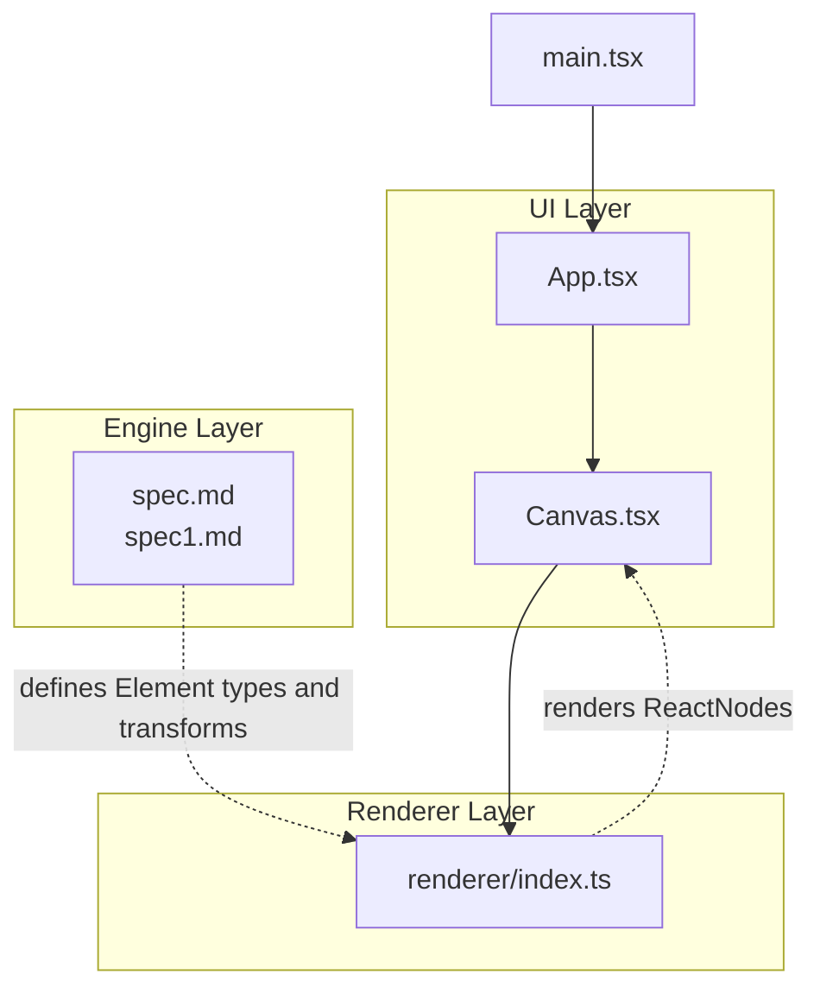
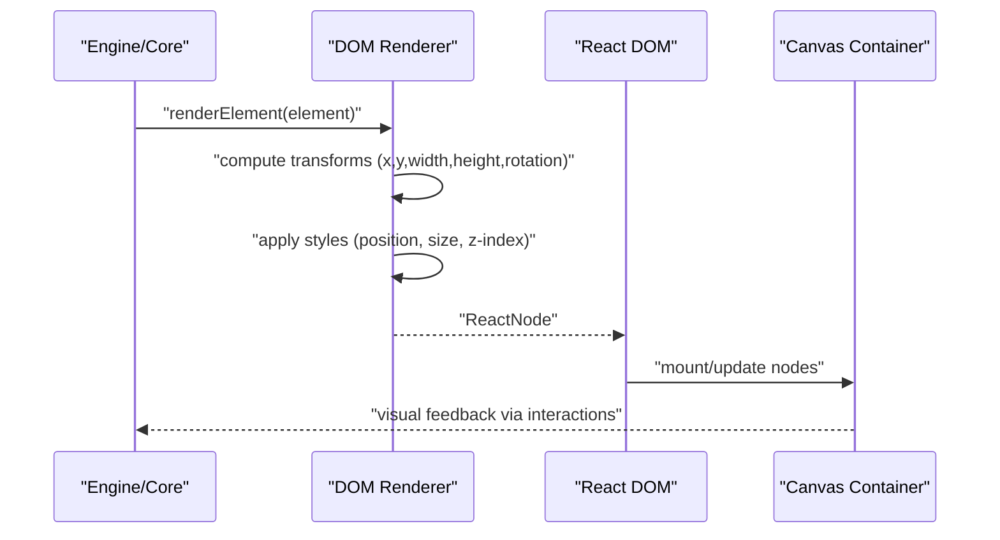
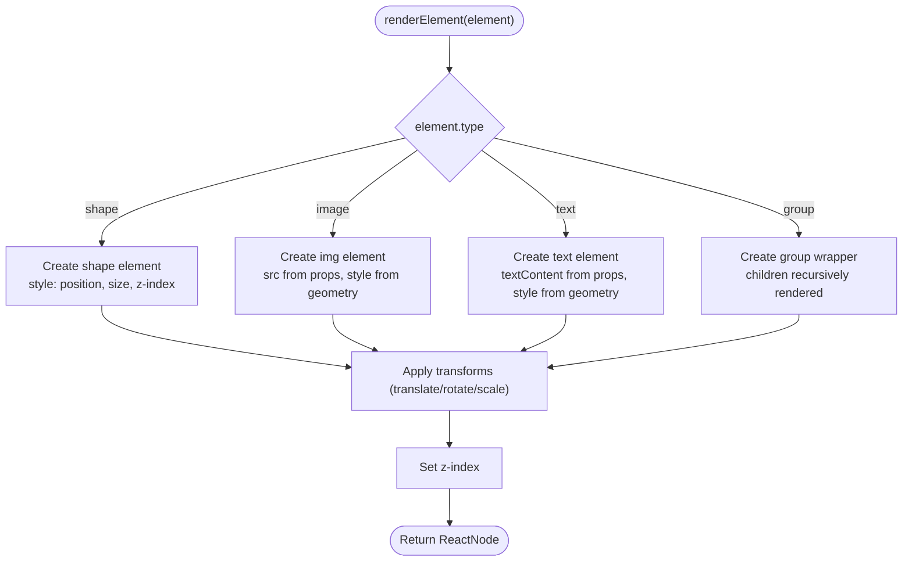
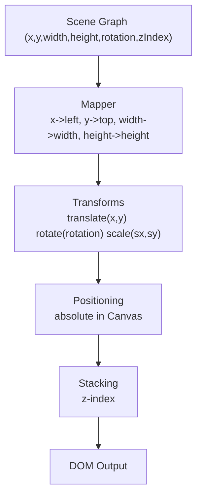
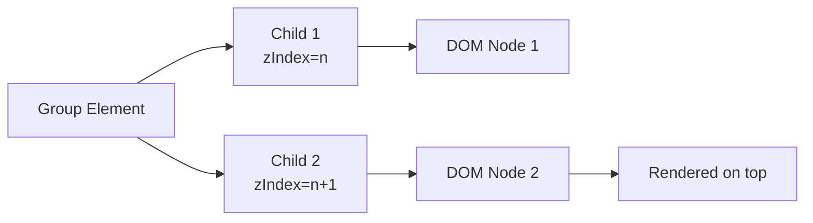
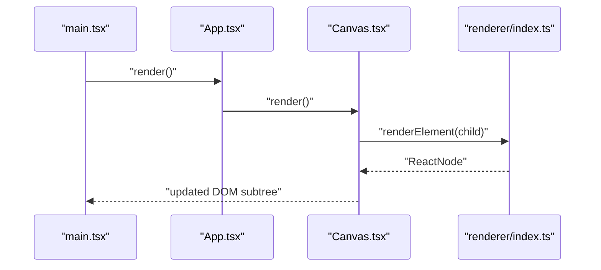
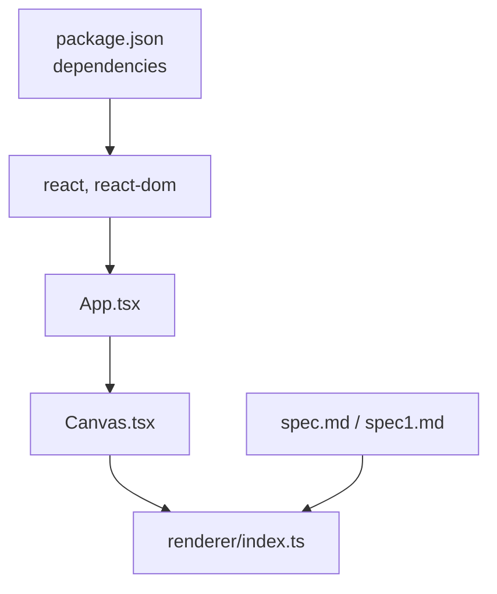

# DOM Rendering Implementation

<cite>
**Referenced Files in This Document**
- [index.ts](file://src/renderer/index.ts)
- [Canvas.tsx](file://src/components/Canvas.tsx)
- [App.tsx](file://src/App.tsx)
- [main.tsx](file://src/main.tsx)
- [spec.md](file://spec.md)
- [spec1.md](file://spec1.md)
- [package.json](file://package.json)
</cite>

## Table of Contents
1. [Introduction](#introduction)
2. [Project Structure](#project-structure)
3. [Core Components](#core-components)
4. [Architecture Overview](#architecture-overview)
5. [Detailed Component Analysis](#detailed-component-analysis)
6. [Dependency Analysis](#dependency-analysis)
7. [Performance Considerations](#performance-considerations)
8. [Troubleshooting Guide](#troubleshooting-guide)
9. [Conclusion](#conclusion)
10. [Appendices](#appendices)

## Introduction
This document explains the DOM rendering implementation that transforms scene graph data into HTML elements for a React-based editor. It focuses on how the renderer maps scene graph coordinates to DOM positions, applies CSS transforms for rotation and scaling, manages element hierarchy and layer ordering via z-index, and integrates with React components. It also outlines how to render different element types (shapes, images, text), handle visual feedback during interactions, and optimize performance for large scenes.

## Project Structure
The project follows a layered architecture:
- UI layer: React components (Canvas, App)
- Core engine layer: Scene Graph model, Editor Engine, DOM Renderer, Timeline Engine
- Build/runtime: Vite + React

Key files involved in DOM rendering and integration:
- Renderer stub: [index.ts](file://src/renderer/index.ts)
- Canvas container: [Canvas.tsx](file://src/components/Canvas.tsx)
- Application shell: [App.tsx](file://src/App.tsx)
- Root entry: [main.tsx](file://src/main.tsx)
- Design specs (types, requirements): [spec.md](file://spec.md), [spec1.md](file://spec1.md)
- Dependencies: [package.json](file://package.json)

**Diagram sources**
- [main.tsx:1-10](file://src/main.tsx#L1-L10)
- [App.tsx:1-17](file://src/App.tsx#L1-L17)
- [Canvas.tsx:1-40](file://src/components/Canvas.tsx#L1-L40)
- [index.ts:1-3](file://src/renderer/index.ts#L1-L3)
- [spec.md:309-333](file://spec.md#L309-L333)
- [spec1.md:149-165](file://spec1.md#L149-L165)

**Section sources**
- [main.tsx:1-10](file://src/main.tsx#L1-L10)
- [App.tsx:1-17](file://src/App.tsx#L1-L17)
- [Canvas.tsx:1-40](file://src/components/Canvas.tsx#L1-L40)
- [index.ts:1-3](file://src/renderer/index.ts#L1-L3)
- [spec.md:309-333](file://spec.md#L309-L333)
- [spec1.md:149-165](file://spec1.md#L149-L165)

## Core Components
- DOM Renderer stub: [index.ts](file://src/renderer/index.ts) declares a framework-agnostic renderer layer intended to convert scene graph elements into ReactNodes.
- Canvas container: [Canvas.tsx](file://src/components/Canvas.tsx) defines the editable area with a centered layout and absolute-positioned placeholder text.
- App integration: [App.tsx](file://src/App.tsx) composes the Canvas into the application shell.
- Root bootstrap: [main.tsx](file://src/main.tsx) mounts the React app.

Rendering requirements and element types are defined in the design specs:
- Element types: shape, image, text, group
- Transform properties: x, y, width, height, rotation, zIndex
- Pure rendering function contract: render(element) => ReactNode

**Section sources**
- [index.ts:1-3](file://src/renderer/index.ts#L1-L3)
- [Canvas.tsx:1-40](file://src/components/Canvas.tsx#L1-L40)
- [App.tsx:1-17](file://src/App.tsx#L1-L17)
- [main.tsx:1-10](file://src/main.tsx#L1-L10)
- [spec.md:82-103](file://spec.md#L82-L103)
- [spec.md:319-323](file://spec.md#L319-L323)
- [spec1.md:149-165](file://spec1.md#L149-L165)

## Architecture Overview
The DOM renderer sits between the Scene Graph and React components. It receives an Element from the engine, computes CSS transforms and styles, and returns a React element suitable for insertion into the Canvas container. The Canvas acts as the DOM host for all rendered elements.

**Diagram sources**
- [spec.md:319-323](file://spec.md#L319-L323)
- [spec1.md:149-165](file://spec1.md#L149-L165)
- [Canvas.tsx:1-40](file://src/components/Canvas.tsx#L1-L40)

## Detailed Component Analysis

### DOM Renderer Stub and Responsibilities
- Purpose: Provide a framework-agnostic renderer that converts scene graph Elements into ReactNodes.
- Contract: render(element) => ReactNode
- Capabilities (per spec): support shape, text, image; apply transforms (x, y, width, height, rotation); remain a pure function.

Implementation outline (conceptual):
- Compute CSS position and size from element.x, element.y, element.width, element.height.
- Apply CSS transform for rotation and scaling.
- Set z-index according to element.zIndex.
- Render appropriate React elements for each element.type (shape, image, text, group).

**Diagram sources**
- [spec.md:82-103](file://spec.md#L82-L103)
- [spec.md:319-323](file://spec.md#L319-L323)
- [spec1.md:149-165](file://spec1.md#L149-L165)

**Section sources**
- [index.ts:1-3](file://src/renderer/index.ts#L1-L3)
- [spec.md:82-103](file://spec.md#L82-L103)
- [spec.md:319-323](file://spec.md#L319-L323)
- [spec1.md:149-165](file://spec1.md#L149-L165)

### Canvas Container and Coordinate System
- The Canvas container establishes a relative coordinate system for child elements.
- Absolute positioning is used for child elements to overlay on the Canvas.
- Centered placeholder demonstrates the coordinate origin and centering technique.

Coordinate mapping:
- Scene graph coordinates (x, y) map to CSS top/left in the Canvas container.
- Width and height map to CSS width/height.
- Rotation maps to CSS transform: rotate(angle).
- Scaling maps to CSS transform: scale(sx, sy).
- z-index controls stacking order.

**Diagram sources**
- [Canvas.tsx:13-35](file://src/components/Canvas.tsx#L13-L35)
- [spec.md:82-103](file://spec.md#L82-L103)

**Section sources**
- [Canvas.tsx:1-40](file://src/components/Canvas.tsx#L1-L40)
- [spec.md:82-103](file://spec.md#L82-L103)

### Rendering Different Element Types
- Shape: Render a styled block element sized and positioned per geometry; apply rotation and optional fill/stroke via props.
- Image: Render an img element with src from props; size and position from geometry; rotation handled by transform.
- Text: Render a text element sized and positioned per geometry; rotation applied; text content from props.
- Group: Recursively render children; manage parent transform and z-ordering.

CSS transform application:
- Translate to element center, rotate, translate back if needed for pivot-based rotation.
- Scale uniformly or non-uniformly based on geometry.

**Section sources**
- [spec.md:142-151](file://spec.md#L142-L151)
- [spec.md:82-103](file://spec.md#L82-L103)

### Element Hierarchy and Layer Ordering
- z-index determines render order; higher z-index appears above lower ones.
- Grouping allows hierarchical transforms; child elements inherit group transforms.
- Layer Panel sorts and reorders elements; updates z-index accordingly.

**Diagram sources**
- [spec.md:175-187](file://spec.md#L175-L187)

**Section sources**
- [spec.md:175-187](file://spec.md#L175-L187)

### Visual Feedback During Interactions
- Dragging, resizing, rotating updates element geometry (x, y, width, height, rotation).
- Renderer reacts to geometry changes by recomputing transforms and re-rendering.
- Interaction visuals (selection borders, resize handles) are typically implemented in the editor UI layer but rely on the renderer to reflect updated positions.

**Section sources**
- [spec.md:142-151](file://spec.md#L142-L151)

### Integration with React Components
- The renderer produces ReactNodes that are mounted inside the Canvas container.
- The Canvas component defines the host element and layout; the renderer injects children into it.
- The app bootstraps the React root and renders the Canvas.

**Diagram sources**
- [main.tsx:1-10](file://src/main.tsx#L1-L10)
- [App.tsx:1-17](file://src/App.tsx#L1-L17)
- [Canvas.tsx:1-40](file://src/components/Canvas.tsx#L1-L40)
- [index.ts:1-3](file://src/renderer/index.ts#L1-L3)

**Section sources**
- [main.tsx:1-10](file://src/main.tsx#L1-L10)
- [App.tsx:1-17](file://src/App.tsx#L1-L17)
- [Canvas.tsx:1-40](file://src/components/Canvas.tsx#L1-L40)
- [index.ts:1-3](file://src/renderer/index.ts#L1-L3)

## Dependency Analysis
- Runtime dependencies: React and ReactDOM
- The renderer depends on the Element type definitions and rendering contract described in the specs.
- The Canvas component depends on CSS positioning and sizing to host rendered elements.

**Diagram sources**
- [package.json:12-27](file://package.json#L12-L27)
- [App.tsx:1-17](file://src/App.tsx#L1-L17)
- [Canvas.tsx:1-40](file://src/components/Canvas.tsx#L1-L40)
- [index.ts:1-3](file://src/renderer/index.ts#L1-L3)
- [spec.md:309-333](file://spec.md#L309-L333)
- [spec1.md:149-165](file://spec1.md#L149-L165)

**Section sources**
- [package.json:12-27](file://package.json#L12-L27)
- [spec.md:309-333](file://spec.md#L309-L333)
- [spec1.md:149-165](file://spec1.md#L149-L165)

## Performance Considerations
- Keep the renderer pure and deterministic to enable efficient React reconciliation.
- Minimize re-renders by passing stable props and memoizing computed transforms.
- Use CSS transforms for rotation and scaling instead of expensive layout recalculations.
- Virtualize or cull off-screen elements in large scenes.
- Batch updates when animating many elements to reduce layout thrashing.
- Prefer absolute positioning with transform-origin to avoid reflow.

[No sources needed since this section provides general guidance]

## Troubleshooting Guide
- Symptom: Elements not visible
  - Verify absolute positioning and non-zero width/height.
  - Confirm z-index stacking order and absence of clipping.
- Symptom: Incorrect rotation
  - Ensure transform-origin is set appropriately for pivot-based rotation.
  - Check that rotation angle units match expectations (degrees/radians).
- Symptom: Elements overlap unexpectedly
  - Review z-index values and group nesting.
  - Validate parent container’s positioning context.
- Symptom: Poor performance with many elements
  - Reduce re-renders by optimizing props and keys.
  - Consider virtualization or occlusion culling.

[No sources needed since this section provides general guidance]

## Conclusion
The DOM renderer bridges the Scene Graph and React by converting element geometry and properties into styled, transformed DOM nodes. By leveraging CSS transforms for rotation and scaling, maintaining a clean separation of concerns, and integrating tightly with the Canvas container, the system supports interactive editing and scalable rendering. Future enhancements can include a Canvas-backed renderer for playback optimization while preserving the same rendering contract.

[No sources needed since this section summarizes without analyzing specific files]

## Appendices

### Element Type Definitions and Rendering Contract
- Element fields: id, type, parentId, children, x, y, width, height, rotation, zIndex, props, animations
- Renderer contract: render(element) => ReactNode
- Supported types: shape, image, text, group

**Section sources**
- [spec.md:82-103](file://spec.md#L82-L103)
- [spec.md:319-323](file://spec.md#L319-L323)
- [spec1.md:149-165](file://spec1.md#L149-L165)