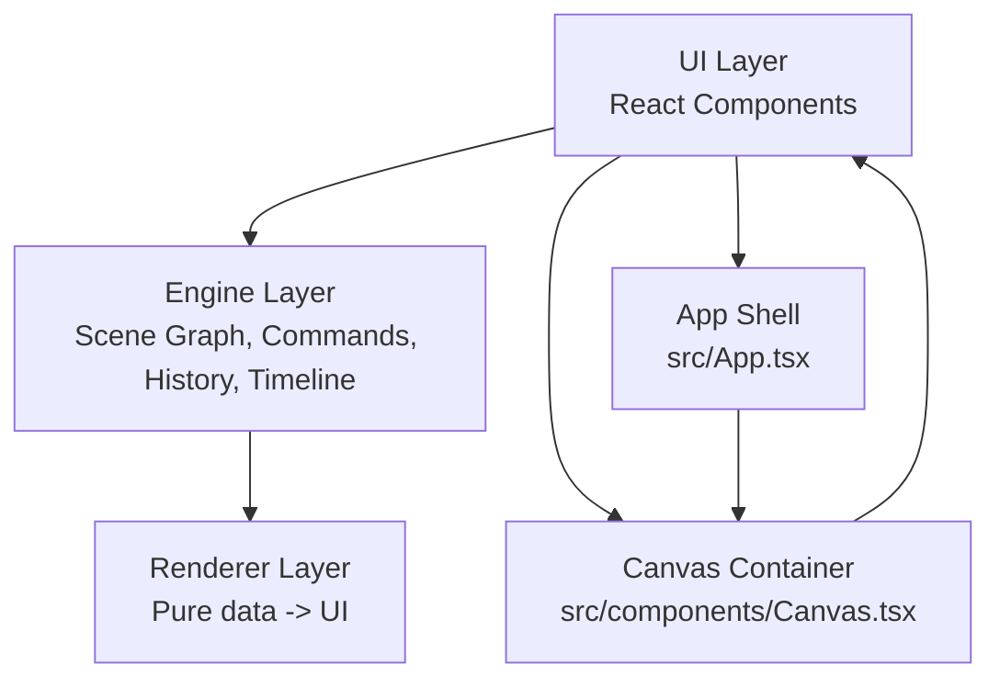
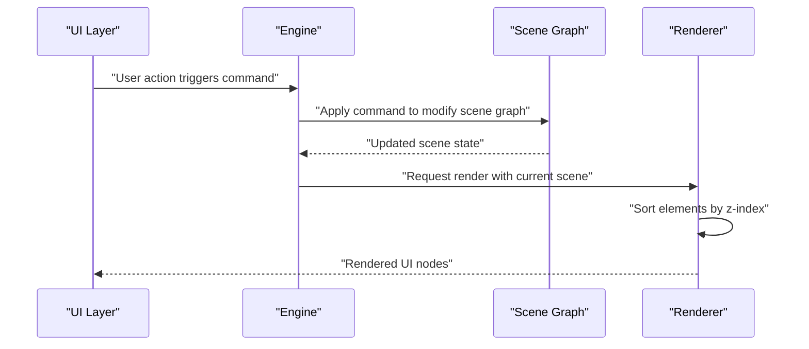
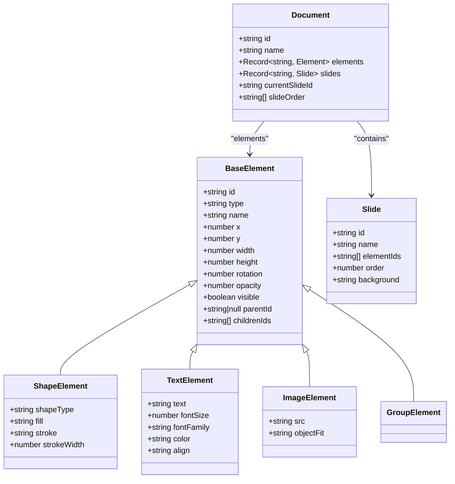
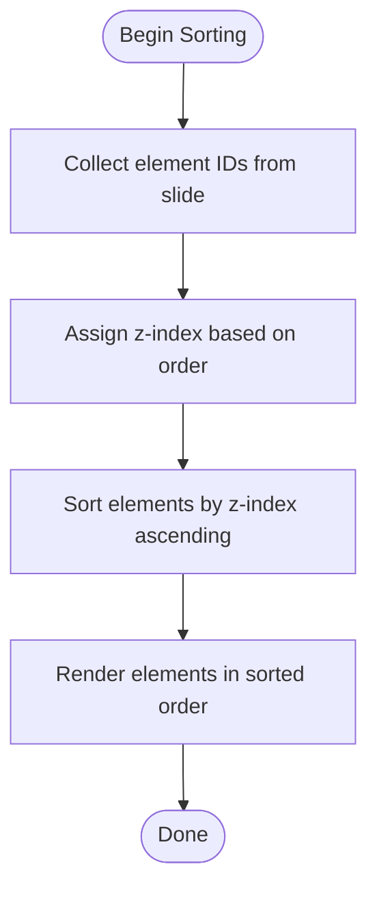
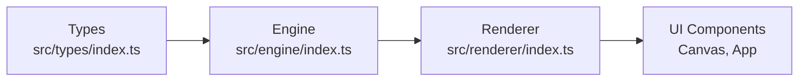

# Layer Management and Visual Ordering

<cite>
**Referenced Files in This Document**
- [spec.md](file://spec.md)
- [spec1.md](file://spec1.md)
- [src/types/index.ts](file://src/types/index.ts)
- [src/components/Canvas.tsx](file://src/components/Canvas.tsx)
- [src/App.tsx](file://src/App.tsx)
- [src/main.tsx](file://src/main.tsx)
- [src/engine/index.ts](file://src/engine/index.ts)
- [src/renderer/index.ts](file://src/renderer/index.ts)
- [src/store/index.ts](file://src/store/index.ts)
</cite>

## Table of Contents
1. [Introduction](#introduction)
2. [Project Structure](#project-structure)
3. [Core Components](#core-components)
4. [Architecture Overview](#architecture-overview)
5. [Detailed Component Analysis](#detailed-component-analysis)
6. [Dependency Analysis](#dependency-analysis)
7. [Performance Considerations](#performance-considerations)
8. [Troubleshooting Guide](#troubleshooting-guide)
9. [Conclusion](#conclusion)

## Introduction
This document explains how layer management and visual ordering are designed and implemented in the rendering system. It focuses on how z-index values control stacking order, how elements are sorted for efficient rendering, and how overlapping elements are handled. It also clarifies the relationship between the scene graph hierarchy and visual layering, how visibility and opacity are managed, and how layer-specific styling and effects can be implemented. Finally, it provides examples of layer manipulation, strategies for complex layer hierarchies, and performance optimizations through efficient sorting and culling.

## Project Structure
The project follows a layered architecture:
- UI layer: React components for the editor interface
- Engine layer: Framework-agnostic core logic (scene graph, commands, history, timeline)
- Renderer layer: Pure data-to-UI rendering utilities
- Store: Editor state separate from scene data

Key files:
- spec.md and spec1.md define the high-level design, including the scene graph, layer panel, and z-index semantics
- src/types/index.ts defines the element and document types used by the engine and renderer
- src/components/Canvas.tsx provides the container for the editor canvas
- src/App.tsx wires the UI layer
- src/engine/index.ts, src/renderer/index.ts, and src/store/index.ts serve as placeholders for the engine, renderer, and store modules

**Diagram sources**
- [src/App.tsx:1-17](file://src/App.tsx#L1-L17)
- [src/components/Canvas.tsx:1-40](file://src/components/Canvas.tsx#L1-L40)
- [src/engine/index.ts:1-3](file://src/engine/index.ts#L1-L3)
- [src/renderer/index.ts:1-3](file://src/renderer/index.ts#L1-L3)
- [src/store/index.ts:1-2](file://src/store/index.ts#L1-L2)

**Section sources**
- [spec.md:21-416](file://spec.md#L21-L416)
- [spec1.md:23-42](file://spec1.md#L23-L42)
- [src/App.tsx:1-17](file://src/App.tsx#L1-L17)
- [src/components/Canvas.tsx:1-40](file://src/components/Canvas.tsx#L1-L40)

## Core Components
- Scene Graph and Elements: The scene graph stores elements as records keyed by ID, with parent-child relationships represented by ID references. Elements include position, size, rotation, opacity, visibility, and grouping metadata.
- Layer Panel and z-index: The layer panel supports drag-and-drop reordering and z-index control, ensuring that layer order equals render order.
- Rendering: The renderer is a pure function that transforms element data into UI nodes, applying transforms and styles.

Key design principles:
- All state changes must go through the engine’s command system
- Rendering must be pure (data → UI)
- Layer order determines render order

**Section sources**
- [spec.md:82-134](file://spec.md#L82-L134)
- [spec.md:175-187](file://spec.md#L175-L187)
- [spec.md:319-332](file://spec.md#L319-L332)
- [src/types/index.ts:9-51](file://src/types/index.ts#L9-L51)

## Architecture Overview
The layer management pipeline integrates the scene graph, engine, and renderer:
- Scene Graph: Stores elements and slides, with element IDs per slide
- Engine: Applies commands to modify the scene graph and maintains history
- Renderer: Renders elements in the correct order based on z-index and slide context

**Diagram sources**
- [spec.md:98-111](file://spec.md#L98-L111)
- [spec.md:149-163](file://spec.md#L149-L163)
- [src/engine/index.ts:1-3](file://src/engine/index.ts#L1-L3)
- [src/renderer/index.ts:1-3](file://src/renderer/index.ts#L1-L3)

## Detailed Component Analysis

### Scene Graph and Element Model
The scene graph defines how elements are structured and related:
- Elements are identified by ID and reference their parent by ID
- Elements carry layout and visual attributes (position, size, rotation, opacity, visibility)
- Slides reference element IDs to define which elements belong to which slide

**Diagram sources**
- [src/types/index.ts:9-51](file://src/types/index.ts#L9-L51)
- [src/types/index.ts:57-72](file://src/types/index.ts#L57-L72)

**Section sources**
- [src/types/index.ts:9-51](file://src/types/index.ts#L9-L51)
- [src/types/index.ts:57-72](file://src/types/index.ts#L57-L72)

### Layer Sorting Algorithm and z-index Processing
The layer panel enforces that layer order equals render order. To implement this:
- Maintain a stable list of element IDs per slide in the desired render order
- Assign z-index values to elements based on their position in the list
- During rendering, sort elements by z-index ascending to ensure correct stacking

**Diagram sources**
- [spec.md:175-187](file://spec.md#L175-L187)

**Section sources**
- [spec.md:175-187](file://spec.md#L175-L187)

### Relationship Between Scene Graph Hierarchy and Visual Layering
Visual layering is independent of the logical parent-child hierarchy:
- Parent-child relationships control grouping and transformations
- Visual stacking is controlled by z-index and slide order
- Grouping allows moving and transforming multiple elements while preserving their relative z-order

Best practices:
- Prefer z-index for fine-grained stacking control
- Use groups for coordinated movement and shared styling
- Keep z-index consistent within groups to avoid accidental overlaps

**Section sources**
- [spec.md:160-173](file://spec.md#L160-L173)
- [spec.md:175-187](file://spec.md#L175-L187)

### Managing Visibility and Opacity Effects
Visibility and opacity are part of the base element model:
- visible toggles whether an element is rendered
- opacity controls transparency, enabling layered blending effects

Guidelines:
- Use opacity for subtle overlays and focus effects
- Combine with z-index to achieve depth and clarity
- Consider performance: excessive transparency can impact rendering cost

**Section sources**
- [src/types/index.ts:9-22](file://src/types/index.ts#L9-L22)

### Implementing Layer-Specific Styling and Effects
Layer-specific styling can be achieved by:
- Applying per-layer filters (e.g., blur, brightness) via CSS containers
- Using blend modes at the layer boundary
- Managing compositing through z-index and stacking contexts

Recommendations:
- Keep styles declarative and derived from element properties
- Avoid inline style churn; batch updates when possible
- Use CSS containment for large stacks to improve performance

[No sources needed since this section provides general guidance]

### Examples of Layer Manipulation
- Reordering layers: Drag-and-drop in the layer panel updates the element ID list per slide; z-index is recalculated accordingly
- Grouping: Select multiple elements and create a group; the group inherits the z-index range of its members
- Adjusting opacity: Modify opacity on individual elements or groups to create depth

**Section sources**
- [spec.md:175-187](file://spec.md#L175-L187)
- [spec.md:160-173](file://spec.md#L160-L173)

### Handling Complex Layer Hierarchies
- Nested groups: Maintain z-index continuity across nested groups
- Large stacks: Consider virtualization or culling to limit the number of rendered elements
- Overlap detection: Use bounding boxes to identify overlaps and adjust z-index as needed

**Section sources**
- [spec.md:160-173](file://spec.md#L160-L173)

### Optimizing Render Performance Through Sorting and Culling
- Efficient sorting: Use insertion sort or merge-based approaches for small lists; for larger sets, consider spatial partitioning
- Culling: Hide off-screen or low-priority elements during pan/zoom
- Batch updates: Minimize reflows by batching DOM writes
- CSS containment: Encapsulate heavy layers to reduce layout invalidation

**Section sources**
- [spec.md:319-332](file://spec.md#L319-L332)

## Dependency Analysis
The layer management system depends on:
- Scene graph types for element and slide definitions
- Engine for applying commands that change layer order
- Renderer for translating z-index into visual stacking

**Diagram sources**
- [src/types/index.ts:1-229](file://src/types/index.ts#L1-L229)
- [src/engine/index.ts:1-3](file://src/engine/index.ts#L1-L3)
- [src/renderer/index.ts:1-3](file://src/renderer/index.ts#L1-L3)
- [src/components/Canvas.tsx:1-40](file://src/components/Canvas.tsx#L1-L40)
- [src/App.tsx:1-17](file://src/App.tsx#L1-L17)

**Section sources**
- [src/types/index.ts:1-229](file://src/types/index.ts#L1-L229)
- [src/engine/index.ts:1-3](file://src/engine/index.ts#L1-L3)
- [src/renderer/index.ts:1-3](file://src/renderer/index.ts#L1-L3)
- [src/components/Canvas.tsx:1-40](file://src/components/Canvas.tsx#L1-L40)
- [src/App.tsx:1-17](file://src/App.tsx#L1-L17)

## Performance Considerations
- Prefer stable z-index values to minimize re-sorting
- Use CSS transforms for animations to leverage GPU acceleration
- Limit the number of composited layers
- Defer expensive operations until after pan/zoom completes

[No sources needed since this section provides general guidance]

## Troubleshooting Guide
Common issues and resolutions:
- Unexpected stacking order: Verify z-index values and slide order; ensure the layer panel reflects the intended order
- Overlapping elements not appearing: Check visibility and opacity; confirm that higher elements are not clipped by containers
- Performance degradation with many layers: Apply culling and virtualization; reduce composite layers

**Section sources**
- [spec.md:175-187](file://spec.md#L175-L187)
- [src/types/index.ts:9-22](file://src/types/index.ts#L9-L22)

## Conclusion
Layer management and visual ordering are central to the rendering system. By decoupling logical hierarchy from visual stacking, the system achieves predictable and efficient rendering. The layer panel’s drag-and-drop and z-index controls ensure that layer order equals render order, while the scene graph and engine maintain data integrity. Following the guidelines in this document helps manage complex layer hierarchies, implement layer-specific styling, and optimize performance.