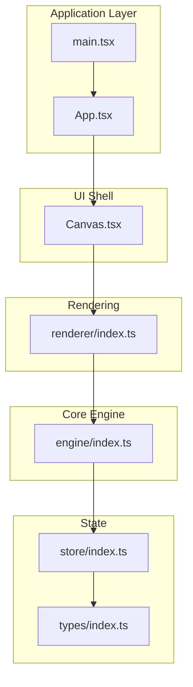
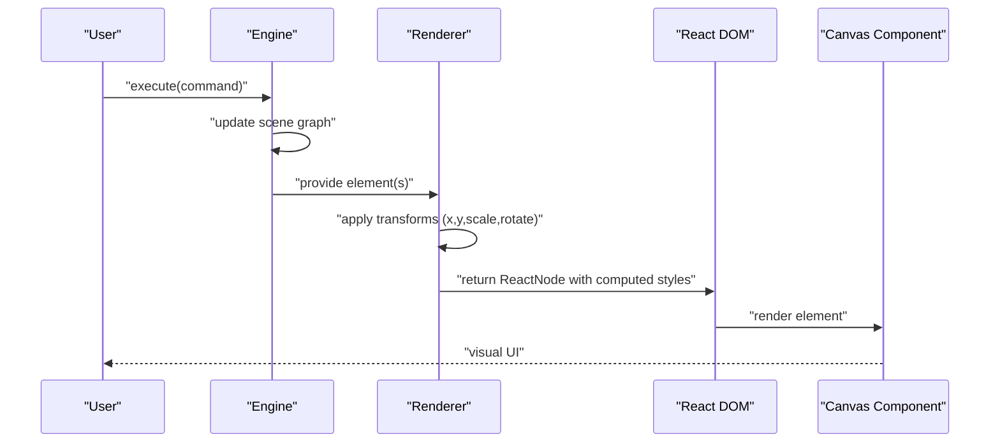
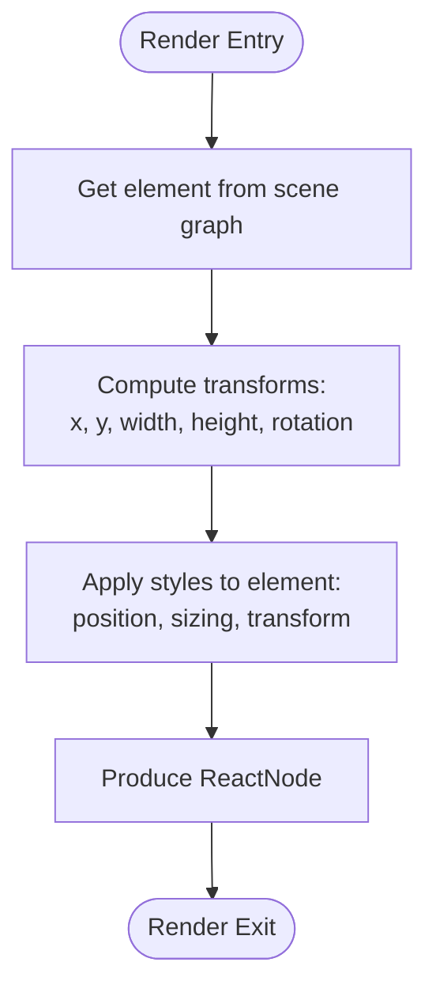
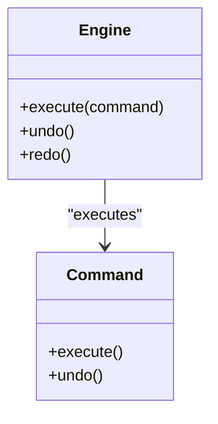
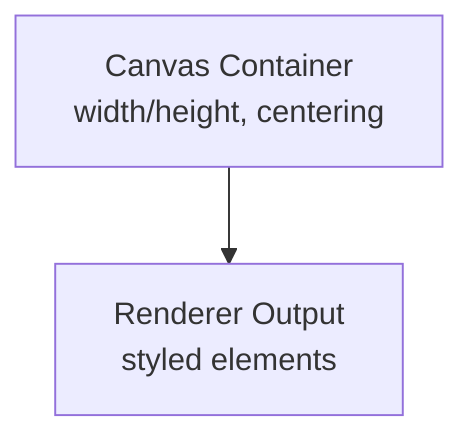
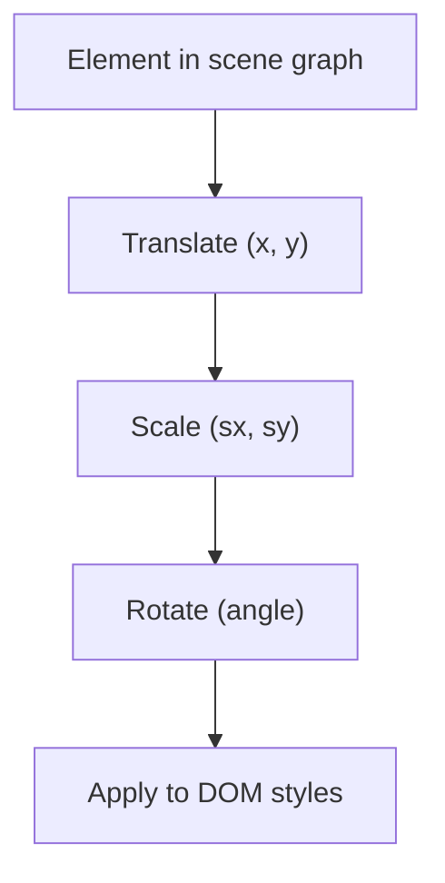
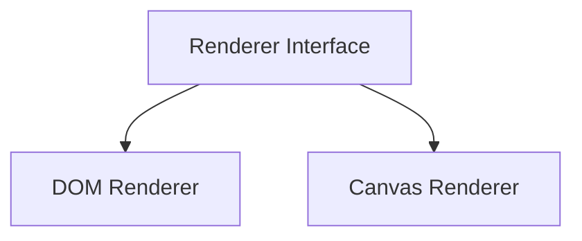
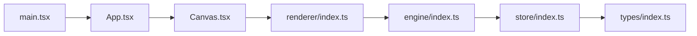

# Rendering System

<cite>
**Referenced Files in This Document**
- [index.ts](file://src/renderer/index.ts)
- [Canvas.tsx](file://src/components/Canvas.tsx)
- [index.ts](file://src/engine/index.ts)
- [index.ts](file://src/store/index.ts)
- [index.ts](file://src/types/index.ts)
- [App.tsx](file://src/App.tsx)
- [main.tsx](file://src/main.tsx)
- [package.json](file://package.json)
- [spec.md](file://spec.md)
- [spec1.md](file://spec1.md)
</cite>

## Table of Contents
1. [Introduction](#introduction)
2. [Project Structure](#project-structure)
3. [Core Components](#core-components)
4. [Architecture Overview](#architecture-overview)
5. [Detailed Component Analysis](#detailed-component-analysis)
6. [Dependency Analysis](#dependency-analysis)
7. [Performance Considerations](#performance-considerations)
8. [Troubleshooting Guide](#troubleshooting-guide)
9. [Conclusion](#conclusion)
10. [Appendices](#appendices)

## Introduction
This document describes the Rendering System that transforms scene graph data into visual UI components. The renderer layer is designed as pure data-to-UI transformation utilities that are independent of React lifecycle and DOM rendering specifics. It focuses on:
- Transform application for positioning, scaling, and rotation
- Coordinate mapping and layer ordering
- Relationship between renderer functions and React components
- Performance optimization techniques
- Examples of rendering shapes, images, and text
- Managing visual feedback during user interactions
- Future plans for canvas renderer integration and extensibility

## Project Structure
The project follows a layered architecture:
- Application bootstrap and UI entry point
- Engine core (framework-agnostic state machine)
- Renderer layer (pure data-to-UI utilities)
- Store (editor state separated from scene data)
- Types (shared TypeScript types)
- Components (React UI shell around the canvas)

**Diagram sources**
- [main.tsx:1-10](file://src/main.tsx#L1-L10)
- [App.tsx:1-17](file://src/App.tsx#L1-L17)
- [Canvas.tsx:1-40](file://src/components/Canvas.tsx#L1-L40)
- [index.ts:1-3](file://src/engine/index.ts#L1-L3)
- [index.ts:1-3](file://src/renderer/index.ts#L1-L3)
- [index.ts:1-2](file://src/store/index.ts#L1-L2)
- [index.ts:1-2](file://src/types/index.ts#L1-L2)

**Section sources**
- [main.tsx:1-10](file://src/main.tsx#L1-L10)
- [App.tsx:1-17](file://src/App.tsx#L1-L17)
- [Canvas.tsx:1-40](file://src/components/Canvas.tsx#L1-L40)
- [index.ts:1-3](file://src/engine/index.ts#L1-L3)
- [index.ts:1-3](file://src/renderer/index.ts#L1-L3)
- [index.ts:1-2](file://src/store/index.ts#L1-L2)
- [index.ts:1-2](file://src/types/index.ts#L1-L2)

## Core Components
- Renderer layer: Pure data-to-UI transformation utilities independent of framework and DOM. See [index.ts:1-3](file://src/renderer/index.ts#L1-L3).
- Engine core: Framework-agnostic state machine where all state changes must go through a command execution interface. See [index.ts:1-3](file://src/engine/index.ts#L1-L3).
- Store: Editor state separated from scene data. See [index.ts:1-2](file://src/store/index.ts#L1-L2).
- Types: Shared TypeScript types for the entire project. See [index.ts:1-2](file://src/types/index.ts#L1-L2).
- UI shell: Canvas component that hosts the rendered elements. See [Canvas.tsx:1-40](file://src/components/Canvas.tsx#L1-40).

Key architectural principles:
- Renderers must be pure functions that accept scene data and produce React nodes without mutating state.
- Transform application includes translation (x, y), scaling, and rotation.
- Layer ordering equals rendering order, ensuring predictable z-index behavior.
- Future extension supports a canvas renderer for playback optimization while keeping the DOM renderer for editing.

**Section sources**
- [index.ts:1-3](file://src/renderer/index.ts#L1-L3)
- [index.ts:1-3](file://src/engine/index.ts#L1-L3)
- [index.ts:1-2](file://src/store/index.ts#L1-L2)
- [index.ts:1-2](file://src/types/index.ts#L1-L2)
- [Canvas.tsx:1-40](file://src/components/Canvas.tsx#L1-L40)
- [spec.md:309-332](file://spec.md#L309-L332)
- [spec1.md:149-165](file://spec1.md#L149-L165)

## Architecture Overview
The rendering pipeline is:
- Engine produces scene graph updates via commands.
- Renderer consumes scene graph elements and applies transforms to compute DOM styles.
- React renders the computed styles into the Canvas component.
- Store holds editor state separate from scene data.

**Diagram sources**
- [index.ts:1-3](file://src/engine/index.ts#L1-L3)
- [index.ts:1-3](file://src/renderer/index.ts#L1-L3)
- [Canvas.tsx:1-40](file://src/components/Canvas.tsx#L1-L40)

## Detailed Component Analysis

### Renderer Layer
The renderer layer is a pure function that converts scene graph elements into React nodes with computed styles. It must:
- Accept an element and engine reference
- Support rendering shapes, images, and text
- Apply transforms: translation, scaling, and rotation
- Produce no side effects and avoid state mutation

**Diagram sources**
- [index.ts:1-3](file://src/renderer/index.ts#L1-L3)
- [spec1.md:149-165](file://spec1.md#L149-L165)

**Section sources**
- [index.ts:1-3](file://src/renderer/index.ts#L1-L3)
- [spec1.md:149-165](file://spec1.md#L149-L165)

### Engine Core
The engine is the single source of truth for state changes. All modifications must go through engine.execute(command). It coordinates:
- Scene graph mutations
- History stack for undo/redo
- Timeline-driven animations

**Diagram sources**
- [index.ts:1-3](file://src/engine/index.ts#L1-L3)
- [spec1.md:114-130](file://spec1.md#L114-L130)

**Section sources**
- [index.ts:1-3](file://src/engine/index.ts#L1-L3)
- [spec1.md:114-130](file://spec1.md#L114-L130)

### Canvas Component
The Canvas component serves as the container for rendered elements. It defines the viewport and centers the content. The renderer produces styled elements that are placed inside this container.

**Diagram sources**
- [Canvas.tsx:1-40](file://src/components/Canvas.tsx#L1-L40)

**Section sources**
- [Canvas.tsx:1-40](file://src/components/Canvas.tsx#L1-L40)

### Coordinate System and Layer Ordering
- Layer ordering equals rendering order, ensuring predictable z-index behavior.
- Transforms are applied in the order of translation, scaling, and rotation.
- The coordinate system is aligned with the browser’s layout model (CSS transforms).

**Diagram sources**
- [spec.md:184-187](file://spec.md#L184-L187)
- [spec1.md:149-165](file://spec1.md#L149-L165)

**Section sources**
- [spec.md:184-187](file://spec.md#L184-L187)
- [spec1.md:149-165](file://spec1.md#L149-L165)

### Rendering Different Element Types
- Shapes: Render rectangles, circles, or paths with appropriate fill/stroke and transforms.
- Images: Render images with aspect ratio preservation and transforms.
- Text: Render text with font metrics and transforms.

Renderer responsibilities:
- Compute bounding boxes and transforms per element type
- Map transforms to CSS properties (e.g., translate, scale, rotate)
- Respect layer ordering for stacking

**Section sources**
- [spec1.md:149-165](file://spec1.md#L149-L165)

### Handling Layer Ordering and Visual Feedback
- Layer ordering equals rendering order, so elements are rendered in the intended z-index sequence.
- Visual feedback during interactions (e.g., selection, hover) is achieved by updating element properties in the scene graph and re-rendering.

**Section sources**
- [spec.md:184-187](file://spec.md#L184-L187)

### Future Plans: Canvas Renderer Integration
- Current renderer: DOM-based (React) for editing scenarios.
- Future renderer: Canvas-based for playback optimization.
- Extension strategy: Define a renderer interface; implement DOM and Canvas backends; switch backend based on mode (edit/playback).

**Diagram sources**
- [spec.md:327-332](file://spec.md#L327-L332)

**Section sources**
- [spec.md:327-332](file://spec.md#L327-L332)

## Dependency Analysis
High-level dependencies:
- main.tsx bootstraps the app and mounts App.
- App renders Canvas.
- Canvas is the host for renderer output.
- Renderer depends on engine-provided scene data.
- Engine coordinates with store and types.

**Diagram sources**
- [main.tsx:1-10](file://src/main.tsx#L1-L10)
- [App.tsx:1-17](file://src/App.tsx#L1-L17)
- [Canvas.tsx:1-40](file://src/components/Canvas.tsx#L1-L40)
- [index.ts:1-3](file://src/renderer/index.ts#L1-L3)
- [index.ts:1-3](file://src/engine/index.ts#L1-L3)
- [index.ts:1-2](file://src/store/index.ts#L1-L2)
- [index.ts:1-2](file://src/types/index.ts#L1-L2)

**Section sources**
- [main.tsx:1-10](file://src/main.tsx#L1-L10)
- [App.tsx:1-17](file://src/App.tsx#L1-L17)
- [Canvas.tsx:1-40](file://src/components/Canvas.tsx#L1-L40)
- [index.ts:1-3](file://src/renderer/index.ts#L1-L3)
- [index.ts:1-3](file://src/engine/index.ts#L1-L3)
- [index.ts:1-2](file://src/store/index.ts#L1-L2)
- [index.ts:1-2](file://src/types/index.ts#L1-L2)

## Performance Considerations
- Keep renderer pure: No side effects, deterministic output from inputs.
- Minimize re-renders: Use stable keys and avoid unnecessary prop churn.
- Prefer CSS transforms for animations: They are GPU-accelerated and efficient.
- Batch updates: Group multiple element updates into a single render pass when possible.
- Virtualization: For large scenes, consider virtualizing visible elements.
- Canvas renderer: Offload heavy rendering to canvas for playback scenarios to reduce DOM overhead.

[No sources needed since this section provides general guidance]

## Troubleshooting Guide
Common issues and remedies:
- Incorrect transforms: Verify transform order (translate, scale, rotate) and ensure units are consistent.
- Layering anomalies: Confirm layer ordering equals rendering order and that z-index is derived from order.
- Interaction feedback not appearing: Ensure engine.execute(command) is called and the scene graph is updated; re-render occurs automatically.
- Canvas vs DOM mismatch: Validate that the renderer produces equivalent styles for both backends.

**Section sources**
- [spec.md:309-332](file://spec.md#L309-L332)
- [spec1.md:149-165](file://spec1.md#L149-L165)

## Conclusion
The Rendering System is built around a pure renderer layer that transforms scene graph data into React nodes, decoupled from React lifecycle and DOM specifics. By applying transforms consistently and maintaining layer ordering, it enables robust editing and playback experiences. The architecture is prepared for a canvas renderer to optimize playback performance while preserving the DOM renderer for editing. Following the design principles ensures scalability, maintainability, and extensibility.

[No sources needed since this section summarizes without analyzing specific files]

## Appendices
- Dependencies: React and React DOM are used for the UI runtime. See [package.json:12-15](file://package.json#L12-L15).

**Section sources**
- [package.json:12-15](file://package.json#L12-L15)