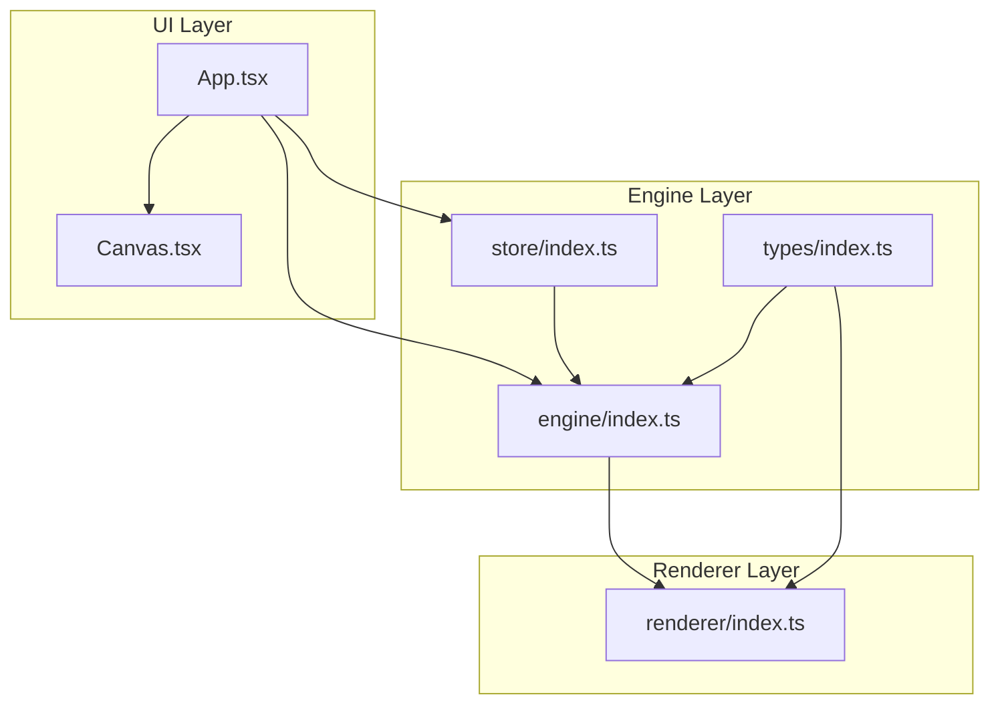
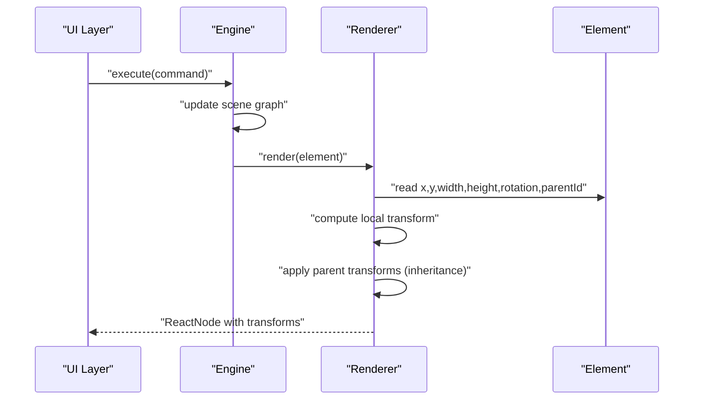
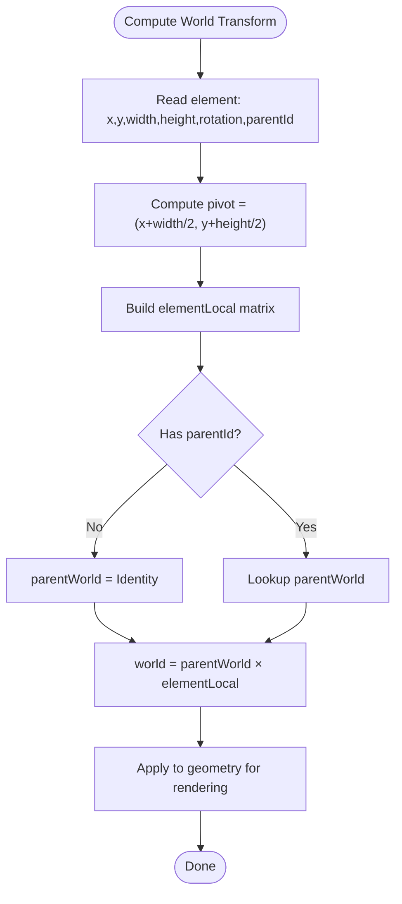
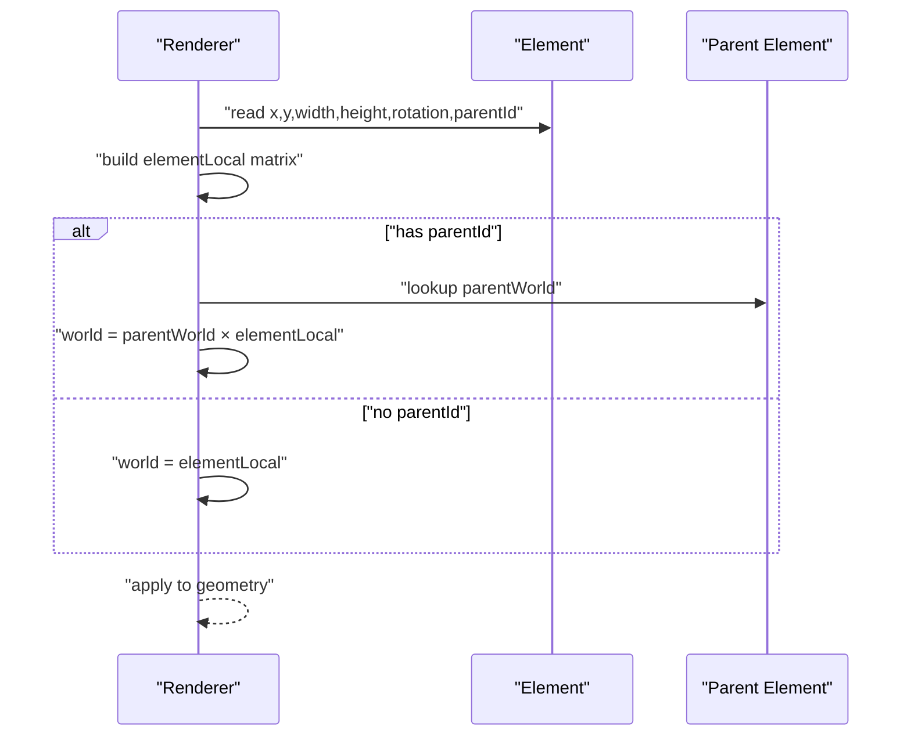
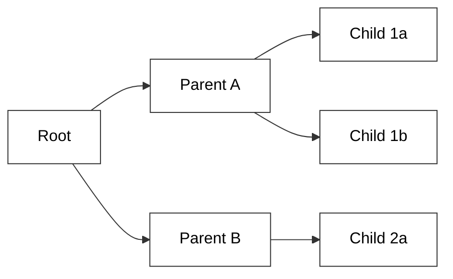
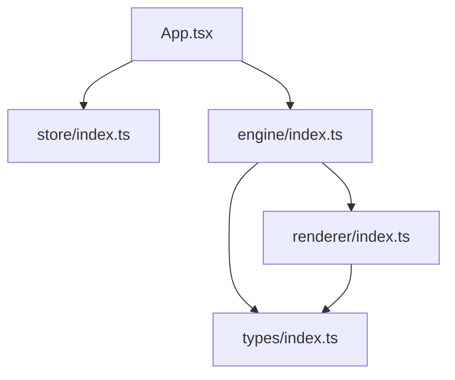

# Transform Calculations and Coordinate Systems

<cite>
**Referenced Files in This Document**
- [spec.md](file://spec.md)
- [spec1.md](file://spec1.md)
- [src/App.tsx](file://src/App.tsx)
- [src/components/Canvas.tsx](file://src/components/Canvas.tsx)
- [src/engine/index.ts](file://src/engine/index.ts)
- [src/renderer/index.ts](file://src/renderer/index.ts)
- [src/store/index.ts](file://src/store/index.ts)
- [src/types/index.ts](file://src/types/index.ts)
- [src/main.tsx](file://src/main.tsx)
- [package.json](file://package.json)
</cite>

## Table of Contents
1. [Introduction](#introduction)
2. [Project Structure](#project-structure)
3. [Core Components](#core-components)
4. [Architecture Overview](#architecture-overview)
5. [Detailed Component Analysis](#detailed-component-analysis)
6. [Dependency Analysis](#dependency-analysis)
7. [Performance Considerations](#performance-considerations)
8. [Troubleshooting Guide](#troubleshooting-guide)
9. [Conclusion](#conclusion)

## Introduction
This document explains transform calculations and coordinate system management in the rendering pipeline for a data-driven design tool engine. It focuses on how positioning, scaling, rotation, and skew are mathematically represented and composed, how scene graph coordinates relate to screen space, and how parent-child relationships propagate transformations. It also covers performance considerations for transform computation and batch rendering, and outlines best practices for precision and optimization.

## Project Structure
The project follows a layered architecture:
- UI layer: React components for the editor interface
- Engine layer: Framework-agnostic logic for scene graph, commands, history, and timeline
- Renderer layer: Pure data-to-UI rendering utilities
- Store: Editor state separate from scene data
- Types: Shared TypeScript types

**Diagram sources**
- [src/App.tsx:1-17](file://src/App.tsx#L1-L17)
- [src/components/Canvas.tsx:1-40](file://src/components/Canvas.tsx#L1-L40)
- [src/engine/index.ts:1-3](file://src/engine/index.ts#L1-L3)
- [src/renderer/index.ts:1-3](file://src/renderer/index.ts#L1-L3)
- [src/store/index.ts:1-2](file://src/store/index.ts#L1-L2)
- [src/types/index.ts:1-2](file://src/types/index.ts#L1-L2)

**Section sources**
- [src/App.tsx:1-17](file://src/App.tsx#L1-L17)
- [src/components/Canvas.tsx:1-40](file://src/components/Canvas.tsx#L1-L40)
- [src/engine/index.ts:1-3](file://src/engine/index.ts#L1-L3)
- [src/renderer/index.ts:1-3](file://src/renderer/index.ts#L1-L3)
- [src/store/index.ts:1-2](file://src/store/index.ts#L1-L2)
- [src/types/index.ts:1-2](file://src/types/index.ts#L1-L2)

## Core Components
- Scene Graph data model defines elements with position (x, y), size (width, height), rotation, and optional grouping via parentId/children. These properties are the foundation for all transforms.
- Engine orchestrates state changes via commands and maintains the scene graph and timeline.
- Renderer applies transforms to produce UI output; it is designed to be pure and framework-agnostic.
- Store holds editor state separate from the scene graph to maintain separation of concerns.

Key transform-related properties from the scene graph:
- Position: x, y
- Size: width, height
- Orientation: rotation (in degrees)
- Hierarchy: parentId, children for parent-child relationships

These properties enable:
- Local transforms per element
- Parent-to-child inheritance
- Composition of transforms along the ancestor chain

**Section sources**
- [spec.md:82-103](file://spec.md#L82-L103)
- [spec.md:138-151](file://spec.md#L138-L151)
- [src/engine/index.ts:1-3](file://src/engine/index.ts#L1-L3)
- [src/renderer/index.ts:1-3](file://src/renderer/index.ts#L1-L3)
- [src/store/index.ts:1-2](file://src/store/index.ts#L1-L2)

## Architecture Overview
The rendering pipeline processes scene graph elements through the engine and renderer to produce UI output. Transforms are computed per element and inherited from parents when applicable.

**Diagram sources**
- [spec1.md:154-162](file://spec1.md#L154-L162)
- [spec.md:82-103](file://spec.md#L82-L103)
- [src/engine/index.ts:1-3](file://src/engine/index.ts#L1-L3)
- [src/renderer/index.ts:1-3](file://src/renderer/index.ts#L1-L3)

## Detailed Component Analysis

### Transform Model and Coordinate Systems
- Scene graph space: Elements are positioned in a logical coordinate system defined by x, y, width, height, and rotation. Rotation is expressed in degrees.
- Screen space: Final pixel positions are derived by applying transforms to the element’s geometry. For DOM rendering, CSS transforms are commonly used to apply translation, scaling, and rotation.

Coordinate system conversions:
- From scene graph to screen space involves:
  - Applying element-local transforms (translation to origin, rotation, scaling)
  - Composing with parent transforms to obtain world-space transforms
  - Converting to device pixels for rendering

Pivot point calculations:
- Pivot is typically the center of the element’s bounding box: (x + width/2, y + height/2)
- Rotation is applied around this pivot
- Translation moves the pivot to the desired position

Matrix operations:
- Each element contributes a 2D affine transform matrix:
  - Translate by (-pivot_x, -pivot_y)
  - Rotate by angle
  - Scale by sx, sy (derived from width/height and intended scale)
  - Translate by (pivot_x, pivot_y)
  - Translate by (x, y)
- Parent transforms are multiplied to the left (post-multiply) to accumulate transformations along the hierarchy.

Composition and inheritance:
- World transform = parentWorld × elementLocal
- For the root, parentWorld is identity
- Children inherit position/orientation relative to their parent; absolute transforms are recomputed when parents change

**Diagram sources**
- [spec.md:82-103](file://spec.md#L82-L103)

**Section sources**
- [spec.md:82-103](file://spec.md#L82-L103)

### Transform Application in Rendering
The renderer is responsible for applying transforms to produce UI output. It reads element properties and computes transforms, ensuring the process remains pure and free of side effects.

Renderer responsibilities:
- Read element properties: x, y, width, height, rotation, parentId
- Compute local transform matrix
- Traverse up the hierarchy to accumulate parent transforms
- Convert to screen space and produce ReactNode output

**Diagram sources**
- [spec1.md:154-162](file://spec1.md#L154-L162)
- [spec.md:82-103](file://spec.md#L82-L103)

**Section sources**
- [spec1.md:154-162](file://spec1.md#L154-L162)
- [src/renderer/index.ts:1-3](file://src/renderer/index.ts#L1-L3)

### Coordinate System Management
- Scene graph space: Logical units; x, y define top-left of element; rotation rotates around the element’s center.
- Screen space: Device pixels; transforms map logical units to pixels.
- Conversion steps:
  - Normalize element geometry to unit space centered at origin
  - Apply rotation and scale
  - Translate to final x, y
  - Multiply by DPI/scale factor if needed

Best practices:
- Keep scene graph units consistent (e.g., pixels)
- Use radians internally for trigonometric computations; convert degrees to radians for rotation matrices
- Prefer pre-multiplied matrices to minimize recomputation

**Section sources**
- [spec.md:82-103](file://spec.md#L82-L103)

### Transform Composition and Parent-Child Relationships
- Composition order (from innermost to outermost):
  - Translate to origin
  - Rotate
  - Scale
  - Translate to final position
- Parent-child relationship:
  - Child coordinates are relative to parent
  - World transform accumulates from ancestors
  - Updates to a parent propagate to descendants

**Diagram sources**
- [spec.md:82-103](file://spec.md#L82-L103)

**Section sources**
- [spec.md:82-103](file://spec.md#L82-L103)

### Skew Operations
Skew is not present in the current element model. If skew is introduced later, it would be represented as an additional property and incorporated into the local transform matrix as a shear operation.

Impact on composition:
- Skew would be combined with rotation and scale in the elementLocal matrix
- Parent transforms remain unchanged; skew propagates down the hierarchy as part of the element’s local transform

**Section sources**
- [spec.md:82-103](file://spec.md#L82-L103)

## Dependency Analysis
The UI layer depends on the engine and store, while the engine depends on types and renderer. The renderer depends on types for element definitions.

**Diagram sources**
- [src/App.tsx:1-17](file://src/App.tsx#L1-L17)
- [src/store/index.ts:1-2](file://src/store/index.ts#L1-L2)
- [src/engine/index.ts:1-3](file://src/engine/index.ts#L1-L3)
- [src/renderer/index.ts:1-3](file://src/renderer/index.ts#L1-L3)
- [src/types/index.ts:1-2](file://src/types/index.ts#L1-L2)

**Section sources**
- [src/App.tsx:1-17](file://src/App.tsx#L1-L17)
- [src/store/index.ts:1-2](file://src/store/index.ts#L1-L2)
- [src/engine/index.ts:1-3](file://src/engine/index.ts#L1-L3)
- [src/renderer/index.ts:1-3](file://src/renderer/index.ts#L1-L3)
- [src/types/index.ts:1-2](file://src/types/index.ts#L1-L2)

## Performance Considerations
- Minimize recomputation:
  - Cache world transforms per frame; invalidate only when parent or element properties change
  - Use memoization for repeated queries (e.g., getSlideElements)
- Batch rendering:
  - Group elements with similar transforms to reduce layout thrashing
  - Prefer CSS transforms over recalculating DOM geometry
- Precision:
  - Use radians for rotation; convert degrees to radians once per frame
  - Avoid accumulating floating-point errors by reusing matrices and normalizing when necessary
- Matrix operations:
  - Pre-multiply matrices to avoid repeated traversal of the hierarchy
  - Use 2D affine matrices to represent translation, rotation, and scale efficiently
- DOM rendering:
  - Apply transforms via CSS transforms to leverage GPU acceleration
  - Avoid forced synchronous layouts; batch DOM updates

[No sources needed since this section provides general guidance]

## Troubleshooting Guide
Common issues and remedies:
- Incorrect pivot or rotation center:
  - Verify pivot calculation uses element center: (x + width/2, y + height/2)
  - Ensure rotation is applied after translating to origin and before translating back
- Stale transforms after parent changes:
  - Recompute world transforms when parent transforms change
  - Invalidate cached transforms for affected descendants
- Drift in cumulative transforms:
  - Rebuild matrices from element properties each frame to avoid drift
  - Normalize matrices periodically if numerical instability is observed
- Performance regressions:
  - Profile transform computation and batching
  - Reduce unnecessary re-renders by separating editor state from scene data

**Section sources**
- [spec.md:82-103](file://spec.md#L82-L103)
- [src/engine/index.ts:1-3](file://src/engine/index.ts#L1-L3)
- [src/renderer/index.ts:1-3](file://src/renderer/index.ts#L1-L3)

## Conclusion
Transform calculations in this engine are grounded in a clear scene graph model with explicit position, size, and rotation properties. The renderer applies transforms by composing element-local matrices with parent transforms, enabling robust parent-child inheritance. By caching, batching, and using efficient matrix operations, the pipeline can achieve smooth performance. Future enhancements may include skew and advanced transform optimization, but the current design provides a solid foundation for precise, predictable coordinate system management.