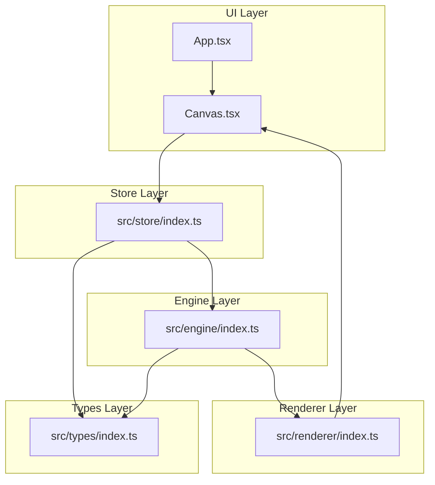
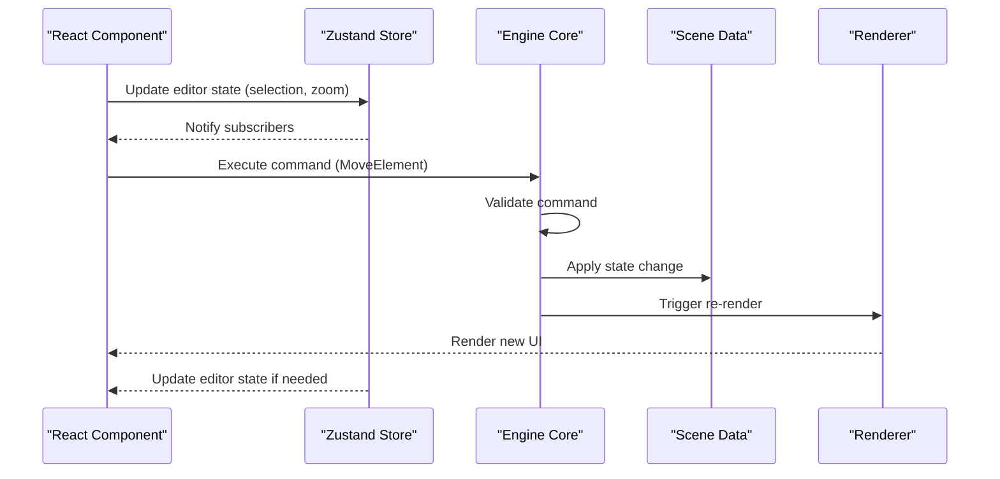
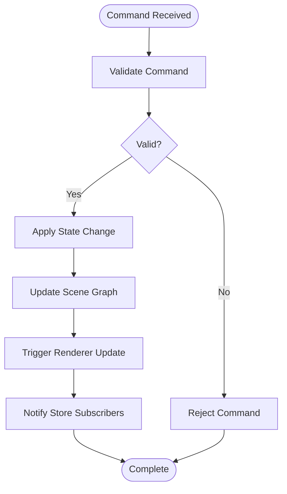
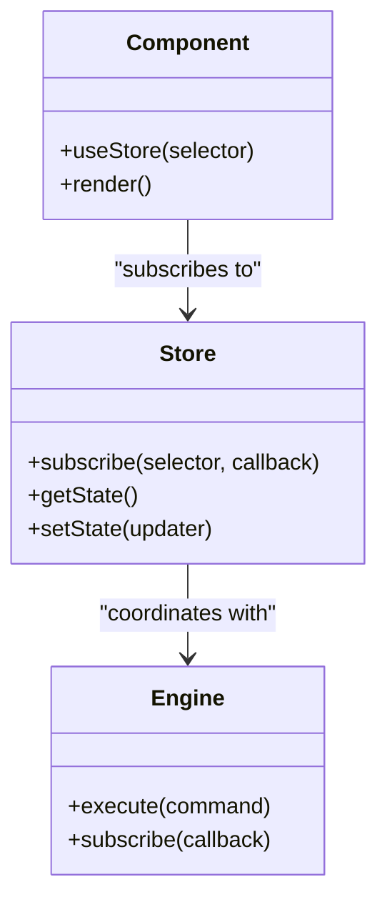
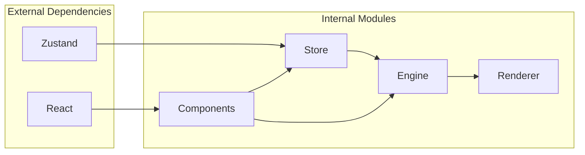

# State Management

<cite>
**Referenced Files in This Document**
- [index.ts](file://src/store/index.ts)
- [index.ts](file://src/engine/index.ts)
- [index.ts](file://src/renderer/index.ts)
- [App.tsx](file://src/App.tsx)
- [Canvas.tsx](file://src/components/Canvas.tsx)
- [main.tsx](file://src/main.tsx)
- [index.ts](file://src/types/index.ts)
- [spec.md](file://spec.md)
- [spec1.md](file://spec1.md)
- [package.json](file://package.json)
</cite>

## Table of Contents
1. [Introduction](#introduction)
2. [Project Structure](#project-structure)
3. [Core Components](#core-components)
4. [Architecture Overview](#architecture-overview)
5. [Detailed Component Analysis](#detailed-component-analysis)
6. [Dependency Analysis](#dependency-analysis)
7. [Performance Considerations](#performance-considerations)
8. [Troubleshooting Guide](#troubleshooting-guide)
9. [Conclusion](#conclusion)

## Introduction
This document describes the State Management system for the Slides Editor, focusing on the separation between editor state (selection, zoom, tools) and scene data (slides, elements). The system follows a strict architecture where all state changes must go through the engine's command execution pipeline, while the Zustand store manages UI/editor state independently from the core scene graph data. The documentation covers store architecture, integration with React components, synchronization mechanisms, persistence strategies, performance optimizations, and debugging approaches.

## Project Structure
The project is organized into distinct layers:
- UI Layer: React components (Canvas, App)
- Engine Layer: Framework-agnostic core managing scene data and commands
- Renderer Layer: Pure data-to-UI rendering utilities
- Store Layer: Zustand store for editor state (selection, zoom, tools)
- Types Layer: Shared TypeScript types

**Diagram sources**
- [App.tsx:1-17](file://src/App.tsx#L1-L17)
- [Canvas.tsx:1-40](file://src/components/Canvas.tsx#L1-L40)
- [index.ts:1-2](file://src/store/index.ts#L1-L2)
- [index.ts:1-3](file://src/engine/index.ts#L1-L3)
- [index.ts:1-3](file://src/renderer/index.ts#L1-L3)
- [index.ts:1-2](file://src/types/index.ts#L1-L2)

**Section sources**
- [App.tsx:1-17](file://src/App.tsx#L1-L17)
- [Canvas.tsx:1-40](file://src/components/Canvas.tsx#L1-L40)
- [index.ts:1-2](file://src/store/index.ts#L1-L2)
- [index.ts:1-3](file://src/engine/index.ts#L1-L3)
- [index.ts:1-3](file://src/renderer/index.ts#L1-L3)
- [index.ts:1-2](file://src/types/index.ts#L1-L2)

## Core Components
The state management system consists of three primary components:

### Zustand Store (Editor State)
The store manages editor-specific state including selection, zoom, and tools. It is separated from scene data to maintain a single source of truth in the engine.

### Engine Core
The engine serves as the framework-agnostic core that validates and executes commands, maintaining the authoritative scene graph state.

### Renderer Layer
Pure rendering utilities that transform scene data into UI components without state mutation.

**Section sources**
- [index.ts:1-2](file://src/store/index.ts#L1-L2)
- [index.ts:1-3](file://src/engine/index.ts#L1-L3)
- [index.ts:1-3](file://src/renderer/index.ts#L1-L3)

## Architecture Overview
The system enforces a strict separation of concerns with clear boundaries between editor state and scene data:

**Diagram sources**
- [index.ts:1-3](file://src/engine/index.ts#L1-L3)
- [index.ts:1-3](file://src/renderer/index.ts#L1-L3)

The architecture ensures that:
- All state mutations go through engine.execute(command)
- Editor state remains separate from scene data
- The engine maintains single source of truth
- React components subscribe to store updates
- Renderer consumes pure data transformations

## Detailed Component Analysis

### Zustand Store Implementation
The store is designed to manage editor state separately from scene data. While the current implementation file is minimal, the architecture supports:

#### State Structure
- Selection state (selected elements)
- Viewport state (zoom, pan, viewport bounds)
- Tool state (active tool, tool-specific parameters)
- UI state (panel visibility, modal states)

#### Subscription Patterns
Components subscribe to specific slices of state using selector functions to enable selective re-rendering.

#### Action Dispatching
Actions modify only editor state and trigger UI updates without touching scene data.

**Section sources**
- [index.ts:1-2](file://src/store/index.ts#L1-L2)

### Engine Integration
The engine serves as the authoritative state source with the following responsibilities:

#### Command Execution Pipeline

**Diagram sources**
- [index.ts:1-3](file://src/engine/index.ts#L1-L3)

#### State Synchronization
The engine maintains consistency between UI state and scene data through:
- Command validation before execution
- Atomic state transitions
- Event-driven notifications to subscribers

**Section sources**
- [index.ts:1-3](file://src/engine/index.ts#L1-L3)

### React Component Integration
Components integrate with the state management system through:

#### Store Subscriptions

**Diagram sources**
- [App.tsx:1-17](file://src/App.tsx#L1-L17)
- [Canvas.tsx:1-40](file://src/components/Canvas.tsx#L1-L40)

#### Selective Re-rendering
Components use selector functions to subscribe to specific state slices, minimizing unnecessary re-renders.

**Section sources**
- [App.tsx:1-17](file://src/App.tsx#L1-L17)
- [Canvas.tsx:1-40](file://src/components/Canvas.tsx#L1-L40)

### State Persistence Strategies
The system supports multiple persistence approaches:

#### Local Storage Integration
- Editor state persistence for UI preferences
- Scene data persistence through engine snapshots
- Session restoration on reload

#### Migration Patterns
- Versioned state schemas
- Backward compatibility handling
- Graceful degradation for missing fields

#### Reset Scenarios
- Hard reset to initial state
- Soft reset preserving scene data
- Partial reset for specific state slices

**Section sources**
- [spec1.md:23-42](file://spec1.md#L23-L42)

## Dependency Analysis
The state management system has clear dependency relationships:

**Diagram sources**
- [package.json:12-28](file://package.json#L12-L28)
- [spec.md:334-341](file://spec.md#L334-L341)

**Section sources**
- [package.json:12-28](file://package.json#L12-L28)
- [spec.md:334-341](file://spec.md#L334-L341)

## Performance Considerations
The state management system implements several performance optimizations:

### Selective Re-rendering
- Component-level subscriptions to specific state slices
- Memoized selectors to prevent unnecessary updates
- Batched updates for multiple state changes

### State Normalization
- Separation of editor state from scene data reduces update scope
- Immutable updates ensure predictable re-rendering
- Efficient subscription management prevents memory leaks

### Rendering Optimization
- Pure renderer functions eliminate side effects
- RequestAnimationFrame integration for smooth animations
- Virtual DOM batching for complex updates

## Troubleshooting Guide
Common issues and debugging approaches:

### State Consistency Issues
- Verify all state changes go through engine.execute(command)
- Check command validation logs
- Monitor subscription callbacks for unexpected state mutations

### Performance Problems
- Audit component subscriptions for unnecessary re-renders
- Profile selector function computations
- Monitor store subscription counts

### Integration Debugging
- Trace command execution flow from UI to engine
- Verify state synchronization between store and engine
- Check renderer input validation

**Section sources**
- [spec1.md:299-330](file://spec1.md#L299-L330)

## Conclusion
The Slides Editor's state management system establishes a robust foundation for separating UI/editor state from core scene data. Through the Zustand store and engine architecture, the system ensures consistency, performance, and maintainability. The strict command execution model and separation of concerns enable scalable development while maintaining predictable behavior across the entire application lifecycle.