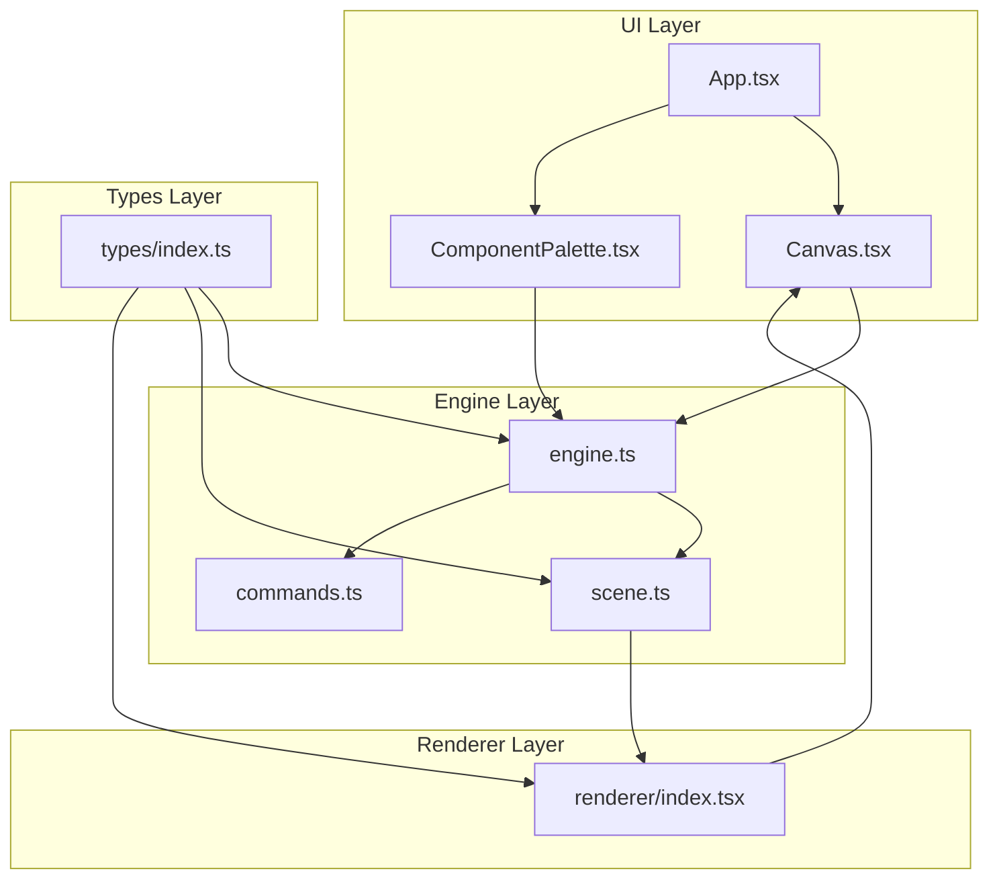
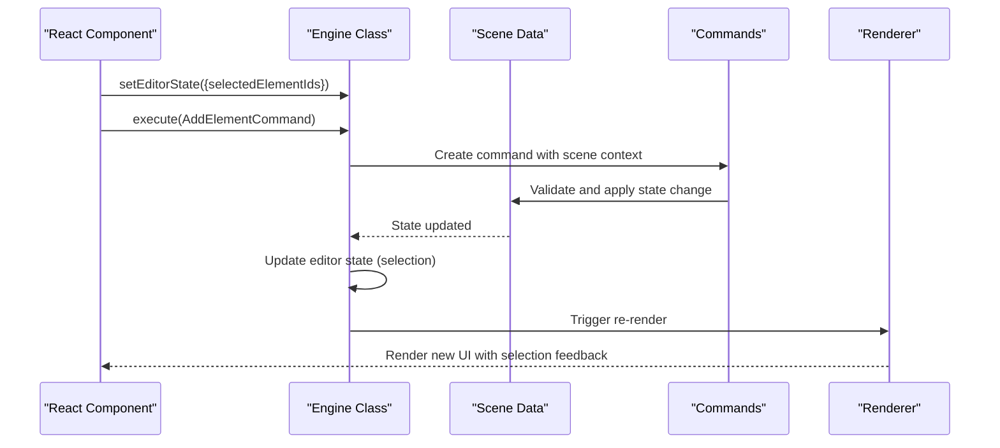
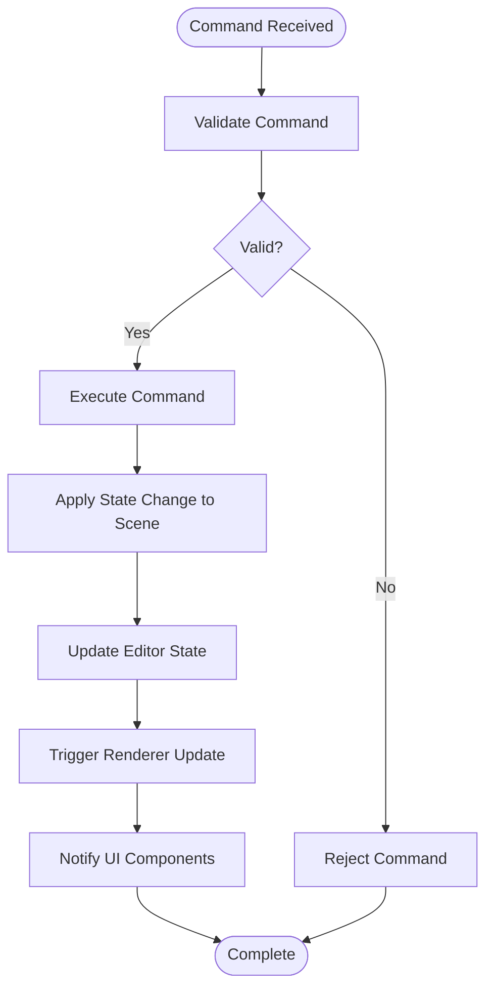
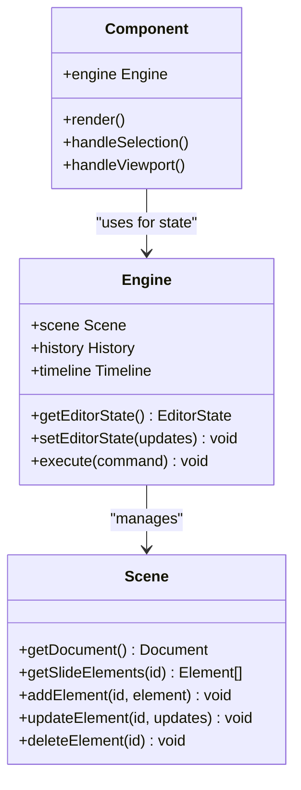
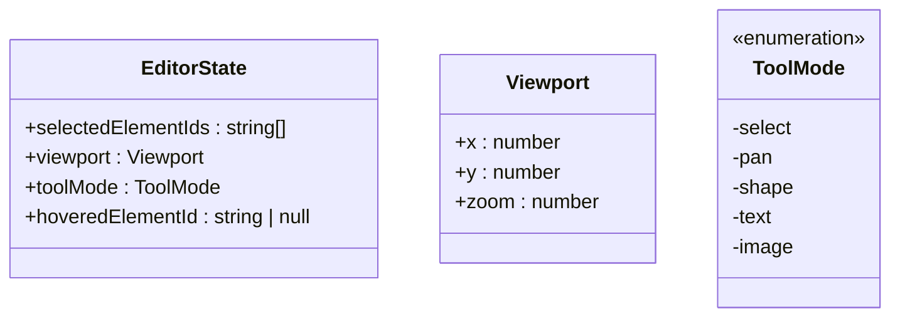
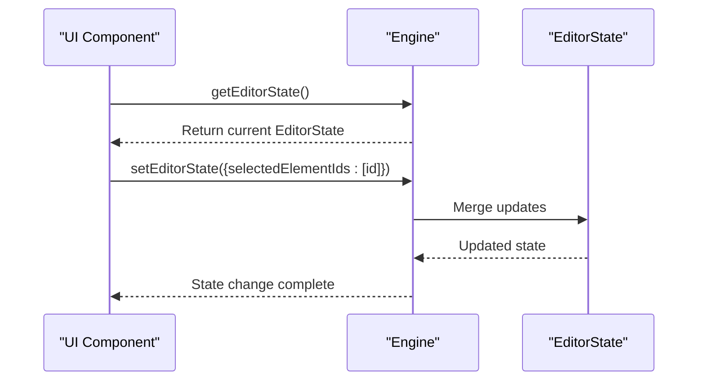

# State Management

<cite>
**Referenced Files in This Document**
- [index.ts](file://src/store/index.ts)
- [engine.ts](file://src/engine/engine.ts)
- [scene.ts](file://src/engine/scene.ts)
- [commands.ts](file://src/engine/commands.ts)
- [index.ts](file://src/engine/index.ts)
- [index.tsx](file://src/renderer/index.tsx)
- [App.tsx](file://src/App.tsx)
- [Canvas.tsx](file://src/components/Canvas.tsx)
- [ComponentPalette.tsx](file://src/components/ComponentPalette.tsx)
- [main.tsx](file://src/main.tsx)
- [index.ts](file://src/types/index.ts)
- [main.tsx](file://src/main.tsx)
</cite>

## Update Summary
**Changes Made**
- Updated editor state management to include viewport, tool modes, and selection handling
- Added comprehensive documentation for the new EditorState interface with viewport, toolMode, and selection properties
- Enhanced state synchronization mechanisms between UI and engine
- Documented the separation between editor state (UI/editor state) and scene data (core content)
- Added examples of state subscriptions, action dispatching, and state reset scenarios

## Table of Contents
1. [Introduction](#introduction)
2. [Project Structure](#project-structure)
3. [Core Components](#core-components)
4. [Architecture Overview](#architecture-overview)
5. [Detailed Component Analysis](#detailed-component-analysis)
6. [Editor State Management](#editor-state-management)
7. [Dependency Analysis](#dependency-analysis)
8. [Performance Considerations](#performance-considerations)
9. [Troubleshooting Guide](#troubleshooting-guide)
10. [Conclusion](#conclusion)

## Introduction
This document describes the State Management system for the Slides Editor, focusing on the separation between editor state (selection, viewport, zoom, tools) and scene data (slides, elements). The system follows a strict architecture where all state changes must go through the engine's command execution pipeline, while the Engine class manages UI/editor state independently from the core scene graph data. The documentation covers store architecture, integration with React components, synchronization mechanisms, persistence strategies, performance optimizations, and debugging approaches.

## Project Structure
The project is organized into distinct layers:
- UI Layer: React components (Canvas, App, ComponentPalette)
- Engine Layer: Framework-agnostic core managing scene data and commands with integrated editor state
- Renderer Layer: Pure data-to-UI rendering utilities
- Types Layer: Shared TypeScript types defining the complete state structure



**Diagram sources**
- [App.tsx:1-41](file://src/App.tsx#L1-L41)
- [Canvas.tsx:1-169](file://src/components/Canvas.tsx#L1-L169)
- [ComponentPalette.tsx:1-68](file://src/components/ComponentPalette.tsx#L1-L68)
- [engine.ts:1-54](file://src/engine/engine.ts#L1-L54)
- [scene.ts:1-146](file://src/engine/scene.ts#L1-L146)
- [commands.ts:1-67](file://src/engine/commands.ts#L1-L67)
- [index.tsx:1-135](file://src/renderer/index.tsx#L1-L135)
- [index.ts:1-238](file://src/types/index.ts#L1-L238)

**Section sources**
- [App.tsx:1-41](file://src/App.tsx#L1-L41)
- [Canvas.tsx:1-169](file://src/components/Canvas.tsx#L1-L169)
- [ComponentPalette.tsx:1-68](file://src/components/ComponentPalette.tsx#L1-L68)
- [engine.ts:1-54](file://src/engine/engine.ts#L1-L54)
- [scene.ts:1-146](file://src/engine/scene.ts#L1-L146)
- [commands.ts:1-67](file://src/engine/commands.ts#L1-L67)
- [index.tsx:1-135](file://src/renderer/index.tsx#L1-L135)
- [index.ts:1-238](file://src/types/index.ts#L1-L238)

## Core Components
The state management system consists of four primary components:

### Engine Class (Integrated State Management)
The Engine class serves as the central coordinator managing both scene data and editor state. It maintains:
- Scene graph data (elements, slides, document structure)
- Editor state (selection, viewport, tool modes, hover states)
- Command execution pipeline with history support
- State synchronization between UI and scene data

### Scene Class (Core Data Management)
The Scene class manages the authoritative scene graph with:
- Element storage and manipulation
- Slide organization and navigation
- Hierarchical relationships (groups, parents, children)
- Element lifecycle management (add, update, delete)

### Commands System (State Change Execution)
A command pattern implementation that ensures:
- All state mutations go through validated commands
- Atomic state transitions with undo/redo support
- Consistent state synchronization across the system
- Command composition for complex operations

### Renderer Layer (Pure UI Transformation)
Pure rendering utilities that transform scene data into UI components without state mutation:
- Element rendering (shapes, text, images)
- Selection highlighting and interaction feedback
- Style computation and layout calculations

**Section sources**
- [engine.ts:1-54](file://src/engine/engine.ts#L1-L54)
- [scene.ts:1-146](file://src/engine/scene.ts#L1-L146)
- [commands.ts:1-67](file://src/engine/commands.ts#L1-L67)
- [index.tsx:1-135](file://src/renderer/index.tsx#L1-L135)

## Architecture Overview
The system enforces a strict separation of concerns with clear boundaries between editor state and scene data:



**Diagram sources**
- [engine.ts:21-32](file://src/engine/engine.ts#L21-L32)
- [commands.ts:4-18](file://src/engine/commands.ts#L4-L18)
- [scene.ts:14-35](file://src/engine/scene.ts#L14-L35)

The architecture ensures that:
- All state mutations go through engine.execute(command)
- Editor state (selection, viewport, tools) remains separate from scene data
- The engine maintains single source of truth for both UI and content state
- React components can access both editor state and scene data through the engine
- Renderer consumes pure data transformations with editor state overlays

## Detailed Component Analysis

### Engine Integration
The Engine class serves as the authoritative state source with the following responsibilities:

#### Command Execution Pipeline


**Diagram sources**
- [engine.ts:29-32](file://src/engine/engine.ts#L29-L32)
- [commands.ts:11-17](file://src/engine/commands.ts#L11-L17)

#### State Synchronization
The engine maintains consistency between UI state and scene data through:
- Command validation before execution
- Atomic state transitions with rollback capability
- Editor state updates coordinated with scene changes
- Event-driven notifications to subscribed components

**Section sources**
- [engine.ts:1-54](file://src/engine/engine.ts#L1-L54)
- [commands.ts:1-67](file://src/engine/commands.ts#L1-L67)

### React Component Integration
Components integrate with the state management system through:

#### Store-like Interface Pattern


**Diagram sources**
- [App.tsx:1-41](file://src/App.tsx#L1-L41)
- [Canvas.tsx:18-24](file://src/components/Canvas.tsx#L18-L24)
- [engine.ts:21-27](file://src/engine/engine.ts#L21-L27)

#### Selective Re-rendering
Components use the engine's state accessors to subscribe to specific state slices:
- `engine.getEditorState()` for UI state (selection, viewport, tools)
- `engine.scene.getSlideElements()` for content state
- Direct property access eliminates unnecessary re-renders

**Section sources**
- [App.tsx:1-41](file://src/App.tsx#L1-L41)
- [Canvas.tsx:18-24](file://src/components/Canvas.tsx#L18-L24)
- [engine.ts:21-27](file://src/engine/engine.ts#L21-L27)

## Editor State Management

### EditorState Interface
The EditorState interface defines the complete UI/editor state structure:



**Diagram sources**
- [index.ts:115-120](file://src/types/index.ts#L115-L120)
- [index.ts:107-111](file://src/types/index.ts#L107-L111)
- [index.ts:113](file://src/types/index.ts#L113)

#### State Properties
- **selectedElementIds**: Array of currently selected element IDs for multi-selection support
- **viewport**: Camera/view positioning with x/y coordinates and zoom level
- **toolMode**: Active editing mode (select, pan, shape creation, text, image)
- **hoveredElementId**: Currently hovered element for visual feedback

#### State Access and Mutation


**Diagram sources**
- [engine.ts:21-27](file://src/engine/engine.ts#L21-L27)
- [Canvas.tsx:58-69](file://src/components/Canvas.tsx#L58-L69)

**Section sources**
- [index.ts:104-120](file://src/types/index.ts#L104-L120)
- [engine.ts:12-27](file://src/engine/engine.ts#L12-L27)
- [Canvas.tsx:24](file://src/components/Canvas.tsx#L24)

### State Persistence Strategies
The system supports multiple persistence approaches:

#### Local Storage Integration
- Editor state persistence for UI preferences (selection, viewport, tool mode)
- Scene data persistence through engine snapshots
- Session restoration on reload with state migration support

#### Migration Patterns
- Versioned state schemas for backward compatibility
- Graceful degradation for missing editor state fields
- Automatic state normalization during load

#### Reset Scenarios
- Hard reset to initial state (empty document with default editor state)
- Soft reset preserving scene data but clearing editor state
- Partial reset for specific state slices (selection only, viewport only)

**Section sources**
- [index.ts:230-237](file://src/types/index.ts#L230-L237)

## Dependency Analysis
The state management system has clear dependency relationships:

```mermaid
graph LR
subgraph "External Dependencies"
REACT["React"]
TYPESCRIPT["TypeScript"]
END
subgraph "Internal Modules"
ENGINE["Engine"]
SCENE["Scene"]
COMMANDS["Commands"]
RENDERER["Renderer"]
COMPONENTS["Components"]
TYPES["Types"]
END
REACT --> COMPONENTS
COMPONENTS --> ENGINE
ENGINE --> SCENE
ENGINE --> COMMANDS
SCENE --> RENDERER
TYPES --> ENGINE
TYPES --> SCENE
TYPES --> RENDERER
```

**Diagram sources**
- [package.json:12-28](file://package.json#L12-L28)
- [engine.ts:1-54](file://src/engine/engine.ts#L1-L54)
- [scene.ts:1-146](file://src/engine/scene.ts#L1-L146)
- [commands.ts:1-67](file://src/engine/commands.ts#L1-L67)
- [index.tsx:1-135](file://src/renderer/index.tsx#L1-L135)
- [index.ts:1-238](file://src/types/index.ts#L1-L238)

**Section sources**
- [package.json:12-28](file://package.json#L12-L28)
- [engine.ts:1-54](file://src/engine/engine.ts#L1-L54)
- [scene.ts:1-146](file://src/engine/scene.ts#L1-L146)
- [commands.ts:1-67](file://src/engine/commands.ts#L1-L67)
- [index.tsx:1-135](file://src/renderer/index.tsx#L1-L135)
- [index.ts:1-238](file://src/types/index.ts#L1-L238)

## Performance Considerations
The state management system implements several performance optimizations:

### Selective Re-rendering
- Component-level state access through engine.getEditorState()
- Direct property access eliminates unnecessary subscription overhead
- Immutable state updates ensure predictable re-rendering

### State Normalization
- Clear separation between editor state and scene data reduces update scope
- Command pattern ensures atomic state transitions
- Efficient subscription management prevents memory leaks

### Rendering Optimization
- Pure renderer functions eliminate side effects
- Selection state computed at render time for efficiency
- Minimal DOM updates through focused state changes

## Troubleshooting Guide
Common issues and debugging approaches:

### State Consistency Issues
- Verify all state changes go through engine.execute(command)
- Check command validation logs for failed operations
- Monitor editor state updates for unexpected mutations

### Performance Problems
- Audit component state access patterns
- Profile engine.getEditorState() calls for unnecessary re-renders
- Monitor command execution timing for bottlenecks

### Integration Debugging
- Trace command execution flow from UI to engine
- Verify state synchronization between editor and scene
- Check renderer input validation and selection feedback

**Section sources**
- [engine.ts:29-32](file://src/engine/engine.ts#L29-L32)
- [commands.ts:11-17](file://src/engine/commands.ts#L11-L17)

## Conclusion
The Slides Editor's state management system establishes a robust foundation for separating UI/editor state from core scene data. Through the integrated Engine class architecture, the system ensures consistency, performance, and maintainability. The strict command execution model and separation of concerns enable scalable development while maintaining predictable behavior across the entire application lifecycle. The new editor state management with viewport, tool modes, and selection handling provides comprehensive UI state control while maintaining clean separation from the core scene graph data.