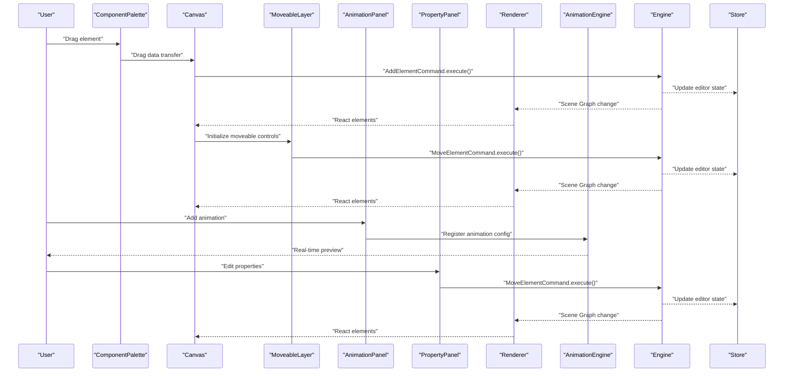
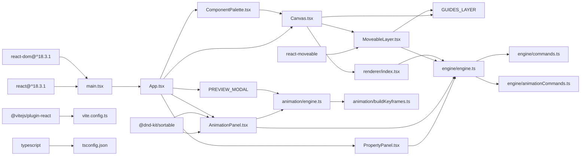

# User Interface Components

<cite>
**Referenced Files in This Document**
- [App.tsx](file://src/App.tsx)
- [Canvas.tsx](file://src/components/Canvas.tsx)
- [ComponentPalette.tsx](file://src/components/ComponentPalette.tsx)
- [AnimationPanel.tsx](file://src/components/AnimationPanel.tsx)
- [GuidesLayer.tsx](file://src/components/GuidesLayer.tsx)
- [MoveableLayer.tsx](file://src/components/MoveableLayer.tsx)
- [PreviewModal.tsx](file://src/components/PreviewModal.tsx)
- [PropertyPanel.tsx](file://src/components/PropertyPanel.tsx)
- [main.tsx](file://src/main.tsx)
- [engine/index.ts](file://src/engine/index.ts)
- [engine/engine.ts](file://src/engine/engine.ts)
- [engine/commands.ts](file://src/engine/commands.ts)
- [engine/animationCommands.ts](file://src/engine/animationCommands.ts)
- [animation/engine.ts](file://src/animation/engine.ts)
- [animation/buildKeyframes.ts](file://src/animation/buildKeyframes.ts)
- [renderer/index.tsx](file://src/renderer/index.tsx)
- [types/index.ts](file://src/types/index.ts)
- [types/animation.ts](file://src/types/animation.ts)
- [store/index.ts](file://src/store/index.ts)
- [index.html](file://index.html)
- [vite.config.ts](file://vite.config.ts)
- [tsconfig.json](file://tsconfig.json)
- [package.json](file://package.json)
</cite>

## Update Summary
**Changes Made**
- Added comprehensive documentation for six new UI components: AnimationPanel, ComponentPalette, GuidesLayer, MoveableLayer, PreviewModal, and PropertyPanel
- Updated Canvas component documentation to reflect integration with MoveableLayer and GuidesLayer
- Enhanced architecture overview with new component interactions and animation system
- Added detailed animation management capabilities with drag-and-drop support and real-time preview
- Updated dependency analysis with new component relationships and animation engine integration
- Expanded performance considerations for the enhanced UI structure with animation capabilities

## Table of Contents
1. [Introduction](#introduction)
2. [Project Structure](#project-structure)
3. [Core Components](#core-components)
4. [Architecture Overview](#architecture-overview)
5. [Detailed Component Analysis](#detailed-component-analysis)
6. [Animation System](#animation-system)
7. [Dependency Analysis](#dependency-analysis)
8. [Performance Considerations](#performance-considerations)
9. [Troubleshooting Guide](#troubleshooting-guide)
10. [Conclusion](#conclusion)
11. [Appendices](#appendices)

## Introduction
This document focuses on the User Interface Components with emphasis on the Canvas component, six new UI components (AnimationPanel, ComponentPalette, GuidesLayer, MoveableLayer, PreviewModal, PropertyPanel), and the overall layout structure. It explains how the Canvas serves as the central editing surface with full drag-and-drop capabilities, how the ComponentPalette provides element creation tools, and how these components integrate with the engine system. The document covers the comprehensive animation management system, advanced selection and manipulation capabilities, styling and theming approaches, responsive design considerations, accessibility, cross-browser compatibility, performance optimization, component composition patterns, and communication between UI components and the engine layer.

## Project Structure
The project follows a clear separation of concerns with comprehensive React-based UI components and animation system:
- UI layer: React components (App, Canvas, six specialized panels and layers)
- Engine layer: framework-agnostic core logic and state transitions
- Animation layer: dedicated animation engine with adapter pattern
- Renderer layer: pure data-to-UI rendering utilities
- Store: editor state separate from scene data
- Types: shared TypeScript types for both UI and animation systems
- Build and configuration: Vite, React, TypeScript

```mermaid
graph TB
subgraph "UI Layer"
APP["App.tsx"]
CANVAS["Canvas.tsx"]
PALETTE["ComponentPalette.tsx"]
PROPERTY_PANEL["PropertyPanel.tsx"]
ANIMATION_PANEL["AnimationPanel.tsx"]
PREVIEW_MODAL["PreviewModal.tsx"]
MOVEABLE_LAYER["MoveableLayer.tsx"]
GUIDES_LAYER["GuidesLayer.tsx"]
end
subgraph "Engine Layer"
ENGINE["engine/index.ts"]
ENGINE_CLASS["engine/engine.ts"]
COMMANDS["engine/commands.ts"]
ANIMATION_COMMANDS["engine/animationCommands.ts"]
end
subgraph "Animation Layer"
ANIMATION_ENGINE["animation/engine.ts"]
BUILD_KEYFRAMES["animation/buildKeyframes.ts"]
end
subgraph "Renderer Layer"
RENDERER["renderer/index.tsx"]
end
subgraph "State"
STORE["store/index.ts"]
TYPES["types/index.ts"]
ANIMATION_TYPES["types/animation.ts"]
END
subgraph "Runtime"
HTML["index.html"]
MAIN["main.tsx"]
CONFIG["vite.config.ts"]
TSCONFIG["tsconfig.json"]
END
APP --> PALETTE
APP --> CANVAS
APP --> PROPERTY_PANEL
APP --> ANIMATION_PANEL
APP --> PREVIEW_MODAL
CANVAS --> MOVEABLE_LAYER
CANVAS --> GUIDES_LAYER
CANVAS --> RENDERER
PALETTE --> CANVAS
PROPERTY_PANEL --> ENGINE_CLASS
ANIMATION_PANEL --> ENGINE_CLASS
ANIMATION_PANEL --> ANIMATION_ENGINE
PREVIEW_MODAL --> ANIMATION_ENGINE
MOVEABLE_LAYER --> ENGINE_CLASS
MOVEABLE_LAYER --> GUIDES_LAYER
RENDERER --> ENGINE_CLASS
ENGINE_CLASS --> COMMANDS
ENGINE_CLASS --> ANIMATION_COMMANDS
ANIMATION_ENGINE --> BUILD_KEYFRAMES
STORE --> ENGINE_CLASS
TYPES --> RENDERER
ANIMATION_TYPES --> ANIMATION_ENGINE
ANIMATION_TYPES --> ANIMATION_PANEL
MAIN --> APP
HTML --> MAIN
CONFIG --> MAIN
TSCONFIG --> MAIN
```

**Diagram sources**
- [App.tsx:1-318](file://src/App.tsx#L1-L318)
- [Canvas.tsx:1-182](file://src/components/Canvas.tsx#L1-L182)
- [ComponentPalette.tsx:1-68](file://src/components/ComponentPalette.tsx#L1-L68)
- [PropertyPanel.tsx:1-332](file://src/components/PropertyPanel.tsx#L1-L332)
- [AnimationPanel.tsx:1-847](file://src/components/AnimationPanel.tsx#L1-L847)
- [PreviewModal.tsx:1-174](file://src/components/PreviewModal.tsx#L1-L174)
- [MoveableLayer.tsx:1-187](file://src/components/MoveableLayer.tsx#L1-L187)
- [GuidesLayer.tsx:1-66](file://src/components/GuidesLayer.tsx#L1-L66)
- [engine/index.ts:1-9](file://src/engine/index.ts#L1-L9)
- [engine/engine.ts:1-54](file://src/engine/engine.ts#L1-L54)
- [engine/commands.ts:1-67](file://src/engine/commands.ts#L1-L67)
- [engine/animationCommands.ts:1-44](file://src/engine/animationCommands.ts#L1-L44)
- [animation/engine.ts:1-120](file://src/animation/engine.ts#L1-L120)
- [animation/buildKeyframes.ts](file://src/animation/buildKeyframes.ts)
- [renderer/index.tsx:1-135](file://src/renderer/index.tsx#L1-L135)
- [store/index.ts:1-2](file://src/store/index.ts#L1-L2)
- [types/index.ts:1-238](file://src/types/index.ts#L1-L238)
- [types/animation.ts:1-113](file://src/types/animation.ts#L1-L113)
- [index.html:1-14](file://index.html#L1-L14)
- [main.tsx:1-10](file://src/main.tsx#L1-L10)
- [vite.config.ts:1-7](file://vite.config.ts#L1-L7)
- [tsconfig.json:1-8](file://tsconfig.json#L1-L8)

**Section sources**
- [App.tsx:1-318](file://src/App.tsx#L1-L318)
- [Canvas.tsx:1-182](file://src/components/Canvas.tsx#L1-L182)
- [ComponentPalette.tsx:1-68](file://src/components/ComponentPalette.tsx#L1-L68)
- [PropertyPanel.tsx:1-332](file://src/components/PropertyPanel.tsx#L1-L332)
- [AnimationPanel.tsx:1-847](file://src/components/AnimationPanel.tsx#L1-L847)
- [PreviewModal.tsx:1-174](file://src/components/PreviewModal.tsx#L1-L174)
- [MoveableLayer.tsx:1-187](file://src/components/MoveableLayer.tsx#L1-L187)
- [GuidesLayer.tsx:1-66](file://src/components/GuidesLayer.tsx#L1-L66)
- [engine/index.ts:1-9](file://src/engine/index.ts#L1-L9)
- [renderer/index.tsx:1-135](file://src/renderer/index.tsx#L1-L135)
- [store/index.ts:1-2](file://src/store/index.ts#L1-L2)
- [types/index.ts:1-238](file://src/types/index.ts#L1-L238)
- [types/animation.ts:1-113](file://src/types/animation.ts#L1-L113)
- [index.html:1-14](file://index.html#L1-L14)
- [main.tsx:1-10](file://src/main.tsx#L1-L10)
- [vite.config.ts:1-7](file://vite.config.ts#L1-L7)
- [tsconfig.json:1-8](file://tsconfig.json#L1-L8)

## Core Components
- **Canvas**: The central editing area that renders the presentation surface with full drag-and-drop support for creating elements from the palette and integrates MoveableLayer for advanced selection and manipulation.
- **ComponentPalette**: Sidebar component providing draggable element creation tools (shapes, text, images) with visual icons and labels.
- **PropertyPanel**: Right-side panel for editing element properties including transform, shape, text, and image properties with real-time updates.
- **AnimationPanel**: Comprehensive animation management system with drag-and-drop support for animation ordering, real-time preview, and step-based animation sequences.
- **MoveableLayer**: Advanced selection and manipulation layer providing drag, rotate, and resize capabilities with snapping and visual feedback.
- **GuidesLayer**: Visual snapping guides overlay providing center, spacing, and edge alignment assistance during element manipulation.
- **PreviewModal**: Full-screen animation preview modal with step-by-step playback and keyboard controls for testing animations.
- **App**: Main application component that orchestrates layout with header, sidebar palette, canvas area, and dual-panel interface.

Key characteristics:
- **Layout**: Full viewport container with responsive three-column layout (palette + canvas + panels).
- **Canvas sizing**: Fixed 16:9 aspect ratio slide surface with centered positioning and subtle shadow.
- **Panels**: Fixed width side panels (400px) with tabbed interface for properties and animation management.
- **Theming**: Uses inline styles for simplicity; can be refactored to CSS-in-JS or CSS modules for maintainability.

**Section sources**
- [Canvas.tsx:1-182](file://src/components/Canvas.tsx#L1-L182)
- [ComponentPalette.tsx:1-68](file://src/components/ComponentPalette.tsx#L1-L68)
- [PropertyPanel.tsx:1-332](file://src/components/PropertyPanel.tsx#L1-L332)
- [AnimationPanel.tsx:1-847](file://src/components/AnimationPanel.tsx#L1-L847)
- [MoveableLayer.tsx:1-187](file://src/components/MoveableLayer.tsx#L1-L187)
- [GuidesLayer.tsx:1-66](file://src/components/GuidesLayer.tsx#L1-L66)
- [PreviewModal.tsx:1-174](file://src/components/PreviewModal.tsx#L1-L174)
- [App.tsx:1-318](file://src/App.tsx#L1-L318)

## Architecture Overview
The UI communicates with the engine through a command-driven model with enhanced component interactions and comprehensive animation system:
- UI triggers user actions (drag, drop, click, select, manipulate).
- Actions are translated into Commands and executed through the Engine.
- Engine updates the Scene Graph and editor state.
- Renderer queries the Scene Graph and produces React elements for display.
- AnimationEngine manages animation lifecycle and keyframe generation.
- Store holds editor state (selection, panels, viewport) separate from scene data.



**Diagram sources**
- [ComponentPalette.tsx:18-67](file://src/components/ComponentPalette.tsx#L18-L67)
- [Canvas.tsx:31-56](file://src/components/Canvas.tsx#L31-L56)
- [MoveableLayer.tsx:44-181](file://src/components/MoveableLayer.tsx#L44-L181)
- [AnimationPanel.tsx:203-254](file://src/components/AnimationPanel.tsx#L203-L254)
- [PropertyPanel.tsx:35-41](file://src/components/PropertyPanel.tsx#L35-L41)
- [engine/commands.ts:4-18](file://src/engine/commands.ts#L4-L18)
- [engine/engine.ts:29-32](file://src/engine/engine.ts#L29-L32)
- [animation/engine.ts:32-70](file://src/animation/engine.ts#L32-L70)
- [renderer/index.tsx:121-134](file://src/renderer/index.tsx#L121-L134)
- [types/index.ts:115-120](file://src/types/index.ts#L115-L120)

## Detailed Component Analysis

### Canvas Component
The Canvas component defines the central editing surface with comprehensive drag-and-drop functionality and advanced manipulation capabilities:
- **Outer container**: Full-width and full-height with light gray background and centered flex layout.
- **Inner slide surface**: Fixed 960x540 dimensions (16:9 aspect ratio) with configurable background and subtle shadow.
- **Element rendering**: Maps through all slide elements and renders them using the Renderer.
- **Selection handling**: Supports element click selection and canvas click deselection.
- **Drag-and-drop**: Handles external drag data and creates new elements via AddElementCommand.
- **Moveable integration**: Embeds MoveableLayer for advanced selection and manipulation with snapping.

**Enhanced Features**:
- **Drag detection**: Prevents default drag behavior and sets drop effect to copy.
- **Drop processing**: Parses JSON drag data, calculates drop coordinates, and creates appropriate element types.
- **Selection management**: Updates editor state with newly created element selection.
- **Refresh mechanism**: Calls onRefresh callback to trigger re-render cycle.
- **Layer integration**: Seamlessly integrates MoveableLayer and GuidesLayer for advanced editing capabilities.

**Section sources**
- [Canvas.tsx:18-119](file://src/components/Canvas.tsx#L18-L119)
- [Canvas.tsx:121-182](file://src/components/Canvas.tsx#L121-L182)
- [engine/commands.ts:4-18](file://src/engine/commands.ts#L4-L18)

### ComponentPalette Component
The ComponentPalette provides the element creation interface:
- **Sidebar layout**: Fixed 200px width with right border and light gray background.
- **Palette items**: Five draggable elements (rectangle, circle, triangle, text, image) with visual icons.
- **Drag handling**: Serializes element type and shape type to JSON for drag data transfer.
- **Visual design**: Clean card-based layout with hover effects and consistent spacing.

**Palette Items**:
- **Shapes**: Rectangle (□), Circle (○), Triangle (△) with shapeType metadata.
- **Text**: Simple text element creation.
- **Image**: Image element with placeholder URL.

**Section sources**
- [ComponentPalette.tsx:18-67](file://src/components/ComponentPalette.tsx#L18-L67)
- [types/index.ts:24-45](file://src/types/index.ts#L24-L45)

### PropertyPanel Component
The PropertyPanel provides comprehensive element property editing capabilities:
- **Panel layout**: Fixed 400px width with scrollable content area.
- **Dynamic content**: Renders different property forms based on selected element type.
- **Real-time updates**: Commits property changes immediately via MoveElementCommand.
- **Transform controls**: X, Y, Width, Height, Rotation, Opacity with validation.
- **Element-specific controls**: Shape properties (fill, stroke, stroke width), Text properties (content, font size, color, alignment), Image properties (source, fit mode).

**Property Categories**:
- **Transform**: Position, size, rotation, and opacity controls with numeric input validation.
- **Shape**: Fill color, stroke color, and stroke width with color picker support.
- **Text**: Content editing, font size, color, and text alignment options.
- **Image**: Source URL and object fit modes (cover, contain, fill).

**Section sources**
- [PropertyPanel.tsx:12-77](file://src/components/PropertyPanel.tsx#L12-L77)
- [PropertyPanel.tsx:90-142](file://src/components/PropertyPanel.tsx#L90-L142)
- [PropertyPanel.tsx:257-331](file://src/components/PropertyPanel.tsx#L257-L331)

### AnimationPanel Component
The AnimationPanel provides comprehensive animation management with advanced features:
- **Panel layout**: Fixed 400px width with dual-section interface (animation list + form).
- **Drag-and-drop support**: Sortable animation list with @dnd-kit for reordering.
- **Animation types**: Enter (fadeIn, zoomIn, slideIn, flyIn, rotateIn), Emphasis (pulse, shake, blink, scale, highlight), Exit (fadeOut, zoomOut, slideOut, flyOut, rotateOut).
- **Start types**: Click (new step), With Previous (same batch), After Previous (new batch) with automatic relationship fixing.
- **Parameter handling**: Effect-specific parameters (direction, distance, scale, angle, brightness).
- **Real-time preview**: Individual animation playback and step-based preview functionality.

**Advanced Features**:
- **Step numbering**: Visual step indicators showing animation sequence flow.
- **Relationship indicators**: Color-coded start type indicators (blue for click, green for withPrev, amber for afterPrev).
- **Auto-fixing**: Automatically adjusts start types when animations are reordered.
- **Parameter validation**: Effect-specific parameter validation and default value assignment.
- **Batch operations**: Group animations into batches for coordinated playback.

**Section sources**
- [AnimationPanel.tsx:87-539](file://src/components/AnimationPanel.tsx#L87-L539)
- [AnimationPanel.tsx:545-736](file://src/components/AnimationPanel.tsx#L545-L736)
- [AnimationPanel.tsx:742-847](file://src/components/AnimationPanel.tsx#L742-L847)

### MoveableLayer Component
The MoveableLayer provides advanced selection and manipulation capabilities:
- **Integration**: Seamless integration with react-moveable library for drag, rotate, and resize operations.
- **Snapping**: Intelligent snapping to edges, centers, and spacing guides with visual feedback.
- **Multi-selection**: Supports multiple element selection with unified manipulation controls.
- **Real-time updates**: Immediate visual feedback during manipulation with transform previews.
- **Guides overlay**: Dynamic guides layer showing snapping positions and relationships.

**Manipulation Features**:
- **Drag operations**: Precise element positioning with snap-to-grid functionality.
- **Rotate operations**: Smooth rotation with angle preservation and visual feedback.
- **Resize operations**: Proportional and non-proportional resizing with constraint handling.
- **Snap integration**: Custom snapping engine integration for precise alignment.

**Section sources**
- [MoveableLayer.tsx:14-187](file://src/components/MoveableLayer.tsx#L14-L187)

### GuidesLayer Component
The GuidesLayer provides visual snapping assistance:
- **Overlay positioning**: Absolute positioning overlay covering the entire canvas area.
- **Guide types**: Three categories - center guides (green), spacing guides (amber), edge guides (blue).
- **Dynamic rendering**: Generates horizontal and vertical guide lines based on guide configurations.
- **Visual styling**: Semi-transparent colored lines with opacity for non-intrusive guidance.

**Guide Types**:
- **Center guides**: Horizontal and vertical lines at element centers for perfect alignment.
- **Spacing guides**: Lines indicating equal spacing between elements.
- **Edge guides**: Alignment lines at element edges for precise edge-to-edge positioning.

**Section sources**
- [GuidesLayer.tsx:19-66](file://src/components/GuidesLayer.tsx#L19-L66)

### PreviewModal Component
The PreviewModal provides comprehensive animation preview capabilities:
- **Full-screen overlay**: Fixed positioning covering entire viewport with semi-transparent background.
- **Step-by-step playback**: Interactive step-by-step animation preview with progress indication.
- **Keyboard controls**: Space/Enter to advance, Escape to exit, click to navigate.
- **Real-time rendering**: Direct rendering of slide elements without editor controls.
- **Animation synchronization**: Integration with AnimationEngine for accurate playback timing.

**Preview Features**:
- **Progress tracking**: Current step and total step count display.
- **Interactive controls**: Manual step advancement and preview termination.
- **Keyboard shortcuts**: Full keyboard navigation for efficient preview workflow.
- **Clean interface**: Minimalist design focused purely on animation demonstration.

**Section sources**
- [PreviewModal.tsx:13-174](file://src/components/PreviewModal.tsx#L13-L174)

### App Component and Layout Structure
The App component establishes the main application layout with comprehensive UI integration:
- **Header**: Contains title "Slides Editor", undo/redo controls, animation preview controls, and element count display.
- **Main area**: Three-column layout with ComponentPalette, Canvas, and dual-panel interface (PropertyPanel/AnimationPanel).
- **Responsive design**: Flexible column layout that adapts to different screen sizes.
- **State management**: Creates engine instance with mock document, manages right panel tabs, and handles preview modal state.
- **Animation integration**: Coordinates AnimationEngine with Canvas and AnimationPanel for synchronized animation management.

**Layout Features**:
- **Header styling**: White background with subtle border and flex alignment.
- **Element counter**: Dynamic count of elements on current slide.
- **Dual panel interface**: Tabbed interface switching between Properties and Animation panels.
- **Animation controls**: Specialized controls for animation preview and step-by-step playback.

**Section sources**
- [App.tsx:11-318](file://src/App.tsx#L11-L318)
- [types/index.ts:126-205](file://src/types/index.ts#L126-L205)

### Engine Integration Patterns
The engine maintains its framework-agnostic design while supporting the new UI components:
- **Command execution**: All state changes go through engine.execute(command).
- **State management**: Separate editor state from scene data with get/set methods.
- **History tracking**: Built-in undo/redo functionality through History class.
- **Mock data**: Comprehensive mock document and editor state for development.
- **Animation commands**: Specialized animation commands for batch operations and state management.

**Command System**:
- **AddElementCommand**: Creates new elements on slide.
- **MoveElementCommand**: Updates element properties with undo support.
- **DeleteElementCommand**: Removes elements with undo capability.
- **BatchAnimationCommand**: Manages complex animation state changes atomically.

**Section sources**
- [engine/engine.ts:7-49](file://src/engine/engine.ts#L7-L49)
- [engine/commands.ts:4-66](file://src/engine/commands.ts#L4-L66)
- [engine/animationCommands.ts:14-43](file://src/engine/animationCommands.ts#L14-L43)
- [types/index.ts:78-81](file://src/types/index.ts#L78-L81)

### Renderer Integration
The renderer provides pure data-to-UI conversion with enhanced selection handling:
- **Element rendering**: Switch-based rendering for shapes, text, and images.
- **Selection outlines**: Visual selection indicators with blue borders.
- **Event propagation**: Proper event handling with stopPropagation for element clicks.
- **Style composition**: Base styles with element-specific overrides.

**Rendering Features**:
- **Shape rendering**: Supports rectangle, circle, and triangle with CSS properties.
- **Text rendering**: Flexible alignment with flexbox and word wrapping.
- **Image rendering**: Object fit control and accessibility attributes.
- **Selection visualization**: Absolute positioned outline around selected elements.

**Section sources**
- [renderer/index.tsx:24-134](file://src/renderer/index.tsx#L24-L134)
- [types/index.ts:24-45](file://src/types/index.ts#L24-L45)

### Drag-and-Drop and Selection Mechanics
Enhanced drag-and-drop implementation with comprehensive element creation and manipulation:
- **Palette drag**: Serializes element type and shape metadata to JSON.
- **Canvas drop**: Processes drag data, calculates coordinates, and creates elements.
- **Selection management**: Updates editor state and triggers re-render.
- **Coordinate calculation**: Converts mouse coordinates to slide-relative positions.
- **Moveable integration**: Advanced manipulation with snapping and visual feedback.

**Implementation Details**:
- **Data transfer**: Uses application/json MIME type for reliable data transport.
- **Error handling**: JSON parsing validation and coordinate bounds checking.
- **Element creation**: Factory function generates appropriate element types with defaults.
- **Multi-selection**: Support for selecting multiple elements with unified manipulation.

**Section sources**
- [ComponentPalette.tsx:19-26](file://src/components/ComponentPalette.tsx#L19-L26)
- [Canvas.tsx:31-56](file://src/components/Canvas.tsx#L31-L56)
- [Canvas.tsx:109-119](file://src/components/Canvas.tsx#L109-L119)

## Animation System
The animation system provides comprehensive animation management with advanced features:
- **Animation types**: Enter, emphasis, and exit animations with predefined effects.
- **Parameter system**: Effect-specific parameters with validation and default values.
- **Start types**: Click, with previous, and after previous relationships with automatic fixing.
- **Keyframe generation**: Dynamic keyframe construction based on animation configurations.
- **Playback control**: Individual and batch animation playback with lifecycle management.

**Animation Features**:
- **Effect categories**: Enter (fadeIn, zoomIn, slideIn, flyIn, rotateIn), Emphasis (pulse, shake, blink, scale, highlight), Exit (fadeOut, zoomOut, slideOut, flyOut, rotateOut).
- **Parameter handling**: Direction, distance, scale, angle, and brightness parameters.
- **Step-based sequencing**: Click steps with batched animations for coordinated playback.
- **Real-time preview**: Individual animation preview and step-by-step playback.

**Section sources**
- [AnimationPanel.tsx:48-85](file://src/components/AnimationPanel.tsx#L48-L85)
- [AnimationPanel.tsx:136-201](file://src/components/AnimationPanel.tsx#L136-L201)
- [AnimationPanel.tsx:295-318](file://src/components/AnimationPanel.tsx#L295-L318)
- [animation/engine.ts:52-70](file://src/animation/engine.ts#L52-L70)
- [types/animation.ts:26-70](file://src/types/animation.ts#L26-L70)

## Dependency Analysis
External dependencies and tooling with new component relationships:
- **React and React DOM**: Core UI rendering with strict mode enabled.
- **Vite with React plugin**: Development server and build tooling.
- **TypeScript**: Type safety across all components and engine modules.
- **ESLint**: Code quality and consistency enforcement.
- **@dnd-kit**: Drag-and-drop functionality for animation list reordering.
- **react-moveable**: Advanced selection and manipulation capabilities.
- **Animation libraries**: WebAnimationAdapter for browser-native animation support.



**Diagram sources**
- [package.json:12-26](file://package.json#L12-L26)
- [main.tsx:1-10](file://src/main.tsx#L1-L10)
- [vite.config.ts:1-7](file://vite.config.ts#L1-L7)
- [tsconfig.json:1-8](file://tsconfig.json#L1-L8)
- [AnimationPanel.tsx:20-35](file://src/components/AnimationPanel.tsx#L20-L35)
- [MoveableLayer.tsx:2](file://src/components/MoveableLayer.tsx#L2)

**Section sources**
- [package.json:12-26](file://package.json#L12-L26)
- [vite.config.ts:1-7](file://vite.config.ts#L1-L7)
- [tsconfig.json:1-8](file://tsconfig.json#L1-L8)

## Performance Considerations
Enhanced performance strategies for the new component architecture with animation capabilities:
- **Minimal re-renders**: Use React.memo for frequently rendered elements and animation components.
- **Event delegation**: Handle events at component level to minimize handler overhead.
- **Drag optimization**: Debounce frequent drag events and batch coordinate calculations.
- **Animation throttling**: Limit animation frame updates and use requestAnimationFrame for smooth playback.
- **Virtualization**: Consider virtualized lists for large element collections.
- **CSS transforms**: Prefer transform-based animations for GPU acceleration.
- **Memory management**: Proper cleanup of drag event listeners, animation controllers, and references.
- **Lazy loading**: Defer heavy assets until needed in the rendering pipeline.
- **Component memoization**: Use useMemo and useCallback for expensive computations in animation panel.
- **Animation batching**: Group animation updates to reduce reflow operations.

**Component-specific optimizations**:
- **Canvas**: Efficient element mapping and conditional rendering with layer integration.
- **Palette**: Static item rendering with optimized drag handlers.
- **Renderer**: Memoized style calculations and efficient DOM updates.
- **AnimationPanel**: Optimized drag-and-drop with minimal re-renders during sorting.
- **MoveableLayer**: Efficient transform updates and snap calculations.
- **AnimationEngine**: Controller lifecycle management and memory cleanup.

## Troubleshooting Guide
Common issues and remedies for the new component system:
- **UI not reflecting engine changes**: Verify Renderer subscribes to engine state and re-renders on updates.
- **Drag-and-drop failures**: Check data transfer format and ensure proper JSON serialization.
- **Element positioning errors**: Validate coordinate calculations and slide boundary checks.
- **Selection state inconsistencies**: Ensure editor state updates are properly triggered.
- **Direct DOM mutations**: Ensure all edits go through engine.execute with proper commands.
- **Animation playback issues**: Verify AnimationEngine registration and keyframe generation.
- **Moveable controls not appearing**: Check element ID attributes and data-element-id selectors.
- **Guides not showing**: Ensure GuidesLayer receives proper guide configurations.
- **Animation preview not working**: Verify AnimationEngine scope root and element queries.
- **Performance degradation**: Monitor animation frame rates and optimize expensive computations.

**Section sources**
- [renderer/index.tsx:121-134](file://src/renderer/index.tsx#L121-L134)
- [engine/engine.ts:29-32](file://src/engine/engine.ts#L29-L32)
- [Canvas.tsx:31-56](file://src/components/Canvas.tsx#L31-L56)
- [AnimationPanel.tsx:203-254](file://src/components/AnimationPanel.tsx#L203-L254)
- [MoveableLayer.tsx:23-33](file://src/components/MoveableLayer.tsx#L23-L33)

## Conclusion
The new React-based UI components provide a comprehensive foundation for the visual editor with advanced animation capabilities. The Canvas component with full drag-and-drop support, integrated MoveableLayer for advanced manipulation, and six specialized panels create an intuitive and powerful editing environment. The AnimationPanel with drag-and-drop support, real-time preview, and step-based animation sequences, combined with the PropertyPanel for detailed element editing, creates a complete animation workflow. By adhering to the engine-driven architecture, maintaining clean separation between UI, engine, animation, renderer, and store, and implementing proper performance optimizations, the system achieves scalability, maintainability, and a smooth user experience. Future enhancements should focus on advanced selection mechanics, expanded animation effects, accessibility improvements, performance optimizations for complex presentations, and enhanced collaboration features.

## Appendices

### Responsive Design Notes
- **Current layout**: Fixed 16:9 aspect ratio for slide surface with flexible sidebar and panel layouts.
- **Component adaptation**: Canvas and panels adapt to viewport changes while maintaining proportions.
- **Future enhancements**: Consider aspect-ratio constraints and responsive breakpoints for different screen sizes.
- **Mobile considerations**: Touch-friendly controls and simplified interface for mobile devices.

**Section sources**
- [Canvas.tsx:85-95](file://src/components/Canvas.tsx#L85-L95)
- [ComponentPalette.tsx:29-41](file://src/components/ComponentPalette.tsx#L29-L41)
- [App.tsx:32-36](file://src/App.tsx#L32-L36)

### Accessibility Checklist
- **Keyboard navigation**: Ensure all interactive elements are reachable via Tab.
- **Focus indicators**: Visible focus rings for interactive elements including palette items and panel controls.
- **Screen reader support**: Provide meaningful labels for draggable elements, animation controls, and property fields.
- **Color contrast**: Maintain sufficient contrast for text, backgrounds, selection indicators, and animation controls.
- **Drag accessibility**: Consider keyboard alternatives for drag-and-drop functionality.
- **Animation controls**: Provide accessible controls for animation preview and step navigation.
- **Property editing**: Ensure all form controls are properly labeled and accessible.

### Cross-Browser Compatibility
- **Drag-and-drop**: Test across modern browsers with fallbacks for older implementations.
- **CSS properties**: Use vendor prefixes sparingly; rely on PostCSS for autoprefixing.
- **Event handling**: Ensure consistent event behavior across different browser environments.
- **Animation support**: Verify Web Animations API compatibility and provide fallbacks when needed.
- **TypeScript compilation**: Verify transpilation targets for desired browser support.
- **Moveable library**: Ensure compatibility with various browser versions and touch devices.

### Animation System Architecture
- **Adapter pattern**: AnimationEngine uses adapter pattern for different animation backends.
- **Keyframe generation**: Dynamic keyframe construction based on animation configurations.
- **Lifecycle management**: AnimationController interface for consistent animation lifecycle control.
- **Batch operations**: Efficient handling of multiple animations with coordinated playback.
- **Real-time preview**: Non-intrusive preview mode for testing animations without disrupting editing workflow.

**Section sources**
- [animation/engine.ts:9-119](file://src/animation/engine.ts#L9-L119)
- [types/animation.ts:72-98](file://src/types/animation.ts#L72-L98)
- [AnimationPanel.tsx:256-293](file://src/components/AnimationPanel.tsx#L256-L293)