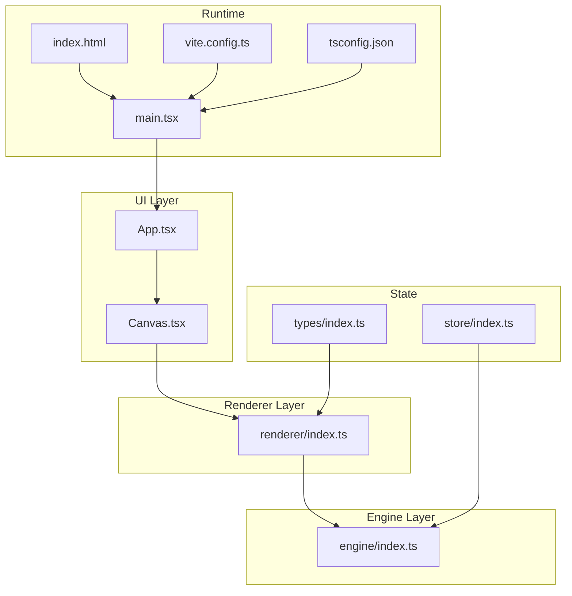
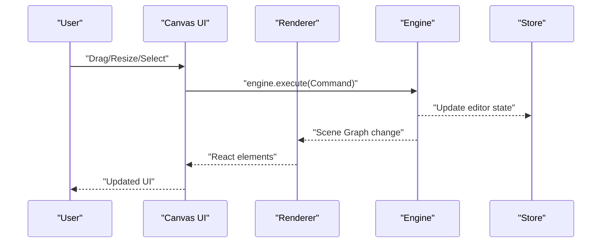
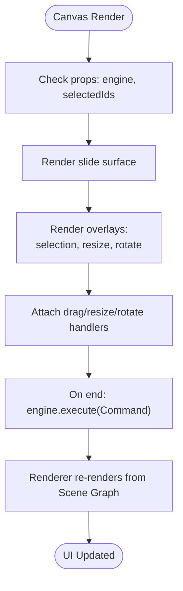
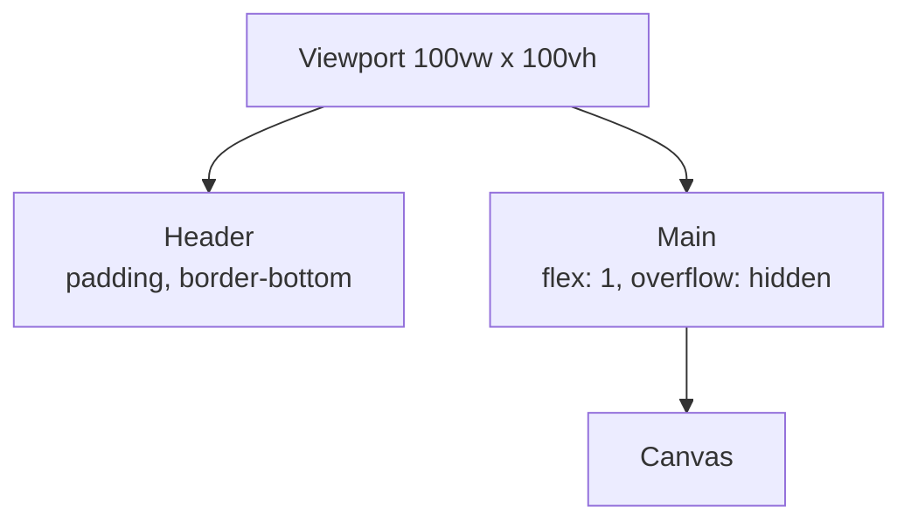
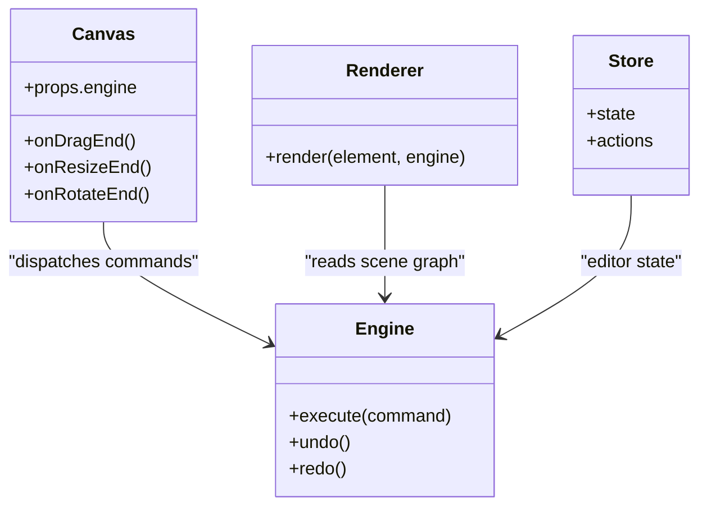
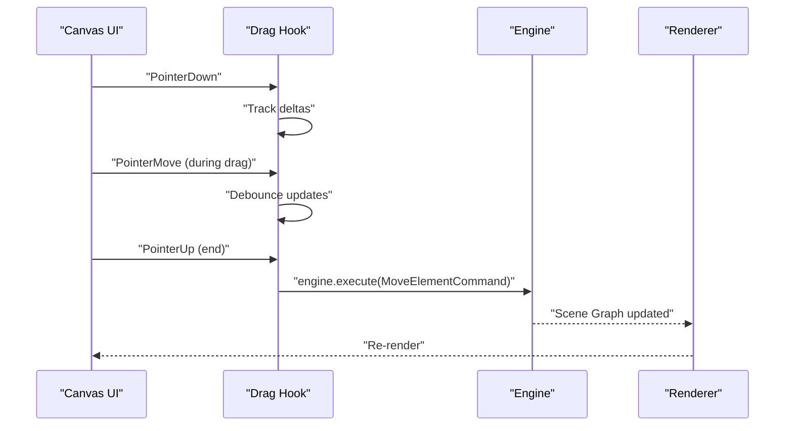
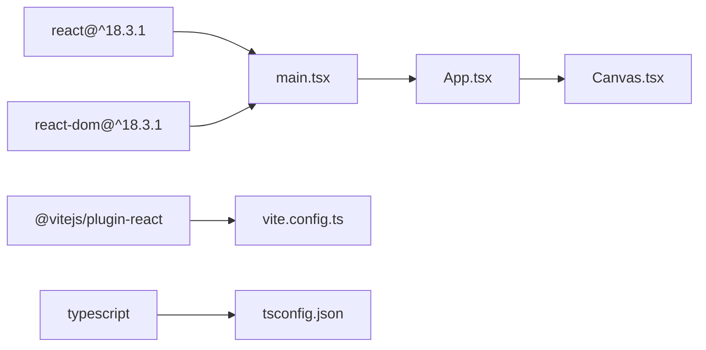

# User Interface Components

<cite>
**Referenced Files in This Document**
- [Canvas.tsx](file://src/components/Canvas.tsx)
- [App.tsx](file://src/App.tsx)
- [index.html](file://index.html)
- [main.tsx](file://src/main.tsx)
- [engine/index.ts](file://src/engine/index.ts)
- [renderer/index.ts](file://src/renderer/index.ts)
- [store/index.ts](file://src/store/index.ts)
- [types/index.ts](file://src/types/index.ts)
- [spec.md](file://spec.md)
- [spec1.md](file://spec1.md)
- [package.json](file://package.json)
- [vite.config.ts](file://vite.config.ts)
- [tsconfig.json](file://tsconfig.json)
</cite>

## Table of Contents
1. [Introduction](#introduction)
2. [Project Structure](#project-structure)
3. [Core Components](#core-components)
4. [Architecture Overview](#architecture-overview)
5. [Detailed Component Analysis](#detailed-component-analysis)
6. [Dependency Analysis](#dependency-analysis)
7. [Performance Considerations](#performance-considerations)
8. [Troubleshooting Guide](#troubleshooting-guide)
9. [Conclusion](#conclusion)
10. [Appendices](#appendices)

## Introduction
This document focuses on the User Interface Components with emphasis on the Canvas component and the overall layout structure. It explains how the Canvas serves as the central editing surface, how drag-and-drop and element manipulation will integrate with the engine system, and how the header and layout are structured. It also covers styling and theming approaches, responsive design considerations, accessibility, cross-browser compatibility, performance optimization, component composition patterns, and communication between UI components and the engine layer.

## Project Structure
The project follows a clear separation of concerns:
- UI layer: React components (App, Canvas)
- Engine layer: framework-agnostic core logic and state transitions
- Renderer layer: pure data-to-UI rendering utilities
- Store: editor state separate from scene data
- Types: shared TypeScript types
- Build and configuration: Vite, React, TypeScript

**Diagram sources**
- [App.tsx:1-17](file://src/App.tsx#L1-L17)
- [Canvas.tsx:1-40](file://src/components/Canvas.tsx#L1-L40)
- [engine/index.ts:1-3](file://src/engine/index.ts#L1-L3)
- [renderer/index.ts:1-3](file://src/renderer/index.ts#L1-L3)
- [store/index.ts:1-2](file://src/store/index.ts#L1-L2)
- [types/index.ts:1-2](file://src/types/index.ts#L1-L2)
- [index.html:1-14](file://index.html#L1-L14)
- [main.tsx:1-10](file://src/main.tsx#L1-L10)
- [vite.config.ts:1-7](file://vite.config.ts#L1-L7)
- [tsconfig.json:1-8](file://tsconfig.json#L1-L8)

**Section sources**
- [App.tsx:1-17](file://src/App.tsx#L1-L17)
- [Canvas.tsx:1-40](file://src/components/Canvas.tsx#L1-L40)
- [engine/index.ts:1-3](file://src/engine/index.ts#L1-L3)
- [renderer/index.ts:1-3](file://src/renderer/index.ts#L1-L3)
- [store/index.ts:1-2](file://src/store/index.ts#L1-L2)
- [types/index.ts:1-2](file://src/types/index.ts#L1-L2)
- [index.html:1-14](file://index.html#L1-L14)
- [main.tsx:1-10](file://src/main.tsx#L1-L10)
- [vite.config.ts:1-7](file://vite.config.ts#L1-L7)
- [tsconfig.json:1-8](file://tsconfig.json#L1-L8)

## Core Components
- Canvas: The central editing area that renders the presentation surface. It currently displays a centered placeholder and will host interactive elements and overlays for drag-and-drop, selection, and transforms.
- App: Provides the page layout with a header and a main content area that hosts the Canvas.

Key characteristics:
- Layout: Full viewport container with a header and a flex main area.
- Canvas sizing: Fixed inner content area with centered placement and subtle shadow for depth.
- Theming: Uses inline styles for simplicity; can be refactored to CSS-in-JS or CSS modules for maintainability.

**Section sources**
- [Canvas.tsx:1-40](file://src/components/Canvas.tsx#L1-L40)
- [App.tsx:1-17](file://src/App.tsx#L1-L17)

## Architecture Overview
The UI communicates with the engine through a command-driven model:
- UI triggers user actions (drag, resize, rotate, select).
- Actions are translated into Commands.
- Engine executes Commands, updating the Scene Graph and editor state.
- Renderer queries the Scene Graph and produces React elements for display.
- Store holds editor state (selection, panels, etc.) separate from scene data.

**Diagram sources**
- [renderer/index.ts:1-3](file://src/renderer/index.ts#L1-L3)
- [engine/index.ts:1-3](file://src/engine/index.ts#L1-L3)
- [store/index.ts:1-2](file://src/store/index.ts#L1-L2)
- [spec.md:393-401](file://spec.md#L393-L401)

## Detailed Component Analysis

### Canvas Component
The Canvas component defines the editing surface:
- Outer container: full-width and full-height with a light background and centered flex layout.
- Inner content area: fixed dimensions with white background and subtle shadow to simulate a slide surface.
- Centered placeholder text indicating the Canvas area.

Proposed enhancements for interactivity:
- Accept props for engine reference, selected element IDs, and overlay flags.
- Integrate selection rectangles, resize handles, and rotation grips via overlays.
- Support drag-and-drop events and transform updates that call engine.execute.

Styling and theming:
- Inline styles keep it minimal but limit reusability and theming.
- Recommended approach: extract styles to CSS modules or styled-components, exposing theme tokens for colors, shadows, and spacing.

Accessibility:
- Ensure focus management for selected elements.
- Provide keyboard shortcuts for selection and transforms.
- Announce selection and operation changes to assistive technologies.

Responsive design:
- The fixed inner content may need scaling or aspect-ratio constraints to fit various screen sizes while maintaining the intended 16:9 layout.

Integration with engine:
- On drag/resize/rotate completion, dispatch MoveElementCommand or equivalent.
- Maintain selection state via Store and reflect it in the UI.

**Diagram sources**
- [Canvas.tsx:1-40](file://src/components/Canvas.tsx#L1-L40)
- [renderer/index.ts:1-3](file://src/renderer/index.ts#L1-L3)
- [engine/index.ts:1-3](file://src/engine/index.ts#L1-L3)

**Section sources**
- [Canvas.tsx:1-40](file://src/components/Canvas.tsx#L1-L40)
- [renderer/index.ts:1-3](file://src/renderer/index.ts#L1-L3)
- [engine/index.ts:1-3](file://src/engine/index.ts#L1-L3)

### Header and Layout Structure
The App component establishes the page layout:
- Header: simple h1 with bottom border and padding.
- Main area: flex-grow container to fill remaining space, with overflow hidden to enable scrollable side panels later.

Responsiveness:
- The header remains static; the main area grows/shrinks with viewport changes.
- Consider adding max-width and centering for very wide screens.

Accessibility:
- Ensure semantic heading hierarchy and readable font sizes.
- Provide skip links if side panels are added.

**Diagram sources**
- [App.tsx:1-17](file://src/App.tsx#L1-L17)

**Section sources**
- [App.tsx:1-17](file://src/App.tsx#L1-L17)

### Engine Integration Patterns
The engine is designed to be framework-agnostic and the single source of truth:
- All state changes must go through engine.execute(command).
- Renderer is pure (data -> UI).
- Store separates editor state from scene data.

Recommended patterns:
- Use React hooks to subscribe to engine state and store updates.
- Wrap engine.execute calls in debounced or throttled handlers for smoother interactions.
- Centralize event handlers in a hook that translates UI events into Commands.

**Diagram sources**
- [engine/index.ts:1-3](file://src/engine/index.ts#L1-L3)
- [renderer/index.ts:1-3](file://src/renderer/index.ts#L1-L3)
- [store/index.ts:1-2](file://src/store/index.ts#L1-L2)
- [Canvas.tsx:1-40](file://src/components/Canvas.tsx#L1-L40)

**Section sources**
- [engine/index.ts:1-3](file://src/engine/index.ts#L1-L3)
- [renderer/index.ts:1-3](file://src/renderer/index.ts#L1-L3)
- [store/index.ts:1-2](file://src/store/index.ts#L1-L2)
- [spec.md:393-401](file://spec.md#L393-L401)

### Drag-and-Drop and Selection Mechanics
Based on the specification:
- Drag/resize/rotate should integrate with a moveable-like behavior.
- On drag end, call engine.execute(MoveElementCommand).
- Keep engine as the single source of truth.

Implementation guidance:
- Use a hook to manage drag sessions, capturing initial and final transforms.
- Normalize deltas and dispatch Commands with prev/next snapshots.
- Debounce frequent updates during drag to improve performance.

**Diagram sources**
- [spec1.md:166-181](file://spec1.md#L166-L181)
- [engine/index.ts:1-3](file://src/engine/index.ts#L1-L3)
- [renderer/index.ts:1-3](file://src/renderer/index.ts#L1-L3)

**Section sources**
- [spec1.md:166-181](file://spec1.md#L166-L181)
- [engine/index.ts:1-3](file://src/engine/index.ts#L1-L3)
- [renderer/index.ts:1-3](file://src/renderer/index.ts#L1-L3)

### Component Composition and Communication
Composition patterns:
- App composes Canvas and manages layout.
- Canvas composes Renderer and integrates with Engine and Store.
- Hooks encapsulate engine interactions and event handling.

Communication:
- Engine emits state changes; Renderer subscribes and renders.
- Store holds UI state (selection, open panels) independent of scene data.
- Types define shared contracts across layers.

**Section sources**
- [App.tsx:1-17](file://src/App.tsx#L1-L17)
- [Canvas.tsx:1-40](file://src/components/Canvas.tsx#L1-L40)
- [renderer/index.ts:1-3](file://src/renderer/index.ts#L1-L3)
- [store/index.ts:1-2](file://src/store/index.ts#L1-L2)
- [types/index.ts:1-2](file://src/types/index.ts#L1-L2)

## Dependency Analysis
External dependencies and tooling:
- React and React DOM for UI rendering.
- Vite with React plugin for dev/build.
- TypeScript for type safety.
- ESLint for linting.

**Diagram sources**
- [package.json:12-26](file://package.json#L12-L26)
- [main.tsx:1-10](file://src/main.tsx#L1-L10)
- [vite.config.ts:1-7](file://vite.config.ts#L1-L7)
- [tsconfig.json:1-8](file://tsconfig.json#L1-L8)

**Section sources**
- [package.json:12-26](file://package.json#L12-L26)
- [vite.config.ts:1-7](file://vite.config.ts#L1-L7)
- [tsconfig.json:1-8](file://tsconfig.json#L1-L8)

## Performance Considerations
- Minimize re-renders: Use memoization and selective updates in Renderer.
- Event throttling/debouncing: Apply during drag/resize to reduce engine calls.
- Virtualization: If lists grow large (nodes, layers), consider virtualized lists.
- CSS transforms: Prefer transform-based animations for GPU acceleration.
- Avoid layout thrashing: Batch DOM reads/writes.
- Lazy loading: Defer heavy assets until needed.

[No sources needed since this section provides general guidance]

## Troubleshooting Guide
Common issues and remedies:
- UI not reflecting engine changes: Verify Renderer subscribes to engine state and re-renders on updates.
- Direct DOM mutations: Ensure all edits go through engine.execute.
- Style conflicts: Extract styles from inline styles to CSS modules or styled-components.
- Accessibility regressions: Test keyboard navigation and screen reader announcements.

**Section sources**
- [renderer/index.ts:1-3](file://src/renderer/index.ts#L1-L3)
- [engine/index.ts:1-3](file://src/engine/index.ts#L1-L3)
- [spec.md:393-401](file://spec.md#L393-L401)

## Conclusion
The Canvas component is the foundation of the visual editor. By adhering to the engine-driven architecture, integrating drag-and-drop with Commands, and maintaining clean separation between UI, engine, renderer, and store, the system achieves scalability, maintainability, and a smooth user experience. Future enhancements should focus on overlay interactions, responsive scaling, accessibility, and performance optimizations.

[No sources needed since this section summarizes without analyzing specific files]

## Appendices

### Responsive Design Notes
- The current layout uses viewport units for the root container and a flex main area.
- The Canvas inner content has fixed dimensions. To improve responsiveness:
  - Use aspect-ratio or max-width constraints.
  - Scale the inner content proportionally while preserving 16:9.
  - Consider media queries or CSS container queries for adaptive layouts.

**Section sources**
- [App.tsx:1-17](file://src/App.tsx#L1-L17)
- [Canvas.tsx:1-40](file://src/components/Canvas.tsx#L1-L40)

### Accessibility Checklist
- Keyboard navigation: Ensure all interactive elements are reachable via Tab.
- Focus indicators: Visible focus rings for interactive elements.
- ARIA roles and labels: Use appropriate roles for overlays and controls.
- Screen reader support: Announce selection changes and operation feedback.
- Color contrast: Maintain sufficient contrast for text and overlays.

[No sources needed since this section provides general guidance]

### Cross-Browser Compatibility
- Use vendor prefixes sparingly; rely on PostCSS if needed.
- Test pointer events across browsers; polyfill if necessary.
- Validate CSS Grid/Flexbox usage in older browsers.
- Normalize base styles for consistent rendering.

[No sources needed since this section provides general guidance]