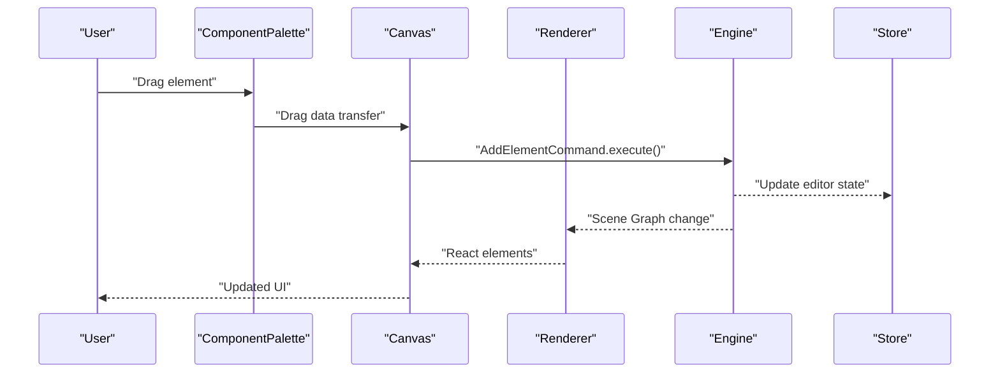
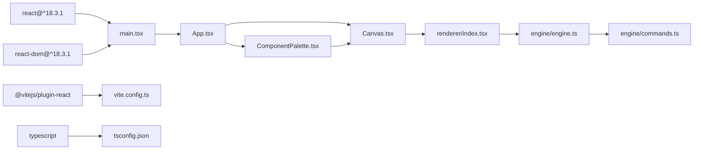

# User Interface Components

<cite>
**Referenced Files in This Document**
- [App.tsx](file://src/App.tsx)
- [Canvas.tsx](file://src/components/Canvas.tsx)
- [ComponentPalette.tsx](file://src/components/ComponentPalette.tsx)
- [main.tsx](file://src/main.tsx)
- [engine/index.ts](file://src/engine/index.ts)
- [engine/engine.ts](file://src/engine/engine.ts)
- [engine/commands.ts](file://src/engine/commands.ts)
- [renderer/index.tsx](file://src/renderer/index.tsx)
- [types/index.ts](file://src/types/index.ts)
- [store/index.ts](file://src/store/index.ts)
- [index.html](file://index.html)
- [vite.config.ts](file://vite.config.ts)
- [tsconfig.json](file://tsconfig.json)
- [package.json](file://package.json)
</cite>

## Update Summary
**Changes Made**
- Added comprehensive documentation for the new ComponentPalette component
- Updated Canvas component documentation to reflect full drag-and-drop implementation
- Enhanced architecture overview with new component interactions
- Added detailed component composition patterns
- Updated dependency analysis with new component relationships
- Expanded performance considerations for the new UI structure

## Table of Contents
1. [Introduction](#introduction)
2. [Project Structure](#project-structure)
3. [Core Components](#core-components)
4. [Architecture Overview](#architecture-overview)
5. [Detailed Component Analysis](#detailed-component-analysis)
6. [Dependency Analysis](#dependency-analysis)
7. [Performance Considerations](#performance-considerations)
8. [Troubleshooting Guide](#troubleshooting-guide)
9. [Conclusion](#conclusion)
10. [Appendices](#appendices)

## Introduction
This document focuses on the User Interface Components with emphasis on the Canvas component, ComponentPalette, and the overall layout structure. It explains how the Canvas serves as the central editing surface with full drag-and-drop capabilities, how the ComponentPalette provides element creation tools, and how these components integrate with the engine system. The document covers styling and theming approaches, responsive design considerations, accessibility, cross-browser compatibility, performance optimization, component composition patterns, and communication between UI components and the engine layer.

## Project Structure
The project follows a clear separation of concerns with new React-based UI components:
- UI layer: React components (App, Canvas, ComponentPalette)
- Engine layer: framework-agnostic core logic and state transitions
- Renderer layer: pure data-to-UI rendering utilities
- Store: editor state separate from scene data
- Types: shared TypeScript types
- Build and configuration: Vite, React, TypeScript

```mermaid
graph TB
subgraph "UI Layer"
APP["App.tsx"]
CANVAS["Canvas.tsx"]
PALETTE["ComponentPalette.tsx"]
end
subgraph "Engine Layer"
ENGINE["engine/index.ts"]
ENGINE_CLASS["engine/engine.ts"]
COMMANDS["engine/commands.ts"]
end
subgraph "Renderer Layer"
RENDERER["renderer/index.tsx"]
end
subgraph "State"
STORE["store/index.ts"]
TYPES["types/index.ts"]
END
subgraph "Runtime"
HTML["index.html"]
MAIN["main.tsx"]
CONFIG["vite.config.ts"]
TSCONFIG["tsconfig.json"]
END
APP --> PALETTE
APP --> CANVAS
CANVAS --> RENDERER
PALETTE --> CANVAS
RENDERER --> ENGINE_CLASS
ENGINE_CLASS --> COMMANDS
STORE --> ENGINE_CLASS
TYPES --> RENDERER
MAIN --> APP
HTML --> MAIN
CONFIG --> MAIN
TSCONFIG --> MAIN
```

**Diagram sources**
- [App.tsx:1-41](file://src/App.tsx#L1-L41)
- [Canvas.tsx:1-169](file://src/components/Canvas.tsx#L1-L169)
- [ComponentPalette.tsx:1-68](file://src/components/ComponentPalette.tsx#L1-L68)
- [engine/index.ts:1-9](file://src/engine/index.ts#L1-L9)
- [engine/engine.ts:1-54](file://src/engine/engine.ts#L1-L54)
- [engine/commands.ts:1-67](file://src/engine/commands.ts#L1-L67)
- [renderer/index.tsx:1-135](file://src/renderer/index.tsx#L1-L135)
- [store/index.ts:1-2](file://src/store/index.ts#L1-L2)
- [types/index.ts:1-238](file://src/types/index.ts#L1-L238)
- [index.html:1-14](file://index.html#L1-L14)
- [main.tsx:1-10](file://src/main.tsx#L1-L10)
- [vite.config.ts:1-7](file://vite.config.ts#L1-L7)
- [tsconfig.json:1-8](file://tsconfig.json#L1-L8)

**Section sources**
- [App.tsx:1-41](file://src/App.tsx#L1-L41)
- [Canvas.tsx:1-169](file://src/components/Canvas.tsx#L1-L169)
- [ComponentPalette.tsx:1-68](file://src/components/ComponentPalette.tsx#L1-L68)
- [engine/index.ts:1-9](file://src/engine/index.ts#L1-L9)
- [renderer/index.tsx:1-135](file://src/renderer/index.tsx#L1-L135)
- [store/index.ts:1-2](file://src/store/index.ts#L1-L2)
- [types/index.ts:1-238](file://src/types/index.ts#L1-L238)
- [index.html:1-14](file://index.html#L1-L14)
- [main.tsx:1-10](file://src/main.tsx#L1-L10)
- [vite.config.ts:1-7](file://vite.config.ts#L1-L7)
- [tsconfig.json:1-8](file://tsconfig.json#L1-L8)

## Core Components
- **Canvas**: The central editing area that renders the presentation surface with full drag-and-drop support for creating elements from the palette.
- **ComponentPalette**: Sidebar component providing draggable element creation tools (shapes, text, images) with visual icons and labels.
- **App**: Main application component that orchestrates layout with header, sidebar palette, and canvas area.

Key characteristics:
- **Layout**: Full viewport container with responsive two-column layout (palette + canvas).
- **Canvas sizing**: Fixed 16:9 aspect ratio slide surface with centered positioning and subtle shadow.
- **Palette**: Fixed width sidebar with draggable items and hover effects.
- **Theming**: Uses inline styles for simplicity; can be refactored to CSS-in-JS or CSS modules for maintainability.

**Section sources**
- [Canvas.tsx:1-169](file://src/components/Canvas.tsx#L1-L169)
- [ComponentPalette.tsx:1-68](file://src/components/ComponentPalette.tsx#L1-L68)
- [App.tsx:1-41](file://src/App.tsx#L1-L41)

## Architecture Overview
The UI communicates with the engine through a command-driven model with enhanced component interactions:
- UI triggers user actions (drag, drop, click, select).
- Actions are translated into Commands and executed through the Engine.
- Engine updates the Scene Graph and editor state.
- Renderer queries the Scene Graph and produces React elements for display.
- Store holds editor state (selection, panels, viewport) separate from scene data.



**Diagram sources**
- [ComponentPalette.tsx:18-67](file://src/components/ComponentPalette.tsx#L18-L67)
- [Canvas.tsx:31-56](file://src/components/Canvas.tsx#L31-L56)
- [engine/commands.ts:4-18](file://src/engine/commands.ts#L4-L18)
- [engine/engine.ts:29-32](file://src/engine/engine.ts#L29-L32)
- [renderer/index.tsx:121-134](file://src/renderer/index.tsx#L121-L134)
- [types/index.ts:115-120](file://src/types/index.ts#L115-L120)

## Detailed Component Analysis

### Canvas Component
The Canvas component defines the central editing surface with comprehensive drag-and-drop functionality:
- **Outer container**: Full-width and full-height with light gray background and centered flex layout.
- **Inner slide surface**: Fixed 960x540 dimensions (16:9 aspect ratio) with configurable background and subtle shadow.
- **Element rendering**: Maps through all slide elements and renders them using the Renderer.
- **Selection handling**: Supports element click selection and canvas click deselection.
- **Drag-and-drop**: Handles external drag data and creates new elements via AddElementCommand.

**Enhanced Features**:
- **Drag detection**: Prevents default drag behavior and sets drop effect to copy.
- **Drop processing**: Parses JSON drag data, calculates drop coordinates, and creates appropriate element types.
- **Selection management**: Updates editor state with newly created element selection.
- **Refresh mechanism**: Calls onRefresh callback to trigger re-render cycle.

**Section sources**
- [Canvas.tsx:18-106](file://src/components/Canvas.tsx#L18-L106)
- [Canvas.tsx:108-168](file://src/components/Canvas.tsx#L108-L168)
- [engine/commands.ts:4-18](file://src/engine/commands.ts#L4-L18)

### ComponentPalette Component
The ComponentPalette provides the element creation interface:
- **Sidebar layout**: Fixed 200px width with right border and light gray background.
- **Palette items**: Five draggable elements (rectangle, circle, triangle, text, image) with visual icons.
- **Drag handling**: Serializes element type and shape type to JSON for drag data transfer.
- **Visual design**: Clean card-based layout with hover effects and consistent spacing.

**Palette Items**:
- **Shapes**: Rectangle (□), Circle (○), Triangle (△) with shapeType metadata.
- **Text**: Simple text element creation.
- **Image**: Image element with placeholder URL.

**Section sources**
- [ComponentPalette.tsx:18-67](file://src/components/ComponentPalette.tsx#L18-L67)
- [types/index.ts:24-45](file://src/types/index.ts#L24-L45)

### App Component and Layout Structure
The App component establishes the main application layout:
- **Header**: Contains title "Slides Editor" and element count display with bottom border and padding.
- **Main area**: Two-column flex layout with ComponentPalette on left and Canvas on right.
- **Responsive design**: Flexible column layout that adapts to different screen sizes.
- **State management**: Creates engine instance with mock document and provides refresh callback.

**Layout Features**:
- **Header styling**: White background with subtle border and flex alignment.
- **Element counter**: Dynamic count of elements on current slide.
- **Column layout**: Automatic height distribution with overflow handling.

**Section sources**
- [App.tsx:7-38](file://src/App.tsx#L7-L38)
- [types/index.ts:126-205](file://src/types/index.ts#L126-L205)

### Engine Integration Patterns
The engine maintains its framework-agnostic design while supporting the new UI components:
- **Command execution**: All state changes go through engine.execute(command).
- **State management**: Separate editor state from scene data with get/set methods.
- **History tracking**: Built-in undo/redo functionality through History class.
- **Mock data**: Comprehensive mock document and editor state for development.

**Command System**:
- **AddElementCommand**: Creates new elements on slide.
- **MoveElementCommand**: Updates element properties with undo support.
- **DeleteElementCommand**: Removes elements with undo capability.

**Section sources**
- [engine/engine.ts:7-49](file://src/engine/engine.ts#L7-L49)
- [engine/commands.ts:4-66](file://src/engine/commands.ts#L4-L66)
- [types/index.ts:78-81](file://src/types/index.ts#L78-L81)

### Renderer Integration
The renderer provides pure data-to-UI conversion with enhanced selection handling:
- **Element rendering**: Switch-based rendering for shapes, text, and images.
- **Selection outlines**: Visual selection indicators with blue borders.
- **Event propagation**: Proper event handling with stopPropagation for element clicks.
- **Style composition**: Base styles with element-specific overrides.

**Rendering Features**:
- **Shape rendering**: Supports rectangle, circle, and triangle with CSS properties.
- **Text rendering**: Flexible alignment with flexbox and word wrapping.
- **Image rendering**: Object fit control and accessibility attributes.
- **Selection visualization**: Absolute positioned outline around selected elements.

**Section sources**
- [renderer/index.tsx:24-134](file://src/renderer/index.tsx#L24-L134)
- [types/index.ts:24-45](file://src/types/index.ts#L24-L45)

### Drag-and-Drop and Selection Mechanics
Enhanced drag-and-drop implementation with comprehensive element creation:
- **Palette drag**: Serializes element type and shape metadata to JSON.
- **Canvas drop**: Processes drag data, calculates coordinates, and creates elements.
- **Selection management**: Updates editor state and triggers re-render.
- **Coordinate calculation**: Converts mouse coordinates to slide-relative positions.

**Implementation Details**:
- **Data transfer**: Uses application/json MIME type for reliable data transport.
- **Error handling**: JSON parsing validation and coordinate bounds checking.
- **Element creation**: Factory function generates appropriate element types with defaults.

**Section sources**
- [ComponentPalette.tsx:19-26](file://src/components/ComponentPalette.tsx#L19-L26)
- [Canvas.tsx:31-56](file://src/components/Canvas.tsx#L31-L56)
- [Canvas.tsx:108-168](file://src/components/Canvas.tsx#L108-L168)

## Dependency Analysis
External dependencies and tooling with new component relationships:
- **React and React DOM**: Core UI rendering with strict mode enabled.
- **Vite with React plugin**: Development server and build tooling.
- **TypeScript**: Type safety across all components and engine modules.
- **ESLint**: Code quality and consistency enforcement.



**Diagram sources**
- [package.json:12-26](file://package.json#L12-L26)
- [main.tsx:1-10](file://src/main.tsx#L1-L10)
- [vite.config.ts:1-7](file://vite.config.ts#L1-L7)
- [tsconfig.json:1-8](file://tsconfig.json#L1-L8)

**Section sources**
- [package.json:12-26](file://package.json#L12-L26)
- [vite.config.ts:1-7](file://vite.config.ts#L1-L7)
- [tsconfig.json:1-8](file://tsconfig.json#L1-L8)

## Performance Considerations
Enhanced performance strategies for the new component architecture:
- **Minimal re-renders**: Use React.memo for frequently rendered elements.
- **Event delegation**: Handle events at component level to minimize handler overhead.
- **Drag optimization**: Debounce frequent drag events and batch coordinate calculations.
- **Virtualization**: Consider virtualized lists for large element collections.
- **CSS transforms**: Prefer transform-based animations for GPU acceleration.
- **Memory management**: Proper cleanup of drag event listeners and references.
- **Lazy loading**: Defer heavy assets until needed in the rendering pipeline.

**Component-specific optimizations**:
- **Canvas**: Efficient element mapping and conditional rendering.
- **Palette**: Static item rendering with optimized drag handlers.
- **Renderer**: Memoized style calculations and efficient DOM updates.

## Troubleshooting Guide
Common issues and remedies for the new component system:
- **UI not reflecting engine changes**: Verify Renderer subscribes to engine state and re-renders on updates.
- **Drag-and-drop failures**: Check data transfer format and ensure proper JSON serialization.
- **Element positioning errors**: Validate coordinate calculations and slide boundary checks.
- **Selection state inconsistencies**: Ensure editor state updates are properly triggered.
- **Direct DOM mutations**: Ensure all edits go through engine.execute with proper commands.
- **Style conflicts**: Extract styles from inline styles to CSS modules or styled-components.
- **Accessibility regressions**: Test keyboard navigation and screen reader announcements.

**Section sources**
- [renderer/index.tsx:121-134](file://src/renderer/index.tsx#L121-L134)
- [engine/engine.ts:29-32](file://src/engine/engine.ts#L29-L32)
- [Canvas.tsx:31-56](file://src/components/Canvas.tsx#L31-L56)

## Conclusion
The new React-based UI components provide a robust foundation for the visual editor. The Canvas component with full drag-and-drop support, combined with the ComponentPalette sidebar, creates an intuitive element creation workflow. By adhering to the engine-driven architecture, maintaining clean separation between UI, engine, renderer, and store, and implementing proper performance optimizations, the system achieves scalability, maintainability, and a smooth user experience. Future enhancements should focus on advanced selection mechanics, animation support, accessibility improvements, and performance optimizations for complex presentations.

## Appendices

### Responsive Design Notes
- **Current layout**: Fixed 16:9 aspect ratio for slide surface with flexible sidebar.
- **Component adaptation**: Canvas and palette adapt to viewport changes while maintaining proportions.
- **Future enhancements**: Consider aspect-ratio constraints and responsive breakpoints for different screen sizes.

**Section sources**
- [Canvas.tsx:85-95](file://src/components/Canvas.tsx#L85-L95)
- [ComponentPalette.tsx:29-41](file://src/components/ComponentPalette.tsx#L29-L41)
- [App.tsx:32-36](file://src/App.tsx#L32-L36)

### Accessibility Checklist
- **Keyboard navigation**: Ensure all interactive elements are reachable via Tab.
- **Focus indicators**: Visible focus rings for interactive elements including palette items.
- **Screen reader support**: Provide meaningful labels for draggable elements and actions.
- **Color contrast**: Maintain sufficient contrast for text, backgrounds, and selection indicators.
- **Drag accessibility**: Consider keyboard alternatives for drag-and-drop functionality.

### Cross-Browser Compatibility
- **Drag-and-drop**: Test across modern browsers with fallbacks for older implementations.
- **CSS properties**: Use vendor prefixes sparingly; rely on PostCSS for autoprefixing.
- **Event handling**: Ensure consistent event behavior across different browser environments.
- **TypeScript compilation**: Verify transpilation targets for desired browser support.