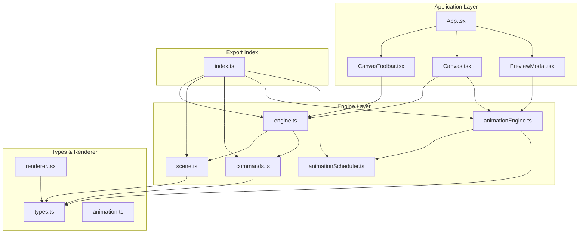
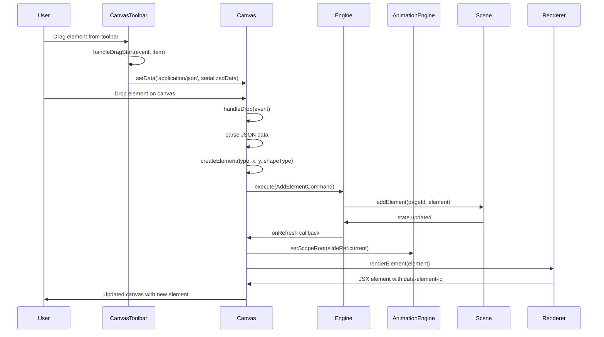
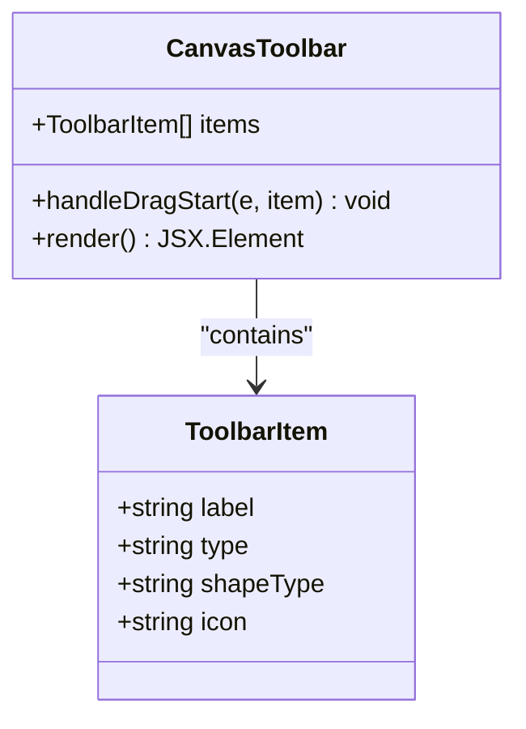
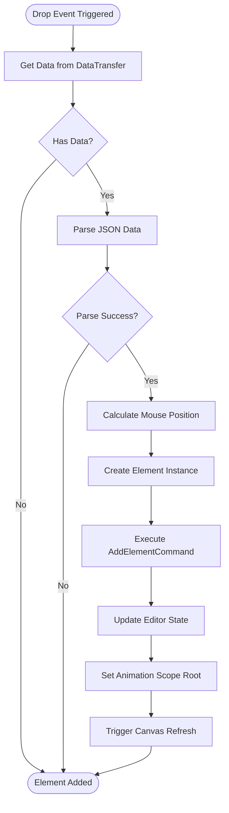
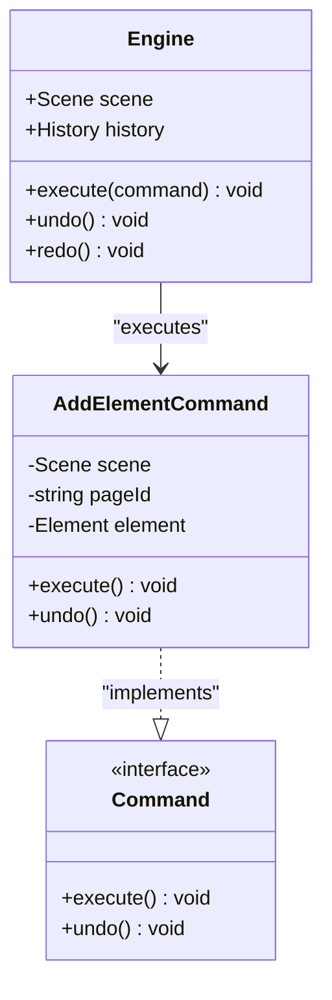
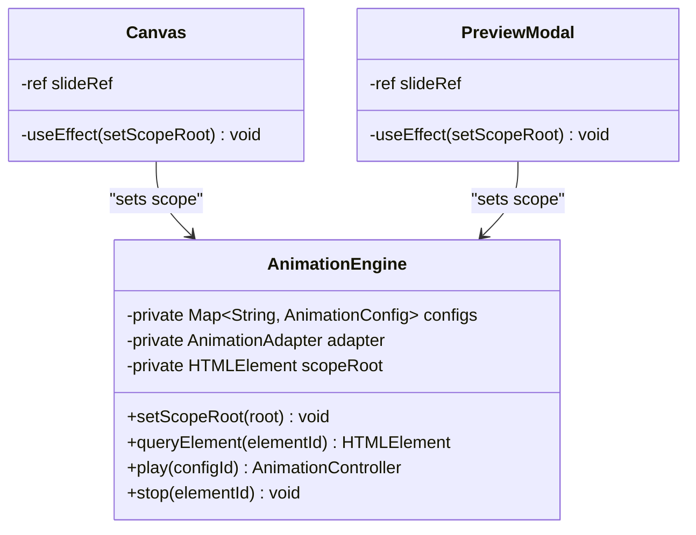
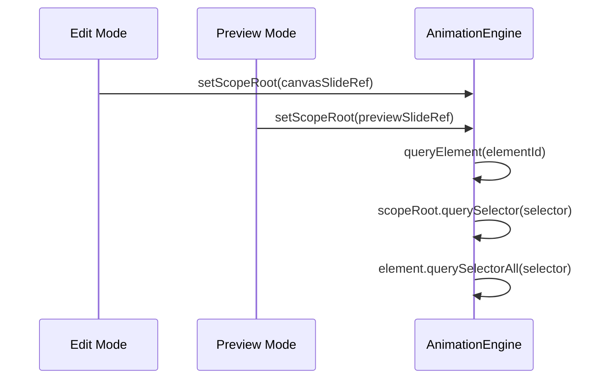
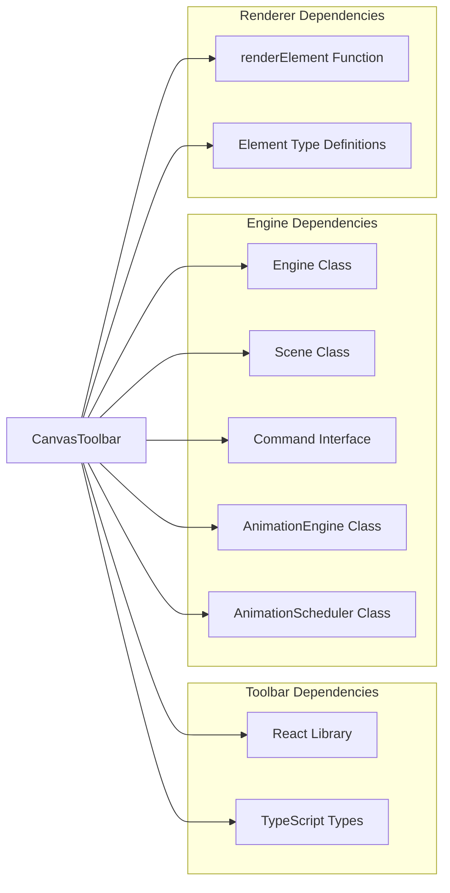

# Canvas Toolbar Component

<cite>
**Referenced Files in This Document**
- [CanvasToolbar.tsx](file://src/components/CanvasToolbar.tsx)
- [Canvas.tsx](file://src/components/Canvas.tsx)
- [App.tsx](file://src/App.tsx)
- [commands.ts](file://src/engine/commands.ts)
- [engine.ts](file://src/engine/engine.ts)
- [scene.ts](file://src/engine/scene.ts)
- [index.ts](file://src/engine/index.ts)
- [types.ts](file://src/types/index.ts)
- [animation.ts](file://src/types/animation.ts)
- [renderer.tsx](file://src/renderer/index.tsx)
- [animationEngine.ts](file://src/animation/engine.ts)
- [animationScheduler.ts](file://src/animation/scheduler.ts)
- [PreviewModal.tsx](file://src/components/PreviewModal.tsx)
</cite>

## Update Summary
**Changes Made**
- Enhanced Canvas component with animation DOM scoping for proper element targeting
- Added animation engine scope management for preview mode functionality
- Updated architecture overview to include DOM scoping mechanism
- Added new section on animation DOM scoping implementation
- Updated troubleshooting guide with animation-related issues

## Table of Contents
1. [Introduction](#introduction)
2. [Project Structure](#project-structure)
3. [Core Components](#core-components)
4. [Architecture Overview](#architecture-overview)
5. [Detailed Component Analysis](#detailed-component-analysis)
6. [Animation DOM Scoping Enhancement](#animation-dom-scoping-enhancement)
7. [Dependency Analysis](#dependency-analysis)
8. [Performance Considerations](#performance-considerations)
9. [Troubleshooting Guide](#troubleshooting-guide)
10. [Conclusion](#conclusion)

## Introduction

The Canvas Toolbar Component is a crucial part of the AI Editor Engine, providing drag-and-drop functionality for adding various element types to the canvas. This component enables users to quickly add shapes, text, and images to their presentations through intuitive drag-and-drop interactions.

The toolbar serves as the primary interface for element creation, leveraging HTML5 drag-and-drop APIs combined with React's event handling to create a seamless user experience. It integrates tightly with the engine's command pattern architecture, ensuring all element additions are properly tracked in the application's history system.

**Enhanced** The Canvas component now includes advanced animation DOM scoping capabilities that ensure proper element targeting during preview mode, preventing animations from affecting elements outside the intended container.

## Project Structure

The Canvas Toolbar Component is part of a larger React-based editor application with a well-organized architecture:

**Diagram sources**
- [App.tsx:11-338](file://src/App.tsx#L11-L338)
- [CanvasToolbar.tsx:18-66](file://src/components/CanvasToolbar.tsx#L18-L66)
- [Canvas.tsx:22-182](file://src/components/Canvas.tsx#L22-L182)
- [PreviewModal.tsx:13-355](file://src/components/PreviewModal.tsx#L13-L355)
- [animationEngine.ts:9-120](file://src/animation/engine.ts#L9-L120)
- [animationScheduler.ts:56-160](file://src/animation/scheduler.ts#L56-L160)

**Section sources**
- [App.tsx:11-338](file://src/App.tsx#L11-L338)
- [CanvasToolbar.tsx:18-66](file://src/components/CanvasToolbar.tsx#L18-L66)
- [Canvas.tsx:22-182](file://src/components/Canvas.tsx#L22-L182)
- [PreviewModal.tsx:13-355](file://src/components/PreviewModal.tsx#L13-L355)

## Core Components

The Canvas Toolbar Component consists of several key elements working together to provide the drag-and-drop functionality:

### Toolbar Item Definition
Each toolbar item represents a specific element type with associated metadata:
- **Label**: Human-readable name displayed in the toolbar
- **Type**: Element type identifier (shape, text, image)
- **Shape Type**: Specific shape variant (rectangle, circle, triangle)
- **Icon**: Visual representation using Unicode characters

### Drag-and-Drop Implementation
The component implements HTML5 drag-and-drop events:
- **dragStart**: Serializes element data to JSON format
- **dragOver**: Prevents default browser behavior during drag operations
- **drop**: Handles element placement on the canvas

### Integration Points
The toolbar seamlessly integrates with:
- React's event system for drag operations
- The engine's command pattern for state management
- The renderer system for element visualization

**Section sources**
- [CanvasToolbar.tsx:3-16](file://src/components/CanvasToolbar.tsx#L3-L16)
- [CanvasToolbar.tsx:18-66](file://src/components/CanvasToolbar.tsx#L18-L66)
- [Canvas.tsx:30-60](file://src/components/Canvas.tsx#L30-L60)

## Architecture Overview

The Canvas Toolbar follows a layered architecture pattern that separates concerns effectively:

**Diagram sources**
- [CanvasToolbar.tsx:18-26](file://src/components/CanvasToolbar.tsx#L18-L26)
- [Canvas.tsx:35-59](file://src/components/Canvas.tsx#L35-L59)
- [Canvas.tsx:25-32](file://src/components/Canvas.tsx#L25-L32)
- [commands.ts:4-18](file://src/engine/commands.ts#L4-L18)
- [engine.ts:29-32](file://src/engine/engine.ts#L29-L32)

The architecture demonstrates several key principles:

1. **Command Pattern**: All state changes go through the engine's execute method
2. **Separation of Concerns**: Toolbar handles UI interactions, Engine manages state
3. **Event-Driven Design**: Uses React events and HTML5 drag-and-drop APIs
4. **Immutable Data Flow**: Updates flow through the command system
5. **Animation DOM Scoping**: AnimationEngine uses scoped DOM queries for proper targeting

## Detailed Component Analysis

### CanvasToolbar Component

The CanvasToolbar component is a functional React component that provides the drag-and-drop interface:

#### Component Structure

**Diagram sources**
- [CanvasToolbar.tsx:3-16](file://src/components/CanvasToolbar.tsx#L3-L16)
- [CanvasToolbar.tsx:18-66](file://src/components/CanvasToolbar.tsx#L18-L66)

#### Drag-and-Drop Event Handling
The component implements sophisticated drag-and-drop functionality:

1. **Data Serialization**: Converts element metadata to JSON format
2. **Event Prevention**: Manages drag operation lifecycle
3. **Visual Feedback**: Provides cursor and styling feedback

#### Element Types Supported
The toolbar supports three primary element types:

| Element Type | Shape Type | Icon | Purpose |
|--------------|------------|------|---------|
| Shape | Rectangle | □ | Geometric shapes |
| Shape | Circle | ○ | Circular elements |
| Shape | Triangle | △ | Triangular shapes |
| Text | N/A | T | Text content |
| Image | N/A | 🖼 | Image assets |

**Section sources**
- [CanvasToolbar.tsx:10-16](file://src/components/CanvasToolbar.tsx#L10-L16)
- [CanvasToolbar.tsx:18-26](file://src/components/CanvasToolbar.tsx#L18-L26)

### Canvas Integration

The Canvas component serves as the drop zone for toolbar elements and now includes animation DOM scoping:

#### Drop Zone Implementation

**Diagram sources**
- [Canvas.tsx:35-59](file://src/components/Canvas.tsx#L35-L59)
- [Canvas.tsx:121-181](file://src/components/Canvas.tsx#L121-L181)
- [Canvas.tsx:25-32](file://src/components/Canvas.tsx#L25-L32)

#### Element Creation Logic
The Canvas component handles element creation based on toolbar data:

1. **Position Calculation**: Converts mouse coordinates to canvas-relative positions
2. **Element Factory**: Creates appropriate element instances based on type
3. **Command Execution**: Uses the engine's command system for state changes
4. **Animation Scope Setup**: Configures DOM scoping for animation targeting

**Section sources**
- [Canvas.tsx:35-59](file://src/components/Canvas.tsx#L35-L59)
- [Canvas.tsx:121-181](file://src/components/Canvas.tsx#L121-L181)
- [Canvas.tsx:25-32](file://src/components/Canvas.tsx#L25-L32)

### Engine Integration

The toolbar's functionality relies heavily on the Engine's command pattern:

#### Command Pattern Implementation

**Diagram sources**
- [engine.ts:7-49](file://src/engine/engine.ts#L7-L49)
- [commands.ts:4-18](file://src/engine/commands.ts#L4-L18)

#### State Management Flow
The integration ensures proper state management through the command pattern:

1. **Command Creation**: Canvas creates AddElementCommand with element data
2. **Execution**: Engine.execute() runs the command
3. **History Tracking**: Command is pushed to history stack
4. **UI Refresh**: Callback triggers canvas re-rendering

**Section sources**
- [engine.ts:29-32](file://src/engine/engine.ts#L29-L32)
- [commands.ts:4-18](file://src/engine/commands.ts#L4-L18)

## Animation DOM Scoping Enhancement

**New Section** The Canvas component now includes sophisticated animation DOM scoping capabilities that ensure proper element targeting during preview mode and prevent animations from affecting unintended elements.

### DOM Scoping Mechanism

The animation DOM scoping system works through several key components:

#### AnimationEngine Scope Management
The AnimationEngine maintains a scope root that restricts DOM element queries:

**Diagram sources**
- [animationEngine.ts:9-120](file://src/animation/engine.ts#L9-L120)
- [Canvas.tsx:25-32](file://src/components/Canvas.tsx#L25-L32)
- [PreviewModal.tsx:92-140](file://src/components/PreviewModal.tsx#L92-L140)

#### Scope Root Implementation
The scope root mechanism ensures DOM queries are restricted to specific containers:

1. **Edit Mode**: AnimationEngine.setScopeRoot(slideRef.current) scopes queries to the main canvas
2. **Preview Mode**: AnimationEngine.setScopeRoot(slideRef.current) scopes queries to the preview modal
3. **Cleanup**: AnimationEngine.setScopeRoot(null) clears scoping when components unmount

#### Element Targeting Strategy
Elements are uniquely identified using data attributes for precise targeting:

**Diagram sources**
- [animationEngine.ts:24-30](file://src/animation/engine.ts#L24-L30)
- [renderer.tsx:78](file://src/renderer/index.tsx#L78)
- [renderer.tsx:113](file://src/renderer/index.tsx#L113)
- [renderer.tsx:137](file://src/renderer/index.tsx#L137)

#### Data Attribute Implementation
The renderer system adds data-element-id attributes to all elements for proper targeting:

| Element Type | Data Attribute | Purpose |
|--------------|----------------|---------|
| Shape | data-element-id | Identifies SVG shape elements |
| Text | data-element-id | Identifies text container elements |
| Image | data-element-id | Identifies image container elements |

**Section sources**
- [Canvas.tsx:25-32](file://src/components/Canvas.tsx#L25-L32)
- [PreviewModal.tsx:92-140](file://src/components/PreviewModal.tsx#L92-L140)
- [animationEngine.ts:12-30](file://src/animation/engine.ts#L12-L30)
- [renderer.tsx:78](file://src/renderer/index.tsx#L78)
- [renderer.tsx:113](file://src/renderer/index.tsx#L113)
- [renderer.tsx:137](file://src/renderer/index.tsx#L137)

## Dependency Analysis

The Canvas Toolbar Component has well-defined dependencies that support its functionality:

**Diagram sources**
- [CanvasToolbar.tsx:1-8](file://src/components/CanvasToolbar.tsx#L1-L8)
- [Canvas.tsx:1-8](file://src/components/Canvas.tsx#L1-L8)
- [engine.ts:1-6](file://src/engine/engine.ts#L1-L6)
- [types.ts:1-54](file://src/types/index.ts#L1-L54)
- [animationEngine.ts:1-4](file://src/animation/engine.ts#L1-L4)
- [animationScheduler.ts:1-3](file://src/animation/scheduler.ts#L1-L3)

### External Dependencies
The component relies on minimal external dependencies:
- **React**: For component rendering and event handling
- **TypeScript Types**: For type safety and development experience

### Internal Dependencies
The component integrates with several internal systems:
- **Engine**: For state management and command execution
- **Scene**: For document manipulation
- **AnimationEngine**: For animation scoping and DOM targeting
- **AnimationScheduler**: For preview mode animation playback
- **Renderer**: For element visualization with data attributes
- **Types**: For type definitions and validation

**Section sources**
- [CanvasToolbar.tsx:1-8](file://src/components/CanvasToolbar.tsx#L1-L8)
- [Canvas.tsx:1-8](file://src/components/Canvas.tsx#L1-L8)
- [engine.ts:1-6](file://src/engine/engine.ts#L1-L6)
- [animationEngine.ts:1-4](file://src/animation/engine.ts#L1-L4)
- [animationScheduler.ts:1-3](file://src/animation/scheduler.ts#L1-L3)

## Performance Considerations

The Canvas Toolbar Component is designed for optimal performance through several mechanisms:

### Efficient Rendering
- **Minimal DOM Updates**: Toolbar items are rendered once and reused
- **Event Delegation**: Drag events are handled efficiently through React's synthetic events
- **Lightweight Components**: Simple functional components with minimal state

### Memory Management
- **Proper Cleanup**: Event listeners are managed through React's lifecycle
- **Reference Management**: Elements are created with unique identifiers
- **Garbage Collection**: Temporary objects are eligible for garbage collection

### Drag-and-Drop Optimization
- **Efficient Data Transfer**: JSON serialization is lightweight and fast
- **Immediate Feedback**: Visual feedback is provided without blocking operations
- **Event Prevention**: Prevents unnecessary browser default behaviors

### Animation DOM Scoping Performance
- **Scoped Queries**: DOM queries are limited to specific containers
- **Efficient Element Lookup**: Uses data-element-id attributes for fast targeting
- **Memory Cleanup**: Scope roots are properly cleared when components unmount

## Troubleshooting Guide

Common issues and their solutions when working with the Canvas Toolbar Component:

### Drag Events Not Working
**Symptoms**: Elements cannot be dragged from toolbar
**Causes**: 
- Missing `draggable` attribute on toolbar items
- Incorrect event handler attachment
- Browser security restrictions

**Solutions**:
- Verify `draggable` attribute is present on toolbar items
- Check event handler registration in component
- Ensure browser supports HTML5 drag-and-drop

### Drop Events Not Triggered
**Symptoms**: Elements cannot be dropped onto canvas
**Causes**:
- Missing `onDragOver` and `onDrop` handlers
- Incorrect data transfer format
- Canvas not configured as drop zone

**Solutions**:
- Implement `onDragOver` and `onDrop` handlers on canvas
- Verify JSON data format matches expected structure
- Ensure canvas has proper event handling

### Element Creation Failures
**Symptoms**: Elements appear but are not added to document
**Causes**:
- Command execution errors
- Scene state inconsistencies
- Missing element properties

**Solutions**:
- Check command execution logs
- Verify scene state before command execution
- Ensure all required element properties are provided

### Animation Targeting Issues
**Symptoms**: Animations affect wrong elements or fail to target elements
**Causes**:
- Missing data-element-id attributes on elements
- Incorrect animation configuration
- Scope root not properly set for preview mode

**Solutions**:
- Verify renderer adds data-element-id attributes to all elements
- Check animation configuration references correct element IDs
- Ensure AnimationEngine.setScopeRoot() is called with correct container reference
- Verify scope root is cleared when components unmount

### Performance Issues
**Symptoms**: Slow response to drag operations or animation playback
**Causes**:
- Excessive re-renders
- Heavy event handlers
- Large DOM trees
- Inefficient DOM queries

**Solutions**:
- Optimize event handler implementations
- Use React.memo for expensive components
- Minimize DOM tree depth
- Ensure DOM scoping prevents unnecessary element searches

**Section sources**
- [CanvasToolbar.tsx:18-26](file://src/components/CanvasToolbar.tsx#L18-L26)
- [Canvas.tsx:30-60](file://src/components/Canvas.tsx#L30-L60)
- [commands.ts:4-18](file://src/engine/commands.ts#L4-L18)
- [animationEngine.ts:19-30](file://src/animation/engine.ts#L19-L30)
- [renderer.tsx:78](file://src/renderer/index.tsx#L78)

## Conclusion

The Canvas Toolbar Component represents a well-designed solution for drag-and-drop element creation in the AI Editor Engine. Its architecture demonstrates excellent separation of concerns, with clear boundaries between UI presentation, state management, and data persistence.

The component successfully integrates with the broader application ecosystem through the engine's command pattern, ensuring all user interactions are properly tracked and reversible. The use of React's event system combined with HTML5 drag-and-drop APIs provides a smooth and responsive user experience.

**Enhanced** The recent addition of animation DOM scoping capabilities significantly improves the component's reliability and precision during preview mode. The scope root mechanism ensures animations target only elements within their intended containers, preventing conflicts between edit mode and preview mode animations.

Key strengths of the implementation include:
- Clean separation between toolbar and canvas functionality
- Robust command pattern integration for state management
- Efficient event handling and memory management
- Extensible design supporting future element types
- Advanced animation DOM scoping for precise element targeting
- Proper cleanup mechanisms for animation scope management

The component serves as a foundation for the editor's interactive capabilities while maintaining performance and usability standards essential for a professional editing application. The animation DOM scoping enhancement makes it particularly robust for complex scenarios involving multiple preview sessions and animation-heavy presentations.