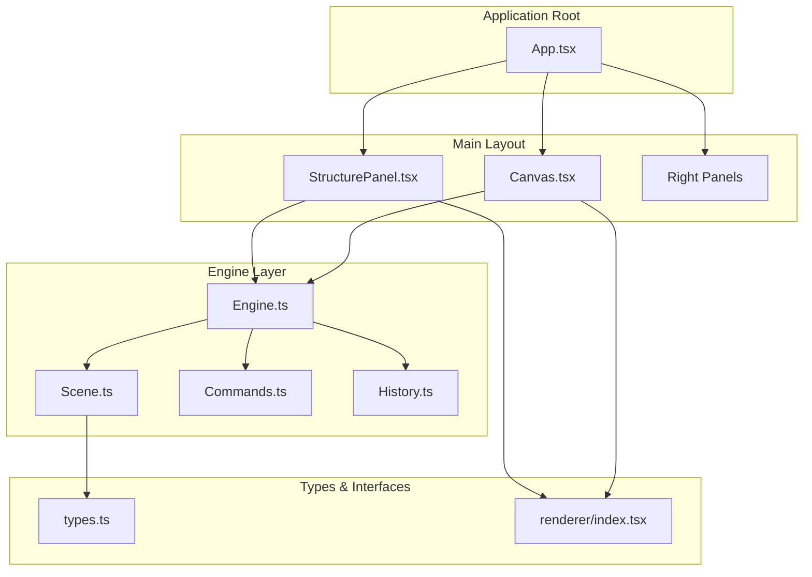
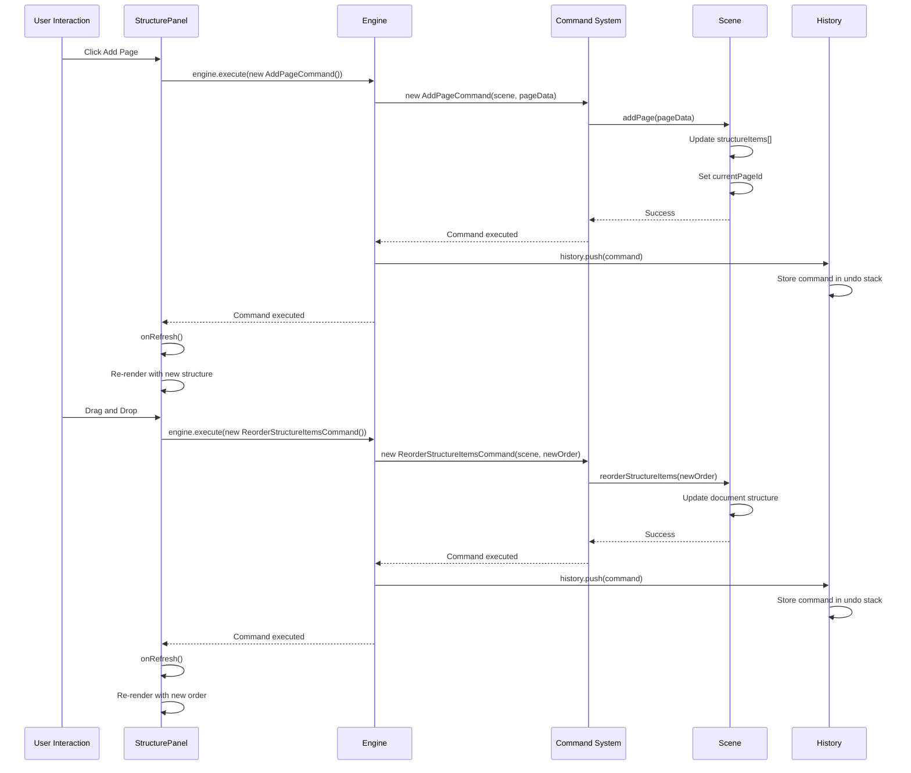
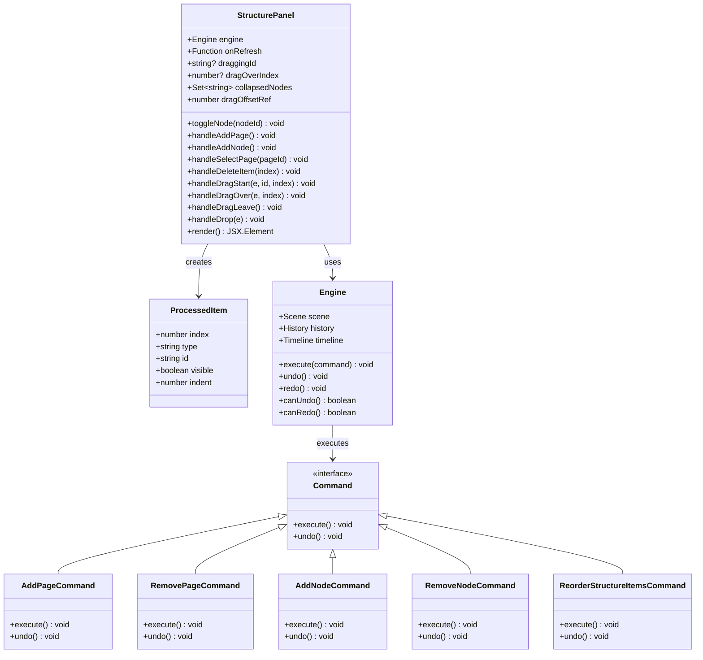
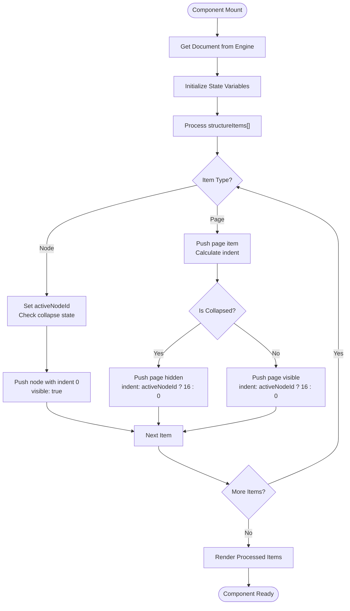
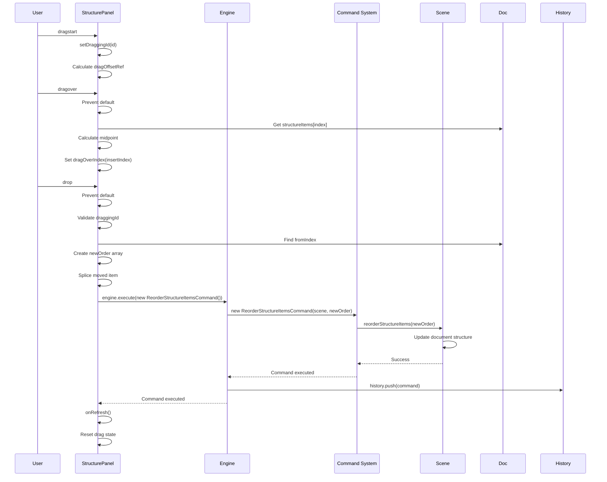
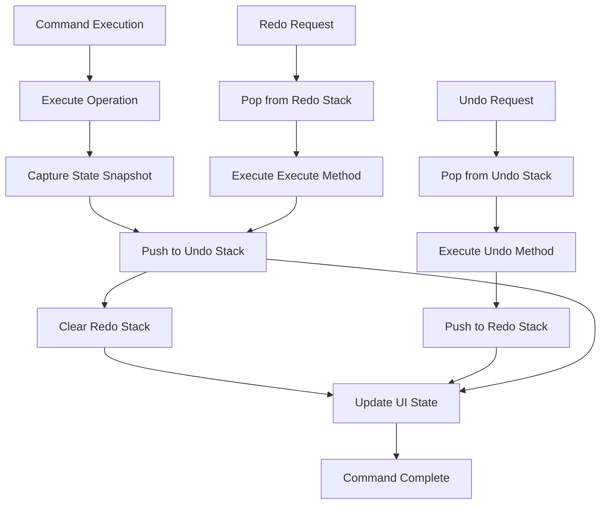
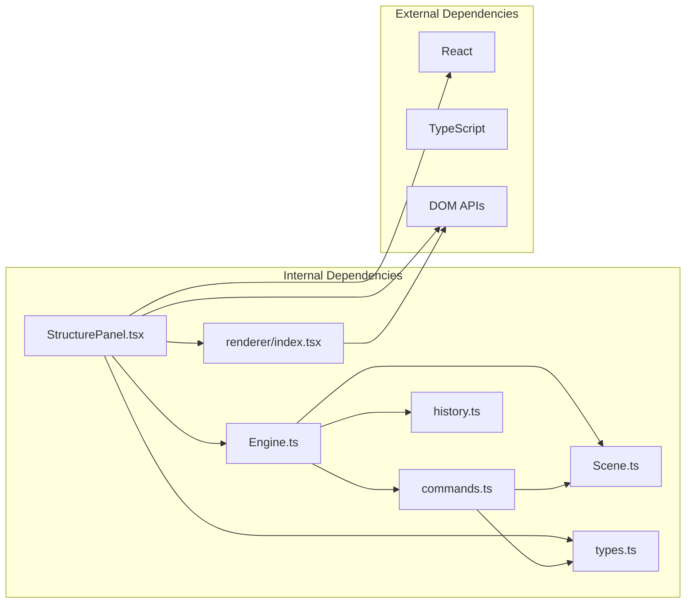

# Structure Panel Component

<cite>
**Referenced Files in This Document**
- [StructurePanel.tsx](file://src/components/StructurePanel.tsx)
- [App.tsx](file://src/App.tsx)
- [scene.ts](file://src/engine/scene.ts)
- [engine.ts](file://src/engine/engine.ts)
- [commands.ts](file://src/engine/commands.ts)
- [history.ts](file://src/engine/history.ts)
- [index.ts](file://src/engine/index.ts)
- [types.ts](file://src/types/index.ts)
- [Canvas.tsx](file://src/components/Canvas.tsx)
- [CanvasToolbar.tsx](file://src/components/CanvasToolbar.tsx)
- [PropertyPanel.tsx](file://src/components/PropertyPanel.tsx)
- [AnimationPanel.tsx](file://src/components/AnimationPanel.tsx)
- [renderer/index.tsx](file://src/renderer/index.tsx)
</cite>

## Update Summary
**Changes Made**
- Updated architecture overview to reflect command-based execution migration
- Added comprehensive documentation for command system integration
- Updated drag-and-drop implementation details with command-based approach
- Enhanced undo/redo support documentation with full command lifecycle
- Revised component analysis to show command pattern usage throughout

## Table of Contents
1. [Introduction](#introduction)
2. [Project Structure](#project-structure)
3. [Core Components](#core-components)
4. [Architecture Overview](#architecture-overview)
5. [Detailed Component Analysis](#detailed-component-analysis)
6. [Command-Based Execution System](#command-based-execution-system)
7. [Dependency Analysis](#dependency-analysis)
8. [Performance Considerations](#performance-considerations)
9. [Troubleshooting Guide](#troubleshooting-guide)
10. [Conclusion](#conclusion)

## Introduction

The Structure Panel Component is a crucial part of the slides editor application that provides a hierarchical view of the document structure. It allows users to manage pages and nodes within a presentation, offering drag-and-drop reordering capabilities, expand/collapse functionality for nested structures, and visual thumbnails for quick page identification.

This component serves as the primary navigation interface for document structure management, integrating tightly with the engine's command-based execution system to provide real-time updates, maintain consistency with the underlying document model, and support full undo/redo functionality.

## Project Structure

The Structure Panel is part of a larger React-based slides editor application with a well-organized component hierarchy that now operates entirely through command-based execution:

**Diagram sources**
- [App.tsx:276](file://src/App.tsx#L276)
- [StructurePanel.tsx:25](file://src/components/StructurePanel.tsx#L25)
- [engine.ts:7](file://src/engine/engine.ts#L7)
- [commands.ts:1](file://src/engine/commands.ts#L1)

**Section sources**
- [App.tsx:11-338](file://src/App.tsx#L11-L338)
- [StructurePanel.tsx:1-400](file://src/components/StructurePanel.tsx#L1-L400)

## Core Components

The Structure Panel Component consists of several key elements that work together to provide a comprehensive document structure management interface with full command-based execution:

### Main Component Structure
- **Container Component**: Provides the main panel layout with fixed width and scrollable content area
- **Toolbar**: Contains action buttons for adding pages and nodes using command execution
- **Structure Tree**: Displays hierarchical document structure with visual indicators
- **Drag-and-Drop System**: Enables reordering of pages and nodes through command-based operations
- **Visual Thumbnails**: Shows miniature previews of page content

### Key Features
- **Expand/Collapse**: Toggle visibility of page content within nodes
- **Selection Management**: Visual indication of currently selected page
- **Command-Based Operations**: All state mutations executed through structured commands
- **Full Undo/Redo Support**: Complete transaction history with reversible operations
- **Real-time Updates**: Synchronizes with engine state changes through command execution
- **Responsive Design**: Adapts to different screen sizes and content lengths

**Section sources**
- [StructurePanel.tsx:25-400](file://src/components/StructurePanel.tsx#L25-L400)
- [types.ts:60-84](file://src/types/index.ts#L60-L84)

## Architecture Overview

The Structure Panel follows a command-based architecture pattern that integrates with the application's engine system through a well-defined command execution pipeline:

**Diagram sources**
- [StructurePanel.tsx:48-61](file://src/components/StructurePanel.tsx#L48-L61)
- [StructurePanel.tsx:120-145](file://src/components/StructurePanel.tsx#L120-L145)
- [engine.ts:29-48](file://src/engine/engine.ts#L29-L48)
- [commands.ts:166-188](file://src/engine/commands.ts#L166-L188)
- [commands.ts:265-279](file://src/engine/commands.ts#L265-L279)

The component maintains a clean separation of concerns by delegating all state mutations to the command system, ensuring predictable behavior, easy debugging, and full transactional support with undo/redo capabilities.

**Section sources**
- [engine.ts:29-48](file://src/engine/engine.ts#L29-L48)
- [commands.ts:166-188](file://src/engine/commands.ts#L166-L188)
- [history.ts:7-30](file://src/engine/history.ts#L7-L30)

## Detailed Component Analysis

### StructurePanel Component Implementation

The StructurePanel component is implemented as a functional React component with comprehensive state management and command-based drag-and-drop functionality:

**Diagram sources**
- [StructurePanel.tsx:25-145](file://src/components/StructurePanel.tsx#L25-L145)
- [engine.ts:7-19](file://src/engine/engine.ts#L7-L19)
- [commands.ts:166-279](file://src/engine/commands.ts#L166-L279)

### Data Processing and Rendering Logic

The component processes the document structure through a sophisticated algorithm that handles nested relationships and visual representation:

**Diagram sources**
- [StructurePanel.tsx:147-167](file://src/components/StructurePanel.tsx#L147-L167)

### Command-Based Drag-and-Drop Implementation

The drag-and-drop system provides intuitive reordering capabilities with full command execution and undo/redo support:

**Diagram sources**
- [StructurePanel.tsx:93-145](file://src/components/StructurePanel.tsx#L93-L145)
- [commands.ts:265-279](file://src/engine/commands.ts#L265-L279)

**Section sources**
- [StructurePanel.tsx:93-145](file://src/components/StructurePanel.tsx#L93-L145)
- [commands.ts:265-279](file://src/engine/commands.ts#L265-L279)

### Visual Design and User Experience

The component implements a clean, modern interface with thoughtful UX considerations and full command-based state management:

#### Visual Elements
- **Fixed Width Container**: 220px width for consistent layout
- **Hierarchical Indentation**: 16px increments for nested structure
- **Visual Feedback**: Hover states, selection highlighting, and drag indicators
- **Responsive Thumbnails**: 160x90 pixel previews of page content
- **Interactive Elements**: Buttons with hover effects and clear affordances

#### State Management
- **Local State**: Manages drag state, selection, and collapse state
- **External State**: Delegates document state to engine system through commands
- **Command State**: Tracks command execution status and history
- **Reactive Updates**: Automatic re-rendering on command completion
- **Performance Optimization**: Efficient rendering with processed item cache

**Section sources**
- [StructurePanel.tsx:169-399](file://src/components/StructurePanel.tsx#L169-L399)

## Command-Based Execution System

The Structure Panel now operates entirely through a sophisticated command-based execution system that provides transactional operations, full undo/redo support, and consistent state management across the application.

### Command Pattern Implementation

The component utilizes specialized commands for all document operations:

#### Page Management Commands
- **AddPageCommand**: Creates new pages with automatic ordering and selection
- **RemovePageCommand**: Deletes pages with proper cleanup and selection restoration
- **ReorderStructureItemsCommand**: Handles drag-and-drop reordering with full state preservation

#### Node Management Commands  
- **AddNodeCommand**: Adds new nodes to the document structure
- **RemoveNodeCommand**: Removes nodes with proper page association restoration

#### Command Lifecycle
Each command follows a standardized execution pattern:
1. **Execution**: Performs the operation on the scene
2. **State Preservation**: Captures before/after state for undo operations
3. **History Tracking**: Stores command in execution history
4. **Error Handling**: Provides rollback capability on failure

### Undo/Redo Architecture

The command system integrates with a robust history management system:

**Diagram sources**
- [engine.ts:29-48](file://src/engine/engine.ts#L29-L48)
- [history.ts:7-30](file://src/engine/history.ts#L7-L30)

**Section sources**
- [commands.ts:166-279](file://src/engine/commands.ts#L166-L279)
- [history.ts:7-30](file://src/engine/history.ts#L7-L30)

## Dependency Analysis

The Structure Panel has well-defined dependencies that contribute to its modularity and maintainability with full command system integration:

**Diagram sources**
- [StructurePanel.tsx:1-11](file://src/components/StructurePanel.tsx#L1-L11)
- [engine.ts:1-6](file://src/engine/engine.ts#L1-L6)
- [commands.ts:1](file://src/engine/commands.ts#L1)

### Key Dependencies

#### Engine Integration
- **Command Execution**: Uses engine.execute() for all state mutations
- **History Management**: Integrates with engine.history for undo/redo operations
- **Scene Access**: Direct access to scene.getDocument() for structure data
- **State Synchronization**: Receives refresh callbacks for updates

#### Command System Integration
- **Command Classes**: Imports specialized command classes for operations
- **Type Safety**: Full TypeScript integration for command interfaces
- **Extensibility**: Easy to extend with new command types

#### Type System Integration
- **Document Types**: Uses Document, Page, Node, and StructureItem types
- **Command Interface**: Implements Command interface for all operations
- **Type Safety**: Full TypeScript integration for compile-time safety
- **Extensibility**: Easy to extend with new element types

#### Rendering Integration
- **Element Rendering**: Uses renderer.renderElement for thumbnail generation
- **SVG Integration**: Leverages SVG for element visualization
- **CSS Transform**: Utilizes CSS transforms for scaling and positioning

**Section sources**
- [StructurePanel.tsx:1-11](file://src/components/StructurePanel.tsx#L1-L11)
- [types.ts:60-84](file://src/types/index.ts#L60-L84)
- [commands.ts:107-110](file://src/engine/commands.ts#L107-L110)
- [renderer/index.tsx:167-180](file://src/renderer/index.tsx#L167-L180)

## Performance Considerations

The Structure Panel is designed with performance optimization in mind, particularly for command-based operations:

### Rendering Optimizations
- **Processed Item Caching**: Pre-computed visibility and indentation data
- **Conditional Rendering**: Only renders visible items in collapsed sections
- **Efficient State Updates**: Minimal state changes trigger re-renders
- **Drag State Isolation**: Separate state management for drag operations
- **Command Batching**: Multiple operations can be batched through command execution

### Memory Management
- **Set Collections**: Efficient collapse state storage using Set
- **Reference Caching**: useRef for drag offset calculations
- **Callback Memoization**: useCallback for drag handlers
- **Command Lifecycle**: Proper cleanup of command instances
- **Component Isolation**: Self-contained component reduces global state impact

### Scalability Factors
- **Linear Processing**: O(n) processing of structure items
- **Event Delegation**: Efficient event handling for drag operations
- **DOM Efficiency**: Minimal DOM manipulation during interactions
- **Lazy Rendering**: Thumbnails rendered only when visible
- **Command Efficiency**: Optimized command execution and history management

**Section sources**
- [StructurePanel.tsx:147-167](file://src/components/StructurePanel.tsx#L147-L167)
- [StructurePanel.tsx:100-114](file://src/components/StructurePanel.tsx#L100-L114)

## Troubleshooting Guide

Common issues and their solutions when working with the Structure Panel's command-based architecture:

### Command Execution Issues
**Problem**: Commands not executing properly
- **Cause**: Missing command import or incorrect command instantiation
- **Solution**: Verify all command classes are properly imported and instantiated
- **Debug**: Check engine.execute() calls and command constructor parameters

**Problem**: Undo/redo not working correctly
- **Cause**: Command undo/redo methods not properly implemented
- **Solution**: Ensure all commands implement both execute() and undo() methods
- **Debug**: Verify command state snapshots are captured correctly

### Drag-and-Drop Issues
**Problem**: Items don't reorder correctly
- **Cause**: Invalid structure item types or missing IDs
- **Solution**: Verify structureItems array contains valid {type, id} pairs
- **Debug**: Check console for drag state errors

**Problem**: Visual drop indicators not appearing
- **Cause**: Incorrect drag event handling or prevented defaults
- **Solution**: Ensure dragover events are properly handled
- **Debug**: Verify dragOverIndex state updates

### State Synchronization Problems
**Problem**: UI doesn't reflect engine changes
- **Cause**: Missing refresh callback invocation after command execution
- **Solution**: Call onRefresh() after engine.execute() completes
- **Debug**: Check version state increment and command execution flow

**Problem**: Selection state conflicts
- **Cause**: Multiple selection mechanisms
- **Solution**: Use engine.getEditorState() for selection
- **Debug**: Monitor selectedElementIds updates

### Performance Issues
**Problem**: Slow rendering with large documents
- **Cause**: Excessive re-renders or inefficient processing
- **Solution**: Optimize structureItems length or implement virtualization
- **Debug**: Profile component rendering performance

**Problem**: Memory leaks in command system
- **Cause**: Unclosed command references or event listeners
- **Solution**: Ensure proper cleanup of command instances and event handlers
- **Debug**: Monitor memory usage and component lifecycle

**Section sources**
- [StructurePanel.tsx:48-61](file://src/components/StructurePanel.tsx#L48-L61)
- [StructurePanel.tsx:120-145](file://src/components/StructurePanel.tsx#L120-L145)
- [engine.ts:29-48](file://src/engine/engine.ts#L29-L48)

## Conclusion

The Structure Panel Component represents a well-architected solution for document structure management in the slides editor application, now enhanced with a comprehensive command-based execution system. Its design demonstrates several key principles:

### Strengths
- **Command-Based Architecture**: Clean separation between UI and state management through structured commands
- **Transaction Safety**: All operations are atomic and reversible with full undo/redo support
- **Type Safety**: Comprehensive TypeScript integration ensures reliability and maintainability
- **User Experience**: Intuitive drag-and-drop with visual feedback and full command lifecycle
- **Performance**: Optimized rendering and state management with efficient command execution
- **Extensibility**: Modular design supports future enhancements and new command types

### Design Decisions
- **Unidirectional Data Flow**: Engine-driven state management through command execution prevents inconsistencies
- **Hierarchical Rendering**: Efficient processing of nested document structures with command-based updates
- **Visual Feedback**: Comprehensive user interaction indicators with command execution status
- **Performance Focus**: Optimized algorithms for large document handling with command batching
- **Full Transaction Support**: Complete history management for reliable operation recovery

### Future Considerations
- **Virtualization**: Implement virtual scrolling for very large document structures
- **Accessibility**: Enhanced keyboard navigation and screen reader support
- **Customization**: Configurable indentation and visual themes
- **Integration**: Enhanced integration with animation timeline and other panels
- **Performance**: Further optimization of command execution and history management

The component successfully balances functionality, performance, and maintainability, serving as a cornerstone of the application's user interface architecture with full command-based execution support.