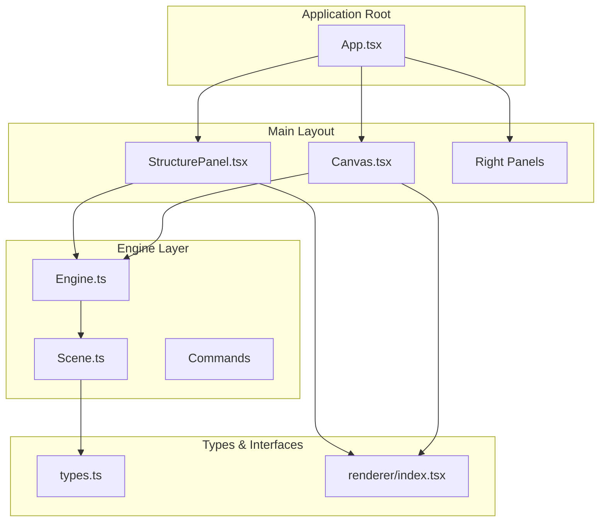
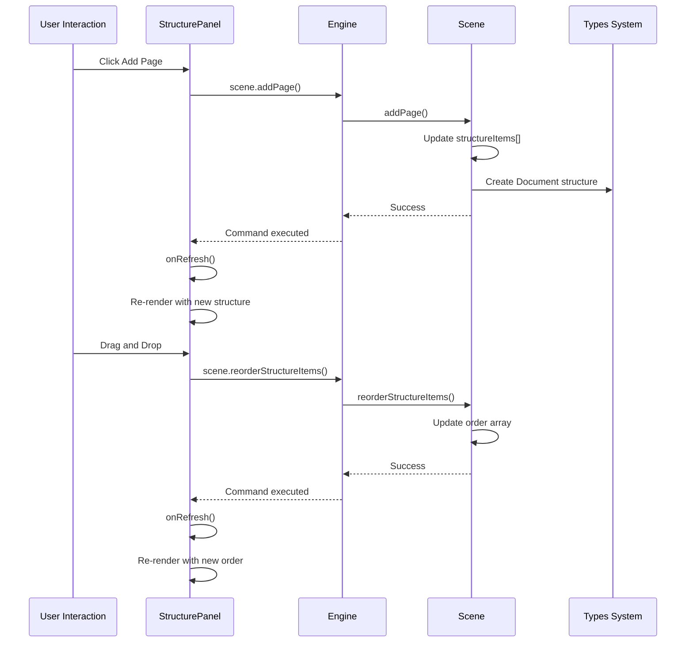
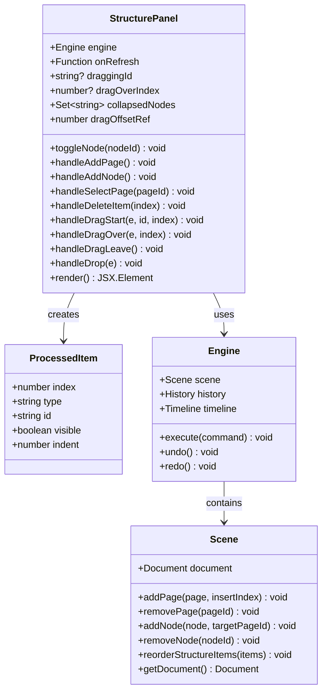
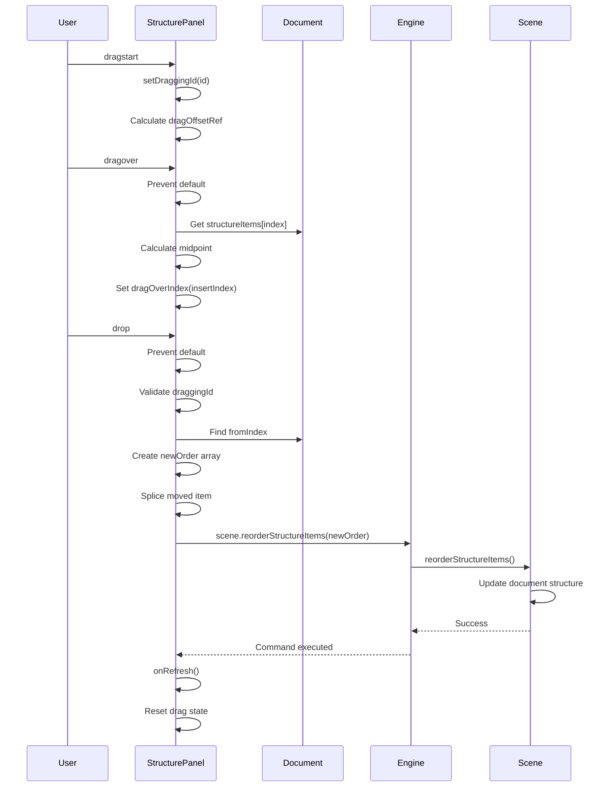
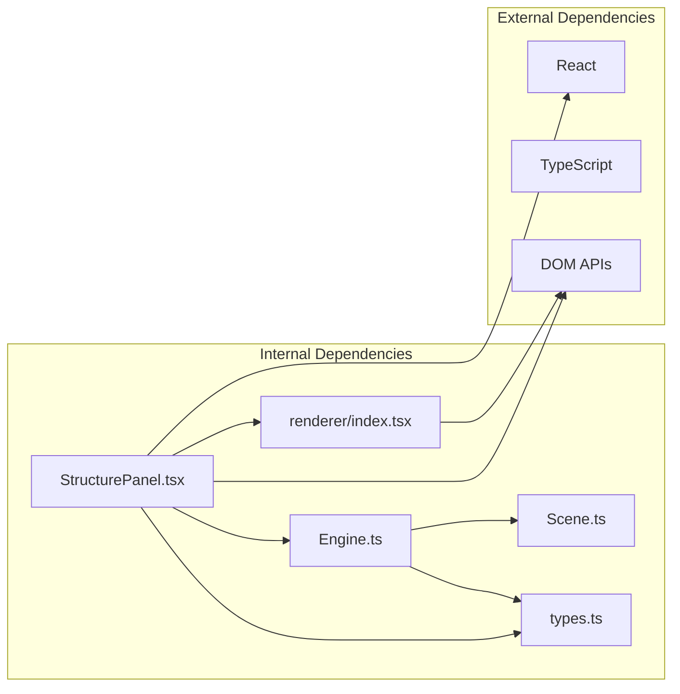

# Structure Panel Component

<cite>
**Referenced Files in This Document**
- [StructurePanel.tsx](file://src/components/StructurePanel.tsx)
- [App.tsx](file://src/App.tsx)
- [scene.ts](file://src/engine/scene.ts)
- [engine.ts](file://src/engine/engine.ts)
- [index.ts](file://src/engine/index.ts)
- [types.ts](file://src/types/index.ts)
- [Canvas.tsx](file://src/components/Canvas.tsx)
- [CanvasToolbar.tsx](file://src/components/CanvasToolbar.tsx)
- [PropertyPanel.tsx](file://src/components/PropertyPanel.tsx)
- [AnimationPanel.tsx](file://src/components/AnimationPanel.tsx)
- [renderer/index.tsx](file://src/renderer/index.tsx)
</cite>

## Table of Contents
1. [Introduction](#introduction)
2. [Project Structure](#project-structure)
3. [Core Components](#core-components)
4. [Architecture Overview](#architecture-overview)
5. [Detailed Component Analysis](#detailed-component-analysis)
6. [Dependency Analysis](#dependency-analysis)
7. [Performance Considerations](#performance-considerations)
8. [Troubleshooting Guide](#troubleshooting-guide)
9. [Conclusion](#conclusion)

## Introduction

The Structure Panel Component is a crucial part of the slides editor application that provides a hierarchical view of the document structure. It allows users to manage pages and nodes within a presentation, offering drag-and-drop reordering capabilities, expand/collapse functionality for nested structures, and visual thumbnails for quick page identification.

This component serves as the primary navigation interface for document structure management, integrating tightly with the engine's scene management system to provide real-time updates and maintain consistency with the underlying document model.

## Project Structure

The Structure Panel is part of a larger React-based slides editor application with a well-organized component hierarchy:

**Diagram sources**
- [App.tsx:276](file://src/App.tsx#L276)
- [StructurePanel.tsx:25](file://src/components/StructurePanel.tsx#L25)
- [engine.ts:7](file://src/engine/engine.ts#L7)

**Section sources**
- [App.tsx:11-338](file://src/App.tsx#L11-L338)
- [StructurePanel.tsx:1-389](file://src/components/StructurePanel.tsx#L1-L389)

## Core Components

The Structure Panel Component consists of several key elements that work together to provide a comprehensive document structure management interface:

### Main Component Structure
- **Container Component**: Provides the main panel layout with fixed width and scrollable content area
- **Toolbar**: Contains action buttons for adding pages and nodes
- **Structure Tree**: Displays hierarchical document structure with visual indicators
- **Drag-and-Drop System**: Enables reordering of pages and nodes
- **Visual Thumbnails**: Shows miniature previews of page content

### Key Features
- **Expand/Collapse**: Toggle visibility of page content within nodes
- **Selection Management**: Visual indication of currently selected page
- **Real-time Updates**: Synchronizes with engine state changes
- **Responsive Design**: Adapts to different screen sizes and content lengths

**Section sources**
- [StructurePanel.tsx:25-389](file://src/components/StructurePanel.tsx#L25-L389)
- [types.ts:60-84](file://src/types/index.ts#L60-L84)

## Architecture Overview

The Structure Panel follows a unidirectional data flow pattern that integrates with the application's engine system:

**Diagram sources**
- [StructurePanel.tsx:41-64](file://src/components/StructurePanel.tsx#L41-L64)
- [StructurePanel.tsx:109-134](file://src/components/StructurePanel.tsx#L109-L134)
- [scene.ts:18-28](file://src/engine/scene.ts#L18-L28)

The component maintains a clean separation of concerns by delegating all state mutations to the engine system, ensuring predictable behavior and easy debugging.

**Section sources**
- [engine.ts:29-48](file://src/engine/engine.ts#L29-L48)
- [scene.ts:86-88](file://src/engine/scene.ts#L86-L88)

## Detailed Component Analysis

### StructurePanel Component Implementation

The StructurePanel component is implemented as a functional React component with comprehensive state management and drag-and-drop functionality:

**Diagram sources**
- [StructurePanel.tsx:25-134](file://src/components/StructurePanel.tsx#L25-L134)
- [engine.ts:7-19](file://src/engine/engine.ts#L7-L19)
- [scene.ts:3-12](file://src/engine/scene.ts#L3-L12)

### Data Processing and Rendering Logic

The component processes the document structure through a sophisticated algorithm that handles nested relationships and visual representation:

**Diagram sources**
- [StructurePanel.tsx:136-156](file://src/components/StructurePanel.tsx#L136-L156)

### Drag-and-Drop Implementation

The drag-and-drop system provides intuitive reordering capabilities with visual feedback:

**Diagram sources**
- [StructurePanel.tsx:82-134](file://src/components/StructurePanel.tsx#L82-L134)
- [scene.ts:86-88](file://src/engine/scene.ts#L86-L88)

**Section sources**
- [StructurePanel.tsx:82-134](file://src/components/StructurePanel.tsx#L82-L134)
- [scene.ts:86-88](file://src/engine/scene.ts#L86-L88)

### Visual Design and User Experience

The component implements a clean, modern interface with thoughtful UX considerations:

#### Visual Elements
- **Fixed Width Container**: 220px width for consistent layout
- **Hierarchical Indentation**: 16px increments for nested structure
- **Visual Feedback**: Hover states, selection highlighting, and drag indicators
- **Responsive Thumbnails**: 160x90 pixel previews of page content
- **Interactive Elements**: Buttons with hover effects and clear affordances

#### State Management
- **Local State**: Manages drag state, selection, and collapse state
- **External State**: Delegates document state to engine system
- **Reactive Updates**: Automatic re-rendering on state changes
- **Performance Optimization**: Efficient rendering with processed item cache

**Section sources**
- [StructurePanel.tsx:158-387](file://src/components/StructurePanel.tsx#L158-L387)

## Dependency Analysis

The Structure Panel has well-defined dependencies that contribute to its modularity and maintainability:

**Diagram sources**
- [StructurePanel.tsx:1-8](file://src/components/StructurePanel.tsx#L1-L8)
- [engine.ts:1-6](file://src/engine/engine.ts#L1-L6)

### Key Dependencies

#### Engine Integration
- **Scene Access**: Direct access to scene.getDocument() for structure data
- **Command Execution**: Uses engine.scene methods for mutations
- **State Synchronization**: Receives refresh callbacks for updates

#### Type System Integration
- **Document Types**: Uses Document, Page, Node, and StructureItem types
- **Type Safety**: Full TypeScript integration for compile-time safety
- **Extensibility**: Easy to extend with new element types

#### Rendering Integration
- **Element Rendering**: Uses renderer.renderElement for thumbnail generation
- **SVG Integration**: Leverages SVG for element visualization
- **CSS Transform**: Utilizes CSS transforms for scaling and positioning

**Section sources**
- [StructurePanel.tsx:25-4](file://src/components/StructurePanel.tsx#L25-L4)
- [types.ts:60-84](file://src/types/index.ts#L60-L84)
- [renderer/index.tsx:167-180](file://src/renderer/index.tsx#L167-L180)

## Performance Considerations

The Structure Panel is designed with performance optimization in mind:

### Rendering Optimizations
- **Processed Item Caching**: Pre-computed visibility and indentation data
- **Conditional Rendering**: Only renders visible items in collapsed sections
- **Efficient State Updates**: Minimal state changes trigger re-renders
- **Drag State Isolation**: Separate state management for drag operations

### Memory Management
- **Set Collections**: Efficient collapse state storage using Set
- **Reference Caching**: useRef for drag offset calculations
- **Callback Memoization**: useCallback for drag handlers
- **Component Isolation**: Self-contained component reduces global state impact

### Scalability Factors
- **Linear Processing**: O(n) processing of structure items
- **Event Delegation**: Efficient event handling for drag operations
- **DOM Efficiency**: Minimal DOM manipulation during interactions
- **Lazy Rendering**: Thumbnails rendered only when visible

**Section sources**
- [StructurePanel.tsx:136-156](file://src/components/StructurePanel.tsx#L136-L156)
- [StructurePanel.tsx:89-103](file://src/components/StructurePanel.tsx#L89-L103)

## Troubleshooting Guide

Common issues and their solutions when working with the Structure Panel:

### Drag-and-Drop Issues
**Problem**: Items don't reorder correctly
- **Cause**: Invalid structure item types or missing IDs
- **Solution**: Verify structureItems array contains valid {type, id} pairs
- **Debug**: Check console for drag state errors

**Problem**: Visual drop indicators not appearing
- **Cause**: Incorrect drag event handling or prevented defaults
- **Solution**: Ensure dragover events are properly handled
- **Debug**: Verify dragOverIndex state updates

### State Synchronization Problems
**Problem**: UI doesn't reflect engine changes
- **Cause**: Missing refresh callback invocation
- **Solution**: Call onRefresh() after engine mutations
- **Debug**: Check version state increment

**Problem**: Selection state conflicts
- **Cause**: Multiple selection mechanisms
- **Solution**: Use engine.getEditorState() for selection
- **Debug**: Monitor selectedElementIds updates

### Performance Issues
**Problem**: Slow rendering with large documents
- **Cause**: Excessive re-renders or inefficient processing
- **Solution**: Optimize structureItems length or implement virtualization
- **Debug**: Profile component rendering performance

**Section sources**
- [StructurePanel.tsx:24-26](file://src/components/StructurePanel.tsx#L24-L26)
- [StructurePanel.tsx:109-134](file://src/components/StructurePanel.tsx#L109-L134)

## Conclusion

The Structure Panel Component represents a well-architected solution for document structure management in the slides editor application. Its design demonstrates several key principles:

### Strengths
- **Clean Architecture**: Clear separation between UI and state management
- **Type Safety**: Comprehensive TypeScript integration ensures reliability
- **User Experience**: Intuitive drag-and-drop with visual feedback
- **Performance**: Optimized rendering and state management
- **Extensibility**: Modular design supports future enhancements

### Design Decisions
- **Unidirectional Data Flow**: Engine-driven state management prevents inconsistencies
- **Hierarchical Rendering**: Efficient processing of nested document structures
- **Visual Feedback**: Comprehensive user interaction indicators
- **Performance Focus**: Optimized algorithms for large document handling

### Future Considerations
- **Virtualization**: Implement virtual scrolling for very large document structures
- **Accessibility**: Enhanced keyboard navigation and screen reader support
- **Customization**: Configurable indentation and visual themes
- **Integration**: Enhanced integration with animation timeline

The component successfully balances functionality, performance, and maintainability, serving as a cornerstone of the application's user interface architecture.