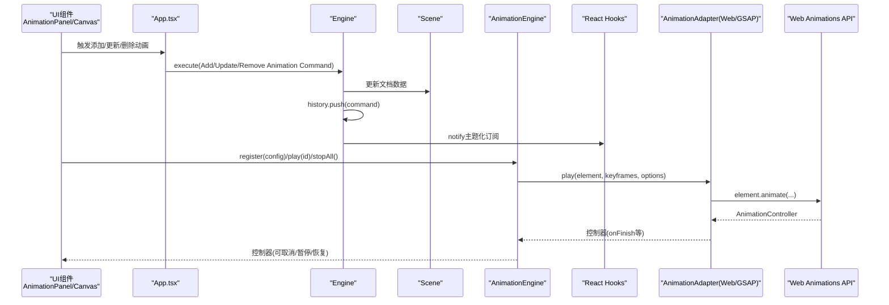
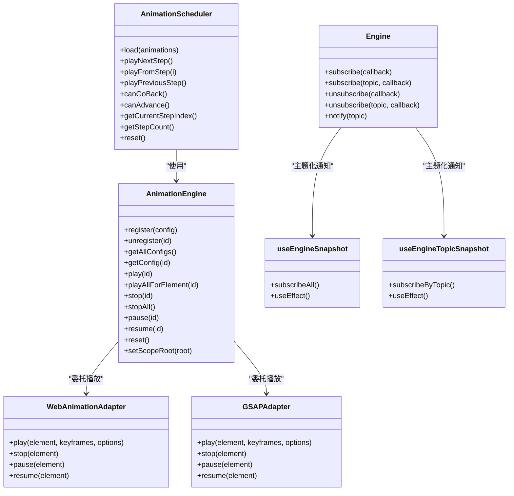
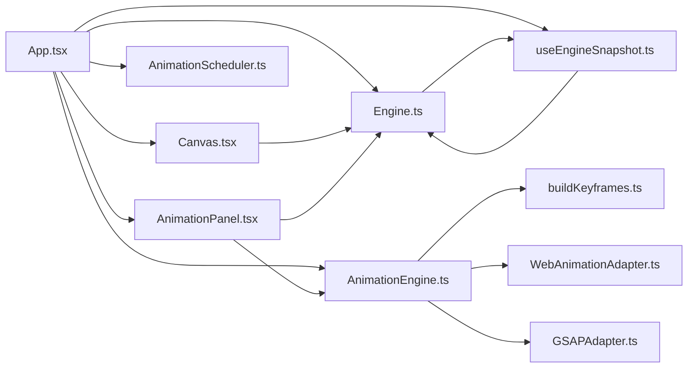

# API参考

<cite>
**本文引用的文件**
- [src/engine/index.ts](file://src/engine/index.ts)
- [src/engine/engine.ts](file://src/engine/engine.ts)
- [src/engine/scene.ts](file://src/engine/scene.ts)
- [src/engine/commands.ts](file://src/engine/commands.ts)
- [src/engine/history.ts](file://src/engine/history.ts)
- [src/engine/timeline.ts](file://src/engine/timeline.ts)
- [src/engine/snapEngine.ts](file://src/engine/snapEngine.ts)
- [src/animation/index.ts](file://src/animation/index.ts)
- [src/animation/engine.ts](file://src/animation/engine.ts)
- [src/animation/buildKeyframes.ts](file://src/animation/buildKeyframes.ts)
- [src/animation/scheduler.ts](file://src/animation/scheduler.ts)
- [src/animation/webAnimationAdapter.ts](file://src/animation/webAnimationAdapter.ts)
- [src/animation/gsapAdapter.ts](file://src/animation/gsapAdapter.ts)
- [src/animation/adapter.ts](file://src/animation/adapter.ts)
- [src/types/index.ts](file://src/types/index.ts)
- [src/types/animation.ts](file://src/types/animation.ts)
- [src/components/AnimationPanel.tsx](file://src/components/AnimationPanel.tsx)
- [src/components/Canvas.tsx](file://src/components/Canvas.tsx)
- [src/App.tsx](file://src/App.tsx)
- [src/hooks/useEngineSnapshot.ts](file://src/hooks/useEngineSnapshot.ts)
</cite>

## 更新摘要
**变更内容**
- 新增主题化订阅功能的引擎API文档
- 新增 `useEngineTopicSnapshot` React钩子API文档
- 扩展引擎通知机制，支持按主题分类的通知
- 新增 `EngineTopic` 类型定义和相关使用场景

## 目录
1. [简介](#简介)
2. [项目结构](#项目结构)
3. [核心组件](#核心组件)
4. [架构总览](#架构总览)
5. [详细组件与API分析](#详细组件与api分析)
6. [依赖关系分析](#依赖关系分析)
7. [性能考量](#性能考量)
8. [故障排查指南](#故障排查指南)
9. [结论](#结论)
10. [附录](#附录)

## 简介
本文件为"AI课件编辑器"的全面API参考，覆盖引擎API、组件API、动画系统API和React钩子API。内容包括：
- 引擎API：方法签名、参数说明、返回值、异常处理与使用建议
- 组件API：React组件的props接口、事件回调与生命周期要点
- 动画API：配置项、播放控制方法、状态查询接口与适配器扩展
- React钩子API：主题化订阅钩子与状态同步机制
- 版本兼容性、废弃警告与迁移指南（如适用）

## 项目结构
项目采用分层架构：
- 引擎层：无框架绑定的内核，负责文档、场景、命令、历史与时间线管理，支持主题化订阅
- 类型层：共享的数据模型与动画类型定义
- 动画层：动画引擎、调度器与Web Animations/GSAP适配器
- 组件层：React UI组件，连接引擎与动画系统
- 钩子层：React钩子API，提供主题化订阅和状态同步
- 应用入口：App整合各模块并提供交互控制

```mermaid
graph TB
subgraph "应用层"
APP["App.tsx"]
end
subgraph "组件层"
CANVAS["Canvas.tsx"]
ANIM_PANEL["AnimationPanel.tsx"]
end
subgraph "钩子层"
HOOKS["useEngineSnapshot.ts"]
end
subgraph "引擎层"
ENGINE["Engine(engine.ts)"]
SCENE["Scene(scene.ts)"]
HISTORY["History(history.ts)"]
TIMELINE["Timeline(timeline.ts)"]
COMMANDS["Commands(commands.ts)"]
end
subgraph "动画层"
ANIM_ENGINE["AnimationEngine(engine.ts)"]
SCHEDULER["AnimationScheduler(scheduler.ts)"]
KEYFRAMES["buildKeyframes(buildKeyframes.ts)"]
ADAPTER_WA["WebAnimationAdapter(webAnimationAdapter.ts)"]
ADAPTER_GSAP["GSAPAdapter(gsapAdapter.ts)"]
end
subgraph "类型层"
TYPES_INDEX["types/index.ts"]
TYPES_ANIM["types/animation.ts"]
END
APP --> CANVAS
APP --> ANIM_PANEL
APP --> HOOKS
APP --> ENGINE
APP --> ANIM_ENGINE
APP --> SCHEDULER
CANVAS --> ENGINE
ANIM_PANEL --> ENGINE
ANIM_PANEL --> ANIM_ENGINE
HOOKS --> ENGINE
ENGINE --> SCENE
ENGINE --> HISTORY
ENGINE --> TIMELINE
ENGINE --> COMMANDS
ANIM_ENGINE --> KEYFRAMES
ANIM_ENGINE --> ADAPTER_WA
ANIM_ENGINE --> ADAPTER_GSAP
ENGINE -. 使用 .-> TYPES_INDEX
ANIM_ENGINE -. 使用 .-> TYPES_ANIM
SCHEDULER -. 使用 .-> TYPES_ANIM
```

**图表来源**
- [src/App.tsx:1-336](file://src/App.tsx#L1-L336)
- [src/engine/engine.ts:1-127](file://src/engine/engine.ts#L1-L127)
- [src/engine/scene.ts:1-273](file://src/engine/scene.ts#L1-L273)
- [src/engine/commands.ts:1-280](file://src/engine/commands.ts#L1-L280)
- [src/animation/engine.ts:1-120](file://src/animation/engine.ts#L1-L120)
- [src/animation/scheduler.ts:1-160](file://src/animation/scheduler.ts#L1-L160)
- [src/animation/buildKeyframes.ts:1-125](file://src/animation/buildKeyframes.ts#L1-L125)
- [src/animation/webAnimationAdapter.ts:1-67](file://src/animation/webAnimationAdapter.ts#L1-L67)
- [src/animation/gsapAdapter.ts:1-140](file://src/animation/gsapAdapter.ts#L1-L140)
- [src/types/index.ts:1-159](file://src/types/index.ts#L1-L159)
- [src/types/animation.ts:1-113](file://src/types/animation.ts#L1-L113)
- [src/hooks/useEngineSnapshot.ts:1-22](file://src/hooks/useEngineSnapshot.ts#L1-L22)

**章节来源**
- [src/App.tsx:1-336](file://src/App.tsx#L1-L336)
- [src/engine/index.ts:1-17](file://src/engine/index.ts#L1-L17)
- [src/animation/index.ts:1-8](file://src/animation/index.ts#L1-L8)
- [src/types/index.ts:1-159](file://src/types/index.ts#L1-L159)
- [src/types/animation.ts:1-113](file://src/types/animation.ts#L1-L113)
- [src/hooks/useEngineSnapshot.ts:1-22](file://src/hooks/useEngineSnapshot.ts#L1-L22)

## 核心组件
- 引擎核心：Engine
  - 职责：持有Scene、History、Timeline；统一执行命令；提供撤销/重做能力；支持主题化订阅
  - 关键方法：execute、undo、redo、canUndo、canRedo、getEditorState、setEditorState、subscribe、unsubscribe
  - 主题化通知：notify方法支持按主题发送通知（scene、editorState、history、all）
  - 返回值：无（void）或当前编辑状态对象
  - 异常：未见显式try/catch，调用方需确保传入合法命令
- 场景管理：Scene
  - 职责：管理Document、页面、节点、元素与动画的增删改查
  - 关键方法：addPage/removePage/getPage/setCurrentPageId、addNode/removeNode/getNode、addElement/updateElement/deleteElement、addAnimation/removeAnimation/updateAnimation、getPageAnimations/reorderAnimations
  - 返回值：无或查询结果
  - 异常：越界/不存在时返回空/undefined，调用方需判空
- 命令体系：Command接口及实现类
  - 接口：execute、undo
  - 实现：AddElementCommand、MoveElementCommand、DeleteElementCommand、AddAnimationCommand、RemoveAnimationCommand、UpdateAnimationCommand、ReorderAnimationsCommand、AddPageCommand、RemovePageCommand、AddNodeCommand、RemoveNodeCommand、ReorderStructureItemsCommand
  - 返回值：无
  - 异常：命令内部不抛出，错误由调用方在执行前校验
- 历史与时间线：History、Timeline
  - History：push、undo、redo、canUndo、canRedo
  - Timeline：占位（具体实现未在已读文件中暴露）
- 拖拽吸附：snapEngine
  - 导出：snapEngine、SnapRect、SnapInput（用于吸附计算）
- 主题化订阅：EngineTopic
  - 类型：'scene' | 'editorState' | 'history' | 'all'
  - 功能：支持按主题粒度的订阅和通知

**章节来源**
- [src/engine/engine.ts:1-127](file://src/engine/engine.ts#L1-L127)
- [src/engine/scene.ts:1-273](file://src/engine/scene.ts#L1-L273)
- [src/engine/commands.ts:1-280](file://src/engine/commands.ts#L1-L280)
- [src/engine/history.ts](file://src/engine/history.ts)
- [src/engine/timeline.ts](file://src/engine/timeline.ts)
- [src/engine/snapEngine.ts](file://src/engine/snapEngine.ts)
- [src/engine/index.ts:1-17](file://src/engine/index.ts#L1-L17)

## 架构总览
引擎与动画系统的交互流程如下：



**图表来源**
- [src/App.tsx:1-336](file://src/App.tsx#L1-L336)
- [src/engine/engine.ts:1-127](file://src/engine/engine.ts#L1-L127)
- [src/engine/scene.ts:1-273](file://src/engine/scene.ts#L1-L273)
- [src/animation/engine.ts:1-120](file://src/animation/engine.ts#L1-L120)
- [src/animation/webAnimationAdapter.ts:1-67](file://src/animation/webAnimationAdapter.ts#L1-L67)
- [src/animation/gsapAdapter.ts:1-140](file://src/animation/gsapAdapter.ts#L1-L140)
- [src/hooks/useEngineSnapshot.ts:1-22](file://src/hooks/useEngineSnapshot.ts#L1-L22)

## 详细组件与API分析

### 引擎API（Engine/Scene/Commands）
- Engine
  - 方法
    - execute(command: Command): void
    - undo(): void
    - redo(): void
    - canUndo(): boolean
    - canRedo(): boolean
    - getEditorState(): EditorState
    - setEditorState(updates: Partial<EditorState>): void
    - subscribe(callback: () => void): void
    - subscribe(topic: EngineTopic, callback: () => void): void
    - unsubscribe(callback: () => void): void
    - unsubscribe(topic: EngineTopic, callback: () => void): void
  - 参数
    - command: 需实现Command接口
    - updates: EditorState的部分字段
    - topic: EngineTopic类型，支持'scene' | 'editorState' | 'history' | 'all'
    - callback: 订阅回调函数
  - 返回值
    - 无或布尔值
  - 异常
    - 未捕获异常；调用方应确保命令有效
  - 使用场景
    - 所有状态变更必须通过execute(command)进行，以纳入历史管理
    - 主题化订阅用于精确控制UI更新范围
- Scene
  - 页面管理
    - addPage(page, insertIndex?): void
    - removePage(pageId): void
    - getPage(pageId): Page | undefined
    - setCurrentPageId(pageId): void
  - 节点管理
    - addNode(node, targetPageId?): void
    - removeNode(nodeId): void
    - getNode(nodeId): Node | undefined
    - reorderStructureItems(newOrder): void
  - 元素管理
    - addElement(pageId, element): void
    - updateElement(elementId, updates): void
    - deleteElement(elementId): void
    - getElement(elementId): Element | undefined
    - getPageElements(pageId): Element[]
  - 动画管理
    - addAnimation(pageId, config): void
    - removeAnimation(configId): void
    - updateAnimation(configId, updates): void
    - getAnimation(configId): AnimationConfig | undefined
    - getPageAnimations(pageId): AnimationConfig[]
    - reorderAnimations(pageId, orderedIds): void
  - 返回值
    - 查询类方法可能返回undefined或空数组
  - 异常
    - 无显式异常；越界/不存在按约定返回空
- 命令（Command）
  - 接口：execute(): void, undo(): void
  - 常用实现：AddElementCommand、MoveElementCommand、DeleteElementCommand、AddAnimationCommand、RemoveAnimationCommand、UpdateAnimationCommand、ReorderAnimationsCommand、AddPageCommand、RemovePageCommand、AddNodeCommand、RemoveNodeCommand、ReorderStructureItemsCommand

**章节来源**
- [src/engine/engine.ts:1-127](file://src/engine/engine.ts#L1-L127)
- [src/engine/scene.ts:1-273](file://src/engine/scene.ts#L1-L273)
- [src/engine/commands.ts:1-280](file://src/engine/commands.ts#L1-L280)

### React钩子API（主题化订阅）
- useEngineSnapshot(engine: Engine): number
  - 功能：订阅整个引擎状态变化，返回递增计数器
  - 参数：engine - Engine实例
  - 返回值：number类型的快照计数
  - 生命周期：组件挂载时订阅，卸载时自动取消订阅
  - 使用场景：需要响应任何引擎状态变化的UI组件
- useEngineTopicSnapshot(engine: Engine, topic: EngineTopic): number
  - 功能：订阅指定主题的引擎状态变化，返回递增计数器
  - 参数：
    - engine - Engine实例
    - topic - EngineTopic类型，支持'scene' | 'editorState' | 'history' | 'all'
  - 返回值：number类型的快照计数
  - 生命周期：组件挂载时订阅，卸载时自动取消订阅
  - 使用场景：需要精确控制响应范围的UI组件
- EngineTopic类型
  - 'scene'：场景数据变化（页面、元素、动画）
  - 'editorState'：编辑器状态变化（选择、工具栏、视口）
  - 'history'：历史记录变化（撤销/重做）
  - 'all'：所有变化

**章节来源**
- [src/hooks/useEngineSnapshot.ts:1-22](file://src/hooks/useEngineSnapshot.ts#L1-L22)

### 组件API（React）
- Canvas(props)
  - props
    - engine: Engine
    - animationEngine: AnimationEngine
  - 行为
    - 将动画作用域限定到容器内，避免跨元素误触
    - 处理拖放创建元素、点击选择元素、画布空白处取消选择
  - 生命周期
    - 初始化设置scopeRoot；卸载时清理
- AnimationPanel(props)
  - props
    - engine: Engine
    - animationEngine: AnimationEngine
  - 表单与行为
    - 支持新增/编辑/删除动画
    - 自动推导起始类型（click/withPrev/afterPrev）
    - 支持拖拽排序并自动修复起始类型
    - 提供试播与从某步开始播放
  - 事件
    - onRefresh：刷新UI
  - 依赖
    - 与Scene的动画集合、与AnimationEngine的注册/播放/停止

**章节来源**
- [src/components/Canvas.tsx:1-186](file://src/components/Canvas.tsx#L1-L186)
- [src/components/AnimationPanel.tsx:1-852](file://src/components/AnimationPanel.tsx#L1-L852)

### 动画API（AnimationEngine/Scheduler/Adapter）
- AnimationEngine
  - 注册与查询
    - register(config: AnimationConfig): void
    - unregister(configId: string): void
    - getAllConfigs(): AnimationConfig[]
    - getConfig(configId: string): AnimationConfig | undefined
  - 播放与控制
    - play(configId: string): AnimationController | null
    - playAllForElement(elementId: string): AnimationController[]
    - stop(elementId: string): void
    - stopAll(): void
    - pause(elementId: string): void
    - resume(elementId: string): void
    - reset(): void
    - setScopeRoot(root: HTMLElement | null): void
  - 关键点
    - 通过buildKeyframes生成WAAPI兼容的关键帧
    - 通过适配器播放（Web Animations或GSAP）
- buildKeyframes(config)
  - 输入：AnimationConfig
  - 输出：WAAPIKeyframe[]
  - 支持效果：fadeIn/zoomIn/slideIn/flyIn/rotateIn、fadeOut/zoomOut/slideOut/flyOut/rotateOut、pulse/shake/blink/scale/highlight
- AnimationScheduler
  - 加载与执行
    - load(animations: AnimationConfig[]): void
    - playNextStep(): boolean
    - playFromStep(stepIndex: number): void
    - playPreviousStep(): boolean
    - canGoBack(): boolean
    - canAdvance(): boolean
    - getCurrentStepIndex(): number
    - getStepCount(): number
    - reset(): void
  - 执行模型
    - 步骤（Step）由用户点击触发
    - 步骤内批（Batch）顺序执行
    - 批内并发播放
- 适配器（AnimationAdapter）
  - WebAnimationAdapter
    - play(element, keyframes, options): AnimationController
    - stop/pause/resume：基于原生Web Animations API
  - GSAPAdapter
    - play(element, keyframes, options): AnimationController
    - stop/pause/resume：基于GSAP
    - 映射easing名称与transform解析
- 类型与配置
  - AnimationConfig：id、elementId、name、enable、type、effect、startType、duration、delay、easing、repeatCount、params
  - WAAPIKeyframe：offset可选，其他CSS属性键值对
  - AnimationController：finish、cancel、pause、play、onFinish(callback)



**图表来源**
- [src/engine/engine.ts:1-127](file://src/engine/engine.ts#L1-L127)
- [src/animation/engine.ts:1-120](file://src/animation/engine.ts#L1-L120)
- [src/animation/scheduler.ts:1-160](file://src/animation/scheduler.ts#L1-L160)
- [src/animation/webAnimationAdapter.ts:1-67](file://src/animation/webAnimationAdapter.ts#L1-L67)
- [src/animation/gsapAdapter.ts:1-140](file://src/animation/gsapAdapter.ts#L1-L140)
- [src/hooks/useEngineSnapshot.ts:1-22](file://src/hooks/useEngineSnapshot.ts#L1-L22)

**章节来源**
- [src/animation/engine.ts:1-120](file://src/animation/engine.ts#L1-L120)
- [src/animation/buildKeyframes.ts:1-125](file://src/animation/buildKeyframes.ts#L1-L125)
- [src/animation/scheduler.ts:1-160](file://src/animation/scheduler.ts#L1-L160)
- [src/animation/webAnimationAdapter.ts:1-67](file://src/animation/webAnimationAdapter.ts#L1-L67)
- [src/animation/gsapAdapter.ts:1-140](file://src/animation/gsapAdapter.ts#L1-L140)
- [src/animation/adapter.ts](file://src/animation/adapter.ts)
- [src/animation/index.ts:1-8](file://src/animation/index.ts#L1-L8)
- [src/hooks/useEngineSnapshot.ts:1-22](file://src/hooks/useEngineSnapshot.ts#L1-L22)

### 类型定义（核心）
- 元素类型
  - ElementType：'shape' | 'text' | 'image' | 'group'
  - BaseElement：id、type、name、x、y、width、height、rotation、opacity、visible、parentId、childrenIds
  - ShapeElement、TextElement、ImageElement、GroupElement：扩展基础属性
  - Element：联合类型
- 文档与结构
  - StructureItem：{ type: 'node'|'page', id: string }
  - Node：id、name
  - Page：id、name、background、elements、animations
  - Document：pages、nodes、structureItems、currentPageId
- 编辑状态
  - Viewport：x、y、zoom
  - ToolMode：'select' | 'pan' | 'shape' | 'text' | 'image'
  - EditorState：selectedElementIds、viewport、toolMode、hoveredElementId
- 动画类型
  - AnimationType：'enter' | 'emphasis' | 'exit'
  - AnimationEffect：各类预设效果
  - StartType：'click' | 'withPrev' | 'afterPrev'
  - EasingPreset：'linear' | 'ease-in' | 'ease-out' | 'ease-in-out' | 'bounce' | 'elastic'
  - SlideDirection：'left' | 'right' | 'up' | 'down'
  - AnimationConfig：id、elementId、name、enable、type、effect、startType、duration、delay、easing、repeatCount、params
  - AnimationParams：FadeParams | SlideParams | ScaleParams | RotateParams | HighlightParams
  - WAAPIKeyframe：offset可选，其他CSS属性
  - AnimationOptions：duration、delay、easing、fill、iterations
  - AnimationController：finish、cancel、pause、play、onFinish(callback)
  - AnimationBatch、ClickStep：调度相关
- 引擎主题类型
  - EngineTopic：'scene' | 'editorState' | 'history' | 'all'
  - SelectorFn<T>：选择器函数类型
  - ComparatorFn<T>：比较器函数类型

**章节来源**
- [src/types/index.ts:1-159](file://src/types/index.ts#L1-L159)
- [src/types/animation.ts:1-113](file://src/types/animation.ts#L1-L113)
- [src/engine/engine.ts:7-13](file://src/engine/engine.ts#L7-L13)

### 使用场景与最佳实践
- 添加元素
  - 通过拖拽或代码创建元素，使用AddElementCommand提交到Engine
  - 在Canvas中监听drop事件并调用engine.execute
- 编辑动画
  - 在AnimationPanel中填写表单，根据效果动态显示参数控件
  - 新增时自动推导起始类型；拖拽排序后自动修正起始类型
  - 试播仅播放单个动画；从某步开始播放用于预演后续流程
- 播放控制
  - 使用AnimationEngine.play(id)获取控制器，支持onFinish回调
  - 使用AnimationScheduler按步骤驱动播放，适合演示模式
- 主题化订阅
  - 使用useEngineTopicSnapshot精确控制UI更新范围
  - 优先使用主题化订阅而非全局订阅，提升性能
  - 在组件卸载时自动清理订阅，避免内存泄漏
- 性能建议
  - 合理使用repeatCount与easing，避免过度复杂关键帧
  - 在编辑态通过setScopeRoot限定DOM查询范围，减少误触
  - 及时调用stopAll/reset，避免残留动画影响后续播放
  - 使用主题化订阅减少不必要的UI重渲染

**章节来源**
- [src/components/Canvas.tsx:1-186](file://src/components/Canvas.tsx#L1-L186)
- [src/components/AnimationPanel.tsx:1-852](file://src/components/AnimationPanel.tsx#L1-L852)
- [src/animation/engine.ts:1-120](file://src/animation/engine.ts#L1-L120)
- [src/animation/scheduler.ts:1-160](file://src/animation/scheduler.ts#L1-L160)
- [src/hooks/useEngineSnapshot.ts:1-22](file://src/hooks/useEngineSnapshot.ts#L1-L22)

## 依赖关系分析
- 模块耦合
  - App.tsx聚合Engine与AnimationEngine，并在动画面板激活时创建AnimationScheduler
  - Canvas与AnimationPanel均依赖Engine与AnimationEngine
  - AnimationEngine依赖buildKeyframes与适配器
  - React钩子通过主题化订阅与引擎解耦
- 外部依赖
  - Web Animations API（原生）
  - GSAP（可选，通过GSAPAdapter启用）
- 循环依赖
  - 未发现直接循环导入；组件通过props注入实例
  - 钩子与引擎通过回调函数解耦



**图表来源**
- [src/App.tsx:1-336](file://src/App.tsx#L1-L336)
- [src/components/Canvas.tsx:1-186](file://src/components/Canvas.tsx#L1-L186)
- [src/components/AnimationPanel.tsx:1-852](file://src/components/AnimationPanel.tsx#L1-L852)
- [src/engine/engine.ts:1-127](file://src/engine/engine.ts#L1-L127)
- [src/animation/engine.ts:1-120](file://src/animation/engine.ts#L1-L120)
- [src/animation/scheduler.ts:1-160](file://src/animation/scheduler.ts#L1-L160)
- [src/animation/buildKeyframes.ts:1-125](file://src/animation/buildKeyframes.ts#L1-L125)
- [src/animation/webAnimationAdapter.ts:1-67](file://src/animation/webAnimationAdapter.ts#L1-L67)
- [src/animation/gsapAdapter.ts:1-140](file://src/animation/gsapAdapter.ts#L1-L140)
- [src/hooks/useEngineSnapshot.ts:1-22](file://src/hooks/useEngineSnapshot.ts#L1-L22)

**章节来源**
- [src/App.tsx:1-336](file://src/App.tsx#L1-L336)
- [src/animation/index.ts:1-8](file://src/animation/index.ts#L1-L8)
- [src/engine/index.ts:1-17](file://src/engine/index.ts#L1-L17)
- [src/hooks/useEngineSnapshot.ts:1-22](file://src/hooks/useEngineSnapshot.ts#L1-L22)

## 性能考量
- DOM查询范围
  - 通过AnimationEngine.setScopeRoot限制查询范围，避免跨容器误操作
- 并发与顺序
  - Scheduler按步骤与批次组织，批内并发、批间顺序，降低等待时间
- 关键帧构建
  - buildKeyframes纯函数，避免DOM副作用，便于测试与复用
- 适配器选择
  - Web Animations API轻量；GSAP提供更丰富的缓动与高级特性，按需引入
- 主题化订阅优化
  - 使用useEngineTopicSnapshot替代全局订阅，减少不必要的UI重渲染
  - 通过EngineTopic精确控制通知范围，提升响应效率
- 内存管理
  - 钩子API自动清理订阅，避免内存泄漏
  - 组件卸载时自动取消引擎订阅

## 故障排查指南
- 动画无法播放
  - 检查元素是否存在于当前页且存在对应data-element-id属性
  - 确认AnimationEngine.register已注册且enable为true
  - 若使用GSAP，确认已正确安装并引入
- 播放不生效或立即结束
  - 检查duration与delay是否为正数
  - 确认easing名称映射正确（GSAPAdapter会进行映射）
- 撤销/重做无效
  - 确保所有变更通过Engine.execute(command)提交
  - 检查History栈状态（canUndo/canRedo）
- 调度器不前进
  - 确认AnimationScheduler.load已使用当前页启用动画
  - 检查起始类型与步骤划分逻辑（click/withPrev/afterPrev）
- 主题化订阅问题
  - 确认Engine.subscribe正确传入EngineTopic参数
  - 检查notify方法是否正确发送主题化通知
  - 验证useEngineTopicSnapshot的topic参数是否匹配
- 钩子API问题
  - 确认useEngineSnapshot/useEngineTopicSnapshot的依赖数组正确
  - 检查组件卸载时是否自动清理订阅

**章节来源**
- [src/animation/engine.ts:1-120](file://src/animation/engine.ts#L1-L120)
- [src/animation/scheduler.ts:1-160](file://src/animation/scheduler.ts#L1-L160)
- [src/animation/gsapAdapter.ts:1-140](file://src/animation/gsapAdapter.ts#L1-L140)
- [src/engine/engine.ts:1-127](file://src/engine/engine.ts#L1-L127)
- [src/hooks/useEngineSnapshot.ts:1-22](file://src/hooks/useEngineSnapshot.ts#L1-L22)

## 结论
本API参考覆盖了引擎、组件、动画系统和React钩子的完整接口与类型定义。通过命令模式、适配器架构和主题化订阅机制，系统实现了高内聚低耦合的设计，既保证了编辑态的稳定，也为演示态提供了灵活的调度与播放控制。新增的主题化订阅功能进一步提升了系统的可扩展性和性能表现。建议在生产环境中：
- 严格通过Engine.execute提交变更
- 使用AnimationScheduler进行演示驱动
- 合理设置动画参数，避免过度复杂的transform链
- 在需要时引入GSAP以获得更丰富的动画效果
- 优先使用主题化订阅钩子，提升UI响应性能
- 正确使用EngineTopic精确控制通知范围

## 附录
- 版本兼容性
  - 未发现明确的版本号或弃用标记；若未来引入GSAP，需关注其版本差异
  - 主题化订阅功能为新增特性，向后兼容现有代码
- 废弃警告与迁移
  - 当前代码未体现废弃API；如引入新适配器或调度策略，应提供迁移指引
  - 主题化订阅功能无需迁移，可直接使用
- 快速上手路径
  - 创建Engine与AnimationEngine实例
  - 在Canvas中设置scopeRoot并渲染元素
  - 在AnimationPanel中添加/编辑动画并试播
  - 使用AnimationScheduler进行步骤化演示
  - 使用useEngineTopicSnapshot进行主题化订阅
  - 通过EngineTopic精确控制UI更新范围