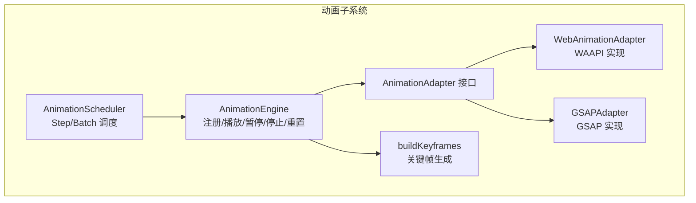
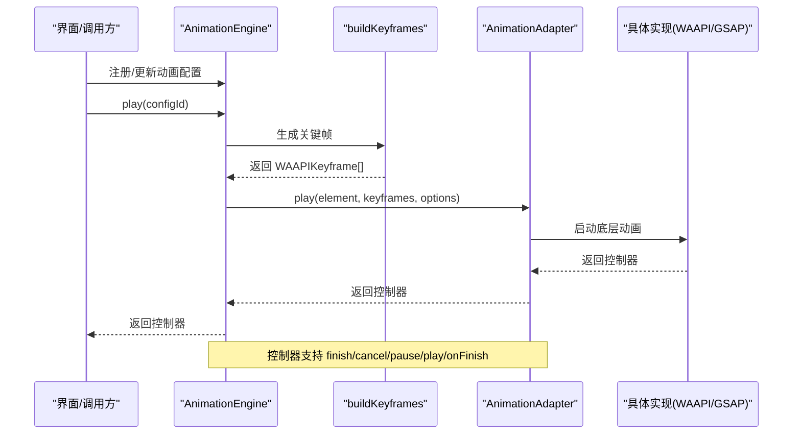
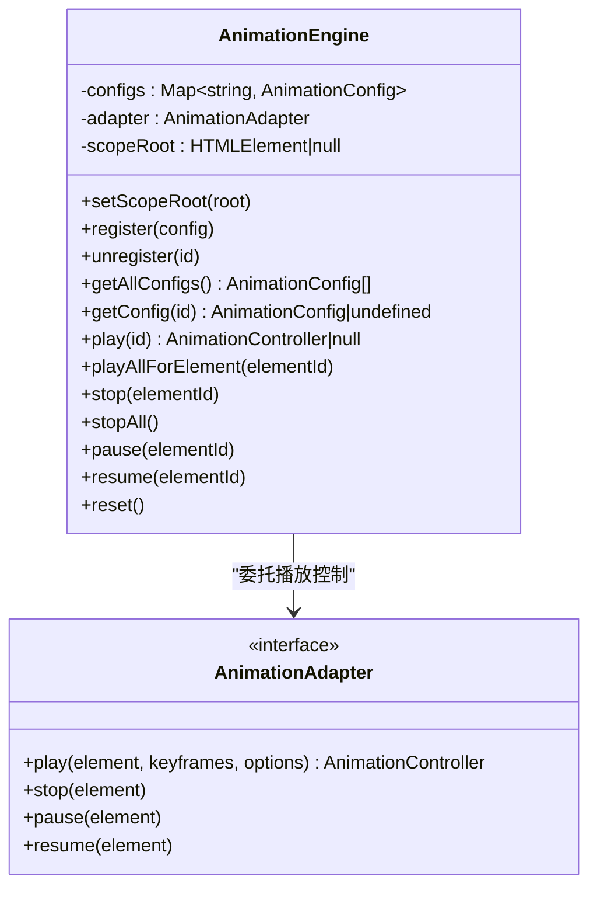
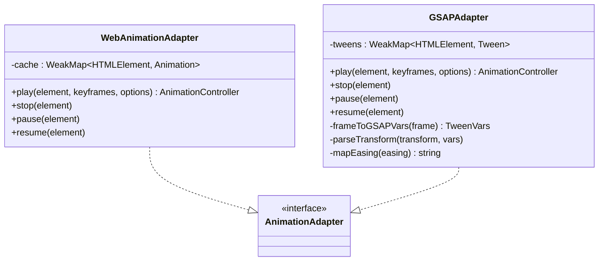
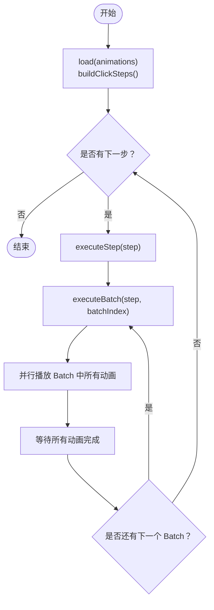
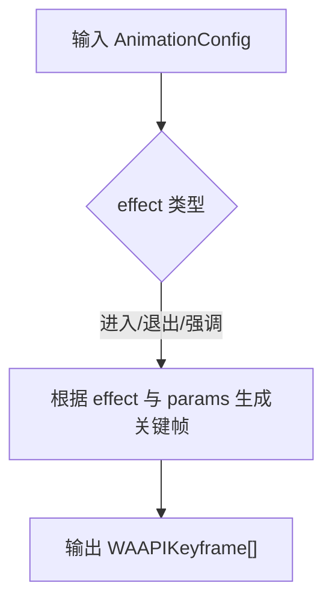
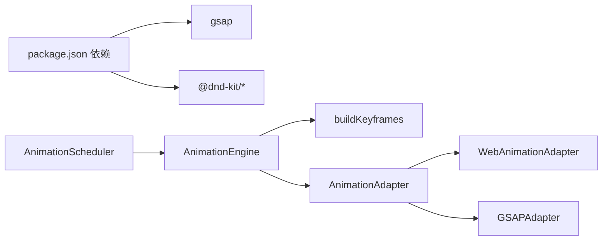

# 动画API

<cite>
**本文引用的文件列表**
- [engine.ts](file://src/animation/engine.ts)
- [adapter.ts](file://src/animation/adapter.ts)
- [webAnimationAdapter.ts](file://src/animation/webAnimationAdapter.ts)
- [gsapAdapter.ts](file://src/animation/gsapAdapter.ts)
- [scheduler.ts](file://src/animation/scheduler.ts)
- [buildKeyframes.ts](file://src/animation/buildKeyframes.ts)
- [animation.ts](file://src/types/animation.ts)
- [index.ts](file://src/animation/index.ts)
- [AnimationPanel.tsx](file://src/components/AnimationPanel.tsx)
- [README.md](file://README.md)
- [package.json](file://package.json)
</cite>

## 目录
1. [简介](#简介)
2. [项目结构](#项目结构)
3. [核心组件](#核心组件)
4. [架构总览](#架构总览)
5. [详细组件分析](#详细组件分析)
6. [依赖关系分析](#依赖关系分析)
7. [性能考量](#性能考量)
8. [故障排查指南](#故障排查指南)
9. [结论](#结论)
10. [附录](#附录)

## 简介
本文件为 AI 课件编辑器动画子系统的参考文档，聚焦于 AnimationEngine 的配置与控制、适配器模式实现（WebAnimationAdapter 与 GSAPAdapter）、AnimationScheduler 的调度机制、关键帧生成与动画序列控制，以及动画配置项、播放参数与回调的完整说明。文档还提供性能优化、内存管理与错误处理的实践建议，帮助开发者在复杂交互场景中稳定高效地使用动画系统。

## 项目结构
动画子系统位于 src/animation 目录，核心文件如下：
- engine.ts：动画引擎主体，负责注册/注销动画配置、构建关键帧、委托播放控制到适配器
- adapter.ts：适配器接口抽象
- webAnimationAdapter.ts：基于原生 Web Animations API 的适配器
- gsapAdapter.ts：基于 GSAP 的适配器，支持从 WAAPI 关键帧映射到 GSAP fromTo 语法
- scheduler.ts：批执行模型的调度器，将动画组织为 Step/Batch 结构并在用户点击时顺序执行
- buildKeyframes.ts：根据动画效果与参数生成 WAAPI 兼容的关键帧
- types/animation.ts：动画系统类型定义（配置、关键帧、控制器、调度相关）
- index.ts：导出动画 API 的公共入口

图表来源
- [engine.ts:1-120](file://src/animation/engine.ts#L1-L120)
- [adapter.ts:1-27](file://src/animation/adapter.ts#L1-L27)
- [webAnimationAdapter.ts:1-67](file://src/animation/webAnimationAdapter.ts#L1-L67)
- [gsapAdapter.ts:1-140](file://src/animation/gsapAdapter.ts#L1-L140)
- [scheduler.ts:1-160](file://src/animation/scheduler.ts#L1-L160)
- [buildKeyframes.ts:1-125](file://src/animation/buildKeyframes.ts#L1-L125)

章节来源
- [engine.ts:1-120](file://src/animation/engine.ts#L1-L120)
- [adapter.ts:1-27](file://src/animation/adapter.ts#L1-L27)
- [webAnimationAdapter.ts:1-67](file://src/animation/webAnimationAdapter.ts#L1-L67)
- [gsapAdapter.ts:1-140](file://src/animation/gsapAdapter.ts#L1-L140)
- [scheduler.ts:1-160](file://src/animation/scheduler.ts#L1-L160)
- [buildKeyframes.ts:1-125](file://src/animation/buildKeyframes.ts#L1-L125)
- [animation.ts:1-113](file://src/types/animation.ts#L1-L113)
- [index.ts:1-8](file://src/animation/index.ts#L1-L8)

## 核心组件
- AnimationEngine：持有动画配置、构建关键帧、通过适配器播放/暂停/恢复/停止动画；支持按元素批量播放与全局重置
- AnimationAdapter：统一的播放控制接口，屏蔽底层实现差异
- WebAnimationAdapter：基于 element.animate 的原生实现，缓存 Animation 对象，提供 finish/cancel/pause/play/onFinish
- GSAPAdapter：基于 GSAP 的实现，将 WAAPI 关键帧映射为 GSAP fromTo 变量，缓存 Tween 对象，提供等价生命周期控制
- AnimationScheduler：将动画序列按 Step/Batch 组织，用户点击触发 Step，Step 内部 Batch 串行、Batch 内动画并行
- buildKeyframes：纯函数，依据 effect 与 params 生成 WAAPI 兼容关键帧数组
- 类型系统：AnimationConfig、WAAPIKeyframe、AnimationOptions、AnimationController、ClickStep、AnimationBatch 等

章节来源
- [engine.ts:1-120](file://src/animation/engine.ts#L1-L120)
- [adapter.ts:1-27](file://src/animation/adapter.ts#L1-L27)
- [webAnimationAdapter.ts:1-67](file://src/animation/webAnimationAdapter.ts#L1-L67)
- [gsapAdapter.ts:1-140](file://src/animation/gsapAdapter.ts#L1-L140)
- [scheduler.ts:1-160](file://src/animation/scheduler.ts#L1-L160)
- [buildKeyframes.ts:1-125](file://src/animation/buildKeyframes.ts#L1-L125)
- [animation.ts:1-113](file://src/types/animation.ts#L1-L113)

## 架构总览
动画系统采用“引擎 + 适配器 + 调度器”的分层架构：
- 引擎层：AnimationEngine 负责配置管理与播放编排
- 适配层：AnimationAdapter 抽象不同底层动画库的差异
- 调度层：AnimationScheduler 将动画序列转换为 Step/Batch 的交互式执行模型
- 关键帧层：buildKeyframes 将业务配置映射为 WAAPI 关键帧

图表来源
- [engine.ts:52-70](file://src/animation/engine.ts#L52-L70)
- [buildKeyframes.ts:7-9](file://src/animation/buildKeyframes.ts#L7-L9)
- [webAnimationAdapter.ts:15-43](file://src/animation/webAnimationAdapter.ts#L15-L43)
- [gsapAdapter.ts:16-60](file://src/animation/gsapAdapter.ts#L16-L60)

章节来源
- [engine.ts:1-120](file://src/animation/engine.ts#L1-L120)
- [buildKeyframes.ts:1-125](file://src/animation/buildKeyframes.ts#L1-L125)
- [webAnimationAdapter.ts:1-67](file://src/animation/webAnimationAdapter.ts#L1-L67)
- [gsapAdapter.ts:1-140](file://src/animation/gsapAdapter.ts#L1-L140)

## 详细组件分析

### AnimationEngine：配置与播放控制
- 配置管理
  - register(config)：注册或更新动画配置
  - unregister(configId)：移除指定配置
  - getAllConfigs()/getConfig(configId)：查询全部或单个配置
  - setScopeRoot(root)：限定 DOM 查询范围（如预览容器），便于隔离
- 播放控制
  - play(configId)：解析元素、生成关键帧、构造 options 并调用适配器播放，返回控制器
  - playAllForElement(elementId)：对某元素的所有已注册动画进行播放
  - stop(elementId)/stopAll()：停止指定元素或全部元素的动画
  - pause(elementId)/resume(elementId)：暂停/恢复指定元素动画
  - reset()：停止全部并清空配置
- 关键帧与选项
  - 使用 buildKeyframes 将 AnimationConfig 映射为 WAAPIKeyframe[]
  - options 包含 duration(ms)、delay(ms)、easing、fill、iterations

图表来源
- [engine.ts:9-119](file://src/animation/engine.ts#L9-L119)
- [adapter.ts:7-26](file://src/animation/adapter.ts#L7-L26)

章节来源
- [engine.ts:1-120](file://src/animation/engine.ts#L1-L120)
- [buildKeyframes.ts:1-125](file://src/animation/buildKeyframes.ts#L1-L125)
- [animation.ts:72-98](file://src/types/animation.ts#L72-L98)

### 适配器模式：WebAnimationAdapter 与 GSAPAdapter
- WebAnimationAdapter
  - 基于 element.animate，缓存 WeakMap<HTMLElement, Animation>
  - 提供 finish/cancel/pause/play/onFinish 生命周期回调
  - 自动取消同元素已有动画，避免冲突
- GSAPAdapter
  - 缓存 WeakMap<HTMLElement, Tween>
  - 将 WAAPI 关键帧映射为 GSAP fromTo 变量，处理 transform 分量（translate/scale/rotate）
  - 支持常用 easing 名称映射（linear/ease-in/ease-out/ease-in-out/bounce/elastic）
  - 提供等价的生命周期控制与 onComplete 回调

图表来源
- [webAnimationAdapter.ts:12-66](file://src/animation/webAnimationAdapter.ts#L12-L66)
- [gsapAdapter.ts:13-139](file://src/animation/gsapAdapter.ts#L13-L139)
- [adapter.ts:7-26](file://src/animation/adapter.ts#L7-L26)

章节来源
- [webAnimationAdapter.ts:1-67](file://src/animation/webAnimationAdapter.ts#L1-L67)
- [gsapAdapter.ts:1-140](file://src/animation/gsapAdapter.ts#L1-L140)
- [animation.ts:72-98](file://src/types/animation.ts#L72-L98)

### AnimationScheduler：调度机制与序列控制
- Step/Batch 执行模型
  - Step：用户点击触发的一组动画
  - Batch：Step 内串行执行的动画组
  - Batch 内动画并行播放
- 构建逻辑
  - buildClickSteps：根据 startType 将动画序列拆分为 ClickStep 列表
    - startType='click'：开启新 Step
    - startType='withPrev'：加入当前 Batch（若无则新建）
    - startType='afterPrev'：在当前 Step 新建下一 Batch（若无 Step 则新建）
- 运行时控制
  - load(animations)：加载并构建步骤
  - playNextStep()/playFromStep(stepIndex)：前进/从指定 Step 开始播放
  - playPreviousStep()：回退一步，取消运行中的动画并重播当前 Step
  - canGoBack()/canAdvance()：导航能力判断
  - reset()：清理状态与控制器
  - 运行中控制器管理：runningControllers 记录每个动画的控制器，用于完成回调与取消

图表来源
- [scheduler.ts:66-108](file://src/animation/scheduler.ts#L66-L108)
- [scheduler.ts:135-159](file://src/animation/scheduler.ts#L135-L159)

章节来源
- [scheduler.ts:1-160](file://src/animation/scheduler.ts#L1-L160)
- [README.md:6-15](file://README.md#L6-L15)

### 关键帧生成：buildKeyframes
- 输入：AnimationConfig.effect 与 params
- 输出：WAAPIKeyframe[]（包含 offset、transform、opacity、filter 等属性）
- 支持效果
  - 进入：fadeIn、zoomIn、slideIn、flyIn、rotateIn
  - 强调：pulse、shake、blink、scale、highlight
  - 退出：fadeOut、zoomOut、slideOut、flyOut、rotateOut
- 参数映射
  - slide/fly：方向与距离
  - scale：起止缩放
  - highlight：亮度系数
  - 默认值与边界处理由函数内部保证

图表来源
- [buildKeyframes.ts:7-109](file://src/animation/buildKeyframes.ts#L7-L109)

章节来源
- [buildKeyframes.ts:1-125](file://src/animation/buildKeyframes.ts#L1-L125)
- [animation.ts:6-12](file://src/types/animation.ts#L6-L12)

### 动画配置与播放参数
- AnimationConfig 字段
  - id、elementId、name、enable、type、effect、startType、duration、delay、easing、repeatCount、params
- params 类型
  - FadeParams、SlideParams、ScaleParams、RotateParams、HighlightParams
- AnimationOptions（传递给适配器）
  - duration、delay、easing、fill、iterations
- 回调
  - AnimationController.onFinish(callback)：动画完成或取消时触发

章节来源
- [animation.ts:26-98](file://src/types/animation.ts#L26-L98)
- [engine.ts:61-69](file://src/animation/engine.ts#L61-L69)

### 在界面中的使用示例
- AnimationPanel.tsx 展示了如何在 React 面板中：
  - 构建 AnimationConfig 并注册到 AnimationEngine
  - 通过 buildClickSteps 计算 Step 序列
  - 提供“播放”“从这里播放”等操作
  - 自动修复 startType 以符合 Step/Batch 规则

章节来源
- [AnimationPanel.tsx:87-302](file://src/components/AnimationPanel.tsx#L87-L302)
- [AnimationPanel.tsx:337-357](file://src/components/AnimationPanel.tsx#L337-L357)

## 依赖关系分析
- 外部依赖
  - gsap：GSAPAdapter 使用 GSAP.fromTo 与 easing 映射
  - @dnd-kit/*：AnimationPanel 使用拖拽排序与键盘传感器
- 内部依赖
  - engine.ts 依赖 buildKeyframes.ts 生成关键帧
  - scheduler.ts 依赖 engine.ts 的播放控制与控制器管理
  - webAnimationAdapter.ts 与 gsapAdapter.ts 实现 AnimationAdapter 接口
  - index.ts 统一导出 API

图表来源
- [package.json:12-20](file://package.json#L12-L20)
- [engine.ts:3,60](file://src/animation/engine.ts#L3,L60)
- [webAnimationAdapter.ts:12](file://src/animation/webAnimationAdapter.ts#L12)
- [gsapAdapter.ts:13](file://src/animation/gsapAdapter.ts#L13)
- [scheduler.ts:2,56](file://src/animation/scheduler.ts#L2,L56)

章节来源
- [package.json:1-34](file://package.json#L1-L34)
- [index.ts:1-8](file://src/animation/index.ts#L1-L8)

## 性能考量
- 关键帧数量与复杂度
  - 尽量减少关键帧数量，优先使用内置效果（fadeIn/zoomIn 等），避免过度自定义
  - transform 与 opacity 的组合通常比逐像素滤镜更高效
- 并发与串行
  - Step 内 Batch 并行，Batch 内动画并行，合理拆分可提升流畅度
  - 避免在同一帧内对大量元素施加复杂滤镜
- 缓存与复用
  - 适配器内部使用 WeakMap 缓存底层动画对象，避免重复创建
  - 重复播放同一动画时，先 stop 再 play，确保资源回收
- 渲染与合成
  - 优先使用 transform/opacity，减少布局与绘制开销
  - 避免频繁读取布局信息导致强制同步布局
- 内存管理
  - 使用 AnimationScheduler.reset()/AnimationEngine.reset() 清理控制器与配置
  - 在组件卸载时调用 stopAll()/stop(elementId)，防止悬挂引用

[本节为通用性能建议，不直接分析特定文件]

## 故障排查指南
- 常见问题与定位
  - 元素未找到：检查 setScopeRoot 是否正确设置，确认元素是否带有 data-element-id
  - 动画不生效：确认 effect 与 params 是否匹配；检查 easing 名称是否被映射
  - 无法停止/暂停：确认控制器是否成功返回；注意 GSAPAdapter 的 kill 与 WAAPI 的 cancel 差异
  - Step/Batch 顺序异常：核对 startType 与 buildClickSteps 的行为
- 建议流程
  - 逐步缩小范围：先验证 buildKeyframes 输出，再验证适配器播放
  - 使用 AnimationEngine.getAllConfigs() 与 getConfig() 核对配置
  - 在 AnimationScheduler 中打印 steps 结构，确认 Step/Batch 分组
  - 卸载前调用 stopAll()/reset()，避免残留控制器影响后续测试

章节来源
- [engine.ts:19-30](file://src/animation/engine.ts#L19-L30)
- [scheduler.ts:66-70](file://src/animation/scheduler.ts#L66-L70)
- [webAnimationAdapter.ts:45-51](file://src/animation/webAnimationAdapter.ts#L45-L51)
- [gsapAdapter.ts:62-68](file://src/animation/gsapAdapter.ts#L62-L68)

## 结论
该动画系统通过清晰的分层设计与适配器模式，实现了跨底层库的统一播放控制；结合 Step/Batch 的交互式调度模型，满足课件编辑器的演示需求。配合完善的类型系统与关键帧生成工具，开发者可以快速构建高质量的动画序列，并在性能与稳定性之间取得良好平衡。

[本节为总结性内容，不直接分析特定文件]

## 附录

### API 一览（导出）
- AnimationEngine：构造函数、setScopeRoot、register/unregister/getAllConfigs/getConfig、play/playAllForElement/stop/stopAll/pause/resume/reset
- AnimationAdapter：play/stop/pause/resume
- WebAnimationAdapter/GSAPAdapter：各自实现的播放与生命周期控制
- AnimationScheduler：load/playNextStep/playFromStep/playPreviousStep/canGoBack/canAdvance/reset
- buildKeyframes：根据配置生成关键帧
- 类型：AnimationConfig、WAAPIKeyframe、AnimationOptions、AnimationController、ClickStep、AnimationBatch

章节来源
- [index.ts:1-8](file://src/animation/index.ts#L1-L8)
- [engine.ts:1-120](file://src/animation/engine.ts#L1-L120)
- [scheduler.ts:1-160](file://src/animation/scheduler.ts#L1-L160)
- [buildKeyframes.ts:1-125](file://src/animation/buildKeyframes.ts#L1-L125)
- [animation.ts:1-113](file://src/types/animation.ts#L1-L113)