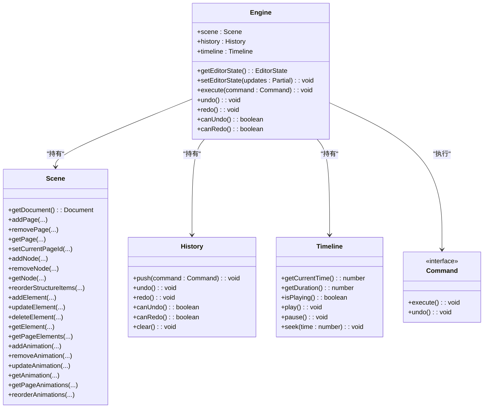
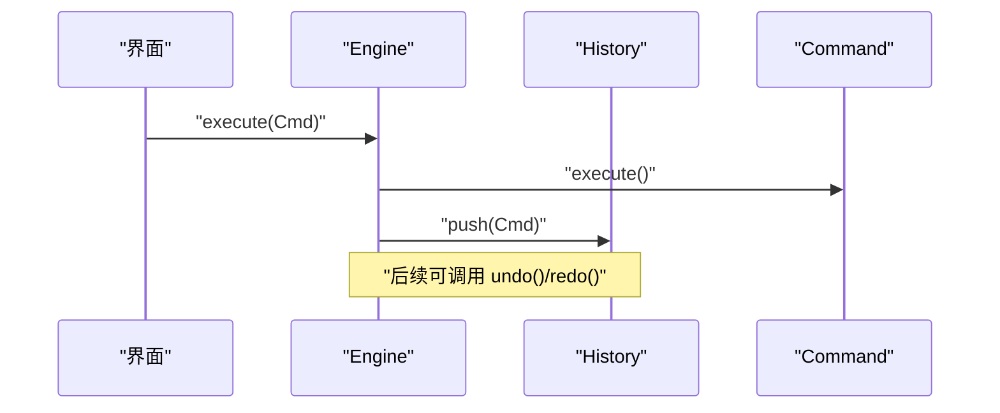
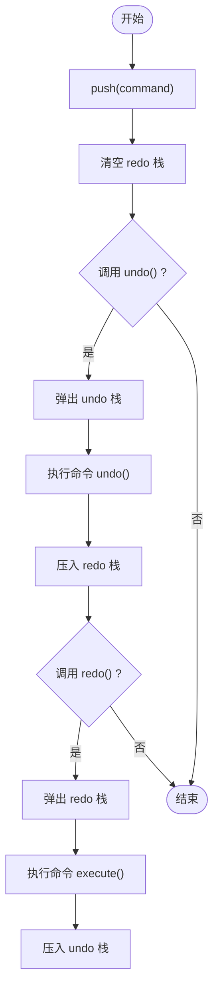
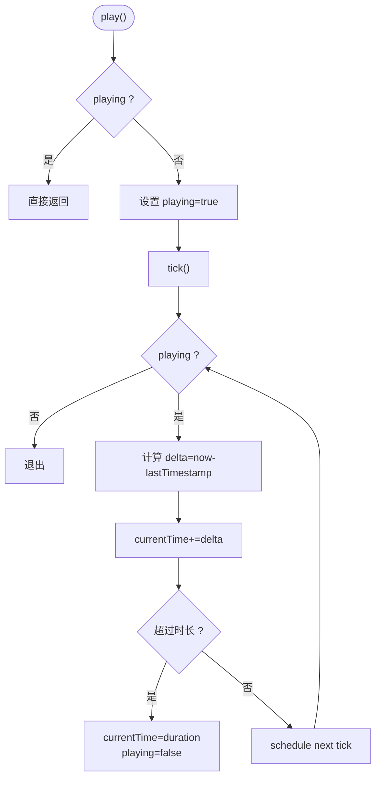
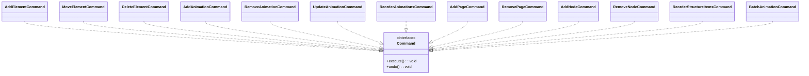
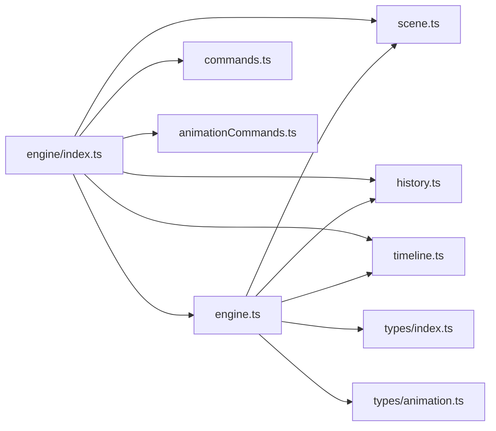

# 引擎API

<cite>
**本文引用的文件**
- [src/engine/engine.ts](file://src/engine/engine.ts)
- [src/engine/index.ts](file://src/engine/index.ts)
- [src/engine/commands.ts](file://src/engine/commands.ts)
- [src/engine/history.ts](file://src/engine/history.ts)
- [src/engine/timeline.ts](file://src/engine/timeline.ts)
- [src/engine/scene.ts](file://src/engine/scene.ts)
- [src/engine/animationCommands.ts](file://src/engine/animationCommands.ts)
- [src/types/index.ts](file://src/types/index.ts)
- [src/types/animation.ts](file://src/types/animation.ts)
- [src/App.tsx](file://src/App.tsx)
- [README.md](file://README.md)
</cite>

## 目录
1. [简介](#简介)
2. [项目结构](#项目结构)
3. [核心组件](#核心组件)
4. [架构总览](#架构总览)
5. [详细组件分析](#详细组件分析)
6. [依赖关系分析](#依赖关系分析)
7. [性能考量](#性能考量)
8. [故障排查指南](#故障排查指南)
9. [结论](#结论)
10. [附录](#附录)

## 简介
本文件为 AI 课件编辑器引擎的 API 参考文档，聚焦 Engine 类及其协作组件，涵盖命令执行、撤销/重做、状态管理、历史记录与时间轴等能力。文档面向不同技术背景的读者，既提供高层概览，也给出可追溯到源码的细节与图示。

## 项目结构
引擎核心位于 src/engine，围绕 Engine、History、Timeline、Scene 与一组命令类组织；类型定义集中在 src/types；应用层在 src/App.tsx 中演示如何创建引擎、绑定撤销/重做快捷键、执行命令以及与动画系统联动。

```mermaid
graph TB
subgraph "引擎核心"
Engine["Engine<br/>执行命令/撤销/重做/状态"]
History["History<br/>撤销栈/重做栈"]
Timeline["Timeline<br/>时间轴播放/暂停/跳转"]
Scene["Scene<br/>文档/页面/元素/动画CRUD"]
end
subgraph "命令族"
CmdAdd["AddElementCommand"]
CmdMove["MoveElementCommand"]
CmdDel["DeleteElementCommand"]
CmdAnimAdd["AddAnimationCommand"]
CmdAnimRm["RemoveAnimationCommand"]
CmdAnimUpd["UpdateAnimationCommand"]
CmdAnimReorder["ReorderAnimationsCommand"]
CmdPageAdd["AddPageCommand"]
CmdPageRm["RemovePageCommand"]
CmdNodeAdd["AddNodeCommand"]
CmdNodeRm["RemoveNodeCommand"]
CmdReorderStruct["ReorderStructureItemsCommand"]
CmdBatchAnim["BatchAnimationCommand"]
end
subgraph "类型与动画"
Types["types/index.ts<br/>EditorState/Command/Document..."]
AnimTypes["types/animation.ts<br/>AnimationConfig/Effect/Easing..."]
end
Engine --> Scene
Engine --> History
Engine --> Timeline
Engine --> Types
Engine --> AnimTypes
Engine --> CmdAdd
Engine --> CmdMove
Engine --> CmdDel
Engine --> CmdAnimAdd
Engine --> CmdAnimRm
Engine --> CmdAnimUpd
Engine --> CmdAnimReorder
Engine --> CmdPageAdd
Engine --> CmdPageRm
Engine --> CmdNodeAdd
Engine --> CmdNodeRm
Engine --> CmdReorderStruct
Engine --> CmdBatchAnim
```

图表来源
- [src/engine/engine.ts:1-54](file://src/engine/engine.ts#L1-L54)
- [src/engine/history.ts:1-45](file://src/engine/history.ts#L1-L45)
- [src/engine/timeline.ts:1-66](file://src/engine/timeline.ts#L1-L66)
- [src/engine/scene.ts:1-273](file://src/engine/scene.ts#L1-L273)
- [src/engine/commands.ts:1-280](file://src/engine/commands.ts#L1-L280)
- [src/engine/animationCommands.ts:1-44](file://src/engine/animationCommands.ts#L1-L44)
- [src/types/index.ts:104-159](file://src/types/index.ts#L104-L159)
- [src/types/animation.ts:26-113](file://src/types/animation.ts#L26-L113)

章节来源
- [src/engine/index.ts:1-16](file://src/engine/index.ts#L1-L16)
- [src/engine/engine.ts:1-54](file://src/engine/engine.ts#L1-L54)

## 核心组件
- Engine：引擎入口，聚合 Scene、History、Timeline，提供 execute()/undo()/redo()/canUndo()/canRedo() 与 getEditorState()/setEditorState()。
- History：基于命令栈的撤销/重做机制，支持清空。
- Timeline：时间轴播放控制（播放/暂停/跳转），内部使用 requestAnimationFrame 驱动。
- Scene：文档与场景数据的持久化容器，提供页面、节点、元素、动画的增删改查与排序。
- 命令族：实现 Command 接口的一系列命令类，封装具体操作与逆向动作。
- 类型系统：EditorState、Command、Document、AnimationConfig 等类型定义。

章节来源
- [src/engine/engine.ts:7-49](file://src/engine/engine.ts#L7-L49)
- [src/engine/history.ts:3-44](file://src/engine/history.ts#L3-L44)
- [src/engine/timeline.ts:1-66](file://src/engine/timeline.ts#L1-L66)
- [src/engine/scene.ts:3-247](file://src/engine/scene.ts#L3-L247)
- [src/types/index.ts:104-159](file://src/types/index.ts#L104-L159)

## 架构总览
下图展示 Engine 与各子系统之间的交互关系及职责边界。

图表来源
- [src/engine/engine.ts:7-49](file://src/engine/engine.ts#L7-L49)
- [src/engine/history.ts:3-44](file://src/engine/history.ts#L3-L44)
- [src/engine/timeline.ts:1-66](file://src/engine/timeline.ts#L1-L66)
- [src/engine/scene.ts:3-247](file://src/engine/scene.ts#L3-L247)
- [src/types/index.ts:107-110](file://src/types/index.ts#L107-L110)

## 详细组件分析

### Engine 类 API
- 职责
  - 统一的状态变更入口：所有状态变化必须通过 execute(command) 触发。
  - 撤销/重做：委托给 History。
  - 编辑器状态：EditorState 用于工具栏、选中、悬停、视口等 UI 状态。
  - 时间轴：Timeline 提供时间推进与播放控制。
- 关键方法
  - getEditorState(): 返回当前编辑器状态对象。
  - setEditorState(updates: Partial<EditorState>): 合并更新编辑器状态。
  - execute(command: Command): 执行命令并压入历史栈。
  - undo(): 从历史栈弹出并调用命令的 undo()。
  - redo(): 从重做栈弹出并重新执行命令。
  - canUndo(): 历史栈是否非空。
  - canRedo(): 重做栈是否非空。
- 参数与返回
  - get/setEditorState：无返回值；setEditorState 使用部分更新合并。
  - execute/undo/redo/canUndo/canRedo：无返回值或布尔值。
- 异常处理
  - 历史栈为空时，undo/redo 直接返回，不抛异常。
- 使用示例（路径）
  - 快捷键撤销/重做与刷新：[src/App.tsx:107-150](file://src/App.tsx#L107-L150)
  - 删除元素命令执行：[src/App.tsx:136-145](file://src/App.tsx#L136-L145)
  - 初始化引擎：[src/App.tsx:11-12](file://src/App.tsx#L11-L12)

图表来源
- [src/engine/engine.ts:29-32](file://src/engine/engine.ts#L29-L32)
- [src/engine/history.ts:7-10](file://src/engine/history.ts#L7-L10)

章节来源
- [src/engine/engine.ts:21-48](file://src/engine/engine.ts#L21-L48)
- [src/App.tsx:107-150](file://src/App.tsx#L107-L150)
- [src/App.tsx:136-145](file://src/App.tsx#L136-L145)

### History 历史记录机制
- 数据结构
  - undoStack/redoStack：命令数组栈。
- 行为
  - push：将命令压入 undoStack 并清空 redoStack。
  - undo：弹出命令并调用其 undo()，再压入 redoStack。
  - redo：弹出命令并调用其 execute()，再压入 undoStack。
  - canUndo/canRedo：判断栈是否非空。
  - clear：清空两个栈。
- 复杂度
  - 入栈/出栈均为 O(1)。
- 错误处理
  - 空栈时直接返回，不抛异常。

图表来源
- [src/engine/history.ts:7-30](file://src/engine/history.ts#L7-L30)

章节来源
- [src/engine/history.ts:3-44](file://src/engine/history.ts#L3-L44)

### Timeline 时间轴功能
- 属性
  - 当前时间、总时长、播放状态、帧回调句柄等。
- 方法
  - getCurrentTime()/getDuration()/isPlaying()
  - play()/pause()/seek(time)
  - tick：使用 requestAnimationFrame 循环推进时间，到达时长后自动停止。
- 行为
  - play：若未在播放则启动循环；tick 计算帧间隔并累加时间。
  - pause：取消帧回调并将状态置为非播放。
  - seek：限制时间在 [0, duration] 区间内。
- 复杂度
  - 每帧 O(1)，无额外存储开销。
- 注意
  - 该实现为时间推进器，不直接持有动画列表；动画系统通过其他模块集成。

图表来源
- [src/engine/timeline.ts:25-64](file://src/engine/timeline.ts#L25-L64)

章节来源
- [src/engine/timeline.ts:1-66](file://src/engine/timeline.ts#L1-L66)

### Scene 场景数据层
- 职责
  - 维护 Document 结构与当前页上下文，提供页面、节点、元素、动画的 CRUD 与排序。
- 关键点
  - 页面与节点插入位置可指定索引；结构项按顺序维护。
  - 元素更新时处理父子关系与分组子元素列表。
  - 动画按页维度管理，支持重排。
- 复杂度
  - 大多数操作为 O(1) 或 O(n)（n 为某映射表大小）。

章节来源
- [src/engine/scene.ts:18-233](file://src/engine/scene.ts#L18-L233)

### 命令接口与实现
- Command 接口
  - execute(): void
  - undo(): void
- 常见命令
  - AddElementCommand、MoveElementCommand、DeleteElementCommand
  - AddAnimationCommand、RemoveAnimationCommand、UpdateAnimationCommand、ReorderAnimationsCommand
  - AddPageCommand、RemovePageCommand、AddNodeCommand、RemoveNodeCommand、ReorderStructureItemsCommand
  - BatchAnimationCommand：批处理动画配置快照，避免内部注册/注销导致的命令爆炸。
- 设计要点
  - 每个命令封装“一次原子性操作”与其逆操作。
  - MoveElementCommand/UpdateAnimationCommand 在构造时捕获 before 快照，确保精确回滚。
  - ReorderAnimationsCommand/ReorderStructureItemsCommand 记录前后顺序，便于撤销。

图表来源
- [src/engine/commands.ts:4-280](file://src/engine/commands.ts#L4-L280)
- [src/engine/animationCommands.ts:14-43](file://src/engine/animationCommands.ts#L14-L43)
- [src/types/index.ts:107-110](file://src/types/index.ts#L107-L110)

章节来源
- [src/engine/commands.ts:4-280](file://src/engine/commands.ts#L4-L280)
- [src/engine/animationCommands.ts:14-43](file://src/engine/animationCommands.ts#L14-L43)

### EditorState 状态管理
- 结构
  - selectedElementIds: string[]
  - viewport: { x, y, zoom }
  - toolMode: 'select' | 'pan' | 'shape' | 'text' | 'image'
  - hoveredElementId: string | null
- 用途
  - 与 UI 交互状态解耦，分离自场景数据。
  - 支持工具切换、选中高亮、悬停提示、视口平移缩放。
- 初始化
  - createMockEditorState() 提供默认状态。

章节来源
- [src/types/index.ts:144-159](file://src/types/index.ts#L144-L159)

### 动画配置类型
- AnimationConfig：包含 id、elementId、name、enable、type、effect、startType、duration、delay、easing、repeatCount、params 等字段。
- 支持效果与参数类型：淡入/缩放/滑入/飞入/旋转/强调/高亮等。
- 与时间轴的关系
  - Timeline 为时间推进器；动画系统通过其他模块（如 AnimationEngine）解析 AnimationConfig 并驱动渲染。

章节来源
- [src/types/animation.ts:26-71](file://src/types/animation.ts#L26-L71)
- [src/types/animation.ts:104-113](file://src/types/animation.ts#L104-L113)

## 依赖关系分析
- 导出入口
  - src/engine/index.ts 暴露 Engine、History、Timeline、Scene、命令族与 snapEngine 等。
- 运行时依赖
  - Engine 依赖 Scene、History、Timeline。
  - 命令实现依赖 Scene 以读写文档。
  - 应用层在 src/App.tsx 中创建引擎并绑定键盘事件与按钮点击。

图表来源
- [src/engine/index.ts:4-16](file://src/engine/index.ts#L4-L16)
- [src/engine/engine.ts:1-5](file://src/engine/engine.ts#L1-L5)
- [src/types/index.ts:1-2](file://src/types/index.ts#L1-L2)
- [src/types/animation.ts:1-2](file://src/types/animation.ts#L1-L2)

章节来源
- [src/engine/index.ts:1-16](file://src/engine/index.ts#L1-L16)
- [src/engine/engine.ts:1-5](file://src/engine/engine.ts#L1-L5)

## 性能考量
- 命令栈操作
  - History 的 push/undo/redo 为 O(1)，适合高频撤销/重做。
- 场景数据访问
  - Scene 对元素/动画的查找与更新为 O(1)（基于 id 映射），但涉及父子关系调整时有 O(n) 分支处理。
- 时间轴
  - Timeline 使用 requestAnimationFrame，每帧仅做时间推进与边界检查，开销极低。
- 批量动画
  - BatchAnimationCommand 通过快照与一次性注册/注销减少中间状态命令数量，降低历史膨胀风险。

## 故障排查指南
- 撤销/重做无效
  - 检查 canUndo()/canRedo() 是否为 true；确认历史栈非空。
  - 确认 execute() 是否被调用，且命令实现了正确的 undo()。
- 状态未同步
  - 确保在执行命令后调用 refresh() 或触发 UI 重渲染。
  - 检查 EditorState 是否通过 setEditorState 更新。
- 动画不生效
  - 确认动画已启用（enable=true）并已注册到动画引擎。
  - 检查页面切换或动画变更后是否重新加载调度器。
- 快捷键冲突
  - 确认未在输入框内触发撤销/重做；应用层已过滤输入类目标。

章节来源
- [src/App.tsx:107-150](file://src/App.tsx#L107-L150)
- [src/App.tsx:28-74](file://src/App.tsx#L28-L74)

## 结论
Engine 将命令式状态变更、历史记录与时间轴有机结合，形成清晰的编辑器内核。通过严格的命令接口与 Scene 抽象，保证了状态一致性与可撤销性；配合 EditorState 实现 UI 状态与业务数据的解耦。建议在实际使用中遵循“所有状态变更经由 engine.execute”的原则，并结合应用层的刷新与动画系统集成，获得稳定可靠的编辑体验。

## 附录
- 引擎初始化与使用示例（路径）
  - 初始化引擎：[src/App.tsx:11-12](file://src/App.tsx#L11-L12)
  - 执行删除元素命令：[src/App.tsx:136-145](file://src/App.tsx#L136-L145)
  - 撤销/重做快捷键绑定：[src/App.tsx:107-150](file://src/App.tsx#L107-L150)
  - 动画面板与步骤构建说明：[README.md:6-15](file://README.md#L6-L15)