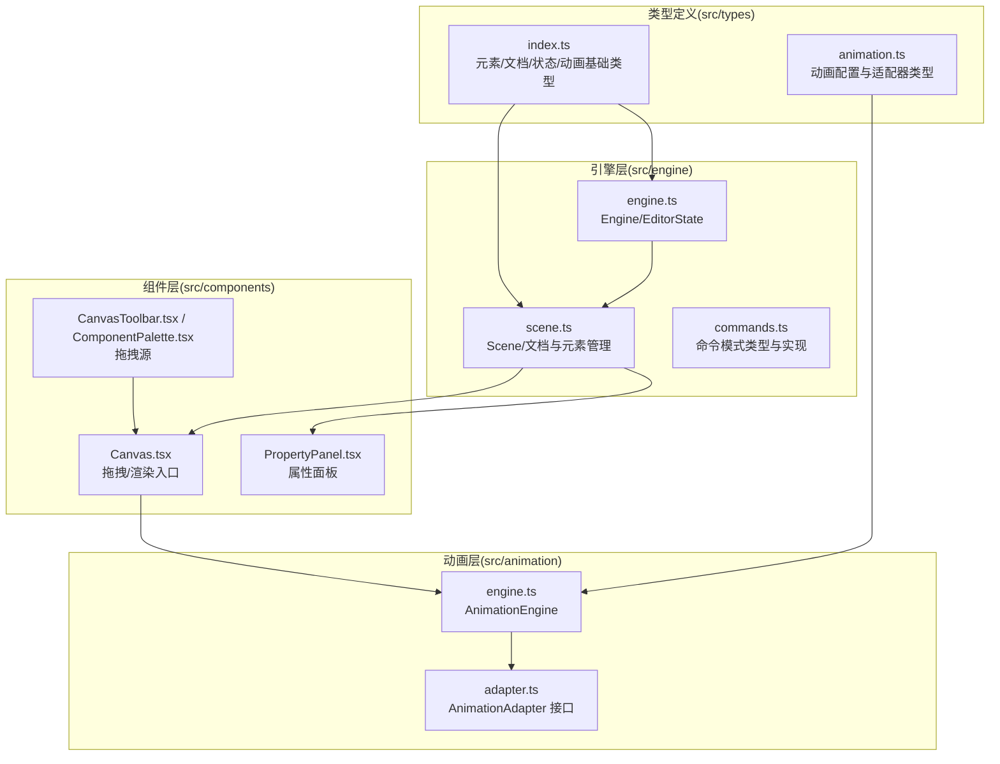
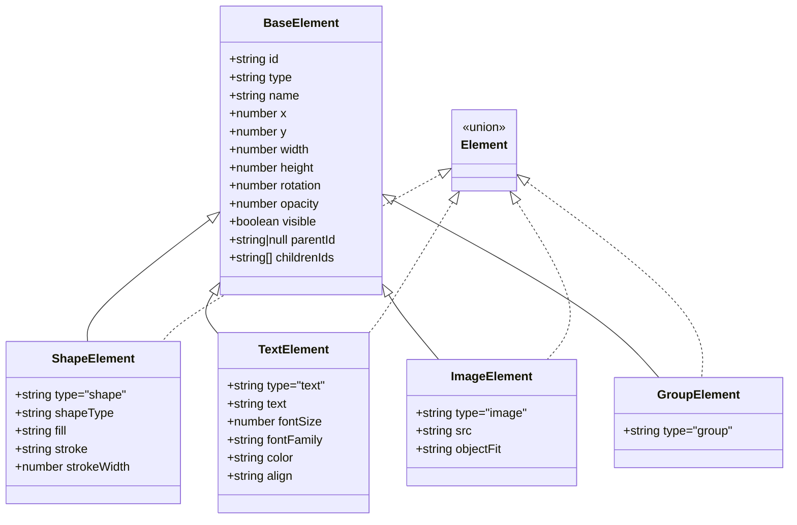
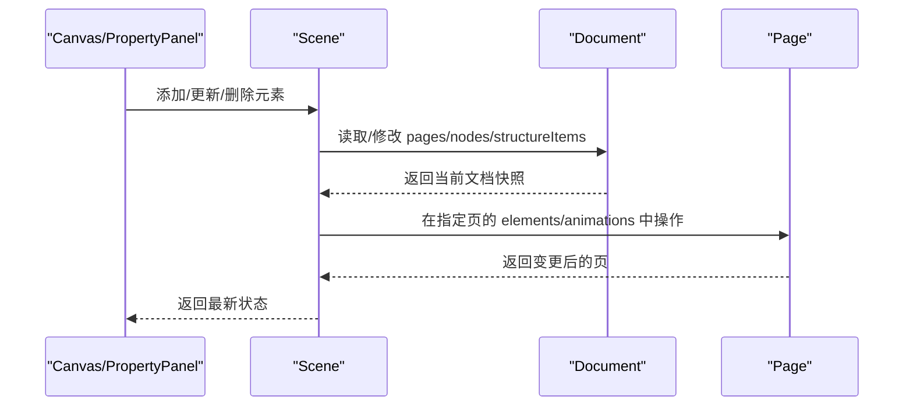
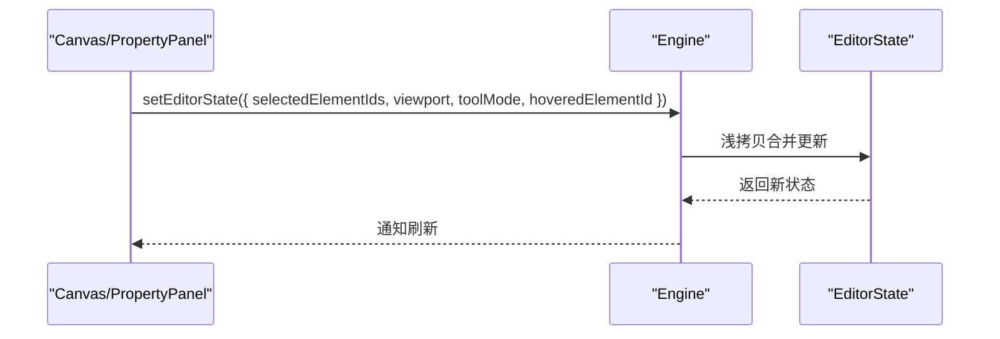
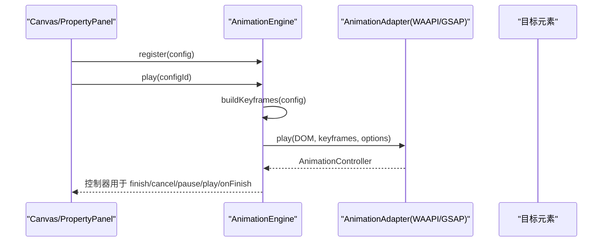
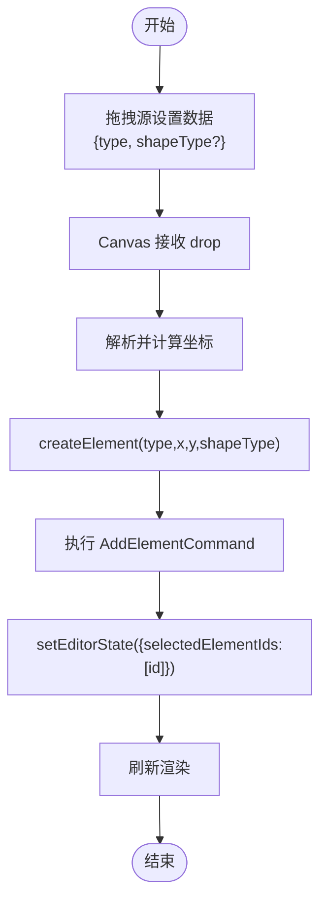
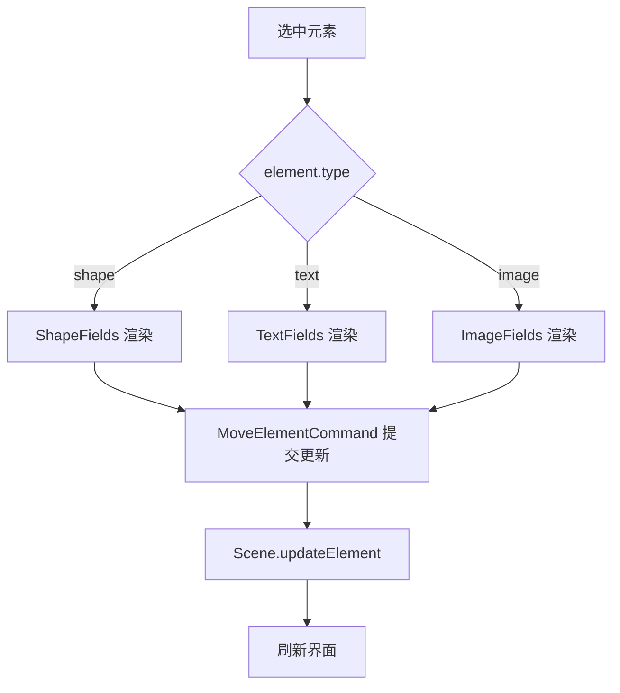
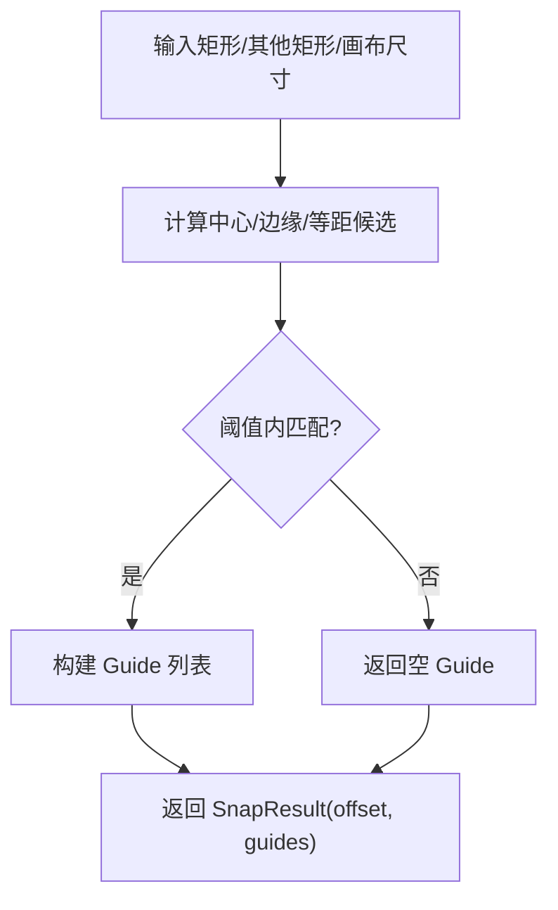
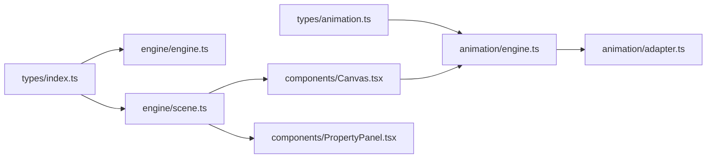

# 类型定义

<cite>
**本文引用的文件**
- [src/types/index.ts](file://src/types/index.ts)
- [src/types/animation.ts](file://src/types/animation.ts)
- [src/engine/engine.ts](file://src/engine/engine.ts)
- [src/engine/scene.ts](file://src/engine/scene.ts)
- [src/engine/commands.ts](file://src/engine/commands.ts)
- [src/animation/engine.ts](file://src/animation/engine.ts)
- [src/animation/adapter.ts](file://src/animation/adapter.ts)
- [src/components/Canvas.tsx](file://src/components/Canvas.tsx)
- [src/components/PropertyPanel.tsx](file://src/components/PropertyPanel.tsx)
- [src/components/CanvasToolbar.tsx](file://src/components/CanvasToolbar.tsx)
- [src/components/ComponentPalette.tsx](file://src/components/ComponentPalette.tsx)
- [src/engine/snapEngine.ts](file://src/engine/snapEngine.ts)
</cite>

## 目录
1. [简介](#简介)
2. [项目结构](#项目结构)
3. [核心类型](#核心类型)
4. [架构总览](#架构总览)
5. [详细组件分析](#详细组件分析)
6. [依赖分析](#依赖分析)
7. [性能考量](#性能考量)
8. [故障排查指南](#故障排查指南)
9. [结论](#结论)
10. [附录：类型最佳实践与扩展指南](#附录类型最佳实践与扩展指南)

## 简介
本文件为 AI 课件编辑器类型系统的完整参考文档，聚焦于以下核心类型与概念：
- 文档结构：Document、Page、Node、StructureItem
- 元素类型：BaseElement 及其子类型 ShapeElement、TextElement、ImageElement、GroupElement（统称 Element）
- 动画配置：AnimationConfig 及其参数类型 AnimationParams、FadeParams、SlideParams、ScaleParams、RotateParams、HighlightParams
- 编辑状态：Viewport、ToolMode、EditorState
- 动画引擎类型：AnimationEngine、AnimationAdapter、WAAPIKeyframe、AnimationOptions、AnimationController、AnimationBatch、ClickStep

文档将系统阐述接口继承关系、泛型使用与类型约束，给出类型别名、联合类型与条件类型的使用示例，并总结类型安全编程的最佳实践、类型推导与类型断言的正确用法，最后提供扩展点与自定义类型的实现指南。

## 项目结构
类型系统主要分布在 types 目录中，配合 engine 与 animation 子系统进行落地。核心关系如下：

图示来源
- [src/types/index.ts:1-159](file://src/types/index.ts#L1-L159)
- [src/types/animation.ts:1-113](file://src/types/animation.ts#L1-L113)
- [src/engine/engine.ts:1-54](file://src/engine/engine.ts#L1-L54)
- [src/engine/scene.ts:1-273](file://src/engine/scene.ts#L1-L273)
- [src/engine/commands.ts:1-280](file://src/engine/commands.ts#L1-L280)
- [src/animation/engine.ts:1-89](file://src/animation/engine.ts#L1-L89)
- [src/animation/adapter.ts:1-26](file://src/animation/adapter.ts#L1-L26)
- [src/components/Canvas.tsx:1-191](file://src/components/Canvas.tsx#L1-L191)
- [src/components/PropertyPanel.tsx:1-332](file://src/components/PropertyPanel.tsx#L1-L332)
- [src/components/CanvasToolbar.tsx:1-26](file://src/components/CanvasToolbar.tsx#L1-L26)
- [src/components/ComponentPalette.tsx:1-26](file://src/components/ComponentPalette.tsx#L1-L26)

章节来源
- [src/types/index.ts:1-159](file://src/types/index.ts#L1-L159)
- [src/types/animation.ts:1-113](file://src/types/animation.ts#L1-L113)
- [src/engine/engine.ts:1-54](file://src/engine/engine.ts#L1-L54)
- [src/engine/scene.ts:1-273](file://src/engine/scene.ts#L1-L273)
- [src/engine/commands.ts:1-280](file://src/engine/commands.ts#L1-L280)
- [src/animation/engine.ts:1-89](file://src/animation/engine.ts#L1-L89)
- [src/animation/adapter.ts:1-26](file://src/animation/adapter.ts#L1-L26)
- [src/components/Canvas.tsx:1-191](file://src/components/Canvas.tsx#L1-L191)
- [src/components/PropertyPanel.tsx:1-332](file://src/components/PropertyPanel.tsx#L1-L332)
- [src/components/CanvasToolbar.tsx:1-26](file://src/components/CanvasToolbar.tsx#L1-L26)
- [src/components/ComponentPalette.tsx:1-26](file://src/components/ComponentPalette.tsx#L1-L26)

## 核心类型
本节对关键类型进行分门别类的梳理，强调接口继承、联合类型、类型别名与约束。

- 元素类型族
  - 基类：BaseElement 定义通用几何与可见性字段
  - 子类：ShapeElement、TextElement、ImageElement、GroupElement
  - 联合类型：Element = ShapeElement | TextElement | ImageElement | GroupElement
  - 关键约束：各子类通过字面量联合类型限定 type 字段，确保运行时可区分
  - 示例路径：[src/types/index.ts:12-54](file://src/types/index.ts#L12-L54)

- 文档与页面结构
  - 结构项：StructureItem = { type: 'node'|'page'; id: string }
  - 页面：Page 包含背景、元素映射、动画映射
  - 文档：Document 包含 pages、nodes、structureItems、currentPageId
  - 示例路径：[src/types/index.ts:60-84](file://src/types/index.ts#L60-L84)

- 编辑状态
  - 视口：Viewport(x, y, zoom)
  - 工具模式：ToolMode = 'select' | 'pan' | 'shape' | 'text' | 'image'
  - 状态：EditorState 包含选中元素、视口、工具模式、悬停元素
  - 示例路径：[src/types/index.ts:136-149](file://src/types/index.ts#L136-L149)

- 动画配置（编辑器侧）
  - 动画类型：AnimationType = 'enter' | 'emphasis' | 'exit'
  - 效果类型：AnimationEffect 联合多种预设
  - 启动方式：StartType = 'click' | 'withPrev' | 'afterPrev'
  - 缓动预设：EasingPreset 覆盖线性与弹性/弹跳
  - 参数类型：AnimationParams 为多组参数接口的联合
  - 示例路径：[src/types/animation.ts:4-46](file://src/types/animation.ts#L4-L46)

- 动画配置（播放侧）
  - WAAPIKeyframe：偏移与任意 CSS 属性键值
  - AnimationOptions：时长、延迟、缓动、填充、重复次数
  - AnimationController：生命周期控制方法
  - 示例路径：[src/types/animation.ts:77-98](file://src/types/animation.ts#L77-L98)

- 命令与场景
  - Command 接口：execute()/undo()
  - 场景：Scene 提供文档读写、元素/动画 CRUD、页面与节点管理
  - 示例路径：[src/types/index.ts:107-110](file://src/types/index.ts#L107-L110), [src/engine/scene.ts:1-273](file://src/engine/scene.ts#L1-L273)

章节来源
- [src/types/index.ts:10-149](file://src/types/index.ts#L10-L149)
- [src/types/animation.ts:4-98](file://src/types/animation.ts#L4-L98)
- [src/engine/scene.ts:1-273](file://src/engine/scene.ts#L1-L273)

## 架构总览
类型系统贯穿“文档/场景”与“动画引擎”的边界，形成清晰的职责分离与类型契约。

图示来源
- [src/types/index.ts:12-54](file://src/types/index.ts#L12-L54)

章节来源
- [src/types/index.ts:12-54](file://src/types/index.ts#L12-L54)

## 详细组件分析

### 文档与场景（Document/Scene）
- Document 作为顶层容器，聚合 Page、Node 与结构化顺序；Page 内部持有元素与动画映射
- Scene 对 Document 进行读写操作，提供元素增删改查、动画 CRUD、页面与节点管理
- 关键约束：Element 的 parentId 与 childrenIds 维护层级关系；更新 parentId 时需同步父/子列表

图示来源
- [src/engine/scene.ts:94-159](file://src/engine/scene.ts#L94-L159)
- [src/types/index.ts:77-84](file://src/types/index.ts#L77-L84)

章节来源
- [src/engine/scene.ts:1-273](file://src/engine/scene.ts#L1-L273)
- [src/types/index.ts:77-84](file://src/types/index.ts#L77-L84)

### 编辑状态（EditorState）与引擎（Engine）
- Engine 持有 Scene、History、Timeline，并维护 EditorState
- EditorState 通过部分类型更新（Partial<EditorState>）进行不可变合并
- 典型流程：用户交互 -> 更新 EditorState -> 刷新渲染

图示来源
- [src/engine/engine.ts:21-27](file://src/engine/engine.ts#L21-L27)
- [src/types/index.ts:144-149](file://src/types/index.ts#L144-L149)

章节来源
- [src/engine/engine.ts:1-54](file://src/engine/engine.ts#L1-L54)
- [src/types/index.ts:144-149](file://src/types/index.ts#L144-L149)

### 动画配置与播放（AnimationConfig/AnimationEngine）
- AnimationConfig 描述一次动画的元信息与参数，支持不同效果与启动策略
- AnimationEngine 负责根据配置构建 WAAPIKeyframe 并委托给适配器播放
- 支持按元素批量播放、停止与生命周期回调

图示来源
- [src/animation/engine.ts:52-89](file://src/animation/engine.ts#L52-L89)
- [src/animation/adapter.ts:7-26](file://src/animation/adapter.ts#L7-L26)
- [src/types/animation.ts:26-39](file://src/types/animation.ts#L26-L39)

章节来源
- [src/animation/engine.ts:1-89](file://src/animation/engine.ts#L1-L89)
- [src/animation/adapter.ts:1-26](file://src/animation/adapter.ts#L1-L26)
- [src/types/animation.ts:26-39](file://src/types/animation.ts#L26-L39)

### 拖拽与元素创建（Canvas/CanvasToolbar/ComponentPalette）
- 拖拽源（工具栏/组件板）序列化 { type, shapeType? } 并设置到 dataTransfer
- Canvas 接收拖拽后创建 Element 并执行 AddElementCommand，随后更新 EditorState 选中该元素

图示来源
- [src/components/CanvasToolbar.tsx:19-26](file://src/components/CanvasToolbar.tsx#L19-L26)
- [src/components/ComponentPalette.tsx:18-26](file://src/components/ComponentPalette.tsx#L18-L26)
- [src/components/Canvas.tsx:44-69](file://src/components/Canvas.tsx#L44-L69)
- [src/components/Canvas.tsx:130-190](file://src/components/Canvas.tsx#L130-L190)
- [src/engine/commands.ts:4-18](file://src/engine/commands.ts#L4-L18)

章节来源
- [src/components/CanvasToolbar.tsx:1-26](file://src/components/CanvasToolbar.tsx#L1-L26)
- [src/components/ComponentPalette.tsx:1-26](file://src/components/ComponentPalette.tsx#L1-L26)
- [src/components/Canvas.tsx:1-191](file://src/components/Canvas.tsx#L1-L191)
- [src/engine/commands.ts:1-280](file://src/engine/commands.ts#L1-L280)

### 属性面板与类型断言（PropertyPanel）
- PropertyPanel 依据选中元素类型分支渲染对应字段
- 使用类型断言（as）确保传入命令的属性类型安全，例如 shapeType、align、objectFit
- 通过 Partial<Omit<Element,'id'|'type'>> 精准表达可更新字段集合

图示来源
- [src/components/PropertyPanel.tsx:32-41](file://src/components/PropertyPanel.tsx#L32-L41)
- [src/components/PropertyPanel.tsx:257-281](file://src/components/PropertyPanel.tsx#L257-L281)
- [src/components/PropertyPanel.tsx:283-307](file://src/components/PropertyPanel.tsx#L283-L307)
- [src/components/PropertyPanel.tsx:309-331](file://src/components/PropertyPanel.tsx#L309-L331)
- [src/engine/commands.ts:20-44](file://src/engine/commands.ts#L20-L44)

章节来源
- [src/components/PropertyPanel.tsx:1-332](file://src/components/PropertyPanel.tsx#L1-L332)
- [src/engine/commands.ts:20-44](file://src/engine/commands.ts#L20-L44)

### 对齐与吸附（Guide/SnapResult）
- Guide 描述水平/垂直引导线及其类型（边/中心/间距）与来源元素
- SnapResult 返回平移偏移与吸附产生的 Guide 集合，用于视觉反馈

图示来源
- [src/types/index.ts:90-101](file://src/types/index.ts#L90-L101)
- [src/engine/snapEngine.ts:194-240](file://src/engine/snapEngine.ts#L194-L240)

章节来源
- [src/types/index.ts:90-101](file://src/types/index.ts#L90-L101)
- [src/engine/snapEngine.ts:194-240](file://src/engine/snapEngine.ts#L194-L240)

## 依赖分析
- 类型到实现的依赖
  - types/index.ts 与 types/animation.ts 定义了跨模块共享的类型契约
  - engine.ts 依赖 types/index.ts 中的 EditorState、Document 等
  - scene.ts 依赖 types/index.ts 的 Document/Page/Element 等
  - animation/engine.ts 依赖 types/animation.ts 的 AnimationConfig/WAAPIKeyframe 等
  - components/Canvas.tsx 依赖 types/index.ts 的 Element 与 engine.ts 的 Engine
  - components/PropertyPanel.tsx 依赖 types/index.ts 的 Element 与 engine.ts 的 MoveElementCommand

图示来源
- [src/types/index.ts:1-159](file://src/types/index.ts#L1-L159)
- [src/types/animation.ts:1-113](file://src/types/animation.ts#L1-L113)
- [src/engine/engine.ts:1-54](file://src/engine/engine.ts#L1-L54)
- [src/engine/scene.ts:1-273](file://src/engine/scene.ts#L1-L273)
- [src/animation/engine.ts:1-89](file://src/animation/engine.ts#L1-L89)
- [src/animation/adapter.ts:1-26](file://src/animation/adapter.ts#L1-L26)
- [src/components/Canvas.tsx:1-191](file://src/components/Canvas.tsx#L1-L191)
- [src/components/PropertyPanel.tsx:1-332](file://src/components/PropertyPanel.tsx#L1-L332)

章节来源
- [src/types/index.ts:1-159](file://src/types/index.ts#L1-L159)
- [src/types/animation.ts:1-113](file://src/types/animation.ts#L1-L113)
- [src/engine/engine.ts:1-54](file://src/engine/engine.ts#L1-L54)
- [src/engine/scene.ts:1-273](file://src/engine/scene.ts#L1-L273)
- [src/animation/engine.ts:1-89](file://src/animation/engine.ts#L1-L89)
- [src/animation/adapter.ts:1-26](file://src/animation/adapter.ts#L1-L26)
- [src/components/Canvas.tsx:1-191](file://src/components/Canvas.tsx#L1-L191)
- [src/components/PropertyPanel.tsx:1-332](file://src/components/PropertyPanel.tsx#L1-L332)

## 性能考量
- 类型层面的优化
  - 使用 Partial<T> 与 Omit<T,K> 精简命令参数，减少不必要的字段拷贝
  - Element 的 childrenIds 与 parentId 维护层级，避免深层遍历查找
- 运行时优化
  - AnimationEngine.playAllForElement 批量播放同一元素的动画，减少 DOM 查询与适配器切换
  - setScopeRoot 限制查询范围，降低复杂预览容器下的选择器开销

章节来源
- [src/engine/commands.ts:20-44](file://src/engine/commands.ts#L20-L44)
- [src/engine/scene.ts:108-135](file://src/engine/scene.ts#L108-L135)
- [src/animation/engine.ts:72-81](file://src/animation/engine.ts#L72-L81)

## 故障排查指南
- 类型断言导致的运行时错误
  - 现象：断言的枚举值不在允许集合内
  - 处理：在断言前进行校验或使用更安全的类型守卫
  - 参考路径：[src/components/Canvas.tsx:156](file://src/components/Canvas.tsx#L156), [src/components/PropertyPanel.tsx:274](file://src/components/PropertyPanel.tsx#L274), [src/components/PropertyPanel.tsx:303](file://src/components/PropertyPanel.tsx#L303), [src/components/PropertyPanel.tsx:327](file://src/components/PropertyPanel.tsx#L327)
- 未注册动画配置
  - 现象：play 返回 null
  - 处理：先调用 register 注册，再 play
  - 参考路径：[src/animation/engine.ts:52-70](file://src/animation/engine.ts#L52-L70)
- 未找到目标元素
  - 现象：queryElement 返回 null 导致播放失败
  - 处理：确认 data-element-id 属性存在且 scopeRoot 正确
  - 参考路径：[src/animation/engine.ts:24-30](file://src/animation/engine.ts#L24-L30)

章节来源
- [src/components/Canvas.tsx:156](file://src/components/Canvas.tsx#L156)
- [src/components/PropertyPanel.tsx:274](file://src/components/PropertyPanel.tsx#L274)
- [src/components/PropertyPanel.tsx:303](file://src/components/PropertyPanel.tsx#L303)
- [src/components/PropertyPanel.tsx:327](file://src/components/PropertyPanel.tsx#L327)
- [src/animation/engine.ts:52-70](file://src/animation/engine.ts#L52-L70)
- [src/animation/engine.ts:24-30](file://src/animation/engine.ts#L24-L30)

## 结论
本类型系统通过明确的接口继承与联合类型，实现了元素、文档、动画与编辑状态的强类型约束。命令模式与场景抽象保证了状态变更的可追踪性；动画引擎通过适配器模式解耦底层播放库。遵循本文的最佳实践与扩展指南，可在不破坏类型安全的前提下灵活扩展功能。

## 附录：类型最佳实践与扩展指南
- 类型别名与联合类型
  - 使用字面量联合类型限定枚举值，如 ElementType、AnimationType、ToolMode
  - 使用联合类型表达可替换的配置参数，如 AnimationParams
  - 示例路径：[src/types/index.ts:10](file://src/types/index.ts#L10), [src/types/animation.ts:4](file://src/types/animation.ts#L4), [src/types/animation.ts:41](file://src/types/animation.ts#L41)

- 条件类型与映射类型
  - 使用 Partial<T> 与 Omit<T,K> 构造命令参数，避免冗余字段
  - 使用 Record<K,V> 表达映射结构，如 Page.elements、Page.animations
  - 示例路径：[src/engine/scene.ts:73-75](file://src/engine/scene.ts#L73-L75), [src/engine/commands.ts:26](file://src/engine/commands.ts#L26)

- 类型推导与类型断言
  - 在已知上下文安全的情况下使用 as 进行断言（如 shapeType、align、objectFit）
  - 断言前进行运行时校验，避免越界
  - 示例路径：[src/components/Canvas.tsx:156](file://src/components/Canvas.tsx#L156), [src/components/PropertyPanel.tsx:274](file://src/components/PropertyPanel.tsx#L274), [src/components/PropertyPanel.tsx:303](file://src/components/PropertyPanel.tsx#L303), [src/components/PropertyPanel.tsx:327](file://src/components/PropertyPanel.tsx#L327)

- 扩展点与自定义类型
  - 新增元素类型：在 BaseElement 基础上新增接口，并加入 Element 联合
  - 新增动画效果：在 AnimationEffect 与 AnimationParams 中添加对应类型与参数接口
  - 新增命令：实现 Command 接口并在 Scene 中提供对应的 CRUD 方法
  - 示例路径：[src/types/index.ts:12-54](file://src/types/index.ts#L12-L54), [src/types/animation.ts:6](file://src/types/animation.ts#L6), [src/types/animation.ts:41](file://src/types/animation.ts#L41), [src/engine/commands.ts:74-139](file://src/engine/commands.ts#L74-L139)