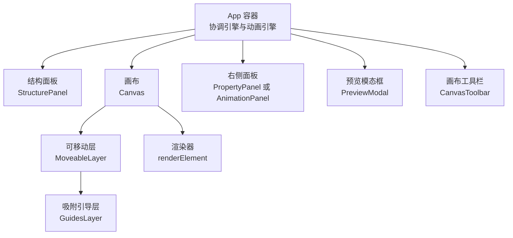
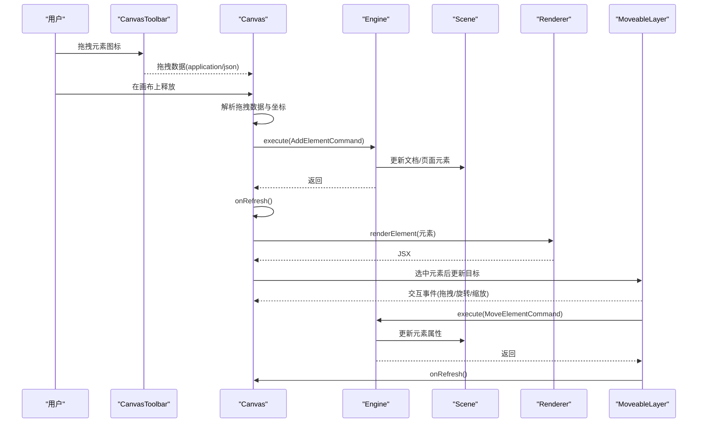
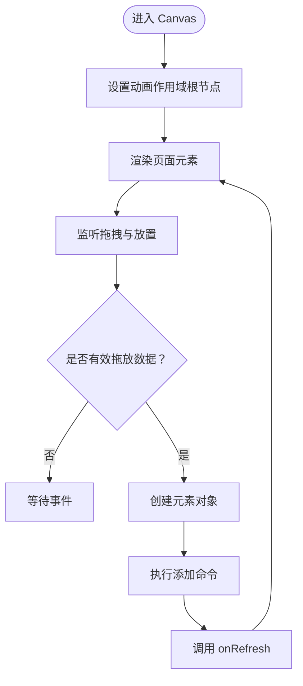
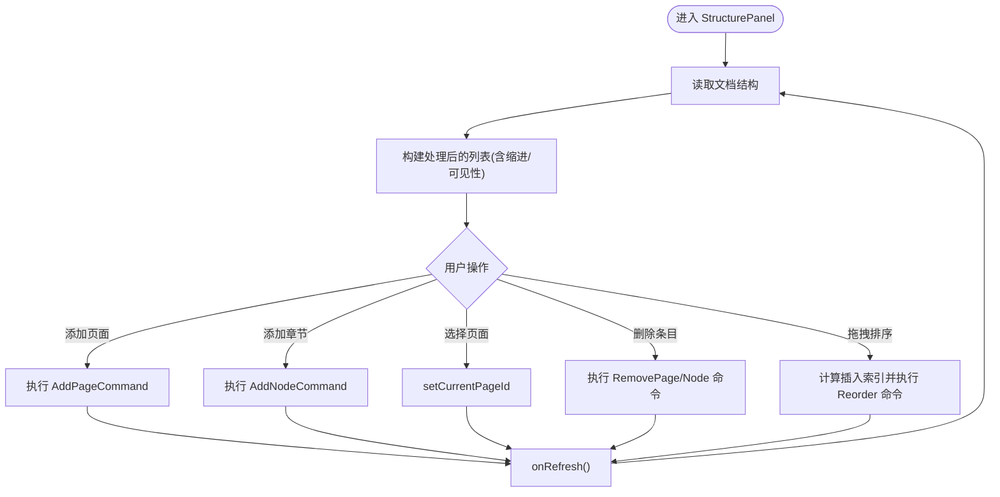
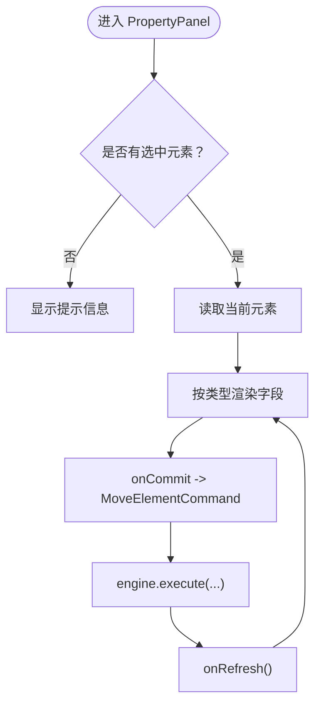
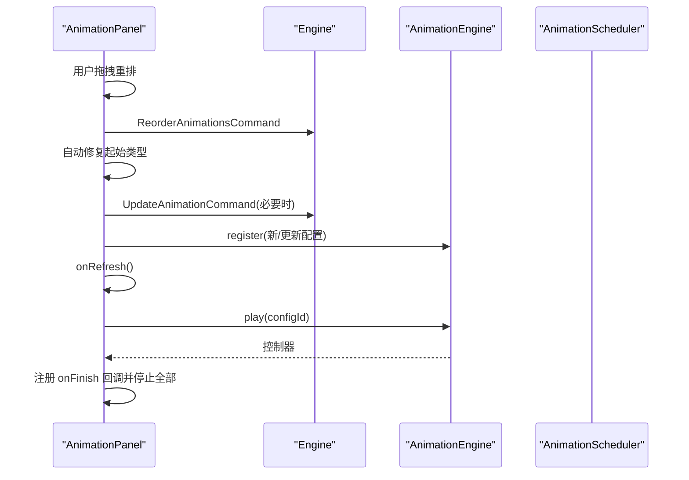
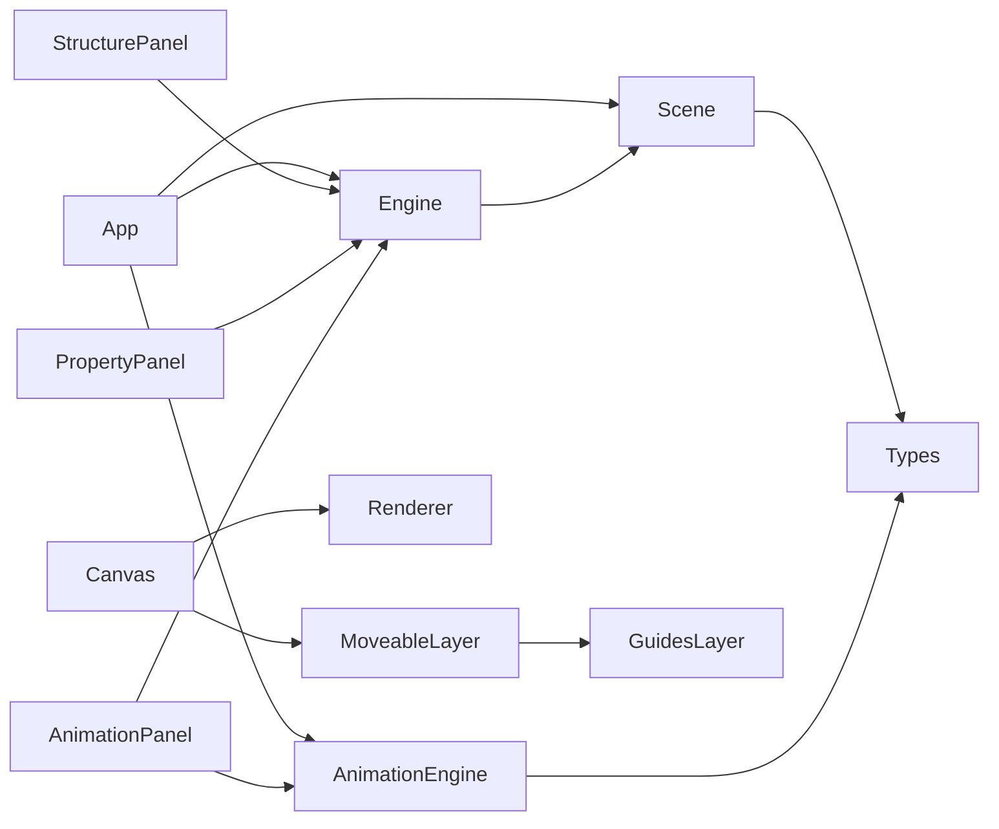

# 组件API

<cite>
**本文引用的文件**
- [src/App.tsx](file://src/App.tsx)
- [src/components/Canvas.tsx](file://src/components/Canvas.tsx)
- [src/components/CanvasToolbar.tsx](file://src/components/CanvasToolbar.tsx)
- [src/components/StructurePanel.tsx](file://src/components/StructurePanel.tsx)
- [src/components/PropertyPanel.tsx](file://src/components/PropertyPanel.tsx)
- [src/components/AnimationPanel.tsx](file://src/components/AnimationPanel.tsx)
- [src/components/MoveableLayer.tsx](file://src/components/MoveableLayer.tsx)
- [src/components/GuidesLayer.tsx](file://src/components/GuidesLayer.tsx)
- [src/components/PreviewModal.tsx](file://src/components/PreviewModal.tsx)
- [src/renderer/index.tsx](file://src/renderer/index.tsx)
- [src/engine/index.ts](file://src/engine/index.ts)
- [src/engine/engine.ts](file://src/engine/engine.ts)
- [src/engine/scene.ts](file://src/engine/scene.ts)
- [src/types/index.ts](file://src/types/index.ts)
- [src/types/animation.ts](file://src/types/animation.ts)
</cite>

## 目录
1. [简介](#简介)
2. [项目结构](#项目结构)
3. [核心组件](#核心组件)
4. [架构总览](#架构总览)
5. [组件详细分析](#组件详细分析)
6. [依赖关系分析](#依赖关系分析)
7. [性能考量](#性能考量)
8. [故障排查指南](#故障排查指南)
9. [结论](#结论)
10. [附录](#附录)

## 简介
本文件为 AI 课件编辑器 UI 组件的 API 参考与最佳实践指南，聚焦以下核心组件：Canvas、StructurePanel、PropertyPanel、AnimationPanel，并补充 CanvasToolbar、MoveableLayer、GuidesLayer、PreviewModal 的职责与交互。文档从接口定义、事件回调、生命周期方法、组件间通信与状态传递、样式与主题定制、组合与嵌套模式、响应式设计、性能优化与常见问题等方面进行系统化说明。

## 项目结构
应用采用“视图层组件 + 引擎层（场景/历史/时间线）+ 渲染层”的分层架构。App 作为根容器协调引擎与动画引擎，各面板组件通过 onRefresh 触发重渲染，Canvas 负责元素渲染与拖拽放置，MoveableLayer 提供可交互的变换控制与吸附引导，StructurePanel 管理页面与章节结构，PropertyPanel 编辑元素属性，AnimationPanel 管理页面动画序列与播放。

图表来源
- [src/App.tsx:155-341](file://src/App.tsx#L155-L341)
- [src/components/Canvas.tsx:22-128](file://src/components/Canvas.tsx#L22-L128)
- [src/components/MoveableLayer.tsx:15-188](file://src/components/MoveableLayer.tsx#L15-L188)
- [src/components/GuidesLayer.tsx:19-65](file://src/components/GuidesLayer.tsx#L19-L65)
- [src/renderer/index.tsx:189-202](file://src/renderer/index.tsx#L189-L202)
- [src/components/PreviewModal.tsx:13-355](file://src/components/PreviewModal.tsx#L13-L355)
- [src/components/CanvasToolbar.tsx:18-65](file://src/components/CanvasToolbar.tsx#L18-L65)

章节来源
- [src/App.tsx:11-341](file://src/App.tsx#L11-L341)

## 核心组件
本节对四大核心组件的 props 接口、事件回调、生命周期方法与职责进行梳理。

- Canvas
  - Props
    - engine: 引擎实例，提供场景与命令执行能力
    - animationEngine: 动画引擎实例，负责动画注册与播放
    - onRefresh: 刷新回调，用于触发重渲染
    - version: 版本号，驱动 MoveableLayer 同步更新
  - 事件与行为
    - 拖拽放置：接收来自 CanvasToolbar 的拖拽数据，创建元素并执行添加命令
    - 元素点击：更新编辑器选中状态
    - 画布空白点击：取消选中
    - 生命周期：挂载时设置动画作用域根节点，卸载时清理
  - 关键实现路径
    - [CanvasProps 定义:15-20](file://src/components/Canvas.tsx#L15-L20)
    - [拖拽与放置处理:39-69](file://src/components/Canvas.tsx#L39-L69)
    - [元素点击与画布点击处理:71-90](file://src/components/Canvas.tsx#L71-L90)
    - [动画作用域设置:27-32](file://src/components/Canvas.tsx#L27-L32)

- StructurePanel
  - Props
    - engine: 场景与命令执行
    - onRefresh: 刷新回调
  - 事件与行为
    - 添加页面/章节：执行相应命令并刷新
    - 选择页面：切换当前页
    - 删除条目：按类型删除页面或章节
    - 拖拽排序：基于结构项数组重排，自动计算插入索引与占位
  - 关键实现路径
    - [StructurePanelProps 定义:13-16](file://src/components/StructurePanel.tsx#L13-L16)
    - [添加页面/章节:48-75](file://src/components/StructurePanel.tsx#L48-L75)
    - [拖拽开始/经过/离开/放下:93-145](file://src/components/StructurePanel.tsx#L93-L145)
    - [结构项预处理与缩进/可见性计算:147-167](file://src/components/StructurePanel.tsx#L147-L167)

- PropertyPanel
  - Props
    - engine: 场景与命令执行
    - onRefresh: 刷新回调
  - 事件与行为
    - 当无选中元素时显示提示
    - 选中单一元素后根据类型渲染对应属性字段（位置、尺寸、旋转、透明度、形状/文本/图片特有属性）
    - 所有字段变更通过 MoveElementCommand 提交并刷新
  - 关键实现路径
    - [PropertyPanelProps 定义:7-10](file://src/components/PropertyPanel.tsx#L7-L10)
    - [属性字段通用组件（数值/文本/颜色/下拉）:90-255](file://src/components/PropertyPanel.tsx#L90-L255)
    - [形状/文本/图片专用字段:257-331](file://src/components/PropertyPanel.tsx#L257-L331)

- AnimationPanel
  - Props
    - engine: 场景与命令执行
    - animationEngine: 动画引擎实例
    - onRefresh: 刷新回调
  - 事件与行为
    - 列表：支持拖拽重排，自动修复起始类型；支持播放单个动画、从某步开始播放；支持删除
    - 表单：新增/编辑动画配置，参数随效果动态展示；提交时同步到动画引擎
    - 步骤与批次：根据 click 步骤构建步骤编号与批次关系指示
  - 关键实现路径
    - [AnimationPanelProps 定义:37-41](file://src/components/AnimationPanel.tsx#L37-L41)
    - [表单字段与参数构建:118-201](file://src/components/AnimationPanel.tsx#L118-L201)
    - [新增/更新/删除/播放/从这里播放:203-302](file://src/components/AnimationPanel.tsx#L203-L302)
    - [拖拽重排与起始类型修复:304-328](file://src/components/AnimationPanel.tsx#L304-L328)

章节来源
- [src/components/Canvas.tsx:15-128](file://src/components/Canvas.tsx#L15-L128)
- [src/components/StructurePanel.tsx:13-399](file://src/components/StructurePanel.tsx#L13-L399)
- [src/components/PropertyPanel.tsx:7-332](file://src/components/PropertyPanel.tsx#L7-L332)
- [src/components/AnimationPanel.tsx:37-549](file://src/components/AnimationPanel.tsx#L37-L549)

## 架构总览
组件间通信与状态传递遵循“命令驱动 + 单向数据流”原则：所有状态变更必须通过引擎执行命令完成，面板通过 onRefresh 触发重渲染，Canvas 将渲染委托给渲染器，MoveableLayer 与 GuidesLayer 提供交互与视觉反馈。

图表来源
- [src/components/CanvasToolbar.tsx:18-26](file://src/components/CanvasToolbar.tsx#L18-L26)
- [src/components/Canvas.tsx:39-69](file://src/components/Canvas.tsx#L39-L69)
- [src/engine/engine.ts:29-48](file://src/engine/engine.ts#L29-L48)
- [src/engine/scene.ts:94-135](file://src/engine/scene.ts#L94-L135)
- [src/renderer/index.tsx:189-202](file://src/renderer/index.tsx#L189-L202)
- [src/components/MoveableLayer.tsx:44-187](file://src/components/MoveableLayer.tsx#L44-L187)

章节来源
- [src/App.tsx:24-26](file://src/App.tsx#L24-L26)
- [src/components/Canvas.tsx:27-32](file://src/components/Canvas.tsx#L27-L32)
- [src/components/MoveableLayer.tsx:24-35](file://src/components/MoveableLayer.tsx#L24-L35)

## 组件详细分析

### Canvas 组件
- 接口与职责
  - 作为画布容器，承载元素渲染与交互事件
  - 处理来自工具栏的拖放，创建元素并加入场景
  - 管理动画作用域根节点，确保动画目标正确
- 事件与回调
  - onDragOver/onDrop：处理元素拖放
  - onPointerDown：画布空白处点击取消选中
  - handleElementClick：元素点击选中
- 生命周期
  - 挂载：设置 animationEngine 的作用域根节点
  - 卸载：清理作用域根节点
- 关键实现路径
  - [CanvasProps 与渲染循环:15-128](file://src/components/Canvas.tsx#L15-L128)
  - [动画作用域设置:27-32](file://src/components/Canvas.tsx#L27-L32)
  - [拖放与元素创建:44-69](file://src/components/Canvas.tsx#L44-L69)
  - [元素点击与画布点击:71-90](file://src/components/Canvas.tsx#L71-L90)

图表来源
- [src/components/Canvas.tsx:27-69](file://src/components/Canvas.tsx#L27-L69)

章节来源
- [src/components/Canvas.tsx:15-128](file://src/components/Canvas.tsx#L15-L128)

### StructurePanel 组件
- 接口与职责
  - 展示并管理页面与章节结构，支持增删改查与拖拽排序
- 事件与回调
  - 添加页面/章节：执行命令并刷新
  - 选择页面：切换当前页
  - 删除条目：按类型删除
  - 拖拽：计算插入位置，更新结构项顺序
- 关键实现路径
  - [结构项预处理与缩进/可见性:147-167](file://src/components/StructurePanel.tsx#L147-L167)
  - [拖拽逻辑与插入索引计算:100-145](file://src/components/StructurePanel.tsx#L100-L145)

图表来源
- [src/components/StructurePanel.tsx:32-145](file://src/components/StructurePanel.tsx#L32-L145)

章节来源
- [src/components/StructurePanel.tsx:13-399](file://src/components/StructurePanel.tsx#L13-L399)

### PropertyPanel 组件
- 接口与职责
  - 根据选中元素类型渲染属性面板，支持数值、文本、颜色、下拉等输入控件
- 事件与回调
  - 所有变更通过 MoveElementCommand 提交，统一由引擎执行
- 关键实现路径
  - [属性字段通用组件:90-255](file://src/components/PropertyPanel.tsx#L90-L255)
  - [形状/文本/图片字段:257-331](file://src/components/PropertyPanel.tsx#L257-L331)

图表来源
- [src/components/PropertyPanel.tsx:12-41](file://src/components/PropertyPanel.tsx#L12-L41)

章节来源
- [src/components/PropertyPanel.tsx:7-332](file://src/components/PropertyPanel.tsx#L7-L332)

### AnimationPanel 组件
- 接口与职责
  - 管理页面动画序列，支持新增/编辑/删除/播放/从这里播放/拖拽重排
- 事件与回调
  - 新增/更新：构建配置并提交命令，同步动画引擎
  - 播放：停止全部，播放指定动画或从某步开始
  - 拖拽重排：自动修复起始类型
- 关键实现路径
  - [表单字段与参数构建:118-201](file://src/components/AnimationPanel.tsx#L118-L201)
  - [播放控制与步骤映射:265-302](file://src/components/AnimationPanel.tsx#L265-L302)
  - [拖拽重排与起始类型修复:304-328](file://src/components/AnimationPanel.tsx#L304-L328)

图表来源
- [src/components/AnimationPanel.tsx:304-328](file://src/components/AnimationPanel.tsx#L304-L328)
- [src/components/AnimationPanel.tsx:224-245](file://src/components/AnimationPanel.tsx#L224-L245)

章节来源
- [src/components/AnimationPanel.tsx:37-549](file://src/components/AnimationPanel.tsx#L37-L549)

### CanvasToolbar 与 MoveableLayer/GuidesLayer/PreviewModal
- CanvasToolbar
  - 提供形状/文本/图片的拖拽源，设置拖拽数据
  - 关键实现路径：[拖拽源设置:18-26](file://src/components/CanvasToolbar.tsx#L18-L26)
- MoveableLayer
  - 集成 react-moveable，提供拖拽/旋转/缩放控制，结合吸附引擎与引导线
  - 关键实现路径：[交互事件与命令提交:44-187](file://src/components/MoveableLayer.tsx#L44-L187)
- GuidesLayer
  - 根据吸附结果绘制水平/垂直引导线
  - 关键实现路径：[引导线渲染:19-65](file://src/components/GuidesLayer.tsx#L19-L65)
- PreviewModal
  - 独立的预览环境，维护自身页面索引与步骤进度，键盘与点击驱动推进
  - 关键实现路径：[键盘事件与页面/步骤推进:92-140](file://src/components/PreviewModal.tsx#L92-L140)

章节来源
- [src/components/CanvasToolbar.tsx:18-65](file://src/components/CanvasToolbar.tsx#L18-L65)
- [src/components/MoveableLayer.tsx:15-188](file://src/components/MoveableLayer.tsx#L15-L188)
- [src/components/GuidesLayer.tsx:19-65](file://src/components/GuidesLayer.tsx#L19-L65)
- [src/components/PreviewModal.tsx:13-355](file://src/components/PreviewModal.tsx#L13-L355)

## 依赖关系分析
- 组件依赖
  - App 依赖引擎与动画引擎，协调右侧面板切换与预览
  - Canvas 依赖渲染器与 MoveableLayer
  - MoveableLayer 依赖吸附引擎与 GuidesLayer
  - StructurePanel/PropertyPanel/AnimationPanel 依赖引擎命令集
- 类型与数据模型
  - 元素类型与文档结构在 types 中定义，引擎 Scene 提供 CRUD 与查询
- 关键实现路径
  - [引擎导出与命令集合:4-15](file://src/engine/index.ts#L4-L15)
  - [引擎类与执行接口:7-49](file://src/engine/engine.ts#L7-L49)
  - [场景类与元素/动画 CRUD:3-247](file://src/engine/scene.ts#L3-L247)
  - [通用元素与文档类型:10-84](file://src/types/index.ts#L10-L84)
  - [动画类型与调度器类型:26-113](file://src/types/animation.ts#L26-L113)

图表来源
- [src/App.tsx:11-16](file://src/App.tsx#L11-L16)
- [src/engine/index.ts:4-15](file://src/engine/index.ts#L4-L15)
- [src/types/index.ts:10-84](file://src/types/index.ts#L10-L84)
- [src/types/animation.ts:26-113](file://src/types/animation.ts#L26-L113)

章节来源
- [src/engine/index.ts:1-16](file://src/engine/index.ts#L1-L16)
- [src/engine/engine.ts:7-49](file://src/engine/engine.ts#L7-L49)
- [src/engine/scene.ts:3-247](file://src/engine/scene.ts#L3-L247)
- [src/types/index.ts:10-84](file://src/types/index.ts#L10-L84)
- [src/types/animation.ts:26-113](file://src/types/animation.ts#L26-L113)

## 性能考量
- 渲染与重绘
  - 使用版本号驱动 MoveableLayer 同步更新，避免不必要的全量重算
  - 结构面板预处理结构项，减少渲染时的计算开销
- 事件处理
  - Canvas 的拖放与点击事件使用 useCallback 包裹，降低子组件重渲染频率
  - PropertyPanel 在无选中元素时直接返回提示，避免无效渲染
- 动画与调度
  - 预览模式独立维护调度器，避免干扰编辑态动画
  - 拖拽重排后自动修复起始类型，减少后续播放异常导致的额外重排
- 建议
  - 对高频交互（拖拽/缩放/旋转）尽量使用 requestAnimationFrame 同步更新
  - 合理拆分右侧面板内容，避免一次性渲染过多字段
  - 图片加载失败时使用占位符，减少错误处理对主线程的影响

[本节为通用指导，不直接分析具体文件]

## 故障排查指南
- 无法拖放元素到画布
  - 检查 CanvasToolbar 的拖拽数据是否正确设置
  - 确认 Canvas 的 onDragOver/onDrop 是否被触发
  - 参考：[Canvas 拖放处理:39-69](file://src/components/Canvas.tsx#L39-L69)、[CanvasToolbar 拖拽源:18-26](file://src/components/CanvasToolbar.tsx#L18-L26)
- 选中元素后无法拖动/旋转/缩放
  - 确认 MoveableLayer 的 target 已正确设置，且版本号变化触发了 updateRect
  - 检查吸附引擎返回的 guides 是否正确
  - 参考：[MoveableLayer 同步与吸附:24-35](file://src/components/MoveableLayer.tsx#L24-L35)、[GuidesLayer 渲染:19-65](file://src/components/GuidesLayer.tsx#L19-L65)
- 属性修改未生效
  - 确认已通过 MoveElementCommand 提交并执行
  - 检查 onRefresh 是否被调用
  - 参考：[PropertyPanel 提交流程:35-41](file://src/components/PropertyPanel.tsx#L35-L41)
- 动画播放异常
  - 检查动画起始类型是否与当前批次一致，必要时由拖拽重排自动修复
  - 确认动画引擎已注册对应配置
  - 参考：[起始类型修复:313-322](file://src/components/AnimationPanel.tsx#L313-L322)、[注册与播放:210-212](file://src/components/AnimationPanel.tsx#L210-L212)

章节来源
- [src/components/Canvas.tsx:39-69](file://src/components/Canvas.tsx#L39-L69)
- [src/components/CanvasToolbar.tsx:18-26](file://src/components/CanvasToolbar.tsx#L18-L26)
- [src/components/MoveableLayer.tsx:24-35](file://src/components/MoveableLayer.tsx#L24-L35)
- [src/components/GuidesLayer.tsx:19-65](file://src/components/GuidesLayer.tsx#L19-L65)
- [src/components/PropertyPanel.tsx:35-41](file://src/components/PropertyPanel.tsx#L35-L41)
- [src/components/AnimationPanel.tsx:313-322](file://src/components/AnimationPanel.tsx#L313-L322)

## 结论
本组件体系以命令驱动为核心，通过清晰的职责划分与单向数据流，实现了编辑态与预览态的解耦。Canvas 负责渲染与交互，StructurePanel/PropertyPanel/AnimationPanel 分别承担结构、属性与动画管理，MoveableLayer/GuidesLayer 提供高质量的可视化交互体验。遵循本文档的接口定义、事件回调与最佳实践，可在保证一致性的同时灵活扩展与定制。

[本节为总结性内容，不直接分析具体文件]

## 附录

### 组件组合与嵌套模式
- 基础布局
  - App 作为根容器，左侧 StructurePanel，中央 Canvas，右侧 PropertyPanel/AnimationPanel 切换
  - Canvas 内部嵌套 MoveableLayer 与 GuidesLayer，共同提供元素交互
- 响应式设计
  - 画布固定宽高比（960x540），通过容器自适应与阴影增强层次感
  - 右侧面板宽度固定，内部滚动区域限制最大高度
- 主题与样式覆盖
  - 组件内联样式为主，可通过外部容器样式覆盖整体外观
  - 颜色与边框采用统一色板，便于主题切换

章节来源
- [src/App.tsx:281-341](file://src/App.tsx#L281-L341)
- [src/components/Canvas.tsx:92-127](file://src/components/Canvas.tsx#L92-L127)
- [src/components/AnimationPanel.tsx:361-548](file://src/components/AnimationPanel.tsx#L361-L548)

### 数据模型与类型参考
- 元素类型与文档结构
  - 元素：基础属性 + 形状/文本/图片特有属性
  - 文档：页面集合、节点集合、结构项列表、当前页 ID
- 动画类型
  - 效果类型（进入/强调/退出）、起始类型（点击/与前一个/后一个）、缓动预设、参数类型
- 关键实现路径
  - [元素与文档类型定义:10-84](file://src/types/index.ts#L10-L84)
  - [动画类型与调度器类型:26-113](file://src/types/animation.ts#L26-L113)

章节来源
- [src/types/index.ts:10-84](file://src/types/index.ts#L10-L84)
- [src/types/animation.ts:26-113](file://src/types/animation.ts#L26-L113)