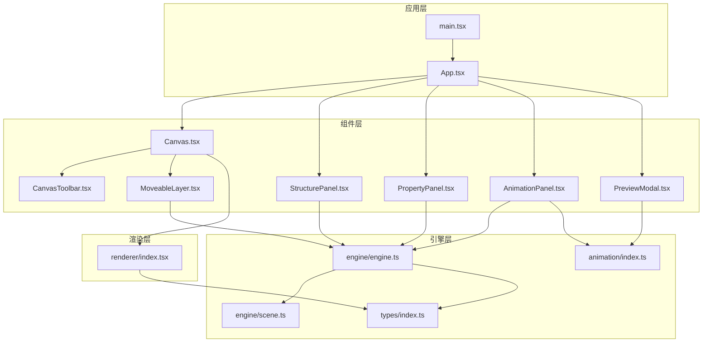
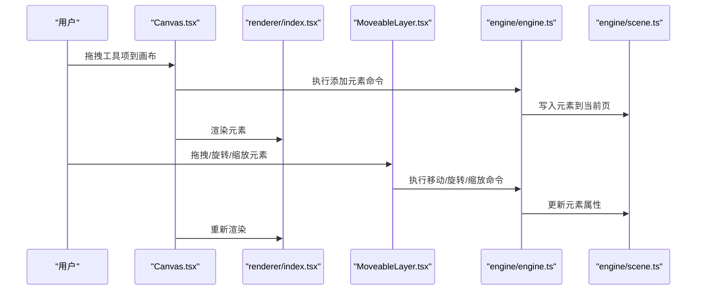
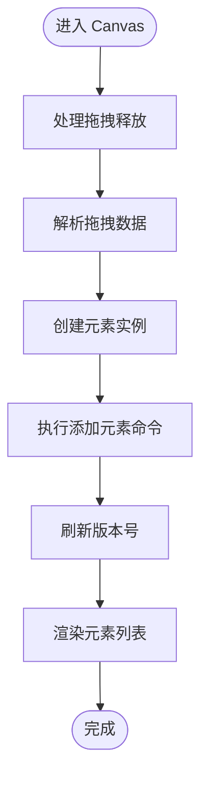
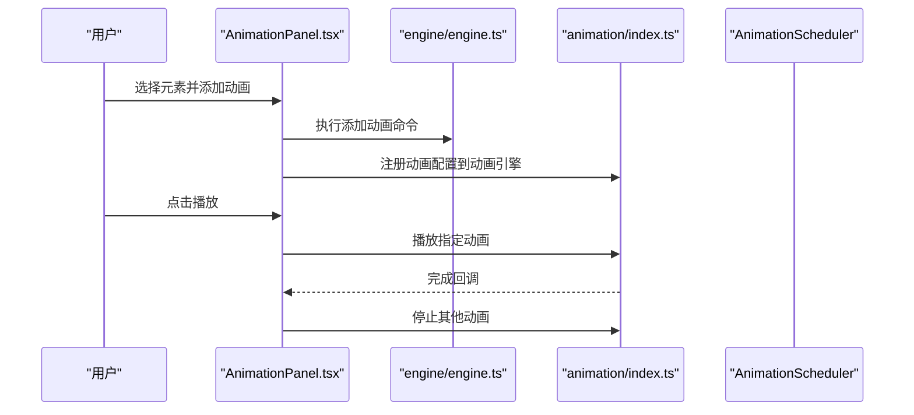
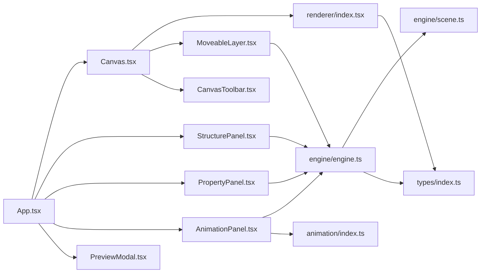

# UI组件系统

<cite>
**本文档引用的文件**
- [src/App.tsx](file://src/App.tsx)
- [src/main.tsx](file://src/main.tsx)
- [src/components/Canvas.tsx](file://src/components/Canvas.tsx)
- [src/components/CanvasToolbar.tsx](file://src/components/CanvasToolbar.tsx)
- [src/components/StructurePanel.tsx](file://src/components/StructurePanel.tsx)
- [src/components/PropertyPanel.tsx](file://src/components/PropertyPanel.tsx)
- [src/components/AnimationPanel.tsx](file://src/components/AnimationPanel.tsx)
- [src/components/MoveableLayer.tsx](file://src/components/MoveableLayer.tsx)
- [src/components/PreviewModal.tsx](file://src/components/PreviewModal.tsx)
- [src/renderer/index.tsx](file://src/renderer/index.tsx)
- [src/engine/index.ts](file://src/engine/index.ts)
- [src/engine/engine.ts](file://src/engine/engine.ts)
- [src/engine/scene.ts](file://src/engine/scene.ts)
- [src/types/index.ts](file://src/types/index.ts)
- [src/animation/index.ts](file://src/animation/index.ts)
</cite>

## 目录
1. [简介](#简介)
2. [项目结构](#项目结构)
3. [核心组件](#核心组件)
4. [架构总览](#架构总览)
5. [组件详细分析](#组件详细分析)
6. [依赖关系分析](#依赖关系分析)
7. [性能与可访问性](#性能与可访问性)
8. [故障排查指南](#故障排查指南)
9. [结论](#结论)
10. [附录：使用示例与最佳实践](#附录使用示例与最佳实践)

## 简介
本UI组件系统是一个基于React的可视化编辑器，围绕“场景-引擎-渲染”三层架构构建，提供页面结构管理、元素绘制与交互、动画编排与预览等功能。系统通过命令模式保证状态变更的可追踪与可撤销；通过渲染器统一输出不同类型的元素（形状、文本、图片）；通过动画引擎与调度器实现分步播放与预览。

## 项目结构
- 应用入口与根组件：main.tsx -> App.tsx
- 组件层：Canvas、CanvasToolbar、StructurePanel、PropertyPanel、AnimationPanel、MoveableLayer、PreviewModal
- 渲染层：renderer/index.tsx（统一渲染元素与缩略图）
- 引擎层：engine/*（场景、历史、时间轴、命令、吸附等）
- 类型定义：types/index.ts（元素、文档、动画、编辑态等）
- 动画适配层：animation/*（Web动画适配、GSAP适配、调度器）

图表来源
- [src/main.tsx:1-10](file://src/main.tsx#L1-L10)
- [src/App.tsx:1-344](file://src/App.tsx#L1-L344)
- [src/components/Canvas.tsx:1-191](file://src/components/Canvas.tsx#L1-L191)
- [src/components/CanvasToolbar.tsx:1-66](file://src/components/CanvasToolbar.tsx#L1-L66)
- [src/components/StructurePanel.tsx:1-400](file://src/components/StructurePanel.tsx#L1-L400)
- [src/components/PropertyPanel.tsx:1-332](file://src/components/PropertyPanel.tsx#L1-L332)
- [src/components/AnimationPanel.tsx:1-857](file://src/components/AnimationPanel.tsx#L1-L857)
- [src/components/MoveableLayer.tsx:1-189](file://src/components/MoveableLayer.tsx#L1-L189)
- [src/components/PreviewModal.tsx:1-355](file://src/components/PreviewModal.tsx#L1-L355)
- [src/renderer/index.tsx:1-314](file://src/renderer/index.tsx#L1-L314)
- [src/engine/engine.ts:1-54](file://src/engine/engine.ts#L1-L54)
- [src/engine/scene.ts:1-273](file://src/engine/scene.ts#L1-L273)
- [src/types/index.ts:1-159](file://src/types/index.ts#L1-L159)
- [src/animation/index.ts:1-8](file://src/animation/index.ts#L1-L8)

章节来源
- [src/main.tsx:1-10](file://src/main.tsx#L1-L10)
- [src/App.tsx:1-344](file://src/App.tsx#L1-L344)

## 核心组件
- App：应用根容器，协调引擎、动画引擎、右侧面板切换、预览弹窗、键盘快捷键与撤销重做。
- Canvas：画布区域，承载元素渲染、拖拽添加、点击选择、指针事件处理。
- CanvasToolbar：工具栏，提供形状、文本、图片的拖拽源。
- StructurePanel：结构面板，管理页面与节点的增删改查、拖拽排序、缩略图预览。
- PropertyPanel：属性面板，按元素类型显示与编辑属性（位置、尺寸、旋转、透明度、填充、描边、文本内容、对齐、图片资源与填充方式等）。
- AnimationPanel：动画面板，管理动画配置（效果、起始方式、时长、延迟、缓动、重复次数、启用状态），支持拖拽排序、参数化配置、单动画播放与从当前步骤播放。
- MoveableLayer：可移动层，基于第三方库提供拖拽、旋转、缩放能力，并结合吸附算法与引导线。
- PreviewModal：全屏预览模态，独立维护页面顺序与动画步骤，支持键盘导航与页面切换。
- renderer：统一渲染器，根据元素类型输出SVG或DOM节点，并提供缩略图渲染。
- engine：命令执行器，封装场景、历史、时间轴，所有状态变更必须通过命令执行。
- types：共享类型定义，涵盖元素、文档、动画、编辑态等。

章节来源
- [src/App.tsx:11-344](file://src/App.tsx#L11-L344)
- [src/components/Canvas.tsx:22-191](file://src/components/Canvas.tsx#L22-L191)
- [src/components/CanvasToolbar.tsx:18-66](file://src/components/CanvasToolbar.tsx#L18-L66)
- [src/components/StructurePanel.tsx:32-400](file://src/components/StructurePanel.tsx#L32-L400)
- [src/components/PropertyPanel.tsx:12-332](file://src/components/PropertyPanel.tsx#L12-L332)
- [src/components/AnimationPanel.tsx:87-857](file://src/components/AnimationPanel.tsx#L87-L857)
- [src/components/MoveableLayer.tsx:15-189](file://src/components/MoveableLayer.tsx#L15-L189)
- [src/components/PreviewModal.tsx:13-355](file://src/components/PreviewModal.tsx#L13-L355)
- [src/renderer/index.tsx:14-314](file://src/renderer/index.tsx#L14-L314)
- [src/engine/engine.ts:7-54](file://src/engine/engine.ts#L7-L54)
- [src/engine/scene.ts:3-273](file://src/engine/scene.ts#L3-L273)
- [src/types/index.ts:10-159](file://src/types/index.ts#L10-L159)

## 架构总览
系统采用“命令驱动 + 场景数据 + 渲染器”的架构：
- 命令驱动：所有修改均通过命令对象执行，保证可撤销/重做与一致性。
- 场景数据：Document/Page/Element/AnimationConfig集中存储在Scene中，提供CRUD与查询接口。
- 渲染器：根据元素类型输出React节点，统一处理选中框、事件透传与缩略图。
- 动画引擎：接收Scene中的动画配置，构建关键帧与步骤，支持调度播放与预览。

图表来源
- [src/components/Canvas.tsx:44-77](file://src/components/Canvas.tsx#L44-L77)
- [src/components/MoveableLayer.tsx:54-183](file://src/components/MoveableLayer.tsx#L54-L183)
- [src/renderer/index.tsx:189-202](file://src/renderer/index.tsx#L189-L202)
- [src/engine/engine.ts:29-48](file://src/engine/engine.ts#L29-L48)
- [src/engine/scene.ts:94-135](file://src/engine/scene.ts#L94-L135)

## 组件详细分析

### Canvas 组件
- 职责：承载画布容器、元素渲染、拖拽添加、点击选择、指针事件处理。
- 关键交互：
  - 拖拽添加：工具栏拖拽到画布后创建元素并加入场景。
  - 点击选择：点击元素更新编辑态选中集合。
  - 空白处点击：取消选择。
- 与渲染器协作：调用渲染器输出元素节点，并传递选中态与点击回调。
- 与动画引擎协作：设置动画作用域根节点，确保动画目标定位正确。

图表来源
- [src/components/Canvas.tsx:44-77](file://src/components/Canvas.tsx#L44-L77)
- [src/components/Canvas.tsx:130-190](file://src/components/Canvas.tsx#L130-L190)
- [src/renderer/index.tsx:189-202](file://src/renderer/index.tsx#L189-L202)

章节来源
- [src/components/Canvas.tsx:15-191](file://src/components/Canvas.tsx#L15-L191)
- [src/renderer/index.tsx:189-202](file://src/renderer/index.tsx#L189-L202)

### CanvasToolbar 工具栏
- 职责：提供形状、文本、图片的拖拽源，设置拖拽数据类型与形状类型。
- 行为：拖拽开始时序列化类型信息，供画布接收。

章节来源
- [src/components/CanvasToolbar.tsx:18-66](file://src/components/CanvasToolbar.tsx#L18-L66)

### StructurePanel 结构面板
- 职责：管理页面与节点的增删改查、拖拽排序、折叠展开、缩略图预览。
- 关键逻辑：
  - 处理拖拽排序：计算插入位置，修正结构项顺序。
  - 折叠节点：控制节点下页面的可见性。
  - 删除项：区分页面与节点，分别执行删除命令。
  - 缩略图渲染：按比例缩放页面元素以生成缩略图。

章节来源
- [src/components/StructurePanel.tsx:32-400](file://src/components/StructurePanel.tsx#L32-L400)
- [src/renderer/index.tsx:300-314](file://src/renderer/index.tsx#L300-L314)

### PropertyPanel 属性面板
- 职责：根据选中元素类型显示对应属性表单，支持数值、颜色、文本、下拉等输入控件。
- 行为：
  - Transform：X/Y/宽/高/旋转/透明度。
  - Shape：类型、填充、描边、描边宽度。
  - Text：内容、字号、颜色、对齐。
  - Image：资源地址、填充方式。
  - 提交：通过命令更新元素属性并刷新。

章节来源
- [src/components/PropertyPanel.tsx:12-332](file://src/components/PropertyPanel.tsx#L12-L332)

### AnimationPanel 动画面板
- 职责：管理页面内元素的动画配置，支持效果选择、参数化配置、起始方式、时序编排与播放控制。
- 关键特性：
  - 效果分类：进入/强调/退出三类，内置默认参数与校验。
  - 参数化：滑动距离、缩放范围、旋转角度、亮度等。
  - 起始方式：点击新步骤、与前一动画同批次、在前一动画之后新批次。
  - 拖拽排序：使用@dnd-kit实现，自动修复起始方式。
  - 步骤与批处理：构建点击步骤，支持从某一步开始播放。
  - 单动画播放：立即播放指定动画并自动停止其他动画。
  - 同步引擎：新增/更新/删除动画时同步注册到动画引擎。

图表来源
- [src/components/AnimationPanel.tsx:203-215](file://src/components/AnimationPanel.tsx#L203-L215)
- [src/components/AnimationPanel.tsx:224-245](file://src/components/AnimationPanel.tsx#L224-L245)
- [src/components/AnimationPanel.tsx:252-263](file://src/components/AnimationPanel.tsx#L252-L263)
- [src/components/AnimationPanel.tsx:265-302](file://src/components/AnimationPanel.tsx#L265-L302)
- [src/animation/index.ts:1-8](file://src/animation/index.ts#L1-L8)

章节来源
- [src/components/AnimationPanel.tsx:87-857](file://src/components/AnimationPanel.tsx#L87-L857)

### MoveableLayer 可移动层
- 职责：为选中元素提供拖拽、旋转、缩放的交互体验，并结合吸附算法与引导线。
- 关键点：
  - 目标同步：根据编辑态选中集合动态更新可移动目标。
  - 拖拽/旋转/缩放事件：计算最终位置与尺寸，执行命令更新场景。
  - 吸附：计算相邻元素与画布边界，返回吸附结果与引导线。
  - 视觉同步：在命令执行前预应用变换，避免视觉跳变。

章节来源
- [src/components/MoveableLayer.tsx:15-189](file://src/components/MoveableLayer.tsx#L15-L189)

### PreviewModal 预览模态
- 职责：独立于编辑态的全屏预览，维护自己的页面索引与动画步骤，支持键盘导航与页面切换。
- 行为：
  - 页面顺序：从结构项中提取页面ID列表。
  - 动画同步：将当前页面动画注册到共享动画引擎，构建调度器。
  - 键盘控制：空格/回车前进、左右箭头/上下箭头翻页、Esc退出。
  - 步骤指示：显示当前步骤与总步数。

章节来源
- [src/components/PreviewModal.tsx:13-355](file://src/components/PreviewModal.tsx#L13-L355)

### 渲染器 renderer
- 职责：根据元素类型输出React节点，统一处理样式、事件与选中框。
- 支持类型：形状（矩形/圆形/三角形）、文本、图片。
- 特性：缩略图渲染（无事件与选中框），占位图处理。

章节来源
- [src/renderer/index.tsx:14-314](file://src/renderer/index.tsx#L14-L314)

### 引擎 engine 与场景 scene
- Engine：封装Scene、History、Timeline，提供命令执行、撤销重做、编辑态读写。
- Scene：提供文档、页面、节点、元素、动画的CRUD与查询方法，维护结构顺序与父子关系。

章节来源
- [src/engine/engine.ts:7-54](file://src/engine/engine.ts#L7-L54)
- [src/engine/scene.ts:3-273](file://src/engine/scene.ts#L3-L273)

### 类型定义 types
- 元素类型：基础属性（位置、尺寸、旋转、透明度、可见性、父子关系）+ 三种具体类型（形状/文本/图片）。
- 文档结构：页面、节点、结构项、当前页ID。
- 动画相关：动画配置、关键帧、缓动函数。
- 编辑态：选中元素、视口、工具模式、悬停元素。

章节来源
- [src/types/index.ts:10-159](file://src/types/index.ts#L10-L159)

## 依赖关系分析

图表来源
- [src/App.tsx:1-344](file://src/App.tsx#L1-L344)
- [src/components/Canvas.tsx:1-191](file://src/components/Canvas.tsx#L1-L191)
- [src/components/StructurePanel.tsx:1-400](file://src/components/StructurePanel.tsx#L1-L400)
- [src/components/PropertyPanel.tsx:1-332](file://src/components/PropertyPanel.tsx#L1-L332)
- [src/components/AnimationPanel.tsx:1-857](file://src/components/AnimationPanel.tsx#L1-L857)
- [src/components/MoveableLayer.tsx:1-189](file://src/components/MoveableLayer.tsx#L1-L189)
- [src/components/PreviewModal.tsx:1-355](file://src/components/PreviewModal.tsx#L1-L355)
- [src/renderer/index.tsx:1-314](file://src/renderer/index.tsx#L1-L314)
- [src/engine/engine.ts:1-54](file://src/engine/engine.ts#L1-L54)
- [src/engine/scene.ts:1-273](file://src/engine/scene.ts#L1-L273)
- [src/types/index.ts:1-159](file://src/types/index.ts#L1-L159)
- [src/animation/index.ts:1-8](file://src/animation/index.ts#L1-L8)

章节来源
- [src/App.tsx:1-344](file://src/App.tsx#L1-L344)

## 性能与可访问性

### 性能考虑
- 渲染优化
  - 使用版本号驱动的强制刷新策略，仅在必要时触发重渲染（如撤销/重做、动画状态变化）。
  - MoveableLayer在每次外部状态变化后通过requestAnimationFrame同步矩形，避免闪烁。
  - 渲染器按元素类型分支输出，减少不必要的计算。
- 动画调度
  - AnimationScheduler按步骤批量播放，避免逐帧抖动。
  - 预览模式独立维护动画引擎实例，避免与编辑态互相干扰。
- 事件与拖拽
  - Canvas与MoveableLayer的事件绑定集中在组件内部，避免全局监听带来的性能损耗。
  - 拖拽数据通过dataTransfer传递，降低跨组件通信成本。

### 可访问性（无障碍）指导
- 键盘操作
  - 支持撤销/重做（Ctrl/Cmd+Z / Y）、删除（Delete/Backspace）、预览（按钮与快捷键）。
  - 预览模式支持空格/回车前进、方向键翻页、Esc退出。
- 焦点与语义
  - 按钮与输入框具备基本的可聚焦性与可读性，建议在实际产品中补充aria-label与role。
- 视觉反馈
  - 选中框、禁用态、高亮态的颜色对比度满足基础可读性要求，建议进一步评估WCAG标准。

[本节为通用指导，不直接分析具体文件]

## 故障排查指南
- 无法撤销/重做
  - 检查编辑态是否正确更新，确认命令已通过引擎执行。
  - 章节来源
    - [src/engine/engine.ts:29-48](file://src/engine/engine.ts#L29-L48)
- 元素未被渲染或选中无效
  - 确认渲染器传入的元素ID与data-element-id一致，检查选中集合是否更新。
  - 章节来源
    - [src/renderer/index.tsx:76-91](file://src/renderer/index.tsx#L76-L91)
    - [src/components/Canvas.tsx:71-77](file://src/components/Canvas.tsx#L71-L77)
- 拖拽添加失败
  - 检查工具栏拖拽数据是否正确序列化，画布是否正确解析JSON。
  - 章节来源
    - [src/components/CanvasToolbar.tsx:19-26](file://src/components/CanvasToolbar.tsx#L19-L26)
    - [src/components/Canvas.tsx:47-55](file://src/components/Canvas.tsx#L47-L55)
- 动画不生效
  - 确认动画已注册到动画引擎且处于启用状态，检查步骤构建与调度器加载。
  - 章节来源
    - [src/components/AnimationPanel.tsx:211-215](file://src/components/AnimationPanel.tsx#L211-L215)
    - [src/components/AnimationPanel.tsx:337-347](file://src/components/AnimationPanel.tsx#L337-L347)
- 预览无法播放
  - 确认预览页面动画已注册到共享动画引擎，键盘事件监听是否正常。
  - 章节来源
    - [src/components/PreviewModal.tsx:43-53](file://src/components/PreviewModal.tsx#L43-L53)
    - [src/components/PreviewModal.tsx:101-140](file://src/components/PreviewModal.tsx#L101-L140)

## 结论
该UI组件系统通过清晰的分层与命令模式实现了稳定的编辑体验，渲染器与动画引擎解耦良好，预览与编辑态互不干扰。组件职责明确、交互自然，适合扩展更多元素类型与动画效果。建议后续在可访问性、主题系统与跨浏览器兼容性方面持续完善。

[本节为总结，不直接分析具体文件]

## 附录：使用示例与最佳实践

### 使用示例（路径指引）
- 在画布上添加元素
  - 通过工具栏拖拽到画布，系统会创建元素并加入场景。
  - 章节来源
    - [src/components/CanvasToolbar.tsx:18-66](file://src/components/CanvasToolbar.tsx#L18-L66)
    - [src/components/Canvas.tsx:44-77](file://src/components/Canvas.tsx#L44-L77)
- 选择元素并修改属性
  - 点击元素进行选择，右侧属性面板显示对应字段。
  - 章节来源
    - [src/components/Canvas.tsx:71-77](file://src/components/Canvas.tsx#L71-L77)
    - [src/components/PropertyPanel.tsx:12-332](file://src/components/PropertyPanel.tsx#L12-L332)
- 为元素添加动画
  - 在动画面板选择效果与参数，设置起始方式与时序，点击播放验证。
  - 章节来源
    - [src/components/AnimationPanel.tsx:87-857](file://src/components/AnimationPanel.tsx#L87-L857)
- 进入全屏预览
  - 点击“Full Preview”，使用空格/回车前进，方向键翻页，Esc退出。
  - 章节来源
    - [src/App.tsx:258-278](file://src/App.tsx#L258-L278)
    - [src/components/PreviewModal.tsx:13-355](file://src/components/PreviewModal.tsx#L13-L355)

### 最佳实践
- 保持状态变更通过命令执行，确保可撤销/重做链路完整。
- 在渲染器中统一处理事件透传与选中框，避免在业务组件中重复实现。
- 动画配置与步骤构建分离，便于调试与复用。
- 预览模式独立维护动画引擎实例，避免与编辑态相互影响。
- 对复杂交互（拖拽、旋转、缩放）使用MoveableLayer封装，减少重复逻辑。

[本节为通用指导，不直接分析具体文件]